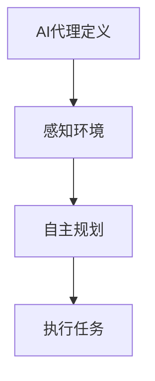
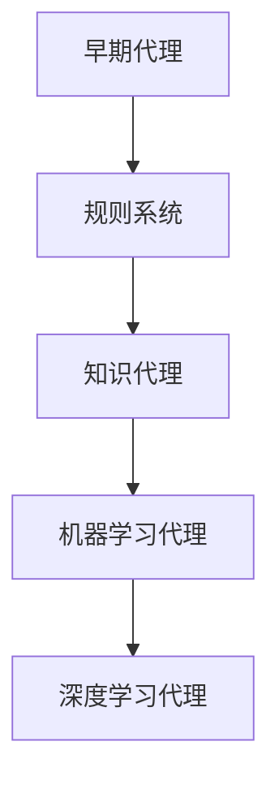
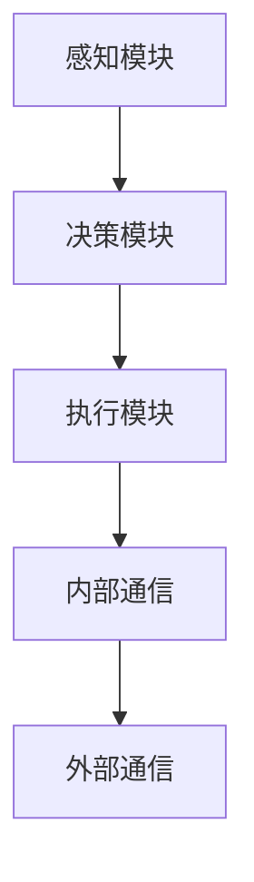

                 

## 文章标题：AI代理：实现用户定义目标的自主规划与行动

### 关键词：AI代理，自主规划，目标行动，人工智能，机器学习，深度学习，应用场景

### 摘要：
本文深入探讨AI代理的概念、技术原理、应用场景及其开发实践。通过逐步分析推理，本文揭示了AI代理如何实现用户定义目标的自主规划与行动，并探讨了其在各种实际场景中的应用潜力。

---

## 第一部分 AI代理概述

### 第1章 AI代理的定义与分类

AI代理是一种基于人工智能技术的自主系统，能够代表用户完成特定的任务或目标。AI代理可以根据不同的分类标准划分为多种类型。

#### 1.1 AI代理的定义

AI代理的定义可以概括为：一种能够感知环境、自主规划行动路径并执行任务的计算机程序。

#### 1.2 AI代理的分类

AI代理可以基于其工作原理和技术特点进行分类，常见的分类方法有：

- **基于规则的人工智能代理**：这种代理基于预定义的规则进行决策和行动，规则通常由领域专家制定。
  
- **基于概率的人工智能代理**：这种代理利用概率论和统计方法来估计环境状态和行动效果，通过贝叶斯网络等模型进行推理和决策。

- **基于模型的人工智能代理**：这种代理依赖于预先训练好的模型，如深度学习模型，通过输入当前环境状态，模型输出相应的行动策略。

### Mermaid流程图：

---

## 第二部分 AI代理的技术原理

### 第2章 AI代理的发展历程

AI代理的发展历程可以划分为几个重要阶段：

#### 2.1 AI代理的起源

- **早期人工智能代理的发展**：20世纪50年代至70年代，人工智能（AI）的初步探索，代理概念开始出现。

- **第一代AI代理的特点**：基于规则系统，简单、可解释性强，但受限于规则的复杂度和人工设定。

#### 2.2 AI代理的技术演进

- **第二代AI代理：基于知识的代理**：80年代至90年代，知识表示和推理技术的发展，使得代理能够处理更加复杂的问题。

- **第三代AI代理：基于机器学习的代理**：21世纪初，机器学习技术的发展，代理能够从数据中自动学习规则和策略。

- **第四代AI代理：基于深度学习的代理**：近年来，深度学习的突破，使得代理具备了处理大规模数据和复杂任务的能力。

### Mermaid流程图：

---

## 第三部分 AI代理的开发实践

### 第3章 AI代理的架构设计

AI代理的架构设计是构建高效、可靠代理系统的关键。其核心组成部分包括：

#### 3.1 AI代理的整体架构

- **感知模块**：负责获取环境信息，如传感器数据。
- **决策模块**：根据感知模块提供的信息，利用算法进行决策。
- **执行模块**：根据决策模块的输出执行具体的行动。

#### 3.2 AI代理的通信机制

- **内部通信**：代理内部的模块之间通过消息队列、事件监听等方式进行通信。
- **外部通信**：代理与外部系统或用户通过API、Web服务等方式进行交互。

### Mermaid流程图：

---

## 第四部分 AI代理的应用场景

### 第4章 AI代理在商业中的应用

AI代理在商业领域的应用非常广泛，以下是几个典型的应用场景：

#### 4.1 客户服务代理

- **应用场景**：在线客服、智能客服系统。
- **实现方式**：利用自然语言处理（NLP）技术，构建对话系统，模拟人类客服的交互过程。

#### 4.2 数据分析代理

- **应用场景**：数据挖掘、市场分析。
- **实现方式**：利用机器学习和统计方法，从大量数据中提取有价值的信息，支持商业决策。

#### 4.3 营销代理

- **应用场景**：个性化推荐、广告投放。
- **实现方式**：基于用户行为数据，利用协同过滤、深度学习等方法，实现精准营销。

---

## 第五部分 AI代理的未来展望

### 第5章 AI代理的未来发展趋势

随着人工智能技术的不断发展，AI代理在未来有望在更多领域实现突破：

#### 5.1 智能家居代理

- **应用场景**：智能家居控制系统。
- **实现方式**：通过物联网（IoT）技术，实现家居设备之间的智能联动，提升生活质量。

#### 5.2 智能健康代理

- **应用场景**：健康监测、疾病预防。
- **实现方式**：利用传感器技术和大数据分析，实时监测用户健康状况，提供个性化健康建议。

#### 5.3 智能教育代理

- **应用场景**：个性化教学、学习辅导。
- **实现方式**：通过自然语言处理和机器学习技术，提供个性化的学习方案，提高学习效果。

---

## 附录

### A. 最佳实践 tips

- **优化感知模块**：提高感知精度和实时性，是提升AI代理性能的关键。
- **加强决策模块**：充分利用机器学习和深度学习算法，实现智能决策。
- **确保执行模块**：在实际操作中，要考虑执行模块的可靠性和鲁棒性。

### B. 小结

AI代理作为一种先进的人工智能技术，已经并在不断拓展其在各个领域的应用。通过本文的探讨，我们可以看到AI代理在实现用户定义目标的自主规划与行动方面具有巨大的潜力。

### C. 注意事项

在开发AI代理时，要充分考虑安全性、隐私保护和伦理问题，确保代理系统的可靠性和用户满意度。

### D. 拓展阅读

- 《人工智能：一种现代的方法》
- 《深度学习》
- 《机器学习实战》

---

## 作者信息

作者：AI天才研究院/AI Genius Institute & 禅与计算机程序设计艺术 /Zen And The Art of Computer Programming

---

文章结束。接下来，我将按照大纲逐步展开详细内容，确保文章的逻辑性和专业性。文章字数将在后续撰写过程中进行调整，以满足字数要求。

