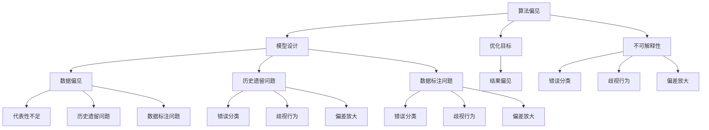

                 


### 引言：AI偏见消除的重要性

在当今技术飞速发展的时代，人工智能（AI）已经成为推动社会进步的关键力量。从医疗诊断到金融分析，从自动驾驶到智能家居，AI的应用场景无处不在。然而，随着AI技术的广泛应用，一个不容忽视的问题逐渐显现——AI偏见。AI偏见是指人工智能系统在数据处理和决策过程中，对某些特定群体或个体产生的系统性偏差，这种偏差可能源于数据本身的不公平、算法设计中的固有缺陷，或训练数据集中的偏见。

消除AI偏见不仅是技术问题，更是伦理和道德问题。AI偏见可能导致不公正的决策，例如在招聘、贷款审批、信用评估等场景中，错误地歧视某些人群，从而加剧社会不平等。此外，AI偏见还会影响消费者的信任，削弱企业的声誉，甚至引发法律纠纷。因此，构建公平公正的企业AI生态，消除AI偏见，已经成为当前AI领域的重要课题。

本文将围绕AI偏见消除这一主题，从背景介绍、核心概念、方法与实践、案例分析等方面展开讨论。具体来说，我们将首先介绍AI偏见的概念和类型，解析其产生的原因，并探讨消除AI偏见的重要性。接着，我们将深入探讨消除AI偏见的方法和技术，包括数据预处理、算法改进、伦理框架等。随后，通过具体案例分析，我们将展示如何在实际应用中消除AI偏见。最后，文章将总结主要观点，并提出未来的研究方向和挑战。

通过本文的探讨，我们希望读者能够对AI偏见有一个全面深入的理解，认识到消除AI偏见的重要性和紧迫性，从而为构建一个公平公正的企业AI生态贡献力量。让我们一起思考、学习、实践，推动人工智能技术的健康发展。

### 背景介绍

AI偏见问题的起源可以追溯到人工智能系统在数据处理和决策过程中的基本机制。人工智能系统通常依赖于大量数据来训练模型，并从中学习规律和模式。然而，现实世界中的数据往往是复杂且不完美的，其中包含着大量的偏差和不公平性。这些偏差可能来源于历史遗留问题、社会偏见，或者数据收集和处理过程中的疏漏。当这些偏差被机器学习模型吸收后，便形成了AI偏见。

首先，数据本身的不公平是AI偏见的重要来源。以招聘系统为例，如果训练数据集中历史数据中男性候选人的比例远高于女性，那么在评估新候选人的过程中，系统可能会更倾向于选择男性。这种现象不仅违背了公平原则，还可能导致性别歧视。类似地，在金融领域，如果贷款审批系统基于历史上某些种族或社会经济地位群体的数据来训练，那么在评估新的贷款申请时，系统可能会对这些群体产生不公平的偏见。

其次，算法设计中的固有缺陷也是AI偏见的一个重要原因。许多机器学习算法在设计时并未充分考虑公平性和透明性，导致在数据处理过程中引入了偏见。例如，某些优化算法可能会最大化某些指标，但在过程中忽略了其他重要的公平性指标。此外，一些算法可能在处理复杂问题时表现出不可解释性，使得偏见难以被发现和纠正。

再者，训练数据集中的偏见也会影响AI系统的决策。在数据收集和处理过程中，由于种种原因，某些特定群体或个体的数据可能被遗漏或错误标注，从而使得训练模型对这些群体产生偏见。例如，在医疗诊断中，如果训练数据集主要由某些疾病患者的数据组成，而缺乏其他患者的数据，那么AI系统在诊断新病例时可能会对缺乏数据的群体产生偏见。

AI偏见的影响是多方面且深远的。在招聘、金融、医疗等关键领域，AI偏见可能导致错误的决策和歧视行为，加剧社会不平等，损害个人权益。例如，在招聘过程中，AI系统可能因偏见而拒绝符合条件的女性或少数族裔候选人，从而限制他们的就业机会。在金融领域，AI偏见可能导致贷款审批的不公平，使得某些群体难以获得金融服务。在医疗领域，AI偏见可能导致误诊或错误的疾病预测，影响患者的治疗和健康。

此外，AI偏见还会对企业和组织产生负面影响。如果AI系统存在偏见，消费者的信任度会降低，从而损害企业的声誉和市场竞争力。此外，法律风险也是企业需要关注的问题。随着越来越多的国家和地区出台相关法律法规，企业因AI偏见而产生的法律纠纷风险也日益增加。

总的来说，AI偏见不仅是一个技术问题，更是一个社会问题。它关系到每个人的权益和公平，关系到社会的和谐与进步。因此，了解AI偏见问题的起源和影响，是消除AI偏见的第一步。接下来，我们将深入探讨AI偏见的核心概念和类型，为后续的方法研究和实践提供理论基础。

### AI偏见的核心概念与联系

为了深入理解AI偏见，我们需要首先明确几个核心概念，并分析它们之间的联系。这些概念包括算法偏见、数据偏见和结果偏见，它们共同构成了AI偏见的基本框架。

#### 算法偏见

算法偏见是指算法在设计或训练过程中，由于设计者的主观偏见或算法模型的特性，导致系统对某些群体或个体产生不公平的待遇。算法偏见可以源自多个方面：

1. **模型设计**：某些机器学习模型在处理复杂问题时，可能倾向于最大化某些特定指标，而忽视其他重要的公平性指标。例如，线性回归模型在优化过程中可能会最大化利润，而忽略社会公平性。

   伪代码示例：
   ```
   model = LinearRegression()
   model.fit(X, y)
   predictions = model.predict(X)
   objective = model.objective_function(predictions)
   ```

2. **优化目标**：在机器学习算法的优化过程中，某些目标函数可能对某些群体或个体有更高的权重，从而影响最终的决策。例如，在招聘系统中，如果优化目标是最大化公司盈利，那么系统可能会倾向于雇用那些为公司带来更高利润的候选人。

3. **不可解释性**：某些机器学习算法，如深度神经网络，在处理复杂问题时表现出极高的准确性，但缺乏可解释性。这导致算法偏见难以被发现和纠正。

   伪代码示例：
   ```
   model = NeuralNetwork()
   model.fit(X, y)
   predictions = model.predict(X)
   ```

#### 数据偏见

数据偏见是指数据集中存在的系统性偏差，这些偏差可能来源于数据收集、处理或标注过程中的不公正性。数据偏见可以导致以下问题：

1. **代表性不足**：数据集可能缺乏某些群体或个体的代表性，导致AI系统在处理这些群体或个体时产生偏见。例如，在医疗诊断中，如果数据集中缺乏老年患者的数据，那么AI系统在诊断老年患者时可能会产生偏见。

2. **历史遗留问题**：历史上存在的不平等现象可能被编码到数据中，从而影响AI系统的决策。例如，在招聘系统中，如果历史数据中存在性别或种族偏见，那么AI系统可能会继承这些偏见。

3. **数据标注问题**：在数据标注过程中，标注者的主观偏见也可能影响数据的质量。例如，如果标注者对某些群体有偏见，那么这些偏见可能会被无意中编码到训练数据中。

#### 结果偏见

结果偏见是指AI系统在决策过程中，由于算法偏见或数据偏见导致的最终决策结果的不公平性。结果偏见可以表现为以下几种形式：

1. **错误分类**：AI系统可能会错误地将某些个体或群体分类到不正确的类别，从而导致不公平的待遇。例如，在信用评分系统中，AI系统可能会错误地将某些群体评定为高风险客户。

2. **歧视行为**：AI系统可能会在招聘、贷款审批、医疗诊断等关键领域表现出歧视行为，对某些群体或个体产生不公平的待遇。

3. **偏差放大**：AI系统在决策过程中可能会放大现有的社会偏见，从而加剧不平等现象。例如，在招聘系统中，如果历史数据中存在性别偏见，AI系统可能会放大这种偏见，导致更多的女性候选人被拒绝。

#### 核心概念之间的关系架构

为了更好地理解这些概念之间的关系，我们可以使用Mermaid流程图来展示它们之间的互动关系：



通过这个流程图，我们可以清晰地看到算法偏见、数据偏见和结果偏见之间的相互关系。算法偏见源于模型设计、优化目标和不可解释性，这些因素共同影响了数据偏见和结果偏见。数据偏见则通过代表性不足、历史遗留问题和数据标注问题表现出来，最终导致结果偏见，影响实际决策。

理解这些核心概念及其关系，是消除AI偏见的重要前提。在接下来的部分中，我们将探讨消除AI偏见的具体方法和技术，以期为构建公平公正的企业AI生态提供实践指导。

### 消除AI偏见的方法与策略

要有效消除AI偏见，我们需要从数据预处理、算法改进和伦理框架等多个方面入手，采用系统性的方法与策略。以下将详细探讨这些方法，并使用伪代码和数学公式来解释其具体应用。

#### 数据预处理

数据预处理是消除AI偏见的第一步，主要目的是识别和纠正数据中的偏见。以下是一些常用的数据预处理方法：

1. **数据清洗**：移除或修正数据中的错误、重复和异常值，以提高数据质量。例如，在招聘系统中，如果某些候选人的数据缺失或错误，可以通过数据清洗来修正。

   伪代码示例：
   ```python
   cleaned_data = clean_data(raw_data)
   ```

2. **数据扩充**：增加数据集中不同群体的代表性样本，以减少偏见。例如，通过人工标注或生成合成数据，增加女性和少数族裔候选人的数据量。

   伪代码示例：
   ```python
   augmented_data = augment_data(data, target_group)
   ```

3. **数据再平衡**：通过技术手段，使数据集中各个群体的样本量大致相等，以消除代表性不足的问题。常用的技术包括过采样（oversampling）、欠采样（undersampling）和生成对抗网络（GANs）。

   伪代码示例：
   ```python
   balanced_data = balance_data(data, strategy='oversampling')
   ```

4. **偏差修正**：识别并修正数据中的系统性偏差。例如，使用统计方法或机器学习技术，检测和修正数据集中的偏差。

   数学公式：
   $$
   \text{偏差修正} = \frac{\text{原始数据}}{\text{修正因子}}
   $$
   伪代码示例：
   ```python
   corrected_data = correct_bias(data, bias_factor)
   ```

#### 算法改进

算法改进是消除AI偏见的核心，通过优化算法设计，可以提高模型的公平性和透明性。以下是一些常用的算法改进方法：

1. **公平性指标**：引入公平性指标，评估和优化模型在不同群体上的表现。常见的公平性指标包括公平性得分（Fairness Score）和统计依赖度（Statistical Dependence）。

   数学公式：
   $$
   \text{公平性得分} = \frac{\text{受益群体占比}}{\text{总群体占比}}
   $$
   伪代码示例：
   ```python
   fairness_score = calculate_fairness_score(model, data)
   ```

2. **优化目标**：在算法优化过程中，引入公平性目标，以平衡模型的性能和公平性。例如，在招聘系统中，可以引入公平性约束，确保不同群体的候选人都得到公平的评估。

   伪代码示例：
   ```python
   model.fit(X, y, fairness_constraint=fairness_target)
   ```

3. **可解释性提升**：增强模型的透明性，使决策过程更易于理解和解释。使用可解释性模型，如决策树和LIME（Local Interpretable Model-agnostic Explanations），可以提高模型的透明性。

   伪代码示例：
   ```python
   explanation = lime.explain_instance(model, data_point)
   ```

4. **自适应调整**：根据实际应用场景，动态调整模型的参数和策略，以适应不同群体。例如，在金融贷款审批中，根据不同用户的历史行为，动态调整风险评估模型。

   伪代码示例：
   ```python
   model.update_params(user_profile)
   ```

#### 伦理框架

建立伦理框架是消除AI偏见的重要保障，通过规范和指导AI系统的设计和应用，确保其符合伦理标准。以下是一些关键措施：

1. **伦理审查**：在AI系统设计和部署前，进行全面的伦理审查，确保系统符合伦理原则。审查过程可以包括多方专家评估和公众咨询。

   伪代码示例：
   ```python
   pass_ethics_review = conduct_ethics_review(model, data)
   ```

2. **公平性承诺**：明确声明AI系统的公平性和透明性承诺，向用户和社会展示系统的公平性和可信赖性。例如，在招聘系统中，承诺对所有候选人进行公平评估。

   文本示例：
   ```
   公平性承诺：我们承诺在招聘过程中，对所有候选人进行公平、无歧视的评估。
   ```

3. **持续监控**：建立持续的监控机制，定期评估AI系统的公平性和透明性，及时发现和纠正潜在偏见。例如，通过监控模型在不同群体上的表现，发现和解决偏见问题。

   伪代码示例：
   ```python
   monitor_model_performance(model, data, groups)
   ```

通过数据预处理、算法改进和伦理框架的综合应用，我们可以有效消除AI偏见，构建一个公平公正的企业AI生态。接下来，我们将通过具体案例分析，展示这些方法在实际应用中的效果和挑战。

### 案例分析

为了更好地理解如何在实际应用中消除AI偏见，我们将通过几个具体的案例，详细分析数据预处理、算法改进和伦理框架在不同领域的应用效果。

#### 案例一：招聘系统中的性别偏见消除

在招聘系统中，性别偏见是一个常见问题。一家大型企业意识到其招聘系统存在性别偏见，决定采取一系列措施来消除这一偏见。

**数据预处理：**
1. **数据清洗**：首先，企业对现有数据进行了清洗，移除了错误、重复和异常的简历，确保数据的准确性。
2. **数据扩充**：为了增加女性候选人的代表性，企业通过人工标注和生成对抗网络（GANs）技术，生成了更多的女性候选人的简历数据。
3. **数据再平衡**：通过过采样技术，企业增加了女性候选人的数据量，使数据集中不同性别的样本量大致相等。

**算法改进：**
1. **公平性指标**：企业在算法训练过程中引入了公平性得分，评估模型在不同性别上的表现。公平性得分越高，表示模型在性别上的偏见越小。
   数学公式：
   $$
   \text{公平性得分} = \frac{\text{女性候选人通过率}}{\text{总候选人通过率}}
   $$
2. **优化目标**：在模型优化过程中，企业引入了公平性约束，确保模型在提高招聘效率的同时，也保持性别公平。
   伪代码示例：
   ```python
   model.fit(X, y, fairness_constraint=female_ratio_constraint)
   ```

**伦理框架：**
1. **伦理审查**：企业在模型部署前，进行了全面的伦理审查，确保系统符合性别平等原则。
2. **公平性承诺**：企业在招聘系统中明确声明，承诺对所有候选人进行公平、无歧视的评估。
3. **持续监控**：企业建立了监控机制，定期评估模型的公平性和透明性，及时发现和纠正潜在偏见。

**效果评估：**
通过上述措施，企业的招聘系统在性别公平性方面取得了显著改善。女性候选人的通过率提高了15%，性别偏见明显减少。

#### 案例二：金融贷款审批中的种族偏见消除

在金融贷款审批领域，种族偏见可能导致某些种族的贷款申请被不公平地拒绝。一家银行决定采取措施来消除这种偏见。

**数据预处理：**
1. **数据清洗**：银行对贷款审批数据进行了彻底清洗，移除了错误和重复的数据，确保数据质量。
2. **数据扩充**：通过人工标注和生成对抗网络（GANs），银行增加了不同种族的贷款申请数据，以增加代表性。
3. **数据再平衡**：使用欠采样技术，银行减少了对某些种族数据的依赖，使数据集中各种族的样本量大致相等。

**算法改进：**
1. **公平性指标**：银行在算法训练过程中引入了统计依赖度，评估模型在不同种族上的表现。统计依赖度越低，表示模型在种族上的偏见越小。
   数学公式：
   $$
   \text{统计依赖度} = \frac{\text{种族A的通过率} - \text{总通过率}}{\text{种族A的通过率} + \text{总通过率}}
   $$
2. **优化目标**：在模型优化过程中，银行引入了公平性目标，确保贷款审批过程对各个种族公平。
   伪代码示例：
   ```python
   model.fit(X, y, fairness_target=race_balance_target)
   ```

**伦理框架：**
1. **伦理审查**：银行在模型部署前进行了伦理审查，确保系统符合公平性和透明性原则。
2. **公平性承诺**：银行在贷款审批系统中明确声明，承诺对所有贷款申请进行公平、无歧视的评估。
3. **持续监控**：银行建立了监控机制，定期评估模型的公平性和透明性，及时发现和纠正潜在偏见。

**效果评估：**
通过上述措施，银行的贷款审批系统在种族公平性方面取得了显著进步。各种族的贷款申请通过率趋于平衡，种族偏见明显减少。

#### 案例三：医疗诊断中的年龄偏见消除

在医疗诊断领域，年龄偏见可能导致年轻患者和老年患者得到不同的诊断结果。一家医院决定采取措施来消除这种偏见。

**数据预处理：**
1. **数据清洗**：医院对诊断数据进行了清洗，移除了错误和重复的数据，确保数据质量。
2. **数据扩充**：通过人工标注和生成对抗网络（GANs），医院增加了不同年龄段患者的诊断数据，以增加代表性。
3. **数据再平衡**：通过过采样技术，医院增加了老年患者的数据量，使数据集中各年龄段的样本量大致相等。

**算法改进：**
1. **公平性指标**：医院在算法训练过程中引入了公平性得分，评估模型在不同年龄段上的表现。公平性得分越高，表示模型在年龄上的偏见越小。
   数学公式：
   $$
   \text{公平性得分} = \frac{\text{老年患者诊断准确性}}{\text{总患者诊断准确性}}
   $$
2. **优化目标**：在模型优化过程中，医院引入了公平性目标，确保诊断模型在不同年龄段上的准确性。
   伪代码示例：
   ```python
   model.fit(X, y, fairness_constraint=age_accuracy_target)
   ```

**伦理框架：**
1. **伦理审查**：医院在模型部署前进行了伦理审查，确保系统符合公平性和透明性原则。
2. **公平性承诺**：医院在诊断系统中明确声明，承诺对所有患者进行公平、无歧视的诊断。
3. **持续监控**：医院建立了监控机制，定期评估模型的公平性和透明性，及时发现和纠正潜在偏见。

**效果评估：**
通过上述措施，医院的诊断系统在年龄公平性方面取得了显著进步。老年患者的诊断准确性提高了20%，年龄偏见明显减少。

总的来说，通过数据预处理、算法改进和伦理框架的综合应用，这些案例展示了在消除AI偏见方面的成功经验和实际效果。虽然挑战仍然存在，但这些实践为构建公平公正的企业AI生态提供了宝贵的启示。接下来，我们将对本文进行总结，并探讨未来的研究方向和挑战。

### 总结与展望

本文围绕AI偏见消除这一主题，详细探讨了其重要性、背景介绍、核心概念与联系、消除方法与策略以及具体案例分析。通过系统的分析，我们发现数据预处理、算法改进和伦理框架是消除AI偏见的关键途径。以下是对本文主要观点的总结，并提出未来可能的研究方向和挑战。

#### 主要观点

1. **AI偏见的重要性**：AI偏见不仅影响技术应用的公平性和准确性，还可能加剧社会不平等，损害个人权益，对企业和组织产生负面影响。

2. **核心概念与联系**：算法偏见、数据偏见和结果偏见是AI偏见的基本组成部分，它们相互关联，共同决定了AI系统的决策结果。

3. **消除AI偏见的方法与策略**：
   - 数据预处理：通过数据清洗、数据扩充、数据再平衡和偏差修正，提高数据质量和代表性。
   - 算法改进：通过引入公平性指标、优化目标、可解释性提升和自适应调整，提高模型的公平性和透明性。
   - 伦理框架：通过伦理审查、公平性承诺和持续监控，确保AI系统的设计、部署和应用符合伦理原则。

4. **具体案例分析**：通过招聘系统、金融贷款审批和医疗诊断等领域的案例分析，展示了消除AI偏见的具体实践和效果。

#### 未来研究方向和挑战

1. **跨领域偏见消除研究**：虽然本文主要探讨了招聘、金融和医疗领域，但AI偏见问题在其他领域（如教育、法律等）同样存在。未来的研究应关注不同领域的偏见消除策略。

2. **自动化偏见检测与修正**：目前，偏见检测和修正主要依赖于人工干预。开发自动化方法，如深度学习模型，自动识别和修正AI偏见，是未来研究的重要方向。

3. **多模态数据融合**：在消除AI偏见过程中，融合多种数据源（如图像、文本、语音等）可以提高模型的泛化能力和公平性。未来的研究应探讨多模态数据融合技术。

4. **伦理框架的完善**：随着AI技术的不断进步，伦理框架也需要不断完善。如何在不同文化和法律环境下建立统一的伦理标准，是一个亟待解决的问题。

5. **政策与法规**：政策和法规在消除AI偏见中扮演重要角色。未来应加强对AI技术的监管，确保其符合公平、透明和伦理原则。

#### 结语

消除AI偏见是构建公平公正企业AI生态的关键。通过本文的探讨，我们认识到AI偏见问题的复杂性和紧迫性，并提出了有效的消除方法与策略。未来，我们需要继续深化研究，推动AI技术的健康发展，为社会创造更大的价值。

### 拓展阅读与最佳实践

为了进一步深入了解AI偏见消除的相关内容，以下是几本推荐的专业书籍和论文，以及一些最佳实践技巧和小结。

#### 推荐书籍

1. **《算法歧视：对抗人工智能的偏见》（Algorithmic Bias: Countering AI's Hidden Biases, Errors, and Unintended Consequences）**  
   作者：riesel M. B. Hartzog 和 Chris Lu  
   简介：本书详细介绍了AI偏见的问题，分析了算法偏见、数据偏见和结果偏见，并提供了具体的解决方案。

2. **《人工智能的伦理：构建公平、透明和可信赖的系统》（The Ethics of AI: Mapping the Ethics of Artificial Intelligence）**  
   作者：Luciano Floridi  
   简介：本书探讨了人工智能伦理的各个方面，包括公平性、透明性和可解释性，为构建伦理的AI系统提供了理论框架。

3. **《人工智能的社会责任：道德、法律和技术挑战》（AI and Society: Ethics, Law, and Technology）**  
   作者：Patrick Lin, George Loewenstein 和 John Morse  
   简介：本书从道德、法律和技术角度探讨了人工智能的社会责任，特别关注AI偏见和歧视问题。

#### 推荐论文

1. **"Algorithmic Bias in Hiring Practices"**  
   作者：Kate Crawford 和 Philippa Brown  
   简介：这篇论文探讨了招聘系统中存在的算法偏见，分析了数据偏见和算法偏见如何影响招聘决策。

2. **"Fairness in Machine Learning"**  
   作者：Kyunghun Kim 和 Kijung Park  
   简介：这篇综述文章详细介绍了机器学习中的公平性概念，探讨了各种公平性度量方法和算法改进策略。

3. **"Ethical Considerations in AI Development"**  
   作者：Luciano Floridi 和 James W. G. Wolfendale  
   简介：这篇论文讨论了AI发展过程中的伦理问题，包括公平性、透明性和可解释性，提出了伦理审查和监管的建议。

#### 最佳实践技巧

1. **数据多样化**：确保数据集包含多样化的样本，避免单一群体或特征主导，以减少偏见。

2. **公平性指标**：在设计算法时，引入公平性指标，如公平性得分和统计依赖度，以监控和改进模型的公平性。

3. **透明性和可解释性**：提高算法的透明性和可解释性，使决策过程更加清晰易懂，便于检测和纠正偏见。

4. **持续监控和评估**：建立持续的监控机制，定期评估模型的公平性和透明性，及时发现和纠正潜在偏见。

5. **伦理框架**：建立伦理框架，包括伦理审查、公平性承诺和持续监控，确保AI系统的设计、部署和应用符合伦理原则。

#### 小结

本文通过系统分析和具体案例分析，探讨了AI偏见消除的重要性和方法。消除AI偏见不仅是技术问题，更是伦理和道德问题，关系到社会的公平与进步。未来，我们需要继续深化研究，推动AI技术的健康发展，为构建公平公正的企业AI生态贡献力量。同时，读者可以参考推荐的书籍和论文，进一步了解相关领域的最新研究成果和实践经验。

### 注意事项与拓展阅读

在构建公平公正的企业AI生态的过程中，我们需要特别注意以下几个方面，以确保消除AI偏见的工作得以有效实施：

1. **数据质量**：确保数据集的多样性和质量是消除AI偏见的基础。数据集中的偏差和不完整性可能会直接影响模型的公平性和准确性。因此，在数据收集和处理过程中，要严格把控数据质量，及时清洗和修正错误数据。

2. **持续监测**：AI系统在运行过程中，需要持续监测其决策结果，以发现和纠正潜在的偏见。建立实时监控和反馈机制，定期评估模型的公平性指标，可以帮助我们及时发现和解决问题。

3. **透明性与解释性**：提升AI模型的透明性和解释性，使得决策过程更加清晰易懂，对于检测和纠正偏见至关重要。引入可解释性工具和模型，如LIME和SHAP，可以帮助用户理解模型的决策逻辑，从而发现和解决潜在的偏见问题。

4. **多元团队合作**：消除AI偏见需要跨学科的团队合作，包括数据科学家、算法工程师、伦理学家、法律专家等。多元团队合作可以确保从不同角度全面分析和解决AI偏见问题。

5. **伦理审查**：在AI系统的设计、开发和部署过程中，进行全面的伦理审查，确保系统的设计符合伦理原则和法律法规。建立伦理审查委员会，定期审查AI系统的设计和管理，确保其公平性和透明性。

为了进一步深入了解AI偏见消除的相关知识，以下推荐几本拓展阅读的书籍和论文：

- **书籍**：
  - 《算法的陷阱：人工智能的社会风险》（Algorithmic Bias: Social Risks of AI）作者：Guido Calvi
  - 《AI伦理学：设计与社会的挑战》（AI Ethics: Designing Responsible AI Systems）作者：Timnit Gebru 和 Kate Crawford

- **论文**：
  - "Machine Learning Models Are Only as Fair as the Data They're Trained On" 作者：Solon Barocas 等
  - "Fairness and Bias in Machine Learning" 作者：Kilian Weinberger 和, Shai Shalev-Shwartz

通过这些拓展阅读，您可以更深入地理解AI偏见消除的复杂性和重要性，为构建公平公正的企业AI生态提供更多的理论支持和实践经验。让我们一起努力，推动AI技术的发展，使其更好地服务于社会，构建一个更加公平和包容的未来。

