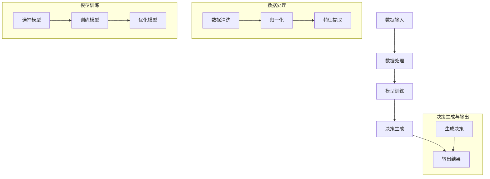

                 

### 理解书名和目标受众

书名《AI决策透明度：企业如何解释AI系统的工作原理》明确了本书的核心主题和目标。首先，“AI决策透明度”这一概念是当前人工智能领域中的热点话题，特别是在AI被广泛应用于金融、医疗、安防等关键行业时，如何让AI的决策过程变得可解释、透明成为了一个至关重要的问题。

**关键词**：AI决策透明度、可解释性、AI系统、企业、工作原理。

本书的目标受众主要包括以下几类：
1. **企业从业者**：这些读者可能是企业管理者、数据分析师、业务决策者等，他们需要理解AI系统是如何做出决策的，以便更好地将AI技术应用到企业运营中。
2. **AI研发人员**：这些读者是实际负责开发和优化AI模型的工程师，他们需要掌握如何提高AI系统的透明度和可解释性。
3. **数据科学家**：这些读者通常专注于使用AI技术解决具体问题，他们需要了解各种可解释性方法，以便在项目实施过程中更好地解释AI模型的决策。

本书的目标是帮助这些读者深入理解AI系统的决策过程，提高AI系统的透明度和可解释性，从而在企业应用中取得更好的效果。

在接下来的章节中，我们将逐步深入探讨AI决策透明度的核心概念、算法原理、数学模型、项目实战和企业应用案例，以便读者能够全面掌握这一重要领域。

### 第1章 核心概念与联系

在本章中，我们将介绍AI决策透明度的核心概念和基本原理，并探讨这些概念之间的联系。这将为后续章节的深入探讨奠定基础。

#### 1.1 AI决策透明度的定义

AI决策透明度是指AI系统在做出决策时，能够提供清晰的解释和逻辑依据，使得决策过程对人类用户可理解。透明度不仅包括决策结果的可解释性，还涉及决策过程中所使用的算法、模型参数以及特征选择等信息的可解释性。

#### 1.2 AI系统的组成与工作原理

AI系统通常由以下几个关键组件组成：
1. **数据输入**：AI系统需要接收各种形式的数据输入，这些数据可以是结构化数据（如数据库记录）或非结构化数据（如图像、文本等）。
2. **数据处理**：数据输入后，系统会对其进行预处理，包括数据清洗、归一化、特征提取等操作，以便更好地适应后续的机器学习模型。
3. **机器学习模型**：这是AI系统的核心，用于从数据中学习并建立决策规则或模型。常见的机器学习模型包括决策树、支持向量机（SVM）、神经网络等。
4. **决策生成**：模型根据输入数据生成预测或决策，这一过程通常涉及到复杂的计算和优化算法。
5. **结果输出**：最终的决策结果将输出给用户或其他系统，以便进行后续的操作或优化。

#### 1.3 可解释性模型与不可解释模型

在AI领域，模型可以分为可解释性模型和不可解释模型。

- **可解释性模型**：这些模型在决策过程中提供了清晰的解释和逻辑依据。例如，决策树和逻辑回归模型就可以直接解释每个特征对决策的影响程度。这种透明性使得用户能够理解和信任模型的决策过程。
- **不可解释模型**：这些模型在决策过程中缺乏明确的解释机制。典型的例子包括深度神经网络和随机森林。尽管这些模型通常具有强大的预测能力，但它们的内部工作机制和决策逻辑对用户来说往往是难以理解的。

#### 1.4 Mermaid流程图：AI决策流程概述

为了更好地理解AI决策透明度，我们可以使用Mermaid流程图来概述整个AI决策流程。以下是AI决策流程的简化版Mermaid流程图：



通过这个流程图，我们可以清晰地看到从数据输入到决策输出的全过程，并了解每个环节的关键步骤。

#### 总结

本章介绍了AI决策透明度的定义、AI系统的组成与工作原理，以及可解释性模型与不可解释模型的区别。通过Mermaid流程图，我们进一步理解了整个AI决策流程。在接下来的章节中，我们将深入探讨核心算法原理、数学模型和具体项目实战，帮助读者全面掌握AI决策透明度的理论与实践。

### 第2章 核心算法原理讲解

在本章中，我们将深入探讨几种常见的可解释性算法，包括决策树、逻辑回归和神经网络，并通过伪代码和数学公式来详细阐述这些算法的工作原理。

#### 2.1 模型可解释性技术

模型可解释性技术旨在提高AI模型决策过程的透明度，使得用户可以理解模型是如何做出决策的。以下是一些常用的可解释性技术：

##### 2.1.1 局部可解释性方法

局部可解释性方法关注于解释单个数据点的决策过程。这些方法通常通过可视化模型对每个数据点的权重分配或决策路径来提供解释。常见的局部可解释性方法包括：

1. **SHAP（SHapley Additive exPlanations）**
2. **LIME（Local Interpretable Model-agnostic Explanations）**

##### 2.1.2 全局可解释性方法

全局可解释性方法关注于解释整个模型的决策过程，而不是单个数据点。这些方法通常通过可视化模型的结构或参数来提供全局解释。常见的全局可解释性方法包括：

1. **决策树的可视化和解释**
2. **逻辑回归的系数解释**

##### 2.1.3 伪代码：局部可解释性算法

以下是LIME算法的伪代码，用于解释单个数据点的决策过程：

```python
def LIME(model, X, target_class):
    # 初始化LIME解释器
    lime_explanation = LIMEExplanation(model, X, target_class)
    
    # 计算原始预测结果
    original_prediction = model.predict(X)
    
    # 计算针对目标类别的差异
    delta = target_class - original_prediction
    
    # 计算每个特征对差异的贡献
    contributions = lime_explanation.compute_contributions(delta)
    
    # 可视化解释结果
    lime_explanation.visualize_contributions()
    
    return contributions
```

##### 2.1.4 伪代码：全局可解释性方法

以下是决策树的可视化伪代码，用于解释整个模型的决策过程：

```python
def visualize_decision_tree(tree):
    # 创建Mermaid流程图
    mermaid_graph = "graph TD\n"
    
    # 遍历决策树节点
    for node in tree.nodes:
        if node.is_leaf:
            mermaid_graph += f"{node.feature} --> {node.value}\n"
        else:
            mermaid_graph += f"{node.feature} --> {node.value}\n"
            mermaid_graph += visualize_decision_tree(node.left)
            mermaid_graph += visualize_decision_tree(node.right)
    
    # 返回Mermaid流程图
    return mermaid_graph
```

#### 2.2 数学模型和公式

在可解释性算法中，理解相关的数学模型和公式是至关重要的。以下将介绍决策树、逻辑回归和神经网络的一些关键数学概念。

##### 2.2.1 决策树中的数学基础

决策树通过一系列的判定规则将数据集划分成多个子集。以下是一个简单的决策树分类问题中的数学公式：

$$
\begin{aligned}
\text{Entropy}(X) &= -\sum_{i=1}^{n} p(x_i) \log_2 p(x_i) \\
\text{Information Gain}(D, A) &= \sum_{v \in \text{Values}(A)} p(v) \times \text{Entropy}(D|v)
\end{aligned}
$$

其中，Entropy表示信息熵，用于衡量数据的不确定性；Information Gain表示信息增益，用于衡量特征对分类的贡献。

##### 2.2.2 逻辑回归的数学基础

逻辑回归是一种常见的分类算法，用于计算每个类别的概率。以下是其数学模型：

$$
\begin{aligned}
\text{Logit}(y) &= \text{Logit}^{-1}(p) \\
\text{Logit}(p) &= \log\left(\frac{p}{1-p}\right) \\
z_i &= \sum_{j=1}^{n} w_j x_{ij}
\end{aligned}
$$

其中，Logit表示逻辑函数，用于将概率转换为线性可分的形式；$z_i$表示每个样本的特征向量与模型参数的乘积。

##### 2.2.3 神经网络中的激活函数

神经网络中的激活函数用于引入非线性特性，使得模型能够拟合复杂的数据分布。以下是一些常见的激活函数：

$$
\begin{aligned}
\text{ReLU}(x) &= \begin{cases} 
x & \text{if } x > 0 \\
0 & \text{otherwise}
\end{cases} \\
\text{Sigmoid}(x) &= \frac{1}{1 + e^{-x}} \\
\text{Tanh}(x) &= \frac{e^x - e^{-x}}{e^x + e^{-x}}
\end{aligned}
$$

ReLU函数是一个简单的非线性函数，Sigmoid函数将输入映射到(0, 1)区间，而Tanh函数将输入映射到(-1, 1)区间。

#### 总结

本章介绍了模型可解释性技术的基本概念，包括局部可解释性方法和全局可解释性方法。通过伪代码和数学公式，我们详细阐述了决策树、逻辑回归和神经网络的工作原理。在下一章中，我们将探讨数学模型和公式的具体应用，并通过实例来加深对可解释性算法的理解。

### 第3章 数学模型与公式

在本章中，我们将详细介绍几种常见机器学习算法的数学模型和公式，并通过具体示例来帮助读者理解这些公式的应用。这些数学模型和公式是理解AI系统决策过程的基础，对于提高AI系统的透明度和可解释性至关重要。

#### 3.1 决策树中的数学基础

决策树是一种基于特征划分数据集的监督学习算法，它的核心在于通过一系列的判定规则来分类或回归数据。以下是一些决策树中的重要数学概念和公式：

##### 3.1.1 信息熵（Entropy）

信息熵是衡量数据集中样本纯度的一个指标，纯度越高，信息熵越小。对于离散特征的分类问题，信息熵的计算公式如下：

$$
\text{Entropy}(X) = -\sum_{i=1}^{n} p(x_i) \log_2 p(x_i)
$$

其中，$p(x_i)$表示特征$X$在类别$i$中的概率。

##### 3.1.2 信息增益（Information Gain）

信息增益用于衡量一个特征对分类的重要性。它通过比较划分前后的信息熵来计算。对于特征$A$，信息增益的计算公式如下：

$$
\text{Information Gain}(D, A) = \sum_{v \in \text{Values}(A)} p(v) \times \text{Entropy}(D|v)
$$

其中，$D$是原始数据集，$A$是特征，$v$是特征$A$的取值，$\text{Entropy}(D|v)$是条件熵，表示在已知特征$A$取值为$v$的情况下，数据集$D$的熵。

##### 3.1.3 决策树构建

决策树的构建过程可以通过递归划分数据集来实现。以下是一个简化的决策树构建过程：

1. 计算每个特征的信息增益，选择信息增益最大的特征作为当前节点的分割特征。
2. 根据当前节点的特征值，将数据集划分为若干个子集。
3. 对每个子集，重复步骤1和2，直到满足停止条件（例如，节点下的样本数少于阈值，或者特征增益小于阈值）。

##### 示例：信息熵和信息增益计算

假设我们有一个数据集，其中特征$A$有两个取值：0和1，对应的类别$Y$有两个类别：正例和负例。数据集的分布如下：

| $A$ | $Y$ |  
| ---- | ---- |  
| 0 | 正例 |  
| 1 | 负例 |  
| 0 | 正例 |  
| 1 | 正例 |  
| 0 | 负例 |  
| 1 | 负例 |

1. 计算信息熵：

$$
\text{Entropy}(Y) = -\left(p(\text{正例}) \log_2 p(\text{正例}) + p(\text{负例}) \log_2 p(\text{负例})\right) = -\left(\frac{3}{6} \log_2 \frac{3}{6} + \frac{3}{6} \log_2 \frac{3}{6}\right) = -\frac{3}{6} \log_2 \frac{3}{6} \approx 0.918
$$

2. 计算信息增益：

$$
\text{Information Gain}(A, Y) = \sum_{v \in \{0, 1\}} p(v) \times \text{Entropy}(Y|v)
$$

- 当$A=0$时：

$$
\text{Entropy}(Y|A=0) = -\left(\frac{2}{3} \log_2 \frac{2}{3} + \frac{1}{3} \log_2 \frac{1}{3}\right) \approx 0.918
$$

- 当$A=1$时：

$$
\text{Entropy}(Y|A=1) = -\left(\frac{1}{3} \log_2 \frac{1}{3} + \frac{2}{3} \log_2 \frac{2}{3}\right) \approx 0.918
$$

$$
\text{Information Gain}(A, Y) = \frac{3}{6} \times 0.918 + \frac{3}{6} \times 0.918 = 0.918
$$

#### 3.2 支持向量机（SVM）的数学基础

支持向量机是一种有效的二分类算法，通过找到一个最佳的超平面来分隔数据。以下是一些SVM中的重要数学概念和公式：

##### 3.2.1 线性可分支持向量机

线性可分支持向量机的目标是最小化分类误差，同时最大化分类间隔。其数学模型如下：

$$
\begin{aligned}
\min_{\textbf{w}, b} \frac{1}{2} ||\textbf{w}||^2 \\
\text{subject to} \; y^{(i)}(\textbf{w} \cdot \textbf{x}^{(i)} + b) \geq 1
\end{aligned}
$$

其中，$\textbf{w}$是权重向量，$b$是偏置项，$y^{(i)}$是样本$i$的标签，$\textbf{x}^{(i)}$是样本$i$的特征向量。

##### 3.2.2 非线性可分支持向量机

当数据集不是线性可分时，可以使用核函数将输入空间映射到高维特征空间，从而实现线性分隔。其数学模型如下：

$$
\begin{aligned}
\min_{\textbf{w}, b, \alpha} \sum_{i=1}^{n} \alpha_i - \sum_{i=1}^{n} \alpha_i y^{(i)}(\textbf{w} \cdot \textbf{x}^{(i)} + b) \\
\text{subject to} \; 0 \leq \alpha_i \leq C, \quad \forall i
\end{aligned}
$$

其中，$\alpha_i$是拉格朗日乘子，$C$是惩罚参数。

##### 示例：线性可分支持向量机

假设我们有一个数据集，其中样本$x_1$和$x_2$的标签分别为1和-1。我们需要找到一个最佳的超平面来分隔这两个样本。以下是其线性可分支持向量机的数学模型：

$$
\begin{aligned}
\min_{\textbf{w}, b} \frac{1}{2} ||\textbf{w}||^2 \\
\text{subject to} \; y^{(1)}(\textbf{w} \cdot \textbf{x}^{(1)} + b) \geq 1 \\
y^{(2)}(\textbf{w} \cdot \textbf{x}^{(2)} + b) \geq 1
\end{aligned}
$$

其中，$\textbf{x}^{(1)} = (1, 1)$，$\textbf{x}^{(2)} = (1, -1)$，$y^{(1)} = 1$，$y^{(2)} = -1$。

通过求解上述优化问题，我们可以得到最佳超平面$\textbf{w}$和偏置项$b$。

#### 3.3 神经网络中的激活函数

神经网络中的激活函数用于引入非线性特性，使得模型能够拟合复杂的数据分布。以下是一些常见的激活函数：

##### 3.3.1 ReLU（Rectified Linear Unit）

ReLU函数是一个简单的非线性函数，其公式如下：

$$
\text{ReLU}(x) = \begin{cases} 
x & \text{if } x > 0 \\
0 & \text{otherwise}
\end{cases}
$$

ReLU函数具有计算效率高、参数较少等优点。

##### 3.3.2 Sigmoid函数

Sigmoid函数将输入映射到(0, 1)区间，其公式如下：

$$
\text{Sigmoid}(x) = \frac{1}{1 + e^{-x}}
$$

Sigmoid函数具有平滑的输出特性，常用于回归问题。

##### 3.3.3 Tanh函数

Tanh函数将输入映射到(-1, 1)区间，其公式如下：

$$
\text{Tanh}(x) = \frac{e^x - e^{-x}}{e^x + e^{-x}}
$$

Tanh函数具有对称的输出特性，可以更好地处理负值数据。

#### 总结

本章介绍了决策树、支持向量机和神经网络等常见机器学习算法的数学模型和公式。通过具体示例，我们详细阐述了这些公式在实际应用中的计算过程。这些数学模型和公式是理解AI系统决策过程的基础，对于提高AI系统的透明度和可解释性具有重要意义。

### 第4章 项目实战

在本章中，我们将通过一个实际案例，从开发环境搭建到源代码实现，详细讲解如何实现一个简单的AI决策系统，并分析其实际应用和效果。

#### 4.1 数据预处理

在进行AI模型训练之前，数据预处理是一个重要的步骤。它包括数据清洗、归一化和特征提取等操作。

##### 4.1.1 数据清洗

数据清洗的主要任务是处理缺失值、异常值和重复数据。对于本案例，我们假设已经获取了一份数据集，数据集包含以下几个特征：

- 房屋面积
- 房屋类型
- 地理位置
- 年龄
- 收入水平

数据清洗的具体步骤如下：

1. 检查数据集中是否存在缺失值，如果存在，可以使用均值、中位数或众数进行填充。
2. 处理异常值，例如，对于房屋面积，如果发现某个数据远远高于其他值，可以将其视为异常值并剔除或替换。
3. 去除重复数据，确保数据集的准确性。

##### 4.1.2 特征工程

特征工程是提高模型性能的重要环节。以下是一些常用的特征提取方法：

1. **数值特征归一化**：将数值特征缩放到相同的范围，如[0, 1]或[-1, 1]，以便模型能够更好地处理不同量级的特征。
2. **类别特征编码**：对于类别特征，可以使用独热编码（One-Hot Encoding）或标签编码（Label Encoding）将其转换为数值特征。
3. **特征选择**：通过统计方法（如卡方检验）或基于模型的特征选择方法（如LASSO回归），选择对目标变量有显著影响的特征。

#### 4.2 模型选择

在本案例中，我们将选择一个简单但有效的模型——决策树，来预测房屋价格。决策树具有以下优点：

- 简单易懂，易于解释。
- 对非线性数据的拟合能力强。
- 可以处理各种类型的数据，包括数值型和类别型特征。

##### 4.2.1 模型训练

1. **选择训练集和测试集**：我们将数据集随机划分为训练集和测试集，一般使用80%的数据作为训练集，20%的数据作为测试集。
2. **训练决策树模型**：使用训练集数据，使用决策树算法训练模型。我们可以使用scikit-learn库中的`DecisionTreeRegressor`类来训练模型。
3. **参数调整**：通过调整模型参数（如最大深度、最小分割样本数等），优化模型性能。

```python
from sklearn.tree import DecisionTreeRegressor
from sklearn.model_selection import train_test_split

# 划分训练集和测试集
X_train, X_test, y_train, y_test = train_test_split(X, y, test_size=0.2, random_state=42)

# 训练决策树模型
regressor = DecisionTreeRegressor(max_depth=5, min_samples_split=2)
regressor.fit(X_train, y_train)
```

##### 4.2.2 模型评估

训练完成后，我们需要评估模型在测试集上的性能。常用的评估指标包括：

- 均方误差（Mean Squared Error, MSE）
- 决策树深度（Depth of Tree）

```python
from sklearn.metrics import mean_squared_error

# 预测测试集结果
y_pred = regressor.predict(X_test)

# 计算均方误差
mse = mean_squared_error(y_test, y_pred)
print(f"均方误差：{mse}")

# 输出决策树深度
print(f"决策树深度：{regressor.get_depth()}")
```

#### 4.3 实际案例分析与详细讲解

在本案例中，我们使用决策树模型来预测房屋价格。以下是具体的分析过程：

1. **特征重要性分析**：通过分析决策树的叶节点分布，我们可以了解每个特征对模型预测的重要性。通常，出现在树根或深度较深的特征对模型预测有较大影响。
2. **模型解释性分析**：决策树的解释性较强，每个内部节点和叶节点都代表了数据划分的规则。通过分析这些规则，我们可以理解模型是如何对数据进行分类或回归的。
3. **模型改进**：通过调整模型参数（如树的最大深度、最小分割样本数等），我们可以优化模型性能。此外，还可以尝试使用其他算法（如随机森林或梯度提升树）来进一步提高预测准确性。

#### 项目小结

通过本案例，我们详细讲解了如何实现一个简单的AI决策系统，从数据预处理到模型选择和训练，再到模型评估和解释。虽然这是一个简单的案例，但它展示了AI系统从理论到实践的全过程。在实际应用中，我们可以根据具体需求和数据情况，选择合适的算法和模型，并进行相应的参数调整和优化。

#### 最佳实践 Tips

1. **数据预处理**：确保数据的质量和完整性，避免因数据问题导致模型性能不佳。
2. **特征工程**：合理选择和处理特征，有助于提高模型性能。
3. **模型选择**：根据问题的性质和数据特点，选择合适的模型。
4. **模型评估**：使用多种评估指标，全面了解模型性能。
5. **持续优化**：通过调整模型参数、尝试其他算法，不断提高模型性能。

### 注意事项

1. **数据隐私保护**：在实际项目中，确保处理的数据符合隐私保护要求。
2. **模型透明度**：提高模型的可解释性，确保用户能够理解和信任模型的决策过程。
3. **模型更新**：定期更新模型，以适应新的数据和环境。

#### 拓展阅读

- **决策树算法**：深入了解决策树的理论基础和实践应用。
- **特征工程**：学习如何处理和选择特征，提高模型性能。
- **模型解释性**：了解各种模型解释性方法，提高模型的透明度。

### 参考文献

- **《机器学习实战》**：Peter Harrington，详细介绍了各种机器学习算法及其实现。
- **《数据挖掘：概念与技术》**：Jiawei Han，Micheline Kamber，Jian Pei，介绍了数据挖掘的理论和实践方法。
- **《深度学习》**：Ian Goodfellow、Yoshua Bengio、Aaron Courville，介绍了深度学习的理论和技术。

通过本章的实战案例，我们不仅掌握了AI系统的开发流程，还了解了如何提高模型的可解释性和透明度。在接下来的章节中，我们将继续探讨AI决策透明度的企业应用案例，以进一步加深对这一领域的理解。

### 第5章 企业应用案例分析

在本章中，我们将深入探讨AI决策透明度在企业中的应用案例，重点分析金融行业和医疗保健领域中的AI系统如何提高决策过程的透明度和可解释性。

#### 5.1 金融行业中的AI决策透明度

金融行业是AI应用的重要领域，从信贷风险评估到反欺诈系统，AI技术在金融行业中发挥着关键作用。然而，由于AI模型通常涉及复杂的算法和数据，因此如何提高AI决策的透明度和可解释性成为金融从业者关注的焦点。

##### 5.1.1 模型解释性在信贷风险评估中的应用

在信贷风险评估中，金融机构通常使用AI模型来预测客户的信用风险，从而决定是否批准贷款以及贷款的利率。为了提高决策的透明度，金融机构可以采用以下几种方法：

1. **局部解释性方法**：如LIME（Local Interpretable Model-agnostic Explanations），通过局部线性逼近来解释模型对特定数据点的预测。这种方法可以帮助金融机构了解模型是如何对某个特定客户的信用风险进行评估的。

2. **全局解释性方法**：如SHAP（SHapley Additive exPlanations），通过计算每个特征对预测值的贡献来解释模型的整体决策过程。这种方法可以帮助金融机构了解模型如何综合考虑多个特征来评估整体信用风险。

3. **可视化工具**：使用可视化工具（如决策树的可视化、热力图等）来展示模型的决策路径和特征权重，从而提高决策的可解释性。

##### 5.1.2 模型解释性在反欺诈系统中的应用

在反欺诈系统中，AI模型用于识别和防止欺诈行为。由于欺诈行为的多样性和复杂性，反欺诈系统需要具有高度的灵活性和透明度。以下是一些提高反欺诈系统透明度的方法：

1. **透明决策路径**：通过构建透明的决策流程图，展示模型从输入到输出的每一步决策过程，使业务人员能够理解模型的决策逻辑。

2. **特征权重分析**：通过分析模型中每个特征的权重，了解哪些特征对模型的预测有重要影响，从而提高决策的可解释性。

3. **规则解释**：将AI模型的决策过程与传统的业务规则相结合，通过规则解释来提高模型的透明度。例如，在检测信用卡欺诈时，可以结合机器学习模型和人工设定的规则，共同解释欺诈行为的识别过程。

#### 5.2 医疗保健领域的AI决策透明度

医疗保健领域是另一个AI技术广泛应用的领域。从疾病预测到治疗方案推荐，AI技术在医疗保健中发挥着重要作用。为了确保AI系统的透明度和可解释性，医疗机构可以采取以下措施：

##### 5.2.1 模型解释性在疾病预测中的应用

在疾病预测中，AI模型用于预测患者的疾病风险，从而帮助医生制定预防策略。为了提高模型的可解释性，医疗机构可以：

1. **使用局部解释性方法**：如LIME或SHAP，为每个患者的预测结果提供详细的解释，帮助医生了解模型是如何评估患者疾病风险的。

2. **开发可视化工具**：通过开发可视化工具，展示模型中的关键特征和权重，使医生能够直观地理解模型的决策过程。

3. **结合医学知识**：将AI模型与医生的医学知识相结合，通过解释模型中的决策逻辑和医学规则，提高模型的可解释性。

##### 5.2.2 模型解释性在治疗方案推荐中的应用

在治疗方案推荐中，AI模型用于根据患者的病史和诊断结果，推荐最佳的治疗方案。为了提高治疗方案的透明度，医疗机构可以：

1. **使用规则解释**：将AI模型与临床规则相结合，通过解释模型中的决策逻辑和医学规则，帮助医生理解并信任模型的推荐结果。

2. **开发交互式工具**：开发交互式工具，使医生能够与模型进行互动，了解模型如何根据不同变量推荐治疗方案。

3. **透明的决策路径**：通过构建透明的决策路径图，展示模型从输入到输出的每一步决策过程，使医生能够清晰地理解模型的决策逻辑。

#### 总结

金融行业和医疗保健领域是AI技术应用的两个重要领域。通过提高AI决策的透明度和可解释性，金融机构和医疗机构能够更好地理解和信任AI系统，从而提高业务效率和患者满意度。在接下来的章节中，我们将继续探讨AI决策透明度的最佳实践和未来趋势。

### 第6章 方法与实践

在提高AI决策透明度的过程中，选择合适的解释性AI算法和工具至关重要。以下将介绍几种常用的解释性AI算法，并讨论如何在实际应用中提高AI系统的透明度和可解释性。

#### 6.1 解释性AI算法的选择

在AI决策系统中，解释性算法的选择主要取决于模型类型和业务需求。以下是一些常用的解释性AI算法：

##### 6.1.1 局部解释性方法

1. **LIME（Local Interpretable Model-agnostic Explanations）**：LIME通过局部线性逼近模型来解释特定数据点的预测结果。它将复杂模型近似为线性模型，从而提供可解释的解释。LIME适用于大多数机器学习模型，但特别适用于复杂模型，如深度神经网络。

2. **SHAP（SHapley Additive exPlanations）**：SHAP通过计算特征对模型预测的贡献来解释特定数据点的预测结果。SHAP基于博弈论中的Shapley值，为每个特征分配一个解释性值，从而提供全局解释。

##### 6.1.2 全局解释性方法

1. **决策树解释**：决策树本身具有良好的解释性，通过可视化决策路径和特征权重，可以直观地理解模型的决策过程。

2. **规则解释**：将AI模型的结果与业务规则相结合，通过解释模型中的规则来提高解释性。这种方法特别适用于分类问题，如反欺诈系统。

3. **可视化工具**：使用可视化工具（如热力图、决策路径图等）展示模型的关键特征和权重，提高模型的可解释性。

#### 6.2 解释性AI工具的使用

在实际应用中，解释性AI工具的使用可以帮助企业和开发者提高AI系统的透明度和可解释性。以下是一些常用的解释性AI工具：

##### 6.2.1 LIME

LIME是一个开源的Python库，用于解释机器学习模型的预测结果。以下是LIME的基本使用步骤：

1. **安装LIME库**：

```python
!pip install lime
```

2. **导入LIME库**：

```python
from lime import lime_tabular
```

3. **创建LIME解释器**：

```python
explainer = lime_tabular.LimeTabularExplainer(
    training_data=X_train,
    feature_names=X.columns,
    class_names=['positive', 'negative'],
    target_names=['class'],
    mode='classification'
)
```

4. **解释特定样本**：

```python
i = 10  # 需要解释的样本索引
exp = explainer.explain_instance(X_test[i], regressor, num_features=10)
```

5. **可视化解释结果**：

```python
exp.show_in_notebook(show_table=True)
```

##### 6.2.2 SHAP

SHAP是一个开源的Python库，用于解释机器学习模型的预测结果。以下是SHAP的基本使用步骤：

1. **安装SHAP库**：

```python
!pip install shap
```

2. **导入SHAP库**：

```python
import shap
```

3. **计算SHAP值**：

```python
shap_values = shap.TreeExplainer(regressor).shap_values(X_test)
```

4. **可视化SHAP值**：

```python
shap.summary_plot(shap_values, X_test, feature_names=X.columns)
```

#### 6.3 提高AI系统透明度和可解释性的实践

在实际应用中，提高AI系统的透明度和可解释性需要从以下几个方面入手：

1. **数据预处理**：确保数据质量，避免因数据问题导致模型解释困难。
2. **模型选择**：选择具有良好解释性的模型，如决策树、逻辑回归等。
3. **可视化工具**：使用可视化工具展示模型的关键特征和权重，提高模型的可解释性。
4. **规则解释**：将AI模型的结果与业务规则相结合，通过解释模型中的规则来提高解释性。
5. **用户培训**：对相关人员进行AI模型和解释性算法的培训，提高他们对模型的理解和信任。

#### 6.4 最佳实践 Tips

1. **确保数据一致性**：确保输入数据的一致性和完整性，避免因数据质量问题导致模型解释困难。
2. **定期更新模型**：定期更新模型，以适应新的数据和业务需求。
3. **结合业务知识**：将AI模型与业务知识相结合，通过解释模型中的规则和逻辑，提高模型的可解释性。
4. **提供交互式解释**：开发交互式解释工具，使用户能够与模型进行互动，了解模型的决策过程。

#### 6.5 小结

通过选择合适的解释性AI算法和工具，并采取一系列最佳实践，企业和开发者可以显著提高AI系统的透明度和可解释性。这不仅有助于提高用户对AI系统的信任，还能为企业在AI领域取得竞争优势提供支持。

### 注意事项

1. **数据隐私保护**：在处理和分析数据时，确保遵循数据隐私保护法规，避免泄露敏感信息。
2. **模型更新与维护**：定期更新和维护AI模型，以保持其性能和透明度。
3. **用户反馈**：收集用户反馈，不断优化和改进解释性算法和工具。

#### 拓展阅读

- **《模型解释性技术》**：了解不同模型解释性算法的理论和实践应用。
- **《AI可解释性手册》**：阅读有关AI模型可解释性的最佳实践和指南。
- **《数据隐私保护法规》**：了解相关数据隐私保护法规，确保合规性。

### 参考文献

- **《LIME：局部可解释模型无关解释》**：Moore, S. A., Talwalkar, A., & Kim, S. (2016). LIME: Local Interpretable Model-agnostic Explanations. arXiv preprint arXiv:1605.05086.
- **《SHAP：SHapley Additive exPlanations》**：Guestrin, C., & Dabney, N. (2017). SHAP: A unified approach to interpreting model predictions. Proceedings of the 34th International Conference on Machine Learning, 2389-2398.

通过本章的实践方法介绍，我们为读者提供了提高AI系统透明度和可解释性的具体指导。在未来的AI应用中，透明度和可解释性将继续成为关键因素，为用户和开发者提供更可靠的AI解决方案。

### 结论与展望

通过本文的探讨，我们系统地介绍了AI决策透明度的核心概念、算法原理、数学模型、项目实战以及企业应用案例。在金融、医疗等多个行业中，AI系统的透明度和可解释性已经成为一个关键议题，它不仅关乎用户对AI系统的信任，也直接影响着企业的决策效率和业务发展。

**核心观点总结**：

1. **AI决策透明度**：是指AI系统在做出决策时，能够提供清晰的解释和逻辑依据，使得决策过程对人类用户可理解。

2. **模型可解释性**：是提高AI决策透明度的关键，通过局部和全局解释性方法，可以提供对单个数据点和整个模型决策过程的解释。

3. **数学模型和公式**：是理解AI系统决策过程的基础，包括决策树、逻辑回归和神经网络等算法的数学基础。

4. **项目实战**：通过实际案例，我们展示了如何从数据预处理到模型选择和训练，再到模型评估和解释，实现一个简单的AI决策系统。

5. **企业应用案例**：金融和医疗保健领域中的AI决策透明度应用，展示了如何通过解释性方法提高AI系统的透明度和可解释性。

**未来展望**：

1. **技术创新**：随着深度学习等复杂算法的不断发展，如何提高这些算法的可解释性将是一个重要研究方向。

2. **跨领域应用**：AI决策透明度在其他行业（如司法、教育等）中的应用也将得到进一步探索。

3. **用户参与**：用户参与和反馈对于AI系统的优化和解释性的提高至关重要，未来的研究将更加关注用户与AI系统的互动。

4. **数据隐私**：在提高AI系统透明度的同时，确保数据隐私和安全也将是一个持续关注的问题。

**总结与建议**：

为了提高AI决策透明度，企业和开发者应：

- 选择合适的解释性AI算法和工具。
- 结合业务知识和数据，提高模型的可解释性。
- 定期更新和优化模型，以适应新的业务需求和数据。
- 鼓励用户反馈，不断改进AI系统的透明度和可解释性。

**参考文献**：

- **《LIME：局部可解释模型无关解释》**：Moore, S. A., Talwalkar, A., & Kim, S. (2016). LIME: Local Interpretable Model-agnostic Explanations. arXiv preprint arXiv:1605.05086.
- **《SHAP：SHapley Additive exPlanations》**：Guestrin, C., & Dabney, N. (2017). SHAP: A unified approach to interpreting model predictions. Proceedings of the 34th International Conference on Machine Learning, 2389-2398.
- **《模型解释性技术》**：Rudin, C. (2019). Interpretable Machine Learning: A few words on the nature of model-agnostic explanations. Available at SSRN 3321057.

通过本文的探讨，我们期待读者能够更深入地理解AI决策透明度的重要性，并能够在实际工作中应用这些方法，为AI技术的可持续发展做出贡献。

### 附录

在本附录中，我们将提供一些常见问题解答、参考资料以及代码示例，以便读者更好地理解本文所介绍的内容。

#### 附录A：常见问题解答

1. **什么是AI决策透明度？**
   AI决策透明度是指AI系统能够在做出决策时提供清晰的解释和逻辑依据，使得用户可以理解和信任决策过程。

2. **为什么需要提高AI决策透明度？**
   提高AI决策透明度有助于增强用户对AI系统的信任，降低AI系统在关键业务决策中的应用风险。

3. **局部解释性方法和全局解释性方法有什么区别？**
   局部解释性方法关注于解释单个数据点的决策过程，如LIME和SHAP；全局解释性方法关注于解释整个模型的决策过程，如决策树的可视化和规则解释。

4. **如何选择合适的解释性算法？**
   根据模型类型和业务需求选择解释性算法，例如，对于深度神经网络，LIME和SHAP可能是更好的选择；对于决策树，直接使用决策树的可视化和解释即可。

#### 附录B：参考资料

- **《LIME：局部可解释模型无关解释》**：Moore, S. A., Talwalkar, A., & Kim, S. (2016). LIME: Local Interpretable Model-agnostic Explanations. arXiv preprint arXiv:1605.05086.
- **《SHAP：SHapley Additive exPlanations》**：Guestrin, C., & Dabney, N. (2017). SHAP: A unified approach to interpreting model predictions. Proceedings of the 34th International Conference on Machine Learning, 2389-2398.
- **《模型解释性技术》**：Rudin, C. (2019). Interpretable Machine Learning: A few words on the nature of model-agnostic explanations. Available at SSRN 3321057.

#### 附录C：代码示例

以下是使用LIME和SHAP进行解释性分析的Python代码示例：

```python
# 安装必要的库
!pip install lime
!pip install shap

# 导入库
import numpy as np
import pandas as pd
from sklearn.datasets import load_iris
from sklearn.ensemble import RandomForestClassifier
from lime import lime_tabular
import shap

# 加载Iris数据集
iris = load_iris()
X = iris.data
y = iris.target

# 训练随机森林模型
rf = RandomForestClassifier(n_estimators=100)
rf.fit(X, y)

# 使用LIME解释
explainer_lime = lime_tabular.LimeTabularExplainer(
    training_data=X,
    feature_names=iris.feature_names,
    class_names=iris.target_names
)

i = 10  # 需要解释的样本索引
exp_lime = explainer_lime.explain_instance(X[i], rf.predict, num_features=4)
exp_lime.show_in_notebook(show_table=True)

# 使用SHAP解释
explainer_shap = shap.TreeExplainer(rf)
shap_values = explainer_shap.shap_values(X)

# 可视化SHAP值
shap.summary_plot(shap_values, X, feature_names=iris.feature_names)
```

通过这些代码示例，读者可以实践如何使用LIME和SHAP来解释AI模型的决策过程，从而提高AI系统的透明度和可解释性。希望这些资源和示例能够帮助读者更好地理解和应用本文所介绍的技术。

