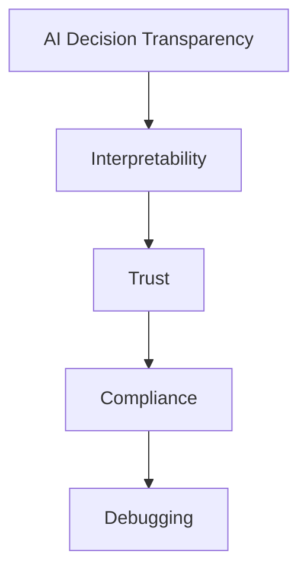

                 

### Chapter 1: Introduction to AI Decision Transparency

#### 1.1 What is AI Decision Transparency

**Core Concepts and Relationships**

To understand AI Decision Transparency, we need to delve into the core concepts and their relationships. The first and foremost concept is **Artificial Intelligence (AI)**, which refers to the ability of machines to perform tasks that typically require human intelligence. These tasks include perception, reasoning, learning, and problem-solving.

Within the realm of AI, we have different types of systems, such as **Machine Learning (ML)** and **Deep Learning (DL)**. ML systems learn from data using statistical techniques, while DL systems use neural networks with many layers to learn complex patterns.

**Interpretability** is a crucial aspect of AI Decision Transparency. It refers to the ease with which we can understand the decision-making process of an AI system. Interpretability helps in building trust, ensuring compliance, and debugging the system.

The **relationship between AI Decision Transparency and Interpretability** can be visualized using a Mermaid flowchart:

Each node in this flowchart represents a component or aspect, and the arrows represent the relationships between them. AI Decision Transparency ensures that the decisions made by AI systems are interpretable, which in turn builds trust, ensures compliance with regulations, and aids in debugging.

**Importance and Challenges of AI Decision Transparency**

AI Decision Transparency is of paramount importance in today's world. As AI systems are increasingly being integrated into critical business processes and societal functions, the need to understand and trust these systems has become essential. Here are some of the key reasons for its importance:

1. **Building Trust**: When people understand how AI systems make decisions, they are more likely to trust them. Transparency reduces the "black box" effect, where AI systems are perceived as mysterious and unexplainable.

2. **Ensuring Compliance**: Many industries, such as finance and healthcare, have stringent regulatory requirements. AI Decision Transparency helps in ensuring that AI systems comply with these regulations, thereby avoiding legal and ethical pitfalls.

3. **Debugging and Maintenance**: Understanding the decision-making process of AI systems makes it easier to debug and maintain them. When issues arise, being able to interpret the decisions made by the system can help identify and fix the problems more efficiently.

Despite its importance, there are several challenges associated with AI Decision Transparency:

1. **Complexity of AI Systems**: Modern AI systems, especially deep learning models, are highly complex. Understanding the inner workings of these systems can be challenging, even for experts.

2. **Computational Cost**: Many interpretability methods are computationally expensive. As a result, applying these methods to large-scale AI systems can be impractical.

3. **Ambiguity in Definitions**: There is no universally agreed-upon definition of what constitutes "transparency" in AI. This ambiguity can lead to different interpretations and approaches.

4. **Balancing Transparency and Performance**: There is often a trade-off between the transparency of an AI system and its performance. Highly interpretable systems may not perform as well as their less interpretable counterparts.

**Current State of AI Transparency Research**

Over the past few years, there has been significant research into AI Decision Transparency. Researchers have proposed various methods and techniques to improve the interpretability of AI systems. Here are some of the key developments in this field:

1. **Feature Attribution Methods**: These methods aim to identify which features or inputs contribute the most to the decision made by an AI system. Techniques such as Grad-CAM, LIME, and Shapley Value have gained popularity.

2. **Model Simplification**: Simplifying complex models, such as deep neural networks, can make them more interpretable. Techniques like pruning, quantization, and distillation have been explored to achieve this.

3. **Human-AI Collaboration**: Combining the strengths of humans and AI systems to improve interpretability has been a promising area of research. Methods like visualization, interaction, and explainable AI dashboards are being developed.

4. **Benchmark Datasets and Metrics**: Developing standardized datasets and metrics to evaluate the interpretability of AI systems is crucial. Initiatives like the Explainable AI Benchmark (XAI-Bench) and the Open Book Project are working towards this goal.

**Applications of AI Transparency in Enterprises**

AI Decision Transparency has several applications in enterprises. Here are a few examples:

1. **Risk Management**: In finance, AI systems are used for fraud detection, credit scoring, and trading. Ensuring the transparency of these systems helps in identifying potential risks and ensuring regulatory compliance.

2. **Customer Service**: In the customer service industry, AI systems are used for chatbots and virtual assistants. Transparency in these systems helps in building trust with customers and improving their experience.

3. **Supply Chain Optimization**: AI systems are used to optimize supply chain operations. Transparency in these systems helps in identifying bottlenecks and improving efficiency.

4. **Human Resources**: AI systems are used for recruitment, performance evaluation, and employee engagement. Ensuring the transparency of these systems helps in avoiding biases and ensuring fairness.

In conclusion, AI Decision Transparency is a crucial aspect of modern AI systems. It helps in building trust, ensuring compliance, and facilitating debugging. Despite the challenges, there has been significant progress in the field of AI Transparency, and its applications in enterprises are vast and varied.

### 1.2 The Importance of AI Decision Transparency

The importance of AI Decision Transparency cannot be overstated, especially in the context of its impact on businesses, society, and the economy. As AI systems become more pervasive, the need for transparency in their decision-making processes becomes increasingly critical. Let's explore the reasons behind this importance in more detail.

**1. Building Trust and Confidence**

One of the primary reasons for the importance of AI Decision Transparency is trust. In an age where AI systems are making decisions that can have significant consequences, it is crucial for stakeholders—be they business leaders, regulators, or end-users—to trust the decisions made by these systems. Transparency enables stakeholders to understand the reasoning behind AI decisions, which in turn builds confidence and trust in the system.

For example, in the financial industry, AI systems are used for fraud detection, credit scoring, and algorithmic trading. If these systems are opaque, there is a risk of mistrust, which can lead to regulatory scrutiny, legal challenges, and reputational damage. By ensuring transparency, businesses can demonstrate that their AI systems are making fair and reasonable decisions, thereby fostering trust and confidence.

**2. Ensuring Regulatory Compliance**

Regulatory compliance is another crucial aspect where AI Decision Transparency plays a vital role. Various industries, including healthcare, finance, and autonomous driving, are subject to stringent regulations that require transparency in the decision-making processes of AI systems. Ensuring compliance is not only a legal obligation but also a moral responsibility to protect consumers and society at large.

For instance, in the healthcare sector, AI systems are increasingly being used for diagnostic purposes. Regulations such as the Health Insurance Portability and Accountability Act (HIPAA) in the United States mandate transparency in the use of patient data. By providing clear explanations for AI decisions, healthcare providers can comply with these regulations and protect patient privacy.

**3. Facilitating Debugging and Maintenance**

AI systems are complex, and they can occasionally make errors or exhibit undesirable behaviors. In such cases, being able to interpret the decision-making process of an AI system is invaluable for debugging and maintenance. Understanding why a system made a particular decision can help developers identify and fix issues more efficiently, thus ensuring the stability and reliability of AI systems.

Take, for example, an autonomous vehicle system that malfunctions and causes an accident. In such a scenario, understanding the decision-making process of the system can be critical for determining the cause of the accident and preventing similar incidents in the future. Without transparency, it would be challenging to pinpoint the root cause of the problem and address it effectively.

**4. Enhancing User Experience**

Transparency in AI decision-making can significantly enhance the user experience. When users understand how an AI system works and why it makes certain decisions, they are more likely to have a positive perception of the system. This understanding can lead to increased user satisfaction and adoption of AI technologies.

Consider the case of chatbots and virtual assistants in customer service. If users are aware of how these systems process their queries and provide responses, they are more likely to feel in control and trust the system. This transparency can help reduce customer frustration and improve the overall customer experience.

**5. Promoting Fairness and Avoiding Bias**

AI systems can inadvertently introduce biases and unfairness if their decision-making processes are not transparent. Ensuring transparency can help identify and mitigate these biases, promoting fairness and equality.

For instance, in the recruitment process, AI systems can be used to screen job applicants. If these systems are transparent, businesses can ensure that they are not perpetuating biases based on race, gender, or other protected characteristics. By understanding the decision-making process, organizations can take steps to remove biases and create a more inclusive hiring process.

**6. Supporting Human-AI Collaboration**

Finally, AI Decision Transparency supports human-AI collaboration by enabling humans to work more effectively with AI systems. When humans can interpret and understand the decisions made by AI, they can better integrate these systems into their workflows and leverage their capabilities to enhance productivity and decision-making.

For example, in fields such as medicine and engineering, AI systems are increasingly being used to assist professionals in making complex decisions. By ensuring transparency, professionals can understand the basis for AI recommendations and make more informed decisions, combining the strengths of AI with their expertise.

In conclusion, AI Decision Transparency is essential for building trust, ensuring regulatory compliance, facilitating debugging, enhancing user experience, promoting fairness, and supporting human-AI collaboration. As AI systems continue to play a more significant role in various aspects of our lives, the importance of AI Decision Transparency will only grow, making it a critical focus for businesses, researchers, and policymakers alike.

