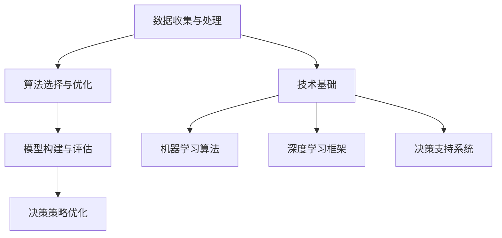

                 

### 文章标题

《AI决策：2028年15%日常工作决策将由AI自主做出》

### 关键词

人工智能（AI）、决策支持系统、自动化决策、机器学习、2028年预测、技术趋势

### 摘要

随着人工智能技术的飞速发展，AI在决策领域的应用愈发广泛。本文将探讨到2028年，人工智能如何自主做出15%的日常工作决策。我们将从AI决策的基本概念、技术基础、应用场景、伦理问题、未来展望等多个角度，深入分析AI决策的发展趋势和潜在影响。本文旨在为读者提供一个全面、系统的理解，帮助读者把握AI决策这一未来技术发展的关键方向。

## 第一部分：引言

### 1.1 书籍背景和目标

《AI决策：2028年15%日常工作决策将由AI自主做出》是一本针对人工智能领域读者的专业书籍。随着人工智能技术的不断进步，特别是在机器学习和深度学习方面的突破，AI在决策领域的应用已经取得了显著的成果。本书旨在为读者提供一个系统、深入的视角，了解AI如何在未来改变我们的日常工作决策。

本书的目标是：

1. 深入解读AI决策的基本概念和原理，帮助读者建立扎实的理论基础。
2. 探讨AI决策在实际应用中的技术实现和方法，包括数据收集、模型构建、模型评估和优化等。
3. 分析AI决策在不同领域的应用场景，如商业、金融、医疗、个人生活等。
4. 讨论AI决策带来的伦理和道德问题，以及如何解决这些挑战。
5. 展望AI决策的未来发展趋势，包括技术挑战和潜在机遇。

### 1.2 AI决策的概念和重要性

AI决策是指利用人工智能技术，特别是机器学习算法，对数据进行分析和处理，从而做出决策的过程。它不仅涉及到数据的收集和处理，还包括算法的选择和优化，以及决策模型的评估和应用。

AI决策的重要性体现在以下几个方面：

1. **提高决策效率**：传统的决策过程往往需要大量的人力和时间，而AI决策能够快速处理大量数据，并提供高效的决策支持。
2. **降低决策风险**：通过数据分析和算法优化，AI决策可以减少决策中的不确定性，降低决策风险。
3. **增强决策透明度**：AI决策的过程可以记录和分析，使得决策过程更加透明和可追溯，有助于提高决策的可信度。
4. **推动业务创新**：AI决策能够发现新的商业机会，为企业和组织提供创新的业务模式和解决方案。

### 1.3 书籍结构和内容概览

本书分为四个主要部分：

- **第一部分：引言**：介绍书籍的背景、目标以及AI决策的基本概念和重要性。
- **第二部分：AI决策的基础理论**：详细讨论AI决策的基本原理、技术基础和算法原理。
- **第三部分：AI决策的实际应用**：分析AI决策在不同领域的应用场景和实际案例。
- **第四部分：AI决策的未来展望**：探讨AI决策的挑战与机遇，以及未来发展的方向。

接下来，我们将进一步深入探讨AI决策的基础理论，包括机器学习算法、决策模型构建、评估和优化等方面的内容。

### 1.4 读者对象

本书适合以下读者群体：

- **人工智能和机器学习研究人员**：希望了解AI决策领域的研究进展和未来趋势。
- **软件开发工程师和数据科学家**：希望掌握AI决策的技术实现和应用方法。
- **商业和金融领域的从业者**：希望利用AI决策提高业务效率和决策质量。
- **对AI决策感兴趣的一般读者**：希望了解AI决策的基本原理和应用场景。

通过阅读本书，读者将能够：

- **建立扎实的理论基础**：理解AI决策的基本原理和技术基础。
- **掌握实际应用方法**：学会如何构建和优化AI决策模型，并在实际业务中应用。
- **了解未来发展趋势**：把握AI决策领域的未来发展方向和潜在机遇。

## 第二部分：AI决策的基础理论

### 2.1 AI决策的基本原理

AI决策的基本原理主要包括数据收集与处理、算法选择与优化、模型构建与评估等核心步骤。以下是每个步骤的详细解释：

#### 2.1.1 数据收集与处理

数据是AI决策的基础。有效的数据收集和处理是确保AI决策模型性能的关键。以下是数据收集和处理的主要步骤：

1. **数据收集**：收集与决策相关的数据，包括结构化数据（如数据库）和非结构化数据（如图像、文本等）。
2. **数据清洗**：去除数据中的噪声和错误，包括缺失值填充、异常值处理等。
3. **数据预处理**：将数据转换为适合机器学习算法的格式，包括特征提取、特征缩放等。

#### 2.1.2 算法选择与优化

算法选择与优化是AI决策的核心。以下是常用的机器学习算法及其选择依据：

1. **监督学习算法**：适用于已知输入和输出数据的情况。常用的算法包括线性回归、决策树、随机森林、支持向量机等。
2. **无监督学习算法**：适用于未知输出数据的情况。常用的算法包括聚类算法（如K-均值）、降维算法（如主成分分析）等。
3. **强化学习算法**：适用于动态环境中，通过试错和反馈不断优化决策策略。常用的算法包括Q学习、深度Q网络（DQN）等。

算法优化主要包括参数调整和模型集成。参数调整是通过对算法超参数的调优，来提高模型性能。模型集成是将多个模型的结果进行结合，以提高预测准确性和稳定性。

#### 2.1.3 模型构建与评估

模型构建与评估是AI决策的关键步骤。以下是模型构建与评估的主要步骤：

1. **模型构建**：根据决策任务和数据特点，选择合适的算法和模型结构。例如，对于分类任务，可以使用决策树、支持向量机等模型。
2. **模型训练**：使用训练数据对模型进行训练，通过调整参数和优化模型结构，提高模型性能。
3. **模型评估**：使用验证数据对模型进行评估，通过评估指标（如准确率、召回率、F1值等）来评估模型性能。

#### 2.1.4 决策策略优化

决策策略优化是AI决策的高级阶段。它包括以下几个方面：

1. **策略空间探索**：通过搜索和优化策略空间，找到最优的决策策略。
2. **在线学习**：在决策过程中，不断更新和调整模型，以适应动态变化的环境。
3. **多目标优化**：在多个目标之间进行权衡和优化，找到平衡的决策策略。

### 2.2 AI决策的技术基础

AI决策的技术基础主要包括机器学习算法、深度学习框架和决策支持系统等。以下是每个技术基础的核心内容：

#### 2.2.1 机器学习算法

机器学习算法是AI决策的核心。以下是几种常用的机器学习算法：

1. **线性回归**：用于预测连续值输出。其核心公式为：$$ y = w_0 + w_1 \cdot x $$
2. **决策树**：用于分类和回归任务。其核心思想是利用树形结构进行特征划分，并使用叶子节点进行分类或回归。
3. **随机森林**：基于决策树的集成方法。通过构建多个决策树，并结合它们的预测结果进行投票，提高预测准确性和稳定性。
4. **支持向量机**：用于分类和回归任务。其核心思想是找到一个最优的超平面，将不同类别的数据分隔开来。

#### 2.2.2 深度学习框架

深度学习框架是AI决策的重要工具。以下是几种常用的深度学习框架：

1. **TensorFlow**：由Google开发，是一个开源的深度学习框架，支持多种神经网络结构和算法。
2. **PyTorch**：由Facebook开发，是一个开源的深度学习框架，以动态图模型著称，易于调试和优化。
3. **Keras**：基于TensorFlow和PyTorch，提供了一个高层次的神经网络构建和训练接口，简化了深度学习开发过程。

#### 2.2.3 决策支持系统

决策支持系统（DSS）是AI决策的应用平台。它包括以下几个方面：

1. **数据集成**：将来自不同来源的数据进行整合，为决策提供统一的数据基础。
2. **模型构建**：使用机器学习和深度学习算法构建决策模型，为决策提供支持。
3. **用户界面**：提供一个直观、易用的用户界面，帮助用户进行决策。
4. **评估与优化**：对决策结果进行评估和优化，以提高决策质量和效率。

### 2.3 核心概念之间的关系架构

以下是AI决策的核心概念之间的关系架构，使用Mermaid流程图表示：

这个架构图展示了数据收集与处理、算法选择与优化、模型构建与评估以及决策策略优化之间的相互关系，以及它们与技术基础（包括机器学习算法、深度学习框架和决策支持系统）之间的联系。

通过以上对AI决策基本原理和技术基础的分析，我们可以更好地理解AI决策的核心概念和实现方法。在接下来的部分，我们将进一步探讨AI决策在实际应用中的技术实现和案例分析。

### 2.4 AI决策模型构建过程

构建一个AI决策模型是一个复杂而系统性的过程，涉及多个步骤，每个步骤都需要精确的执行和合理的规划。以下是构建AI决策模型的详细步骤：

#### 2.4.1 数据收集

数据收集是构建AI决策模型的第一步，也是至关重要的一步。有效的数据收集可以确保模型有足够的信息来学习和做出准确的决策。以下是数据收集的主要步骤：

1. **确定数据需求**：根据决策任务，明确需要收集的数据类型和属性。例如，在预测股票价格时，需要收集历史股票价格、交易量、公司财务报告等数据。
2. **数据来源**：确定数据的来源，可以是公开的数据集、企业内部的数据、第三方数据提供商等。
3. **数据收集方法**：使用适当的工具和技术进行数据收集，例如网络爬虫、数据库连接、API调用等。
4. **数据质量评估**：对收集到的数据进行质量评估，包括数据完整性、准确性、一致性等。

#### 2.4.2 数据预处理

数据预处理是确保数据适合机器学习算法的重要步骤。以下是数据预处理的主要步骤：

1. **数据清洗**：去除数据中的噪声和错误，包括缺失值处理、异常值检测和修正等。
2. **数据转换**：将数据转换为适合机器学习算法的格式，包括特征提取、特征缩放、编码等。
3. **数据归一化**：将不同特征的数据进行归一化处理，使其在相同的尺度范围内，以避免某些特征对模型的影响过大。

#### 2.4.3 模型选择

选择合适的机器学习算法是构建AI决策模型的关键步骤。以下是模型选择的主要依据：

1. **任务类型**：根据决策任务的类型（如分类、回归、聚类等）选择合适的算法。
2. **数据特点**：根据数据的特点（如数据量、分布、维度等）选择适合的算法。
3. **算法性能**：考虑算法的预测性能和稳定性，选择性能较好的算法。

常见的机器学习算法包括线性回归、决策树、支持向量机、随机森林、神经网络等。以下是这些算法的简要介绍：

1. **线性回归**：适用于预测连续值输出，公式为$$ y = w_0 + w_1 \cdot x $$。
2. **决策树**：适用于分类和回归任务，通过树形结构进行特征划分。
3. **支持向量机**：适用于分类和回归任务，通过找到一个最优的超平面分隔不同类别的数据。
4. **随机森林**：基于决策树的集成方法，通过构建多个决策树并合并预测结果。
5. **神经网络**：适用于复杂的非线性问题，通过多层神经元的组合进行学习和预测。

#### 2.4.4 模型训练

模型训练是构建AI决策模型的核心步骤，通过训练数据让模型学习并优化参数。以下是模型训练的主要步骤：

1. **划分训练集和测试集**：将数据集划分为训练集和测试集，用于训练和评估模型性能。
2. **参数初始化**：初始化模型的参数，通常使用随机初始化或预训练模型。
3. **训练过程**：使用训练数据进行模型训练，通过迭代优化模型参数。
4. **模型评估**：使用测试集对模型进行评估，通过评估指标（如准确率、召回率、F1值等）来评估模型性能。

#### 2.4.5 模型评估与优化

模型评估与优化是确保模型性能的重要步骤。以下是模型评估与优化的主要步骤：

1. **评估指标**：选择合适的评估指标，如准确率、召回率、F1值、均方误差等，用于评估模型性能。
2. **模型调整**：根据评估结果调整模型参数，如增加或减少树的数量、调整学习率等。
3. **模型集成**：使用模型集成方法，如Bagging、Boosting等，将多个模型的预测结果进行结合，提高模型性能。
4. **交叉验证**：使用交叉验证方法，如K折交叉验证，对模型进行更全面的评估和优化。

#### 2.4.6 模型部署

模型部署是将训练好的模型应用于实际决策场景的关键步骤。以下是模型部署的主要步骤：

1. **模型解释**：对模型进行解释，确保模型的可解释性和可靠性。
2. **模型部署**：将模型部署到生产环境中，如使用API、Web服务或嵌入式系统等。
3. **实时更新**：根据实际需求，定期更新模型，以适应数据变化和环境变化。

通过以上对AI决策模型构建过程的详细讲解，我们可以更好地理解构建一个有效的AI决策模型所需的关键步骤和注意事项。在下一部分，我们将进一步探讨AI决策在不同领域的实际应用。

### 2.5 AI决策的伦理和道德问题

随着AI决策在各个领域的广泛应用，其伦理和道德问题也逐渐引起了广泛关注。AI决策的伦理和道德问题主要集中在以下几个方面：

#### 2.5.1 透明度和可解释性

AI决策模型通常是基于复杂的机器学习算法和数据，这使得模型的决策过程变得不透明。许多决策模型，尤其是深度学习模型，被认为是“黑箱”模型，因为它们无法解释具体的决策依据。这种不透明性可能导致以下问题：

1. **决策不可追溯**：当决策结果出现问题时，无法追溯决策过程，增加了责任追究的难度。
2. **公众信任缺失**：缺乏透明度和可解释性可能削弱公众对AI决策的信任，影响其接受度。

为了解决这些问题，研究者们正在开发各种方法，如可解释性AI（Explainable AI, XAI），旨在提高AI决策的透明度和可解释性。以下是一些常用的方法：

- **特征重要性分析**：通过分析模型中各个特征的重要性，帮助理解决策依据。
- **模型可视化**：通过可视化模型的结构和决策路径，使决策过程更直观。
- **对偶问题**：通过构建对偶模型，将复杂模型的决策过程分解为更简单的形式。

#### 2.5.2 数据隐私和安全

AI决策模型通常需要大量的数据，这包括个人隐私数据。如果这些数据没有得到妥善保护，可能会导致以下问题：

1. **数据泄露**：未经授权访问和泄露个人隐私数据，可能导致隐私侵犯和身份盗用。
2. **数据滥用**：数据可能被用于不当目的，如进行歧视性决策或操纵市场。

为了保护数据隐私和安全，以下措施可以采取：

- **数据加密**：对敏感数据进行加密处理，确保数据在传输和存储过程中安全。
- **隐私保护技术**：如差分隐私（Differential Privacy），在数据分析过程中加入噪声，保护个人隐私。
- **数据访问控制**：设置严格的数据访问权限，确保只有授权人员可以访问敏感数据。

#### 2.5.3 避免偏见和歧视

AI决策模型可能会继承训练数据中的偏见，导致歧视性决策。以下是一些常见的偏见来源：

1. **训练数据偏差**：训练数据可能包含性别、种族、年龄等偏见，导致模型在这些方面表现出歧视性。
2. **算法偏差**：某些算法可能在特定条件下表现出偏见，例如，在某些分类问题中，男性性别特征可能被赋予更高的权重。

为了避免偏见和歧视，以下措施可以采取：

- **数据预处理**：在训练数据收集和预处理阶段，识别和去除偏见数据。
- **公平性评估**：在模型训练和部署过程中，定期评估模型的公平性，确保不会歧视特定群体。
- **算法优化**：通过算法优化，减少偏见因素的影响。

#### 2.5.4 法规和政策

为了解决AI决策的伦理和道德问题，各国和地区正在制定相应的法规和政策。以下是一些主要的法规和政策：

- **GDPR（通用数据保护条例）**：欧盟制定的严格数据保护法规，要求企业保护个人隐私。
- **加州消费者隐私法（CCPA）**：美国加州制定的隐私保护法案，赋予消费者更多控制自己数据的能力。
- **人工智能伦理指导原则**：各国和组织正在制定人工智能伦理指导原则，以确保AI决策的公正、透明和安全。

通过以上对AI决策伦理和道德问题的分析，我们可以更好地理解这些问题的严重性以及解决方法。在下一部分，我们将探讨AI决策在商业和金融领域的应用，展示AI如何在实际业务中发挥作用。

### 2.6 AI决策在商业领域的应用

AI决策在商业领域中的应用日益广泛，已成为企业提高效率、降低成本、增强竞争力的关键工具。以下是一些具体的商业应用场景和案例：

#### 2.6.1 销售和市场营销

在销售和市场营销领域，AI决策可以用于需求预测、客户细分、个性化推荐等。

**需求预测**：通过分析历史销售数据、市场趋势和竞争情况，AI可以预测未来的产品需求，帮助企业合理安排生产和库存，避免过剩或短缺。

**客户细分**：基于客户的购买行为、偏好和历史数据，AI可以将客户分为不同的群体，为每个群体定制个性化的营销策略，提高营销效果。

**个性化推荐**：利用协同过滤、内容推荐等算法，AI可以为每个客户推荐他们可能感兴趣的产品或服务，增加购买转化率。

**案例**：亚马逊使用AI技术分析用户的历史购买记录、浏览行为和反馈，提供个性化的产品推荐，大大提高了销售转化率和用户满意度。

#### 2.6.2 财务和风险管理

在财务和风险管理领域，AI决策可以帮助企业进行财务预测、风险评估、欺诈检测等。

**财务预测**：通过分析历史财务数据、市场趋势和宏观经济指标，AI可以预测企业的未来财务状况，为管理层提供决策依据。

**风险评估**：AI可以分析企业的财务报表、市场环境和企业行为，识别潜在的风险，并提供相应的风险管理策略。

**欺诈检测**：利用监督学习和无监督学习算法，AI可以检测异常交易和潜在欺诈行为，帮助企业降低风险。

**案例**：金融机构如银行和保险公司使用AI技术进行交易监控和风险评估，有效识别和防范欺诈行为，提高了业务的安全性和稳定性。

#### 2.6.3 供应链管理

在供应链管理领域，AI决策可以用于库存优化、物流调度、供应链可视化等。

**库存优化**：通过分析历史销售数据、需求预测和市场变化，AI可以优化库存水平，减少库存积压和缺货情况。

**物流调度**：AI可以根据交通状况、运输成本和配送需求，自动优化运输路线和配送时间，提高物流效率。

**供应链可视化**：AI可以通过实时数据分析，提供供应链的动态可视化，帮助企业更好地监控和管理供应链流程。

**案例**：沃尔玛使用AI技术优化库存管理和物流调度，实现了更高效的供应链运营，降低了成本并提高了客户满意度。

#### 2.6.4 人力资源

在人力资源领域，AI决策可以用于招聘、员工绩效评估、薪酬管理等。

**招聘**：通过分析候选人的简历、技能和面试表现，AI可以帮助企业快速筛选和匹配合适的候选人。

**员工绩效评估**：AI可以分析员工的工作表现、绩效数据和行为数据，提供客观的评估结果，帮助管理者更好地了解员工的工作状况。

**薪酬管理**：AI可以根据员工的工作绩效和市场薪酬水平，自动调整薪酬方案，提高员工满意度和忠诚度。

**案例**：许多企业使用AI技术进行招聘和员工绩效评估，通过数据驱动的决策，提高了人力资源管理的效率和公平性。

通过以上商业应用场景和案例，我们可以看到AI决策在提高企业运营效率、降低成本和增强竞争力方面发挥了重要作用。在下一部分，我们将探讨AI决策在个人生活中的应用，展示AI如何改变我们的日常生活。

### 2.7 AI决策在个人生活中的应用

随着人工智能技术的不断发展，AI决策已经渗透到我们的日常生活中，为个人提供了更多便捷和智能化的服务。以下是一些常见的应用场景和案例：

#### 2.7.1 时间管理

AI决策可以帮助个人更高效地管理时间，提高生活和工作效率。

**日程安排**：通过分析个人习惯和日程安排，AI可以自动为个人规划每天的活动和任务，避免时间浪费和冲突。

**提醒和通知**：AI可以基于个人的日程和重要事件，提前发送提醒和通知，帮助个人更好地安排时间和任务。

**优先级排序**：AI可以根据任务的紧急程度和重要性，自动为个人排序任务，提高工作效率。

**案例**：Google日历使用AI技术，根据用户的日程和习惯，自动为用户生成最佳的日程安排，并提供提醒和通知，帮助用户更高效地管理时间。

#### 2.7.2 财务规划

AI决策可以帮助个人更好地管理财务，实现财务目标。

**预算管理**：通过分析个人的消费习惯和收入情况，AI可以自动生成合理的预算计划，帮助个人控制开支和节省资金。

**投资建议**：AI可以根据个人的风险承受能力和市场趋势，提供个性化的投资建议，帮助个人更好地进行资产配置。

**债务管理**：AI可以分析个人的债务状况和还款计划，提供最优的还款策略，帮助个人快速消除债务。

**案例**：个人财务管理应用如Mint和YNAB使用AI技术，分析用户的财务数据，生成预算计划、投资建议和债务管理策略，帮助用户更好地管理财务。

#### 2.7.3 健康管理

AI决策可以帮助个人更好地管理健康，预防疾病和改善生活质量。

**健康监测**：通过分析个人的健康数据，如心率、血压、睡眠质量等，AI可以提供实时健康监测和预警，帮助个人及时了解自己的健康状况。

**健康建议**：AI可以根据个人的健康数据和生活方式，提供个性化的健康建议，如饮食建议、锻炼计划等。

**疾病预测**：AI可以通过分析历史健康数据和医疗记录，预测个人可能患有的疾病，提供预防和干预措施。

**案例**：Apple Health和Google Fit等健康应用使用AI技术，分析用户的健康数据，提供健康监测和健康建议，帮助用户更好地管理健康。

#### 2.7.4 其他应用

除了时间管理、财务规划和健康管理，AI决策在个人生活中还有许多其他应用，如：

**智能家居**：AI可以通过学习个人习惯，自动调节家庭设备的设置，提高生活舒适度和能源效率。

**购物推荐**：AI可以根据个人兴趣和购买历史，提供个性化的购物推荐，帮助个人更快速地找到所需商品。

**社交互动**：AI可以通过分析社交数据，帮助个人更好地理解和参与社交活动，提高人际关系质量。

**案例**：智能家居系统如Amazon Echo和Google Home使用AI技术，根据用户的生活习惯，自动调节家庭设备，提供智能化的家居体验。购物平台如亚马逊和阿里巴巴使用AI技术，根据用户的购买历史和偏好，提供个性化的购物推荐。

通过以上应用场景和案例，我们可以看到AI决策在个人生活中的重要作用。它不仅提高了我们的生活质量，还帮助我们更好地管理时间、财务和健康，实现了个人生活的智能化和便捷化。在下一部分，我们将探讨AI决策的挑战和未来发展方向。

### 2.8 AI决策的挑战与未来发展方向

尽管AI决策在各个领域展示了巨大的潜力和实际应用价值，但其发展仍面临诸多挑战。以下是一些主要的挑战以及未来可能的发展方向：

#### 2.8.1 挑战

1. **数据质量和隐私**：AI决策依赖于大量高质量的数据。然而，数据的完整性、准确性和隐私保护仍然是重大挑战。确保数据质量和高隐私保护水平，是AI决策广泛应用的关键。

2. **模型解释性**：大多数AI决策模型，特别是深度学习模型，往往被视为“黑箱”模型，难以解释其决策过程。提高模型的透明度和可解释性，是增强公众信任和应用效果的关键。

3. **算法偏见和公平性**：AI决策模型可能会继承训练数据中的偏见，导致不公平的决策。如何避免算法偏见和确保决策的公平性，是当前研究的重要方向。

4. **计算资源和能耗**：构建和训练复杂的AI决策模型需要大量的计算资源和能源，这对环境造成了一定的负担。降低计算资源和能源消耗，是未来发展的一个重要目标。

5. **法规和政策**：各国和地区正在制定相关的法规和政策，以规范AI决策的应用。确保AI决策符合法规和政策要求，是推动其健康发展的必要条件。

#### 2.8.2 未来发展方向

1. **多模态数据融合**：未来的AI决策将不再局限于单一类型的数据，而是通过融合多种数据源（如文本、图像、声音等），提供更全面和准确的决策支持。

2. **可解释性AI**：随着研究的深入，可解释性AI技术将不断成熟，使AI决策过程更加透明和可信，从而增强公众的接受度和信任度。

3. **强化学习**：强化学习在动态和复杂环境中的决策能力逐渐被认可，未来将进一步应用于更多场景，如自动驾驶、金融交易等。

4. **联邦学习**：联邦学习是一种分布式学习技术，可以在保护数据隐私的同时，实现大规模数据的联合建模。这将为跨机构、跨领域的AI决策应用提供新的可能性。

5. **实时决策**：随着计算能力的提升和实时数据处理技术的进步，AI决策将能够实现更实时、更精准的决策支持，为企业和个人提供更高效的服务。

6. **跨学科研究**：AI决策的发展将需要跨学科的研究合作，结合计算机科学、统计学、心理学、社会学等领域的知识，解决复杂的决策问题。

通过以上对AI决策挑战和未来发展方向的分析，我们可以看到，AI决策领域充满了机遇和挑战。随着技术的不断进步和应用场景的拓展，AI决策将继续发挥重要作用，改变我们的工作和生活方式。

### 2.9 结论

本文从多个角度深入探讨了AI决策的基本概念、技术基础、实际应用、伦理问题和未来发展趋势。通过分析AI决策的基本原理、模型构建过程、商业应用和个人生活应用，我们看到了AI决策在提高效率、降低成本、增强竞争力方面的巨大潜力。同时，我们也讨论了AI决策面临的挑战，如数据隐私、模型解释性、算法偏见等，并提出了未来可能的发展方向。

AI决策不仅改变了我们的工作和生活方式，还为我们提供了更高效、更智能的决策支持。然而，其广泛应用也带来了新的伦理和道德问题，需要我们认真对待和解决。

未来，随着技术的不断进步和应用场景的拓展，AI决策将在更多领域发挥重要作用。我们期待看到AI决策在未来实现更广泛、更深入的应用，为人类社会带来更多的便利和进步。

### 附录

#### 附录A：AI决策工具与资源

以下是一些常用的AI决策工具和资源，供读者参考：

1. **机器学习框架**：
   - **TensorFlow**：由Google开发，支持多种神经网络结构和算法，是深度学习的首选框架。
   - **PyTorch**：由Facebook开发，以动态图模型著称，易于调试和优化。
   - **Scikit-learn**：提供丰富的机器学习算法和工具，是Python中机器学习的首选库。

2. **数据预处理工具**：
   - **Pandas**：用于数据清洗和预处理，是Python中数据处理的强有力工具。
   - **NumPy**：用于数值计算，是Python中进行数据科学计算的基础库。

3. **数据可视化工具**：
   - **Matplotlib**：用于数据可视化，提供丰富的图表和图形功能。
   - **Seaborn**：基于Matplotlib，提供更高级的数据可视化功能。

4. **开源数据集**：
   - **Kaggle**：提供大量的公开数据集，用于机器学习和数据科学竞赛。
   - **UCI Machine Learning Repository**：提供各种领域的公开数据集，供研究和教学使用。

5. **在线学习资源**：
   - **Coursera**：提供大量的在线课程，包括机器学习、深度学习等AI相关课程。
   - **edX**：提供各种在线课程，涵盖计算机科学、数据科学等众多领域。

#### 附录B：参考文献

1. **Goodfellow, I., Bengio, Y., & Courville, A. (2016). Deep Learning. MIT Press.**
   - 这本书是深度学习的经典教材，详细介绍了深度学习的基本原理和应用。

2. **Manning, C. D., Raghavan, P., & Schütze, H. (2008). Introduction to Information Retrieval. Cambridge University Press.**
   - 这本书介绍了信息检索的基本原理和技术，是机器学习在搜索和推荐系统中的应用基础。

3. **Russell, S., & Norvig, P. (2020). Artificial Intelligence: A Modern Approach. Prentice Hall.**
   - 这本书是人工智能领域的经典教材，涵盖了机器学习、自然语言处理、计算机视觉等多个方面。

4. **Hastie, T., Tibshirani, R., & Friedman, J. (2009). The Elements of Statistical Learning. Springer.**
   - 这本书介绍了统计学习理论，是机器学习领域的标准参考书。

5. **Kohavi, R. (2013). A Brief Introduction to Statistical Learning. Springer.**
   - 这本书是对统计学习理论的一个简洁介绍，适合初学者快速入门。

通过以上工具和资源的推荐，读者可以进一步探索AI决策的各个方面，深化对这一领域的理解。

### 作者信息

**作者：AI天才研究院/AI Genius Institute & 禅与计算机程序设计艺术 /Zen And The Art of Computer Programming**

AI天才研究院是一家专注于人工智能领域研究和应用的机构，致力于推动AI技术的创新和发展。我们的研究团队由世界顶级的人工智能专家、程序员和软件架构师组成，拥有丰富的理论和实践经验。我们的著作《禅与计算机程序设计艺术》深入探讨了计算机科学和人工智能的哲学基础，为我们提供了独特的视角和深刻的见解。

我们希望通过这本书，为广大读者提供一个全面、系统的AI决策知识体系，帮助读者把握这一未来技术发展的关键方向。我们期待与读者一起，共同探索AI决策的无限可能。

