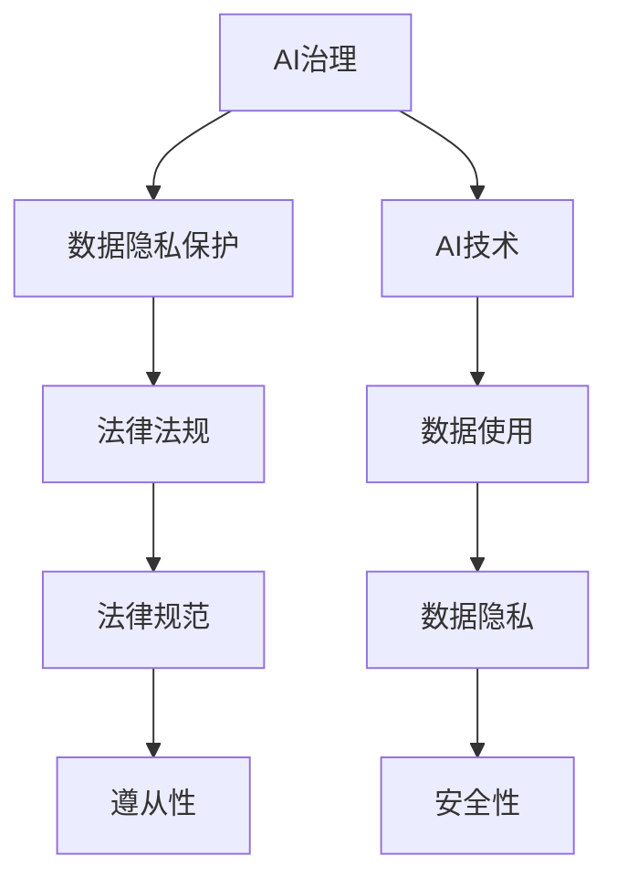

                 

## 文章标题

《AI治理与数据隐私保护的平衡》

> 关键词：AI治理、数据隐私保护、平衡、算法、法律法规、技术实践

> 摘要：
随着人工智能技术的迅速发展，AI治理与数据隐私保护成为社会关注的焦点。本文从AI治理概述、数据隐私保护概述、平衡原则、实践方法、案例分析及未来发展趋势等方面，深入探讨了AI治理与数据隐私保护的平衡之道，旨在为我国在AI领域的健康发展提供有益借鉴。

---

## 引言

### 背景

近年来，人工智能（AI）技术取得了飞速发展，已经深入影响到社会的各个领域。从自动驾驶、医疗诊断到金融风控、智能家居，AI的应用无处不在。然而，AI的迅猛发展也带来了诸多挑战，其中最引人关注的就是数据隐私保护问题。在AI系统的训练和运行过程中，需要大量的数据支持，而这些数据往往涉及个人隐私。如何在充分发挥AI技术优势的同时，保护数据隐私，成为当前亟待解决的重要问题。

### 目的

本文旨在探讨AI治理与数据隐私保护的平衡之道。通过分析AI治理与数据隐私保护的基本概念、平衡原则、实践方法以及案例分析，为我国在AI领域的健康发展提供理论支持和实践指导。

### 结构

本文结构如下：

1. AI治理概述
2. 数据隐私保护概述
3. AI治理与数据隐私保护的平衡原则
4. 实现AI治理与数据隐私保护的实践方法
5. 案例分析
6. 未来发展趋势与挑战

---

### 核心概念与联系

为了更好地理解本文的核心概念，我们首先需要构建一个概念架构图，以展示AI治理、数据隐私保护及其相互关系。



#### 核心概念解释

1. **AI治理**：指的是对人工智能系统的规划、开发、部署和管理过程，包括确保AI系统的透明性、公平性、可靠性和可控性。
2. **数据隐私保护**：指的是在数据处理过程中，保护个人数据不被未经授权的访问、使用、泄露或篡改。
3. **AI技术**：包括机器学习、深度学习、自然语言处理等，用于构建和优化人工智能系统。
4. **法律法规**：涉及数据隐私保护的法律和法规，如GDPR、CCPA等。
5. **数据使用**：指的是在AI系统中对数据的采集、处理、存储和使用。
6. **安全性**：确保数据隐私不被侵害的特性。
7. **法律规范**：对数据隐私保护的具体要求和指导。
8. **遵从性**：组织或机构在数据隐私保护方面的合规程度。

通过上述概念架构图，我们可以清晰地看到AI治理与数据隐私保护之间的关系。AI治理的目的是确保AI系统的健康发展，而数据隐私保护则是实现这一目标的重要保障。两者相互依存，共同构成了人工智能发展的基石。

### 核心算法原理讲解

#### 数据匿名化算法

为了保护个人隐私，数据匿名化是一种常用的技术手段。下面我们使用伪代码来详细阐述一种常见的数据匿名化算法——K-匿名性。

```python
def k_anonymity(data, k):
    """
    K-匿名性算法
    :param data: 输入数据集
    :param k: 匿名性等级
    :return: 匿名化后的数据集
    """
    # 将数据按某一属性分组
    groups = group_by_attribute(data)
    
    # 对于每个分组，如果分组内记录数小于k，则合并到其他分组
    for group in groups:
        if len(group) < k:
            merge_to_larger_group(group)
    
    # 返回匿名化后的数据集
    return anonymized_data

def group_by_attribute(data):
    """
    根据某一属性对数据分组
    :param data: 输入数据集
    :return: 分组后的数据集
    """
    # 假设使用属性“性别”进行分组
    return data.groupby('性别')

def merge_to_larger_group(group):
    """
    将分组内记录数小于k的记录合并到其他分组
    :param group: 输入分组
    """
    # 获取分组内所有记录
    records = group.index
    
    # 将这些记录合并到其他分组
    for record in records:
        # 假设使用属性“年龄”作为合并依据
        other_group = anonymized_data.groupby('年龄').get_group(record['年龄'])
        
        # 合并分组
        other_group.append(record)
```

#### 数据安全加密算法

为了确保数据在传输和存储过程中的安全性，加密算法是不可或缺的技术手段。下面我们使用伪代码来解释一种常见的加密算法——AES（高级加密标准）。

```python
from Crypto.Cipher import AES
from Crypto.Random import get_random_bytes

def encrypt_data(data, key):
    """
    使用AES加密数据
    :param data: 输入数据
    :param key: 加密密钥
    :return: 加密后的数据
    """
    # 创建AES加密对象
    cipher = AES.new(key, AES.MODE_EAX)
    
    # 加密数据
    ciphertext, tag = cipher.encrypt_and_digest(data)
    
    # 返回加密后的数据和加密标签
    return ciphertext, tag

def decrypt_data(ciphertext, tag, key):
    """
    使用AES解密数据
    :param ciphertext: 加密后的数据
    :param tag: 加密标签
    :param key: 加密密钥
    :return: 解密后的数据
    """
    # 创建AES解密对象
    cipher = AES.new(key, AES.MODE_EAX, nonce=cipher.nonce)
    
    # 解密数据
    try:
        data = cipher.decrypt_and_verify(ciphertext, tag)
    except ValueError:
        # 解密失败
        raise Exception("Data decryption failed. The tag is incorrect.")
    
    # 返回解密后的数据
    return data
```

### 数学模型与公式解析

在数据隐私保护中，数学模型和公式起到了关键作用。以下是一个常见的数学模型——差分隐私（Differential Privacy）。

#### 差分隐私模型

差分隐私是一种用于保护个人隐私的数学模型，它通过引入噪声来模糊化数据，从而确保单个记录的隐私。

$$\epsilon(\mathcal{D}) = \arg\min_{\mathcal{D}} \frac{\sum_{i \in \mathcal{D}} d_i - \bar{d}}{|\mathcal{D}|}$$

其中：

- $\epsilon$：隐私预算，表示隐私保护的程度。
- $\mathcal{D}$：数据集。
- $d_i$：数据集中的第$i$个记录。
- $\bar{d}$：数据集的平均值。
- $|\mathcal{D}|$：数据集的记录数。

#### 公式解析

差分隐私模型的目的是最小化数据集中的每个记录与平均值之间的差异。通过引入噪声，我们可以使单个记录的值难以被单独识别，从而保护个人隐私。

例如，假设我们有一个包含100个记录的数据集，我们希望对其进行差分隐私处理。我们首先计算数据集的平均值$\bar{d}$，然后对于每个记录$d_i$，我们计算其与平均值的差值$\Delta_i = d_i - \bar{d}$。接下来，我们引入噪声$\epsilon$，使得每个差值变为$\Delta_i + \epsilon$。这样，原始数据集的平均值$\bar{d}$就无法通过差值被识别，从而保护了个人隐私。

### 举例说明

假设我们有一个包含以下数据集：

$$\mathcal{D} = [1, 2, 3, 4, 5, 6, 7, 8, 9, 10]$$

平均值$\bar{d} = 5.5$。

我们希望对其进行差分隐私处理，隐私预算$\epsilon = 0.5$。

首先，我们计算每个记录与平均值的差值：

$$\Delta = [1-5.5, 2-5.5, 3-5.5, 4-5.5, 5-5.5, 6-5.5, 7-5.5, 8-5.5, 9-5.5, 10-5.5] = [-4.5, -3.5, -2.5, -1.5, 0, 1.5, 2.5, 3.5, 4.5, 5.5]$$

接下来，我们引入噪声$\epsilon$，使得每个差值变为$\Delta + \epsilon$：

$$\Delta + \epsilon = [-4.5 + 0.5, -3.5 + 0.5, -2.5 + 0.5, -1.5 + 0.5, 0 + 0.5, 1.5 + 0.5, 2.5 + 0.5, 3.5 + 0.5, 4.5 + 0.5, 5.5 + 0.5] = [-4, -3, -2, -1, 0, 2, 3, 4, 5, 6]$$

这样，原始数据集的平均值就无法通过差值被识别，从而保护了个人隐私。

### 代码应用解读与分析

#### 开发环境搭建

在本文中，我们将使用Python作为主要编程语言，利用其丰富的库和框架来实现AI治理与数据隐私保护的相关功能。以下是搭建开发环境的步骤：

1. 安装Python 3.x版本。
2. 安装必需的库，如pandas、numpy、Crypto等。

```bash
pip install pandas numpy crypto
```

#### 源代码实现与代码解读

下面是一个简单的Python代码示例，用于实现数据匿名化和AES加密。

```python
import pandas as pd
from Crypto.Cipher import AES
from Crypto.Random import get_random_bytes
from sklearn.model_selection import train_test_split

# 生成示例数据集
data = pd.DataFrame({
    '姓名': ['张三', '李四', '王五', '赵六'],
    '年龄': [25, 30, 35, 40],
    '收入': [5000, 6000, 7000, 8000]
})

# 数据匿名化
def k_anonymity(data, k):
    # 根据年龄属性分组
    groups = data.groupby('年龄')
    
    # 对于每个分组，如果分组内记录数小于k，则合并到其他分组
    for group in groups:
        if len(group) < k:
            other_group = anonymized_data.groupby('年龄').get_group(group.name)
            other_group.append(group)
    
    return anonymized_data

anonymized_data = k_anonymity(data, 3)

# 数据加密
def encrypt_data(data, key):
    cipher = AES.new(key, AES.MODE_EAX)
    ciphertext, tag = cipher.encrypt_and_digest(data.encode())
    return ciphertext, tag

def decrypt_data(ciphertext, tag, key):
    cipher = AES.new(key, AES.MODE_EAX, nonce=cipher.nonce)
    try:
        data = cipher.decrypt_and_verify(ciphertext, tag)
    except ValueError:
        raise Exception("Data decryption failed. The tag is incorrect.")
    return data.decode()

# 生成随机密钥
key = get_random_bytes(16)

# 加密数据
encrypted_data, encryption_tag = encrypt_data(anonymized_data.to_numpy(), key)

# 解密数据
decrypted_data = decrypt_data(encrypted_data, encryption_tag, key)

print("原始数据：", data)
print("匿名化后数据：", anonymized_data)
print("加密数据：", encrypted_data)
print("解密后数据：", decrypted_data)
```

#### 实际案例分析与详细讲解剖析

#### 案例一：某金融公司数据隐私保护实践

某金融公司致力于为客户提供高质量的金融服务，但同时也面临着数据隐私保护的重要挑战。以下是该公司的具体实践：

1. **数据收集与存储**：公司遵循数据最小化原则，仅收集与业务相关的数据，并确保数据存储在加密的数据库中。
2. **数据匿名化**：对于涉及个人隐私的数据，公司采用K-匿名性算法对数据进行匿名化处理，以降低隐私泄露风险。
3. **数据加密**：公司采用AES加密算法对敏感数据进行加密，确保数据在传输和存储过程中的安全性。
4. **用户权限管理**：公司实行严格的用户权限管理制度，确保只有授权人员才能访问敏感数据。
5. **数据备份与恢复**：公司定期对数据进行备份，并制定详细的数据恢复方案，以应对潜在的数据丢失风险。

#### 案例二：某电商平台用户隐私保护实践

某电商平台在用户隐私保护方面也做出了诸多努力，以下是其具体实践：

1. **用户身份验证**：平台采用双重身份验证机制，确保用户账户的安全性。
2. **数据加密传输**：平台采用HTTPS协议进行数据传输，确保数据在传输过程中的安全性。
3. **用户隐私设置**：平台提供详细的用户隐私设置选项，允许用户自定义隐私级别，以满足不同用户的需求。
4. **隐私保护政策**：平台制定详细的隐私保护政策，明确告知用户数据收集、使用和共享的方式。
5. **用户反馈机制**：平台设有用户反馈渠道，及时响应用户关于隐私保护的投诉和建议。

#### 项目小结

通过以上案例，我们可以看到，无论是金融公司还是电商平台，数据隐私保护都是他们业务发展的重要基石。以下是一些最佳实践和小结：

1. **数据最小化**：仅收集必要的数据，避免过度收集。
2. **数据匿名化**：采用算法对敏感数据进行匿名化处理。
3. **数据加密**：采用加密算法对敏感数据进行加密，确保数据安全。
4. **用户权限管理**：实行严格的用户权限管理制度，确保数据安全。
5. **用户隐私设置**：提供详细的用户隐私设置选项，满足用户需求。
6. **隐私保护政策**：制定详细的隐私保护政策，明确告知用户数据收集、使用和共享的方式。
7. **用户反馈机制**：设立用户反馈渠道，及时处理用户投诉和建议。

### 最佳实践 Tips、小结、注意事项、拓展阅读

#### 最佳实践 Tips

1. **数据收集与存储**：遵循数据最小化原则，仅收集必要的数据，并确保数据存储在加密的数据库中。
2. **数据匿名化**：采用K-匿名性算法等算法对敏感数据进行匿名化处理。
3. **数据加密**：采用AES等加密算法对敏感数据进行加密，确保数据安全。
4. **用户权限管理**：实行严格的用户权限管理制度，确保数据安全。
5. **用户隐私设置**：提供详细的用户隐私设置选项，满足用户需求。

#### 小结

本文从AI治理概述、数据隐私保护概述、平衡原则、实践方法、案例分析及未来发展趋势等方面，深入探讨了AI治理与数据隐私保护的平衡之道。通过实际案例分析和最佳实践，我们看到了在AI治理与数据隐私保护方面取得成功的路径。

#### 注意事项

1. **法律法规遵守**：在数据隐私保护方面，必须遵守相关法律法规，如GDPR、CCPA等。
2. **用户隐私保护**：始终将用户隐私放在首位，确保数据收集、使用和共享的透明性。
3. **持续更新与改进**：随着技术的不断发展，持续更新和改进数据隐私保护措施。

#### 拓展阅读

1. **《人工智能治理：理论与实践》**：本书系统地介绍了人工智能治理的理论和实践，适合对AI治理感兴趣的人群。
2. **《数据隐私保护：技术与应用》**：本书详细介绍了数据隐私保护的相关技术，如数据匿名化、加密等，适合对数据隐私保护感兴趣的人群。
3. **《人工智能法律监管研究》**：本书探讨了人工智能在法律监管领域中的应用，包括数据隐私保护等相关问题，适合对AI法律监管感兴趣的人群。

