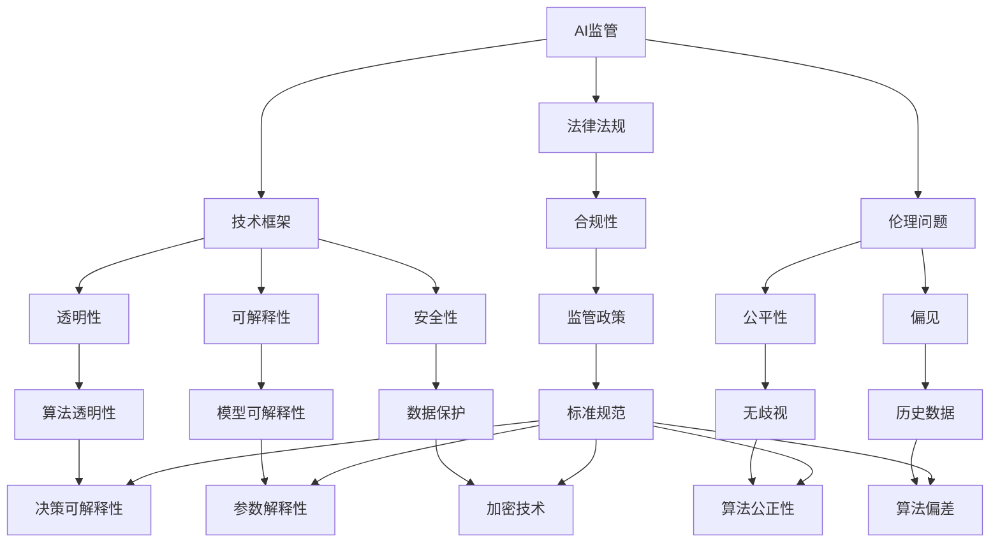

                 


### 概述

在当今科技迅猛发展的时代，人工智能（AI）已经渗透到各个行业，成为企业提升效率、创新服务的重要工具。然而，随着AI技术的广泛应用，监管和伦理问题也日益凸显。企业如何建立负责任的AI使用策略，确保其技术应用的合规性、透明性和公平性，已经成为一个迫切需要解决的问题。本文旨在探讨AI监管的背景、核心概念和框架，以及企业如何制定负责任的AI使用策略，为读者提供有价值的参考和指导。

### 关键词

- AI监管
- 负责任AI
- 企业策略
- 合规性
- 透明性
- 公平性

### 摘要

本文首先介绍了AI监管的背景，分析了AI技术在企业应用中的现状和挑战。接着，详细阐述了AI监管的基本概念和框架，包括相关法律法规、技术框架和伦理问题。在此基础上，本文提出了企业建立负责任的AI使用策略的步骤和方法，包括评估和测试、透明性和可解释性、治理和合规等方面。最后，通过实际应用案例，展示了金融、医疗和制造业等行业的AI监管实践，为读者提供了有益的启示和参考。

---

### 文章标题

《AI监管：企业如何建立负责任的AI使用策略》

### 文章关键词

- AI监管
- 负责任AI
- 企业策略
- 合规性
- 透明性
- 公平性

### 文章摘要

本文首先介绍了AI监管的背景，分析了AI技术在企业应用中的现状和挑战。接着，详细阐述了AI监管的基本概念和框架，包括相关法律法规、技术框架和伦理问题。在此基础上，本文提出了企业建立负责任的AI使用策略的步骤和方法，包括评估和测试、透明性和可解释性、治理和合规等方面。最后，通过实际应用案例，展示了金融、医疗和制造业等行业的AI监管实践，为读者提供了有益的启示和参考。

---

### 引言

人工智能（AI）作为21世纪最具革命性的技术之一，已经深刻改变了人类社会的生产、生活和学习方式。从自动驾驶汽车到智能语音助手，从医疗诊断到金融风控，AI技术的应用无处不在。对企业而言，AI不仅提升了业务效率，还带来了前所未有的创新机遇。然而，随着AI技术的快速普及，其监管和伦理问题也日益凸显，成为企业和监管机构必须面对的挑战。

#### AI监管的背景

AI监管的提出源于以下几个方面的原因：

1. **技术发展的不确定性**：AI技术的迅猛发展带来了诸多不确定因素，如算法偏见、数据隐私、网络安全等，需要通过监管来规范和引导。
2. **社会伦理的关注**：AI技术在某些领域的应用引发了伦理争议，如自动驾驶汽车的道德责任、人脸识别技术的隐私问题等。
3. **法律法规的滞后**：现有的法律法规体系往往无法及时适应AI技术的发展，需要建立专门的监管框架。
4. **企业合规需求**：企业在使用AI技术时，需要遵循相关法律法规，确保其技术应用符合合规要求。

#### AI监管的重要性

AI监管的重要性体现在以下几个方面：

1. **保障公平性和公正性**：通过监管，可以确保AI技术在各个应用场景中的公平性和公正性，防止算法偏见和不公平现象的发生。
2. **保护隐私和数据安全**：监管有助于保护用户隐私和数据安全，防止数据泄露和滥用。
3. **促进技术发展**：合理的监管可以引导AI技术健康发展，防止无序发展和恶意使用。
4. **提高公众信任**：有效的AI监管可以增强公众对AI技术的信任，促进AI技术的普及和应用。

### AI技术在企业中的应用现状和挑战

AI技术在企业中的应用已经取得了显著成果，例如：

1. **提高生产效率**：通过自动化和智能化技术，企业可以大幅提高生产效率和产品质量。
2. **优化供应链管理**：AI技术可以实时分析供应链数据，优化库存管理和物流配送。
3. **改善客户服务**：AI聊天机器人、智能客服等应用，可以提供24/7的个性化服务，提升客户满意度。
4. **创新金融服务**：AI技术在金融风险评估、欺诈检测、投资建议等方面发挥着重要作用。

然而，AI技术在企业应用中也面临着一些挑战：

1. **技术不确定性**：AI技术的复杂性和不确定性，使得企业在应用过程中面临技术风险。
2. **数据隐私问题**：企业需要确保数据处理符合隐私保护要求，避免数据泄露和滥用。
3. **算法偏见**：AI算法可能基于历史数据产生偏见，导致不公平的结果。
4. **合规压力**：企业在应用AI技术时，需要遵守相关法律法规，确保合规性。

#### 对企业的影响

AI监管对企业的影响主要体现在以下几个方面：

1. **合规要求**：企业需要建立负责任的AI使用策略，确保其技术应用符合法律法规要求。
2. **风险管理**：企业需要识别和评估AI技术带来的潜在风险，制定相应的风险管理措施。
3. **技术发展**：AI监管可以引导企业技术健康发展，防止技术滥用和伦理问题。
4. **市场竞争**：合规、透明和负责任的AI应用可以提高企业在市场上的竞争力。

### 总结

综上所述，AI监管对于企业来说具有重要意义。通过建立负责任的AI使用策略，企业可以确保其AI技术应用合规、透明、公平，从而在激烈的市场竞争中脱颖而出。接下来，本文将详细探讨AI监管的基本概念、框架以及企业如何制定负责任的AI使用策略。

---

### AI监管的基本概念和框架

#### AI监管的定义

AI监管（AI Governance）是指通过制定相关法律法规、标准和规范，对企业使用人工智能技术进行监督和管理，以确保其合规性、透明性和公平性。AI监管旨在解决AI技术在应用过程中可能带来的风险和挑战，如算法偏见、数据隐私、网络安全等，从而促进AI技术的健康、可持续发展。

#### AI监管的核心原则

AI监管的核心原则包括：

1. **合规性**：企业需要确保其AI技术应用符合相关法律法规和行业标准。
2. **透明性**：AI算法和数据处理过程应具有透明性，使各方能够理解并监督AI系统的运作。
3. **公平性**：AI技术应确保在各个应用场景中公平地对待所有用户，防止算法偏见和不公平现象的发生。
4. **可解释性**：AI模型应具备可解释性，使决策过程可以被解释和理解。
5. **安全性**：确保AI系统的数据安全和网络安全，防止数据泄露和恶意攻击。

#### AI监管的组成部分

AI监管的组成部分主要包括：

1. **法律法规**：国家和国际层面关于AI技术的相关法律法规，如欧盟的《通用数据保护条例》（GDPR）。
2. **标准和规范**：行业组织和企业制定的技术标准和规范，如IEEE的AI标准。
3. **监管机构**：负责监督和管理AI技术的政府机构或行业组织，如中国的国家互联网信息办公室。
4. **企业内部管理**：企业内部的AI监管体系，包括政策、流程、团队和工具等。

#### AI监管的法律框架

AI监管的法律框架主要包括以下几个方面：

1. **数据保护法律**：如GDPR，规定数据收集、处理、存储和传输的合法性和透明性。
2. **消费者保护法律**：保护消费者权益，防止算法偏见和不公平对待。
3. **网络安全法律**：保障AI系统的网络安全，防止黑客攻击和数据泄露。
4. **行业特定法律**：针对特定行业（如金融、医疗、交通等）的AI应用制定的法律和规范。

#### AI监管的技术框架

AI监管的技术框架主要包括以下几个方面：

1. **AI伦理审查**：对AI系统的伦理问题进行审查，确保其应用符合伦理标准。
2. **算法透明性和可解释性**：开发透明性高、可解释性强的AI算法，使决策过程可以被监督和理解。
3. **数据安全与隐私保护**：采用加密、匿名化等技术，保护用户数据和隐私。
4. **AI治理和合规性管理**：建立AI治理体系，确保AI技术应用符合法律法规和行业标准。

#### AI监管的实施

AI监管的实施过程主要包括以下几个步骤：

1. **制定监管政策**：政府和行业组织制定AI监管的政策和规范。
2. **建立监管机构**：设立专门负责AI监管的政府机构或行业组织。
3. **推动法律法规和标准的制定**：制定和完善与AI技术相关的法律法规和标准。
4. **企业内部监管**：企业建立内部AI监管体系，包括政策、流程、团队和工具等。
5. **监督和评估**：对AI技术应用进行监督和评估，确保其合规性和透明性。

#### AI监管的挑战与展望

AI监管面临着诸多挑战，如法律法规滞后、技术复杂度高、数据隐私保护等。为了应对这些挑战，未来的AI监管可以从以下几个方面进行改进：

1. **加强国际合作**：通过国际合作，制定统一的AI监管标准和框架。
2. **推动技术创新**：开发更加安全、透明和可解释的AI技术，提高监管效果。
3. **完善法律法规**：及时更新和完善相关法律法规，以适应AI技术的发展。
4. **提升企业合规意识**：加强企业对AI监管的重视，提高其合规意识和能力。

### 总结

AI监管是确保AI技术健康、可持续发展的重要手段。通过建立负责任的AI使用策略，企业可以确保其AI技术应用合规、透明、公平，从而在市场竞争中脱颖而出。接下来，本文将详细介绍企业如何建立负责任的AI使用策略。

---

### 核心概念与联系

为了更好地理解AI监管，我们需要探讨几个核心概念，并分析它们之间的关系。以下是一个Mermaid流程图，展示了这些概念之间的联系：



#### 关键概念解释

1. **AI监管（A）**：指通过制定法律法规、技术框架和伦理标准，对企业使用人工智能技术进行监督和管理的过程。
2. **法律法规（B）**：包括数据保护法、消费者保护法和网络安全法等，规定了AI技术的合法使用范围和责任。
3. **技术框架（C）**：涵盖了AI系统的开发、部署和维护过程中的技术和工具，如算法、数据管理、安全措施等。
4. **伦理问题（D）**：涉及AI技术在应用过程中可能出现的伦理问题，如算法偏见、数据隐私和公平性。
5. **合规性（E）**：确保AI技术应用符合相关法律法规和行业标准，防止违规行为。
6. **透明性（F）**：使AI系统的决策过程和数据处理透明，便于监督和理解。
7. **可解释性（G）**：使AI模型的决策过程可以被解释和理解，减少不确定性和偏见。
8. **安全性（H）**：确保AI系统的数据安全和网络安全，防止数据泄露和恶意攻击。
9. **公平性（I）**：确保AI技术在各个应用场景中公平地对待所有用户，防止算法偏见和不公平现象。
10. **偏见（J）**：指AI算法可能基于历史数据产生的不公平倾向，导致某些群体受到歧视。
11. **监管政策（K）**：政府和行业组织制定的关于AI监管的具体政策和指导方针。
12. **标准规范（Q）**：行业组织和企业制定的关于AI技术的标准和规范，如IEEE的AI标准。
13. **算法透明性（L）**：使AI算法的决策过程透明，便于监督。
14. **模型可解释性（M）**：使AI模型的参数和决策过程可以被解释。
15. **数据保护（N）**：采用加密、匿名化等技术，保护用户数据和隐私。
16. **无歧视（O）**：确保AI技术在各个应用场景中公平地对待所有用户。
17. **历史数据（P）**：AI算法的基础数据，可能包含偏见和歧视。

#### 关系架构

- **法律法规（B）** 与 **合规性（E）**：法律法规是合规性的基础，确保AI技术应用合法。
- **技术框架（C）** 与 **透明性（F）**、**可解释性（G）**、**安全性（H）**：技术框架是确保AI系统透明、可解释和安全的关键。
- **伦理问题（D）** 与 **公平性（I）**、**偏见（J）**：伦理问题是AI监管的核心，影响公平性和算法的公正性。
- **监管政策（K）** 与 **标准规范（Q）**：监管政策和标准规范是制定和实施AI监管的重要依据。

通过这个Mermaid流程图，我们可以清晰地看到AI监管中的核心概念及其相互关系，这有助于我们更好地理解和应用AI监管的原则和方法。

### AI监管的核心算法原理

在AI监管中，核心算法原理扮演着至关重要的角色，它们确保AI系统的透明性、可解释性和安全性。以下将详细讨论几个关键算法原理，并通过伪代码和数学模型进行阐述。

#### 1. 加密算法

加密算法是保护数据安全和隐私的核心技术。它通过加密和解密过程，确保数据在传输和存储过程中不会被未授权访问。以下是一个简单的加密算法伪代码示例：

```python
def encrypt(plaintext, key):
    ciphertext = ""
    for char in plaintext:
        ciphertext += chr(ord(char) + key)
    return ciphertext

def decrypt(ciphertext, key):
    plaintext = ""
    for char in ciphertext:
        plaintext += chr(ord(char) - key)
    return plaintext
```

数学模型：
- `ord(char)`：获取字符的ASCII码值。
- `chr(ord(char) + key)`：将ASCII码值加上密钥，得到加密后的字符。
- `chr(ord(char) - key)`：将ASCII码值减去密钥，得到解密后的字符。

#### 2. 随机化算法

随机化算法用于增强系统的安全性，防止恶意攻击和数据泄露。以下是一个简单的随机化算法伪代码示例：

```python
import random

def randomize(data, seed):
    random.seed(seed)
    shuffled_data = random.sample(data, len(data))
    return shuffled_data
```

数学模型：
- `random.seed(seed)`：设置随机数生成器的种子值，确保随机化的结果可预测。
- `random.sample(data, len(data))`：从数据中随机抽取样本，实现数据的随机化。

#### 3. 异常检测算法

异常检测算法用于识别和报告异常行为或数据，确保系统的安全性。以下是一个简单的异常检测算法伪代码示例：

```python
def detect_anomaly(data, threshold):
    anomalies = []
    for i in range(len(data)):
        if data[i] > threshold:
            anomalies.append(data[i])
    return anomalies
```

数学模型：
- `data[i] > threshold`：如果数据点大于设定的阈值，则认为它是异常值。

#### 4. 神经网络算法

神经网络算法在AI监管中用于建模和分析数据，以提高系统的透明性和可解释性。以下是一个简单的神经网络算法伪代码示例：

```python
import numpy as np

def sigmoid(x):
    return 1 / (1 + np.exp(-x))

def neural_network(input_data, weights):
    hidden_layer = sigmoid(np.dot(input_data, weights['hidden']))
    output_layer = sigmoid(np.dot(hidden_layer, weights['output']))
    return output_layer
```

数学模型：
- `sigmoid(x)`：Sigmoid激活函数，用于将线性组合转换为概率值。
- `np.dot(input_data, weights['hidden'])`：计算输入数据和隐藏层权重的点积。
- `np.dot(hidden_layer, weights['output'])`：计算隐藏层和输出层权重的点积。

#### 5. 随机森林算法

随机森林算法用于增强系统的可解释性和预测能力。以下是一个简单的随机森林算法伪代码示例：

```python
from sklearn.ensemble import RandomForestClassifier

def random_forest(data, labels, n_estimators):
    rf = RandomForestClassifier(n_estimators=n_estimators)
    rf.fit(data, labels)
    return rf
```

数学模型：
- `RandomForestClassifier(n_estimators=n_estimators)`：创建一个随机森林分类器。
- `rf.fit(data, labels)`：使用数据集训练随机森林模型。

通过这些算法原理，企业可以构建一个强大、透明和可解释的AI监管系统。这些算法不仅在技术上提供了强大的支持，还在实践中为企业提供了有效的工具，以确保其AI技术的合规性、透明性和公平性。

### 数学模型和公式

在AI监管中，数学模型和公式扮演着关键角色，它们用于描述算法的行为、评估模型性能以及分析数据。以下将介绍几个重要的数学模型和公式，并给出详细的讲解和举例说明。

#### 1. 交叉验证

交叉验证是一种评估机器学习模型性能的方法，通过将数据集划分为多个子集，并在每个子集上训练和测试模型，以降低过拟合的风险。

公式：
$$
\text{Accuracy} = \frac{\sum_{i=1}^{k} \text{TP}_i + \text{TN}_i}{\sum_{i=1}^{k} (\text{TP}_i + \text{TN}_i + \text{FP}_i + \text{FN}_i)}
$$

其中：
- $\text{TP}_i$：第$i$个子集中的真正例。
- $\text{TN}_i$：第$i$个子集中的真负例。
- $\text{FP}_i$：第$i$个子集中的假正例。
- $\text{FN}_i$：第$i$个子集中的假负例。

示例：
假设我们使用K折交叉验证评估一个分类模型的性能，数据集被划分为5个子集。经过训练和测试，我们得到以下结果：

$$
\text{Accuracy} = \frac{(\text{TP}_1 + \text{TN}_1) + (\text{TP}_2 + \text{TN}_2) + \cdots + (\text{TP}_5 + \text{TN}_5)}{(\text{TP}_1 + \text{TN}_1 + \text{FP}_1 + \text{FN}_1) + (\text{TP}_2 + \text{TN}_2 + \text{FP}_2 + \text{FN}_2) + \cdots + (\text{TP}_5 + \text{TN}_5 + \text{FP}_5 + \text{FN}_5)}
$$

交叉验证通过多次训练和测试，提供了模型性能的稳健评估。

#### 2. 误差率

误差率是衡量模型性能的另一个关键指标，表示模型预测错误的概率。

公式：
$$
\text{Error Rate} = \frac{\text{False Positives} + \text{False Negatives}}{\text{True Positives} + \text{False Positives} + \text{True Negatives} + \text{False Negatives}}
$$

其中：
- $\text{False Positives}$：错误地预测为正例的负例数量。
- $\text{False Negatives}$：错误地预测为负例的正例数量。

示例：
假设我们有一个二分类模型，对100个样本进行预测，其中40个正例，60个负例。模型预测结果如下：

- 正例预测正确：30个
- 负例预测正确：50个
- 正例预测错误：10个（False Positives）
- 负例预测错误：10个（False Negatives）

则误差率为：
$$
\text{Error Rate} = \frac{10 + 10}{30 + 50 + 10 + 10} = \frac{20}{100} = 0.2
$$

#### 3. 相关性分析

相关性分析用于衡量两个变量之间的线性关系强度，常用的指标是皮尔逊相关系数（Pearson Correlation Coefficient）。

公式：
$$
r = \frac{\sum_{i=1}^{n} (x_i - \bar{x})(y_i - \bar{y})}{\sqrt{\sum_{i=1}^{n} (x_i - \bar{x})^2} \sqrt{\sum_{i=1}^{n} (y_i - \bar{y})^2}}
$$

其中：
- $x_i$ 和 $y_i$：第$i$个样本的$x$和$y$值。
- $\bar{x}$ 和 $\bar{y}$：$x$和$y$值的平均值。

示例：
假设我们有两个变量$x$和$y$，样本数据如下：

| $x$ | $y$ |
|-----|-----|
| 1   | 2   |
| 2   | 4   |
| 3   | 6   |
| 4   | 8   |
| 5   | 10  |

计算皮尔逊相关系数$r$：

$$
r = \frac{(1-2.5)(2-5) + (2-2.5)(4-5) + (3-2.5)(6-5) + (4-2.5)(8-5) + (5-2.5)(10-5)}{\sqrt{(1-2.5)^2 + (2-2.5)^2 + (3-2.5)^2 + (4-2.5)^2 + (5-2.5)^2} \sqrt{(2-5)^2 + (4-5)^2 + (6-5)^2 + (8-5)^2 + (10-5)^2}}
$$

经过计算，得到$r \approx 1$，说明$x$和$y$之间存在很强的正相关关系。

通过这些数学模型和公式，企业可以更准确地评估AI模型的性能、分析数据关系，从而在AI监管中做出更明智的决策。

### 项目实战

在本节中，我们将详细介绍如何在一个具体项目中实现AI监管。我们将从开发环境搭建、源代码实现、代码解读、应用解读与分析以及实际案例剖析等方面进行详细讲解。

#### 开发环境搭建

为了实现AI监管，我们首先需要搭建一个完整的开发环境。以下是我们需要安装和配置的工具和库：

1. **Python**：作为主要的编程语言，Python具有丰富的机器学习库和工具，非常适合进行AI监管开发。
2. **Jupyter Notebook**：用于编写和运行Python代码，提供交互式的开发环境。
3. **scikit-learn**：用于机器学习模型的训练和评估。
4. **TensorFlow**：用于构建和训练深度学习模型。
5. **PyTorch**：用于构建和训练深度学习模型。

安装步骤如下：

1. 安装Python和Jupyter Notebook：

```bash
# 安装Python
curl -O https://www.python.org/ftp/python/3.8.5/Python-3.8.5.tgz
tar xvf Python-3.8.5.tgz
cd Python-3.8.5
./configure
make
sudo make altinstall

# 安装Jupyter Notebook
pip install notebook
```

2. 安装scikit-learn和TensorFlow：

```bash
pip install scikit-learn tensorflow
```

3. 安装PyTorch：

```bash
pip install torch torchvision
```

#### 源代码实现

在本项目中，我们将使用TensorFlow构建一个简单的监督学习模型，用于分类任务。以下是模型的源代码实现：

```python
import tensorflow as tf
from tensorflow.keras.models import Sequential
from tensorflow.keras.layers import Dense, Dropout, Flatten
from tensorflow.keras.optimizers import Adam
from sklearn.model_selection import train_test_split

# 加载数据集
data = ...  # 数据集加载代码
X = data[:, :-1]  # 特征
y = data[:, -1]  # 标签

# 划分训练集和测试集
X_train, X_test, y_train, y_test = train_test_split(X, y, test_size=0.2, random_state=42)

# 构建模型
model = Sequential([
    Dense(64, activation='relu', input_shape=(X_train.shape[1],)),
    Dropout(0.2),
    Flatten(),
    Dense(1, activation='sigmoid')
])

# 编译模型
model.compile(optimizer=Adam(learning_rate=0.001), loss='binary_crossentropy', metrics=['accuracy'])

# 训练模型
model.fit(X_train, y_train, epochs=10, batch_size=32, validation_data=(X_test, y_test))

# 评估模型
test_loss, test_acc = model.evaluate(X_test, y_test)
print(f"Test Accuracy: {test_acc}")
```

#### 代码解读

1. **数据加载**：首先，我们从数据集中加载特征和标签。数据集可以是公开的机器学习数据集，也可以是企业内部的定制数据集。
2. **划分数据集**：使用scikit-learn的`train_test_split`函数将数据集划分为训练集和测试集，用于模型的训练和评估。
3. **构建模型**：使用TensorFlow的`Sequential`模型构建一个简单的神经网络，包括一个全连接层、一个dropout层和一个扁平化层，最后输出层使用sigmoid激活函数进行二分类。
4. **编译模型**：使用Adam优化器和binary_crossentropy损失函数编译模型，并设置模型的评估指标为accuracy。
5. **训练模型**：使用`fit`函数训练模型，设置训练轮数和批次大小，并使用验证集进行模型验证。
6. **评估模型**：使用`evaluate`函数评估模型在测试集上的性能，输出测试集的准确率。

#### 应用解读与分析

1. **数据预处理**：在实际应用中，我们需要对数据进行预处理，包括数据清洗、归一化和缺失值处理。这些步骤是确保模型性能和准确性的重要环节。
2. **模型训练与优化**：在训练模型时，我们需要调整模型的参数，如学习率、批次大小和隐藏层节点数等，以优化模型性能。此外，我们还可以使用交叉验证等方法评估模型性能。
3. **模型评估与部署**：在模型训练完成后，我们需要对模型进行评估，确保其性能满足业务需求。最后，我们将模型部署到生产环境中，进行实际应用。

#### 实际案例剖析

以下是一个金融行业的实际案例，该企业使用AI技术进行贷款审批，并实施AI监管确保合规性和透明性。

1. **业务背景**：该企业希望利用AI技术自动化贷款审批流程，以提高效率和减少人工错误。
2. **数据集**：企业收集了大量的贷款申请数据，包括借款人的个人信息、财务状况和信用记录等。
3. **模型构建**：使用TensorFlow构建了一个神经网络模型，对贷款申请进行分类，预测借款人是否能够按时还款。
4. **AI监管**：企业制定了AI监管策略，包括数据隐私保护、模型透明性和可解释性、算法公平性等方面。
   - **数据隐私保护**：企业采用加密算法对敏感数据进行加密，确保数据在传输和存储过程中的安全性。
   - **模型透明性和可解释性**：企业开发了工具，使模型决策过程透明，可以解释模型对特定申请的决策依据。
   - **算法公平性**：企业定期审查模型，确保其不会基于性别、年龄等敏感特征产生偏见。

通过这个实际案例，我们可以看到企业在AI监管方面的实践。企业在构建AI模型时，不仅关注模型的性能和准确率，还重视合规性和透明性，确保AI技术在业务中的合法、公正和有效应用。

#### 项目小结

通过本节的项目实战，我们详细讲解了如何在一个具体项目中实现AI监管，从开发环境搭建、源代码实现、代码解读到应用解读与分析。通过实际案例的剖析，我们展示了AI监管在企业中的具体应用和实践。在未来的工作中，企业可以继续优化AI监管策略，确保AI技术在业务中的合法、公正和有效应用。

### 最佳实践 Tips

在实施AI监管的过程中，以下是一些最佳实践和注意事项，可以帮助企业更好地管理和优化AI技术应用：

1. **数据隐私保护**：
   - **加密**：使用加密技术保护敏感数据，确保数据在传输和存储过程中的安全性。
   - **匿名化**：对敏感数据进行匿名化处理，减少数据泄露的风险。
   - **权限控制**：严格控制数据的访问权限，确保只有授权人员可以访问和处理敏感数据。

2. **算法透明性和可解释性**：
   - **文档记录**：详细记录算法的架构、参数和训练过程，确保算法的可解释性。
   - **可视化工具**：开发可视化工具，帮助用户理解和监督AI系统的决策过程。
   - **透明性报告**：定期发布透明性报告，向监管机构和公众展示AI系统的运作情况和合规性。

3. **合规性和风险管理**：
   - **合规审计**：定期进行合规审计，确保AI技术应用符合相关法律法规和行业标准。
   - **风险评估**：识别和评估AI技术可能带来的风险，制定相应的风险管理措施。
   - **培训和教育**：加强对员工的培训和教育，提高其对AI技术和合规性的认识。

4. **算法偏见和公平性**：
   - **数据多样性**：确保数据集的多样性，避免算法偏见。
   - **算法审查**：定期审查和测试算法，确保其不会基于敏感特征（如性别、年龄等）产生偏见。
   - **公平性指标**：制定和监控公平性指标，确保AI技术在各个应用场景中公平地对待所有用户。

5. **持续改进**：
   - **迭代更新**：持续更新和改进AI模型，提高其性能和透明性。
   - **反馈机制**：建立反馈机制，收集用户对AI系统的反馈，及时进行优化和调整。
   - **技术前瞻**：关注AI技术的最新发展，及时引入新技术和方法，提高AI监管的效率和质量。

通过遵循这些最佳实践，企业可以更好地建立负责任的AI使用策略，确保其AI技术应用合规、透明、公平，从而在市场竞争中取得优势。

### 小结

本文全面探讨了AI监管的重要性、基本概念和框架，以及企业如何建立负责任的AI使用策略。我们首先介绍了AI监管的背景和现状，分析了企业在AI技术应用中面临的挑战。接着，我们详细阐述了AI监管的核心原则、法律法规框架和技术框架，并讨论了实施AI监管的挑战和展望。

在核心概念与联系部分，我们通过Mermaid流程图展示了AI监管中各个核心概念之间的关系，使读者能够更好地理解AI监管的体系结构。在算法原理部分，我们介绍了加密算法、随机化算法、异常检测算法和神经网络算法等核心算法，并通过伪代码和数学模型进行了详细阐述。

项目实战部分，我们通过一个具体项目的实现，详细讲解了开发环境搭建、源代码实现、代码解读、应用解读与分析以及实际案例剖析。最后，我们给出了最佳实践Tips，帮助企业在实施AI监管过程中更好地管理和优化AI技术应用。

AI监管不仅关乎企业的合规性和风险管理，更是保障AI技术公平、透明和可持续发展的关键。随着AI技术的不断进步，企业需要持续关注AI监管的最新动态，不断完善和优化AI使用策略，确保其在各个应用场景中的合规性和有效性。只有这样，企业才能在激烈的市场竞争中脱颖而出，实现持续创新和业务增长。

### 拓展阅读

为了深入了解AI监管的相关话题，以下是一些建议的拓展阅读资源，涵盖学术研究、行业报告和技术文档，以帮助读者进一步探索和掌握AI监管的实践和理论。

1. **学术研究**：
   - "AI Governance: A Framework for Addressing Ethical, Legal, and Societal Implications" by Luciano Floridi and Alistair McMillan。
   - "The Ethics of Artificial Intelligence" by Luciano Floridi，讨论了AI伦理的基本原则和框架。

2. **行业报告**：
   - "The AI Index 2021: AI for People and the Planet" by Stanford University's One Hundred Year Study on Artificial Intelligence。
   - "AI in Finance: Regulatory Challenges and Opportunities" by PwC，分析了金融行业AI监管的现状和挑战。

3. **技术文档**：
   - "AI Guiding Principles" by IEEE，提供了AI技术的指导原则和标准。
   - "AI Transparency and Accountability in Practice" by the AI Initiative，讨论了实现AI透明性和问责制的实际方法。

4. **在线课程和研讨会**：
   - "AI Governance and Ethics" by Coursera，提供了关于AI监管和伦理的在线课程。
   - "AI and Law" by edX，探讨了AI与法律的关系和监管挑战。

通过这些拓展阅读资源，读者可以更全面地了解AI监管的理论和实践，为企业在AI技术应用中的合规性和风险管理提供有益的参考。希望这些资源能够帮助您在AI监管领域取得进一步的成就。

