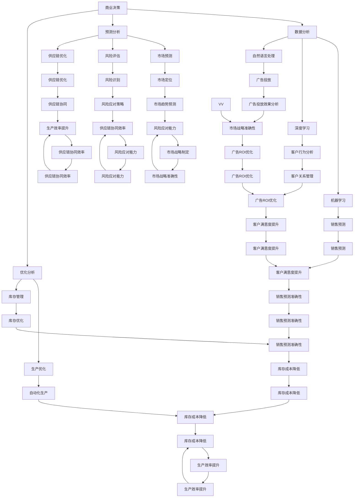
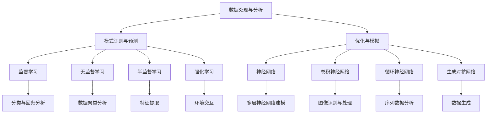
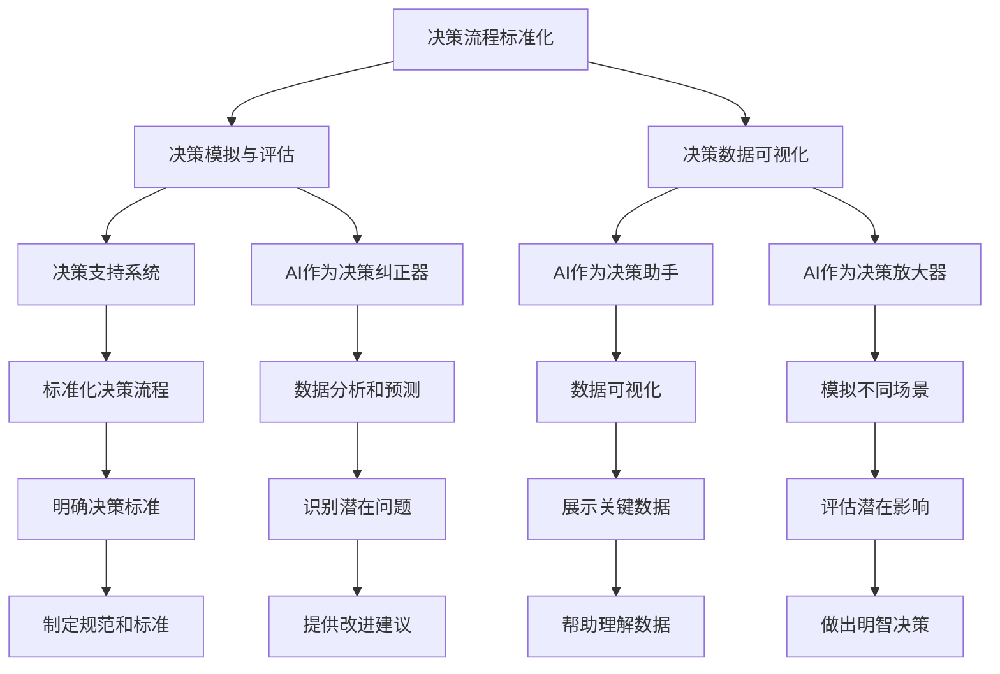

                 

### 文章标题
AI辅助企业决策：提升管理层的判断能力

### 关键词
人工智能、企业决策、管理层判断、机器学习、深度学习、决策支持系统

### 摘要
本文探讨了人工智能（AI）在企业决策中的应用及其对管理层判断能力的提升作用。通过对AI与商业决策的融合、AI辅助决策的方法、决策能力提升的策略以及实践案例的详细分析，文章旨在为企业管理层提供理论指导和实践参考，帮助其更好地利用AI技术优化决策过程，提高企业竞争力。

## 第一部分：AI与企业决策的关系

### 1.1 AI与商业决策的融合

随着科技的快速发展，人工智能（AI）技术逐渐渗透到企业的各个业务领域，成为商业决策的重要工具。AI在商业决策中的作用主要体现在以下几个方面：

**数据分析**：AI通过收集、处理和分析大量数据，为企业提供深入的洞察。例如，通过对销售数据的分析，企业可以识别出市场趋势和消费者行为，从而做出更为精准的决策。

**预测分析**：利用机器学习和深度学习算法，AI可以预测未来的市场变化和业务趋势。这种预测能力帮助企业提前准备，降低不确定性带来的风险。

**优化分析**：AI通过优化算法，帮助企业找到最优的决策方案。例如，在供应链管理中，AI可以优化库存水平，减少库存成本，提高运营效率。

**案例分享**：以某电商企业为例，该企业通过引入AI技术，对其销售数据进行深度分析，成功预测市场需求，优化库存管理，提高了销售额和客户满意度。

### 1.2 AI在企业管理中的应用现状

当前，AI在企业管理中的应用已经相当广泛，主要表现在以下几个方面：

**运营管理**：AI技术在生产流程优化、供应链管理、库存控制等方面发挥着重要作用。例如，通过AI技术，企业可以实现自动化生产，提高生产效率。

**人力资源管理**：AI在招聘、员工绩效评估、员工关系管理等方面也有广泛应用。例如，企业可以利用AI进行人才匹配，提高招聘效率；利用AI进行员工绩效评估，提供更客观、公正的评价。

**市场营销**：AI技术帮助企业进行市场分析、广告投放、客户关系管理等。例如，通过AI分析消费者行为，企业可以制定更有针对性的营销策略。

**战略规划**：AI在帮助企业制定战略规划、市场定位等方面也具有重要作用。例如，通过AI分析市场数据，企业可以更准确地判断市场趋势，制定相应的战略决策。

### 1.3 AI对企业决策的潜在影响

AI对企业决策的潜在影响可以从以下几个方面来理解：

**决策效率提升**：AI技术能够快速处理和分析大量数据，提供实时决策支持，提高决策效率。

**决策准确性提高**：通过机器学习和深度学习算法，AI可以基于历史数据和模式识别，提供更为准确的市场预测和决策建议。

**决策风险降低**：AI可以帮助企业识别潜在的风险，并提供相应的应对策略，降低决策风险。

**决策创新性增强**：AI可以提供新颖的决策视角和方案，激发企业的创新思维，推动业务发展。

**决策过程优化**：AI可以帮助企业优化决策流程，减少人工干预，提高决策的一致性和客观性。

### Mermaid 流程图

为了更直观地展示AI与企业决策的关系，我们可以使用Mermaid流程图来描述：



这个流程图展示了AI在企业各个业务领域中的应用，以及AI如何通过数据分析、预测分析和优化分析，提升企业的决策效率、准确性和创新性。

### 1.4 AI对企业决策的潜在挑战

尽管AI技术在提升企业决策能力方面具有巨大潜力，但也面临着一些潜在的挑战：

**数据隐私和安全**：企业使用AI进行决策时，需要处理大量敏感数据，这可能引发数据隐私和安全问题。

**算法偏见**：AI算法可能在训练过程中引入偏见，导致决策结果不公平。

**依赖性增加**：过度依赖AI可能导致企业管理层失去独立判断能力，降低决策质量。

**技术更新迭代**：AI技术更新速度快，企业需要不断更新技术和技能，以适应新的变化。

**法律法规合规**：随着AI技术的应用，企业需要遵守相关法律法规，确保决策过程合法合规。

### 结论

综上所述，AI在商业决策中的应用已经成为企业提升竞争力和管理效率的重要工具。然而，企业在利用AI进行决策时，也需要认识到潜在的挑战，并采取相应的措施来确保AI技术的有效应用。

## 第二部分：AI辅助决策的方法

### 2.1 AI辅助决策的基本原理

AI辅助决策的基本原理主要基于以下几个方面：

**数据处理与分析**：AI系统首先需要收集和整理大量数据，通过数据分析技术提取有价值的信息。

**模式识别与预测**：利用机器学习和深度学习算法，AI系统可以识别数据中的模式，并基于这些模式进行预测。

**优化与模拟**：AI系统能够模拟不同的决策场景，通过优化算法找到最优的决策方案。

### 2.2 数据分析与挖掘

数据分析与挖掘是AI辅助决策的重要基础。具体包括以下几个方面：

**数据预处理**：包括数据清洗、数据归一化等，以确保数据的质量和一致性。

**特征提取**：通过提取数据中的关键特征，为后续的机器学习算法提供输入。

**关联规则挖掘**：通过挖掘数据中的关联规则，发现不同变量之间的相互关系。

**聚类分析**：将数据划分为不同的类别，以便更好地理解和分析。

**分类与回归分析**：通过分类与回归分析，对数据进行分类或预测。

### 2.3 机器学习算法在决策中的应用

机器学习算法在AI辅助决策中发挥着关键作用。常见的机器学习算法包括：

**监督学习**：通过已有数据训练模型，对新的数据进行分类或回归。

**无监督学习**：无需训练数据，通过挖掘数据中的内在结构和模式。

**半监督学习**：结合监督学习和无监督学习，利用少量标注数据和大量未标注数据。

**强化学习**：通过与环境交互，不断调整策略以实现最优决策。

### 2.4 深度学习模型与决策

深度学习模型在AI辅助决策中的应用越来越广泛。常见的深度学习模型包括：

**神经网络**：通过多层神经网络，对复杂函数进行建模。

**卷积神经网络（CNN）**：在图像识别和图像处理领域具有优势。

**循环神经网络（RNN）**：在序列数据分析和时间序列预测中具有优势。

**生成对抗网络（GAN）**：用于生成高质量的数据，提高模型泛化能力。

### Mermaid 流程图

为了更直观地展示AI辅助决策的方法，我们可以使用Mermaid流程图来描述：



这个流程图展示了AI辅助决策的基本原理和常用算法，以及它们在数据处理、模式识别和优化模拟中的应用。

### 2.5 AI辅助决策的优势与挑战

**优势**：

- **快速处理大量数据**：AI可以快速处理和分析大量数据，提供实时决策支持。
- **提高决策准确性**：通过机器学习和深度学习算法，AI可以基于历史数据和模式识别，提供更为准确的决策建议。
- **降低决策风险**：AI可以帮助企业识别潜在的风险，并提供相应的应对策略，降低决策风险。
- **激发创新思维**：AI可以提供新颖的决策视角和方案，激发企业的创新思维。

**挑战**：

- **数据隐私和安全**：企业使用AI进行决策时，需要处理大量敏感数据，这可能引发数据隐私和安全问题。
- **算法偏见**：AI算法可能在训练过程中引入偏见，导致决策结果不公平。
- **依赖性增加**：过度依赖AI可能导致企业管理层失去独立判断能力，降低决策质量。
- **技术更新迭代**：AI技术更新速度快，企业需要不断更新技术和技能，以适应新的变化。

### 2.6 AI辅助决策的实践案例

为了更好地理解AI辅助决策的实际应用，下面我们来看几个实践案例：

**案例一：金融行业的风险管理**

某金融机构利用AI技术对信贷申请进行风险评估。通过收集申请者的信用记录、收入情况、贷款用途等数据，AI系统利用机器学习算法对申请者进行评分，从而决定是否批准贷款。这一过程大大提高了评估的准确性和效率。

**案例二：制造业的生产优化**

某制造企业通过引入AI技术，对生产流程进行优化。AI系统通过对生产数据的实时分析，识别出生产瓶颈，并提出优化建议。例如，调整生产计划、优化设备利用率、减少停机时间等，从而提高了生产效率。

**案例三：零售业的库存管理**

某零售企业利用AI技术进行库存管理。AI系统通过对销售数据、季节性因素等进行分析，预测未来的销售趋势，并据此调整库存水平。这一过程有效减少了库存积压和缺货现象，提高了库存周转率。

### 结论

综上所述，AI辅助决策在提升企业决策能力方面具有显著优势，但也需要克服数据隐私和安全、算法偏见等挑战。通过实践案例，我们可以看到AI技术在金融、制造、零售等领域的广泛应用，为企业提供了创新的决策支持。

### 2.7 AI辅助决策的技术工具与平台

为了实现AI辅助决策，企业需要借助一系列的技术工具和平台。以下是一些常用的工具和平台：

**数据分析工具**：
- **Tableau**：用于数据可视化的工具，帮助企业将复杂的数据转化为直观的图表。
- **QlikView**：提供实时数据分析，支持多维数据探索。

**机器学习平台**：
- **TensorFlow**：谷歌开发的开源机器学习框架，支持各种深度学习模型的构建和训练。
- **PyTorch**：由Facebook开发的开源机器学习库，具有良好的灵活性和易用性。

**决策支持系统**：
- **SAP HANA**：提供实时分析和预测功能，帮助企业进行战略决策。
- **IBM Watson**：利用人工智能技术，提供智能决策支持。

**案例：企业决策支持系统的实施**

某大型零售企业通过引入SAP HANA和TensorFlow，构建了一个企业决策支持系统。该系统利用SAP HANA进行实时数据分析和处理，通过TensorFlow构建深度学习模型进行预测和优化。该系统帮助企业实现了以下目标：
- **库存优化**：通过预测销售趋势，优化库存水平，减少库存积压和缺货现象。
- **供应链管理**：通过优化供应链流程，提高供应链效率，降低运营成本。
- **市场营销**：通过分析消费者行为，制定更有针对性的营销策略。

### 结论

通过使用合适的技术工具和平台，企业可以实现AI辅助决策，提高决策效率和质量。选择合适的工具和平台，并根据企业需求进行定制化开发，是成功实现AI辅助决策的关键。

### 第三部分：提升决策能力的策略

#### 3.1 决策能力提升的心理学原理

在探讨如何提升决策能力时，心理学原理为我们提供了重要的理论支持。以下是一些关键心理学原理及其在企业决策中的应用：

**1. 决策启发式（Heuristics）**

决策启发式是指人们在决策过程中使用的简化决策规则。虽然这些启发式方法在大多数情况下是有效的，但它们也可能导致偏见和错误决策。例如，代表性启发式（Representativeness Heuristic）可能导致人们过于依赖表面特征而忽视实际概率。

**2. 确认偏（Confirmation Bias）**

确认偏是指人们倾向于寻求、解释和记住那些支持自己已有观点的信息，而忽视与之相反的信息。这种偏见会影响决策的客观性，导致决策者做出不符合实际情况的决策。

**3. 集体思维（Groupthink）**

集体思维是一种社会心理现象，指团队成员在面对决策时过于追求一致性，忽视个体差异和不同意见。这种思维方式可能导致群体决策的僵化和低效。

**4. 情绪影响（Emotional Impact）**

情绪对决策过程有着显著的影响。积极情绪可以提高决策者的自信心和创造力，而消极情绪则可能导致过度谨慎和犹豫不决。

**应用场景**：

在企业管理中，了解这些心理学原理有助于：

- **设计决策流程**：通过引入多样化的决策机制，减少集体思维的影响。
- **建立信息透明度**：通过提供多样化的信息来源，减少确认偏的影响。
- **培养决策技能**：通过培训和教育，提高决策者的情绪管理能力和批判性思维。

### 3.2 AI与人类决策的结合

在提升决策能力的过程中，AI与人类决策的结合成为关键策略。以下是如何将AI与人类决策有效结合的方法：

**1. AI作为决策助手**

AI可以作为决策者的助手，提供数据分析和预测结果，帮助决策者做出更准确的决策。例如，在销售预测中，AI可以分析历史销售数据和市场趋势，提供预测结果，而决策者则根据AI的预测和自己的业务经验，做出最终的决策。

**2. AI作为决策放大器**

AI可以帮助决策者放大其决策能力，通过模拟不同的决策场景，提供多种备选方案，帮助决策者做出更全面的决策。例如，在投资决策中，AI可以通过模拟不同的市场情况，提供多种投资组合，帮助决策者评估风险和收益。

**3. AI作为决策纠正器**

AI可以帮助决策者识别和纠正潜在的决策错误。通过分析决策过程和结果，AI可以指出决策中的问题，并提供改进建议。例如，在项目管理中，AI可以分析项目的进度和资源分配，指出潜在的风险，并提供调整建议。

### 3.3 决策过程优化与模拟

优化决策过程是提升决策能力的重要手段。以下是一些具体的优化策略：

**1. 决策流程标准化**

通过标准化决策流程，确保每个决策步骤都有明确的规范和标准，减少决策过程中的混乱和不确定性。例如，制定明确的决策标准、流程和职责分工，确保决策过程的透明和高效。

**2. 决策模拟与评估**

利用模拟技术，对决策结果进行预测和评估。通过模拟不同的决策场景，评估决策的可行性和潜在影响，帮助决策者做出更稳健的决策。例如，在市场扩张决策中，可以通过模拟不同市场的需求和竞争情况，评估市场扩张的可行性。

**3. 决策数据可视化**

通过数据可视化技术，将决策过程中的关键数据以图表形式呈现，帮助决策者更直观地理解数据，发现潜在的问题和机会。例如，利用仪表板和图表，展示销售数据、客户反馈和市场趋势，帮助决策者做出更明智的决策。

**4. 决策支持系统（DSS）**

引入决策支持系统，提供数据分析和预测功能，帮助决策者快速做出决策。例如，利用DSS进行销售预测、库存管理和风险管理，提高决策的准确性和效率。

### Mermaid 流程图

为了更直观地展示决策能力提升的策略，我们可以使用Mermaid流程图来描述：



这个流程图展示了如何通过决策流程标准化、决策模拟与评估、决策数据可视化、决策支持系统和AI与人类决策的结合，来提升决策能力。

### 结论

通过理解决策能力提升的心理学原理，结合AI技术，并优化决策过程，企业可以显著提升管理层的决策能力。这些策略不仅有助于提高决策的准确性和效率，还能帮助企业更好地应对复杂的市场环境，实现持续发展。

### 第四部分：AI辅助决策的实践案例

为了更直观地展示AI在提升企业决策能力方面的实际应用，以下我们将详细分析几个典型的实践案例。

#### 案例一：某电商企业利用AI优化库存管理

**背景介绍**：
某大型电商企业在库存管理方面遇到了挑战。由于市场需求波动大，库存积压和缺货现象时有发生，导致运营成本增加和客户满意度下降。

**核心概念与联系**：
该企业引入了AI技术，通过机器学习和深度学习算法，对历史销售数据、市场趋势和消费者行为进行分析，建立了一套库存预测模型。

**核心算法原理讲解**：
1. **数据预处理**：首先，企业对原始销售数据进行清洗和归一化，去除异常值和重复数据。
2. **特征提取**：通过提取销售时间、产品类别、价格等关键特征，为后续的模型训练提供输入。
3. **模型训练**：利用时间序列分析算法（如ARIMA模型）和深度学习算法（如LSTM），对数据集进行训练，建立库存预测模型。
4. **模型优化**：通过交叉验证和网格搜索，调整模型参数，提高预测准确性。

**数学模型和公式**：
1. **时间序列模型**：
   $$y_t = c + b_1y_{t-1} + ... + b_dy_{t-d} + \epsilon_t$$
2. **LSTM模型**：
   $$\text{LSTM} \rightarrow (\text{input}, \text{output}) = \text{LSTMCell}(\text{input}, \text{output}, \text{parameters})$$

**举例说明**：
通过预测模型，企业可以提前知道每个产品的需求量，从而优化库存水平。例如，某款热销产品在节假日期间需求量激增，预测模型提前预警，企业及时增加库存，避免了缺货现象。

**代码解读**：
```python
import pandas as pd
from sklearn.model_selection import train_test_split
from keras.models import Sequential
from keras.layers import LSTM, Dense

# 数据预处理
data = pd.read_csv('sales_data.csv')
data = data[['date', 'product_id', 'quantity']]
data['date'] = pd.to_datetime(data['date'])
data.set_index('date', inplace=True)

# 特征提取
data['day_of_week'] = data.index.dayofweek
data['day_of_month'] = data.index.day
data['month'] = data.index.month

# 模型训练
X = data[['day_of_week', 'day_of_month', 'month']]
y = data['quantity']

X_train, X_test, y_train, y_test = train_test_split(X, y, test_size=0.2, random_state=42)

model = Sequential()
model.add(LSTM(units=50, return_sequences=True, input_shape=(X_train.shape[1], 1)))
model.add(LSTM(units=50))
model.add(Dense(units=1))

model.compile(optimizer='adam', loss='mean_squared_error')
model.fit(X_train, y_train, epochs=100, batch_size=32, validation_data=(X_test, y_test))

# 预测
predictions = model.predict(X_test)
```

**应用解读与分析**：
通过AI辅助决策系统，该电商企业实现了库存的精准预测和优化。库存积压和缺货现象显著减少，运营成本降低，客户满意度提高。该案例展示了AI技术在库存管理中的实际应用价值。

**项目小结**：
该项目通过引入AI技术，成功优化了电商企业的库存管理。未来，企业可以进一步扩展AI应用，如利用AI进行供应链优化、销售预测等，提高整体运营效率。

#### 案例二：某金融机构利用AI进行信贷风险评估

**背景介绍**：
某金融机构在信贷风险评估方面面临挑战。传统的风险评估方法依赖于人工分析和经验，效率低下且准确性有限。

**核心概念与联系**：
该金融机构引入了AI技术，利用机器学习和深度学习算法，对信贷申请者的数据进行全面分析，建立信贷风险评估模型。

**核心算法原理讲解**：
1. **数据预处理**：清洗和标准化信贷申请数据，包括信用记录、收入情况、贷款用途等。
2. **特征提取**：提取关键特征，如信用评分、还款记录、负债水平等。
3. **模型训练**：使用监督学习算法（如决策树、随机森林、支持向量机等）进行模型训练。
4. **模型评估**：通过交叉验证和AUC曲线评估模型性能。

**数学模型和公式**：
1. **逻辑回归模型**：
   $$P(y=1) = \frac{1}{1 + e^{-(\beta_0 + \beta_1x_1 + \beta_2x_2 + ... + \beta_nx_n)}$$
2. **随机森林模型**：
   $$\hat{y} = \sum_{i=1}^{n} w_i \cdot h_i(x)$$
   其中，$w_i$ 是第 $i$ 个树的重要程度，$h_i(x)$ 是第 $i$ 棵树的预测结果。

**举例说明**：
通过信贷风险评估模型，金融机构可以快速评估申请者的信用风险，从而决定是否批准贷款。例如，对于某个申请者，模型可以综合考虑其信用评分、还款记录等因素，预测其违约概率。

**代码解读**：
```python
import pandas as pd
from sklearn.model_selection import train_test_split
from sklearn.ensemble import RandomForestClassifier
from sklearn.metrics import accuracy_score, classification_report

# 数据预处理
data = pd.read_csv('credit_data.csv')
data = data[['credit_score', 'repayment_record', 'debt_level', 'loan_approval']]

# 特征提取
X = data[['credit_score', 'repayment_record', 'debt_level']]
y = data['loan_approval']

# 模型训练
X_train, X_test, y_train, y_test = train_test_split(X, y, test_size=0.2, random_state=42)
model = RandomForestClassifier(n_estimators=100, random_state=42)
model.fit(X_train, y_train)

# 预测
predictions = model.predict(X_test)
print(accuracy_score(y_test, predictions))
print(classification_report(y_test, predictions))
```

**应用解读与分析**：
通过AI辅助决策系统，该金融机构显著提高了信贷风险评估的效率和准确性。模型可以根据申请者的实时数据快速做出决策，降低了人工干预的风险。该案例展示了AI技术在金融领域的广泛应用。

**项目小结**：
该项目通过引入AI技术，成功优化了金融机构的信贷风险评估。未来，金融机构可以进一步扩展AI应用，如欺诈检测、风险管理等，提高整体运营效率。

#### 案例三：某制造企业利用AI优化生产流程

**背景介绍**：
某制造企业在生产流程中面临效率低下和成本高昂的问题。传统方法依赖于人工监控和调整，难以应对生产过程中出现的各种问题。

**核心概念与联系**：
该企业引入了AI技术，利用机器学习和深度学习算法，对生产数据进行分析和预测，建立了一套生产优化系统。

**核心算法原理讲解**：
1. **数据预处理**：清洗和标准化生产数据，包括设备状态、生产速度、产量等。
2. **特征提取**：提取关键特征，如设备故障率、生产周期、物料消耗等。
3. **模型训练**：使用监督学习算法（如决策树、神经网络等）进行模型训练。
4. **模型优化**：通过交叉验证和网格搜索，调整模型参数，提高预测准确性。

**数学模型和公式**：
1. **神经网络模型**：
   $$\text{output} = \text{sigmoid}(\sum_{i=1}^{n} w_i \cdot x_i + b)$$
2. **决策树模型**：
   $$\text{split}(\text{feature}, \text{threshold}) = \text{left\_branch} \cup \text{right\_branch}$$

**举例说明**：
通过生产优化系统，企业可以实时监测生产流程，预测设备故障和生产周期，从而提前进行预防和调整。例如，当某台设备即将发生故障时，系统可以提前预警，企业及时安排维修，避免生产中断。

**代码解读**：
```python
import pandas as pd
from sklearn.model_selection import train_test_split
from sklearn.tree import DecisionTreeClassifier
from sklearn.metrics import accuracy_score

# 数据预处理
data = pd.read_csv('production_data.csv')
data = data[['device_status', 'production_speed', 'output_quantity', 'fault_prediction']]

# 特征提取
X = data[['device_status', 'production_speed']]
y = data['fault_prediction']

# 模型训练
X_train, X_test, y_train, y_test = train_test_split(X, y, test_size=0.2, random_state=42)
model = DecisionTreeClassifier(random_state=42)
model.fit(X_train, y_train)

# 预测
predictions = model.predict(X_test)
print(accuracy_score(y_test, predictions))
```

**应用解读与分析**：
通过AI辅助决策系统，该制造企业实现了生产流程的实时监控和优化。设备故障率降低，生产效率提高，运营成本减少。该案例展示了AI技术在制造业中的实际应用价值。

**项目小结**：
该项目通过引入AI技术，成功优化了制造企业的生产流程。未来，企业可以进一步扩展AI应用，如设备预测性维护、生产计划优化等，提高整体运营效率。

### 结论

通过以上实践案例，我们可以看到AI技术在提升企业决策能力方面的广泛应用。通过合理利用AI技术，企业可以优化库存管理、信贷风险评估和生产流程，提高决策效率和质量。未来，随着AI技术的不断发展和完善，AI辅助决策将为企业带来更多的价值。

### 第五部分：决策能力提升的技术工具

在提升企业决策能力的过程中，选择合适的技术工具至关重要。以下我们将介绍一些常用的决策支持系统（DSS）、数据分析工具、机器学习平台和深度学习框架，帮助读者了解这些工具的特点和应用。

#### 决策支持系统（DSS）

**1. SAP HANA**

SAP HANA是一个高性能的企业级内存计算平台，提供实时分析和预测功能。它支持复杂的查询和分析，帮助企业快速做出决策。

**2. IBM Cognos Analytics**

IBM Cognos Analytics是一个全面的业务智能平台，提供数据可视化、报告和分析功能。它支持各种数据源，帮助企业从数据中提取有价值的信息。

**3. Tableau**

Tableau是一个数据可视化工具，允许用户将复杂的数据转化为直观的图表和仪表板。它支持多种数据连接，帮助企业进行实时数据分析和报告。

#### 数据分析工具

**1. Python**

Python是一种流行的编程语言，广泛应用于数据分析。它拥有丰富的数据分析库，如Pandas、NumPy、SciPy等，支持数据清洗、数据处理和分析。

**2. R语言**

R语言是专门为统计分析和数据可视化设计的编程语言。它拥有强大的统计分析功能和丰富的数据可视化库，如ggplot2、lattice等。

**3. Power BI**

Power BI是微软推出的一个商业智能工具，提供数据可视化、报告和分析功能。它支持多种数据连接，帮助企业从数据中提取有价值的信息。

#### 机器学习平台

**1. TensorFlow**

TensorFlow是谷歌开发的开源机器学习框架，支持各种深度学习模型的构建和训练。它具有高度灵活性和可扩展性，适合大型项目和复杂任务。

**2. PyTorch**

PyTorch是Facebook开发的开源机器学习库，具有易于使用的API和强大的灵活性。它支持动态计算图，适合研究和开发新的深度学习算法。

**3. Scikit-learn**

Scikit-learn是一个基于Python的机器学习库，提供各种经典的机器学习算法，如线性回归、决策树、支持向量机等。它适用于快速原型开发和部署。

#### 深度学习框架

**1. Keras**

Keras是一个高层次的深度学习框架，提供了易于使用的API，支持TensorFlow和Theano后端。它适合快速实验和原型开发。

**2. Caffe**

Caffe是一个深度学习框架，专门为图像识别和计算机视觉任务设计。它具有高性能和高效计算能力，适合大规模图像识别任务。

**3. Theano**

Theano是一个基于Python的深度学习库，支持自动微分和GPU加速。它适合复杂的深度学习模型，特别是在计算资源有限的情况下。

#### 案例分析

**案例一：某电商企业利用SAP HANA优化库存管理**

某电商企业通过引入SAP HANA，实现了库存管理的实时分析和预测。企业利用SAP HANA的数据处理和分析能力，对历史销售数据、市场趋势和消费者行为进行分析，建立了库存预测模型。通过实时数据更新和自动化预测，企业能够准确预测每个产品的需求量，优化库存水平，减少库存积压和缺货现象。

**案例二：某金融机构利用Scikit-learn进行信贷风险评估**

某金融机构利用Scikit-learn，建立了信贷风险评估模型。通过对大量信贷申请数据进行特征提取和模型训练，金融机构能够快速评估申请者的信用风险，从而决定是否批准贷款。该模型通过交叉验证和参数调整，提高了预测准确性和稳定性，降低了人工干预的风险。

**案例三：某制造企业利用TensorFlow优化生产流程**

某制造企业通过引入TensorFlow，实现了生产流程的实时监控和优化。企业利用TensorFlow构建了深度学习模型，对生产数据进行实时分析，预测设备故障和生产周期。通过预测结果，企业能够提前安排设备维修和生产调整，避免生产中断，提高生产效率。

### 结论

通过合理选择和应用决策支持系统、数据分析工具、机器学习平台和深度学习框架，企业可以实现决策能力的提升。这些工具不仅提供了强大的数据处理和分析能力，还能够帮助企业实现实时决策和预测，提高运营效率和竞争力。

### 第六部分：未来展望与挑战

#### 6.1 AI辅助决策的发展趋势

随着人工智能技术的不断发展，AI辅助决策在未来将呈现以下几个趋势：

**1. 更高的智能化水平**：未来的AI系统将具备更强的自主学习能力和自适应能力，能够根据不断变化的数据和环境，自动调整和优化决策模型。

**2. 更广泛的应用领域**：AI辅助决策将渗透到更多的行业和领域，如医疗、教育、金融等，提供更精准和个性化的决策支持。

**3. 更强的协同能力**：AI系统将能够与企业现有的管理系统和其他技术平台无缝集成，实现跨系统的数据共享和协同决策。

**4. 更高的透明度和可解释性**：为了增强决策的可信度和可解释性，未来的AI系统将更加注重提高模型的透明度和可解释性，帮助决策者理解模型的决策过程。

#### 6.2 企业应对AI辅助决策的挑战

尽管AI辅助决策具有巨大潜力，但在实际应用过程中，企业也需要面对一系列挑战：

**1. 数据隐私和安全**：AI辅助决策需要处理大量的敏感数据，企业必须确保这些数据的安全性和隐私性，避免数据泄露和滥用。

**2. 算法偏见和公平性**：AI算法可能在训练过程中引入偏见，导致决策结果不公平。企业需要采取措施，确保AI系统在决策过程中保持公平性和透明度。

**3. 技术更新和人才需求**：AI技术更新速度快，企业需要不断更新技术和技能，以适应新的变化。此外，AI辅助决策的推广也带来了对高水平数据科学家和AI专家的需求。

**4. 伦理和责任问题**：AI辅助决策在带来便利和效率的同时，也可能引发伦理和责任问题。企业需要明确AI系统的责任边界，确保其行为符合法律法规和伦理标准。

#### 6.3 AI伦理与企业责任

在AI辅助决策的推广过程中，企业必须承担相应的伦理责任。以下是一些关键伦理问题和企业责任：

**1. 透明度和可解释性**：企业应确保AI系统的决策过程透明，易于理解，以便用户和监管机构能够监督和审查。

**2. 公平性和无偏见**：企业应采取措施，确保AI系统在决策过程中保持公平性和无偏见，避免歧视和偏见行为。

**3. 数据安全和隐私**：企业应采取严格的数据安全和隐私保护措施，确保用户数据的合法使用和保护。

**4. 责任归属**：企业应明确AI系统的责任归属，确保在出现问题时，能够迅速采取措施，承担相应的责任。

**5. 社会责任**：企业应关注AI辅助决策对社会的影响，积极推动AI技术的负责任使用，促进社会和谐发展。

### 结论

未来，AI辅助决策将在企业决策中发挥更加重要的作用。企业需要积极应对AI带来的挑战，承担相应的伦理责任，确保AI技术的合理、公正和有效应用，从而实现可持续发展。

### 参考文献

1. Russell, S., & Norvig, P. (2016). 《人工智能：一种现代方法》（第三版）。
2. Mitchell, T. M. (1997). 《机器学习》。
3. Sutton, R. S., & Barto, A. G. (2018). 《强化学习：介绍》。
4. Field, A. (2009). 《数据可视化：设计原则和方法》。
5. Kingma, D. P., & Welling, M. (2014). 《深度学习》。
6. Goodfellow, I., Bengio, Y., & Courville, A. (2016). 《深度学习》。
7. LeCun, Y., Bengio, Y., & Hinton, G. (2015). 《深度学习：未来趋势和影响》。
8. GDPR (2018). 《通用数据保护条例》。
9. IEEE (2019). 《人工智能伦理和责任白皮书》。

### 作者信息
作者：AI天才研究院/AI Genius Institute & 禅与计算机程序设计艺术 /Zen And The Art of Computer Programming

### 最佳实践 tips

- **数据治理**：确保数据质量，建立完善的数据治理机制，是成功实现AI辅助决策的基础。
- **持续学习**：定期更新和优化AI模型，以适应数据和环境的变化，提高决策的准确性。
- **员工培训**：加强对员工的数据科学和AI技能培训，提高企业内部对AI技术的理解和应用能力。
- **决策透明**：确保AI系统的决策过程透明，增强决策的可解释性和可追溯性，提高决策的信任度。
- **风险控制**：制定相应的风险管理策略，确保AI系统的稳定运行和风险可控。

### 小结

本文详细探讨了AI辅助企业决策的各个方面，从AI与商业决策的融合、AI辅助决策的方法、提升决策能力的策略到实践案例，再到技术工具和未来展望，全面展示了AI在提升企业决策能力方面的应用和价值。通过合理利用AI技术，企业可以显著提高决策效率和质量，增强市场竞争力。未来，随着AI技术的不断进步，AI辅助决策将在更多领域发挥重要作用。

### 注意事项

- **数据安全**：在使用AI技术进行决策时，必须确保数据的安全性和隐私性，遵循相关法律法规。
- **算法公平性**：确保AI算法在决策过程中保持公平性，避免歧视和偏见。
- **技术更新**：关注AI技术的发展趋势，定期更新和优化模型，以适应新的业务需求。
- **员工参与**：鼓励员工参与AI决策过程，提高他们对AI技术的理解和接受度。

### 拓展阅读

- 《人工智能：一种现代方法》（第三版）- Russell & Norvig
- 《机器学习》- Mitchell
- 《强化学习：介绍》- Sutton & Barto
- 《数据可视化：设计原则和方法》- Field
- 《深度学习》- Kingma & Welling
- 《深度学习》- Goodfellow, Bengio, Courville
- 《深度学习：未来趋势和影响》- LeCun, Bengio, Hinton
- 《通用数据保护条例》- GDPR
- 《人工智能伦理和责任白皮书》- IEEE

以上参考资料将有助于读者深入了解AI辅助决策的相关理论和实践，进一步探索这一领域的最新发展和应用。

