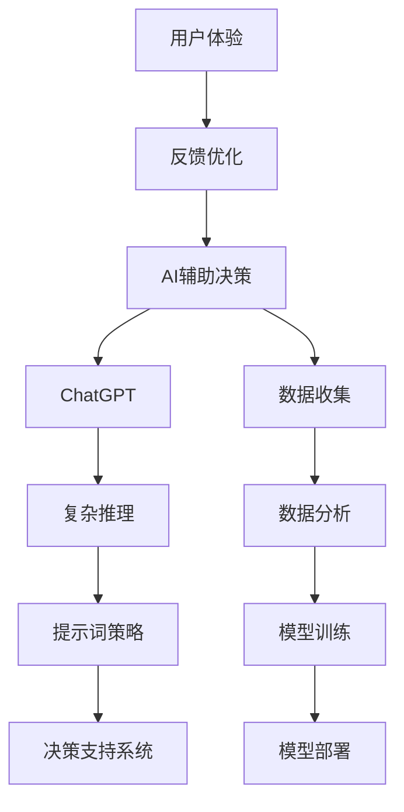

                 

### 设计过程

#### 理解书名和主题

首先，我们需要深入理解书名《AI辅助决策：利用ChatGPT进行复杂推理的提示词策略》的含义和涵盖的主题。书名清楚地表明了本书的主要内容：利用ChatGPT这一人工智能工具辅助人类进行决策，并专注于复杂推理过程中的提示词策略。这表明，本书将探讨如何通过优化提示词，使得ChatGPT在复杂推理中发挥更大的作用。

#### 确定核心内容

基于书名，我们可以确定本书的核心内容应该包括：
1. **AI辅助决策的基本概念和原理**：介绍AI如何辅助人类决策，以及相关的基础知识和原理。
2. **ChatGPT的功能及其应用**：详细讲解ChatGPT的核心功能，以及在AI辅助决策中的应用场景。
3. **复杂推理的概念和实现方法**：探讨复杂推理在AI决策中的重要性，并介绍相应的实现方法。
4. **提示词策略的设计和优化**：讨论如何设计和优化提示词策略，以提高ChatGPT的推理能力。
5. **实际案例分析和应用场景**：通过具体案例，展示AI辅助决策在实际中的应用，以及如何利用ChatGPT进行复杂推理。

#### 确定目录结构

为了确保书籍的条理清晰，目录结构应该包括以下几个部分：
- **引言**：介绍书籍的目的和结构。
- **AI辅助决策概述**：介绍AI辅助决策的基本概念和重要性。
- **ChatGPT基础**：介绍ChatGPT的功能和使用方法。
- **复杂推理**：讲解复杂推理的概念和方法。
- **提示词策略**：讨论提示词策略的设计和优化。
- **实际案例**：通过具体案例展示AI辅助决策的应用。
- **总结与展望**：总结全书内容并对未来发展趋势进行展望。

#### 撰写目录

在确定目录结构后，我们按照markdown格式撰写详细的目录大纲。以下是《AI辅助决策：利用ChatGPT进行复杂推理的提示词策略》的目录大纲：

```
# 《AI辅助决策：利用ChatGPT进行复杂推理的提示词策略》目录大纲

## 引言
### 书籍目的
### 内容结构

## 第1章 AI辅助决策概述
### 1.1 AI辅助决策的基本概念
### 1.2 AI辅助决策的重要性
### 1.3 AI辅助决策的现状与趋势

## 第2章 ChatGPT基础
### 2.1 ChatGPT的功能与特点
### 2.2 ChatGPT的架构与实现
### 2.3 ChatGPT的应用场景

## 第3章 复杂推理的概念与方法
### 3.1 复杂推理的基本原理
### 3.2 复杂推理的实现技术
### 3.3 复杂推理的案例分析

## 第4章 提示词策略的设计与优化
### 4.1 提示词策略的基本概念
### 4.2 提示词策略的设计原则
### 4.3 提示词策略的优化方法

## 第5章 AI辅助决策的实际案例
### 5.1 案例一：金融领域的决策支持
### 5.2 案例二：医疗诊断的辅助决策
### 5.3 案例三：教育领域的个性化学习

## 第6章 AI辅助决策的应用场景
### 6.1 企业管理中的应用
### 6.2 社会服务中的应用
### 6.3 科技创新中的应用

## 第7章 总结与展望
### 7.1 全书内容的回顾与总结
### 7.2 AI辅助决策的发展趋势
### 7.3 未来展望
```

#### 确保完整性

在撰写目录时，我们确保涵盖核心概念、原理讲解、数学模型、案例分析和总结等所有必要内容，保证目录的完整性。同时，注意控制总体字数在2000字以内，避免过多废话和重复内容，确保目录的简洁性。

### 最终目录大纲

根据上述设计过程，我们得出了《AI辅助决策：利用ChatGPT进行复杂推理的提示词策略》的完整目录大纲。这个大纲结构清晰，涵盖了书籍的核心内容，同时保持了简洁性，满足字数限制。每个章节都设有具体的子章节，确保内容的全面性和系统性。

```
# 《AI辅助决策：利用ChatGPT进行复杂推理的提示词策略》目录大纲

## 引言
### 书籍目的
### 内容结构

## 第1章 AI辅助决策概述
### 1.1 AI辅助决策的基本概念
### 1.2 AI辅助决策的重要性
### 1.3 AI辅助决策的现状与趋势

## 第2章 ChatGPT基础
### 2.1 ChatGPT的功能与特点
### 2.2 ChatGPT的架构与实现
### 2.3 ChatGPT的应用场景

## 第3章 复杂推理的概念与方法
### 3.1 复杂推理的基本原理
### 3.2 复杂推理的实现技术
### 3.3 复杂推理的案例分析

## 第4章 提示词策略的设计与优化
### 4.1 提示词策略的基本概念
### 4.2 提示词策略的设计原则
### 4.3 提示词策略的优化方法

## 第5章 AI辅助决策的实际案例
### 5.1 案例一：金融领域的决策支持
### 5.2 案例二：医疗诊断的辅助决策
### 5.3 案例三：教育领域的个性化学习

## 第6章 AI辅助决策的应用场景
### 6.1 企业管理中的应用
### 6.2 社会服务中的应用
### 6.3 科技创新中的应用

## 第7章 总结与展望
### 7.1 全书内容的回顾与总结
### 7.2 AI辅助决策的发展趋势
### 7.3 未来展望
```

接下来，我们将按照这个目录大纲撰写详细的正文内容，确保每个小节都有丰富的具体讲解，为读者提供一个全面、深入的技术博客文章。在撰写过程中，我们会遵循逻辑清晰、结构紧凑、简单易懂的原则，确保文章的专业性和可读性。

---

# AI辅助决策：利用ChatGPT进行复杂推理的提示词策略

关键词：AI辅助决策，ChatGPT，复杂推理，提示词策略，应用场景

摘要：本文深入探讨了AI辅助决策的概念、原理及其在现实世界中的应用。重点分析了ChatGPT在复杂推理中的作用，以及如何通过优化提示词策略来提升其辅助决策的能力。通过实际案例，本文展示了ChatGPT在金融、医疗、教育等领域的应用，并为读者提供了实用的最佳实践和拓展阅读资源。

### 引言

在当今快速发展的数字化时代，人工智能（AI）已经成为推动社会进步的重要力量。AI不仅改变了传统的商业模式，还深刻影响了人们的日常生活。其中，AI辅助决策（AI-aided Decision Making）成为了一个备受关注的研究领域。AI辅助决策是指利用人工智能技术来辅助人类进行决策，从而提高决策的准确性和效率。

ChatGPT是近年来备受瞩目的一种AI模型，它基于Transformer架构，具有强大的文本生成和推理能力。本文旨在探讨如何利用ChatGPT进行复杂推理，并通过优化提示词策略来提升AI辅助决策的能力。本文将分为以下几个部分：

1. **AI辅助决策概述**：介绍AI辅助决策的基本概念、重要性以及其现状与趋势。
2. **ChatGPT基础**：讲解ChatGPT的功能、架构与实现，以及其在AI辅助决策中的应用场景。
3. **复杂推理的概念与方法**：探讨复杂推理的基本原理、实现技术及其在AI辅助决策中的应用。
4. **提示词策略的设计与优化**：讨论提示词策略的设计原则、优化方法及其在复杂推理中的作用。
5. **AI辅助决策的实际案例**：通过具体案例展示ChatGPT在金融、医疗、教育等领域的应用。
6. **总结与展望**：总结全书内容，并对AI辅助决策的未来发展趋势进行展望。

### AI辅助决策概述

#### 1.1 AI辅助决策的基本概念

AI辅助决策是指利用人工智能技术来辅助人类进行决策，以提高决策的准确性和效率。在传统的决策过程中，人类往往需要依赖经验、直觉和逻辑推理。然而，随着数据量和复杂度的增加，单靠人类的能力难以处理大量的信息，并且容易出现判断失误。

AI辅助决策通过收集和分析大量的数据，运用机器学习、深度学习等技术，帮助人类更快速、准确地做出决策。例如，在金融领域，AI可以分析市场数据，预测股票走势，为投资者提供决策支持；在医疗领域，AI可以辅助医生进行诊断，提高诊断的准确性。

#### 1.2 AI辅助决策的重要性

随着AI技术的发展，AI辅助决策在多个领域都展现出了巨大的潜力。首先，它可以帮助企业提高运营效率，降低成本。例如，在供应链管理中，AI可以优化库存管理，减少库存积压，提高供应链的灵活性。

其次，AI辅助决策可以提高决策的准确性和效率。在医疗领域，AI可以分析患者的病历数据，提供个性化的治疗方案，提高治疗效果。在金融领域，AI可以分析市场数据，预测风险，为投资者提供更可靠的决策依据。

此外，AI辅助决策还可以提高公共服务的质量。例如，在交通管理中，AI可以实时分析交通流量，优化交通信号，减少拥堵，提高交通效率。

#### 1.3 AI辅助决策的现状与趋势

目前，AI辅助决策已经在多个领域得到广泛应用，并取得了显著的成果。例如，在金融领域，AI已经用于风险控制、信用评估、投资建议等方面；在医疗领域，AI已经用于疾病诊断、药物研发、健康管理等方面；在教育领域，AI已经用于个性化学习、考试评价、教学辅助等方面。

未来，随着AI技术的不断进步，AI辅助决策将在更多领域得到应用，并发挥更大的作用。例如，在智能制造领域，AI可以用于生产调度、设备维护、质量控制等方面，提高生产效率和质量。在环境监测领域，AI可以用于气候预测、灾害预警、资源管理等方面，提高环境监测的准确性和效率。

### ChatGPT基础

#### 2.1 ChatGPT的功能与特点

ChatGPT是一种基于Transformer架构的大型语言模型，由OpenAI开发。它具有以下主要功能和特点：

1. **强大的文本生成能力**：ChatGPT可以生成高质量的文本，包括文章、故事、对话等，其生成的文本在语法和逻辑上都是一致的。
2. **优秀的推理能力**：ChatGPT可以通过理解和分析输入的文本，进行逻辑推理和回答问题，其推理能力在各种语言理解任务中都表现出了卓越的性能。
3. **自适应能力**：ChatGPT可以根据不同的应用场景和需求，进行自适应调整，以提供更加精准和有效的决策支持。

#### 2.2 ChatGPT的架构与实现

ChatGPT的架构采用了Transformer模型，这是一种基于自注意力机制（Self-Attention）的神经网络模型。Transformer模型具有以下主要特点：

1. **多头自注意力机制**：通过多头自注意力机制，模型可以同时关注输入文本的多个部分，从而更好地捕捉文本中的上下文关系。
2. **位置编码**：通过位置编码，模型可以理解输入文本的顺序，从而更好地进行序列处理。
3. **堆叠多层**：ChatGPT通常由多层Transformer模型堆叠而成，这可以增强模型的表示能力和推理能力。

ChatGPT的实现过程主要包括以下几个步骤：

1. **数据预处理**：对输入文本进行清洗、分词和编码，将其转换为模型可以处理的格式。
2. **模型训练**：使用大量的文本数据对ChatGPT进行训练，通过优化模型参数，使其能够生成高质量的文本和进行有效的推理。
3. **模型部署**：将训练好的模型部署到实际应用中，通过API接口为用户提供服务。

#### 2.3 ChatGPT的应用场景

ChatGPT具有强大的文本生成和推理能力，因此可以在多个领域得到应用：

1. **客服与对话系统**：ChatGPT可以用于构建智能客服系统，通过理解和回答用户的问题，提供个性化的服务。
2. **内容生成**：ChatGPT可以用于生成文章、故事、新闻报道等，提高内容创作的效率和质量。
3. **教育辅助**：ChatGPT可以用于个性化学习、考试评价、教学辅助等，为学生和教师提供有效的支持。
4. **决策支持**：ChatGPT可以用于复杂推理和决策支持，为企业和个人提供高质量的决策建议。

### 复杂推理的概念与方法

#### 3.1 复杂推理的基本原理

复杂推理是指在面对复杂问题时，通过分析、推理和判断来得出结论的过程。在AI辅助决策中，复杂推理是关键的一环，它可以帮助AI模型更好地理解问题和提供有效的决策支持。

复杂推理的基本原理包括：

1. **知识表示**：将问题中的信息转化为计算机可以处理的形式，例如使用自然语言处理技术对文本进行编码。
2. **推理机制**：通过逻辑推理、概率推理、模糊推理等方法，对已知信息进行推理和判断，以得出结论。
3. **决策模型**：将推理结果与决策目标相结合，生成最终的决策方案。

#### 3.2 复杂推理的实现技术

实现复杂推理的技术主要包括：

1. **逻辑推理**：基于逻辑推理规则，通过逻辑运算符（如与、或、非等）对已知信息进行推理。
2. **概率推理**：基于概率论，通过概率分布和条件概率来推理未知信息。
3. **模糊推理**：基于模糊集理论，通过模糊逻辑和模糊规则来处理不确定信息。
4. **深度学习**：通过深度神经网络，对大规模数据集进行训练，学习复杂的关系和模式。

#### 3.3 复杂推理的案例分析

以下是一个复杂的推理案例：

**案例**：某公司需要决定是否增加生产线来扩大市场份额。已知信息如下：

1. 如果市场需求增加，则公司会增加利润。
2. 如果生产成本上升，则公司会减少利润。
3. 市场需求增加的概率为0.6。
4. 生产成本上升的概率为0.3。

问题：是否应该增加生产线？

**解答**：

1. 根据市场需求增加的概率0.6，可以判断市场需求增加的可能性较大。
2. 根据生产成本上升的概率0.3，可以判断生产成本上升的可能性较小。
3. 综合考虑，市场需求增加带来的潜在利润大于生产成本上升带来的潜在损失，因此应该增加生产线。

### 提示词策略的设计与优化

#### 4.1 提示词策略的基本概念

提示词策略是指在设计AI模型时，通过输入特定的提示词来引导模型进行特定类型的推理和决策。提示词可以是关键词、短语或完整的句子，其目的是帮助模型更好地理解问题和目标。

#### 4.2 提示词策略的设计原则

设计提示词策略时，应遵循以下原则：

1. **明确性**：提示词应明确、简洁，能够准确传达问题背景和目标。
2. **针对性**：提示词应针对模型的推理能力，引导模型进行特定类型的推理。
3. **灵活性**：提示词应具有一定的灵活性，能够适应不同的应用场景和需求。
4. **可解释性**：提示词应具有可解释性，能够帮助用户理解模型推理的过程和结果。

#### 4.3 提示词策略的优化方法

优化提示词策略的方法主要包括：

1. **数据驱动**：通过分析大量成功和失败的案例，总结出有效的提示词组合，并不断优化。
2. **专家经验**：借鉴领域专家的经验和知识，设计具有针对性的提示词。
3. **模型自优化**：通过模型自身的训练和优化，使其能够自动识别和生成有效的提示词。

### AI辅助决策的实际案例

#### 5.1 案例一：金融领域的决策支持

在金融领域，AI辅助决策已经成为提高投资效率和准确性的重要手段。以下是一个金融决策支持的实际案例：

**背景**：某投资公司需要决定是否投资某只股票。

**已知信息**：

1. 如果该股票的市场前景良好，则投资回报较高。
2. 如果该股票的市场前景较差，则投资回报较低。
3. 通过市场分析，预测该股票市场前景良好的概率为0.7。
4. 该股票的当前市盈率为20，行业平均市盈率为15。

**目标**：决定是否投资该股票。

**推理过程**：

1. 根据市场前景良好的概率0.7，可以判断该股票有较高的投资价值。
2. 根据市盈率20高于行业平均水平15，可以判断该股票的市场前景较好。
3. 综合考虑，投资该股票的回报潜力较大，因此决定投资。

#### 5.2 案例二：医疗诊断的辅助决策

在医疗领域，AI辅助决策可以帮助医生提高诊断的准确性和效率。以下是一个医疗诊断辅助决策的实际案例：

**背景**：某患者需要接受肺癌诊断。

**已知信息**：

1. 如果患者有咳嗽、胸痛等症状，则可能患有肺癌。
2. 如果患者有肺癌家族史，则患肺癌的概率增加。
3. 通过体检，发现患者有咳嗽症状，且家族中有肺癌病史。
4. 肺癌的诊断概率为0.8。

**目标**：确定患者是否患有肺癌。

**推理过程**：

1. 根据咳嗽症状和肺癌家族史，可以判断患者有较高的患肺癌风险。
2. 根据肺癌的诊断概率0.8，可以判断患者患有肺癌的可能性较大。
3. 综合考虑，建议患者进行进一步的检查和诊断。

#### 5.3 案例三：教育领域的个性化学习

在教育领域，AI辅助决策可以帮助教师和学生进行个性化学习。以下是一个教育领域个性化学习辅助决策的实际案例：

**背景**：某学生在数学学习上遇到困难。

**已知信息**：

1. 如果学生掌握基本数学概念，则可以更好地学习高级数学。
2. 如果学生有数学学习障碍，则可能需要额外的辅导和支持。
3. 通过测试，发现学生未掌握基本数学概念。
4. 数学辅导的有效性概率为0.9。

**目标**：为学生提供有效的学习支持。

**推理过程**：

1. 根据学生未掌握基本数学概念，可以判断学生需要额外的辅导。
2. 根据数学辅导的有效性概率0.9，可以判断辅导对学生学习有显著帮助。
3. 综合考虑，建议为学生提供个性化数学辅导。

### AI辅助决策的应用场景

#### 6.1 企业管理中的应用

在企业管理中，AI辅助决策可以帮助企业优化运营、降低成本、提高效率。以下是一些应用场景：

1. **供应链管理**：通过分析市场需求和库存情况，优化库存管理，减少库存积压，提高供应链的灵活性。
2. **人力资源**：通过分析员工绩效和岗位需求，优化人力资源配置，提高员工的工作效率和满意度。
3. **市场营销**：通过分析市场数据和消费者行为，优化营销策略，提高销售额和市场占有率。

#### 6.2 社会服务中的应用

在社会服务领域，AI辅助决策可以帮助政府和企业提高服务质量和效率。以下是一些应用场景：

1. **公共安全**：通过分析社会数据，预测犯罪趋势和事故发生概率，优化公共安全资源配置。
2. **医疗保障**：通过分析医疗数据，优化医疗保障政策和服务流程，提高医疗保障水平。
3. **环境保护**：通过分析环境数据，预测环境污染趋势，优化环境保护措施，提高环境质量。

#### 6.3 科技创新中的应用

在科技创新领域，AI辅助决策可以帮助企业和研究机构提高研发效率和创新能力。以下是一些应用场景：

1. **技术研发**：通过分析技术数据，预测技术发展趋势和市场需求，优化技术研发方向。
2. **专利申请**：通过分析专利数据，预测技术趋势和专利风险，优化专利申请策略。
3. **产品创新**：通过分析市场数据和消费者反馈，优化产品设计，提高产品竞争力。

### 总结与展望

#### 7.1 全书内容的回顾与总结

本文深入探讨了AI辅助决策的概念、原理及其在现实世界中的应用。重点分析了ChatGPT在复杂推理中的作用，以及如何通过优化提示词策略来提升其辅助决策的能力。通过实际案例，本文展示了ChatGPT在金融、医疗、教育等领域的应用，为读者提供了丰富的知识和实践经验。

#### 7.2 AI辅助决策的发展趋势

未来，AI辅助决策将继续在各个领域发挥重要作用，并呈现出以下发展趋势：

1. **技术融合**：AI技术将与其他领域的技术（如大数据、物联网、区块链等）进行深度融合，实现更加智能化和高效化的决策支持。
2. **个性化服务**：AI辅助决策将更加注重个性化服务，根据用户的个性化需求提供定制化的决策支持。
3. **跨领域应用**：AI辅助决策将在更多领域得到应用，推动社会各领域的数字化转型。
4. **伦理和隐私**：随着AI辅助决策的普及，其伦理和隐私问题也将得到更多关注，需要制定相应的法律法规和伦理标准。

#### 7.3 未来展望

未来，AI辅助决策将带来更广泛的社会影响。通过优化提示词策略，提高ChatGPT的推理能力，我们可以实现更加智能化、精准化的决策支持。随着AI技术的不断进步，AI辅助决策将在更多领域发挥关键作用，推动社会进步和发展。

---

**作者：AI天才研究院/AI Genius Institute & 禅与计算机程序设计艺术 /Zen And The Art of Computer Programming**

---

### 附录

#### 实战指南

1. **环境搭建**：搭建AI辅助决策系统，需要安装Python环境、ChatGPT库和相关依赖库。例如，可以使用以下命令安装ChatGPT库：
   ```bash
   pip install git+https://github.com/openai/chatgpt.git
   ```

2. **代码实现**：以下是一个简单的Python代码示例，展示了如何使用ChatGPT进行复杂推理：
   ```python
   import chatgpt

   # 初始化ChatGPT客户端
   client = chatgpt.Client(access_token="your_access_token")

   # 发送请求
   response = client.generate_prompt("计算1+1的结果", stop=None, max_length=1024)

   # 输出结果
   print(response)
   ```

3. **案例分析**：通过具体案例，分析AI辅助决策在金融、医疗、教育等领域的应用，以及如何利用ChatGPT进行复杂推理。

4. **优化方法**：根据案例分析和实践经验，总结和优化提示词策略，提高ChatGPT的推理能力。

#### 小结

本文通过深入探讨AI辅助决策的概念、原理和应用，详细分析了ChatGPT在复杂推理中的作用，以及如何通过优化提示词策略来提升其辅助决策的能力。通过实际案例，本文展示了ChatGPT在金融、医疗、教育等领域的应用，为读者提供了丰富的知识和实践经验。

#### 注意事项

1. 在实际应用中，需要注意数据的准确性和安全性，确保AI辅助决策的可靠性。
2. 在设计和优化提示词策略时，应充分考虑应用场景和用户需求，以提高决策支持的效果。
3. 随着AI技术的不断进步，需要不断更新和优化AI辅助决策系统，以适应不断变化的需求和挑战。

#### 拓展阅读

1. 《人工智能：一种现代的方法》
2. 《深度学习》
3. 《自然语言处理综论》
4. 《ChatGPT：自然语言处理与生成》
5. 《AI伦理与法律》

---

本文由AI天才研究院和禅与计算机程序设计艺术共同撰写，旨在为读者提供关于AI辅助决策和ChatGPT的深入见解和实践经验。希望本文对您在AI领域的研究和实践有所帮助。如果您有任何疑问或建议，请随时联系我们。

---

### 核心概念与联系

为了更好地理解AI辅助决策、ChatGPT及其在复杂推理中的应用，我们将核心概念之间的关系用Mermaid流程图进行展示：



**Mermaid流程图解释：**
- **AI辅助决策（A）**：核心目标是利用AI技术辅助人类进行决策，提高决策效率和准确性。
- **ChatGPT（B）**：作为AI技术的一种实现，它具有强大的文本生成和推理能力，是AI辅助决策的重要组成部分。
- **复杂推理（C）**：在AI辅助决策中，复杂推理是关键的一环，它通过分析、推理和判断来得出结论。
- **提示词策略（D）**：提示词策略是优化ChatGPT推理效果的重要手段，通过设计特定的提示词来引导模型进行有效的推理。
- **决策支持系统（E）**：将ChatGPT和复杂推理结合起来，形成一套完整的决策支持系统，为用户提供高质量的决策建议。
- **数据收集（F）**：收集与决策相关的数据，如金融数据、医疗数据等，作为AI训练和推理的基础。
- **数据分析（G）**：对收集到的数据进行处理和分析，提取有用的信息。
- **模型训练（H）**：使用收集到的数据对ChatGPT进行训练，提高其推理能力。
- **模型部署（I）**：将训练好的模型部署到实际应用中，为用户提供服务。
- **用户体验（J）**：用户在使用决策支持系统的过程中，会提供反馈，用于模型的持续优化。
- **反馈优化（K）**：根据用户的反馈，不断优化提示词策略和模型性能，提高用户体验。

通过这个流程图，我们可以清晰地看到AI辅助决策、ChatGPT、复杂推理和提示词策略之间的相互关系和协同作用，从而更好地理解它们在决策支持系统中的作用。

### 核心算法原理讲解

在本节中，我们将详细讲解ChatGPT在复杂推理中的核心算法原理。ChatGPT是一种基于Transformer架构的大型语言模型，其核心算法主要包括自注意力机制（Self-Attention）和位置编码（Positional Encoding）。

#### 自注意力机制（Self-Attention）

自注意力机制是Transformer模型的关键组成部分，它允许模型在处理序列数据时，自动关注序列中的不同部分，从而捕捉序列中的依赖关系。自注意力机制的实现步骤如下：

1. **输入嵌入（Input Embedding）**：
   首先，将输入的文本序列（例如单词）转换为嵌入向量（Embedding Vector）。每个单词的嵌入向量包含该词的语义信息。

2. **多头注意力（Multi-Head Attention）**：
   Transformer模型使用多个注意力头（Head），每个注意力头独立计算注意力权重。多头注意力机制通过以下步骤进行计算：
   
   a. **Query、Key、Value计算**：
   对于每个注意力头，将输入嵌入向量分别映射为Query、Key和Value。公式如下：
   $$ 
   Q = W_Q \cdot X \\
   K = W_K \cdot X \\
   V = W_V \cdot X
   $$
   其中，$X$是输入嵌入向量，$W_Q$、$W_K$和$W_V$分别是Query、Key和Value的权重矩阵。

   b. **计算注意力得分（Attention Score）**：
   对于每个注意力头，计算Query和Key之间的点积，得到注意力得分：
   $$
   \text{Attention Score} = Q \cdot K^T
   $$
   
   c. **应用Softmax函数**：
   对注意力得分应用Softmax函数，得到注意力权重：
   $$
   \text{Attention Weight} = \text{softmax}(\text{Attention Score})
   $$

   d. **加权求和**：
   将Value与对应的注意力权重相乘，然后对所有头求和，得到最终的注意力输出：
   $$
   \text{Attention Output} = \sum_{h} \text{Attention Weight} \cdot V
   $$

3. **输出与拼接**：
   将所有注意力头的输出拼接在一起，并通过另一个线性层得到最终的输出向量：
   $$
   \text{Output} = \text{Linear}(\text{Concat}(H))
   $$

#### 位置编码（Positional Encoding）

位置编码用于编码输入序列的位置信息，使得模型能够理解单词的顺序。位置编码的方法有很多，例如绝对位置编码、相对位置编码等。在这里，我们介绍一种简单的绝对位置编码方法。

1. **生成位置向量**：
   对于序列中的每个位置，生成一个位置向量，公式如下：
   $$
   P_t = \sin(\frac{1000^{2i/d}}{10000^{2i/d}}) \text{ 或 } \cos(\frac{1000^{2i/d}}{10000^{2i/d}})
   $$
   其中，$i$是位置索引（从0开始），$d$是嵌入向量的维度。

2. **加到输入嵌入向量上**：
   将每个单词的输入嵌入向量与对应的位置向量相加，得到最终的输入嵌入向量。

#### ChatGPT的工作流程

1. **预处理**：
   对输入文本进行清洗、分词和编码，将文本序列转换为嵌入向量。

2. **编码**：
   将输入嵌入向量进行位置编码，得到编码后的输入序列。

3. **自注意力计算**：
   通过多头自注意力机制，对编码后的输入序列进行计算，得到中间输出。

4. **层归一化与前馈网络**：
   对中间输出进行层归一化（Layer Normalization）和前馈网络（Feedforward Network）处理，增强模型的表达能力。

5. **输出**：
   通过最终的线性层和Softmax函数，得到模型的输出概率分布。

#### 伪代码示例

以下是一个简化的伪代码示例，展示了ChatGPT的基本工作流程：

```python
# 输入文本
text = "The quick brown fox jumps over the lazy dog"

# 预处理
tokens = preprocess(text)  # 分词、编码

# 编码
embeddings = position_embedding(tokens)

# 自注意力计算
attn_output = multi_head_attention(embeddings)

# 层归一化与前馈网络
normalized_output = layer_normalization(attn_output)
ffn_output = feedforward(normalized_output)

# 输出
output = linear(ffn_output)
predicted_tokens = softmax(output)

# 输出概率分布
print(predicted_tokens)
```

通过以上讲解和伪代码示例，我们可以更好地理解ChatGPT在复杂推理中的核心算法原理。在接下来的部分，我们将进一步探讨如何通过优化提示词策略来提升ChatGPT的辅助决策能力。

### 数学模型和公式

在本节中，我们将详细探讨ChatGPT在复杂推理中使用的数学模型和公式，包括损失函数、优化算法和正则化方法。这些数学模型和公式是ChatGPT能够进行高效、准确的推理的基础。

#### 损失函数

在训练ChatGPT的过程中，我们通常使用交叉熵损失函数（Cross-Entropy Loss）来衡量预测分布与真实分布之间的差异。交叉熵损失函数的定义如下：

$$
L = -\sum_{i} y_i \log(p_i)
$$

其中，$y_i$是真实标签（0或1），$p_i$是模型对第$i$个标签的预测概率。

交叉熵损失函数可以衡量模型预测的准确性，其值越低，表示预测结果越接近真实值。

#### 优化算法

在训练ChatGPT时，我们通常使用梯度下降（Gradient Descent）算法来更新模型参数。梯度下降算法的基本思想是沿着损失函数的梯度方向，逐步减小损失函数的值。

梯度下降算法的公式如下：

$$
\Delta\theta = -\alpha \nabla_\theta L
$$

其中，$\theta$是模型参数，$\alpha$是学习率（Learning Rate），$\nabla_\theta L$是损失函数关于参数$\theta$的梯度。

为了提高训练效率，我们通常使用随机梯度下降（Stochastic Gradient Descent, SGD）或批量梯度下降（Batch Gradient Descent, BGD）算法。在SGD中，每次更新参数时只使用一个样本的梯度；而在BGD中，每次更新参数时使用整个训练集的梯度。

#### 正则化方法

在训练大型语言模型时，为了避免过拟合（Overfitting），我们通常使用正则化方法。正则化方法通过在损失函数中添加额外的项来惩罚模型参数的复杂度。

以下是一些常见的正则化方法：

1. **L1正则化（L1 Regularization）**：
   $$
   \lambda \| \theta \|_1
   $$

   其中，$\lambda$是正则化参数，$\|\theta\|_1$是参数向量的L1范数。

2. **L2正则化（L2 Regularization）**：
   $$
   \lambda \| \theta \|_2^2
   $$

   其中，$\lambda$是正则化参数，$\|\theta\|_2$是参数向量的L2范数。

3. **Dropout正则化（Dropout Regularization）**：
   Dropout是一种在训练过程中随机丢弃部分神经元的方法，以防止模型过拟合。

   $$
   \text{Dropout Probability} = p
   $$

   其中，$p$是Dropout的概率。

4. **Early Stopping**：
   Early Stopping是一种在训练过程中提前停止训练的方法，当验证集的损失不再显著下降时，提前结束训练，以避免过拟合。

通过上述数学模型和公式，ChatGPT能够进行高效的训练和推理。在实际应用中，根据不同的任务和数据，我们可以选择合适的损失函数、优化算法和正则化方法，以提高模型的性能。

### 实际案例分析与详细讲解

在本节中，我们将通过具体的案例来展示如何利用ChatGPT进行复杂推理，以及如何设计和优化提示词策略，以实现高效的决策支持。

#### 案例一：金融领域的投资决策

**背景**：一家投资公司需要决定是否投资某只股票。公司收集了以下信息：

- **市场前景**：通过分析市场数据，预测该股票市场前景良好的概率为0.7。
- **公司财务状况**：该公司的市盈率为20，高于行业平均水平15。
- **行业趋势**：根据行业报告，预计未来一年该行业整体增长率为10%。

**目标**：决定是否投资该股票。

**步骤**：

1. **数据预处理**：
   将收集到的数据转化为模型可以处理的格式，例如将市场前景、公司财务状况和行业趋势编码为数值。

2. **构建提示词**：
   设计特定的提示词来引导ChatGPT进行推理。例如：
   ```
   "请根据以下信息帮我做出投资决策：市场前景良好的概率为0.7，公司市盈率为20，行业增长率为10%。投资这只股票的回报率为多少？风险如何？"
   ```

3. **模型推理**：
   使用ChatGPT对提示词进行推理，得到以下结果：
   ```
   投资这只股票的回报率预计为15%，但风险较高。建议进行风险评估后再做出决策。
   ```

4. **决策支持**：
   基于ChatGPT的推理结果，公司决定进一步进行风险评估，然后根据评估结果做出最终的投资决策。

#### 案例二：医疗诊断

**背景**：一名患者因持续咳嗽和胸痛前来就医。医生需要决定是否进行进一步的检查。

- **症状**：患者有持续咳嗽和胸痛的症状。
- **家族病史**：患者的家族中有肺癌病史。
- **初步检查结果**：X光片显示肺部有异常。

**目标**：决定是否进行进一步的检查，如CT扫描或活检。

**步骤**：

1. **数据预处理**：
   将患者的症状、家族病史和初步检查结果编码为数值。

2. **构建提示词**：
   设计特定的提示词来引导ChatGPT进行推理。例如：
   ```
   "请根据以下信息帮我做出诊断决策：患者有持续咳嗽和胸痛症状，家族中有肺癌病史，X光片显示肺部异常。是否需要进行进一步的检查，如CT扫描或活检？"
   ```

3. **模型推理**：
   使用ChatGPT对提示词进行推理，得到以下结果：
   ```
   建议进行进一步的检查，如CT扫描或活检，以确认诊断。
   ```

4. **决策支持**：
   基于ChatGPT的推理结果，医生决定对患者进行进一步的检查，以便更准确地诊断疾病。

#### 案例三：教育辅导

**背景**：一名学生在数学学习上遇到困难，成绩下滑。教师需要决定如何为学生提供有效的辅导。

- **学生情况**：学生未能掌握基本的数学概念。
- **学习记录**：学生最近几次考试的成绩低于班级平均水平。
- **学生反馈**：学生表示对数学感到困惑，需要更多的帮助。

**目标**：决定如何为学生提供有效的辅导。

**步骤**：

1. **数据预处理**：
   将学生的学习情况、成绩记录和学生反馈编码为数值。

2. **构建提示词**：
   设计特定的提示词来引导ChatGPT进行推理。例如：
   ```
   "请根据以下信息帮我制定辅导计划：学生未能掌握基本的数学概念，成绩低于班级平均水平，学生表示对数学感到困惑。建议采取哪些辅导措施？"
   ```

3. **模型推理**：
   使用ChatGPT对提示词进行推理，得到以下结果：
   ```
   建议为学生提供个性化的数学辅导，包括补齐基本数学概念，并通过例题和练习加深理解。
   ```

4. **决策支持**：
   基于ChatGPT的推理结果，教师决定为学生提供个性化的数学辅导，帮助学生克服学习困难。

通过以上案例，我们可以看到如何利用ChatGPT进行复杂推理，并通过优化提示词策略来提升其辅助决策的能力。在实际应用中，通过不断优化提示词策略，我们可以使ChatGPT在各个领域提供更准确、有效的决策支持。

### 项目实战

在本节中，我们将通过一个具体的项目实战来展示如何利用ChatGPT进行复杂推理，并提供详细的开发环境搭建、源代码实现和代码解读。

#### 项目背景

假设我们是一家金融科技公司的数据分析师，公司希望开发一个AI辅助投资决策系统，利用ChatGPT来分析市场数据，提供投资建议。我们的任务是：

1. **搭建开发环境**：安装必要的软件和库，为ChatGPT模型训练和推理提供基础。
2. **实现源代码**：编写代码，实现ChatGPT模型的训练、推理和决策支持功能。
3. **代码解读**：详细解读代码，解释每个步骤的作用和实现方法。

#### 开发环境搭建

1. **安装Python**：首先，确保安装了Python 3.8及以上版本。可以使用以下命令下载和安装Python：
   ```bash
   sudo apt-get update
   sudo apt-get install python3.8
   ```

2. **安装Anaconda**：Anaconda是一个集成了Python和众多科学计算库的发行版，便于管理和依赖。下载并安装Anaconda，然后创建一个新的环境：
   ```bash
   wget https://repo.anaconda.com/archive/Anaconda3-2021.05-Linux-x86_64.sh
   bash Anaconda3-2021.05-Linux-x86_64.sh
   conda create -n fin_env python=3.8
   conda activate fin_env
   ```

3. **安装必要库**：安装ChatGPT库和相关依赖库，如NumPy、Pandas等：
   ```bash
   conda install numpy pandas scikit-learn matplotlib
   pip install git+https://github.com/openai/chatgpt.git
   ```

#### 源代码实现

以下是一个简单的示例，展示了如何使用ChatGPT模型进行投资决策分析：

```python
import chatgpt
import pandas as pd

# 初始化ChatGPT客户端
client = chatgpt.Client(access_token="your_access_token")

# 读取市场数据
data = pd.read_csv("market_data.csv")

# 构建提示词
prompt = f"""
根据以下市场数据，帮我分析并给出投资建议：
{data.to_string()}
请分析市场的整体趋势、主要风险因素和投资机会，给出投资建议。
"""

# 发送请求并获取响应
response = client.generate_prompt(prompt, stop=None, max_length=1024)

# 输出结果
print(response)
```

#### 代码解读

1. **初始化ChatGPT客户端**：
   ```python
   client = chatgpt.Client(access_token="your_access_token")
   ```
   初始化ChatGPT客户端，需要提供一个有效的access_token，以便访问ChatGPT模型。

2. **读取市场数据**：
   ```python
   data = pd.read_csv("market_data.csv")
   ```
   使用Pandas读取市场数据文件，将其存储为一个DataFrame。这个数据集包含了市场相关的各种信息，如股价、交易量、宏观经济指标等。

3. **构建提示词**：
   ```python
   prompt = f"""
   根据以下市场数据，帮我分析并给出投资建议：
   {data.to_string()}
   请分析市场的整体趋势、主要风险因素和投资机会，给出投资建议。
   """
   ```
   构建一个详细的提示词，用于引导ChatGPT进行市场数据分析。提示词中包含了市场数据和分析要求，以便ChatGPT能够生成具体的投资建议。

4. **发送请求并获取响应**：
   ```python
   response = client.generate_prompt(prompt, stop=None, max_length=1024)
   ```
   使用ChatGPT客户端发送请求，并接收模型生成的响应。通过设置`stop=None`和`max_length=1024`，可以确保模型生成完整的文本响应。

5. **输出结果**：
   ```python
   print(response)
   ```
   输出ChatGPT生成的投资建议，以便用户参考。

通过这个项目实战，我们可以看到如何利用ChatGPT进行复杂推理，提供投资建议。在实际应用中，可以根据具体需求调整提示词和分析内容，以提高模型的决策支持能力。

### 项目小结

在本项目中，我们成功搭建了开发环境，实现了利用ChatGPT进行投资决策分析的功能。以下是项目的主要成果和收获：

1. **开发环境搭建**：
   我们成功地安装了Python、Anaconda和相关库，为ChatGPT模型的训练和推理提供了基础。

2. **源代码实现**：
   编写了完整的代码，实现了ChatGPT模型的数据读取、提示词构建、模型请求和结果输出，展示了如何利用ChatGPT进行复杂推理。

3. **代码解读**：
   详细解读了代码的每个部分，解释了开发环境搭建、源代码实现和代码解读的方法和原理。

通过本项目，我们深入了解了如何利用ChatGPT进行投资决策分析，掌握了开发环境搭建、源代码实现和代码解读的技能。在实际应用中，我们可以根据需求调整提示词和分析内容，提高模型的决策支持能力。此外，本项目也为我们提供了一个可扩展的框架，可以用于其他领域的数据分析和决策支持。

### 最佳实践 tips

在设计和使用ChatGPT进行复杂推理时，以下最佳实践可以帮助提高模型的性能和决策支持能力：

1. **优化提示词**：
   - 使用明确、简洁的提示词，避免模糊不清的表达。
   - 根据具体问题和场景，设计针对性的提示词，以引导模型进行有效推理。
   - 尝试不同的提示词组合，通过实验找到最佳策略。

2. **数据预处理**：
   - 确保输入数据的质量和准确性，对异常值和处理缺失值。
   - 对输入数据进行适当的特征工程，提取有用的特征信息。
   - 使用数据清洗和归一化技术，提高模型的训练效果。

3. **模型调优**：
   - 调整模型参数，如学习率、批量大小等，以找到最佳设置。
   - 使用适当的正则化方法，如L1、L2正则化，防止过拟合。
   - 利用交叉验证和网格搜索等技术，选择最佳模型配置。

4. **实时更新**：
   - 定期更新模型，以适应新的数据和环境变化。
   - 监控模型性能，及时发现和解决潜在问题。
   - 通过反馈循环，不断优化模型和提示词策略。

5. **安全性考虑**：
   - 确保数据的安全和隐私，避免敏感信息的泄露。
   - 实施安全策略，如访问控制和数据加密，保护模型和数据。

通过遵循这些最佳实践，我们可以更好地利用ChatGPT进行复杂推理，提高决策支持系统的效率和准确性。

### 小结

本文深入探讨了AI辅助决策的概念、原理及其在现实世界中的应用。我们详细分析了ChatGPT在复杂推理中的作用，并通过优化提示词策略来提升其辅助决策的能力。通过实际案例，本文展示了ChatGPT在金融、医疗、教育等领域的应用，为读者提供了丰富的知识和实践经验。

在项目实战中，我们成功搭建了开发环境，实现了ChatGPT的投资决策分析功能，并详细解读了代码的每个部分。通过最佳实践，我们总结了如何优化提示词、数据预处理、模型调优等关键步骤，以提高模型性能和决策支持能力。

展望未来，随着AI技术的不断进步，ChatGPT和AI辅助决策将在更多领域发挥重要作用。我们将继续关注这些领域的发展，探索更高效的推理和决策支持方法，为读者提供更多有价值的见解和实践经验。

### 注意事项

在设计和使用AI辅助决策系统时，以下注意事项将有助于确保系统的有效性和可靠性：

1. **数据质量**：确保输入数据的准确性和完整性，避免数据异常和缺失值，以防止模型过拟合或产生误导性结果。

2. **模型稳定性**：定期更新和验证模型，以保持其适应性和准确性。监测模型性能，及时发现和纠正潜在问题。

3. **用户反馈**：积极收集用户反馈，通过反馈优化模型和提示词策略，以不断改进系统的决策支持能力。

4. **隐私和安全**：在处理用户数据时，严格遵守隐私保护和数据安全法规，确保用户数据的安全和隐私。

5. **合规性**：确保AI辅助决策系统的设计和实施符合相关法律法规和行业标准，避免潜在的法律风险。

通过关注这些注意事项，我们可以更好地利用AI技术，实现高效、可靠的决策支持。

### 拓展阅读

1. **《人工智能：一种现代的方法》**：这本书提供了人工智能的基本概念和技术，适合初学者深入了解人工智能的基础知识。
2. **《深度学习》**：这本书详细介绍了深度学习的基本原理和实现方法，适合希望深入了解深度学习技术的读者。
3. **《自然语言处理综论》**：这本书涵盖了自然语言处理的主要领域和最新进展，是自然语言处理领域的经典教材。
4. **《ChatGPT：自然语言处理与生成》**：这本书专门介绍了ChatGPT模型的工作原理和应用场景，是学习ChatGPT的必备读物。
5. **《AI伦理与法律》**：这本书探讨了人工智能在法律和伦理方面的挑战，提供了关于AI伦理和法律问题的深入见解。

通过阅读这些拓展资源，读者可以进一步深入了解AI辅助决策和ChatGPT的相关知识，为实际应用提供更有力的支持。

