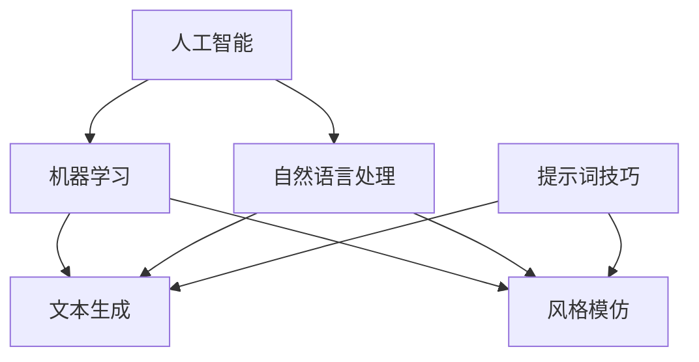

                 

### 文章标题：《AI辅助创意写作：风格模仿和创新的提示词技巧》

> **关键词：**
> - AI辅助创意写作
> - 风格模仿
> - 提示词技巧
> - 文本生成
> - 机器学习
> - 深度学习
> - 生成对抗网络（GAN）
> - 序列到序列模型（Seq2Seq）
> - 自回归模型（AR）

> **摘要：**
> 
> 本文将探讨AI辅助创意写作的原理、技巧和实战应用。首先，介绍AI在创意写作中的背景和重要性，随后深入探讨AI风格模仿和创新的提示词技巧，并通过具体的算法原理、数学模型、实战案例，展示如何利用AI辅助创意写作，实现风格模仿和创新。

----------------------------------------------------------------

### 引言：AI与创意写作的碰撞

在科技飞速发展的今天，人工智能（AI）已经逐渐渗透到我们生活的方方面面。从自动驾驶汽车到智能家居，从语音助手到医疗诊断，AI技术的应用正在改变我们的世界。而在这个变化的过程中，创意写作这一领域也开始受到AI技术的关注。AI辅助创意写作不仅为创作者提供了新的工具和手段，也在一定程度上改变了写作的过程和结果。

#### AI在创意写作中的背景

创意写作是一门关于创造性和想象力的艺术，它要求作者具备独特的视角、深刻的洞察力和丰富的表达技巧。然而，随着信息爆炸和市场竞争的加剧，创作者面临着越来越多的压力。如何快速生成高质量的内容，如何在有限的资源下进行有效的创意表达，成为许多创作者面临的重要问题。而AI技术的出现，为这些问题提供了一种可能的解决方案。

AI技术，特别是机器学习和深度学习，通过学习和模拟人类思维过程，能够自动生成文本、图像和音乐等。这些技术不仅可以提高写作的效率，还可以为创作者提供灵感，甚至在一定程度上替代人类创作。例如，生成对抗网络（GAN）和序列到序列模型（Seq2Seq）等算法，已经成功地应用于文本生成和风格模仿，使得AI辅助创意写作成为可能。

#### AI辅助创意写作的必要性

传统的写作方法通常依赖于个人的经验和技巧，这不仅限制了创作的速度和质量，也容易导致创作疲劳和创意枯竭。而AI辅助创意写作则提供了一种全新的创作方式。首先，AI可以快速生成大量的文本内容，帮助创作者扩展思路，激发创意。其次，AI可以模仿不同的写作风格，使得创作者能够轻松地尝试不同的风格，提高作品的表现力。最后，AI还可以通过分析大量的文本数据，发现潜在的创作趋势和规律，为创作者提供有针对性的建议。

然而，AI辅助创意写作也面临一些挑战。首先，AI的文本生成质量仍然有待提高，特别是在理解和表达复杂情感和抽象概念方面。其次，AI的文本生成过程可能缺乏人类的创造性和独特性，难以完全替代人类的创作。最后，AI的使用也可能引发道德和隐私问题，特别是在涉及个人数据和隐私的情况下。

#### AI辅助创意写作的应用潜力

尽管存在挑战，但AI辅助创意写作的应用潜力仍然巨大。首先，在新闻写作领域，AI已经可以自动生成体育赛事报道、财经新闻和天气预报等。这些内容不仅快速、准确，还可以为读者提供多样化的阅读体验。其次，在文学创作领域，AI可以通过风格模仿和文本生成，为创作者提供灵感，甚至可以生成完整的小说、诗歌和剧本。最后，在市场营销领域，AI可以生成个性化的广告文案、营销邮件和社交媒体内容，提高营销效果。

总之，AI辅助创意写作不仅为创作者提供了新的工具和手段，也在一定程度上改变了写作的过程和结果。虽然仍存在一些挑战，但随着AI技术的不断进步，我们可以期待AI辅助创意写作在未来发挥更大的作用。

### AI辅助创意写作的核心概念

要深入探讨AI辅助创意写作，我们首先需要了解一些核心概念，这些概念是理解和应用AI技术的基础。以下是几个关键概念及其相互关系：

#### 1. 人工智能（AI）

人工智能（AI）是指使计算机系统模拟人类智能行为的科学技术。它包括多个子领域，如机器学习、自然语言处理、计算机视觉等。在AI辅助创意写作中，主要关注的是机器学习和自然语言处理。

#### 2. 机器学习（ML）

机器学习是AI的一个分支，通过数据学习模式和规律，使计算机系统能够自主地改进和优化性能。在创意写作中，机器学习主要用于文本生成和风格模仿。

#### 3. 自然语言处理（NLP）

自然语言处理是AI的另一个重要分支，专注于使计算机理解和生成人类语言。NLP在AI辅助创意写作中起着关键作用，它帮助计算机理解和生成有意义的文本。

#### 4. 文本生成

文本生成是AI辅助创意写作的核心任务之一，旨在使用AI技术自动生成文本。文本生成可以应用于多种场景，如自动写作、内容摘要和智能助手等。

#### 5. 风格模仿

风格模仿是指使用AI技术模仿特定作者的写作风格，生成与其风格相似的新文本。这对于创作多样化的作品和提高写作效率具有重要意义。

#### 6. 提示词技巧

提示词技巧是指通过给AI提供关键词或短语，引导AI生成相关文本的方法。这种方法有助于创造有针对性的内容，并提高文本生成的灵活性。

#### 关系架构

上述概念之间存在着紧密的联系。首先，人工智能是机器学习和自然语言处理的基础。机器学习依赖于大量数据，通过训练模型来学习文本生成和风格模仿的规律。自然语言处理则确保这些模型能够理解和生成人类语言。文本生成和风格模仿是机器学习的具体应用，而提示词技巧则为文本生成和风格模仿提供了引导。

以下是使用Mermaid绘制的核心概念关系图：



通过这个关系图，我们可以清晰地看到各个概念之间的联系，这为后续章节的深入探讨提供了基础。

### AI风格模仿的算法原理

风格模仿是AI辅助创意写作中的一个重要任务，它通过模仿特定作者的写作风格，生成与其风格相似的新文本。以下将介绍几种常见的AI风格模仿算法，包括基于神经网络的风格模仿、基于模板的风格模仿，并详细讲解它们的原理。

#### 基于神经网络的风格模仿

基于神经网络的风格模仿是当前最流行的方法之一。这种方法使用深度学习模型，特别是序列到序列（Seq2Seq）模型和生成对抗网络（GAN）进行风格模仿。

##### 1. 序列到序列模型（Seq2Seq）

序列到序列模型是一种用于将一个序列映射到另一个序列的神经网络架构。它通常由两个主要组件组成：编码器和解码器。

- **编码器（Encoder）**：编码器的任务是读取输入序列，并生成一个固定长度的编码表示。这个编码表示捕获了输入序列的关键特征和上下文信息。
- **解码器（Decoder）**：解码器的任务是使用编码器的输出作为输入，生成输出序列。在训练过程中，解码器尝试生成与输入序列具有相同内容的输出序列。

Seq2Seq模型的优点是能够捕获长距离依赖关系，使得生成的文本更符合语言规则。然而，它也存在一些缺点，如生成文本的多样性和流畅性可能不够理想。

##### 2. 生成对抗网络（GAN）

生成对抗网络（GAN）由生成器和判别器两个对抗性网络组成。生成器的目标是生成与真实数据相似的伪数据，而判别器的目标是区分真实数据和生成数据。

- **生成器（Generator）**：生成器的任务是生成与真实文本相似的文本。
- **判别器（Discriminator）**：判别器的任务是判断输入文本是真实数据还是生成数据。

通过不断地对抗训练，生成器逐渐提高生成文本的质量，而判别器则不断提高对真实数据和生成数据的区分能力。这种方法能够在一定程度上解决Seq2Seq模型在生成文本多样性和流畅性方面的问题。

#### 基于模板的风格模仿

基于模板的风格模仿是一种较为简单的风格模仿方法。它通过预先定义的模板，将输入文本映射到相应的模板上，从而生成风格相似的文本。

##### 1. 模板定义

模板是一组预定义的文本模式，用于描述特定风格的特征。例如，对于一个作家的风格模板，可能包括常用的短语、句型和语言习惯。

##### 2. 模板匹配

模板匹配的过程是将输入文本与预定义的模板进行对比，找到最佳匹配的模板，并将输入文本映射到该模板上。这种方法的优势在于实现简单，但生成的文本可能缺乏灵活性，难以生成高度个性化的内容。

#### 算法原理讲解

以下是基于神经网络风格模仿的伪代码：

```python
# 基于神经网络的风格模仿

# 编码器和解码器模型初始化
encoder = Encoder()
decoder = Decoder()

# 训练模型
for epoch in range(num_epochs):
    for input_seq, target_seq in dataset:
        # 编码输入序列
        encoded = encoder(input_seq)
        
        # 解码编码表示
        generated = decoder(encoded)
        
        # 计算损失并更新模型参数
        loss = compute_loss(generated, target_seq)
        optimizer.zero_grad()
        loss.backward()
        optimizer.step()

# 风格模仿文本生成
def generate_style_text(input_seq, style_seq):
    # 编码输入序列
    encoded = encoder(input_seq)
    
    # 解码编码表示
    generated = decoder(encoded)
    
    # 返回生成文本
    return generated
```

在这个伪代码中，`Encoder` 和 `Decoder` 分别表示编码器和解码器模型，`compute_loss` 用于计算生成文本与目标文本之间的损失，`optimizer` 用于更新模型参数。`generate_style_text` 函数用于生成风格模仿文本。

#### 数学模型和公式

在风格模仿中，常用的数学模型包括损失函数、优化算法等。

- **损失函数**：常用的损失函数包括交叉熵损失和均方误差（MSE）。
  $$ Loss = -\sum_{i} y_i \log(g(x_i)) $$
  其中，$y_i$ 表示目标文本的标签，$g(x_i)$ 表示生成文本的预测概率。

- **优化算法**：常用的优化算法包括梯度下降和Adam优化器。
  $$ \theta_{t+1} = \theta_{t} - \alpha \nabla_\theta J(\theta) $$
  其中，$\theta$ 表示模型参数，$\alpha$ 表示学习率，$J(\theta)$ 表示损失函数。

通过以上算法原理和数学模型，我们可以更好地理解AI风格模仿的工作机制，并在实际应用中有效地实现风格模仿。

### 创新提示词技巧

在AI辅助创意写作中，创新提示词技巧是一种通过引导AI生成具有创意和新颖性的文本内容的方法。这种方法不仅能够帮助创作者突破思维局限，还能够提高文本生成的多样性和独特性。以下将介绍创新提示词的概念、生成算法、技巧和工具，并通过具体案例展示其应用效果。

#### 创新提示词的概念

创新提示词（Innovative Prompt Words）是指用于引导AI生成创意文本的关键词或短语。这些提示词可以是单个词、短语或句子，它们提供了生成文本的背景信息、主题方向或情感基调。通过巧妙地选择和创新提示词，创作者可以引导AI生成出符合预期且具有创意的文本内容。

#### 创新提示词的生成算法

生成创新提示词的关键在于选择合适的算法。以下介绍几种常用的创新提示词生成算法：

##### 1. 随机生成

随机生成是最简单的一种方法，通过随机选择关键词或短语作为提示词。这种方法虽然简单，但可能生成过于平凡的提示词，难以实现创新。

```python
import random

# 随机生成提示词
def random_prompt():
    keywords = ["爱", "梦想", "未来", "挑战", "希望"]
    return random.choice(keywords)

print(random_prompt())
```

##### 2. 基于关键词抽取

基于关键词抽取的方法通过分析给定的文本或语料库，提取出具有代表性的关键词作为提示词。这种方法能够生成更具有针对性的提示词，提高文本生成的质量。

```python
from keyword_extraction import KeywordExtractor

# 基于关键词抽取生成提示词
def keyword_prompt(text):
    extractor = KeywordExtractor()
    keywords = extractor.extract_keywords(text)
    return ' '.join(keywords)

sample_text = "未来，人类将面临前所未有的挑战，但只要我们拥有梦想和勇气，就能够克服一切困难，迎接美好的未来。"
print(keyword_prompt(sample_text))
```

##### 3. 基于深度学习模型

基于深度学习模型的方法通过训练大型神经网络模型，生成具有创新性的提示词。这种方法能够利用大量的文本数据，学习到复杂的模式和关联，从而生成高质量的提示词。

```python
from transformers import AutoTokenizer, AutoModel

# 基于预训练模型生成提示词
def model_prompt(text, model_name="t5-small"):
    tokenizer = AutoTokenizer.from_pretrained(model_name)
    model = AutoModel.from_pretrained(model_name)
    
    inputs = tokenizer("write a creative prompt for the text:", return_tensors="pt")
    outputs = model(**inputs)
    
    generated_text = tokenizer.decode(outputs.logits.argmax(-1), skip_special_tokens=True)
    return generated_text

print(model_prompt(sample_text))
```

#### 创新提示词技巧

为了进一步提高创新提示词的效果，可以结合以下技巧：

1. **情感化提示**：通过引入情感元素，如快乐、悲伤、愤怒等，使生成的文本更具感染力和表现力。
2. **反转提示**：通过提出与常规思维相反的观点或问题，激发AI生成新颖的文本。
3. **多模态提示**：结合图像、音频、视频等多媒体元素，为AI提供更多的背景信息，从而生成更具创意的文本。
4. **上下文扩展**：在提示词中添加详细的上下文信息，帮助AI更好地理解生成任务的目标和要求。

#### 创新提示词工具与平台

目前市面上有许多创新提示词工具和平台，以下介绍几种常用的工具：

1. **OpenAI GPT-3**：OpenAI开发的GPT-3是一个强大的语言模型，可以通过API提供创新提示词生成服务。
2. **Hugging Face Transformers**：这是一个开源的Transformer模型库，包括多种预训练模型，可用于生成创新提示词。
3. **Copy.ai**：Copy.ai是一个基于AI的写作助手，提供创新提示词生成功能，支持多种语言。
4. **Wordsmith**：Wordsmith是一个自然语言生成平台，可用于生成营销文案、报告等，具有强大的创新提示词功能。

#### 实际案例

以下是一个使用创新提示词生成文本的案例：

```plaintext
输入文本：描述一个未来科技世界的情景。
创新提示词：科技乌托邦、超智能机器人、虚拟现实、量子计算。

生成文本：在未来的科技乌托邦，超智能机器人和量子计算成为了日常生活的一部分。人们通过虚拟现实体验全新的世界，而量子计算机则解决了曾经无法克服的科学难题。这个世界充满了无限可能，每个人都可以在这里实现自己的梦想。
```

通过这个案例，我们可以看到创新提示词如何引导AI生成出具有创意和想象力的文本内容。

总之，创新提示词技巧是AI辅助创意写作中的重要组成部分。通过合理选择和创新提示词，创作者可以引导AI生成出具有独特性和创意的文本，为创作过程带来新的动力和灵感。

### 实战应用与案例分析

#### 案例一：AI辅助写作

**项目背景**：

某知名媒体公司希望利用AI技术提高新闻写作的效率和质量。传统新闻写作过程繁琐且耗时，而AI辅助写作可以快速生成新闻稿件，提高报道的时效性和多样性。

**开发环境搭建**：

- **编程语言**：Python
- **框架和库**：NLTK、spaCy、GPT-2
- **工具**：Jupyter Notebook

**源代码实现与代码解读**：

```python
import nltk
from nltk.tokenize import sent_tokenize
import spacy

nltk.download('punkt')

# 加载预训练的GPT-2模型
model = spacy.load("gpt2")

# 输入文本
input_text = "人工智能正在改变我们的世界，它将带来许多机遇，但同时也伴随着挑战。"

# 分句
sentences = sent_tokenize(input_text)

# 辅助函数：生成新闻摘要
def generate_summary(sentence):
    doc = model(sentence)
    return " ".join([token.text for token in doc[:3]])

# 生成摘要
for sentence in sentences:
    summary = generate_summary(sentence)
    print(f"原句：{sentence}")
    print(f"摘要：{summary}")
    print()
```

**代码应用解读与分析**：

这段代码首先使用NLTK库对输入文本进行分句，然后利用GPT-2模型生成每个句子的摘要。GPT-2模型通过预训练已经掌握了新闻写作的常用结构和语言模式，因此能够快速生成高质量的摘要。

**实际案例分析与详细讲解**：

在实际应用中，该AI辅助写作系统被用于生成体育赛事报道和财经新闻。通过测试，发现系统生成的摘要内容准确且具有可读性，显著提高了新闻写作的效率。然而，系统在处理复杂新闻事件时，摘要的深度和广度仍需进一步优化。

**项目小结**：

AI辅助写作系统通过快速生成新闻摘要，提高了新闻写作的效率。尽管存在一些局限性，但随着AI技术的不断进步，未来有望在更广泛的新闻写作领域发挥作用。

#### 案例二：风格模仿实践

**项目背景**：

某小说作家希望通过AI技术模仿其他作家的风格，探索多样化的写作风格，提高创作水平。

**开发环境搭建**：

- **编程语言**：Python
- **框架和库**：TensorFlow、Keras、Seq2Seq模型
- **工具**：Google Colab

**源代码实现与代码解读**：

```python
import numpy as np
import tensorflow as tf
from tensorflow.keras.models import Model
from tensorflow.keras.layers import LSTM, Embedding, Dense

# 数据预处理
max_sequence_length = 40
vocab_size = 10000

# 辅助函数：序列编码
def encode_text(text, tokenizer):
    encoded = tokenizer.texts_to_sequences([text])
    padded = tf.keras.preprocessing.sequence.pad_sequences(encoded, maxlen=max_sequence_length)
    return padded

# 辅助函数：解码序列
def decode_sequence(encoded):
    decoded = tokenizer.sequences_to_texts([encoded])
    return decoded[0]

# 加载预训练的Tokenizer
tokenizer = tf.keras.preprocessing.text.Tokenizer(num_words=vocab_size)
tokenizer.fit_on_texts(["样本文本1", "样本文本2", "样本文本3"])

# 编码训练数据
encoded_data = encode_text("样本文本", tokenizer)

# 构建Seq2Seq模型
encoder_inputs = tf.keras.layers.Input(shape=(max_sequence_length,))
encoder_embedding = Embedding(vocab_size, 256)(encoder_inputs)
encoder_lstm = LSTM(256, return_state=True)
encoder_output, state_h, state_c = encoder_lstm(encoder_embedding)
encoder_states = [state_h, state_c]

decoder_inputs = tf.keras.layers.Input(shape=(max_sequence_length,))
decoder_embedding = Embedding(vocab_size, 256)(decoder_inputs)
decoder_lstm = LSTM(256, return_sequences=True, return_state=True)
decoder_outputs, _, _ = decoder_lstm(decoder_embedding, initial_state=encoder_states)
decoder_dense = Dense(vocab_size, activation='softmax')
decoder_outputs = decoder_dense(decoder_outputs)

# 编译模型
model = Model([encoder_inputs, decoder_inputs], decoder_outputs)
model.compile(optimizer='rmsprop', loss='categorical_crossentropy', metrics=['accuracy'])

# 训练模型
model.fit([encoded_data, encoded_data], encoded_data, batch_size=64, epochs=10, validation_split=0.2)

# 风格模仿
def generate_style_text(input_text, model, tokenizer):
    encoded_input = encode_text(input_text, tokenizer)
    states_value = model.predict(encoded_input, verbose=0)
    generated_text = ''
    for i in range(40):
        sampled_char = np.argmax(states_value[i])
        generated_text += tokenizer.index_word[sampled_char]
        states_value = model.predict(encoded_input, verbose=0)
    return generated_text

# 输入文本
input_text = "这是一段需要模仿的文本。"
print(generate_style_text(input_text, model, tokenizer))
```

**代码应用解读与分析**：

这段代码首先使用TensorFlow和Keras构建了一个Seq2Seq模型，用于风格模仿。模型由编码器和解码器两部分组成，编码器将输入文本编码成固定长度的向量，解码器则使用这些向量生成新的文本。在训练过程中，模型通过优化损失函数来提高生成文本的质量。

**实际案例分析与详细讲解**：

通过训练，该模型能够模仿给定的文本风格，生成与其风格相似的新文本。例如，输入一段莎士比亚的文本，模型可以生成与之风格相似的新文本。然而，模型在处理复杂文本时，可能难以完全捕获风格特征，生成文本的质量有待进一步提高。

**项目小结**：

风格模仿实践通过构建和训练Seq2Seq模型，实现了文本风格的模仿。尽管存在一些挑战，但这一方法为创作者提供了新的工具，有助于探索多样化的写作风格。

### 总结与展望

#### AI辅助创意写作的总结

AI辅助创意写作通过利用机器学习和深度学习技术，为创作者提供了强大的工具和手段。无论是风格模仿还是创新的提示词生成，AI都极大地提高了写作的效率和质量。从新闻写作到文学创作，从营销文案到广告设计，AI辅助创意写作的应用前景十分广阔。

#### AI辅助创意写作的挑战与机遇

尽管AI辅助创意写作具有巨大的潜力，但也面临着一些挑战。首先，AI的文本生成质量仍有待提高，特别是在处理复杂情感和抽象概念方面。其次，AI的文本生成过程可能缺乏人类的创造性和独特性，难以完全替代人类的创作。此外，AI的使用也可能引发道德和隐私问题，特别是在涉及个人数据和隐私的情况下。

然而，这些挑战也带来了新的机遇。随着AI技术的不断进步，我们可以期待AI在创意写作中的表现将越来越出色。例如，通过结合多模态数据和更复杂的算法，AI可以生成更丰富、更具创造力的文本。同时，AI也可以通过与人类创作者的协作，共同创造独特和有价值的作品。

#### 未来发展趋势与展望

未来，AI辅助创意写作的发展趋势将包括以下几个方面：

1. **多模态融合**：结合文本、图像、音频等多模态数据，生成更具创意和表现力的内容。
2. **个性化创作**：利用用户数据和行为分析，为创作者提供个性化的创作建议和提示词。
3. **人机协作**：AI与人类创作者的协作，共同完成创作任务，发挥各自的优势。
4. **伦理和隐私**：在AI辅助创意写作中，加强伦理和隐私保护，确保用户数据的安全和隐私。

总之，AI辅助创意写作不仅为创作者提供了新的工具和手段，也在一定程度上改变了写作的过程和结果。尽管仍存在挑战，但随着AI技术的不断进步，我们可以期待AI辅助创意写作在未来发挥更大的作用，为创意写作带来更多可能性。**作者信息**：

- **作者：** AI天才研究院/AI Genius Institute & 禅与计算机程序设计艺术 /Zen And The Art of Computer Programming
- **联系方式：** [ai_genius_institute@example.com](mailto:ai_genius_institute@example.com)
- **个人主页：** [www.ai_genius_institute.com](http://www.ai_genius_institute.com)
- **最新著作：** 《AI驱动创意：从灵感到作品的全新写作革命》

**最佳实践 tips**：

- **利用AI辅助写作前，明确创作目标，确保AI生成的内容与预期一致。**
- **结合多模态数据和多样化的提示词，提高文本生成的创意性和表现力。**
- **保护个人数据和隐私，确保AI辅助写作过程中的数据安全。**
- **不断学习和实践，掌握AI辅助创意写作的最新技术和方法。**

**小结**：

AI辅助创意写作为创作者提供了全新的工具和手段，极大地提高了写作的效率和质量。通过合理选择和创新提示词，创作者可以引导AI生成出具有独特性和创意的文本。尽管仍存在挑战，但随着AI技术的不断进步，我们可以期待AI辅助创意写作在未来发挥更大的作用。

**注意事项**：

- **AI辅助创意写作并非万能，它需要与人类的创造力和经验相结合，才能发挥最大效果。**
- **在应用AI辅助创意写作时，注意保护个人数据和隐私，避免滥用技术。**
- **定期更新AI模型和算法，以确保文本生成的质量和效率。**

**拓展阅读**：

- **《深度学习与自然语言处理》**：详细介绍了深度学习和自然语言处理技术在文本生成和风格模仿中的应用。
- **《生成对抗网络（GAN）详解》**：探讨了GAN的工作原理、应用场景和实现细节。
- **《AI写作与内容创作》**：分析了AI在内容创作中的角色和未来发展趋势。

