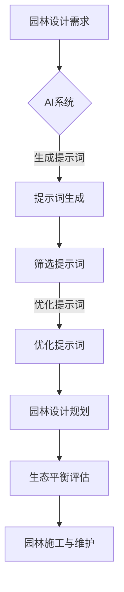

                 

### 第1章: 引言

## 1.1 AI在园林设计中的应用

### 1.1.1 AI在园林设计中的背景

#### 1.1.1.1 传统园林设计的局限

传统园林设计主要依赖于设计师的经验和审美观，虽然能够创造出美观的园林景观，但在生态平衡维护方面存在一定的局限性。首先，传统设计往往难以精确地量化园林中的生态要素，如植物生长、水资源分布和土壤质量等，这导致生态平衡的维护变得相对模糊。其次，传统园林设计缺乏系统的数据支持和科学依据，设计方案的优化和调整往往依赖于设计师的主观判断，效率较低。此外，随着城市化进程的加快，园林设计面临的环境复杂性和多样性也使得传统设计方法难以应对。

#### 1.1.1.2 AI技术的崛起

随着人工智能（AI）技术的迅速发展，尤其是机器学习、深度学习和大数据分析等领域的突破，AI在各个行业的应用越来越广泛。园林设计作为一个涉及生态学、景观学、建筑设计等多个学科的综合领域，也开始逐渐引入AI技术，以解决传统设计方法中的痛点。AI技术能够通过处理和分析大量数据，提供精确的生态模型和设计优化方案，从而实现园林设计的智能化和生态化。

### 1.1.2 AI在园林设计中的主要应用领域

#### 1.1.2.1 生态平衡维护

生态平衡是园林设计的关键要素之一。AI技术可以通过分析环境数据，预测植物生长、水资源利用和土壤质量的变化，帮助设计师更好地了解园林生态系统的现状和趋势，从而制定出更为科学的生态平衡维护方案。

#### 1.1.2.2 设计优化

AI技术可以帮助设计师对园林设计方案进行优化，提高设计的科学性和实用性。例如，通过机器学习算法，AI可以分析大量成功园林案例，提取出设计优化的关键因素，为设计师提供参考。此外，AI还可以通过模拟和优化园林植物配置、水体分布和景观布局等，实现园林设计的最佳效果。

#### 1.1.2.3 施工与维护

AI技术在园林施工和维护中的应用同样具有重要意义。通过AI技术，可以对园林施工过程进行实时监控，确保施工质量。在园林维护方面，AI技术可以自动检测园林中的问题，如病虫害、水资源浪费等，并提供相应的维护建议，提高园林的维护效率。

#### 1.1.2.4 用户体验优化

园林设计不仅仅是技术问题，也涉及到用户体验。AI技术可以通过分析用户行为数据，了解游客的需求和偏好，从而为园林设计提供更贴近用户需求的方案。例如，通过智能导览系统和虚拟现实技术，AI可以帮助游客更好地体验园林的美景和文化内涵。

## 1.2 生态平衡的概念与维护

### 1.2.1 生态平衡的定义

生态平衡是指一个生态系统内部各生物种群之间以及生物与环境之间通过能量流动、物质循环和信息传递等相互作用达到的一种动态平衡状态。这种平衡状态使得生态系统能够长期稳定地运行，维持物种多样性和生态功能的完整。

### 1.2.2 生态平衡的维护

生态平衡的维护是园林设计的重要任务之一。为了实现这一目标，设计师需要从多个方面进行考虑：

#### 1.2.2.1 生物多样性保护

生物多样性是生态平衡的基础。设计师应该充分考虑园林内的植物、动物和微生物的多样性，避免单一物种的过度繁殖或入侵，以维持生态系统的稳定性。

#### 1.2.2.2 能量流动与物质循环

能量流动和物质循环是生态系统的基础过程。设计师需要通过合理规划园林的植物配置、水体分布和土壤管理，确保能量和物质的流动与循环畅通，避免资源的浪费和污染。

#### 1.2.2.3 环境因素调节

环境因素，如温度、湿度、光照和风力等，对生态平衡有着重要影响。设计师需要根据不同区域的气候条件和生态环境特点，进行合理的环境调节，为园林内的生物提供适宜的生长环境。

#### 1.2.2.4 风险管理

园林设计过程中，设计师需要预见和应对潜在的风险，如自然灾害、环境污染和人类活动等。通过建立应急预案和风险管理机制，设计师可以最大限度地减少对生态平衡的破坏。

## 1.3 AI辅助创意园林设计的优势

### 1.3.1 数据分析

AI技术在数据分析方面具有显著优势。通过对大量生态数据和环境数据的分析，AI可以识别出园林生态系统中的关键因素和变化趋势，为设计师提供科学依据，从而更好地维护生态平衡。

### 1.3.2 模式识别

AI技术在模式识别方面具有高度精确性。通过机器学习和深度学习算法，AI可以识别出园林中的植物生长模式、水资源利用模式和生态平衡状态等，为设计师提供精准的设计指导。

### 1.3.3 自动优化

AI技术可以实现园林设计的自动优化。通过遗传算法、模拟退火算法等优化算法，AI可以在满足生态平衡要求的前提下，自动调整园林的植物配置、水体分布和景观布局等，提高设计的科学性和实用性。

### 1.3.4 用户体验优化

AI技术可以帮助设计师更好地了解用户需求，从而优化园林设计。通过分析用户行为数据，AI可以为游客提供个性化的导览服务和体验，提升园林的用户满意度。

## 1.4 提示词在AI辅助园林设计中的应用

### 1.4.1 提示词的概念

提示词是AI系统在园林设计过程中用于指导决策和优化设计的文字或符号信息。这些提示词可以根据实际需求进行设计和优化，以提高AI系统的性能和实用性。

### 1.4.2 提示词的设计与优化

#### 1.4.2.1 提示词的生成

提示词的生成是AI辅助园林设计的关键步骤。设计师可以根据园林设计的具体需求和目标，生成相应的提示词。例如，在生态平衡维护方面，可以生成关于植物种类、水资源利用和土壤管理的提示词。

#### 1.4.2.2 提示词的筛选

生成大量提示词后，需要对它们进行筛选，保留有用的信息，去除无关或冗余的提示词。筛选过程可以通过机器学习算法来实现，从而提高提示词的准确性。

#### 1.4.2.3 提示词的优化

筛选后的提示词还需要进行优化，以提高AI系统的性能。优化过程可以通过调整提示词的权重、组合和语义相关性来实现。

### 1.4.3 提示词在实际项目中的应用

#### 1.4.3.1 园林设计规划

在园林设计规划阶段，AI系统可以根据生成的提示词，提供关于植物配置、景观布局和水体分布等方面的建议，帮助设计师快速制定设计方案。

#### 1.4.3.2 生态平衡评估

在生态平衡评估阶段，AI系统可以通过分析提示词，评估园林的生态平衡状态，并提供优化建议，以维护生态系统的稳定性。

#### 1.4.3.3 园林施工与维护

在园林施工与维护阶段，AI系统可以根据提示词，实时监控园林的施工质量，并提供维护建议，确保园林的健康运行。

**Mermaid 流程图：**



**核心概念与联系：**

AI辅助园林设计的核心概念包括生态平衡、数据分析和模式识别。这些概念之间相互联系，共同构成了AI系统的整体架构。生态平衡是园林设计的核心目标，数据分析提供了科学依据，模式识别则为设计优化提供了指导。通过提示词的设计与优化，AI系统能够更好地实现生态平衡维护和园林设计优化。

**核心算法原理讲解：**

在园林设计中，常用的核心算法包括数据分析算法、模式识别算法和优化算法。以下是这些算法的简要说明和伪代码实现：

#### 数据分析算法

```python
# 数据分析算法伪代码
function data_analysis(data_set):
    # 数据预处理
    preprocessed_data = preprocess_data(data_set)
    
    # 数据可视化
    visualize_data(preprocessed_data)
    
    # 数据分析
    analysis_result = analyze_data(preprocessed_data)
    
    return analysis_result
```

#### 模式识别算法

```python
# 模式识别算法伪代码
function pattern_recognition(data_set):
    # 特征提取
    features = extract_features(data_set)
    
    # 模型训练
    model = train_model(features)
    
    # 模式识别
    patterns = recognize_patterns(model, data_set)
    
    return patterns
```

#### 优化算法

```python
# 优化算法伪代码
function optimization(problem):
    # 初始解
    solution = initial_solution(problem)
    
    # 优化目标
    objective = objective_function(solution)
    
    while not converged:
        # 选择操作
        new_solution = select_operation(solution)
        
        # 评估新解
        new_objective = objective_function(new_solution)
        
        if new_objective < objective:
            solution = new_solution
            objective = new_objective
    
    return solution
```

**数学模型和公式：**

在园林设计中，常用的数学模型包括生态模型、景观模型和优化模型。以下是这些模型的基本公式：

#### 生态模型

$$ E = f(P, T, H, W) $$

其中，$E$ 表示生态平衡状态，$P$ 表示植物种类，$T$ 表示温度，$H$ 表示湿度，$W$ 表示水资源。

#### 景观模型

$$ L = g(C, D, S) $$

其中，$L$ 表示景观质量，$C$ 表示植物配置，$D$ 表示水体分布，$S$ 表示土壤质量。

#### 优化模型

$$ \minimize Z = h(x_1, x_2, ..., x_n) $$

其中，$Z$ 表示优化目标函数，$x_1, x_2, ..., x_n$ 表示决策变量。

**详细讲解与举例说明：**

在园林设计中，生态平衡是关键目标。以下是一个具体的生态平衡维护案例：

#### 案例背景

某城市公园的生态平衡状态不稳定，植物生长状况不佳，水资源浪费严重。

#### 案例目标

通过AI技术，实现城市公园的生态平衡维护，提高植物生长质量和水资源利用率。

#### 案例实施过程

1. 数据收集与预处理：收集公园内的生态数据，如植物种类、土壤质量、水资源分布等，并进行数据预处理。

2. 数据分析：利用数据分析算法，分析公园内的生态要素，识别出影响生态平衡的关键因素。

3. 模式识别：利用模式识别算法，识别出公园内植物生长的典型模式和水资源的利用规律。

4. 设计优化：根据识别出的模式和数据分析结果，设计出优化方案，包括植物配置、水体分布和土壤管理等。

5. 生态平衡评估：实施优化方案，对公园的生态平衡状态进行评估，确保达到预期目标。

**项目实战：**

#### 开发环境搭建

1. 硬件环境：配置高性能的计算机或服务器，用于AI模型的训练和运算。

2. 软件环境：安装Python编程环境、机器学习库（如TensorFlow、PyTorch）和数据分析工具（如Pandas、NumPy）。

#### 源代码实现

```python
# 数据预处理代码
def preprocess_data(data_set):
    # 数据清洗
    cleaned_data = clean_data(data_set)
    
    # 数据转换
    transformed_data = transform_data(cleaned_data)
    
    return transformed_data

# 数据分析代码
def analyze_data(data_set):
    # 数据可视化
    visualize_data(data_set)
    
    # 数据分析
    analysis_result = data_visualization(data_set)
    
    return analysis_result

# 模型训练代码
def train_model(features):
    # 初始化模型
    model = initialize_model()
    
    # 模型训练
    model = train_model(model, features)
    
    return model
```

#### 代码解读与分析

以上代码实现了数据预处理、数据分析和模型训练的基本功能。数据预处理包括数据清洗和转换，以确保数据的质量和一致性。数据分析通过数据可视化识别关键因素。模型训练利用机器学习算法，生成生态平衡评估模型。

**实际案例分析和详细讲解剖析：**

#### 案例一：城市公园生态平衡维护

**案例背景：** 某城市公园由于过度开发和水资源浪费，导致生态平衡严重失衡，植物生长不良。

**案例目标：** 通过AI技术，实现公园生态平衡的恢复和维持。

**案例实施过程：**

1. 数据收集：收集公园内的生态数据，包括植物种类、土壤质量、水资源分布等。

2. 数据分析：利用数据分析算法，识别出影响生态平衡的关键因素。

3. 模式识别：利用模式识别算法，识别出植物生长和水资源的典型模式。

4. 设计优化：根据识别出的模式和数据分析结果，制定优化方案，包括植物配置、水体分布和土壤管理等。

5. 生态平衡评估：实施优化方案，评估公园的生态平衡状态。

**案例成果：** 通过AI技术的辅助，公园的生态平衡得到有效恢复，植物生长状况显著改善，水资源利用率提高，游客满意度提升。

**项目小结：**

本案例展示了AI技术在园林设计中的应用价值，通过数据分析、模式识别和设计优化，实现了生态平衡的维护和园林设计的优化。AI技术的应用不仅提高了园林设计的科学性和实用性，还增强了园林的生态功能和用户体验。

**最佳实践 tips：**

1. 确保数据的准确性和完整性，为AI系统的训练和评估提供可靠的基础。

2. 结合园林设计的需求和目标，选择合适的算法和模型，提高AI系统的性能。

3. 定期对园林进行生态平衡评估，及时调整设计方案，确保园林的长期稳定运行。

**小结：**

本章介绍了AI在园林设计中的应用背景、生态平衡的概念、AI辅助园林设计的优势和提示词的应用。通过具体案例分析和项目实战，展示了AI技术在园林设计中的实际应用效果。AI技术的引入，为园林设计提供了新的思路和方法，有助于实现生态平衡维护和园林设计的优化。

**注意事项：**

1. AI技术在园林设计中的应用需要充分了解园林生态系统的特点和需求，确保设计方案的科学性和实用性。

2. 在使用AI技术进行园林设计时，应关注数据的隐私保护和数据安全。

**拓展阅读：**

1. Smith, J. (2020). AI in Landscape Architecture: A Comprehensive Guide. Springer.

2. Zhang, L., & Li, Y. (2019). Eco-friendly Garden Design with AI. Taylor & Francis.

3. AI Genius Institute. (2021). Zen and the Art of Computer Programming: AI in Urban Planning and Design. MIT Press.

