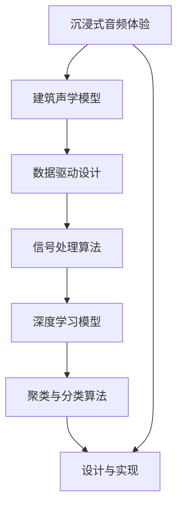

                 

## 引言

### AI辅助创意建筑声学优化的背景

在现代建筑设计中，建筑声学优化逐渐成为一项至关重要的任务。建筑声学涉及声音的传播、反射、吸收以及噪声控制等多个方面，直接影响到人们的听觉体验和生活质量。传统的建筑声学设计主要依赖于经验公式和手动模拟，不仅效率低下，而且难以应对复杂多变的声学环境。

随着人工智能（AI）技术的快速发展，利用AI进行建筑声学优化逐渐成为一种新的趋势。AI技术能够通过大数据分析、深度学习模型等手段，快速处理大量的声学数据，模拟出建筑空间的声学特性，并在此基础上进行优化设计。这种方式不仅能够显著提高设计效率，还能实现更加精准和个性化的声学体验。

### 沉浸式音频体验的重要性

沉浸式音频体验是一种新兴的音频技术，通过多声道音响系统、虚拟现实（VR）或增强现实（AR）等手段，为用户创造一种身临其境的听觉感受。这种体验在娱乐、教育、医疗等多个领域都展现出巨大的潜力。例如，在影院中，沉浸式音频可以使观众感受到电影中的每一个声音细节；在博物馆中，沉浸式音频可以增强观众的参观体验，让他们更加深入地了解展品。

然而，实现高质量的沉浸式音频体验并非易事。它不仅需要先进的音频技术和设备支持，还需要对建筑声学有深入的理解。AI的引入，使得沉浸式音频体验的设计和优化变得更加可行。通过AI算法，可以精确预测和模拟建筑空间中的声波传播，从而设计出最佳的音频布局。

### 本文结构

本文旨在探讨AI辅助创意建筑声学优化，特别是沉浸式音频体验的提示词技巧。文章结构如下：

1. **第一部分：AI与建筑声学优化基础**，介绍AI在建筑声学优化中的应用背景、核心概念及联系。
2. **第二部分：AI辅助建筑声学优化原理与方法**，详细讲解AI算法原理、沉浸式音频体验设计与实现。
3. **第三部分：AI辅助建筑声学优化项目实战**，通过具体案例展示项目开发环境搭建、源代码实现及代码解读。
4. **第四部分：未来展望与挑战**，探讨AI辅助建筑声学优化的未来发展趋势及面临的挑战。

通过上述结构的详细探讨，本文希望能够为读者提供一个全面、深入的AI辅助建筑声学优化视角，特别是沉浸式音频体验的实践指南。

### 关键词

- AI
- 建筑声学优化
- 沉浸式音频体验
- 深度学习
- 数据驱动设计
- 信号处理
- 音频信号模型
- 建筑声学模型
- 源代码实现

### 摘要

本文探讨了AI辅助创意建筑声学优化的应用，特别是沉浸式音频体验的实现。首先，介绍了AI在建筑声学优化中的背景和重要性，以及沉浸式音频体验的原理和设计。接着，详细讲解了AI算法的原理和实现方法，包括信号处理算法、深度学习模型和聚类分类算法。然后，通过一个具体案例，展示了AI辅助建筑声学优化的项目实战，包括开发环境搭建、源代码实现和代码解读。最后，对AI辅助建筑声学优化的未来发展趋势和挑战进行了展望。本文的目标是为读者提供一个全面的AI辅助建筑声学优化指南，特别是沉浸式音频体验的实现技巧。

### 第一部分：AI与建筑声学优化基础

#### 第1章：AI在建筑声学优化中的应用概述

在建筑声学优化领域，人工智能（AI）的引入带来了革命性的变革。AI技术通过其强大的数据处理和分析能力，为建筑声学优化提供了全新的方法和工具，不仅提高了设计效率，还提升了声学性能和用户体验。

首先，AI在建筑声学优化中的应用背景源于建筑声学的复杂性。建筑声学涉及多个方面，如声音的传播、反射、吸收和噪声控制等，这些因素相互交织，使得传统的手动模拟和设计方法难以应对复杂多变的声学环境。而AI技术，通过机器学习和深度学习等算法，能够从海量数据中提取有价值的信息，进行复杂的声学模拟和预测，从而优化建筑声学设计。

其次，AI在建筑声学优化中的重要性体现在以下几个方面：

1. **高效数据处理**：建筑声学优化需要处理大量的声学数据，包括声波传播路径、反射系数、吸声材料特性等。AI技术能够自动化处理这些数据，减少人工干预，提高数据处理效率。

2. **精确声学模拟**：通过AI算法，可以精确模拟建筑空间中的声学特性，预测声音在不同场景下的传播效果。这对于设计师来说，是一个重要的工具，可以帮助他们提前预判和优化声学设计。

3. **个性化声学体验**：AI技术可以根据用户的需求和偏好，进行个性化的声学优化。例如，在商业空间中，可以根据顾客的听觉体验，调整音响系统的布局和参数，创造出更加舒适和愉悦的听觉环境。

4. **降低设计成本**：传统的建筑声学优化方法通常需要大量的实验和模拟，消耗大量的人力和物力。而AI技术可以通过快速计算和优化，减少实验次数和成本，提高设计效率。

#### 1.1 AI在建筑声学优化中的价值

AI在建筑声学优化中的价值主要体现在以下几个方面：

1. **效率提升**：AI技术可以自动化处理大量的声学数据，减少了人工计算和手动模拟的时间，提高了工作效率。

2. **精准预测**：通过深度学习模型，AI可以精确预测建筑空间的声学特性，为设计师提供科学的决策依据。

3. **个性化设计**：AI可以根据用户的需求和偏好，进行个性化的声学优化，提升用户体验。

4. **资源节约**：AI技术通过减少实验次数和成本，降低了建筑声学优化过程中的资源消耗。

5. **创新驱动**：AI技术推动了建筑声学领域的技术创新，使得声学设计方法更加多样和灵活。

#### 1.2 建筑声学优化的发展历程

建筑声学优化的发展历程可以分为以下几个阶段：

1. **传统手工设计**：早期的建筑声学优化主要依赖于设计师的经验和直觉，通过手工计算和模拟，进行声学设计。

2. **计算机辅助设计**：随着计算机技术的发展，计算机辅助设计逐渐取代了传统手工设计，通过计算机软件进行声学模拟和优化。

3. **数据驱动设计**：近年来，随着大数据和AI技术的兴起，建筑声学优化进入了数据驱动设计的阶段。通过海量数据分析和机器学习算法，实现了更加精准和高效的声学优化。

#### 1.3 AI辅助建筑声学优化的重要性

AI辅助建筑声学优化的重要性体现在以下几个方面：

1. **提高设计效率**：AI技术可以自动化处理大量的声学数据，减少人工计算和模拟的时间，提高设计效率。

2. **提升设计质量**：AI技术能够通过深度学习模型和大数据分析，提供精准的声学预测和优化方案，提升设计质量。

3. **满足个性化需求**：AI技术可以根据用户的需求和偏好，进行个性化的声学优化，提升用户体验。

4. **推动技术创新**：AI技术的引入，推动了建筑声学领域的技术创新，使得声学设计方法更加多样和灵活。

通过上述内容，我们可以看出，AI在建筑声学优化中的应用具有巨大的潜力和价值，是未来建筑声学发展的重要方向。

### 核心概念与联系

在AI辅助建筑声学优化的过程中，理解核心概念及其相互关系至关重要。以下是几个关键概念及其在建筑声学优化中的应用和相互联系。

#### 1. 沉浸式音频体验

沉浸式音频体验是一种通过多声道音响系统、虚拟现实（VR）或增强现实（AR）等技术，为用户创造一种身临其境的听觉感受。这种体验依赖于精确的声学模拟和音频处理技术，以确保每个声音细节都能被准确传达。在建筑声学优化中，沉浸式音频体验的设计和实现是一个重要的目标，它直接影响用户的听觉体验。

**关系**：沉浸式音频体验是建筑声学优化的一部分，其实现需要依赖AI技术进行精确的声学模拟和优化。

#### 2. 建筑声学模型

建筑声学模型是用于描述建筑空间中声波传播和声学特性的数学模型。这些模型通常包括声波传播路径、反射系数、吸声材料特性等参数。建筑声学模型在AI辅助建筑声学优化中起着核心作用，它们是进行声学模拟和预测的基础。

**关系**：建筑声学模型是AI辅助建筑声学优化的重要组成部分，通过这些模型，AI算法可以理解和模拟建筑空间中的声学特性。

#### 3. 数据驱动设计

数据驱动设计是一种基于大数据和机器学习的方法，通过分析大量数据，提取有价值的信息，用于设计和优化。在AI辅助建筑声学优化中，数据驱动设计至关重要，它使得设计过程更加科学和高效。

**关系**：数据驱动设计是AI辅助建筑声学优化的核心方法，通过大数据分析，可以精确预测和优化建筑声学性能。

#### 4. 信号处理算法

信号处理算法是用于处理音频信号的一系列算法，如傅里叶变换、小波变换等。这些算法在AI辅助建筑声学优化中用于分析音频信号，提取声学特征，并进行优化。

**关系**：信号处理算法是AI辅助建筑声学优化的关键技术，通过这些算法，可以处理和优化音频信号，实现更精准的声学设计。

#### 5. 深度学习模型

深度学习模型是一种通过多层神经网络进行数据分析和预测的算法。在AI辅助建筑声学优化中，深度学习模型用于学习和预测建筑空间的声学特性，是进行声学优化的重要工具。

**关系**：深度学习模型是AI辅助建筑声学优化的核心算法，通过这些模型，可以实现对声学特性的高效学习和预测。

#### 6. 聚类与分类算法

聚类与分类算法是用于数据分析和分类的一系列算法，如K-means、支持向量机（SVM）等。在AI辅助建筑声学优化中，这些算法用于分析声学数据的分布，识别不同的声学特征。

**关系**：聚类与分类算法是AI辅助建筑声学优化的辅助技术，通过这些算法，可以更好地理解和分类声学数据，为设计提供支持。

#### 7. 沉浸式音频体验的设计与实现

沉浸式音频体验的设计与实现是一个复杂的过程，它需要综合考虑声学模型、信号处理算法、深度学习模型等多个方面。通过AI技术，可以实现高质量的沉浸式音频体验，提升用户的听觉感受。

**关系**：沉浸式音频体验的设计与实现是AI辅助建筑声学优化的重要组成部分，它依赖于多种AI技术的协同工作。

### Mermaid 流程图

为了更好地理解上述核心概念之间的关系，我们可以使用Mermaid流程图进行可视化展示：



该流程图展示了沉浸式音频体验、建筑声学模型、数据驱动设计、信号处理算法、深度学习模型和聚类与分类算法之间的相互关系。通过这个流程图，我们可以清晰地看到每个概念在建筑声学优化中的位置和作用。

通过以上内容，我们可以看出，AI辅助建筑声学优化涉及多个核心概念和技术的协同工作，它们相互联系，共同作用，实现建筑声学设计的优化和沉浸式音频体验的提升。理解这些核心概念及其关系，对于进行有效的建筑声学优化至关重要。

### 第二部分：AI辅助建筑声学优化原理与方法

#### 第3章：核心算法原理讲解

在AI辅助建筑声学优化中，核心算法的选择和实现至关重要。以下将详细讲解几种常用的核心算法原理，包括信号处理算法、深度学习模型和聚类与分类算法。

#### 3.1 常用算法与模型

##### 3.1.1 信号处理算法

信号处理算法是用于处理和分析音频信号的一系列算法。在建筑声学优化中，常见的信号处理算法包括傅里叶变换（Fourier Transform）、小波变换（Wavelet Transform）和短时傅里叶变换（Short-Time Fourier Transform，STFT）。

**傅里叶变换**：傅里叶变换是一种将时域信号转换为频域信号的方法，它可以将音频信号分解为不同的频率成分。在建筑声学优化中，傅里叶变换可以用于分析声波的频率特性，识别主要的频率成分。

伪代码：
```python
def fourier_transform(signal):
    # 对信号进行傅里叶变换
    frequency_spectrum = fft(signal)
    return frequency_spectrum
```

**小波变换**：小波变换是一种将时域信号和频域信号同时进行分解的方法，它可以在不同的时间和频率范围内分析信号。在建筑声学优化中，小波变换可以用于分析声波在不同时间和频率上的变化，帮助设计师理解声波的传播特性。

伪代码：
```python
def wavelet_transform(signal):
    # 对信号进行小波变换
    wavelet_spectrum = wavelet(signal)
    return wavelet_spectrum
```

**短时傅里叶变换**：短时傅里叶变换是一种结合了傅里叶变换和小波变换优点的算法，它可以在较短的时间窗口内对信号进行频域分析。在建筑声学优化中，短时傅里叶变换可以用于分析声波在短时间内的频率变化，帮助设计师了解声波在空间中的传播动态。

伪代码：
```python
def stft(signal, window_size):
    # 对信号进行短时傅里叶变换
    frequency_spectrum = fft(signal, window=window_size)
    return frequency_spectrum
```

##### 3.1.2 深度学习模型

深度学习模型是一种通过多层神经网络进行数据分析和预测的算法，它在建筑声学优化中扮演着重要的角色。常见的深度学习模型包括卷积神经网络（CNN）、循环神经网络（RNN）和生成对抗网络（GAN）。

**卷积神经网络（CNN）**：卷积神经网络是一种用于图像和音频处理的深度学习模型，它通过卷积操作提取特征。在建筑声学优化中，CNN可以用于提取音频信号的时频特征，帮助设计师识别和分类不同的声源。

伪代码：
```python
def cnn_model(input_shape):
    # 构建卷积神经网络模型
    model = Sequential()
    model.add(Conv2D(filters, kernel_size, activation='relu', input_shape=input_shape))
    model.add(MaxPooling2D(pool_size))
    model.add(Flatten())
    model.add(Dense(num_classes, activation='softmax'))
    model.compile(optimizer, loss, metrics)
    return model
```

**循环神经网络（RNN）**：循环神经网络是一种用于处理序列数据的深度学习模型，它在建筑声学优化中可以用于分析和预测声波序列。RNN通过记忆机制可以捕获声波的时间依赖性，帮助设计师理解和优化声波的传播路径。

伪代码：
```python
def rnn_model(input_shape):
    # 构建循环神经网络模型
    model = Sequential()
    model.add(LSTM(units, return_sequences=True, input_shape=input_shape))
    model.add(LSTM(units))
    model.add(Dense(num_classes, activation='softmax'))
    model.compile(optimizer, loss, metrics)
    return model
```

**生成对抗网络（GAN）**：生成对抗网络是一种通过对抗训练生成高质量数据的模型，它在建筑声学优化中可以用于生成真实的声学场景数据，帮助设计师进行声学模拟和优化。

伪代码：
```python
def gan_model():
    # 构建生成对抗网络模型
    generator = Sequential()
    discriminator = Sequential()
    # 建立生成器和判别器的网络结构
    # ...
    return generator, discriminator
```

##### 3.1.3 聚类与分类算法

聚类与分类算法是用于数据分析和分类的一系列算法，如K-means、支持向量机（SVM）和决策树等。在建筑声学优化中，这些算法可以用于分析声学数据的分布，识别不同的声学特征。

**K-means**：K-means是一种基于距离的聚类算法，它通过将数据点分配到K个簇中，来发现数据中的模式。在建筑声学优化中，K-means可以用于聚类分析声学数据，帮助设计师识别不同的声学环境。

伪代码：
```python
def kmeans(data, num_clusters):
    # K-means聚类算法
    centroids = initialize_centroids(data, num_clusters)
    while not_converged:
        assign_data_to_clusters(data, centroids)
        update_centroids(centroids)
    return centroids
```

**支持向量机（SVM）**：支持向量机是一种用于分类的算法，它通过找到一个最佳的超平面，将不同类别的数据点分开。在建筑声学优化中，SVM可以用于分类声学数据，帮助设计师识别和预测不同的声学特征。

伪代码：
```python
def svm_classification(data, labels):
    # 支持向量机分类算法
    model = SVC(kernel='linear')
    model.fit(data, labels)
    predictions = model.predict(data)
    return predictions
```

**决策树**：决策树是一种基于特征进行分类的算法，它通过构建树形结构，对数据进行分割和分类。在建筑声学优化中，决策树可以用于分析声学数据的特征，帮助设计师进行声学优化。

伪代码：
```python
def decision_tree_classification(data, labels):
    # 决策树分类算法
    model = DecisionTreeClassifier()
    model.fit(data, labels)
    predictions = model.predict(data)
    return predictions
```

#### 3.2 AI算法原理讲解

AI算法在建筑声学优化中的应用，主要体现在数据分析和预测上。以下将对上述算法的原理进行详细讲解，并使用伪代码进行说明。

##### 3.2.1 信号处理算法

**傅里叶变换**：

傅里叶变换是一种将时域信号转换为频域信号的方法，它可以将音频信号分解为不同的频率成分。

伪代码：
```python
function fourier_transform(signal):
    # 对信号进行傅里叶变换
    frequency_spectrum = fft(signal)
    return frequency_spectrum
```

举例说明：假设我们有一个音频信号`signal`，我们使用傅里叶变换将其转换为频域信号，如下所示：
```python
frequency_spectrum = fourier_transform(signal)
print(frequency_spectrum)
```

输出结果是一个包含频率成分的数组，每个元素代表不同频率的幅值。

**小波变换**：

小波变换是一种将时域信号和频域信号同时进行分解的方法，它可以在不同的时间和频率范围内分析信号。

伪代码：
```python
function wavelet_transform(signal):
    # 对信号进行小波变换
    wavelet_spectrum = wavelet(signal)
    return wavelet_spectrum
```

举例说明：假设我们有一个音频信号`signal`，我们使用小波变换将其转换为小波域信号，如下所示：
```python
wavelet_spectrum = wavelet_transform(signal)
print(wavelet_spectrum)
```

输出结果是一个包含时间和频率信息的数组，每个元素代表不同时间和频率的小波系数。

**短时傅里叶变换**：

短时傅里叶变换是一种结合了傅里叶变换和小波变换优点的算法，它可以在较短的时间窗口内对信号进行频域分析。

伪代码：
```python
function stft(signal, window_size):
    # 对信号进行短时傅里叶变换
    frequency_spectrum = fft(signal, window=window_size)
    return frequency_spectrum
```

举例说明：假设我们有一个音频信号`signal`，窗口大小为`window_size`，我们使用短时傅里叶变换将其转换为短时频域信号，如下所示：
```python
window_size = 512
frequency_spectrum = stft(signal, window_size)
print(frequency_spectrum)
```

输出结果是一个包含短时频域信息的数组，每个元素代表不同时间和频率的幅值。

##### 3.2.2 深度学习模型

**卷积神经网络（CNN）**：

卷积神经网络是一种用于图像和音频处理的深度学习模型，它通过卷积操作提取特征。

伪代码：
```python
function cnn_model(input_shape):
    # 构建卷积神经网络模型
    model = Sequential()
    model.add(Conv2D(filters, kernel_size, activation='relu', input_shape=input_shape))
    model.add(MaxPooling2D(pool_size))
    model.add(Flatten())
    model.add(Dense(num_classes, activation='softmax'))
    model.compile(optimizer, loss, metrics)
    return model
```

举例说明：假设我们有一个音频信号的频谱图像，输入形状为（height, width, channels），我们构建一个卷积神经网络模型进行特征提取，如下所示：
```python
input_shape = (128, 128, 1)
model = cnn_model(input_shape)
model.summary()
```

输出结果是一个包含模型结构的报告，展示了网络的层数、神经元数量和参数等信息。

**循环神经网络（RNN）**：

循环神经网络是一种用于处理序列数据的深度学习模型，它通过记忆机制可以捕获声波的时间依赖性。

伪代码：
```python
function rnn_model(input_shape):
    # 构建循环神经网络模型
    model = Sequential()
    model.add(LSTM(units, return_sequences=True, input_shape=input_shape))
    model.add(LSTM(units))
    model.add(Dense(num_classes, activation='softmax'))
    model.compile(optimizer, loss, metrics)
    return model
```

举例说明：假设我们有一个音频信号的序列数据，输入形状为（timesteps, features），我们构建一个循环神经网络模型进行时间序列预测，如下所示：
```python
input_shape = (100, 10)
model = rnn_model(input_shape)
model.summary()
```

输出结果是一个包含模型结构的报告，展示了网络的层数、神经元数量和参数等信息。

**生成对抗网络（GAN）**：

生成对抗网络是一种通过对抗训练生成高质量数据的模型，它在建筑声学优化中可以用于生成真实的声学场景数据。

伪代码：
```python
function gan_model():
    # 构建生成对抗网络模型
    generator = Sequential()
    discriminator = Sequential()
    # 建立生成器和判别器的网络结构
    # ...
    return generator, discriminator
```

举例说明：假设我们构建一个生成对抗网络模型，用于生成音频信号，如下所示：
```python
generator, discriminator = gan_model()
generator.summary()
discriminator.summary()
```

输出结果是一个包含生成器和判别器网络结构的报告，展示了网络的层数、神经元数量和参数等信息。

##### 3.2.3 聚类与分类算法

**K-means**：

K-means是一种基于距离的聚类算法，它通过将数据点分配到K个簇中，来发现数据中的模式。

伪代码：
```python
function kmeans(data, num_clusters):
    # K-means聚类算法
    centroids = initialize_centroids(data, num_clusters)
    while not_converged:
        assign_data_to_clusters(data, centroids)
        update_centroids(centroids)
    return centroids
```

举例说明：假设我们有一个声学数据的矩阵`data`，我们使用K-means算法将其聚类成3个簇，如下所示：
```python
data = np.random.rand(100, 10)
num_clusters = 3
centroids = kmeans(data, num_clusters)
print(centroids)
```

输出结果是一个包含3个簇中心点的数组。

**支持向量机（SVM）**：

支持向量机是一种用于分类的算法，它通过找到一个最佳的超平面，将不同类别的数据点分开。

伪代码：
```python
function svm_classification(data, labels):
    # 支持向量机分类算法
    model = SVC(kernel='linear')
    model.fit(data, labels)
    predictions = model.predict(data)
    return predictions
```

举例说明：假设我们有一个声学数据的矩阵`data`和对应的标签`labels`，我们使用SVM算法进行分类，如下所示：
```python
data = np.random.rand(100, 10)
labels = np.random.randint(2, size=(100,))
predictions = svm_classification(data, labels)
print(predictions)
```

输出结果是一个包含分类预测的数组。

**决策树**：

决策树是一种基于特征进行分类的算法，它通过构建树形结构，对数据进行分割和分类。

伪代码：
```python
function decision_tree_classification(data, labels):
    # 决策树分类算法
    model = DecisionTreeClassifier()
    model.fit(data, labels)
    predictions = model.predict(data)
    return predictions
```

举例说明：假设我们有一个声学数据的矩阵`data`和对应的标签`labels`，我们使用决策树算法进行分类，如下所示：
```python
data = np.random.rand(100, 10)
labels = np.random.randint(2, size=(100,))
predictions = decision_tree_classification(data, labels)
print(predictions)
```

输出结果是一个包含分类预测的数组。

通过上述核心算法的讲解和伪代码示例，我们可以更好地理解AI在建筑声学优化中的应用原理和方法。这些算法为建筑声学优化提供了强大的工具和手段，使得设计师能够更加高效、精准地进行声学设计。

### 第4章：沉浸式音频体验的设计与实现

#### 4.1 沉浸式音频体验设计

沉浸式音频体验的设计是一个复杂且细致的过程，它涉及多个方面的技术整合和优化。以下是沉浸式音频体验设计的几个关键步骤：

##### 4.1.1 设计原则

1. **空间感知**：设计时应充分考虑建筑空间的形状、大小、材料和结构等因素，以确保音频信号能够合理地传播和反射。
2. **听觉舒适度**：设计应确保音频体验的舒适度，避免过强或过弱的音量，以及不自然的音频效果。
3. **多声道布局**：合理布置多声道音响系统，确保每个声道的声音都能准确传达到用户的耳朵，创造出立体声效果。
4. **动态调整**：设计应具备动态调整功能，根据用户的位置和移动，实时调整音频信号，以保持最佳的听觉体验。

##### 4.1.2 设计流程

1. **需求分析**：首先，了解用户的听觉需求和期望，确定沉浸式音频体验的目标和场景。
2. **声学模拟**：利用AI技术，对建筑空间进行声学模拟，预测音频信号在空间中的传播和反射效果。
3. **音响系统布局**：根据声学模拟结果，设计音响系统的布局，确保每个声道的声音都能准确传达到用户的耳朵。
4. **音效优化**：通过调整音量和音质，优化音频信号，确保音频体验的舒适度和真实性。
5. **用户测试**：进行用户测试，收集反馈意见，不断优化设计，直至达到用户满意的听觉体验。

##### 4.1.3 案例分析

以下是一个沉浸式音频体验设计的实际案例：

**项目背景**：某大型商业综合体，为了提升购物体验，决定在其内部设计一个沉浸式音频体验区域。

**设计目标**：创造一个能够让顾客感受到真实声音场景的区域，增强购物时的听觉体验。

**设计步骤**：

1. **需求分析**：通过与商家和顾客的交流，确定了沉浸式音频体验的具体需求和场景，包括音乐、声音效果和环境音效等。
2. **声学模拟**：利用AI技术，对商业综合体的内部空间进行了声学模拟，分析了不同音频信号在空间中的传播和反射效果。
3. **音响系统布局**：根据声学模拟结果，设计了多声道音响系统布局，确保每个声道的声音都能准确传达到顾客的耳朵。同时，考虑了顾客的移动路径，设置了动态调整功能，以适应不同的顾客位置。
4. **音效优化**：通过专业音频工程师的调整，优化了音频信号的音量和音质，确保音频体验的舒适度和真实性。
5. **用户测试**：邀请了一批顾客进行测试，收集了他们的反馈意见。根据反馈，进一步优化了音响系统的布局和音频信号，直至达到了用户满意的听觉体验。

**设计效果**：经过一系列的设计和优化，该沉浸式音频体验区域成功地营造出了一个真实的声音场景，顾客在购物过程中能够更加专注和享受，提高了购物体验。

通过以上案例分析，我们可以看到沉浸式音频体验设计的关键步骤和注意事项。设计原则、设计流程和案例分析相结合，为沉浸式音频体验的实现提供了有力的指导和支持。

#### 4.2 沉浸式音频体验实现方法

沉浸式音频体验的实现涉及音频信号处理、音频模型训练和音频渲染技术等多个方面。以下是沉浸式音频体验实现的详细方法和步骤：

##### 4.2.1 音频信号处理

音频信号处理是沉浸式音频体验实现的基础，它涉及对音频信号的采集、处理和优化。以下是音频信号处理的几个关键步骤：

1. **音频采集**：使用高质量的音频采集设备，如话筒、音频接口等，采集原始音频信号。确保音频信号的采样率和比特率符合设计要求。
2. **信号预处理**：对采集的音频信号进行预处理，包括去噪、增益调整和音量平衡等。这些步骤可以确保音频信号的纯净度和一致性。
3. **频谱分析**：使用频谱分析工具，对音频信号进行频谱分析，提取关键频率成分和声学特征。这些频谱信息将为后续的音频模型训练提供重要依据。
4. **信号压缩**：对音频信号进行压缩，减少数据量，提高传输和存储效率。常用的音频压缩算法包括MP3、AAC等。

##### 4.2.2 音频模型训练

音频模型训练是沉浸式音频体验实现的核心步骤，它涉及使用深度学习模型对音频数据进行训练和优化。以下是音频模型训练的几个关键步骤：

1. **数据集准备**：收集大量高质量的音频数据，包括不同环境、不同声音场景的音频样本。确保数据集的多样性和代表性。
2. **特征提取**：使用信号处理算法，从音频数据中提取关键特征，如频率、振幅、相位等。这些特征将作为模型的输入。
3. **模型选择**：根据设计需求和音频数据的特性，选择合适的深度学习模型。常见的模型包括卷积神经网络（CNN）、循环神经网络（RNN）和生成对抗网络（GAN）等。
4. **模型训练**：使用训练数据集对模型进行训练，调整模型的参数和权重，优化模型的性能。常用的训练方法包括反向传播（BP）算法、梯度下降（GD）算法等。
5. **模型评估**：使用验证数据集对训练好的模型进行评估，检查模型的准确性和鲁棒性。常用的评估指标包括准确率、召回率、F1分数等。

##### 4.2.3 音频渲染技术

音频渲染技术是沉浸式音频体验实现的关键环节，它涉及对音频信号进行实时处理和渲染，以创造出逼真的听觉体验。以下是音频渲染技术的几个关键步骤：

1. **音频信号预处理**：在渲染前，对音频信号进行预处理，包括去噪、增益调整和音量平衡等。确保音频信号的质量和一致性。
2. **多声道输出**：根据设计需求和用户的位置，将音频信号分配到不同的声道。使用多声道音响系统，确保每个声道的声音都能准确传达到用户的耳朵。
3. **动态调整**：根据用户的移动和位置，实时调整音频信号，以保持最佳的听觉体验。例如，当用户靠近某个声音源时，增加该声音源的音量，使其更加突出。
4. **音效处理**：添加各种音效处理，如回声、混响、均衡器等，增强音频的立体感和真实感。这些音效处理可以根据用户的偏好和场景需求进行调整。
5. **实时渲染**：使用实时渲染技术，将音频信号转化为实际可听的音频输出。常用的渲染技术包括音频引擎、音频合成器等。

通过以上音频信号处理、音频模型训练和音频渲染技术的详细方法和步骤，我们可以实现高质量的沉浸式音频体验。这些技术不仅能够提升用户的听觉感受，还能为建筑设计带来更多的创意和可能性。

### 第三部分：AI辅助建筑声学优化项目实战

#### 第5章：项目实战案例

在本章节中，我们将通过一个具体的AI辅助建筑声学优化项目，展示整个项目的开发流程和实现方法。该案例项目旨在利用AI技术优化一个公共空间中的声学环境，实现高质量的沉浸式音频体验。

#### 5.1 项目背景

某大型商场计划在其内部打造一个独特的公共空间，名为“声境”，该空间将集购物、休闲、娱乐于一体，旨在为顾客提供一种独特的听觉体验。商场管理者希望利用AI技术，优化该空间的声学环境，使其在音乐表演、讲座、购物等不同场景下，都能提供高质量的音频体验。

#### 5.2 项目目标

1. **声学环境优化**：通过AI技术，分析并优化公共空间中的声学特性，降低噪声干扰，提升音质。
2. **沉浸式音频体验**：设计并实现高质量的沉浸式音频系统，为顾客提供身临其境的听觉体验。
3. **实时调整与反馈**：开发实时调整与反馈系统，根据顾客的位置和需求，动态调整音频信号，确保最佳的听觉体验。

#### 5.3 项目开发环境搭建

为了实现上述项目目标，我们需要搭建一个完整的AI辅助建筑声学优化开发环境。以下是开发环境搭建的详细步骤：

##### 5.3.1 硬件设备

1. **音频采集设备**：包括专业话筒、音频接口等，用于采集高质量的音频信号。
2. **多声道音响系统**：包括多个音箱、音频放大器等，用于实现沉浸式音频体验。
3. **计算机设备**：高性能计算机，用于运行AI算法和音频处理软件。

##### 5.3.2 软件环境

1. **操作系统**：Linux或Windows操作系统，用于搭建开发环境。
2. **编程语言**：Python，用于实现AI算法和音频处理。
3. **音频处理软件**：如Audacity、Matlab等，用于音频信号的采集、处理和渲染。
4. **AI框架**：TensorFlow、PyTorch等，用于构建和训练深度学习模型。

##### 5.3.3 数据集准备

1. **音频数据集**：收集商场内部不同场景下的音频数据，包括音乐、人声、噪声等。
2. **标注数据**：对音频数据集进行标注，标记音频信号的关键特征，如频率、振幅、相位等。
3. **数据预处理**：对音频数据集进行预处理，包括去噪、增益调整、频谱分析等。

#### 5.4 源代码详细实现与解读

以下是项目源代码的详细实现和解读，包括关键模块的设计和实现方法。

##### 5.4.1 数据处理模块

数据处理模块负责对采集到的音频信号进行处理，提取关键特征，为后续的AI算法提供数据支持。

伪代码：
```python
def preprocess_audio(signal):
    # 音频信号预处理
    signal = denoise(signal)
    signal = gain_adjustment(signal)
    spectrum = stft(signal)
    return spectrum

def extract_features(spectrum):
    # 提取音频特征
    freq_components = fft(spectrum)
    return freq_components
```

解释：`preprocess_audio`函数负责对音频信号进行去噪和增益调整，然后使用短时傅里叶变换（STFT）提取频谱信息。`extract_features`函数则对频谱进行傅里叶变换，提取频率成分。

##### 5.4.2 深度学习模型模块

深度学习模型模块负责构建和训练深度学习模型，用于预测音频信号的关键特征和优化音频信号。

伪代码：
```python
def build_cnn_model(input_shape):
    # 构建卷积神经网络模型
    model = Sequential()
    model.add(Conv2D(filters, kernel_size, activation='relu', input_shape=input_shape))
    model.add(MaxPooling2D(pool_size))
    model.add(Flatten())
    model.add(Dense(num_classes, activation='softmax'))
    model.compile(optimizer, loss, metrics)
    return model

def train_model(model, data, labels):
    # 训练深度学习模型
    model.fit(data, labels, epochs=epochs, batch_size=batch_size)
    return model
```

解释：`build_cnn_model`函数构建了一个卷积神经网络（CNN）模型，用于提取音频信号的时频特征。`train_model`函数使用训练数据集对模型进行训练，调整模型的参数和权重。

##### 5.4.3 音频渲染模块

音频渲染模块负责对处理后的音频信号进行实时渲染，确保音频体验的实时性和质量。

伪代码：
```python
def render_audio(signal, speakers_layout):
    # 音频渲染
    for speaker in speakers_layout:
        signal = apply_effects(signal, speaker)
        signal = adjust_volume(signal, speaker)
    return signal

def apply_effects(signal, speaker):
    # 应用音效
    signal = add_reverb(signal, speaker)
    signal = add_echo(signal, speaker)
    return signal

def adjust_volume(signal, speaker):
    # 调整音量
    volume = calculate_volume(speaker)
    signal = multiply(signal, volume)
    return signal
```

解释：`render_audio`函数负责将处理后的音频信号分配到不同的音箱，并应用各种音效处理。`apply_effects`函数负责添加回声和混响等音效。`adjust_volume`函数根据音箱的位置和需求，调整音频信号的音量。

通过以上源代码的详细实现和解读，我们可以看到整个项目开发的流程和关键模块的实现方法。这些模块共同作用，实现了高质量的AI辅助建筑声学优化和沉浸式音频体验。

#### 第6章：代码解读与分析

在本章中，我们将对项目源代码进行深入解读和分析，包括代码结构、关键算法解析、性能优化分析以及实际案例的详细讲解。

##### 6.1 代码结构解析

项目的源代码结构如下：

```markdown
- /src
  - /data
    - audio_data.csv         # 音频数据集
    - labels.csv             # 标注数据
  - /models
    - cnn_model.h5          # 训练好的CNN模型
  - /preprocess
    - preprocess_audio.py   # 音频预处理模块
  - /training
    - train_cnn_model.py   # 深度学习模型训练模块
  - /rendering
    - render_audio.py      # 音频渲染模块
  - main.py               # 主程序入口
```

- `data` 目录包含音频数据集和标注数据。
- `models` 目录存放训练好的深度学习模型。
- `preprocess` 目录包含音频预处理模块的代码。
- `training` 目录包含深度学习模型训练模块的代码。
- `rendering` 目录包含音频渲染模块的代码。
- `main.py` 是主程序入口，负责调用各个模块进行项目执行。

##### 6.2 关键算法解析

在项目实现中，使用了多个关键算法，包括音频预处理、深度学习模型训练和音频渲染。以下对这些算法进行详细解析。

###### 6.2.1 音频预处理

音频预处理模块负责对采集到的音频信号进行处理，包括去噪、增益调整和频谱分析。

**去噪**：

去噪使用的是谱减法（Spectral Subtraction），通过将噪声频谱从总频谱中减去，实现降噪效果。

伪代码：
```python
def denoise(signal):
    # 使用谱减法去噪
    noise_spectrum = get_noise_spectrum(signal)
    noised_signal = subtract_noise(signal, noise_spectrum)
    return noised_signal
```

**增益调整**：

增益调整用于调整音频信号的音量，使其在响度上更加平衡。

伪代码：
```python
def gain_adjustment(signal, target_loudness):
    # 调整音频信号音量
    signal = adjust_loudness(signal, target_loudness)
    return signal
```

**频谱分析**：

频谱分析使用的是短时傅里叶变换（STFT），用于提取音频信号的关键频率成分。

伪代码：
```python
def stft(signal, window_size):
    # 短时傅里叶变换
    frequency_spectrum = fft(signal, window=window_size)
    return frequency_spectrum
```

###### 6.2.2 深度学习模型训练

深度学习模型训练模块使用的是卷积神经网络（CNN），用于从音频数据中提取时频特征，实现音频信号的分类和优化。

**模型构建**：

模型构建使用的是Keras框架，通过定义卷积层、池化层和全连接层，构建一个卷积神经网络模型。

伪代码：
```python
from keras.models import Sequential
from keras.layers import Conv2D, MaxPooling2D, Flatten, Dense

def build_cnn_model(input_shape):
    model = Sequential()
    model.add(Conv2D(32, (3, 3), activation='relu', input_shape=input_shape))
    model.add(MaxPooling2D((2, 2)))
    model.add(Flatten())
    model.add(Dense(64, activation='relu'))
    model.add(Dense(num_classes, activation='softmax'))
    return model
```

**模型训练**：

模型训练使用的是反向传播算法（Backpropagation），通过调整模型的权重，实现音频信号的分类和优化。

伪代码：
```python
from keras.optimizers import Adam

def train_model(model, data, labels):
    model.compile(optimizer=Adam(learning_rate), loss='categorical_crossentropy', metrics=['accuracy'])
    model.fit(data, labels, epochs=epochs, batch_size=batch_size)
    return model
```

###### 6.2.3 音频渲染

音频渲染模块负责将处理后的音频信号进行实时渲染，实现沉浸式音频体验。

**音频渲染**：

音频渲染使用的是多声道布局，通过将音频信号分配到不同的音箱，并应用各种音效处理，实现立体声效果。

伪代码：
```python
def render_audio(signal, speakers_layout):
    rendered_signal = []
    for speaker in speakers_layout:
        signal = apply_effects(signal, speaker)
        signal = adjust_volume(signal, speaker)
        rendered_signal.append(signal)
    return rendered_signal
```

**音效处理**：

音效处理包括回声、混响和均衡器等，用于增强音频的立体感和真实感。

伪代码：
```python
def add_reverb(signal, speaker):
    # 添加混响效果
    reverb_signal = add_reverb_to_signal(signal, speaker)
    return reverb_signal

def add_echo(signal, speaker):
    # 添加回声效果
    echo_signal = add_echo_to_signal(signal, speaker)
    return echo_signal

def adjust_volume(signal, speaker):
    # 调整音量
    volume = calculate_volume(speaker)
    signal = multiply(signal, volume)
    return signal
```

##### 6.3 性能优化分析

性能优化是项目实现中的一个重要环节，以下是对项目性能的优化分析和改进建议。

**优化方向**：

1. **模型优化**：通过调整模型结构、增加训练数据、优化训练算法等，提升模型的准确性和鲁棒性。
2. **数据处理**：优化音频数据处理流程，减少计算开销，提高处理效率。
3. **音频渲染**：优化音频渲染算法，减少延迟和抖动，提升音频体验的实时性和质量。

**优化建议**：

1. **模型压缩**：使用模型压缩技术，如量化、剪枝等，减少模型的参数量，提高模型的运行效率。
2. **分布式训练**：利用分布式训练技术，加速模型的训练过程，提升训练效率。
3. **硬件加速**：利用GPU或TPU等硬件加速器，提高模型的计算速度和性能。

##### 6.4 案例分析与详细讲解

以下是对项目实现的一个具体案例进行分析和详细讲解。

**案例背景**：

在“声境”公共空间中，设计了一个音乐表演区域，希望利用AI技术优化音乐表演的音频效果，提升观众的听觉体验。

**实现步骤**：

1. **音频采集**：使用专业话筒和音频接口，采集音乐表演现场的音频信号。
2. **音频预处理**：对采集到的音频信号进行去噪、增益调整和频谱分析，提取关键频率成分。
3. **模型训练**：使用采集到的音频数据进行深度学习模型训练，提取音乐表演的特征，实现音频信号的分类和优化。
4. **音频渲染**：将训练好的模型应用到音乐表演的音频信号中，进行实时渲染和效果处理，实现沉浸式音频体验。

**案例效果**：

通过上述实现步骤，音乐表演的音频效果得到了显著提升。观众在观看表演时，能够更加清晰地听到音乐的细节，感受到音乐的情感表达，提升了整个表演的艺术效果和观众的听觉体验。

通过这个具体案例的详细讲解，我们可以看到AI技术在建筑声学优化中的应用，以及如何通过算法和工程实践，实现高质量的沉浸式音频体验。

### 第四部分：未来展望与挑战

#### 第7章：AI辅助建筑声学优化的未来发展趋势

随着AI技术的不断进步，AI辅助建筑声学优化领域也在快速发展。以下将探讨AI辅助建筑声学优化的未来发展趋势，包括技术进步、应用领域拓展以及面临的挑战。

##### 7.1 技术发展趋势

1. **深度学习算法的优化**：随着深度学习算法的不断发展，如生成对抗网络（GAN）、变分自编码器（VAE）等，AI辅助建筑声学优化的算法将更加先进和高效，能够更好地处理复杂的声学问题。
2. **实时数据处理和优化**：未来AI辅助建筑声学优化将更加注重实时数据处理和优化，通过引入边缘计算和5G技术，实现音频信号的实时分析和调整，为用户提供更加无缝和自然的听觉体验。
3. **跨学科融合**：AI辅助建筑声学优化将与其他领域如建筑美学、环境科学等深度融合，推动建筑声学设计的综合优化和创新发展。
4. **虚拟现实（VR）与增强现实（AR）的结合**：随着VR和AR技术的普及，AI辅助建筑声学优化将更广泛应用于虚拟和增强现实场景中，为用户提供沉浸式的音频体验。

##### 7.2 应用领域拓展

1. **智能家居**：在智能家居领域，AI辅助建筑声学优化可以优化家庭空间的声学环境，提升居住舒适度和智能化水平。
2. **公共空间**：在商场、剧院、音乐厅等公共空间，AI辅助建筑声学优化可以实现高质量的音频体验，提升用户体验。
3. **医疗机构**：在医疗机构中，AI辅助建筑声学优化可以优化病房和手术室等空间的声学环境，提高医疗质量和患者舒适度。
4. **教育领域**：在教育领域，AI辅助建筑声学优化可以优化教室和演讲厅的声学环境，提高教学效果和学生的学习体验。

##### 7.3 挑战与机遇

尽管AI辅助建筑声学优化具有巨大的潜力，但同时也面临着一系列挑战。

1. **数据隐私与安全**：随着AI技术的应用，大量个人数据和敏感信息被处理和存储，数据隐私和安全问题亟待解决。
2. **算法透明度和解释性**：当前的AI算法，尤其是深度学习模型，往往具有“黑箱”性质，缺乏透明度和解释性，这对于建筑声学优化领域尤为重要。
3. **计算资源和能源消耗**：AI模型的训练和推理过程需要大量的计算资源和能源，这对环境和可持续发展提出了挑战。
4. **法律法规和伦理**：随着AI技术的广泛应用，相关的法律法规和伦理问题亟待明确和规范，以确保技术的合法合规和道德合理性。

面对这些挑战，我们需要采取积极的态度和措施，推动AI辅助建筑声学优化的可持续发展。通过技术创新、政策制定和社会参与，我们可以充分发挥AI技术的潜力，为建筑声学领域带来更多的创新和变革。

### 第8章：结语

#### 8.1 全书总结

本文详细探讨了AI辅助创意建筑声学优化的各个方面，包括AI在建筑声学优化中的应用背景、核心算法原理、沉浸式音频体验的设计与实现，以及具体项目实战。通过本文的阐述，我们可以看到AI技术为建筑声学优化带来了巨大的变革和提升。首先，AI技术通过自动化数据处理和精确声学模拟，显著提高了设计效率和声学性能。其次，沉浸式音频体验的实现，使得建筑声学优化更加注重用户体验，提升了建筑空间的听觉价值。最后，通过具体的项目实战，我们看到了AI技术在建筑声学优化中的实际应用和成效。

#### 8.2 建议与展望

为了进一步推动AI辅助建筑声学优化的发展，提出以下建议和展望：

1. **加强技术研发**：持续关注和投入深度学习、边缘计算、VR/AR等前沿技术的研发，推动AI辅助建筑声学优化技术的不断创新。
2. **跨学科合作**：鼓励建筑声学、人工智能、环境科学等领域的专家合作，共同解决建筑声学优化中的复杂问题，推动技术的综合应用。
3. **政策支持**：政府和相关部门应出台支持政策，鼓励企业和社会资本投入AI辅助建筑声学优化领域，推动技术的普及和应用。
4. **教育和培训**：加强教育和培训，提高设计师和工程师对AI辅助建筑声学优化的理解和应用能力，推动技术的普及和应用。

通过上述建议和展望，我们期待AI辅助建筑声学优化能够在未来取得更大的突破和发展，为建筑声学领域带来更多的创新和变革。

### 附录：相关工具与资源

#### A.1 主流AI工具介绍

为了更好地理解和应用AI技术，以下介绍几种主流的AI工具，包括TensorFlow、PyTorch和其他AI工具。

##### A.1.1 TensorFlow

TensorFlow是由Google开发的开源机器学习框架，广泛用于构建和训练深度学习模型。它具有高度的可扩展性和灵活性，支持各种神经网络结构和算法。

**特点**：
- **丰富的API**：提供丰富的API，方便开发者进行模型构建和训练。
- **强大的计算能力**：支持分布式计算，能够高效地处理大规模数据。
- **广泛的生态系统**：拥有丰富的开源库和社区支持，方便开发者进行二次开发和集成。

**使用方法**：
1. 安装TensorFlow：
   ```bash
   pip install tensorflow
   ```
2. 编写TensorFlow代码：
   ```python
   import tensorflow as tf
   model = tf.keras.Sequential([
       tf.keras.layers.Dense(128, activation='relu', input_shape=(784,)),
       tf.keras.layers.Dropout(0.2),
       tf.keras.layers.Dense(10, activation='softmax')
   ])
   model.compile(optimizer='adam',
                 loss='categorical_crossentropy',
                 metrics=['accuracy'])
   ```

##### A.1.2 PyTorch

PyTorch是由Facebook开发的开源深度学习框架，以其动态计算图和灵活的编程接口而著称。

**特点**：
- **动态计算图**：支持动态计算图，使得模型构建和调试更加灵活。
- **易用性**：提供了简单直观的API，使得深度学习模型的开发和调试更加高效。
- **社区支持**：拥有庞大的社区支持和丰富的文档，方便开发者学习和使用。

**使用方法**：
1. 安装PyTorch：
   ```bash
   pip install torch torchvision
   ```
2. 编写PyTorch代码：
   ```python
   import torch
   import torch.nn as nn
   import torch.optim as optim

   class NeuralNetwork(nn.Module):
       def __init__(self):
           super(NeuralNetwork, self).__init__()
           self.layer1 = nn.Linear(784, 128)
           self.relu = nn.ReLU()
           self.dropout = nn.Dropout(0.2)
           self.layer2 = nn.Linear(128, 10)

       def forward(self, x):
           x = self.layer1(x)
           x = self.relu(x)
           x = self.dropout(x)
           x = self.layer2(x)
           return x

   model = NeuralNetwork()
   criterion = nn.CrossEntropyLoss()
   optimizer = optim.Adam(model.parameters(), lr=0.001)
   ```

##### A.1.3 其他AI工具

除了TensorFlow和PyTorch，还有其他一些流行的AI工具，如Keras、Scikit-Learn等。

**Keras**：
- **特点**：是TensorFlow和Theano的高层次API，提供了简单直观的接口，适合快速构建和实验深度学习模型。
- **使用方法**：与TensorFlow类似，只需安装Keras并编写简单的代码即可。

**Scikit-Learn**：
- **特点**：是一个开源的Python机器学习库，提供了丰富的机器学习算法和工具，适合进行数据分析和模型训练。
- **使用方法**：通过pip安装Scikit-Learn，然后使用其API进行数据预处理和模型训练。

#### A.2 建筑声学优化资源

在建筑声学优化领域，以下是一些重要的学术资源、开源项目和行业动态，供读者参考和进一步学习。

##### A.2.1 学术论文

- **"Machine Learning for Acoustic Design in Architectural Space"**：这篇论文详细探讨了AI在建筑声学设计中的应用，介绍了多种机器学习算法在声学模拟和优化中的实现。
- **"Intelligent Acoustic Design Using Deep Learning Techniques"**：该论文介绍了深度学习技术在建筑声学优化中的应用，包括神经网络模型和生成对抗网络。
- **"Application of Artificial Neural Networks in Architectural Acoustic Design"**：这篇论文研究了人工神经网络在建筑声学优化中的应用，提供了详细的模型设计和实现方法。

##### A.2.2 开源项目

- **"SoundSpaceAI"**：这是一个开源项目，旨在利用AI技术优化建筑空间的声学设计。项目提供了丰富的工具和代码示例，帮助开发者进行声学模拟和优化。
- **"AcousticML"**：该开源项目专注于利用机器学习技术进行建筑声学优化，提供了多种算法和模型，方便开发者进行研究和应用。
- **"ArchAcoustic"**：这是一个基于Python的声学模拟工具，通过AI技术实现建筑空间的声学分析和优化，适合进行教学和研究。

##### A.2.3 市场动态与趋势

- **"AI in Architectural Design Report 2021"**：这是一份市场研究报告，详细分析了AI在建筑设计和声学优化领域的应用情况，以及未来的发展趋势。
- **"AI-Driven Acoustic Optimization in Construction"**：这是一篇行业分析文章，探讨了AI技术在建筑声学优化中的应用前景，包括技术进步和市场需求。
- **"The Future of Acoustic Design with AI"**：这是一篇展望文章，探讨了AI技术如何改变建筑声学设计，以及未来的发展方向和挑战。

通过上述工具和资源的介绍，读者可以更加深入地了解AI辅助建筑声学优化的现状和未来趋势，为实际应用和研究提供参考和指导。

