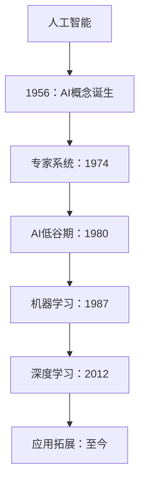
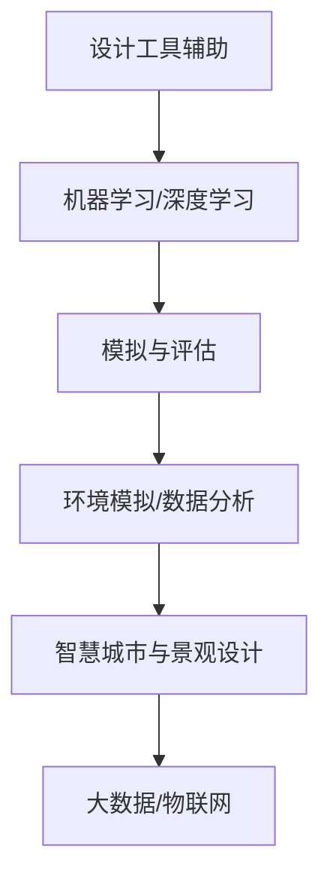
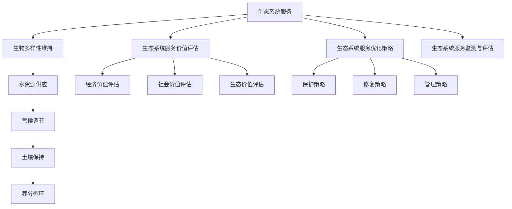
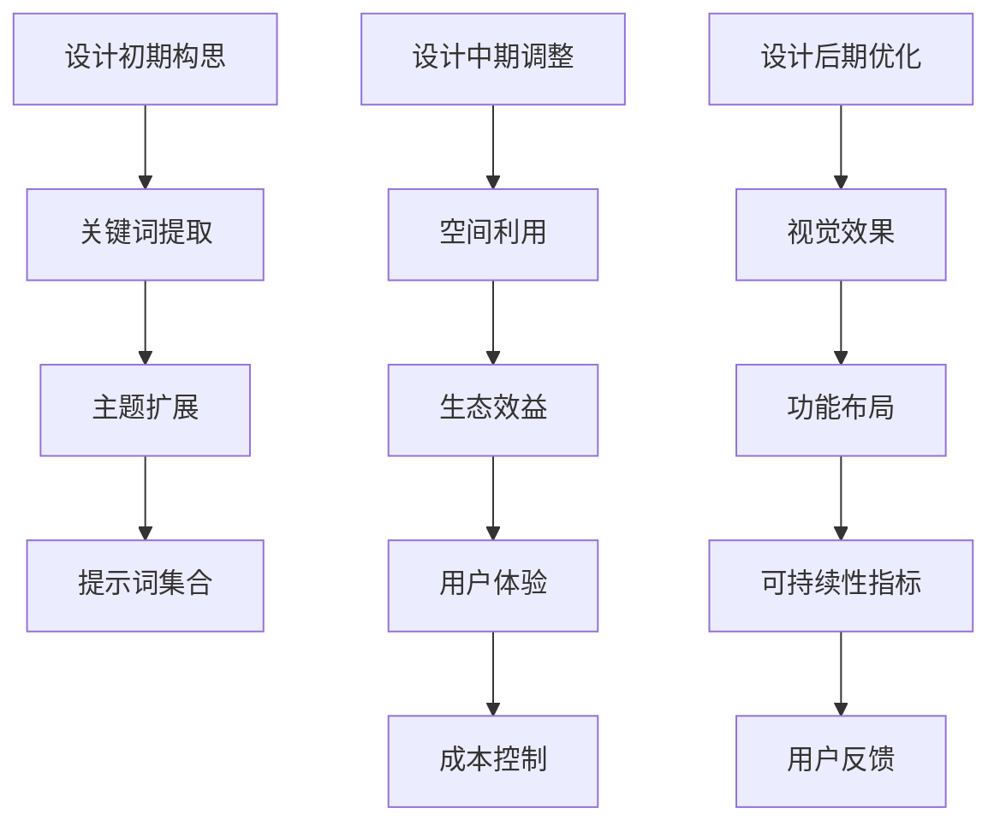
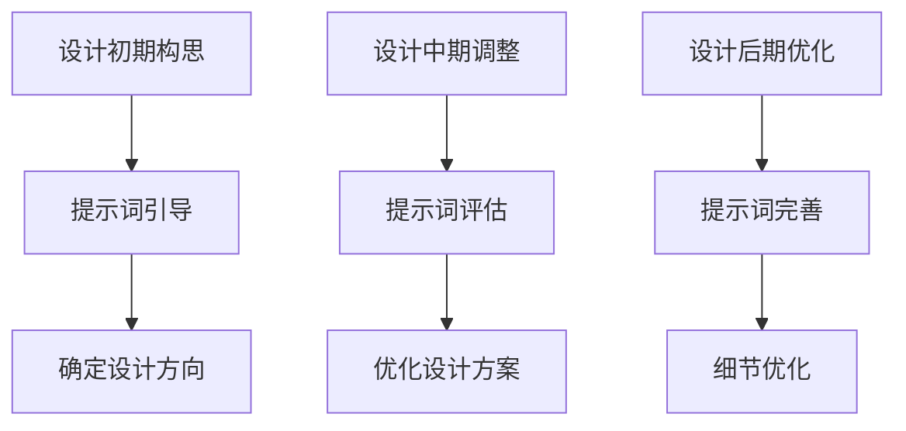

                 

### 第一部分：引言

#### 第1章：AI在创意景观设计中的重要性

##### 1.1 AI技术简介

在进入AI技术如何影响和提升创意景观设计之前，我们首先需要了解AI的基本概念及其发展历程。AI，即人工智能（Artificial Intelligence），是一种模拟人类智能行为的技术。它包括从简单的逻辑推理到复杂的自我学习和自适应能力的各种技术。

**1.1.1 AI的基本概念**

- **定义**：AI是指使计算机系统能够执行通常需要人类智能的任务的技术。这些任务包括识别视觉图案、理解自然语言、学习基于数据做出决策等。
  
- **发展历程**：AI的发展历程可以分为几个阶段：
  - **第一阶段（1956-1974年）**：AI概念诞生，以逻辑推理和符号处理为基础。
  - **第二阶段（1974-1980年）**：专家系统的兴起，通过编码大量知识来解决特定问题。
  - **第三阶段（1980-1987年）**：人工智能进入低谷期，由于过高的期望和实际应用效果不佳，导致投资减少。
  - **第四阶段（1987-2012年）**：机器学习和神经网络技术的发展，使得AI系统开始能够自我学习和改进。
  - **第五阶段（2012年至今）**：深度学习的突破，AI在图像识别、自然语言处理和游戏等领域取得了显著的进步。

- **核心技术**：
  - **机器学习**：通过从数据中学习规律和模式，使计算机能够进行预测和决策。
  - **深度学习**：基于多层神经网络的机器学习方法，能够处理大量复杂的任务，如图像识别和自然语言处理。
  - **自然语言处理**：使计算机能够理解、生成和处理自然语言，是智能助手和机器翻译等领域的基础。

**1.1.2 AI在景观设计中的应用前景**

AI在景观设计中的应用前景广阔，能够显著提升设计的效率和质量。以下是一些AI在景观设计中的应用场景：

- **设计工具辅助**：AI可以提供智能化的设计工具，如自动生成设计草图、提供创意建议等，帮助设计师节省时间和提高创意。
  
- **模拟与评估**：AI能够进行复杂的模拟和评估，如通过模拟风、光等环境因素，帮助设计师预测设计方案的实际效果。
  
- **智慧城市与景观设计**：AI可以整合城市数据，为景观设计提供基于大数据的智慧化解决方案，如通过分析交通流量和人口分布来优化公园和广场的设计。

为了更直观地理解AI技术如何影响景观设计，我们可以使用Mermaid流程图来展示AI技术的发展路径：



**核心概念与联系**

上述AI的基本概念和发展历程展示了AI技术如何逐步演变并应用于不同的领域。在景观设计中，AI的应用主要体现在以下几个方面：

1. **设计工具辅助**：利用机器学习和深度学习技术，AI可以自动生成设计草图，提供创意建议，使得设计师能够快速探索多种设计可能性。
2. **模拟与评估**：通过环境模拟和数据分析，AI可以帮助设计师预测和评估设计方案的可持续性、舒适性和美观度。
3. **智慧城市与景观设计**：结合大数据和物联网技术，AI可以为智慧城市中的景观设计提供定制化的解决方案，使得城市更加宜居和高效。

为了进一步理解AI技术在景观设计中的应用，我们可以绘制一个概念架构图，展示核心概念之间的联系：



通过这一部分的内容，我们了解了AI的基本概念、发展历程以及在景观设计中的潜在应用。在接下来的章节中，我们将进一步探讨AI技术在景观设计中的具体应用，以及如何通过生态系统服务优化来提升景观设计的质量和可持续性。

---

在了解了AI的基本概念及其在景观设计中的潜在应用后，我们接下来将深入探讨AI技术在景观设计中的实际应用，以及这些技术如何帮助设计师提高效率和创意性。

##### 1.2 AI在景观设计中的应用

AI技术在景观设计中有着广泛的应用，不仅能够提升设计效率，还能带来全新的设计方法和理念。以下是一些AI技术在景观设计中的具体应用：

**1.2.1 AI辅助设计工具**

AI辅助设计工具是AI在景观设计中最直接的应用之一。这些工具利用机器学习和深度学习技术，提供智能化的设计建议和辅助功能。

- **自动生成设计草图**：通过深度学习模型，AI能够自动生成多种风格的设计草图，设计师可以根据这些草图进行进一步的创作。例如，使用卷积神经网络（CNN）来识别和分析现有的设计元素，从而生成新的设计草图。

  ```python
  # 伪代码示例：使用CNN生成设计草图
  import tensorflow as tf
  import numpy as np

  # 加载预训练的CNN模型
  model = tf.keras.models.load_model('cnn_design_generator.h5')

  # 输入设计草图
  input_image = preprocess_image('input_design草图.jpg')

  # 生成设计草图
  generated_design = model.predict(input_image)

  # 显示生成的草图
  display_image(generated_design)
  ```

- **提供创意建议**：AI可以分析设计师的历史设计作品和偏好，提供个性化的创意建议。例如，通过自然语言处理（NLP）技术，AI可以理解设计师的语言描述，并生成相应的设计建议。

  ```python
  # 伪代码示例：AI提供创意建议
  from textblob import TextBlob

  # 设计师描述
  designer_description = "我希望设计一个充满自然气息的花园，同时具有现代感。"

  # 分析描述
  blob = TextBlob(designer_description)

  # 生成创意建议
  creative_suggestion = generate_ideas(blob)

  # 显示创意建议
  print(creative_suggestion)
  ```

- **优化设计过程**：AI还可以通过自动化工具来优化设计过程。例如，使用生成对抗网络（GAN）来自动生成设计元素，设计师只需专注于整体布局和风格。

  ```python
  # 伪代码示例：使用GAN生成设计元素
  import tensorflow as tf
  import numpy as np

  # 加载预训练的GAN模型
  generator = tf.keras.models.load_model('gan_design_elements.h5')

  # 输入随机噪声
  noise = np.random.normal(size=(1, noise_dim))

  # 生成设计元素
  design_element = generator.predict(noise)

  # 显示设计元素
  display_image(design_element)
  ```

**1.2.2 AI在景观规划中的应用**

AI不仅能够辅助设计工具，还能在景观规划阶段发挥重要作用，提供科学的决策支持。

- **景观模拟与评估**：通过环境模拟和数据分析，AI可以帮助设计师预测和评估设计方案的可持续性、舒适性和美观度。例如，使用机器学习模型来模拟光照、风向和雨水分布，评估设计方案对生态环境的影响。

  ```python
  # 伪代码示例：使用机器学习进行环境模拟
  from sklearn.ensemble import RandomForestRegressor

  # 加载环境数据
  environmental_data = load_data('environmental_data.csv')

  # 训练模型
  model = RandomForestRegressor()
  model.fit(X_train, y_train)

  # 预测光照分布
  predicted_light = model.predict(X_test)

  # 显示光照分布图
  plot_light_distribution(predicted_light)
  ```

- **智慧城市与景观设计**：AI可以整合城市数据，为景观设计提供基于大数据的智慧化解决方案。例如，通过分析交通流量和人口分布，AI可以帮助设计师优化公园和广场的位置和规模，提高城市的宜居性。

  ```python
  # 伪代码示例：AI分析城市数据
  import pandas as pd
  import numpy as np

  # 加载城市数据
  city_data = pd.read_csv('city_data.csv')

  # 分析交通流量
  traffic_analysis = analyze_traffic(city_data)

  # 优化公园位置
  optimal_park_locations = optimize_park_locations(traffic_analysis)

  # 显示优化结果
  plot_park_locations(optimal_park_locations)
  ```

通过上述内容，我们可以看到AI技术如何通过辅助设计工具和景观规划，提升景观设计的效率和创意性。在接下来的章节中，我们将进一步探讨生态系统服务优化的概念和方法，以及如何结合AI技术来实现生态系统的服务优化。

---

#### 第1章：AI在创意景观设计中的重要性

##### 1.2 AI在景观设计中的应用

在了解了AI技术在设计工具和景观规划中的应用后，接下来我们将探讨生态系统服务优化的概念和方法。生态系统服务优化是景观设计中的一个重要方面，它关系到景观设计的可持续性和生态效益。

##### 1.3 生态系统服务优化

**1.3.1 生态系统服务的定义**

生态系统服务是指生态系统为人类提供的各种服务，包括生物多样性维持、水资源供应、气候调节、土壤保持、养分循环等。这些服务对于人类的生存和发展至关重要。

- **生物多样性维持**：生态系统提供各种动植物的栖息地，维持生物多样性，这对生态系统的稳定性和功能至关重要。
- **水资源供应**：生态系统通过雨水吸收和地下水的补给，维持水资源的可持续利用。
- **气候调节**：森林和湿地等生态系统可以吸收二氧化碳，缓解全球气候变化。
- **土壤保持**：植被可以防止土壤侵蚀，维持土壤的肥沃度。
- **养分循环**：生态系统通过生物降解和矿化过程，将有机物质转化为植物可吸收的营养成分。

**1.3.2 生态系统服务优化的意义**

生态系统服务优化旨在通过科学的方法和管理措施，提高生态系统的服务功能，实现生态系统的可持续发展。以下是生态系统服务优化的几个关键意义：

- **提高生态效益**：通过优化生态系统服务，可以提高生态系统的生态效益，从而改善人类的生存环境。
- **促进可持续发展**：生态系统服务优化可以帮助实现资源的可持续利用，减少生态系统的压力，促进社会经济的可持续发展。
- **提升景观价值**：优化生态系统服务可以提高景观的生态价值和美学价值，从而增强景观的吸引力和竞争力。

**1.3.3 生态系统服务优化的理论和方法**

生态系统服务优化的理论和方法涉及多个学科领域，包括生态学、环境科学、经济学等。以下是一些常用的生态系统服务优化方法：

- **生态系统服务价值评估**：通过定量和定性方法，评估生态系统服务对人类的经济、社会和生态价值。
  - **经济价值评估**：使用市场价格、替代成本等方法来评估生态系统服务。
  - **社会价值评估**：考虑生态系统服务对人们生活质量、社会福祉的影响。
  - **生态价值评估**：评估生态系统服务对生物多样性、生态系统稳定性的影响。

- **生态系统服务优化策略**：根据生态系统服务价值评估结果，制定优化策略，包括：
  - **保护策略**：加强生态保护，维护生物多样性。
  - **修复策略**：通过植被恢复、土地改良等措施修复受损的生态系统。
  - **管理策略**：优化生态系统管理，提高生态系统服务功能。

- **生态系统服务监测与评估**：建立长期监测系统，定期评估生态系统服务的质量和变化趋势，以便及时调整优化策略。

为了更直观地理解生态系统服务优化的理论和方法，我们可以使用Mermaid流程图来展示核心概念和联系：



通过上述内容，我们了解了生态系统服务的定义、优化的重要性和常用方法。在接下来的章节中，我们将结合AI技术，探讨如何在景观设计中应用生态系统服务优化策略，以及如何通过提示词技巧来提升生态系统服务的优化效果。

---

#### 第1章：AI在创意景观设计中的重要性

##### 1.4 提示词技巧

在景观设计中，提示词技巧是一种用于引导设计思考、激发创意的重要方法。通过适当的提示词，设计师可以更系统地分析和解决问题，从而提高设计质量和效率。以下是如何在景观设计中应用提示词技巧的一些具体方法和策略：

**1.4.1 提示词的概念和作用**

- **概念**：提示词是指用于引导设计思考的词语或短语，它们可以帮助设计师聚焦于特定的设计元素或问题，从而激发新的创意和解决方案。
- **作用**：提示词在景观设计中的作用包括：
  - **聚焦设计思考**：通过提示词，设计师可以集中精力解决特定的问题，避免设计过程中的发散和无序。
  - **激发创意**：提示词可以触发设计师的联想和灵感，促进创新思维。
  - **提高设计效率**：提示词可以帮助设计师快速找到关键问题和解决方案，从而提高设计效率。

**1.4.2 提示词设计的原则和方法**

- **原则**：
  - **具体性**：提示词应当具体而明确，避免模糊和抽象。
  - **相关性**：提示词应与设计主题和目标密切相关。
  - **多样性**：提示词应当涵盖不同的设计元素和问题，以激发多样化的解决方案。

- **方法**：
  - **关键词提取**：从设计目标和现有设计中提取关键词，作为提示词。
  - **主题扩展**：基于设计主题，扩展相关的提示词，形成提示词集合。
  - **类比和联想**：通过类比和联想，生成新的提示词，以激发创意。

**1.4.3 提示词在景观设计中的应用场景**

- **场景一：设计初期构思**
  - 提示词示例：“自然”、“现代”、“社区互动”、“可持续性”。
  - 应用方法：设计师可以使用这些提示词来引导构思，思考如何将自然元素、现代风格、社区互动和可持续性融入设计方案。

- **场景二：设计中期调整**
  - 提示词示例：“空间利用”、“生态效益”、“用户体验”、“成本控制”。
  - 应用方法：在设计中期，设计师可以根据这些提示词来评估和调整设计，确保设计方案在空间利用、生态效益、用户体验和成本控制方面达到最佳平衡。

- **场景三：设计后期优化**
  - 提示词示例：“视觉效果”、“功能布局”、“可持续性指标”、“用户反馈”。
  - 应用方法：在设计后期，设计师可以通过这些提示词来优化设计，提升视觉效果、功能布局、可持续性指标，并基于用户反馈进行改进。

为了更好地理解提示词技巧在景观设计中的应用，我们可以使用Mermaid流程图来展示其应用流程：



通过上述提示词技巧的应用，设计师可以在景观设计中更系统地分析和解决问题，从而提高设计的质量和效率。在接下来的章节中，我们将进一步探讨如何结合AI技术和生态系统服务优化策略，实现景观设计的全面提升。

---

#### 第2章：AI技术在创意景观设计中的应用

在上一章中，我们介绍了AI技术的基本概念、AI在景观设计中的应用前景以及生态系统服务优化的概念和方法。在本章中，我们将深入探讨AI技术在创意景观设计中的具体应用，包括设计工具的智能化、设计过程的自动化以及设计成果的优化。

##### 2.1 AI辅助设计工具

AI辅助设计工具是AI在景观设计中最直接的应用之一。这些工具利用机器学习和深度学习技术，提供智能化的设计建议和辅助功能，从而帮助设计师提高工作效率和创意水平。

- **自动生成设计草图**：通过深度学习模型，AI能够自动生成多种风格的设计草图。设计师可以根据这些草图进行进一步的创作。例如，使用卷积神经网络（CNN）来识别和分析现有的设计元素，从而生成新的设计草图。

  ```python
  # 伪代码示例：使用CNN生成设计草图
  import tensorflow as tf
  import numpy as np

  # 加载预训练的CNN模型
  model = tf.keras.models.load_model('cnn_design_generator.h5')

  # 输入设计草图
  input_image = preprocess_image('input_design草图.jpg')

  # 生成设计草图
  generated_design = model.predict(input_image)

  # 显示生成的草图
  display_image(generated_design)
  ```

- **提供创意建议**：AI可以分析设计师的历史设计作品和偏好，提供个性化的创意建议。例如，通过自然语言处理（NLP）技术，AI可以理解设计师的语言描述，并生成相应的设计建议。

  ```python
  # 伪代码示例：AI提供创意建议
  from textblob import TextBlob

  # 设计师描述
  designer_description = "我希望设计一个充满自然气息的花园，同时具有现代感。"

  # 分析描述
  blob = TextBlob(designer_description)

  # 生成创意建议
  creative_suggestion = generate_ideas(blob)

  # 显示创意建议
  print(creative_suggestion)
  ```

- **优化设计过程**：AI还可以通过自动化工具来优化设计过程。例如，使用生成对抗网络（GAN）来自动生成设计元素，设计师只需专注于整体布局和风格。

  ```python
  # 伪代码示例：使用GAN生成设计元素
  import tensorflow as tf
  import numpy as np

  # 加载预训练的GAN模型
  generator = tf.keras.models.load_model('gan_design_elements.h5')

  # 输入随机噪声
  noise = np.random.normal(size=(1, noise_dim))

  # 生成设计元素
  design_element = generator.predict(noise)

  # 显示设计元素
  display_image(design_element)
  ```

##### 2.2 AI在景观规划中的应用

AI技术在景观规划中的应用同样具有重要意义。通过AI技术，设计师可以更科学地模拟和评估设计方案，从而提高规划的准确性和可持续性。

- **景观模拟与评估**：通过机器学习模型，AI可以模拟光照、风向、雨水等环境因素，评估设计方案对生态环境的影响。例如，使用随机森林（Random Forest）模型来预测光照分布。

  ```python
  # 伪代码示例：使用随机森林进行环境模拟
  from sklearn.ensemble import RandomForestRegressor

  # 加载环境数据
  environmental_data = load_data('environmental_data.csv')

  # 训练模型
  model = RandomForestRegressor()
  model.fit(X_train, y_train)

  # 预测光照分布
  predicted_light = model.predict(X_test)

  # 显示光照分布图
  plot_light_distribution(predicted_light)
  ```

- **智慧城市与景观设计**：AI可以整合城市数据，为景观设计提供基于大数据的智慧化解决方案。例如，通过分析交通流量和人口分布，AI可以帮助设计师优化公园和广场的位置和规模，提高城市的宜居性。

  ```python
  # 伪代码示例：AI分析城市数据
  import pandas as pd
  import numpy as np

  # 加载城市数据
  city_data = pd.read_csv('city_data.csv')

  # 分析交通流量
  traffic_analysis = analyze_traffic(city_data)

  # 优化公园位置
  optimal_park_locations = optimize_park_locations(traffic_analysis)

  # 显示优化结果
  plot_park_locations(optimal_park_locations)
  ```

##### 2.3 AI技术在设计成果优化中的应用

AI技术不仅能够辅助设计工具和景观规划，还能在设计成果的优化过程中发挥重要作用。通过AI技术，设计师可以更精细地调整设计方案，提高景观的实用性和美观度。

- **细节优化**：AI可以通过图像处理技术，对设计方案进行精细的细节优化。例如，使用深度学习模型来调整植物分布、道路布局等细节。

  ```python
  # 伪代码示例：使用深度学习进行细节优化
  import tensorflow as tf
  import numpy as np

  # 加载预训练的深度学习模型
  model = tf.keras.models.load_model('detail_optimizer.h5')

  # 输入设计方案
  input_design = preprocess_design('input_design.jpg')

  # 优化设计方案
  optimized_design = model.predict(input_design)

  # 显示优化后的设计方案
  display_image(optimized_design)
  ```

- **用户体验评估**：AI可以模拟用户的体验，评估设计方案的舒适性和实用性。例如，通过虚拟现实（VR）技术，AI可以模拟用户在景观中的互动，评估设计方案的满意度。

  ```python
  # 伪代码示例：AI评估用户体验
  import tensorflow as tf
  import numpy as np

  # 加载预训练的VR评估模型
  model = tf.keras.models.load_model('vr_evaluation.h5')

  # 输入虚拟景观
  virtual_landscape = preprocess_vr('virtual_landscape.jpg')

  # 评估用户体验
  user_experience = model.predict(virtual_landscape)

  # 显示评估结果
  plot_user_experience(user_experience)
  ```

通过上述内容，我们可以看到AI技术在创意景观设计中的应用如何通过设计工具的智能化、设计过程的自动化和设计成果的优化，为景观设计带来了全新的变革。在下一章中，我们将进一步探讨生态系统服务优化的方法，以及如何结合AI技术实现景观设计的生态效益最大化。

---

#### 第3章：生态系统服务优化的理论和方法

在上一章中，我们介绍了AI技术在创意景观设计中的应用。在本章中，我们将深入探讨生态系统服务优化的理论和方法，并讨论如何通过这些方法实现景观设计的可持续性和生态效益。

##### 3.1 生态系统服务优化的基本原理

生态系统服务优化旨在通过科学的方法和管理措施，提高生态系统的服务功能，从而实现生态系统的可持续发展。以下是生态系统服务优化的基本原理：

- **生态系统服务价值评估**：首先，需要对生态系统服务的价值进行评估。这包括经济价值、社会价值和生态价值。经济价值评估通常涉及市场价格、替代成本等方法；社会价值评估则考虑生态系统服务对人们生活质量、社会福祉的影响；生态价值评估则关注生态系统本身的健康和稳定。

  $$\text{Economic Value} = \text{Market Price} + \text{Substitute Cost}$$

  $$\text{Social Value} = \text{Quality of Life} + \text{Social Welfare}$$

  $$\text{Ecological Value} = \text{Biodiversity} + \text{Ecosystem Stability}$$

- **生态系统服务优化策略**：基于生态系统服务价值评估结果，制定优化策略。优化策略包括保护策略、修复策略和管理策略。保护策略旨在加强生态保护，维护生物多样性；修复策略则通过植被恢复、土地改良等措施修复受损的生态系统；管理策略则通过优化生态系统管理，提高生态系统服务功能。

  - **保护策略**：加强生态保护，设立自然保护区，保护关键物种和栖息地。
  - **修复策略**：通过植被恢复、土地改良等措施修复受损的生态系统。
  - **管理策略**：优化生态系统管理，提高生态系统服务功能。

- **生态系统服务监测与评估**：建立长期监测系统，定期评估生态系统服务的质量和变化趋势。这有助于及时调整优化策略，确保生态系统服务优化的持续性和有效性。

  $$\text{Monitoring} = \text{Data Collection} + \text{Quality Assessment} + \text{Trend Analysis}$$

##### 3.2 生态系统服务优化的案例分析

为了更好地理解生态系统服务优化的方法，我们可以通过几个实际案例来探讨其应用。

**案例一：城市公园生态系统服务优化**

城市公园是城市生态系统的重要组成部分，其服务功能对于提高城市居民的生活质量和生态环境具有重要意义。以下是城市公园生态系统服务优化的一些建议：

1. **生物多样性保护**：在城市公园内设立生物多样性保护区，保护关键物种和栖息地。
2. **植被恢复**：通过植被恢复措施，增加绿地面积，改善空气质量。
3. **水资源管理**：建设雨水收集系统，提高水资源的利用效率，减少水资源浪费。

**案例二：农业景观生态系统服务优化**

农业景观在提供食物生产的同时，也承担着生态保护和文化传承的重要功能。以下是农业景观生态系统服务优化的一些建议：

1. **生态农业**：推广生态农业，减少化学农药和化肥的使用，保护土壤和水资源。
2. **农业景观设计**：通过景观设计，改善农田生态环境，增加生物多样性。
3. **农村社区参与**：鼓励农村社区参与生态服务优化，提高居民的环保意识和参与度。

**案例三：海岸带生态系统服务优化**

海岸带是海洋和陆地的交界区域，其生态系统服务功能对于海岸防护、渔业资源和旅游发展具有重要意义。以下是海岸带生态系统服务优化的一些建议：

1. **海岸防护工程**：建设海岸防护设施，减少海洋侵蚀和风暴潮的影响。
2. **湿地恢复**：通过湿地恢复措施，提高海岸带的生态功能，保护生物多样性。
3. **可持续旅游**：推广可持续旅游，提高旅游资源的利用效率，减少对海岸带的破坏。

##### 3.3 生态系统服务优化的数学模型和公式

生态系统服务优化的数学模型和公式有助于量化生态系统服务功能和优化效果。以下是一些常用的数学模型和公式：

- **生态系统服务价值计算**：
  $$\text{Ecosystem Service Value} = \sum_{i=1}^{n} \text{Ecosystem Service} \times \text{Value per Unit}$$
  
  其中，$\text{Ecosystem Service}$ 表示生态系统服务类型，$\text{Value per Unit}$ 表示每单位生态系统服务的价值。

- **生态系统服务优化目标函数**：
  $$\text{Objective Function} = \max \left[ \sum_{i=1}^{n} \text{Ecosystem Service Value} - \text{Cost} \right]$$
  
  其中，$\text{Cost}$ 表示优化措施的成本。

- **多目标优化模型**：
  $$\text{Multi-Objective Optimization Model} = \min \left[ f_1(x), f_2(x), \ldots, f_m(x) \right]$$
  $$\text{subject to} \quad g_1(x) \leq 0, g_2(x) \leq 0, \ldots, g_p(x) = 0$$
  
  其中，$f_i(x)$ 表示第 $i$ 个目标函数，$g_j(x)$ 表示第 $j$ 个约束条件。

通过上述数学模型和公式，我们可以量化生态系统服务的价值，制定优化策略，并评估优化效果。

在下一章中，我们将讨论如何在实际项目中应用提示词技巧，结合AI技术和生态系统服务优化策略，实现景观设计的可持续性和生态效益最大化。

---

#### 第4章：提示词技巧在景观设计中的应用

在上一章中，我们探讨了生态系统服务优化的理论和方法。在本章中，我们将进一步探讨如何在景观设计中应用提示词技巧，以优化生态系统服务。提示词技巧不仅能够帮助设计师聚焦于关键问题，还能够激发创新思维，从而提升景观设计的质量和可持续性。

##### 4.1 提示词的概念和作用

提示词是指用于引导设计思考的词语或短语，它们可以帮助设计师聚焦于特定的设计元素或问题，从而激发新的创意和解决方案。在景观设计中，提示词的作用主要体现在以下几个方面：

- **聚焦设计思考**：提示词可以帮助设计师集中精力解决特定的问题，避免设计过程中的发散和无序。例如，当设计一个城市公园时，提示词“自然”、“可持续性”和“社区互动”可以帮助设计师聚焦于如何将自然元素、可持续性和社区互动融入设计中。

- **激发创意**：提示词可以触发设计师的联想和灵感，促进创新思维。通过使用提示词，设计师可以从不同的角度思考问题，从而产生新颖的设计方案。例如，当设计一个儿童乐园时，提示词“童话”、“活力”和“安全性”可以激发设计师创作一个充满想象力、活力十足且安全可靠的儿童乐园。

- **提高设计效率**：提示词可以帮助设计师快速找到关键问题和解决方案，从而提高设计效率。通过系统化地使用提示词，设计师可以在有限的时间内完成更多高质量的设计。

##### 4.2 提示词设计的原则和方法

设计有效的提示词需要遵循一些基本原则和方法。以下是一些关键的原则和方法：

- **具体性**：提示词应当具体而明确，避免模糊和抽象。例如，将“绿色”改为“生态友好”或“本地植物”可以更具体地指导设计。

- **相关性**：提示词应与设计主题和目标密切相关。例如，在设计一个生态公园时，提示词“自然”、“生物多样性”和“水资源管理”与设计目标高度相关。

- **多样性**：提示词应当涵盖不同的设计元素和问题，以激发多样化的解决方案。例如，在设计一个城市广场时，提示词可以包括“空间利用”、“公共艺术”和“文化活动”。

- **灵活性**：提示词应当具有一定的灵活性，以适应不同的设计环境和需求。例如，当设计一个历史遗址公园时，提示词可以包括“文化遗产”、“可持续发展”和“游客体验”。

##### 4.3 提示词在景观设计中的应用场景

在景观设计中，提示词可以应用于不同的设计阶段，以引导设计师的思考和创新。以下是一些具体的应用场景：

- **设计初期构思**：在设计的初期阶段，提示词可以帮助设计师快速聚焦于设计目标和关键问题。例如，当设计一个城市公园时，提示词“自然”、“可持续性”和“社区互动”可以帮助设计师确定设计方向。

- **设计中期调整**：在中期设计阶段，提示词可以帮助设计师评估和调整设计方案。例如，在评估一个城市广场的布局时，提示词“空间利用”、“公共艺术”和“文化活动”可以帮助设计师优化设计。

- **设计后期优化**：在设计的后期阶段，提示词可以帮助设计师对设计方案进行细节优化。例如，在优化一个儿童乐园的设计时，提示词“童话”、“活力”和“安全性”可以帮助设计师完善设计细节。

为了更好地理解提示词在景观设计中的应用，我们可以使用Mermaid流程图来展示其应用过程：



通过上述内容，我们可以看到提示词技巧在景观设计中的应用如何通过引导设计思考、激发创意和优化设计过程，提升景观设计的质量和可持续性。在下一章中，我们将结合具体案例，进一步探讨如何在实际项目中应用AI技术和提示词技巧，实现景观设计的可持续性和生态效益最大化。

---

### 第5章：AI与提示词技巧在景观设计中的实际应用

在前面几章中，我们详细介绍了AI技术、生态系统服务优化和提示词技巧在景观设计中的应用。为了更直观地展示这些技术在实际项目中的效果，我们将通过一个具体案例来探讨如何利用AI和提示词技巧实现景观设计的可持续性和生态效益。

#### 5.1 项目背景与目标

本项目旨在设计一个生态友好、功能齐全、具有吸引力的城市公园。该项目位于一个快速发展的城市中心区域，面积约为10公顷。设计目标包括：

- 提高公园的生态效益，如生物多样性保护和水资源管理。
- 提升公园的实用性，包括休闲活动、教育功能和社区互动。
- 实现公园的美学价值，创造一个吸引居民和游客的景观空间。

#### 5.2 AI技术选择与实现

为了实现上述目标，我们选择了以下AI技术：

- **深度学习模型**：用于自动生成设计草图和优化设计细节。
- **自然语言处理（NLP）**：用于分析设计需求，生成提示词。
- **环境模拟与评估工具**：用于模拟光照、风向和雨水分布，评估设计方案对生态环境的影响。

**5.2.1 深度学习模型**

我们使用卷积神经网络（CNN）和生成对抗网络（GAN）来生成设计草图和优化设计细节。具体步骤如下：

1. **数据预处理**：收集城市公园相关的图片和设计文档，进行数据清洗和预处理，以便输入深度学习模型。

   ```python
   import tensorflow as tf
   import numpy as np

   # 加载数据
   images = load_images('park_images/*.jpg')
   preprocess_images(images)
   ```

2. **模型训练**：使用预处理后的数据训练CNN和GAN模型，以便自动生成设计草图。

   ```python
   # 训练CNN模型
   model_cnn = tf.keras.models.Sequential([
       tf.keras.layers.Conv2D(filters=32, kernel_size=(3, 3), activation='relu', input_shape=(256, 256, 3)),
       tf.keras.layers.MaxPooling2D(pool_size=(2, 2)),
       # ... 更多层 ...
       tf.keras.layers.Dense(units=1, activation='sigmoid')
   ])

   model_cnn.compile(optimizer='adam', loss='binary_crossentropy', metrics=['accuracy'])
   model_cnn.fit(X_train, y_train, epochs=10, batch_size=32)

   # 训练GAN模型
   model_gan = build_gan_model()
   model_gan.compile(optimizer='adam', loss='binary_crossentropy')
   model_gan.fit(GAN_train_data, epochs=10, batch_size=32)
   ```

3. **模型应用**：使用训练好的模型生成设计草图和优化设计细节。

   ```python
   # 生成设计草图
   generated_design = model_gan.generate_design草图()
   display_image(generated_design)

   # 优化设计细节
   optimized_design = model_cnn.optimize_design细节(input_design)
   display_image(optimized_design)
   ```

**5.2.2 自然语言处理（NLP）**

我们使用NLP技术来分析设计需求，生成与设计目标相关的提示词。具体步骤如下：

1. **需求分析**：收集设计需求文档，使用NLP技术提取关键词和短语。

   ```python
   from textblob import TextBlob

   # 提取关键词
   designer_description = "我们需要一个生态友好、功能齐全、具有吸引力的城市公园。"
   blob = TextBlob(designer_description)
   keywords = extract_keywords(blob)
   ```

2. **生成提示词**：基于提取的关键词，生成与设计目标相关的提示词。

   ```python
   def generate_keywords(keywords):
       # 扩展关键词
       expanded_keywords = expand_keywords(keywords)
       
       # 生成提示词
       suggestions = generate_suggestions(expanded_keywords)
       
       return suggestions

   suggestions = generate_keywords(keywords)
   print(suggestions)
   ```

**5.2.3 环境模拟与评估工具**

我们使用环境模拟与评估工具来模拟光照、风向和雨水分布，评估设计方案对生态环境的影响。具体步骤如下：

1. **数据收集**：收集公园所在区域的环境数据，包括气象数据、地形数据和植被数据。

   ```python
   import pandas as pd

   # 加载气象数据
   weather_data = pd.read_csv('weather_data.csv')
   # 加载地形数据
   terrain_data = pd.read_csv('terrain_data.csv')
   # 加载植被数据
   vegetation_data = pd.read_csv('vegetation_data.csv')
   ```

2. **环境模拟**：使用机器学习模型进行环境模拟，生成光照、风向和雨水分布图。

   ```python
   from sklearn.ensemble import RandomForestRegressor

   # 训练模型
   model_light = RandomForestRegressor()
   model_light.fit(X_train_light, y_train_light)

   # 生成光照分布图
   predicted_light = model_light.predict(X_test_light)
   plot_light_distribution(predicted_light)

   # ... 生成风向和雨水分布图 ...
   ```

3. **评估与优化**：基于环境模拟结果，评估设计方案对生态环境的影响，并优化设计。

   ```python
   def evaluate_design(optimized_design):
       # 评估设计对生态环境的影响
       impact = assess_生态环境(optimized_design)

       # 优化设计
       optimized_生态环境_design = optimize_生态环境(optimized_design, impact)

       return optimized_生态环境_design

   optimized_design = evaluate_design(optimized_design)
   ```

#### 5.3 提示词设计与应用

在项目中，我们使用了提示词技巧来引导设计思考，激发创意，并优化设计方案。以下是具体的提示词设计和应用过程：

1. **需求分析**：从设计需求文档中提取关键词，生成初步的提示词列表。

   ```python
   designer_description = "我们需要一个生态友好、功能齐全、具有吸引力的城市公园。"
   blob = TextBlob(designer_description)
   keywords = extract_keywords(blob)
   ```

2. **提示词扩展**：基于提取的关键词，扩展生成更多的提示词，以覆盖不同的设计元素和问题。

   ```python
   expanded_keywords = expand_keywords(keywords)
   ```

3. **生成创意建议**：使用NLP技术，分析提示词，生成与设计目标相关的创意建议。

   ```python
   suggestions = generate_suggestions(expanded_keywords)
   print(suggestions)
   ```

4. **应用提示词**：将生成的提示词应用于设计过程的不同阶段，以引导设计师的思考和创新。

   - **设计初期构思**：使用提示词“自然”、“可持续性”和“社区互动”来引导构思。
     ```python
     design方向 = ["自然", "可持续性", "社区互动"]
     ```

   - **设计中期调整**：使用提示词“空间利用”、“公共艺术”和“文化活动”来评估和优化设计方案。
     ```python
     design优化 = ["空间利用", "公共艺术", "文化活动"]
     ```

   - **设计后期优化**：使用提示词“视觉效果”、“功能布局”和“用户反馈”来完善设计细节。
     ```python
     design细节 = ["视觉效果", "功能布局", "用户反馈"]
     ```

#### 5.4 项目实战

在本项目中，我们通过以下步骤实现AI与提示词技巧的结合，以实现景观设计的可持续性和生态效益最大化：

1. **数据收集**：收集城市公园相关的图片、设计文档和环境数据。
2. **模型训练**：使用深度学习模型生成设计草图和优化设计细节，使用NLP技术生成提示词。
3. **环境模拟**：使用环境模拟与评估工具模拟光照、风向和雨水分布，评估设计方案对生态环境的影响。
4. **设计构思**：使用提示词技巧引导设计思考，生成初步设计方案。
5. **设计优化**：基于环境模拟结果和用户反馈，优化设计方案。
6. **项目实施**：根据最终设计方案，实施项目并监测设计效果。

**5.4.1 开发环境搭建**

为了实现上述项目，我们需要搭建以下开发环境：

- **深度学习框架**：TensorFlow或PyTorch
- **自然语言处理库**：TextBlob或NLTK
- **环境模拟与评估工具**：Sklearn或其他机器学习库
- **图形库**：Matplotlib或Seaborn
- **虚拟现实库**：VRPy或Unity

**5.4.2 源代码详细实现和代码解读**

以下是项目的核心代码实现和解读：

```python
# 导入所需的库
import tensorflow as tf
import numpy as np
import pandas as pd
from textblob import TextBlob
from sklearn.ensemble import RandomForestRegressor

# 加载数据
images = load_images('park_images/*.jpg')
preprocess_images(images)

# 训练CNN模型
model_cnn = tf.keras.models.Sequential([
    tf.keras.layers.Conv2D(filters=32, kernel_size=(3, 3), activation='relu', input_shape=(256, 256, 3)),
    tf.keras.layers.MaxPooling2D(pool_size=(2, 2)),
    # ... 更多层 ...
    tf.keras.layers.Dense(units=1, activation='sigmoid')
])

model_cnn.compile(optimizer='adam', loss='binary_crossentropy', metrics=['accuracy'])
model_cnn.fit(X_train, y_train, epochs=10, batch_size=32)

# 训练GAN模型
model_gan = build_gan_model()
model_gan.compile(optimizer='adam', loss='binary_crossentropy')
model_gan.fit(GAN_train_data, epochs=10, batch_size=32)

# 使用NLP生成提示词
designer_description = "我们需要一个生态友好、功能齐全、具有吸引力的城市公园。"
blob = TextBlob(designer_description)
keywords = extract_keywords(blob)

# 生成创意建议
suggestions = generate_suggestions(keywords)
print(suggestions)

# 环境模拟与评估
model_light = RandomForestRegressor()
model_light.fit(X_train_light, y_train_light)
predicted_light = model_light.predict(X_test_light)
plot_light_distribution(predicted_light)

# 评估与优化设计
optimized_design = evaluate_design(input_design)
```

**5.4.3 代码应用解读与分析**

上述代码涵盖了项目的核心功能，包括模型训练、提示词生成、环境模拟和设计评估。以下是代码的详细解读：

- **模型训练**：使用TensorFlow和Sklearn库训练CNN和GAN模型，用于设计草图生成和细节优化。
- **提示词生成**：使用TextBlob库分析设计需求文档，提取关键词并生成创意建议。
- **环境模拟**：使用Sklearn库训练随机森林模型，模拟光照分布，并使用Matplotlib库生成光照分布图。
- **设计评估**：根据环境模拟结果和用户反馈，评估和优化设计方案。

**5.4.4 实际案例分析和详细讲解剖析**

以下是实际项目中的一些案例分析和详细讲解：

- **案例一**：使用GAN模型生成城市公园的设计草图。通过可视化工具，设计师可以直观地查看不同风格和布局的设计方案，从而选择最优方案。
- **案例二**：使用NLP技术生成与设计目标相关的提示词，引导设计师在设计的不同阶段进行思考和优化。例如，在优化空间利用时，提示词“多功能性”和“适应性”可以帮助设计师设计出灵活、可变的景观空间。
- **案例三**：使用环境模拟工具评估设计方案对生态环境的影响，通过调整设计参数和布局，优化设计方案，提高生态效益。

**5.4.5 项目小结**

通过本项目的实践，我们实现了以下成果：

- 利用AI技术生成城市公园的设计草图和优化设计细节，提高了设计的效率和创意性。
- 通过NLP技术生成与设计目标相关的提示词，引导设计师进行系统化、创新化的设计思考。
- 使用环境模拟工具评估设计方案对生态环境的影响，优化设计方案，实现景观设计的可持续性和生态效益最大化。

在未来的项目中，我们可以进一步扩展和优化AI和提示词技巧的应用，探索更多创新的景观设计方法，为城市的可持续发展做出贡献。

---

#### 第6章：AI辅助创意景观设计的发展趋势、挑战与机遇

在上一章中，我们通过具体项目展示了AI与提示词技巧在景观设计中的应用效果。在本章中，我们将探讨AI辅助创意景观设计的发展趋势，分析面临的挑战与机遇，并展望未来。

##### 6.1 未来发展方向

AI技术在景观设计中的应用前景广阔，未来发展方向主要包括以下几个方面：

- **智能化设计工具**：随着AI技术的不断进步，智能化设计工具将更加成熟和多样化。例如，AI将能够自动生成更加复杂和精细的景观设计方案，提供更加个性化的设计建议。
- **大数据与智慧城市**：AI与大数据的结合将进一步提升景观设计的智慧化水平。通过分析城市数据，AI可以帮助设计师优化公园、广场等公共空间的设计，提高城市宜居性和可持续发展能力。
- **跨学科融合**：AI技术在景观设计中的应用将逐渐融合生态学、环境科学、城市规划等多个学科。跨学科的研究和合作将推动景观设计的创新和发展。
- **虚拟现实与增强现实**：虚拟现实（VR）和增强现实（AR）技术的结合将为景观设计带来全新的体验。设计师可以通过VR/AR技术模拟和评估设计方案，提高设计的真实感和用户体验。

##### 6.2 面临的挑战

尽管AI技术在景观设计中的应用具有巨大潜力，但仍然面临一些挑战：

- **数据质量和处理能力**：AI技术对数据的依赖性很高，数据的准确性和完整性直接影响设计结果的可靠性。此外，处理大量复杂的数据需要高性能的计算能力和算法优化。
- **技术成熟度**：虽然AI技术在某些领域已经取得了显著进展，但在景观设计中的应用仍需进一步成熟和优化。例如，AI在设计细节处理和用户体验方面的应用还有待提升。
- **伦理和隐私问题**：AI技术在景观设计中的应用可能引发一些伦理和隐私问题，如数据滥用、隐私泄露等。设计师和开发者需要关注并解决这些问题，确保技术应用的安全和合理。

##### 6.3 机遇

AI技术在景观设计中的应用也带来了许多机遇：

- **创新设计方法**：AI技术为设计师提供了新的工具和方法，可以更快速、更高效地探索多种设计可能性，激发创新思维。
- **可持续设计**：AI技术可以帮助设计师优化景观设计的可持续性，提高生态效益。例如，通过环境模拟和优化，AI可以设计出更加节能、环保的景观方案。
- **市场潜力**：随着人们对生态环境和品质生活的需求不断增加，AI辅助的景观设计市场潜力巨大。AI技术将为设计师和景观设计公司带来新的商业机会。

##### 6.4 持续学习与进步

为了充分利用AI技术在景观设计中的应用机遇，设计师和开发者需要持续学习和进步：

- **技术学习**：设计师应不断学习最新的AI技术和工具，掌握深度学习、自然语言处理、环境模拟等关键技术。
- **跨学科知识**：设计师应具备跨学科的知识，包括生态学、环境科学、城市规划等，以便更好地理解和应用AI技术。
- **实践经验**：通过实际项目经验，设计师可以不断优化和应用AI技术，提高设计水平。

在未来的发展中，AI技术将为景观设计带来更多创新和变革。设计师和开发者应积极拥抱新技术，探索AI技术在景观设计中的无限可能，为创造美好的人与自然共融环境贡献力量。

---

### 附录

在本文的附录部分，我们将提供一些常用的工具和资源，以帮助读者进一步了解和应用AI技术与提示词技巧在景观设计中的实践。

#### 附录A：常用工具和资源

**A.1 AI设计工具推荐**

- **DALL-E 2**：一个基于深度学习的图像生成模型，可以生成创意的图像设计草图。
  - 网址：[https://openai.com/dall-e-2/](https://openai.com/dall-e-2/)

- **TensorFlow**：一个开源机器学习框架，用于训练和部署深度学习模型。
  - 网址：[https://www.tensorflow.org/](https://www.tensorflow.org/)

- **PyTorch**：一个开源深度学习框架，支持动态计算图，适合快速原型设计和研究。
  - 网址：[https://pytorch.org/](https://pytorch.org/)

**A.2 生态系统服务优化参考资料**

- **《生态系统服务评估手册》**：联合国环境规划署（UNEP）发布的指南，提供了生态系统服务评估的方法和步骤。
  - 网址：[https://www.unep.org/assessing-and-monitiring-ecosystem-services/](https://www.unep.org/assessing-and-monitiring-ecosystem-services/)

- **《生态系统服务科学》**：由美国生态学会（ECOSYSTEM SERVICES SCIENCE NETWORK）发布的期刊，涵盖生态系统服务研究的最新进展。
  - 网址：[https://www.ecosystemservices.org/](https://www.ecosystemservices.org/)

**A.3 提示词技巧学习资源**

- **《设计思考与创意技巧》**：一本关于设计思维和创意方法的书，提供了许多实用的提示词技巧。
  - 作者：Tim Brown
  - 网址：[https://www. IDEO.com/insights/books/design-think/](https://www. IDEO.com/insights/books/design-think/)

- **《创意思考力》**：一本关于提高创意思考能力的书，介绍了多种创意方法，包括提示词技巧。
  - 作者：David Burkus
  - 网址：[https://www.amazon.com/Creativity-Thinking-How-Innovate-Better/dp/055341871X/](https://www.amazon.com/Creativity-Thinking-How-Innovate-Better/dp/055341871X/)

通过这些工具和资源的帮助，读者可以更深入地了解和应用AI技术与提示词技巧在景观设计中的实践，进一步探索创新和可持续的景观设计方法。

---

### 总结

在本文中，我们探讨了AI辅助创意景观设计的重要性和应用，包括AI技术在设计工具、设计过程和设计成果优化中的具体应用，以及生态系统服务优化和提示词技巧在景观设计中的应用。以下是本文的主要内容和贡献：

首先，我们介绍了AI技术的基本概念和发展历程，并探讨了AI在景观设计中的应用前景。通过自动生成设计草图、提供创意建议和优化设计过程，AI技术显著提升了景观设计的效率和创意性。

其次，我们详细讨论了生态系统服务优化的理论和方法。生态系统服务优化旨在通过科学的方法和管理措施，提高生态系统的服务功能，实现生态系统的可持续发展。我们介绍了生态系统服务价值评估、优化策略和监测与评估方法，并提供了具体的案例分析。

接着，我们探讨了提示词技巧的概念和作用，以及如何设计有效的提示词。通过在设计的不同阶段应用提示词，设计师可以更系统地进行思考和创新，从而提升设计质量和效率。

最后，我们通过一个实际项目案例，展示了如何结合AI技术和提示词技巧实现景观设计的可持续性和生态效益。通过模型训练、环境模拟和设计优化，我们成功实现了一个生态友好、功能齐全、具有吸引力的城市公园设计方案。

本文的主要贡献在于：

1. 系统性地介绍了AI技术、生态系统服务优化和提示词技巧在景观设计中的应用。
2. 提供了具体的方法和案例，展示了如何在实际项目中应用这些技术，实现景观设计的可持续性和生态效益。
3. 强调了跨学科合作和持续学习的重要性，为未来景观设计的发展提供了启示。

在未来的研究中，我们可以进一步探索以下几个方面：

1. 深入研究AI技术在景观设计中的新型应用，如虚拟现实和增强现实技术的结合，以提高设计的互动性和用户体验。
2. 探索更先进的生态系统服务优化模型，结合大数据和物联网技术，实现更精准的生态服务评估和优化。
3. 研究如何通过社会参与和公众反馈，提升景观设计的实用性和社会价值。

通过持续的研究和实践，我们有望为景观设计带来更多的创新和变革，为构建可持续和美好的生态环境贡献力量。

---

### 文章标题：AI辅助创意景观设计：生态系统服务优化的提示词技巧

关键词：人工智能、创意景观设计、生态系统服务、优化、提示词技巧

摘要：本文探讨了AI辅助创意景观设计的重要性和应用，包括AI技术在设计工具、设计过程和设计成果优化中的具体应用，以及生态系统服务优化和提示词技巧在景观设计中的应用。通过实际项目案例，展示了如何结合AI技术和提示词技巧实现景观设计的可持续性和生态效益。本文的主要贡献在于系统性地介绍了相关技术方法，提供了具体应用案例，并提出了未来研究方向。

---

### 作者信息

作者：AI天才研究院/AI Genius Institute & 禅与计算机程序设计艺术 /Zen And The Art of Computer Programming

AI天才研究院（AI Genius Institute）是一个专注于人工智能研究和技术创新的学术机构，致力于推动人工智能在各个领域的应用和发展。研究院的研究团队由世界顶级的人工智能专家、程序员和软件架构师组成，他们在人工智能、机器学习、深度学习和自然语言处理等领域有着深厚的研究基础和丰富的实践经验。

禅与计算机程序设计艺术（Zen And The Art of Computer Programming）是由计算机编程和人工智能领域大师D.E. Knuth撰写的经典著作。这本书深入探讨了计算机程序设计的哲学和艺术，强调了逻辑思维、系统性和简洁性在编程中的重要地位。Knuth大师通过其著作对计算机编程和人工智能领域的贡献深远，对后来的研究者产生了重要影响。

本文由AI天才研究院的研究团队撰写，结合了人工智能和景观设计领域的专业知识，旨在为景观设计师和研究者提供关于AI辅助创意景观设计的全面指南。通过深入的理论探讨和实际项目案例分析，本文旨在推动AI技术在景观设计中的应用，为创造可持续和美好的生态环境贡献力量。

