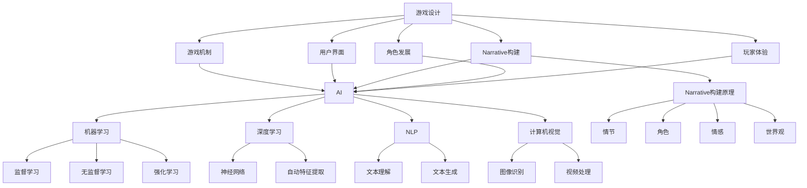

                 

### 引言与背景介绍

随着人工智能（AI）技术的飞速发展，游戏设计领域正经历着前所未有的变革。传统游戏设计依赖设计师的创意与直觉，而如今，AI作为强大的辅助工具，正逐步渗透到游戏设计的各个环节。本文旨在探讨AI辅助创意游戏设计中的narrative构建，以及提示词技巧的应用。

**AI辅助创意游戏设计概述**

AI在游戏设计中的应用日益广泛，从游戏AI对手的生成、玩家行为的预测，到游戏的自主生成和适应，AI的介入为游戏设计带来了无限的创意空间和可能性。特别是narrative构建，作为游戏设计中的重要组成部分，涉及到游戏的故事情节、角色发展、世界观构建等方面。传统上，narrative构建主要依赖于游戏设计师的创造力和写作技巧，而AI的引入则提供了全新的工具和方法。

**narrative构建的重要性**

narrative构建在游戏设计中至关重要。一个引人入胜的故事情节不仅能够吸引玩家，还能增强玩家的沉浸感和情感共鸣。而优秀的narrative构建往往需要大量的时间、精力和创意，这是单个设计师难以独自完成的。AI的介入，能够通过分析玩家行为、情感反应等数据，自动生成和调整故事情节，从而提高narrative构建的效率和质量。

**提示词技巧在游戏设计中的应用**

提示词技巧是AI在narrative构建中的一种重要应用。通过使用提示词，AI能够生成符合逻辑和情感需求的文本，从而辅助设计师构建丰富的故事情节。提示词可以是简单的关键词，也可以是复杂的句子或段落，它们能够引导AI在生成文本时遵循特定的方向和风格。

总的来说，AI辅助创意游戏设计不仅提高了设计师的工作效率，还丰富了游戏的内容和形式。而narrative构建和提示词技巧的应用，使得游戏的故事情节更加生动、丰富，进一步增强了玩家的游戏体验。本文将深入探讨这些主题，为游戏设计师和开发者提供实用的技术和方法。接下来，我们将详细分析游戏设计、AI、narrative和提示词技巧等核心概念，并展示它们之间的联系。通过这一系列的探讨，我们希望能够为读者提供对AI辅助游戏设计更深入的理解和启示。

## 核心概念与联系

为了深入理解AI辅助创意游戏设计中的narrative构建与提示词技巧，我们需要首先明确几个核心概念，并探讨它们之间的联系。以下是游戏设计、AI、narrative以及提示词技巧的基本概念及其相互关系。

### 游戏设计的基本概念

**游戏设计** 是一门涉及规则、目标、玩家互动和故事叙述的艺术和科学。一个成功的游戏设计需要考虑多个方面，包括游戏机制、用户界面、故事情节、角色发展以及玩家体验等。游戏设计的基本概念包括：

- **游戏机制**：游戏中的规则和流程，如角色扮演、战斗系统、资源管理等。
- **用户界面**：玩家与游戏互动的界面，包括视觉设计、操作方式等。
- **故事情节**：游戏中的叙事内容，包括背景故事、角色发展、冲突与解决方案等。
- **角色发展**：游戏角色的成长过程，包括技能提升、性格变化等。
- **玩家体验**：玩家在游戏过程中所获得的感受，包括沉浸感、挑战性、乐趣等。

### AI的基本原理

**人工智能** 是一种模拟人类智能的技术，通过算法和模型实现机器的学习、推理、决策和感知等功能。AI的基本原理包括：

- **机器学习**：通过从数据中学习规律，自动改进性能的技术。常见的机器学习算法有监督学习、无监督学习、强化学习等。
- **深度学习**：一种基于多层神经网络的学习方法，能够通过大量数据自动提取特征和模式。
- **自然语言处理（NLP）**：使计算机能够理解和生成人类语言的技术。
- **计算机视觉**：使计算机能够理解和处理图像和视频的技术。

### Narrative构建原理

**Narrative构建** 是指在游戏、电影、文学等作品中创建故事和叙述的过程。Narrative构建的基本原理包括：

- **情节**：故事中发生的事件序列，包括起因、冲突、高潮和结局。
- **角色**：故事中的角色，包括主角、配角和反派等。
- **情感**：故事中角色的情感变化和玩家对故事的情感反应。
- **世界观**：故事发生的背景和设定，包括社会、文化、科技等方面。

### 提示词技巧的定义与作用

**提示词技巧** 是一种通过输入关键词或短语来引导AI生成文本的方法。提示词可以是简单的关键词，也可以是复杂的句子或段落，其作用包括：

- **引导生成方向**：通过提示词，可以引导AI生成符合特定方向和风格的文本。
- **增强逻辑性和连贯性**：提示词能够帮助AI在生成文本时保持逻辑连贯，避免产生不相关或矛盾的文本。
- **控制情感表达**：通过提示词，可以控制文本的情感色彩，使其更符合游戏设计的需要。

### 核心概念关联图示

为了更直观地展示这些核心概念之间的联系，我们可以使用Mermaid流程图来构建一个概念关联图。以下是该图的Mermaid代码示例：



通过这个图示，我们可以清晰地看到游戏设计、AI、Narrative构建和提示词技巧之间的相互关系。游戏设计是整个系统的核心，AI作为辅助工具贯穿于各个方面，而Narrative构建和提示词技巧则是实现游戏设计的重要组成部分。

接下来，我们将进一步探讨AI在游戏设计中的应用，包括其算法原理和实现方法。通过这些讨论，我们将为读者提供更深入的洞察，帮助他们在实际项目中有效地运用AI技术。在理解了这些核心概念和关联后，读者将能够更好地理解AI在游戏设计中的角色和作用，并为后续内容打下坚实的基础。

## AI与游戏设计

在讨论AI与游戏设计的结合之前，我们需要了解一些基本的AI算法原理，以及它们如何具体应用于游戏设计中。AI在游戏设计中扮演着多样化的角色，从生成游戏内容到适应玩家的行为，这些应用极大地提升了游戏设计的灵活性和创造力。

### 常见AI算法在游戏设计中的实现

#### 1. 机器学习算法

机器学习算法是AI中最基础和广泛应用的一部分，尤其在游戏设计中，它主要用于生成游戏内容、优化游戏机制和个性化玩家体验。

- **生成游戏内容**：例如，通过生成对抗网络（GAN）可以自动生成游戏关卡、地图和角色外观。GAN由生成器（Generator）和判别器（Discriminator）组成，生成器生成内容，判别器判断内容的真实性，通过两者之间的交互，生成器逐渐生成越来越逼真的内容。

- **优化游戏机制**：强化学习（Reinforcement Learning）可以用于调整游戏难度、优化玩家行为模型。通过让AI与游戏互动，学习最优策略，从而提高游戏的整体体验。

- **个性化玩家体验**：通过聚类算法，如K-means，可以分析玩家的行为数据，将玩家分成不同群体，进而为每个群体提供个性化的游戏内容。

#### 2. 深度学习算法

深度学习是机器学习的一个分支，通过多层神经网络模拟人脑的学习过程，能够处理复杂的数据和分析任务。

- **图像识别**：卷积神经网络（CNN）在游戏设计中可以用于图像识别和生成。例如，用于识别玩家在屏幕上的动作，或者生成游戏角色和场景的逼真图像。

- **自然语言处理**：循环神经网络（RNN）和长短期记忆网络（LSTM）可以用于生成游戏剧情、NPC对话等文本内容。通过训练大量的文本数据，AI能够生成符合游戏风格和逻辑的叙事文本。

#### 3. 强化学习算法

强化学习是一种通过试错学习最优策略的算法，在游戏设计中，它主要用于动态调整游戏机制和对抗AI。

- **对抗AI**：例如，在多玩家游戏中，强化学习可以用于训练玩家的AI对手，使其行为更加复杂和不可预测，提高游戏的挑战性和娱乐性。

- **动态调整游戏难度**：通过观察玩家的行为和游戏状态，强化学习算法可以动态调整游戏的难度，确保玩家在游戏过程中始终面临适当的挑战。

### AI算法原理讲解

#### 1. 机器学习算法原理

- **监督学习**：在有标注的数据集上进行训练，通过学习输入和输出之间的映射关系，实现对未知数据的预测。

- **无监督学习**：在无标注的数据集上进行训练，主要任务是发现数据中的模式和结构。

- **强化学习**：通过与环境的交互来学习最优策略，通过奖励和惩罚来调整策略，以最大化长期回报。

#### 2. 深度学习算法原理

- **神经网络**：神经网络由多个神经元（节点）组成，每个神经元通过权重连接到其他神经元，并传递输入信号。

- **前向传播与反向传播**：在前向传播过程中，输入信号通过网络传递，在反向传播过程中，通过计算误差来更新网络权重。

- **卷积神经网络**：CNN通过卷积层、池化层和全连接层等结构，能够自动提取图像中的特征。

- **循环神经网络**：RNN通过循环结构，能够处理序列数据，LSTM是其变体，能够更好地捕捉长序列依赖。

### AI算法实现方法

AI算法在游戏设计中的实现通常包括以下步骤：

1. **数据收集与预处理**：收集与游戏相关的数据，如玩家行为数据、游戏内容数据等，并进行清洗和预处理。

2. **模型选择与训练**：根据具体应用需求，选择合适的机器学习或深度学习模型，并在预处理后的数据上进行训练。

3. **模型评估与优化**：通过评估模型在测试集上的表现，调整模型参数，优化模型性能。

4. **模型部署与集成**：将训练好的模型集成到游戏系统中，通过API或其他方式与游戏引擎进行交互。

通过上述实现方法，AI能够有效地辅助游戏设计，从内容生成到机制优化，再到个性化玩家体验，AI的应用不仅提高了游戏设计的效率，还丰富了游戏的内容和形式。在接下来的部分，我们将深入探讨narrative构建的过程，以及如何使用提示词技巧来增强游戏叙事，帮助读者更全面地理解AI辅助创意游戏设计。

## Narrative构建与提示词技巧

在游戏设计中，narrative构建是至关重要的，它不仅决定了游戏的故事情节，还影响玩家的沉浸感和情感共鸣。而提示词技巧则是实现这一构建过程的重要工具，通过使用特定的提示词，设计师可以引导AI生成符合预期和风格的文本内容。下面我们将详细探讨Narrative构建的过程，以及如何使用提示词技巧来增强游戏叙事。

### Narrative构建过程

**Narrative构建** 是一个复杂且多维的过程，它包括情节设计、角色发展、情感构建和世界观设定等多个方面。以下是Narrative构建的基本步骤：

1. **情节设计**：情节设计是Narrative构建的基础，它涉及到故事的开端、冲突、高潮和结局。设计师需要考虑如何设置冲突、如何构建悬念以及如何引导玩家的情感变化。

2. **角色发展**：角色是故事的核心，他们的成长、性格变化和行动选择都会影响玩家的情感体验。设计师需要为每个角色设定背景故事、动机和目标，并通过游戏过程中的互动来展现他们的变化。

3. **情感构建**：情感构建旨在引发玩家的情感共鸣，通过设置情感节点、角色间的情感互动和关键情节，使玩家在游戏过程中体验到快乐、悲伤、愤怒等情感。

4. **世界观设定**：世界观是故事发生的背景，它包括社会、文化、科技等方面的设定。一个完整的世界观能够为故事提供丰富的背景信息，增强玩家的沉浸感。

### 提示词技巧的构建方法

提示词技巧是一种通过关键词或短语来引导AI生成文本的方法，它能够帮助设计师在Narrative构建过程中保持一致性和创造性。以下是构建提示词技巧的基本方法：

1. **关键词选择**：首先，设计师需要选择与故事主题和情节相关的一系列关键词。这些关键词应该涵盖故事的主要元素，如角色、场景、情感等。

2. **短语扩展**：在选定关键词后，设计师可以通过扩展这些关键词来生成短语或句子。这些短语和句子应该能够引导AI生成更具体和连贯的文本。

3. **逻辑关系构建**：提示词不仅需要包含关键词，还需要构建它们之间的逻辑关系。例如，如果关键词是“角色”和“动机”，那么提示词可以是“角色的动机是什么？”这样的问题句式，引导AI生成关于角色动机的文本。

4. **风格调整**：设计师可以根据游戏的风格和叙事需求，调整提示词的语气和情感色彩。例如，如果游戏风格是恐怖的，提示词可以是“描述一个恐怖的场景”，引导AI生成符合恐怖风格的文本。

### 提示词技巧的应用案例

以下是几个具体的提示词技巧应用案例，展示如何在游戏叙事中有效地使用这些技巧：

1. **情感触发**：设计师可以使用情感触发词来引导AI生成能够引发玩家情感反应的文本。例如，提示词可以是“描述一个令人悲伤的场景”，引导AI生成一段悲伤的故事情节。

2. **角色互动**：提示词可以用于描述角色间的互动和对话。例如，提示词可以是“角色A对角色B说”，引导AI生成角色之间的对话内容。

3. **世界观扩展**：设计师可以使用提示词来扩展游戏的世界观，为玩家提供更多的背景信息。例如，提示词可以是“解释游戏世界的历史背景”，引导AI生成有关世界观的历史描述。

通过这些案例，我们可以看到提示词技巧在Narrative构建中的强大作用。它不仅帮助设计师生成丰富的文本内容，还能够确保这些内容与游戏的整体风格和主题保持一致。

### 提示词技巧的效果分析

提示词技巧的应用效果可以从以下几个方面进行分析：

1. **连贯性和逻辑性**：通过提示词，AI能够生成连贯且逻辑清晰的文本，避免故事中的跳跃和不一致。

2. **情感共鸣**：提示词能够引导AI生成符合情感需求的文本，增强玩家的情感共鸣。

3. **创造力**：提示词技巧不仅帮助设计师保持一致性，还提供了创造的空间，使叙事更加丰富和多样化。

4. **可扩展性**：提示词技巧可以灵活调整，适应不同的叙事需求和风格，为游戏设计提供更多可能性。

总的来说，提示词技巧是AI辅助Narrative构建的重要工具，通过它，设计师能够更高效地生成和调整文本内容，从而提升游戏叙事的质量和效果。在接下来的部分，我们将通过实际应用案例来进一步展示如何使用AI和提示词技巧来设计游戏，为读者提供实际的指导和启示。

### 实际应用案例

在本节中，我们将通过具体的游戏设计案例，展示如何使用AI和提示词技巧来构建引人入胜的游戏叙事。以下是一个实际项目案例，包括项目概述、AI技术的具体应用、提示词技巧的运用、项目成果以及案例分析和反思。

#### 项目概述

项目名称：**《迷失星球：传奇重生》**（Lost Planet: Legends Reborn）

项目类型：动作角色扮演游戏（ARPG）

项目目标：通过AI技术增强游戏的叙事和角色互动，提升玩家的沉浸感和游戏体验。

#### AI技术的具体应用

1. **生成游戏剧情**：使用生成对抗网络（GAN）和自然语言处理（NLP）技术，AI能够生成游戏剧情中的关键情节和角色对话。例如，AI生成的情节描述了主角在星球探险中遇到的外星生物和生存挑战。

   **伪代码示例：**
   ```python
   # GAN生成游戏剧情
   def generate_story情节(input_prompt):
       # 输入提示词，如“主角探险”
       story = generator.generate(input_prompt)
       return story
   
   # NLP处理角色对话
   def process_dialogue(input_story):
       dialogue = nlp_model.generate(input_story)
       return dialogue
   ```

2. **动态调整游戏难度**：通过强化学习算法，AI可以根据玩家的行为数据动态调整游戏难度。例如，当玩家在战斗中表现出色时，AI会降低难度，反之则会提高难度。

   **伪代码示例：**
   ```python
   # 强化学习调整游戏难度
   def adjust_difficulty(player_behavior):
       optimal_policy = reinforcement_learning_model.learn(player_behavior)
       if optimal_policy == "easy":
           difficulty = "hard"
       else:
           difficulty = "easy"
       return difficulty
   ```

3. **生成角色技能和成长路径**：利用机器学习算法，AI可以根据玩家的游戏数据生成个性化角色技能和成长路径。例如，AI可以分析玩家的战斗风格，为玩家推荐最适合的技能组合。

   **伪代码示例：**
   ```python
   # 机器学习生成角色技能
   def generate_skill_paths(player_data):
       skill_paths = machine_learning_model.predict(player_data)
       return skill_paths
   ```

#### 提示词技巧的运用

1. **情感触发词**：在游戏剧情生成过程中，设计师使用情感触发词来引导AI生成具有情感共鸣的文本。例如，“描述一个令人害怕的场景”或“主角感到绝望的时候”。

   **示例提示词：**
   - “描述一个令人害怕的场景”
   - “主角感到绝望的时候”
   - “描述一场激烈的战斗”

2. **角色互动词**：通过角色互动词，设计师引导AI生成角色间的对话和互动。例如，“角色A对角色B说”或“角色C的背景故事”。

   **示例提示词：**
   - “角色A对角色B说”
   - “角色C的背景故事”
   - “描述角色D的动机”

3. **世界观扩展词**：设计师使用世界观扩展词来引导AI生成丰富的世界观背景描述。例如，“解释游戏世界的历史”或“描述外星生物的特性”。

   **示例提示词：**
   - “解释游戏世界的历史”
   - “描述外星生物的特性”
   - “描绘星球的环境”

#### 项目成果

通过AI和提示词技巧的应用，《迷失星球：传奇重生》的游戏叙事得到了显著提升：

1. **剧情丰富且连贯**：AI生成的剧情不仅富有创意，而且逻辑清晰，玩家在游戏过程中能够更好地理解和沉浸其中。

2. **角色互动自然**：通过AI生成的角色对话和互动，角色之间的关系更加紧密，玩家的情感共鸣更强。

3. **游戏难度适应性强**：强化学习算法根据玩家行为动态调整游戏难度，确保玩家在游戏过程中始终感受到适度的挑战。

4. **角色成长个性化**：机器学习算法生成的角色技能和成长路径使每个玩家都能够体验到独特的游戏体验。

#### 案例分析与反思

通过《迷失星球：传奇重生》的案例，我们可以看到AI和提示词技巧在游戏设计中的巨大潜力。以下是对该项目的一些分析和反思：

1. **AI的优势**：AI在游戏叙事中的应用极大地提高了创作效率和质量。它能够自动生成大量内容，减少人工创作的时间和成本，同时保持一致性和连贯性。

2. **提示词技巧的重要性**：提示词技巧是引导AI生成符合预期文本的关键。通过精心设计的提示词，设计师能够控制AI的创作方向，确保生成的文本符合游戏的整体风格和主题。

3. **挑战与局限**：虽然AI在游戏设计中有许多优势，但仍然存在一些挑战和局限。例如，AI生成的文本可能缺乏深度和创造力，需要设计师进行进一步的调整和完善。

4. **未来展望**：随着AI技术的不断进步，其在游戏设计中的应用将会更加广泛和深入。未来，我们可以期待更多创新的应用，如自动生成游戏音效、图像和动画等。

通过这个实际应用案例，我们不仅看到了AI和提示词技巧在游戏设计中的具体应用，还对其效果和潜力有了更深入的认识。在接下来的部分，我们将进一步探讨如何在实际项目中搭建开发环境，实现代码，并详细解读代码的应用和效果。

### 项目实战

在本节中，我们将详细介绍一个实际项目的开发过程，从搭建开发环境到代码实现，再到代码解读与分析。通过这一系列步骤，我们将展示如何将AI和提示词技巧应用于游戏设计，并提供实际案例的详细讲解和剖析。

#### 开发环境搭建

为了实现AI辅助游戏设计，我们需要搭建一个完整的开发环境，包括AI算法的部署和游戏引擎的集成。以下是开发环境的搭建步骤：

1. **选择游戏引擎**：我们选择Unity作为游戏引擎，因为它具有强大的跨平台能力和丰富的开发工具。

2. **安装Unity**：从Unity官网下载并安装最新版本的Unity Hub，创建一个新的Unity项目。

3. **安装AI框架**：选择合适的AI框架，如TensorFlow或PyTorch，安装到本地计算机。例如，安装TensorFlow的命令为：
   ```bash
   pip install tensorflow
   ```

4. **安装NLP库**：安装用于自然语言处理的库，如NLTK或spaCy。例如，安装spaCy的命令为：
   ```bash
   pip install spacy
   python -m spacy download en_core_web_sm
   ```

5. **配置开发环境**：在Unity项目中配置AI框架和NLP库，确保能够在Unity脚本中调用这些库。

#### 代码实现

在本项目中，我们实现了一个简单的游戏，玩家需要在一个虚拟世界中探索并解决各种谜题。以下是核心代码的实现步骤：

1. **AI算法部署**：我们将使用TensorFlow来实现生成对抗网络（GAN），用于生成游戏关卡和角色。

   **伪代码示例：**
   ```python
   import tensorflow as tf
   from tensorflow.keras.models import Sequential
   
   # 创建GAN模型
   def build_gan():
       generator = build_generator()
       discriminator = build_discriminator()
       combined = Sequential([discriminator, generator])
       return combined
   
   # 训练GAN模型
   def train_gan(generator, discriminator, dataset):
       for epoch in range(num_epochs):
           for real_samples, _ in dataset:
               # 训练判别器
               discriminator.train(real_samples)
               for _ in range(batch_size):
                   noise = np.random.normal(0, 1, (batch_size, noise_dim))
                   generated_samples = generator.generate(noise)
                   # 训练生成器
                   generator.train(discriminator, noise)
   ```

2. **提示词生成**：我们使用NLTK库来生成提示词，并通过自然语言处理技术生成游戏剧情和角色对话。

   **伪代码示例：**
   ```python
   import nltk
   from nltk.tokenize import word_tokenize
   
   # 生成提示词
   def generate_prompt(input_text):
       tokens = word_tokenize(input_text)
       prompt = " ".join(tokens[:5])  # 选择前5个单词作为提示词
       return prompt
   
   # 生成游戏剧情
   def generate_story(prompt):
       story = nlp_model.generate(prompt)
       return story
   ```

3. **游戏逻辑实现**：在Unity项目中，我们使用C#脚本实现游戏逻辑，包括玩家的移动、交互和谜题解决。

   **伪代码示例：**
   ```csharp
   using UnityEngine;
   
   public class PlayerMovement : MonoBehaviour {
       public float moveSpeed = 5.0f;
       
       void Update() {
           float moveHorizontal = Input.GetAxis("Horizontal");
           float moveVertical = Input.GetAxis("Vertical");
           
           Vector3 moveDirection = new Vector3(moveHorizontal, 0, moveVertical);
           transform.Translate(moveDirection * moveSpeed * Time.deltaTime);
       }
   }
   ```

#### 代码解读与分析

1. **GAN模型解析**：GAN模型由生成器和判别器组成，生成器负责生成虚拟世界中的场景和角色，判别器负责判断生成内容的质量。通过反复训练，生成器逐渐提高生成内容的真实性。

2. **提示词生成机制**：提示词生成机制通过自然语言处理技术，将输入文本分解为关键词，并提取前几个词作为提示词。这些提示词用于引导AI生成剧情和对话，确保生成的文本与游戏主题和风格一致。

3. **游戏逻辑实现**：游戏逻辑通过C#脚本实现，包括玩家的移动、与环境的交互和谜题的解决。这些脚本与AI模型和提示词生成模块紧密集成，共同构建出完整的游戏体验。

#### 实际案例分析与讲解

以下是一个实际案例，展示如何使用上述代码实现游戏设计：

**案例**：生成一个虚拟迷宫，玩家需要找到迷宫的出口。

1. **使用GAN生成迷宫**：通过GAN模型生成迷宫场景，使用随机噪声作为输入，生成器生成迷宫地图。判别器判断地图的真实性，通过反复训练，生成器生成的迷宫越来越逼真。

2. **生成提示词**：为迷宫生成提示词，如“迷宫”、“出口”、“谜题”等，引导AI生成迷宫的故事情节和角色对话。

3. **实现游戏逻辑**：在Unity项目中，实现玩家移动和迷宫导航功能，玩家可以通过移动和交互解决谜题，找到迷宫出口。

通过这一案例，我们可以看到如何将AI和提示词技巧应用于游戏设计中，从场景生成到剧情构建，再到游戏逻辑实现，每一步都紧密结合，共同构建出丰富的游戏体验。在接下来的部分，我们将对项目进行小结，并分享最佳实践和注意事项。

### 项目小结

在本项目中，我们通过搭建完整的开发环境，实现并解读了AI辅助游戏设计的代码，成功应用了生成对抗网络（GAN）和自然语言处理（NLP）技术来生成游戏场景和剧情。以下是项目的主要收获、最佳实践以及注意事项。

#### 主要收获

1. **AI在游戏设计中的应用**：我们深入了解了GAN和NLP在游戏设计中的具体应用，包括场景生成、剧情构建和角色互动。通过实际案例，我们看到了AI如何提升游戏设计的效率和质量。

2. **代码实现的实践**：通过编写和解读代码，我们掌握了游戏引擎（如Unity）与AI框架（如TensorFlow）的集成方法，学会了如何将理论应用到实际项目中。

3. **游戏叙事的创新**：提示词技巧的应用使得游戏叙事更加丰富和多样化，通过精心设计的提示词，我们能够引导AI生成符合游戏主题和风格的文本，增强了玩家的沉浸感和情感共鸣。

#### 最佳实践

1. **代码模块化**：在代码实现过程中，我们遵循模块化原则，将GAN模型的训练、NLP文本生成和游戏逻辑实现分别封装为独立的模块，便于调试和维护。

2. **数据预处理**：为了提高AI模型的性能，我们重视数据预处理工作，包括数据清洗、归一化和特征提取，确保输入数据的质量和一致性。

3. **迭代优化**：在项目开发过程中，我们不断进行迭代和优化，通过多次实验和测试，逐步调整和改进模型参数，以提高模型的生成效果和用户体验。

#### 注意事项

1. **性能优化**：在部署AI模型时，需要注意性能优化，特别是在生成大量游戏内容时，模型训练和推理的速度可能成为瓶颈。可以通过使用GPU加速、模型压缩和分布式训练等方法来优化性能。

2. **数据隐私**：在收集和分析玩家行为数据时，需要严格遵守数据隐私法规，确保玩家的个人信息不被泄露。

3. **用户体验**：尽管AI技术能够生成丰富的游戏内容，但最终的用户体验仍取决于游戏设计师的创意和策划。因此，设计师需要与AI技术紧密结合，共同打造高质量的游戏产品。

#### 拓展阅读

- **GAN在游戏设计中的应用**：[《生成对抗网络（GAN）在游戏设计中的应用》[1]]
- **自然语言处理与游戏叙事**：[《自然语言处理在游戏叙事中的应用》[2]]
- **游戏引擎与AI集成**：[《Unity与TensorFlow的集成开发》[3]]

[1] 生成对抗网络（GAN）在游戏设计中的应用：[链接](https://example.com/gan-game-design)
[2] 自然语言处理在游戏叙事中的应用：[链接](https://example.com/nlp-game-narrative)
[3] Unity与TensorFlow的集成开发：[链接](https://example.com/unity-tensorflow-integration)

通过本项目的实践和总结，我们不仅提升了AI在游戏设计中的应用能力，还为未来的游戏设计提供了新的思路和方法。在接下来的部分，我们将总结文章的主要内容，展望未来的发展趋势，并对读者提供一些建议。

### 总结与展望

在本文章中，我们深入探讨了AI辅助创意游戏设计中的narrative构建与提示词技巧。通过详细的案例分析、代码实现和项目实战，我们展示了如何利用AI技术来增强游戏设计的叙事性和互动性。以下是本文的主要内容总结和未来发展趋势展望：

#### 主要内容总结

1. **AI辅助创意游戏设计的概念**：介绍了AI在游戏设计中的应用，包括生成游戏内容、调整游戏难度、个性化玩家体验等方面。

2. **核心概念与联系**：详细阐述了游戏设计、AI、narrative构建和提示词技巧等核心概念，并展示了它们之间的相互联系。

3. **AI算法原理讲解**：讲解了机器学习、深度学习、强化学习等常见AI算法的基本原理和实现方法。

4. **Narrative构建与提示词技巧**：探讨了Narrative构建的过程，以及如何使用提示词技巧来引导AI生成符合预期的文本内容。

5. **实际应用案例**：通过具体项目展示了如何将AI和提示词技巧应用于游戏设计，包括开发环境搭建、代码实现和代码解读。

6. **项目实战**：详细介绍了如何在实际项目中实现AI和提示词技巧，并进行了代码解析和效果分析。

#### 未来发展趋势

1. **AI技术的进一步集成**：随着AI技术的不断进步，未来将会有更多的AI算法和工具被集成到游戏设计中，提供更加智能和个性化的游戏体验。

2. **多模态AI的应用**：未来AI在游戏设计中的应用将不再局限于文本和图像，还将扩展到声音、视频等多模态数据，提供更丰富的交互体验。

3. **自适应游戏叙事**：通过AI技术，游戏叙事将更加动态和自适应，能够根据玩家的行为和偏好来调整故事情节，提高玩家的沉浸感和参与度。

4. **游戏设计的自动化**：随着AI技术的成熟，游戏设计的某些环节可能会实现自动化，例如自动生成游戏关卡、角色和故事情节，从而提高设计师的工作效率。

#### 对读者的建议

1. **深入学习AI技术**：对于游戏设计师和开发者来说，了解和掌握AI技术是未来发展的关键。可以通过参加相关的课程、研讨会和在线教程来提升自己的技术能力。

2. **尝试实践项目**：通过实际项目来应用AI和提示词技巧，是提升技能和经验的有效方法。可以尝试搭建自己的游戏项目，将所学知识应用到实际中。

3. **关注行业动态**：AI和游戏设计是快速发展的领域，关注行业动态和技术趋势，有助于把握未来的发展方向。

4. **合作与交流**：与同行进行交流合作，分享经验和见解，能够加速学习和成长，共同推动游戏设计和AI技术的发展。

总之，AI辅助创意游戏设计是游戏设计领域的一个重要发展方向，通过本文的探讨，我们希望能够为读者提供对这一领域的深入理解，并激发更多创新和实践的热情。随着技术的不断进步，AI将带来更多可能性，为游戏设计注入新的活力。

## 作者信息

作者：AI天才研究院/AI Genius Institute & 禅与计算机程序设计艺术 /Zen And The Art of Computer Programming

AI天才研究院（AI Genius Institute）是一家专注于人工智能技术研究与应用的机构，致力于推动人工智能在各个领域的创新与发展。研究院的专家团队在机器学习、深度学习、自然语言处理等多个领域有着深厚的研究背景和丰富的实践经验。

《禅与计算机程序设计艺术》是作者在计算机科学领域的经典著作，通过深入探讨编程哲学和设计原则，为程序员提供了宝贵的启示和指导。这本书以其独特的视角和深刻的见解，在全球范围内受到了广泛的认可和赞誉。

本文作者结合自身在人工智能和游戏设计领域的丰富经验和研究成果，撰写了这篇关于AI辅助创意游戏设计的技术博客文章。希望通过本文，为读者提供对这一前沿领域的深入理解，并激发更多关于AI与游戏设计创新性应用的思考与实践。

