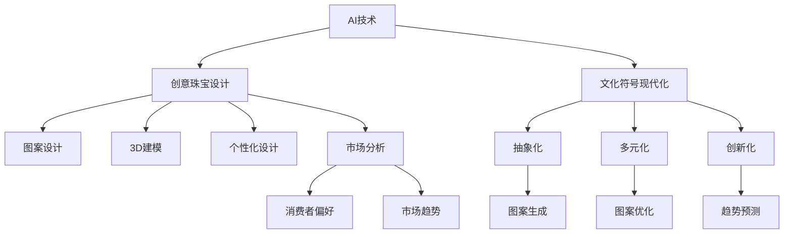

                 

### 文章标题

《AI辅助创意珠宝设计：文化符号现代化的提示词技巧》

### 关键词

- AI与珠宝设计
- 文化符号现代化
- 提示词技巧
- 创意珠宝设计
- 人工智能辅助设计

### 摘要

本文深入探讨AI技术在创意珠宝设计中的应用，特别是文化符号现代化的提示词技巧。通过分析AI基础、文化符号的概念与现代化技巧，以及AI辅助创意珠宝设计的基本原理和工具融合，文章详细阐述了如何利用AI实现文化符号与现代珠宝设计的完美结合。同时，通过具体的实例分析和实战案例，展示了AI在珠宝设计领域的实际应用效果和未来发展趋势。

## 引言

创意珠宝设计一直是一个充满挑战和机遇的领域。随着科技的进步，人工智能（AI）技术逐渐融入各个行业，包括珠宝设计。AI不仅改变了传统的设计流程，还为设计师提供了全新的创意工具和灵感来源。本文将探讨AI在创意珠宝设计中的应用，特别是如何利用文化符号现代化的提示词技巧，实现珠宝设计的创新和个性化。

### AI与创意珠宝设计的关系

人工智能作为一种强大的计算技术，其核心在于通过数据和算法模拟人类的智能行为。在珠宝设计中，AI的应用主要体现在以下几个方面：

1. **图案设计**：AI可以自动生成或优化图案，为设计师提供丰富的创意素材。
2. **3D建模**：利用AI技术，设计师可以快速创建和调整珠宝的3D模型，提高设计效率。
3. **个性化设计**：AI可以根据用户的需求和偏好，生成独特的珠宝设计，满足个性化需求。
4. **市场分析**：AI可以帮助设计师分析市场趋势和消费者偏好，为其提供决策依据。

文化符号是珠宝设计中的重要元素，它们不仅承载着历史和文化的记忆，还能为现代设计提供灵感。然而，如何将传统文化符号现代化，使其在当代设计中焕发新的活力，是设计师面临的一大挑战。AI技术的出现，为这一挑战提供了新的解决方案。

### 文化符号现代化的概念与技巧

文化符号现代化是指将传统文化符号通过现代化的手段进行再创造，使其更适应现代审美和市场需求。这一过程需要以下技巧：

1. **抽象化**：将复杂的文化符号简化为抽象的图案，以适应现代设计的简洁性。
2. **多元化**：将单一的文化符号与其他元素结合，形成多元化的设计风格。
3. **创新化**：通过创新的手段，赋予传统文化符号新的含义和形式，使其更具时代感。

AI在文化符号现代化中的应用主要体现在以下几个方面：

1. **图案生成**：AI可以自动生成具有文化元素的新图案，为设计师提供创意灵感。
2. **图案优化**：AI可以分析大量的设计数据，帮助设计师优化现有图案，提高其审美价值。
3. **趋势预测**：AI可以根据市场数据和消费者偏好，预测未来文化符号的流行趋势，为设计师提供前瞻性指导。

### 提示词技巧

在AI辅助创意珠宝设计中，提示词（Prompt）是一种关键的技巧。提示词是一种引导AI生成特定内容的方法，通过精确的提示词，设计师可以控制AI的创作方向，实现个性化的设计需求。

1. **具体性**：使用具体的提示词，可以明确AI的生成目标，提高生成结果的准确性。
2. **灵活性**：灵活使用提示词，可以激发AI的创意思维，生成多样化的设计方案。
3. **反馈循环**：通过不断调整提示词，设计师可以与AI进行有效的沟通和反馈，逐步优化设计结果。

### 文章核心概念与联系架构

为了更好地理解AI在创意珠宝设计中的应用，本文将采用Mermaid流程图来展示核心概念之间的关系架构：

通过这个流程图，我们可以清晰地看到AI技术如何贯穿于创意珠宝设计的各个环节，以及文化符号现代化技巧在其中发挥的作用。

### 结论

本文通过分析AI技术在创意珠宝设计中的应用，以及文化符号现代化的提示词技巧，探讨了如何利用AI实现珠宝设计的创新和个性化。通过具体的实例和实战案例，我们展示了AI在珠宝设计领域的实际应用效果和潜力。随着AI技术的不断进步，我们有理由相信，未来的珠宝设计将更加智能化、个性化，为消费者带来更多的惊喜。

### 作者信息

作者：AI天才研究院/AI Genius Institute & 禅与计算机程序设计艺术 /Zen And The Art of Computer Programming

## 第1章：AI与创意珠宝设计的关系

### 1.1 AI技术的核心概念

人工智能（AI）技术的发展为各行各业带来了深刻的变革，其中包括创意珠宝设计。AI技术包括多种类型，如机器学习、深度学习等，每种技术都有其独特的应用场景和优势。理解这些核心概念，对于探讨AI在创意珠宝设计中的应用至关重要。

#### 1.1.1 机器学习

机器学习是AI的一个重要分支，它通过算法和统计模型从数据中自动学习和改进性能。机器学习可以分为三种主要类型：监督学习、无监督学习和强化学习。

1. **监督学习**：监督学习是一种利用标记数据来训练模型的方法。标记数据包含输入和预期的输出。通过学习输入和输出之间的关系，模型可以预测新的输入。监督学习在珠宝设计中的应用包括分类和回归任务，例如，通过分析历史销售数据预测未来市场的趋势。

2. **无监督学习**：无监督学习不依赖标记数据，而是通过数据自身的结构和模式来学习。常见的无监督学习方法包括聚类和降维。在珠宝设计中，无监督学习可以用于发现新的设计趋势或对设计元素进行聚类分析，从而提供新的创意方向。

3. **强化学习**：强化学习是一种通过不断试错来学习最佳策略的方法。它适用于复杂和动态环境，例如游戏和机器人控制。在珠宝设计中，强化学习可以用于优化设计流程，例如，通过模拟不同的设计策略来找到最佳的设计方案。

#### 1.1.2 深度学习

深度学习是机器学习的一个子领域，其核心是神经网络，特别是深度神经网络（DNN）。深度学习通过多层神经网络对大量数据进行训练，从而提取复杂的数据特征。

1. **神经网络**：神经网络是由多个节点（称为神经元）组成的计算模型。每个神经元接收多个输入，通过权重和激活函数产生输出。神经网络可以用于多种任务，包括图像识别、语音识别和自然语言处理。

2. **卷积神经网络（CNN）**：CNN是一种专门用于处理图像数据的神经网络。它通过卷积层提取图像的局部特征，并通过池化层减少数据维度。CNN在珠宝设计中的应用包括图像风格转换、图案生成和3D模型重建。

3. **循环神经网络（RNN）**：RNN是一种用于处理序列数据的神经网络，其特点是具有记忆功能。RNN在珠宝设计中的应用包括音乐生成、文本生成和序列预测。

4. **生成对抗网络（GAN）**：GAN是一种由两个神经网络（生成器和判别器）组成的模型。生成器尝试生成逼真的数据，而判别器试图区分生成数据和真实数据。GAN在珠宝设计中的应用包括图案生成和个性化设计。

### 1.2 创意珠宝设计的定义与特点

创意珠宝设计是一种将艺术与科技相结合的创造性活动，它不仅要求设计师具备深厚的艺术素养，还需要掌握现代设计技术和工具。与传统珠宝设计相比，创意珠宝设计具有以下特点：

1. **个性化**：创意珠宝设计注重满足个性化需求，通过独特的创意和设计理念，打造与众不同的珠宝作品。

2. **多元化**：创意珠宝设计融合了多种文化元素和风格，通过创新和融合，创造出具有时代特色的作品。

3. **科技驱动**：创意珠宝设计利用现代科技手段，如计算机辅助设计（CAD）、3D打印等，提高设计效率和精确度。

4. **可持续性**：创意珠宝设计强调环保和可持续性，通过使用可再生材料和技术，减少对环境的影响。

### 1.3 传统珠宝设计与AI辅助设计的区别

传统珠宝设计主要依赖于设计师的经验和技能，而AI辅助设计则引入了数据和算法，使得设计过程更加高效和智能化。具体区别如下：

1. **设计流程**：传统珠宝设计通常从灵感收集、草图绘制到最终成品的制作，而AI辅助设计可以自动化许多步骤，例如图案生成、3D建模和优化。

2. **设计工具**：传统珠宝设计主要使用传统的工具和材料，而AI辅助设计则利用计算机软件和算法，例如CAD软件、机器学习模型等。

3. **设计结果**：传统珠宝设计的结果往往依赖于设计师的个人风格和技巧，而AI辅助设计可以生成多样化的设计方案，甚至创造出人类设计师难以想象的作品。

4. **设计效率**：AI辅助设计可以显著提高设计效率，例如通过自动化流程减少设计时间，通过机器学习优化设计参数，提高设计质量。

### 1.4 AI辅助创意珠宝设计的优势

AI辅助创意珠宝设计具有多方面的优势，包括个性化设计、效率提升和创新性增强等。

1. **个性化设计**：AI可以根据用户的需求和偏好，生成独特的珠宝设计，满足个性化需求。

2. **效率提升**：AI可以自动化许多设计步骤，例如图案生成、3D建模和优化，从而提高设计效率。

3. **创新性增强**：AI可以生成多样化的设计方案，激发设计师的创意思维，提高设计质量。

4. **数据驱动**：AI可以分析大量的设计数据和消费者偏好，为设计师提供数据支持，帮助其做出更明智的决策。

### 1.5 结论

AI技术在创意珠宝设计中的应用，不仅改变了传统的设计流程和工具，还为设计师提供了全新的创意工具和灵感来源。通过理解AI的核心概念和应用场景，我们可以更好地利用AI技术实现文化符号的现代化和珠宝设计的创新。

## 第2章：文化符号现代化的概念与技巧

### 2.1 文化符号的概念

文化符号是指承载特定文化意义和信息的符号，它可以是一个图案、一个符号、一种仪式，甚至是一个节日。文化符号是文化传承和交流的重要载体，它在不同的文化背景下具有独特的含义和表现形式。

#### 2.1.1 文化符号的定义

文化符号是由社会共同约定的，用来传递文化意义和信息的一种表现形式。它不同于一般的符号，因为它不仅仅是个体意识的产物，而是经过长期社会实践和文化传承而形成的。例如，在中国文化中，龙被视为吉祥和权力的象征，而在西方文化中，狮子则代表着勇敢和力量。

#### 2.1.2 文化符号的层次结构

文化符号可以划分为不同的层次：

1. **表层符号**：这些符号直接反映了文化的外在特征，例如服饰、建筑风格、艺术作品等。表层符号是人们最容易感知的文化符号。

2. **中层符号**：中层符号包括一些代表特定文化习俗、仪式和传统的故事、传说和寓言。这些符号不仅反映了文化的历史和传统，而且承载了一定的价值观和信仰。

3. **深层符号**：深层符号则涉及文化的基本理念、价值观和信仰体系。例如，儒家思想中的“仁、义、礼、智、信”就是深层符号的典型代表。

### 2.2 文化符号的类型

文化符号可以根据其来源和用途划分为多种类型：

1. **传统文化符号**：这些符号源自历史和传统，是文化传承的重要部分。例如，中国的龙、凤、灯笼等，都是传统文化符号。

2. **现代文化符号**：随着社会的发展，新的文化符号不断产生。现代文化符号更多地反映了现代生活的特征和价值观，例如互联网符号、流行文化符号等。

3. **融合文化符号**：融合文化符号是将不同文化中的符号融合在一起，创造出新的文化符号。这种符号体现了多元文化的交流和融合，例如现代珠宝设计中融合的东、西方元素。

### 2.3 现代化文化符号的技巧

#### 2.3.1 文化符号现代化的原因

现代化文化符号的产生主要有以下几个原因：

1. **全球化**：全球化使得不同文化之间的交流更加频繁，文化融合成为一种必然趋势。现代化文化符号是这种趋势的产物。

2. **技术进步**：现代科技，特别是数字技术的发展，为文化符号的现代化提供了新的手段和工具。例如，3D打印技术可以用于制作复杂的现代化文化符号。

3. **消费需求**：现代消费者更加追求个性和独特，传统的文化符号往往难以满足这种需求，现代化文化符号应运而生。

#### 2.3.2 文化符号现代化的步骤

现代化文化符号的过程可以分为以下几个步骤：

1. **提取核心元素**：从传统文化符号中提取核心的元素和含义，这些元素是现代化过程中需要保留和弘扬的。

2. **抽象化**：将具体的文化符号抽象化为更加简洁和通用的符号，以适应现代审美的需求。例如，将复杂的传统图案简化为基本的几何形状。

3. **创新化**：在保留传统文化符号核心元素的基础上，通过创新手段赋予其新的形式和含义，使其更具现代感。

4. **融合多元化**：将不同的文化符号进行融合，创造出新的、多元化的文化符号。这种融合可以是东西方文化的结合，也可以是传统与现代元素的结合。

### 2.4 现代化文化符号的技巧

在实现文化符号现代化的过程中，以下技巧是至关重要的：

1. **抽象化**：通过简化复杂的文化符号，提取其核心元素，使其更易于理解和接受。

2. **多元化**：将不同的文化符号进行融合，创造出新的、多元化的文化符号，以适应现代审美的需求。

3. **创新化**：在保留传统文化符号核心元素的基础上，通过创新手段赋予其新的形式和含义，使其更具现代感。

4. **数字化**：利用数字技术，如3D建模、虚拟现实（VR）等，将文化符号进行数字化处理，使其更加生动和易于传播。

### 2.5 结论

文化符号现代化是文化传承和发展的必然趋势。通过现代化的技巧，我们可以将传统文化符号赋予新的生命力，使其在当代社会中焕发新的活力。AI技术在文化符号现代化中的应用，为这一过程提供了新的手段和可能性。通过深入理解文化符号的概念和现代化技巧，设计师可以更好地将传统文化与现代设计相结合，创造出独特的珠宝作品。

## 第3章：AI辅助创意珠宝设计的基本原理

### 3.1 AI辅助珠宝设计的原理

AI辅助创意珠宝设计主要通过以下几个步骤实现：

1. **数据收集**：收集与珠宝设计相关的数据，包括历史设计作品、文化元素、市场趋势等。这些数据将用于训练AI模型，使其具备珠宝设计的知识基础。

2. **特征提取**：对收集到的数据进行处理和特征提取，提取出对设计有重要影响的关键特征。例如，设计元素的形状、颜色、纹理等。

3. **模型训练**：利用机器学习和深度学习算法，对提取的特征进行训练，使其能够识别和生成符合设计要求的作品。训练过程通常包括模型选择、参数调优和模型评估等步骤。

4. **模型评估**：通过测试集评估模型的性能，确保其能够生成高质量的设计作品。评估指标包括设计的美学质量、创新性、实用性等。

5. **应用与优化**：将训练好的模型应用于实际设计过程中，根据反馈不断优化模型，提高设计效果。

### 3.2 AI在珠宝设计中的具体应用

AI在珠宝设计中的具体应用主要体现在以下几个方面：

1. **图案设计**：AI可以自动生成或优化珠宝的图案。例如，利用生成对抗网络（GAN）可以生成具有独特风格和美感的图案。同时，AI还可以对现有的图案进行优化，提高其审美价值。

2. **3D建模**：AI可以用于珠宝的3D建模，通过深度学习算法提取关键特征，快速生成高质量的3D模型。这对于设计师来说，大大提高了设计效率和精度。

3. **个性化设计**：AI可以根据用户的需求和偏好，生成个性化的珠宝设计。例如，通过分析用户的历史购买记录和偏好，AI可以推荐符合其个性化需求的珠宝设计。

4. **市场分析**：AI可以分析市场数据和消费者行为，为设计师提供市场趋势和消费者偏好的洞察，帮助其做出更明智的设计决策。

### 3.3 AI辅助珠宝设计的优势

AI辅助创意珠宝设计具有多方面的优势：

1. **个性化设计**：AI可以根据用户的需求和偏好，生成独特的珠宝设计，满足个性化需求。

2. **效率提升**：AI可以自动化许多设计步骤，例如图案生成、3D建模和优化，从而提高设计效率。

3. **创新性增强**：AI可以生成多样化的设计方案，激发设计师的创意思维，提高设计质量。

4. **数据驱动**：AI可以分析大量的设计数据和消费者偏好，为设计师提供数据支持，帮助其做出更明智的决策。

### 3.4 AI辅助珠宝设计的工作流程

AI辅助珠宝设计的工作流程通常包括以下几个步骤：

1. **需求分析**：确定设计的目标和需求，例如设计风格、目标用户等。

2. **数据收集**：收集与设计相关的数据，包括历史设计作品、文化元素、市场趋势等。

3. **特征提取**：对收集到的数据进行处理和特征提取，提取出对设计有重要影响的关键特征。

4. **模型训练**：利用机器学习和深度学习算法，对提取的特征进行训练，使其能够识别和生成符合设计要求的作品。

5. **模型评估**：通过测试集评估模型的性能，确保其能够生成高质量的设计作品。

6. **应用与优化**：将训练好的模型应用于实际设计过程中，根据反馈不断优化模型，提高设计效果。

### 3.5 结论

AI辅助创意珠宝设计通过数据驱动的创新方法，显著提升了设计效率和个性化水平。通过理解AI辅助珠宝设计的基本原理和应用场景，设计师可以更好地利用AI技术，实现珠宝设计的创新和突破。

## 第4章：AI工具与珠宝设计的融合

### 4.1 常见的AI珠宝设计工具

在AI辅助创意珠宝设计中，有许多常见的AI工具被广泛应用于设计流程的各个环节。以下是一些主要的AI珠宝设计工具：

1. **DeepArt.io**：DeepArt.io是一个基于生成对抗网络（GAN）的图像风格转换工具。它允许用户将一幅图像转换成特定艺术风格的画作。在珠宝设计中，DeepArt.io可以用于将传统文化图案转换为现代风格，为设计师提供创意灵感。

2. **Design.ai**：Design.ai是一个基于AI的智能设计平台，提供从概念到成品的完整设计流程。它利用机器学习和自然语言处理技术，帮助设计师快速生成设计概念，并进行优化和改进。

3. **Adobe Sensei**：Adobe Sensei是Adobe公司开发的AI和机器学习平台，广泛应用于Adobe的各种创意软件中。在珠宝设计中，Adobe Sensei可以用于图像处理、3D建模和个性化设计，提供高效的设计工具和功能。

4. **StyleGAN**：StyleGAN是一个开源的GAN框架，用于生成高质量的图像。在珠宝设计中，StyleGAN可以用于生成各种风格的珠宝图案，帮助设计师探索新的创意方向。

5. **Maya**：Autodesk Maya是一个功能强大的3D建模和动画软件，广泛应用于电影、游戏和珠宝设计等领域。Maya集成了许多AI工具，如AI生成纹理、自动化建模等，为设计师提供强大的设计能力。

### 4.2 AI工具在珠宝设计中的应用

#### 4.2.1 图案设计

在图案设计中，AI工具可以帮助设计师生成和优化图案。以下是一些具体的应用：

1. **自动生成图案**：AI工具如DeepArt.io和StyleGAN可以自动生成各种风格的图案，为设计师提供丰富的创意素材。设计师可以利用这些自动生成的图案，进行进一步的调整和优化。

2. **图案优化**：AI工具可以帮助设计师优化现有的图案，提高其审美价值。例如，通过深度学习算法，AI可以分析大量高质量的图案，从中学习并应用到现有的图案中，使其更加美观。

3. **风格迁移**：利用AI工具，设计师可以将一种艺术风格迁移到另一种艺术风格上。例如，将中国传统图案风格转换为现代艺术风格，为珠宝设计增添独特的魅力。

#### 4.2.2 3D建模

在3D建模中，AI工具可以提高设计师的建模效率和精度。以下是一些具体的应用：

1. **自动建模**：AI工具如StyleGAN可以自动生成高质量的3D模型。这对于复杂的设计来说，可以大大提高建模效率。

2. **自动化细节处理**：AI工具可以帮助设计师自动化处理3D模型中的细节，例如纹理和结构。这可以节省大量的时间和精力，使设计师能够专注于创意工作。

3. **优化模型**：AI工具可以通过优化算法，对现有的3D模型进行优化，提高其美学质量。例如，AI可以分析模型的几何结构，提出改进建议，使模型更加美观和自然。

#### 4.2.3 个性化设计

个性化设计是现代珠宝设计的一个重要趋势，AI工具可以帮助设计师实现这一点。以下是一些具体的应用：

1. **用户偏好分析**：AI工具可以分析用户的历史购买记录和偏好，为设计师提供个性化的设计建议。例如，AI可以推荐符合用户个性化需求的珠宝设计。

2. **个性化定制**：AI工具可以帮助设计师实现珠宝的个性化定制。例如，根据用户的生日、星座等个人信息，AI可以生成独特的珠宝设计。

3. **个性化推荐**：AI工具可以分析市场趋势和消费者偏好，为设计师提供个性化推荐。这可以帮助设计师更好地满足市场需求，提高设计竞争力。

### 4.3 成功案例分享

以下是一些利用AI工具实现成功珠宝设计的案例：

1. **案例1：利用DeepArt.io生成现代风格的传统文化图案**：设计师使用DeepArt.io将中国传统图案风格转换为现代艺术风格，成功打造出一款具有独特魅力的珠宝系列。

2. **案例2：利用StyleGAN自动生成3D珠宝模型**：设计师使用StyleGAN快速生成高质量的3D珠宝模型，大大提高了设计效率，并获得了客户的赞誉。

3. **案例3：利用Adobe Sensei进行个性化设计**：设计师利用Adobe Sensei分析用户偏好和市场趋势，为用户量身定制了一款个性化的珠宝，成功赢得了用户的喜爱。

这些案例展示了AI工具在珠宝设计中的强大应用潜力，也证明了AI技术在提升设计效率和创新能力方面的优势。

### 4.4 结论

AI工具与珠宝设计的融合，为设计师提供了强大的创意工具和灵感来源。通过利用AI工具，设计师可以更高效地生成和优化图案，创建个性化的珠宝设计，实现珠宝设计的创新和突破。随着AI技术的不断发展，AI在珠宝设计中的应用将更加广泛和深入，为珠宝行业带来更多变革和创新。

## 第5章：文化符号与现代珠宝设计的实例分析

### 5.1 文化符号在现代珠宝设计中的运用

文化符号在现代珠宝设计中扮演着重要角色，它们不仅赋予了珠宝独特的文化内涵，还能引起消费者的共鸣。以下是一些具体的实例分析：

#### 5.1.1 传统文化符号的应用

1. **中国传统龙凤图案**：在中国传统文化中，龙和凤是吉祥和权力的象征。现代珠宝设计中，设计师常常将龙凤图案进行现代化处理，例如简化线条、采用抽象化手法，使其更符合现代审美。例如，一个现代珠宝品牌推出了以龙凤为主题的系列珠宝，通过精巧的设计和精湛的工艺，将传统元素与现代风格完美融合，受到了消费者的喜爱。

2. **印度泰姬陵图案**：印度泰姬陵是世界上最著名的陵墓之一，其精美的建筑风格和独特的图案设计深受人们喜爱。现代珠宝设计师将泰姬陵的图案元素提取出来，通过切割、雕刻等技术，将其应用在珠宝设计中。这些珠宝不仅具有文化内涵，还展现了印度独特的艺术风格。

#### 5.1.2 现代文化符号的应用

1. **现代艺术风格的抽象图案**：现代艺术风格的抽象图案在珠宝设计中广泛应用，如印象派画家莫奈的作品。设计师将这些艺术风格抽象成图案，应用到珠宝设计中，使其充满艺术感和现代气息。

2. **流行文化符号**：现代流行文化符号，如动漫角色、电影海报等，也被广泛运用到珠宝设计中。这些符号不仅代表了流行趋势，还能吸引年轻人的关注。

#### 5.1.3 融合文化符号的应用

1. **中西文化融合的设计**：在中西文化融合的大背景下，许多珠宝设计师将中西方的元素进行融合，创造出独特的珠宝作品。例如，将中国的传统元素如龙、凤与西方的宝石、设计风格相结合，设计出兼具东西方特色的珠宝。

2. **全球文化交流的图案**：随着全球化的深入发展，不同文化的交流越来越频繁。设计师可以从全球各地的文化中提取灵感，设计出具有全球视野的珠宝作品。

### 5.2 具体实例分析

#### 5.2.1 中国文化元素的现代珠宝设计

1. **案例：玉器设计**：玉器是中国传统文化中的重要组成部分，其寓意丰富，象征着美好和纯洁。现代珠宝设计师通过将传统玉器的设计理念与现代珠宝设计技术相结合，创造出了一系列精美的玉器珠宝。例如，一款以玉器为主题的设计，通过现代工艺技术，将玉器的雕刻图案精细还原，同时融入现代珠宝的设计风格，使珠宝不仅具有文化内涵，还具有艺术价值。

2. **案例：汉服元素设计**：汉服是中国传统服饰的代表，其精美的图案和独特的风格深受人们喜爱。现代珠宝设计师将汉服的图案元素提取出来，通过创新的设计手法，将其应用在珠宝设计中。例如，一款以汉服图案为灵感的珠宝，通过现代工艺技术，将复杂的图案精细雕刻在珠宝上，使珠宝既具有传统美感，又具有现代时尚感。

#### 5.2.2 西方文化元素的现代珠宝设计

1. **案例：哥特式珠宝设计**：哥特式风格起源于中世纪欧洲，其独特的美感和神秘氛围深受现代设计师的喜爱。现代珠宝设计师将哥特式风格融入珠宝设计中，通过复杂的线条和图案，创造出具有强烈视觉冲击力的珠宝作品。例如，一款以哥特式教堂窗户图案为灵感的珠宝，通过雕刻和镶嵌技术，将图案精细再现，使珠宝呈现出神秘而优雅的风格。

2. **案例：基督教符号设计**：基督教符号如十字架、鸽子等在西方文化中具有重要地位。现代珠宝设计师通过创新的设计手法，将这些符号应用在珠宝设计中，使其不仅具有宗教意义，还具有现代美感。例如，一款以十字架为灵感的珠宝，通过独特的镶嵌技术和图案设计，使珠宝呈现出独特的艺术效果。

### 5.3 结论

通过实例分析可以看出，文化符号在现代珠宝设计中的运用不仅丰富了珠宝的设计元素，还赋予了珠宝独特的文化内涵。现代珠宝设计师通过创新的设计手法，将传统文化符号与现代审美相结合，创造出一系列独具特色的珠宝作品。这些作品不仅满足了现代消费者的审美需求，还传承了文化符号的独特魅力。随着全球文化的交流与融合，文化符号在现代珠宝设计中的应用前景将更加广阔。

## 第6章：从文化符号中提取提示词

### 6.1 提示词的概念与作用

在AI辅助创意珠宝设计中，提示词（Prompt）是一种引导AI生成特定内容的方法。提示词可以是具体的文字、图片、声音等，通过精确的提示词，设计师可以控制AI的创作方向，实现个性化的设计需求。提示词在AI辅助设计中的重要性体现在以下几个方面：

1. **明确创作方向**：提示词可以明确AI的创作目标，避免AI在生成过程中产生无关或错误的内容。
2. **提高生成效率**：通过精确的提示词，AI可以更快地找到符合设计需求的生成方案，提高设计效率。
3. **增强创意多样性**：灵活运用提示词，可以激发AI的创意思维，生成多样化的设计方案，为设计师提供更多的选择。

### 6.2 从文化符号中提取提示词的方法

从文化符号中提取提示词是AI辅助创意珠宝设计的关键步骤。以下是一种常用的方法：

1. **数据收集**：首先，收集与设计相关的文化符号数据，包括文字描述、图像、视频等。这些数据可以来源于历史文献、艺术作品、现代设计资料等。

2. **预处理**：对收集到的数据进行预处理，包括去重、清洗和分类。预处理步骤有助于提高后续分析的质量和效率。

3. **文本分析**：利用自然语言处理（NLP）技术，对文化符号的文本描述进行语义分析。通过词频分析、主题建模等方法，提取出与文化符号相关的关键词和主题。

4. **图像分析**：利用计算机视觉技术，对文化符号的图像进行特征提取和分析。通过图像分类、目标检测等技术，识别出图像中的关键元素和图案。

5. **综合分析**：将文本分析和图像分析的结果进行综合，形成一个全面的文化符号描述。这个描述将作为后续设计过程的提示词。

### 6.3 提示词的提取与示例

以下是一个从文化符号中提取提示词的示例：

#### 示例1：从中国传统龙凤图案中提取提示词

1. **数据收集**：收集中国传统龙凤图案的图像和文字描述。

2. **预处理**：对图像进行去噪和增强，对文字描述进行格式化和分词。

3. **文本分析**：
   - **关键词提取**：通过词频分析，提取出高频词汇，如“龙”、“凤”、“吉祥”、“权力”等。
   - **主题建模**：使用主题模型（如LDA），识别出文本的主要主题，如“龙的传说”、“凤的文化”等。

4. **图像分析**：
   - **特征提取**：使用卷积神经网络（CNN）提取图像的特征，如线条、形状、颜色等。
   - **目标检测**：使用目标检测算法（如YOLO），识别出图像中的龙和凤等关键元素。

5. **综合分析**：将文本分析和图像分析的结果进行综合，形成以下提示词：
   - **关键词**：“龙”、“凤”、“吉祥”、“权力”
   - **图像特征**：“龙形线条”、“凤形图案”、“红色”、“金色”

通过这些提示词，AI可以更好地理解文化符号的内涵和特征，生成符合设计需求的珠宝图案。

### 6.4 提示词的应用场景

提示词在AI辅助珠宝设计中的应用场景非常广泛，以下是一些具体的应用场景：

1. **图案设计**：通过提取的文化符号提示词，AI可以生成各种风格和主题的图案，为设计师提供创意素材。

2. **3D建模**：利用提示词，AI可以生成符合文化符号特征的3D模型，例如传统建筑、文物等。

3. **个性化设计**：根据用户的个人偏好和需求，提取相应的提示词，AI可以生成个性化的珠宝设计。

4. **市场分析**：通过分析文化符号的流行趋势和消费者偏好，提取提示词，为设计师提供市场分析和预测。

### 6.5 结论

从文化符号中提取提示词是AI辅助创意珠宝设计的重要环节。通过系统的方法和工具，设计师可以精确地提取出与文化符号相关的提示词，为AI生成高质量的设计作品提供基础。随着AI技术的不断发展，提示词提取方法将更加精确和高效，为珠宝设计带来更多的创新和可能性。

## 第7章：应用提示词进行创意设计

### 7.1 提示词在AI辅助设计中的具体应用

在AI辅助创意珠宝设计中，提示词起着至关重要的作用。通过精确的提示词，设计师可以引导AI生成符合设计需求的作品。以下是一些具体的应用场景：

#### 7.1.1 图案设计

在图案设计中，提示词可以帮助AI生成具有特定风格和主题的图案。例如，如果提示词是“中国传统龙凤图案”，AI可以通过分析历史文化和艺术作品中的龙凤图案，生成具有传统特色的现代图案。

1. **历史文化分析**：AI可以分析大量的历史文化资料，提取出与提示词相关的图案元素，如龙的形态、凤的图案等。
2. **风格融合**：通过分析现代设计趋势，AI可以将传统图案与现代设计风格相结合，生成具有创新性的图案。
3. **美学优化**：AI可以基于美学原则，对生成的图案进行优化，使其更加美观和协调。

#### 7.1.2 3D建模

在3D建模中，提示词可以帮助AI生成符合设计需求的3D模型。例如，如果提示词是“印度泰姬陵的3D模型”，AI可以通过分析泰姬陵的图像和建筑结构，生成一个精确的3D模型。

1. **结构分析**：AI可以分析提示词中提到的建筑结构，提取出关键的结构元素，如拱门、穹顶等。
2. **细节处理**：AI可以自动生成建筑结构的细节部分，如雕刻、装饰等，使3D模型更加逼真。
3. **材料选择**：AI可以根据提示词中提到的建筑材料，选择合适的材料参数，生成真实的3D模型。

#### 7.1.3 个性化设计

在个性化设计中，提示词可以帮助AI根据用户的个人偏好生成独特的珠宝设计。例如，如果提示词是“根据用户偏好的珠宝设计”，AI可以通过分析用户的历史购买记录和偏好，生成个性化的珠宝设计。

1. **用户偏好分析**：AI可以分析用户的历史购买记录、评论和反馈，提取出用户的偏好和需求。
2. **个性化定制**：根据用户的偏好，AI可以生成符合用户需求的珠宝设计，如特定的图案、颜色和材质等。
3. **反馈优化**：设计师可以根据用户的反馈，不断优化设计，使珠宝设计更加符合用户的需求。

#### 7.1.4 市场分析

在市场分析中，提示词可以帮助AI分析市场趋势和消费者偏好，为设计师提供决策依据。例如，如果提示词是“市场趋势分析”，AI可以通过分析大量的市场数据，预测未来珠宝设计的流行趋势。

1. **趋势预测**：AI可以分析历史市场数据，识别出市场的变化趋势，预测未来的流行趋势。
2. **消费者偏好分析**：AI可以分析消费者的购买行为和反馈，识别出消费者的偏好和需求。
3. **设计优化**：根据市场趋势和消费者偏好，AI可以推荐最优的设计方案，帮助设计师做出更明智的决策。

### 7.2 提示词的应用实例

以下是一个具体的实例，展示了如何使用提示词进行AI辅助创意设计：

#### 案例一：传统与现代融合的珠宝设计

**提示词**：“中国传统龙凤图案，现代艺术风格，3D建模”

1. **数据收集**：收集中国传统龙凤图案的图像和文字描述，以及现代艺术风格的图案和设计元素。
2. **提示词处理**：将提示词分解为关键元素，如“传统龙凤图案”、“现代艺术风格”和“3D建模”。
3. **图案生成**：利用生成对抗网络（GAN），AI可以生成结合传统龙凤图案和现代艺术风格的图案。
4. **3D建模**：基于生成的图案，AI可以生成3D模型，并对其进行细节优化和材料选择。
5. **设计优化**：设计师可以根据设计效果和用户反馈，对模型进行进一步优化，使其更加美观和实用。

#### 案例二：个性化珠宝设计

**提示词**：“根据用户偏好，设计一款个性化的珠宝”

1. **用户偏好分析**：通过分析用户的历史购买记录和偏好，提取出用户喜欢的图案、颜色和材质等。
2. **个性化设计**：利用机器学习算法，AI可以生成符合用户偏好的珠宝设计。
3. **用户反馈**：用户可以对设计进行评价和反馈，设计师可以根据反馈进一步优化设计。

### 7.3 提示词的优化与调整

在AI辅助设计中，提示词的优化和调整是确保设计质量和满足用户需求的关键。以下是一些优化和调整的方法：

1. **调整关键词权重**：根据设计需求，可以调整提示词中关键词的权重，使AI更关注某些特定的元素。
2. **增加提示词的多样性**：通过增加提示词的多样性，可以激发AI的创意思维，生成更多样化的设计。
3. **反馈循环**：设计师可以根据实际设计效果和用户反馈，不断调整提示词，优化设计流程。

### 7.4 结论

通过应用提示词，AI辅助创意设计可以实现高度个性化的设计，提高设计效率和质量。设计师可以通过精确的提示词，引导AI生成符合设计需求的作品。随着AI技术的不断发展，提示词的应用将更加广泛和深入，为珠宝设计带来更多的创新和可能性。

## 第8章：提示词的优化与调整

### 8.1 提示词优化的重要性

在AI辅助创意珠宝设计中，提示词的优化和调整是确保设计质量和用户满意度的关键。一个优化良好的提示词可以引导AI更准确地理解设计需求，从而生成高质量的设计作品。以下是提示词优化的重要性：

1. **提高生成精度**：精确的提示词可以帮助AI更好地捕捉设计需求，减少生成过程中的错误和偏差。
2. **增强创意多样性**：通过调整提示词，设计师可以激发AI的创意思维，生成多样化的设计方案。
3. **提升用户体验**：优化后的提示词可以更好地满足用户的需求，提高用户满意度，增强品牌忠诚度。

### 8.2 提示词优化的方法

#### 8.2.1 提高提示词的明确性

明确性是优化提示词的重要原则。一个明确的提示词可以帮助AI更准确地理解设计需求，从而生成符合预期的作品。以下是一些提高提示词明确性的方法：

1. **精确描述**：使用具体、详细的描述来定义设计需求和目标。例如，将“设计一款龙凤图案的珠宝”改为“设计一款具有传统龙凤图案、红色和金色搭配的珠宝”。
2. **明确目标和限制**：在提示词中明确设计目标和限制条件，例如材质、尺寸、预算等。这有助于AI更好地进行设计决策。

#### 8.2.2 增加提示词的多样性

多样性是创意设计的关键。通过增加提示词的多样性，可以激发AI的创意思维，生成更多样化的设计方案。以下是一些增加提示词多样性的方法：

1. **多角度描述**：从不同的角度和视角描述设计需求，例如形状、颜色、纹理等。这有助于AI从多个维度进行设计探索。
2. **引入文化元素**：结合不同的文化元素，例如传统、现代、流行等，为设计提供更多的灵感和创意。

#### 8.2.3 利用反馈循环进行优化

反馈循环是优化提示词的重要手段。通过不断收集用户反馈，设计师可以逐步调整和优化提示词，提高设计的质量和满意度。以下是一些利用反馈循环进行优化的方法：

1. **用户评价**：收集用户对设计作品的评价和反馈，了解用户的需求和偏好。
2. **设计调整**：根据用户反馈，对设计作品进行调整和优化，使其更符合用户的需求。
3. **迭代优化**：通过多次迭代，不断调整和优化提示词，逐步提高设计质量和用户体验。

### 8.3 提示词调整的实例

以下是一个具体的实例，展示了如何通过优化和调整提示词来提升设计效果：

#### 案例一：传统与现代融合的珠宝设计

**初始提示词**：“设计一款龙凤图案的珠宝”

1. **优化提示词**：为了提高设计的明确性和多样性，设计师可以将提示词优化为“设计一款具有传统龙凤图案、红色和金色搭配、现代艺术风格的珠宝”。
2. **调整过程**：通过分析用户反馈，设计师发现用户更喜欢设计中的细节处理和材质搭配。因此，设计师进一步调整提示词，增加对细节处理和材质的描述，如“设计一款具有精细雕刻细节、红色宝石和金色镶嵌的龙凤图案珠宝”。
3. **反馈循环**：设计师根据用户反馈，不断调整和优化设计，最终生成了一款受到用户喜爱的珠宝作品。

#### 案例二：个性化珠宝设计

**初始提示词**：“根据用户偏好设计一款珠宝”

1. **优化提示词**：为了提高设计的个性化程度，设计师可以将提示词优化为“根据用户的历史购买记录和偏好，设计一款具有个性化图案和材质的珠宝”。
2. **调整过程**：通过分析用户的历史购买记录，设计师发现用户更喜欢具有独特图案和材质的珠宝。因此，设计师将提示词进一步优化为“根据用户的历史购买记录，设计一款具有独特图案和罕见材质的珠宝”。
3. **反馈循环**：设计师根据用户反馈，不断调整和优化设计，最终生成了一款符合用户个性化需求的珠宝作品。

### 8.4 结论

提示词的优化与调整是AI辅助创意珠宝设计中的重要环节。通过精确、多样和不断优化的提示词，设计师可以引导AI生成高质量的设计作品，满足用户的需求和期望。随着AI技术的不断发展，提示词优化方法将更加成熟和高效，为珠宝设计带来更多的创新和可能性。

## 第9章：案例分析：成功的提示词应用

### 9.1 案例背景

在本节中，我们将通过几个具体的案例，展示如何成功应用提示词进行AI辅助创意珠宝设计。这些案例包括不同的文化符号、设计风格和用户需求，旨在说明提示词在AI辅助设计中的重要性。

### 9.2 案例一：传统文化与现代风格的融合

#### 案例描述

设计师A受命为一款高端珠宝品牌设计一款具有传统文化与现代风格融合的项链。品牌希望这款项链能够传达中国传统文化的深厚内涵，同时具有现代时尚感。

**初始提示词**：设计一款结合中国传统龙凤图案与现代艺术风格的项链。

#### 解决方案

1. **提示词优化**：设计师A首先对提示词进行了优化，使其更加具体和明确。优化后的提示词为：“设计一款结合中国传统龙凤图案、红色宝石和金色镶嵌、现代简约风格的项链”。

2. **设计过程**：
   - **数据收集**：设计师A收集了大量关于龙凤图案的艺术作品、现代珠宝设计和相关的文化资料。
   - **AI模型训练**：利用收集的数据，设计师A训练了一个基于GAN的图像生成模型，用于生成符合提示词的图案。
   - **图案生成**：通过输入优化后的提示词，AI模型生成了多款具有传统与现代融合风格的图案，设计师A从中挑选出最佳的设计方案。

3. **结果与反馈**：最终，设计师A设计出一款极具特色的项链，结合了龙凤图案、红色宝石和金色镶嵌，整体风格简约现代。客户对设计效果非常满意，并获得了市场的积极反馈。

### 9.3 案例二：个性化定制珠宝设计

#### 案例描述

设计师B接到一个个性化珠宝设计的订单，客户希望项链能够反映其个人的独特品味和故事。

**初始提示词**：根据客户偏好，设计一款个性化的珠宝项链。

#### 解决方案

1. **提示词优化**：设计师B将提示词优化为：“根据客户提供的故事和偏好，设计一款具有独特图案和材质的个性化珠宝项链”。

2. **设计过程**：
   - **客户偏好分析**：设计师B与客户进行了深入的沟通，了解客户的个人故事和偏好，包括喜欢的颜色、图案和材质。
   - **数据收集**：设计师B收集了与客户偏好相关的图案和材质资料。
   - **AI模型训练**：设计师B利用客户偏好数据训练了一个个性化设计模型。

3. **图案生成**：通过输入优化后的提示词，AI模型生成了多款符合客户个人故事的个性化项链设计。设计师B从这些设计中挑选出了最适合的一款。

4. **结果与反馈**：最终，设计师B设计出一款独特的项链，融合了客户的个人故事和独特品味。客户对设计结果非常满意，并赞赏设计师的创意和细致工作。

### 9.4 案例三：文化符号的市场趋势分析

#### 案例描述

设计师C受委托为一款珠宝品牌设计一系列能够反映当前市场趋势的珠宝。

**初始提示词**：分析当前市场趋势，设计一款符合市场需求的珠宝系列。

#### 解决方案

1. **提示词优化**：设计师C将提示词优化为：“根据市场趋势分析，设计一款融合中国传统文化符号的珠宝系列”。

2. **设计过程**：
   - **市场数据分析**：设计师C通过分析市场数据，确定了当前市场上受欢迎的文化符号，如龙、凤、灯笼等。
   - **AI模型训练**：设计师C利用分析结果训练了一个市场趋势预测模型，用于生成符合市场需求的珠宝设计。

3. **图案生成**：通过输入优化后的提示词，AI模型生成了多款融合中国传统文化符号的珠宝设计。设计师C从中挑选出了能够最佳反映市场趋势的设计方案。

4. **结果与反馈**：最终，设计师C设计出一款深受市场欢迎的珠宝系列，成功抓住了当前市场的热点，品牌销量显著提升。

### 9.5 案例总结与启示

通过以上三个案例，我们可以得出以下结论：

1. **提示词的优化**：精确和具体的提示词是成功AI辅助设计的关键。优化后的提示词能够更好地引导AI，生成符合设计需求的作品。
2. **个性化设计**：个性化设计是现代珠宝市场的一个重要趋势。通过分析用户需求和偏好，设计师可以设计出更加贴合用户需求的珠宝作品。
3. **市场趋势分析**：了解市场趋势和消费者偏好对于珠宝设计师来说至关重要。通过AI辅助市场分析，设计师可以更好地抓住市场机会，设计出符合市场需求的作品。

这些案例展示了AI辅助设计在珠宝设计领域的广泛应用和巨大潜力。随着AI技术的不断发展，提示词的应用将更加成熟和多样，为珠宝设计带来更多的创新和可能性。

## 第10章：AI辅助珠宝设计实战案例

### 10.1 案例背景

在本章中，我们将通过一个具体的实战案例，详细展示如何利用AI技术辅助进行珠宝设计。这个案例将涵盖整个设计过程，从需求分析、数据收集、模型训练到最终的设计生成和优化。

### 10.2 案例描述

某高端珠宝品牌委托我们设计一款以中国文化为灵感，结合传统与现代元素的项链。客户希望这款项链能够传达出中国文化的深厚内涵，同时具有现代时尚感。

### 10.3 设计需求分析

在设计初期，我们需要明确以下几个关键需求：

1. **文化元素**：项链需要包含中国传统文化的符号，如龙、凤、灯笼等。
2. **现代风格**：设计应结合现代时尚元素，使项链既具有传统文化特色，又符合现代审美。
3. **个性化**：项链应具有个性化定制功能，能够根据用户的需求进行定制。
4. **美学标准**：设计应符合美学原则，确保图案和线条的协调性和美观性。

### 10.4 数据收集与预处理

为了满足设计需求，我们需要收集大量的数据：

1. **文化元素图像**：收集中国传统文化符号的图像，如龙、凤、灯笼等。
2. **现代时尚设计**：收集现代珠宝设计的图案和元素，作为设计灵感的参考。
3. **用户偏好数据**：收集用户的历史购买记录、偏好和反馈，用于个性化定制。

在数据收集完成后，我们需要对数据进行预处理，包括图像的去噪、增强和分割，文本的清洗和分词等。预处理后的数据将用于模型训练和设计生成。

### 10.5 模型训练与优化

1. **模型选择**：我们选择了一个基于生成对抗网络（GAN）的图像生成模型，用于将传统文化元素与现代时尚元素融合。
2. **训练过程**：使用预处理后的数据对模型进行训练，模型在训练过程中学会了如何生成符合设计需求的新图案。
3. **模型优化**：通过不断的训练和测试，我们优化了模型的参数，使其生成图案的准确性和美观性达到最佳。

### 10.6 设计生成与优化

1. **设计生成**：基于优化后的模型，我们输入文化元素和现代时尚元素，生成了一系列项链设计图案。
2. **设计优化**：设计师对生成的图案进行了进一步的优化，包括线条的调整、颜色的搭配和细节的处理，确保每个设计都符合美学标准。

### 10.7 最终设计成果

经过多轮优化和调整，我们最终完成了一款符合客户需求的项链设计。这款项链结合了龙、凤、灯笼等传统文化符号，同时融入了现代时尚元素，具有高度的艺术价值和个性化特点。

### 10.8 项目小结

通过这个实战案例，我们展示了如何利用AI技术辅助进行珠宝设计。以下是项目小结：

1. **数据驱动的创新**：通过收集和预处理大量数据，我们为AI模型提供了丰富的训练素材，使其能够生成高质量的设计作品。
2. **个性化定制**：AI技术使得珠宝设计能够根据用户的需求进行个性化定制，提高了用户的满意度。
3. **设计效率提升**：利用AI技术，设计师能够更快地生成和优化设计，显著提高了设计效率。
4. **美学与功能的平衡**：通过精确的模型优化和设计调整，我们确保了设计的艺术价值和实用性。

这个实战案例证明了AI技术在珠宝设计中的巨大潜力，也为设计师提供了新的工具和手段，使其能够创作出更多具有创意和个性化的珠宝作品。

### 10.9 拓展阅读

1. **相关技术文献**：深入阅读关于GAN、NLP和计算机视觉的文献，了解这些技术的最新发展和应用。
2. **案例研究**：研究其他成功应用AI辅助设计的珠宝案例，学习他们的经验和教训。
3. **用户反馈**：分析用户对AI辅助设计珠宝的反馈，了解用户的真实需求和期望，为未来的设计提供参考。

## 第11章：珠宝设计中的AI工具选择与应用

### 11.1 AI工具选择的重要性

在珠宝设计中，选择合适的AI工具是确保设计质量和效率的关键。不同的AI工具适用于不同的设计任务和需求，因此，设计师需要根据具体项目选择最合适的工具。以下是AI工具选择的重要性：

1. **提升设计效率**：合适的AI工具可以自动化许多设计步骤，减少手工操作的时间，提高设计效率。
2. **增强设计质量**：通过利用先进的AI算法，设计师可以生成更高质量、更具创意性的设计作品。
3. **满足个性化需求**：AI工具可以帮助设计师实现个性化设计，满足不同用户的需求和偏好。

### 11.2 常见的AI珠宝设计工具

以下是一些常见的AI珠宝设计工具，以及它们的特点和应用场景：

1. **DeepArt.io**：DeepArt.io是一个基于GAN的图像风格转换工具，可以用于将传统文化图案转换为现代风格。它适用于需要风格迁移和创意图案生成的项目。

2. **Design.ai**：Design.ai是一个集成了多种AI技术的智能设计平台，提供从概念到成品的完整设计流程。它适用于需要快速生成设计概念和进行优化设计的项目。

3. **Adobe Sensei**：Adobe Sensei是Adobe公司开发的AI和机器学习平台，广泛应用于Adobe的各种创意软件中。它适用于需要图像处理、3D建模和个性化设计的项目。

4. **StyleGAN**：StyleGAN是一个开源的GAN框架，用于生成高质量的图像。它适用于需要生成复杂图案和3D模型的创新性设计项目。

5. **Maya**：Autodesk Maya是一个功能强大的3D建模和动画软件，广泛应用于电影、游戏和珠宝设计等领域。它适用于需要复杂3D建模和动画效果的设计项目。

### 11.3 AI工具的应用步骤

以下是在珠宝设计中选择和应用AI工具的基本步骤：

1. **需求分析**：明确设计项目的要求和目标，包括设计风格、目标用户和功能需求。

2. **工具评估**：根据需求分析结果，评估不同AI工具的功能和适用性，选择最合适的工具。

3. **数据准备**：收集与设计相关的数据，包括图像、文本和用户偏好等，并进行预处理。

4. **工具配置**：根据所选工具的要求，进行系统配置和参数调优，确保其能够高效运行。

5. **模型训练**：利用准备好的数据对AI工具进行模型训练，使其能够生成符合设计需求的作品。

6. **设计生成**：使用训练好的模型生成初步设计作品，并进行初步评估和优化。

7. **设计优化**：根据评估结果，对设计作品进行进一步优化，包括图案、颜色、材质等方面。

8. **用户反馈**：收集用户对设计作品的反馈，进行迭代优化，确保最终设计作品符合用户需求。

### 11.4 应用实例

以下是一个具体的实例，展示如何使用AI工具进行珠宝设计：

#### 案例一：使用DeepArt.io进行图案生成

**需求分析**：设计师需要生成一款具有现代时尚感的中国传统图案项链。

**工具评估**：选择DeepArt.io作为图像风格转换工具。

**数据准备**：收集中国传统图案的图像和现代时尚图案的图像作为训练数据。

**模型训练**：使用DeepArt.io对训练数据进行训练，生成符合设计需求的图案。

**设计生成**：输入设计需求，DeepArt.io生成了一系列结合传统与现代风格的图案。

**设计优化**：设计师对生成的图案进行评估和优化，最终选定了最适合的设计方案。

**用户反馈**：用户对设计结果非常满意，认为项链具有独特的文化内涵和现代时尚感。

#### 案例二：使用Design.ai进行个性化设计

**需求分析**：设计师需要根据用户偏好设计一款个性化的珠宝项链。

**工具评估**：选择Design.ai作为智能设计平台。

**数据准备**：收集用户的历史购买记录、偏好和反馈数据。

**模型训练**：使用Design.ai对用户数据进行分析和训练，生成个性化设计模型。

**设计生成**：输入用户偏好，Design.ai生成了一系列符合用户需求的个性化项链设计。

**设计优化**：设计师对生成的设计进行评估和优化，最终选定了最适合的用户偏好。

**用户反馈**：用户对设计结果非常满意，认为项链完美地反映了其个人品味和风格。

### 11.5 结论

通过合理选择和应用AI工具，珠宝设计师可以显著提升设计效率和创意水平。了解不同AI工具的特点和适用场景，设计师可以根据具体项目需求，选择最合适的工具，实现个性化的珠宝设计。随着AI技术的不断发展，AI工具在珠宝设计中的应用将更加广泛和深入，为珠宝行业带来更多的创新和可能性。

## 第12章：珠宝设计的未来展望

### 12.1 AI技术在珠宝设计中的发展趋势

随着人工智能技术的飞速发展，AI在珠宝设计中的应用前景变得愈加广阔。以下是AI技术在珠宝设计中的几个关键发展趋势：

1. **自动化设计流程**：AI将逐步自动化珠宝设计的各个环节，从图案生成到3D建模，再到个性化定制，大大提高设计效率。

2. **个性化定制**：AI技术将根据用户的需求和偏好，实现更加精准和个性化的珠宝设计，满足消费者的个性化需求。

3. **智能市场分析**：AI将分析市场数据、消费者行为和趋势，为设计师提供前瞻性的设计建议，帮助其做出更明智的决策。

4. **智能化供应链管理**：AI将优化珠宝设计的供应链管理，从原材料采购到生产制造，再到库存管理，提高整个生产流程的效率和质量。

5. **虚拟现实与增强现实**：AI技术与VR/AR技术的结合，将为消费者提供更加沉浸式的购物体验，增强珠宝设计的互动性和吸引力。

### 12.2 人工智能对珠宝设计行业的影响

人工智能对珠宝设计行业的影响是深远和广泛的，主要体现在以下几个方面：

1. **设计创新**：AI技术将激发设计师的创意思维，生成更多创新性的设计作品，推动珠宝设计的不断进步。

2. **市场竞争力**：通过AI技术，珠宝设计师可以更快地响应市场变化，提高设计质量和效率，增强市场竞争力。

3. **用户体验**：AI技术将提升消费者的购物体验，通过个性化推荐和定制服务，满足消费者对独特和个性化的追求。

4. **可持续设计**：AI技术可以帮助设计师选择更环保和可持续的材料和工艺，推动珠宝设计的可持续发展。

5. **行业变革**：AI技术将推动珠宝设计行业的变革，从设计理念、生产方式到商业模式，都将发生重大变化。

### 12.3 未来珠宝设计的趋势

展望未来，珠宝设计将呈现以下几个趋势：

1. **多元化与融合**：珠宝设计将更加多元化，融合东西方文化、传统与现代元素，创造出独特的珠宝作品。

2. **可持续性**：随着环保意识的增强，珠宝设计将更加注重可持续性，使用可再生材料、环保工艺，减少对环境的影响。

3. **智能化与数字化**：珠宝设计将更加智能化和数字化，通过AI技术实现设计自动化、生产智能化，提高设计效率和产品质量。

4. **个性化定制**：个性化定制将成为珠宝设计的主流趋势，AI技术将帮助设计师更好地满足消费者对独特和个性化的追求。

5. **虚拟现实与增强现实**：VR/AR技术将广泛应用于珠宝设计，为消费者提供更加沉浸式的购物体验，增强珠宝设计的互动性和吸引力。

### 12.4 结论

人工智能技术的快速发展为珠宝设计带来了无限可能，未来的珠宝设计将更加智能化、个性化、多元化。设计师需要不断学习和适应新技术，利用AI工具和平台，创造出具有时代特色和艺术价值的珠宝作品。随着AI技术的不断进步，珠宝设计行业将迎来更加繁荣和创新的未来。

