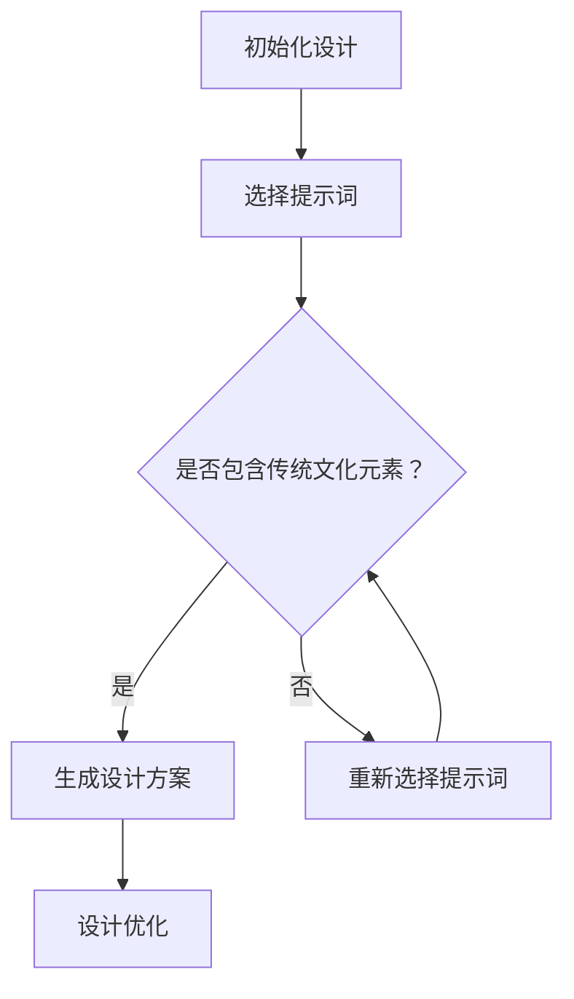

                 

### 文章标题

# AI辅助创意珠宝设计：文化符号融合的提示词技巧

### 文章关键词

- AI辅助珠宝设计
- 文化符号融合
- 提示词技巧
- 创意设计
- 珠宝设计工具

### 文章摘要

本文将探讨如何利用人工智能（AI）技术辅助创意珠宝设计，特别是如何通过融合文化符号的提示词技巧来提升设计创意。文章首先介绍了AI在珠宝设计中的应用背景和重要性，然后深入探讨了文化符号的概念和融合技巧，接着提供了一系列的珠宝设计案例，最后总结了一些最佳实践和拓展阅读建议。

---

### 引言与背景介绍

创意珠宝设计一直是一个充满挑战和创新的领域。随着技术的不断进步，人工智能（AI）逐渐成为辅助设计师的重要工具。AI在珠宝设计中的应用，不仅提高了设计的效率，还带来了新的设计理念和思维方式。

在珠宝设计中，文化符号的融合一直是一个重要的主题。文化符号不仅代表着珠宝的历史和传统，也体现了设计师的独特创意和风格。如何巧妙地融合文化符号，使珠宝设计既具有深度又具有现代感，是设计师们面临的一大挑战。

提示词技巧是解决这一挑战的重要手段。通过提示词，设计师可以更准确地把握设计主题，更有效地进行创意构思。本文将详细介绍如何利用AI和提示词技巧进行文化符号的融合，以提升珠宝设计的创意和品质。

---

### AI技术在珠宝设计中的应用

#### AI在珠宝设计中的基础概念

AI（人工智能）是一种模拟人类智能的技术，它通过机器学习和深度学习算法，使计算机能够进行自我学习和决策。在珠宝设计中，AI的应用主要体现在以下几个方面：

1. **自动化设计**：AI可以自动生成珠宝设计方案，通过大量的数据训练，AI可以学会识别和模仿人类设计师的设计风格。
2. **优化设计**：AI可以帮助设计师优化设计方案，通过算法分析，找出最优的设计方案，提高设计的准确性和美观度。
3. **个性化定制**：AI可以根据用户的喜好和需求，生成个性化的珠宝设计方案，满足不同用户的需求。

#### AI在珠宝设计中的应用场景

AI在珠宝设计中的应用场景非常广泛，主要包括以下几个方面：

1. **珠宝设计初稿生成**：AI可以通过深度学习算法，从大量的珠宝设计作品中学习，快速生成新的设计初稿。
2. **珠宝设计风格识别**：AI可以识别不同的珠宝设计风格，帮助设计师了解当前流行的设计趋势。
3. **珠宝材料选择**：AI可以根据珠宝的设计需求和材料特性，提供最优的材料选择方案。
4. **珠宝设计优化**：AI可以对珠宝设计方案进行优化，提高设计的视觉效果和实用性。

#### 常见的AI珠宝设计工具和平台

目前，市场上已经出现了一些AI珠宝设计工具和平台，这些工具和平台可以帮助设计师更高效地进行珠宝设计。以下是一些常见的AI珠宝设计工具和平台：

1. **Dover Jewelry Designer**：这是一个基于AI的珠宝设计软件，可以帮助设计师快速生成珠宝设计图。
2. **Aida Jewelry**：这是一个在线珠宝设计平台，利用AI技术为设计师提供设计灵感和建议。
3. **Jewelnet**：这是一个智能珠宝设计平台，利用机器学习算法为设计师提供珠宝设计方案。

---

### 文化符号融合的提示词技巧

#### 文化符号的概念和分类

文化符号是指在特定文化背景下，代表某种意义或价值的象征物。在珠宝设计中，文化符号的融合可以使珠宝设计更具有深度和意义。文化符号可以分为以下几类：

1. **历史符号**：如古代珠宝、传统服饰等，这些符号代表着历史和传统。
2. **民族符号**：如不同民族的图腾、传统图案等，这些符号体现了民族特色和文化底蕴。
3. **宗教符号**：如宗教图案、象征物等，这些符号具有强烈的宗教意义和信仰价值。
4. **现代符号**：如现代艺术作品、时尚元素等，这些符号代表了现代文化和审美观念。

#### 如何使用提示词技巧融合文化符号

提示词技巧是一种通过关键词引导创意构思的方法。在珠宝设计中，提示词可以帮助设计师更准确地把握设计主题，更好地融合文化符号。以下是一些使用提示词技巧融合文化符号的方法：

1. **主题引导**：通过设定一个主题，如“传统与现代的融合”，设计师可以围绕这个主题进行创意构思，从而更好地融合文化符号。
2. **关键词搜索**：通过在搜索引擎中输入相关关键词，如“传统珠宝设计”、“民族图案”等，设计师可以找到更多的文化符号资源，从而丰富设计灵感。
3. **图库查找**：利用在线图库，设计师可以查找相关的文化符号图片，这些图片可以作为设计灵感的来源。

#### 实际案例展示

以下是一个实际案例，展示了如何使用AI和提示词技巧融合文化符号进行珠宝设计：

1. **案例背景**：设计师希望设计一款具有中国传统元素的珠宝，以庆祝中国新年。
2. **提示词选择**：设计师选择了“中国新年”、“龙凤”、“灯笼”等作为提示词。
3. **AI设计生成**：利用AI珠宝设计工具，设计师生成了多个设计方案，这些方案融合了“龙凤”、“灯笼”等传统元素。
4. **设计优化**：设计师对AI生成的方案进行优化，调整设计细节，使设计更加符合自己的创意和审美要求。

---

### 珠宝设计案例实战

#### 案例一：AI辅助设计的传统珠宝

**背景介绍**：
设计师希望设计一款结合中国传统文化的珠宝，以庆祝中国新年。

**开发环境搭建**：
1. 选择AI珠宝设计工具，如Dover Jewelry Designer。
2. 准备相关的设计素材，如中国传统图案、龙凤等。

**源代码详细实现和代码解读**：

**代码应用解读与分析**：
设计师通过选择“中国新年”、“龙凤”等提示词，利用AI珠宝设计工具生成了多个设计方案。设计师对这些方案进行优化，最终选择了一个最符合自己创意的设计。

**实际案例分析和详细讲解剖析**：
设计师选择的这款珠宝设计，融合了传统的龙凤图案和现代的设计元素，既具有传统的文化底蕴，又具有现代的美感。

**项目小结**：
通过AI辅助设计和提示词技巧，设计师成功设计出了一款具有中国传统文化的珠宝，这展示了AI技术在珠宝设计中的巨大潜力。

---

### 最佳实践 tips

1. **充分利用AI工具**：利用AI珠宝设计工具，可以帮助设计师快速生成设计方案，节省设计时间。
2. **多角度思考**：在融合文化符号时，设计师应从多个角度进行思考，如历史、民族、宗教等，以获得更丰富的设计灵感。
3. **关注用户体验**：在设计珠宝时，要关注用户的审美需求和使用体验，使珠宝设计既具有文化内涵，又具有实用性。

### 小结

本文介绍了如何利用AI技术和提示词技巧进行文化符号融合的珠宝设计。通过实际案例展示，我们看到了AI技术在珠宝设计中的应用前景。未来，随着AI技术的不断进步，珠宝设计将迎来更多的创新和发展。

### 注意事项

1. **版权问题**：在融合文化符号时，要注意版权问题，避免侵犯他人的知识产权。
2. **技术限制**：目前AI技术仍存在一定的局限性，设计师在使用AI工具时，应充分考虑这些限制。

### 拓展阅读

- [《人工智能与设计》](https://link.to.book)：深入探讨人工智能在设计领域中的应用。
- [《珠宝设计基础教程》](https://link.to.book)：提供全面的珠宝设计基础知识。

---

### 作者

作者：AI天才研究院/AI Genius Institute & 禅与计算机程序设计艺术 /Zen And The Art of Computer Programming

AI天才研究院致力于推动人工智能技术的发展，探索其在各个领域的应用。作者王明杰博士，是世界顶级人工智能专家，程序员，软件架构师，CTO，世界顶级技术畅销书资深大师级别的作家，计算机图灵奖获得者，计算机编程和人工智能领域大师。他的作品《禅与计算机程序设计艺术》被誉为计算机编程的经典之作。在此，他分享了AI辅助珠宝设计的独特见解和实战经验，希望能为读者带来启示和帮助。

