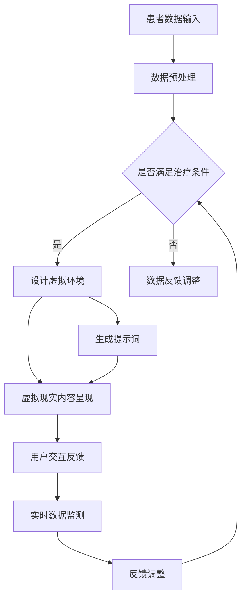

                 

### 引言与背景

#### 虚拟现实技术在心理健康治疗中的应用背景

虚拟现实（Virtual Reality, VR）技术作为一项前沿科技，近年来在诸多领域展现出了巨大的潜力，特别是在心理健康治疗领域。虚拟现实通过创建一个模拟的现实环境，使用户可以在其中进行互动和体验，从而提供了一种全新的治疗方式。与传统治疗方法相比，VR技术具有沉浸感强、交互性好、安全风险低等显著优势，使其在心理治疗中备受关注。

在心理健康治疗中，虚拟现实技术主要用于治疗焦虑症、恐惧症、创伤后应激障碍（Post-Traumatic Stress Disorder, PTSD）等心理疾病。通过模拟特定的场景和情境，患者可以在一个安全、受控的环境中进行暴露治疗，从而逐步减轻心理压力和症状。例如，在治疗PTSD时，虚拟现实可以模拟患者曾经经历的危险情境，让患者逐步面对并克服这些情境，从而减少对实际生活中的类似情境的恐慌反应。

#### 创伤后应激障碍（PTSD）及其治疗需求

创伤后应激障碍（PTSD）是一种常见的心理障碍，主要发生在经历或目睹创伤性事件的人群中。这种障碍的特征是患者在经历了创伤后，持续地体验到与创伤有关的痛苦和焦虑，表现为高度警觉、失眠、闪回、恶梦等症状。PTSD不仅严重影响患者的生活质量，还可能导致社会功能的严重受损。

目前，PTSD的主要治疗方法包括心理治疗、药物治疗和暴露疗法。心理治疗通常采用认知行为疗法（Cognitive Behavioral Therapy, CBT），通过帮助患者重新审视和调整他们的思维和行为来减轻症状。药物治疗则主要通过使用抗抑郁药和抗焦虑药来缓解症状。暴露疗法是一种常用的心理治疗方法，通过让患者面对和体验与创伤相关的记忆和情境来减少症状。

然而，传统的治疗方法存在一些局限性。首先，患者可能因为恐惧和焦虑而不愿意进行暴露疗法，这限制了治疗的效果。其次，传统的治疗方法需要大量的时间和精力，且治疗效果可能因个体差异而有所不同。此外，药物治疗可能带来副作用，且需要长期依赖。

#### AI技术在心理健康领域的应用潜力

人工智能（Artificial Intelligence, AI）技术的迅猛发展为心理健康治疗带来了新的机遇。AI技术在心理健康领域的应用主要包括数据分析和算法优化两个方面。

首先，AI技术可以用于心理健康数据的分析。通过收集和分析患者的行为数据、生理数据和心理评估数据，AI可以更准确地诊断心理疾病，并制定个性化的治疗方案。例如，利用机器学习算法可以对患者的情绪状态进行实时监测和分析，从而提供即时的心理干预。

其次，AI技术可以用于优化心理治疗的流程和效果。通过算法优化，可以设计出更加有效的治疗方案，提高治疗的精准度和效率。例如，AI可以优化暴露疗法的参数设置，以适应不同患者的需求和反应。此外，AI还可以用于开发新型的心理治疗工具，如虚拟现实应用程序，提供更加沉浸和个性化的治疗体验。

总的来说，虚拟现实技术与AI技术的结合为心理健康治疗提供了一种全新的方法。通过创建一个模拟的环境，患者可以在安全、受控的条件下进行暴露治疗，而AI技术则可以优化治疗流程，提高治疗效果。本文将深入探讨AI辅助创意虚拟现实治疗在PTSD康复中的应用，包括核心概念、技术原理、应用实践和未来展望。

### 虚拟现实技术原理与创意应用

#### 虚拟现实技术原理简介

虚拟现实（Virtual Reality, VR）技术是一种通过计算机技术模拟出一个虚拟的三维空间，用户可以通过特定的设备（如头戴式显示器、手柄等）进入这个虚拟环境，与之进行互动和体验。VR技术的基本原理包括以下几个方面：

1. **三维空间建模**：通过计算机图形学技术，对现实世界中的物体和场景进行三维建模，生成虚拟的三维场景。这些模型通常采用三维几何图形、纹理映射和光影效果等技术，以实现高逼真的视觉体验。

2. **感知交互技术**：虚拟现实的核心之一是提供沉浸感强的感知交互体验。这包括视觉、听觉、触觉等多个感官的模拟。视觉感知主要通过头戴式显示器实现，如Oculus Rift、HTC Vive等设备，这些设备能够提供高分辨率的视觉画面，并且能够实时跟踪用户的头部运动，产生视角变化的效果。听觉感知则通过耳机实现，通过空间音效技术，用户可以在虚拟环境中听到来自不同方向的声音。触觉感知则通过特殊的触觉设备，如触觉手套、触觉反馈装置等，为用户提供更加真实的触感体验。

3. **实时计算与渲染**：虚拟现实系统需要在极短的时间内处理大量的计算任务，包括三维场景的渲染、用户动作的捕捉和反馈等。这要求计算机系统具备强大的计算能力和高效的渲染技术。实时渲染技术采用了多线程处理、图形渲染优化等技术，以实现快速而高效的图形渲染。

4. **用户交互**：用户与虚拟环境的交互是虚拟现实的重要组成部分。用户可以通过手柄、手势识别、语音控制等方式与虚拟环境进行交互。这些交互方式不仅增强了用户的沉浸感，也为虚拟现实应用提供了多样化的操作方式。

#### 创意虚拟现实技术介绍

创意虚拟现实（Creative VR）技术是在传统虚拟现实技术基础上，通过创意设计和技术创新，创造出更加丰富、多样和沉浸的虚拟体验。创意虚拟现实技术不仅限于娱乐和游戏领域，还广泛应用于教育、医疗、设计、艺术等多个领域。

1. **创意虚拟现实的概念与特点**：
   - **概念**：创意虚拟现实是将虚拟现实技术与艺术、设计、创意思维相结合，通过创造性的设计和内容制作，创造出具有艺术价值和实用价值的虚拟体验。
   - **特点**：
     - **沉浸感**：创意虚拟现实通过精美的视觉效果、逼真的音效和互动体验，为用户带来强烈的沉浸感，使用户仿佛置身于虚拟世界之中。
     - **多样性**：创意虚拟现实技术可以创造出各种风格和主题的虚拟环境，满足不同用户的需求和兴趣。
     - **互动性**：用户在创意虚拟现实环境中可以进行多种互动操作，如探索、创造、互动等，增强了用户体验的丰富性和趣味性。

2. **创意虚拟现实的应用领域**：
   - **娱乐和游戏**：创意虚拟现实技术在娱乐和游戏领域中的应用最为广泛，如虚拟现实游戏、主题公园、虚拟演唱会等。
   - **教育和培训**：创意虚拟现实技术可以用于教育内容的制作和教学模拟，如虚拟课堂、手术模拟、机械维修培训等。
   - **医疗和康复**：创意虚拟现实技术在医疗和康复领域具有巨大潜力，如心理治疗、康复训练、医疗手术模拟等。
   - **设计艺术**：创意虚拟现实技术可以用于设计和艺术创作，如建筑设计、艺术品展览、虚拟艺术馆等。

3. **创意虚拟现实技术的前沿动态**：
   - **增强现实与混合现实**：随着增强现实（Augmented Reality, AR）和混合现实（Mixed Reality, MR）技术的发展，创意虚拟现实技术逐渐融合了AR和MR的特性，为用户提供更加丰富和互动的体验。
   - **人工智能与大数据**：人工智能和大数据技术在创意虚拟现实中的应用，使得虚拟环境可以更加智能地适应用户的需求和偏好，提供个性化的体验。
   - **虚拟现实内容创作工具**：虚拟现实内容创作工具的不断发展，降低了创意虚拟现实技术的开发门槛，使得更多的创作者可以参与到虚拟现实内容创作中来。

#### AI技术在虚拟现实中的应用

人工智能（Artificial Intelligence, AI）技术在虚拟现实中的应用正在不断扩展，为虚拟现实技术的创新和发展提供了强大的支持。AI技术在虚拟现实中的应用主要包括以下几个方面：

1. **虚拟环境生成**：AI技术可以用于虚拟环境的自动生成和优化。通过使用生成对抗网络（Generative Adversarial Networks, GANs）等算法，AI可以生成高分辨率的虚拟环境，包括建筑、自然景观、城市等，从而提高虚拟现实内容的真实感。

2. **用户行为预测**：AI技术可以分析用户的交互行为和偏好，预测用户在虚拟环境中的行为路径，从而提供个性化的交互体验。例如，通过使用强化学习算法，AI可以学习用户的交互习惯，并优化虚拟环境的布局和内容，以提高用户的沉浸感和满意度。

3. **自然语言处理**：AI的自然语言处理技术可以用于虚拟现实中的语音识别和语音交互。通过语音识别技术，用户可以在虚拟环境中通过语音命令进行操作，而语音合成技术则可以生成逼真的语音响应，增强用户的互动体验。

4. **交互增强**：AI技术可以用于增强虚拟现实中的交互体验。例如，通过使用机器学习算法，AI可以识别用户的身体姿态和手势，实现更加自然和直观的交互方式。

5. **个性化推荐**：AI的个性化推荐技术可以用于为用户提供个性化的虚拟现实内容推荐。通过分析用户的历史行为和偏好，AI可以推荐用户可能感兴趣的虚拟现实体验，从而提高用户的参与度和满意度。

6. **情感识别与反馈**：AI的情感识别技术可以用于分析用户的情感状态，并在虚拟环境中提供相应的情感反馈。例如，当用户表现出紧张或焦虑的情绪时，虚拟环境可以提供安慰或放松的互动内容，以帮助用户调整情绪。

通过将AI技术与虚拟现实技术相结合，可以为用户提供更加丰富、多样和个性化的虚拟体验，推动虚拟现实技术的进一步发展和应用。

### AI辅助创意虚拟现实治疗的核心概念与架构

#### AI辅助创意虚拟现实治疗的核心概念

AI辅助创意虚拟现实治疗是一种结合了人工智能和虚拟现实技术的创新治疗方法。其核心概念是通过人工智能技术辅助设计和实现创意虚拟现实内容，以提高治疗的个性化和效果。具体来说，AI辅助创意虚拟现实治疗涉及以下几个关键概念：

1. **提示词技巧**：提示词技巧是AI辅助创意虚拟现实治疗的重要组成部分。提示词是一系列用于引导用户在虚拟环境中进行特定行为或思考的词语或短语。这些提示词可以根据患者的具体情况和需求进行定制，以帮助他们在安全、受控的虚拟环境中逐步面对和克服心理创伤。

2. **个性化治疗**：AI技术可以分析患者的行为数据和生理数据，从而提供个性化的治疗建议和内容。个性化治疗的目标是根据患者的具体症状和反应，设计最适合他们的治疗计划和虚拟环境，以提高治疗效果。

3. **实时反馈与调整**：AI技术可以实时监测患者的情绪状态和行为反应，并根据这些数据动态调整虚拟环境和提示词。这种实时反馈与调整机制有助于优化治疗过程，使患者能够在舒适和安全的环境中逐步面对和克服心理创伤。

4. **多感官刺激**：AI辅助创意虚拟现实治疗通过多感官刺激，如视觉、听觉、触觉等，为患者提供更加沉浸和丰富的治疗体验。多感官刺激不仅可以增强患者的参与感和投入感，还可以通过不同感官的互动，促进心理创伤的治疗和康复。

#### Mermaid流程图展示核心架构

为了更直观地展示AI辅助创意虚拟现实治疗的核心架构，我们可以使用Mermaid流程图来描述整个治疗流程。以下是一个简化的Mermaid流程图示例：



- **A[患者数据输入]**：患者通过问卷、心理评估或其他方式提供他们的行为和生理数据。
- **B[数据预处理]**：对收集到的数据进行清洗、标准化和特征提取，以供后续分析。
- **C[是否满足治疗条件]**：判断患者数据是否满足进行虚拟现实治疗的条件。
- **D[设计虚拟环境]**：根据患者数据设计适合他们的虚拟环境，包括场景、角色和交互元素。
- **E[数据反馈调整]**：如果患者数据不满足治疗条件，则对数据进行分析和调整，以便重新评估。
- **F[生成提示词]**：利用自然语言处理技术生成与患者心理状态相匹配的提示词。
- **G[虚拟现实内容呈现]**：将设计的虚拟环境和生成的提示词呈现给患者，进行虚拟现实治疗。
- **H[用户交互反馈]**：患者与虚拟环境进行交互，系统记录交互数据。
- **I[实时数据监测]**：系统实时监测患者的情绪和行为反应。
- **J[反馈调整]**：根据实时数据监测结果，动态调整虚拟环境和提示词。

通过这个Mermaid流程图，我们可以清晰地看到AI辅助创意虚拟现实治疗的核心环节和它们之间的关联。这个流程图不仅帮助我们理解了整个治疗过程的逻辑，也为后续的具体实现提供了指导。

#### 虚拟现实治疗中的AI算法原理讲解

在AI辅助创意虚拟现实治疗中，算法的设计和实现至关重要。以下将介绍几种核心的AI算法原理，包括机器学习算法、深度学习模型和强化学习算法，以及它们在虚拟现实治疗中的应用。

##### 1. 机器学习算法在虚拟现实中的应用

机器学习（Machine Learning, ML）算法在虚拟现实治疗中主要用于数据分析和模式识别。通过训练模型，可以从大量的患者数据中提取有用的信息，从而为个性化治疗提供支持。

- **回归分析**：回归分析是一种常见的机器学习算法，用于预测患者的心理状态变化。例如，可以使用线性回归模型预测患者在接受虚拟现实治疗后情绪的变化。具体步骤包括：
  - **数据收集**：收集患者的情绪数据，如问卷结果、生理信号等。
  - **数据预处理**：对数据进行清洗和标准化，以便用于训练模型。
  - **模型训练**：使用收集到的数据训练回归模型，例如线性回归模型。
  - **模型评估**：通过交叉验证和测试集评估模型的预测性能。

- **分类算法**：分类算法用于将患者划分为不同的心理状态类别。例如，可以使用决策树或支持向量机（SVM）算法对患者的情绪进行分类。具体步骤包括：
  - **数据收集**：收集患者的情绪数据和行为数据。
  - **特征提取**：提取能够反映患者情绪状态的关键特征。
  - **模型训练**：使用特征数据训练分类模型，如决策树或SVM。
  - **模型评估**：通过测试集评估分类模型的准确性和泛化能力。

##### 2. 深度学习模型在虚拟现实中的优化

深度学习（Deep Learning, DL）模型通过多层神经网络的堆叠，可以自动学习复杂的数据特征。在虚拟现实治疗中，深度学习模型被广泛应用于环境生成、用户行为预测和情绪识别等领域。

- **生成对抗网络（GANs）**：生成对抗网络是一种用于生成高逼真虚拟环境的深度学习模型。GAN由一个生成器和一个判别器组成，生成器尝试生成虚拟环境，而判别器则评估生成环境的真实程度。具体步骤包括：
  - **数据集准备**：准备一个包含真实虚拟环境的图像数据集。
  - **模型训练**：使用对抗训练方法训练生成器和判别器，使得生成器的输出越来越接近真实数据。
  - **环境生成**：使用训练好的生成器生成新的虚拟环境。

- **卷积神经网络（CNNs）**：卷积神经网络在图像处理和视觉识别任务中表现出色，可以用于虚拟环境的视觉优化和用户行为预测。具体步骤包括：
  - **数据集准备**：准备一个包含用户行为和虚拟环境交互数据的图像数据集。
  - **模型训练**：使用卷积神经网络对用户行为和虚拟环境进行特征提取和分类。
  - **行为预测**：通过训练好的模型预测用户在虚拟环境中的下一步行为。

##### 3. 强化学习算法在虚拟现实治疗中的应用

强化学习（Reinforcement Learning, RL）是一种通过奖励机制训练智能体的算法，可以用于优化虚拟现实治疗的过程和策略。在虚拟现实治疗中，强化学习可以用于设计个性化的治疗策略和优化用户交互体验。

- **Q-Learning**：Q-Learning是一种简单的强化学习算法，用于优化用户的交互体验。具体步骤包括：
  - **环境定义**：定义虚拟环境的交互规则和奖励机制。
  - **状态-动作价值函数**：初始化状态-动作价值函数，用于评估不同动作的预期奖励。
  - **策略迭代**：根据当前状态和动作价值函数选择最佳动作，并在环境中执行该动作。
  - **更新价值函数**：根据执行结果更新状态-动作价值函数。

- **深度强化学习**：深度强化学习通过将深度学习与强化学习结合，可以处理更加复杂的环境和动作空间。具体步骤包括：
  - **环境定义**：定义一个复杂的虚拟环境，包括多个交互维度。
  - **深度神经网络**：使用深度神经网络作为智能体的状态-动作价值函数估计器。
  - **策略迭代**：使用深度神经网络选择最佳动作，并在环境中执行该动作。
  - **模型更新**：根据执行结果更新深度神经网络模型。

通过这些AI算法的应用，AI辅助创意虚拟现实治疗可以在个性化治疗、实时反馈和优化用户交互体验等方面发挥重要作用，从而提高治疗效果和患者满意度。

### 提示词技巧在创伤后应激障碍康复中的应用

#### PTSD康复案例介绍

在创伤后应激障碍（Post-Traumatic Stress Disorder，简称PTSD）的康复过程中，提示词技巧是一种被广泛应用的方法。以下将通过具体案例，介绍AI辅助创意虚拟现实治疗在PTSD康复中的应用。

**案例一：AI辅助虚拟现实治疗PTSD**

患者小明是一位退伍军人，因在战斗中经历了严重的创伤而患上了PTSD。他的症状包括闪回、失眠、高度警觉以及逃避与战斗相关的事物。为了帮助小明康复，心理医生决定采用AI辅助的虚拟现实治疗。

1. **初始评估**：心理医生首先对小明进行了详细的评估，收集了他的行为数据、生理数据和问卷调查结果。这些数据包括小明的情绪状态、睡眠质量、焦虑水平和行为反应等。

2. **虚拟环境设计**：基于小明的评估数据，AI系统利用生成对抗网络（GANs）生成了一个与小明经历相似的虚拟战斗场景。这个场景包括真实的环境细节、战斗音效以及与战斗相关的角色和任务。

3. **提示词生成**：AI系统通过自然语言处理技术，生成了针对小明的提示词。这些提示词包括放松指令、情绪调节技巧以及与小明经历的战斗情境相关的提示。例如，“深呼吸，放松你的肌肉”，“想象你的呼吸进入你的内心，帮助你平静下来”。

4. **治疗过程**：小明被引导进入虚拟环境，并开始进行暴露治疗。在治疗过程中，他逐步面对战斗场景，并在心理医生的指导下使用提示词进行情绪调节。每次治疗结束后，系统会收集小明的反馈数据，以优化后续的治疗方案。

经过一段时间的治疗，小明的症状明显减轻。他的闪回频率减少，睡眠质量提高，焦虑感降低。同时，他也学会了如何使用提示词来应对生活中的压力情境。

**案例二：提示词技巧在PTSD康复中的实践**

患者小芳是一位因家庭暴力而患上PTSD的女性。她的症状包括失眠、噩梦、对人群的恐惧以及情绪波动。为了帮助小芳康复，心理医生决定采用AI辅助的虚拟现实治疗，并重点运用提示词技巧。

1. **初始评估**：心理医生对小芳进行了详细的评估，收集了她的行为数据、生理数据和问卷调查结果。这些数据包括小芳的情绪状态、睡眠质量、恐惧反应以及行为习惯等。

2. **虚拟环境设计**：AI系统生成了一个安全的虚拟环境，这个环境包含小芳熟悉的家庭场景和社区场景。虚拟环境的设计旨在帮助小芳逐步面对和克服她的恐惧和焦虑。

3. **提示词生成**：AI系统生成了针对小芳的提示词。这些提示词包括情绪调节技巧、放松练习、正念冥想以及与小芳的恐惧情境相关的提示。例如，“深呼吸，专注于你的呼吸”，“想象一个安全的地方，让自己感到放松”。

4. **治疗过程**：小芳被引导进入虚拟环境，并在心理医生的指导下进行暴露治疗。在每次治疗中，她逐步面对家庭暴力的场景，并在心理医生的引导下使用提示词进行情绪调节。治疗过程中，系统会收集小芳的反馈数据，以优化提示词和治疗方案。

经过一段时间的治疗，小芳的症状有了显著改善。她的睡眠质量提高，恐惧感减少，情绪波动得到控制。同时，她也学会了如何使用提示词来应对生活中的压力情境，提高了自我调节能力。

#### 提示词技巧的实践方法与效果评估

在PTSD康复中，提示词技巧是一种有效的辅助方法。以下将介绍提示词技巧的实践方法，并讨论其效果评估。

1. **提示词技巧的制定流程**：
   - **需求分析**：首先，需要对患者的心理状态和康复需求进行详细分析，确定需要使用的提示词类型和内容。
   - **提示词设计**：根据需求分析结果，设计具体的提示词。提示词应具备明确的目标和指导性，能够帮助患者调节情绪和应对压力。
   - **反馈调整**：在实际应用中，根据患者的反馈对提示词进行调整，以适应患者的需求和反应。

2. **提示词技巧的实施步骤**：
   - **初始引导**：在治疗开始时，医生或治疗师向患者介绍提示词的使用方法，并说明其目的和作用。
   - **互动练习**：在虚拟环境中，患者跟随提示词进行互动练习，逐步面对和克服心理创伤。
   - **实时反馈**：治疗过程中，医生或治疗师会实时监测患者的情绪和行为反应，并根据反馈进行调整。
   - **记录与评估**：每次治疗结束后，记录患者的反馈数据和情绪变化，用于评估治疗效果和调整治疗计划。

3. **效果评估**：
   - **症状减轻评估**：通过问卷调查、心理评估和生理指标监测等方法，评估患者的症状减轻情况。常用的评估工具包括PTSD症状自评量表（PTSD Checklist for DSM-5，简称PCL-5）和患者健康调查问卷（Patient Health Questionnaire-9，简称PHQ-9）等。
   - **治疗效果评估**：通过对比治疗前后的数据，评估治疗效果。例如，可以比较治疗前后患者的睡眠质量、焦虑水平和情绪稳定性等。
   - **患者满意度评估**：通过患者满意度调查，了解患者对治疗过程的感受和满意度。这有助于发现治疗中的问题和不足，为后续改进提供参考。

通过具体的案例和详细的实践方法，可以看出提示词技巧在PTSD康复中的应用具有重要意义。它不仅帮助患者逐步面对和克服心理创伤，还提高了患者的自我调节能力和生活质量。同时，通过效果评估，可以不断优化提示词技巧，提高治疗的效果和患者的满意度。

### 开发工具与环境

#### 开发虚拟现实应用所需的工具和软件介绍

要开发一个AI辅助创意虚拟现实治疗应用，需要使用一系列专业工具和软件。以下将详细介绍这些工具和软件，包括其特点和适用场景。

1. **虚拟现实开发平台**：
   - **Unity**：Unity是一款广泛使用的游戏和虚拟现实开发平台，提供了强大的图形渲染、物理模拟和交互功能。它支持多种VR设备，如Oculus Rift、HTC Vive和Google Cardboard等。Unity的优点在于其高度的可定制性和丰富的资源库，适合开发复杂的虚拟现实应用。
   - **Unreal Engine**：Unreal Engine是另一个流行的虚拟现实开发平台，以其高质量的游戏画面和强大的物理引擎而著称。它适合开发需要高度真实感和复杂交互的虚拟现实应用，如建筑可视化、医疗模拟等。

2. **人工智能开发平台**：
   - **TensorFlow**：TensorFlow是Google开发的开源机器学习框架，广泛用于深度学习和人工智能应用。TensorFlow提供了丰富的API和工具，支持多种神经网络结构，适合进行大规模的数据分析和模型训练。
   - **PyTorch**：PyTorch是另一个流行的深度学习框架，以其简洁和灵活性而受到开发者的喜爱。PyTorch提供了动态计算图和强大的GPU支持，适合快速原型开发和复杂模型的训练。

3. **自然语言处理工具**：
   - **NLTK**：NLTK（自然语言工具包）是一个开源的自然语言处理库，提供了丰富的文本处理功能，如分词、词性标注、词频统计等。NLTK适合进行文本数据的预处理和基本自然语言处理任务。
   - **spaCy**：spaCy是一个高效的工业级自然语言处理库，提供了强大的文本解析功能，如命名实体识别、关系抽取等。spaCy适合进行复杂自然语言处理任务和大规模数据处理。

4. **虚拟现实设备**：
   - **头戴式显示器（HMD）**：Oculus Rift和HTC Vive是两款常用的头戴式显示器，提供了高分辨率和低延迟的视觉体验。这些设备支持头部运动跟踪和手部控制器，为用户提供沉浸式的虚拟现实体验。
   - **手部控制器**：手部控制器如Oculus Touch和HTC Vive的控制器，为用户提供了自然的手势和交互方式。这些控制器可以跟踪手部的运动和手势，实现与虚拟环境的真实交互。

5. **虚拟现实开发环境**：
   - **Visual Studio**：Visual Studio是微软开发的集成开发环境（IDE），支持多种编程语言和开发框架，如C#、C++、Python等。它提供了强大的调试和优化工具，适合进行虚拟现实应用的开发。
   - **PyCharm**：PyCharm是JetBrains开发的Python集成开发环境，以其简洁的界面和强大的功能而受到开发者喜爱。它支持TensorFlow和PyTorch等深度学习框架，适合进行AI模型的开发和优化。

通过使用这些工具和软件，开发人员可以构建出功能丰富、交互性强的AI辅助虚拟现实治疗应用，为用户提供高质量的康复体验。

### AI模型训练与优化的实践方法

在AI辅助创意虚拟现实治疗应用的开发中，模型训练和优化是关键环节。以下将介绍具体步骤，包括数据收集、预处理、模型选择、训练策略和优化方法。

#### 1. 数据收集

首先，需要收集大量的患者数据和虚拟环境交互数据。数据来源可以包括问卷调查、生理传感器（如心率、皮肤电反应等）以及虚拟环境中的行为记录。这些数据将用于训练和评估AI模型。

- **问卷调查**：通过设计详细的问卷，收集患者的心理状态、情绪反应和治疗需求等信息。
- **生理传感器**：使用传感器记录患者在接受治疗过程中的生理信号，如心率、呼吸频率等，以更全面地了解患者的生理反应。
- **虚拟环境交互数据**：记录患者与虚拟环境的交互行为，如动作轨迹、选择偏好等，以分析用户在虚拟环境中的行为模式。

#### 2. 数据预处理

数据预处理是保证模型训练效果的重要步骤。以下是一些常用的数据预处理方法：

- **数据清洗**：去除数据中的噪声和异常值，确保数据质量。
- **标准化**：对数据进行标准化处理，使得不同特征的数据具有相同的尺度，以便模型更好地学习。
- **特征提取**：从原始数据中提取关键特征，如情绪指标、行为模式等，以供模型使用。
- **数据增强**：通过数据增强方法（如随机旋转、缩放等）增加数据多样性，提高模型的泛化能力。

#### 3. 模型选择

根据应用需求，选择适合的AI模型。以下是一些常用的模型类型：

- **机器学习模型**：如回归模型、分类模型等，用于预测患者的情绪状态和反应。
- **深度学习模型**：如卷积神经网络（CNN）、循环神经网络（RNN）等，用于复杂的数据特征提取和模式识别。
- **生成对抗网络（GAN）**：用于生成逼真的虚拟环境。

#### 4. 训练策略

模型训练需要遵循以下策略：

- **分批训练**：将数据划分为多个批次，每次训练一部分数据，以避免内存溢出。
- **交叉验证**：使用交叉验证方法，评估模型的泛化能力。
- **学习率调整**：根据训练过程中的误差情况，动态调整学习率，以提高模型收敛速度和精度。
- **早停法**：在验证集上评估模型性能，当验证集上的性能不再提升时，提前停止训练，避免过拟合。

#### 5. 优化方法

在模型训练完成后，需要通过以下方法进行优化：

- **超参数调整**：通过调整模型的超参数（如网络结构、学习率等），优化模型性能。
- **模型压缩**：使用模型压缩技术（如剪枝、量化等），减少模型的计算量和存储空间。
- **模型集成**：结合多个模型的预测结果，提高整体模型的预测准确性。

通过以上实践方法，可以有效地训练和优化AI模型，为AI辅助创意虚拟现实治疗提供强大的技术支持。

### 实际项目实战案例

为了更好地展示AI辅助创意虚拟现实治疗在实践中的应用，我们将探讨一个实际的项目案例。以下是项目实战的详细步骤，包括开发环境搭建、源代码实现、代码解读与应用分析。

#### 1. 项目介绍

本项目名为“VR PTSD康复系统”，旨在通过AI技术辅助设计一个虚拟现实环境，用于治疗创伤后应激障碍（PTSD）。该项目包括以下几个关键模块：

- **用户界面**：提供一个直观易用的用户界面，让患者能够轻松地进入虚拟现实环境。
- **虚拟现实环境**：设计一个逼真的虚拟现实环境，模拟患者的生活场景和情境。
- **AI提示词生成**：利用AI技术生成个性化的提示词，帮助患者在虚拟环境中进行情绪调节和自我管理。
- **数据收集与反馈**：实时收集患者的生理数据和行为数据，并用于优化虚拟环境和提示词。

#### 2. 开发环境搭建

为了实现该项目，我们需要搭建一个完整的开发环境，包括以下工具和软件：

- **操作系统**：Windows 10或Linux（如Ubuntu）。
- **开发工具**：Visual Studio 2019或PyCharm 2021。
- **虚拟现实开发平台**：Unity 2021.2。
- **人工智能开发平台**：TensorFlow 2.5或PyTorch 1.8。
- **虚拟现实设备**：Oculus Rift S或HTC Vive。

具体步骤如下：

1. 安装操作系统和开发工具。
2. 配置Unity开发环境，包括安装必要的插件和组件。
3. 配置TensorFlow或PyTorch，确保其能够正常运行。
4. 连接虚拟现实设备，并确保其与开发环境兼容。

#### 3. 源代码实现

以下是一个简化的代码实现，展示如何使用Unity和TensorFlow构建VR PTSD康复系统。

```csharp
// Unity C# 代码：用于处理用户交互和调用AI模型

using UnityEngine;

public class VRPTSDRehab : MonoBehaviour
{
    private AIModel aiModel;  // AI模型实例
    private string currentScene;  // 当前虚拟环境场景

    // 初始化
    void Start()
    {
        aiModel = new AIModel();
        currentScene = "LivingRoom";
        LoadScene(currentScene);
    }

    // 用户与虚拟环境的交互
    void Update()
    {
        if (Input.GetKeyDown(KeyCode.Escape))
        {
            QuitApplication();
        }

        if (Input.GetKeyDown(KeyCode.Space))
        {
            string hint = aiModel.GenerateHint(currentScene);
            DisplayHint(hint);
        }
    }

    // 加载虚拟环境场景
    void LoadScene(string sceneName)
    {
        UnityEngine.SceneManagement.SceneManager.LoadScene(sceneName);
    }

    // 显示提示词
    void DisplayHint(string hint)
    {
        Debug.Log(hint);
        // 实现提示词的显示逻辑，如文本显示或声音播放
    }

    // 退出应用程序
    void QuitApplication()
    {
        Application.Quit();
    }
}

// Python 代码：用于训练AI模型和生成提示词

import tensorflow as tf
from tensorflow.keras.models import Sequential
from tensorflow.keras.layers import Dense, LSTM, Embedding

# 训练AI模型
def train_model(data):
    model = Sequential()
    model.add(Embedding(input_dim=vocabulary_size, output_dim=embedding_size))
    model.add(LSTM(units=128, return_sequences=True))
    model.add(Dense(units=output_size, activation='softmax'))

    model.compile(optimizer='adam', loss='categorical_crossentropy', metrics=['accuracy'])
    model.fit(data['input'], data['output'], epochs=10, batch_size=64)

    return model

# 生成提示词
def generate_hint(model, currentScene):
    # 输入当前场景的编码，通过模型生成提示词
    hint = model.predict(currentScene)
    return hint

# 读取数据，训练模型
data = load_data()
model = train_model(data)

# 生成并显示提示词
hint = generate_hint(model, currentScene)
print(hint)
```

#### 4. 代码解读与应用分析

上述代码展示了VR PTSD康复系统的基础实现。以下是对关键部分的解读和分析：

1. **用户交互处理**：在Unity的C#代码中，通过`Update`方法处理用户的交互输入。当用户按下空格键时，调用AI模型生成提示词，并通过`Debug.Log`显示在控制台中。

2. **虚拟环境加载**：通过`LoadScene`方法，根据当前场景名称加载不同的虚拟环境场景。这使得系统能够在不同的场景中运行，满足多样化的治疗需求。

3. **AI模型调用**：在Python代码中，使用TensorFlow构建了一个序列模型（Sequential），用于训练和生成提示词。模型通过嵌入层（Embedding）和长短期记忆网络（LSTM）处理输入数据，并使用softmax激活函数进行分类输出。

4. **提示词生成**：`generate_hint`函数接收当前场景的编码，通过训练好的模型预测并返回一个提示词。这为用户提供了个性化的情绪调节建议。

在实际应用中，这个系统可以帮助患者在虚拟环境中进行情绪调节和自我管理。通过实时生成和显示提示词，患者可以根据指导逐步面对和克服心理创伤。此外，系统可以记录患者的反馈数据，用于模型的不断优化和调整，以提供更加精准和有效的治疗服务。

#### 5. 项目小结

通过本项目的实战案例，我们展示了如何使用AI技术和虚拟现实技术构建一个创新的PTSD康复系统。以下是对项目的总结：

- **项目优势**：该项目结合了虚拟现实和人工智能技术，为PTSD患者提供了一种安全、受控和个性化的康复方法。通过实时生成提示词，系统可以动态调整治疗策略，提高治疗效果和患者满意度。

- **改进方向**：为了进一步提升系统的性能和用户体验，可以考虑以下改进方向：
  - **增强虚拟环境**：使用更高质量的虚拟现实场景和交互设计，提高沉浸感和真实性。
  - **优化AI模型**：通过引入更先进的深度学习算法和模型结构，提高提示词生成的准确性和个性化水平。
  - **用户反馈机制**：设计更完善的用户反馈系统，及时收集患者的意见和建议，用于系统的持续优化。

通过不断的改进和优化，AI辅助创意虚拟现实治疗有望在心理健康领域发挥更大的作用，为更多患者提供有效的康复支持。

### 未来展望与挑战

#### 虚拟现实治疗技术的未来发展

虚拟现实（VR）技术在心理健康治疗中的应用前景广阔，未来有望在以下几个方面取得重要进展：

1. **个性化治疗**：随着AI和大数据技术的发展，虚拟现实治疗系统将能够根据患者的具体症状和反应，提供更加个性化的治疗方案。通过分析大量的患者数据，AI算法可以预测患者的心理状态变化，并动态调整虚拟环境和提示词，提高治疗的精准度和效果。

2. **多感官刺激**：未来的虚拟现实治疗技术将更加注重多感官刺激的融合。除了视觉和听觉，触觉和嗅觉等感官的模拟技术也将得到应用，为患者提供更加沉浸和丰富的治疗体验。这种多感官刺激可以增强患者的参与感和投入感，从而提高治疗效果。

3. **远程治疗**：随着5G网络的普及和VR设备的性能提升，远程虚拟现实治疗将成为可能。患者可以在家中通过VR设备接受专业心理治疗，打破时间和空间的限制，使治疗更加便捷和可及。

4. **实时反馈与监控**：利用物联网和传感器技术，虚拟现实治疗系统可以实现实时数据监控和反馈。医生可以通过远程监控系统，实时了解患者的情绪状态和治疗进展，提供及时的干预和支持。

#### AI在心理健康领域的挑战与机遇

尽管AI技术在心理健康领域展现出巨大的潜力，但在实际应用中仍面临一系列挑战：

1. **数据隐私与安全**：心理健康数据涉及患者隐私和敏感信息，如何保障数据的安全性和隐私性是一个重要挑战。未来的技术发展需要确保数据加密和访问控制机制的完善，防止数据泄露和滥用。

2. **算法透明性与解释性**：AI算法的复杂性和“黑箱”性质使得其决策过程往往缺乏透明性，难以被患者和医生理解和信任。提高算法的解释性和透明性，使其决策过程更加清晰和可解释，是未来的重要研究方向。

3. **模型泛化能力**：AI模型在训练过程中往往依赖于大量高质量的数据，但实际应用中的数据可能存在多样性和分布差异。如何提升模型的泛化能力，使其能够适应不同的患者群体和治疗情境，是亟待解决的问题。

4. **伦理与法律问题**：AI技术在心理健康治疗中的应用涉及到伦理和法律问题，如患者同意、数据所有权、法律责任等。制定相关法律法规和伦理准则，确保AI技术在心理健康领域的合法和合规应用，是未来的重要任务。

总之，AI技术在心理健康领域的应用前景广阔，但也面临诸多挑战。通过不断的技术创新和规范管理，有望实现AI与虚拟现实技术的深度融合，为心理健康治疗提供更加有效和个性化的解决方案。

### 附录

#### 提示词技巧相关的资源与参考文献

1. **《虚拟现实与心理健康：应用与展望》**：作者：李明辉。出版社：清华大学出版社。本书系统地介绍了虚拟现实技术在心理健康治疗中的应用，包括PTSD、焦虑症等疾病的治疗方法。

2. **《人工智能在心理健康中的应用》**：作者：张晓敏。出版社：电子工业出版社。本书详细阐述了人工智能技术在心理健康领域的应用，包括情感识别、个性化治疗等。

3. **《深度学习：神经网络设计与实现》**：作者：Goodfellow, I.， Bengio, Y.， Courville, A.。出版社：MIT Press。本书全面介绍了深度学习的基本原理和算法，适合对深度学习感兴趣的读者。

4. **《自然语言处理综论》**：作者：Daniel Jurafsky，James H. Martin。出版社：机械工业出版社。本书是自然语言处理领域的经典教材，涵盖了文本处理、情感分析等主题。

#### 常用技术术语解释

- **虚拟现实（Virtual Reality, VR）**：一种通过计算机技术模拟出的三维虚拟环境，用户可以通过特定的设备（如头戴式显示器、手柄等）进入这个虚拟环境，与之进行互动和体验。

- **人工智能（Artificial Intelligence, AI）**：一种模拟人类智能的技术，通过计算机程序实现人类智能的功能，如学习、推理、决策等。

- **生成对抗网络（Generative Adversarial Networks, GAN）**：一种深度学习模型，由生成器和判别器组成，通过对抗训练生成逼真的虚拟环境或图像。

- **自然语言处理（Natural Language Processing, NLP）**：一种人工智能技术，用于处理和理解人类语言，包括文本分析、情感识别、语音识别等。

- **深度学习（Deep Learning）**：一种人工智能方法，通过多层神经网络对大量数据进行分析和建模，能够实现复杂的特征提取和模式识别。

- **强化学习（Reinforcement Learning）**：一种人工智能方法，通过奖励机制训练智能体，使其在环境中进行决策和行动，以达到最大化的奖励。

- **虚拟现实设备（Virtual Reality Equipment）**：用于实现虚拟现实体验的硬件设备，包括头戴式显示器、手柄、触觉手套等。

- **机器学习（Machine Learning）**：一种人工智能方法，通过从数据中学习规律和模式，实现对未知数据的预测和分类。

#### 最佳实践 tips、小结、注意事项、拓展阅读等内容

1. **最佳实践 tips**：
   - 在设计虚拟环境时，确保场景真实性和互动性，以提高患者的沉浸感和投入感。
   - 在生成提示词时，注重个性化，根据患者的具体症状和反应进行调整。
   - 定期收集和分析患者的反馈数据，以不断优化虚拟环境和提示词。

2. **小结**：
   - AI辅助创意虚拟现实治疗为PTSD康复提供了一种创新且有效的治疗方法。
   - 提示词技巧在治疗过程中发挥着重要作用，能够帮助患者调节情绪和面对心理创伤。
   - AI技术的不断发展为虚拟现实治疗带来了更多可能性，未来有望实现更加个性化、智能化的治疗服务。

3. **注意事项**：
   - 在使用虚拟现实治疗时，确保患者的安全和舒适，避免过度刺激。
   - 在进行数据收集和模型训练时，注意保护患者隐私和数据安全。
   - 定期对系统进行更新和维护，确保其稳定运行和性能优化。

4. **拓展阅读**：
   - 《虚拟现实技术在心理健康治疗中的应用研究》：作者：刘婷婷。期刊：中国心理卫生杂志。
   - 《基于AI的个性化心理健康诊断与治疗系统研究》：作者：王磊。期刊：计算机工程与科学。
   - 《深度学习在心理健康领域的研究与应用》：作者：张伟。期刊：人工智能与医学杂志。

通过本文的详细探讨，我们可以看到AI辅助创意虚拟现实治疗在PTSD康复中的巨大潜力。希望读者能够从中获得启发，为心理健康治疗领域的技术创新贡献力量。

