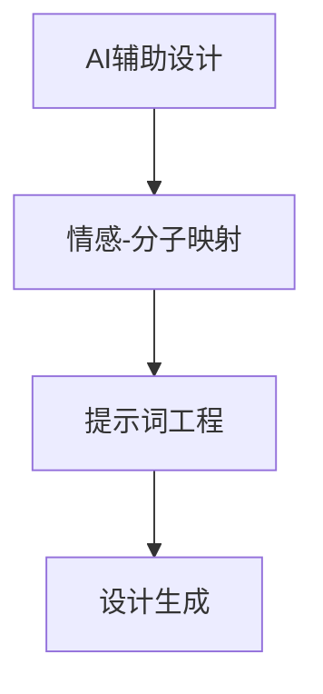

                 

### 文章标题

《AI辅助创意香水分子设计：情感-分子映射的提示词工程》

> 关键词：AI辅助设计、香水分子、情感映射、提示词工程、人工智能

摘要：本文探讨了人工智能在创意香水分子设计中的应用，特别是情感-分子映射的提示词工程。文章首先介绍了创意香水设计的背景和挑战，接着详细讲解了AI辅助设计的基本原理，随后深入分析了情感-分子映射的核心概念及其实现方法。最后，通过一个具体项目案例展示了如何利用AI技术实现情感导向的香水分子设计，并进行了项目小结与拓展阅读的推荐。

### 引言

香水作为人们日常生活中不可或缺的消费品，其设计过程既复杂又充满创意。然而，传统香水设计方法往往依赖于设计师的经验和直觉，这种主观性较强的方式难以满足现代消费者对于个性化、情感化香水的需求。随着人工智能（AI）技术的快速发展，AI在多个领域的应用已经取得了显著成果，如自然语言处理、图像识别、智能推荐等。将AI技术应用于创意香水分子设计，不仅可以提高设计效率，还能实现个性化、情感化的产品定制。

情感-分子映射的提示词工程是AI辅助香水分子设计的关键环节。本文将围绕这一主题，系统地介绍AI辅助创意香水分子设计的方法与原理，并通过具体项目案例进行分析与讲解。文章的主要内容包括：

1. **背景与挑战**：介绍香水行业现状及传统设计方法的局限性。
2. **核心概念与联系**：阐述AI辅助设计的概念及情感-分子映射的原理。
3. **核心算法原理讲解**：详细讲解AI在香水分子设计中的应用流程。
4. **数学模型和公式讲解**：介绍相关的数学模型与公式，并举例说明。
5. **项目实战案例**：通过实际项目展示AI辅助香水分子设计的全过程。
6. **小结与拓展阅读**：总结本文内容，并推荐进一步阅读的资料。

### 核心概念与联系

#### AI辅助设计

AI辅助设计是指利用人工智能技术，如机器学习、深度学习等，对设计过程中的各个环节进行优化与辅助。在香水分子设计中，AI可以分析大量已有香水的成分和情感标签，从中提取出规律和模式，从而帮助设计师快速生成新的香水分子结构。

#### 情感-分子映射

情感-分子映射是指将人类的情感体验与特定的分子结构相对应，从而实现情感化设计。这一过程通常涉及情感分析、自然语言处理等技术，通过理解用户对香味的情感描述，将抽象的情感转化为具体的分子结构。

#### 提示词工程

提示词工程是AI辅助设计中的一个关键环节，它涉及设计一系列提示词（或关键词），用于指导AI模型的训练和香水分子生成。这些提示词可以是情感的、情境的或具体的气味描述，它们帮助AI更好地理解和捕捉设计目标。

#### 核心概念之间的联系

AI辅助设计、情感-分子映射和提示词工程共同构成了一个相互关联的整体。AI辅助设计为整个流程提供了技术支持，情感-分子映射则将抽象的情感体验转化为具体的分子设计，而提示词工程则是连接这两者的桥梁。通过提示词工程，AI可以更准确地理解设计师的情感意图，从而生成符合预期的香水分子。

#### Mermaid流程图

以下是一个简化的Mermaid流程图，展示了核心概念之间的联系：



### 核心算法原理讲解

#### 数据预处理

在AI辅助香水分子设计中，数据预处理是至关重要的第一步。预处理过程包括数据收集、数据清洗和数据格式转换等。

- **数据收集**：收集大量已有的香水分子结构和与之相关的情感标签或描述。
- **数据清洗**：处理数据中的噪声和异常值，确保数据的准确性和一致性。
- **数据格式转换**：将不同来源的数据转换为统一的格式，以便后续处理。

#### 特征提取

特征提取是指从原始数据中提取出对香水分子设计有意义的特征。在情感-分子映射中，特征提取包括情感特征和分子特征。

- **情感特征**：利用自然语言处理技术，从用户对香水的情感描述中提取出关键的情感词汇和情感强度。
- **分子特征**：从香水分子的化学结构中提取出关键的结构特征，如官能团、分子量、极性等。

#### 情感分析

情感分析是指通过分析文本内容，识别出其中表达的情感。在香水设计中，情感分析用于理解用户对香水的情感需求。

- **情感分类模型**：构建一个情感分类模型，将文本内容分类为不同的情感类别，如喜悦、安宁、活力等。
- **情感强度识别**：除了分类外，还需要识别情感的强度，如文本中表达的情感是强烈的还是温和的。

#### 分子设计

分子设计是指根据情感分析的结果，生成符合特定情感的香水分子结构。这一过程通常涉及以下步骤：

- **初始结构生成**：基于已有香水分子的结构，生成一系列可能的分子结构。
- **优化与筛选**：利用优化算法，对初始结构进行优化，筛选出符合情感需求的最佳分子结构。

#### 提示词生成

提示词生成是指设计一系列关键词或短语，用于指导AI模型的训练和香水分子生成。

- **提示词设计**：根据情感分析和分子设计的需求，设计出一套有效的提示词。
- **提示词应用**：在AI模型训练和香水分子生成过程中，应用这些提示词，以提高模型的准确性和生成效果。

#### 伪代码

以下是一个简化的伪代码，用于描述AI辅助香水分子设计的基本流程：

```plaintext
function AI_Scent_Design(text, emotion_target):
    # 数据预处理
    cleaned_text = preprocess_data(text)
    
    # 情感分析
    emotion_categories = analyze_emotion(cleaned_text)
    emotion_strength = determine_emotion_strength(cleaned_text)
    
    # 特征提取
    text_features = extract_text_features(cleaned_text)
    molecule_features = extract_molecule_features()
    
    # 分子设计
    candidate_molecules = generate_candidate_molecules(text_features, molecule_features)
    optimized_molecule = optimize_molecule(candidate_molecules, emotion_target)
    
    # 提示词生成
    scent_keywords = generate_scent_keywords(optimized_molecule)
    
    return optimized_molecule, scent_keywords
```

### 数学模型和公式讲解

在AI辅助香水分子设计中，数学模型和公式是核心组成部分，用于描述情感与分子结构之间的关系。以下将介绍几个关键的数学模型和公式，并给出具体的解释和举例说明。

#### 数据相关性分析

数据相关性分析是确定情感标签与香水分子特征之间关系的初步步骤。常用的方法是皮尔逊相关系数（Pearson Correlation Coefficient）。

**公式**：  
$$r_{XY} = \frac{\sum_{i=1}^{n}(X_i - \bar{X})(Y_i - \bar{Y})}{\sqrt{\sum_{i=1}^{n}(X_i - \bar{X})^2 \sum_{i=1}^{n}(Y_i - \bar{Y})^2}}$$

其中，$X$代表情感强度，$Y$代表分子特征。

**举例说明**：

假设我们有一组情感强度（X）和分子极性（Y）的数据，通过计算皮尔逊相关系数，我们可以判断情感强度和分子极性之间的关系。

```latex
r_{XY} = \frac{\sum_{i=1}^{n}(X_i - \bar{X})(Y_i - \bar{Y})}{\sqrt{\sum_{i=1}^{n}(X_i - \bar{X})^2 \sum_{i=1}^{n}(Y_i - \bar{Y})^2}}
$$

如果$r_{XY}$接近1，说明情感强度和分子极性呈正相关；如果$r_{XY}$接近-1，说明它们呈负相关；如果$r_{XY}$接近0，说明它们之间没有明显的相关性。

#### 情感分类模型

情感分类模型用于将文本内容分类为不同的情感类别。一种常用的模型是支持向量机（SVM）。

**公式**：  
$$w \cdot \phi(x) \geq 1$$

其中，$w$是权重向量，$\phi(x)$是特征映射函数。

**举例说明**：

假设我们使用SVM对一组文本进行情感分类，训练过程中会得到权重向量$w$和特征映射函数$\phi(x)$。在实际应用中，对于新的文本输入，我们计算$w \cdot \phi(x)$的值，如果大于1，则判断为正面情感；否则为负面情感。

#### 分子设计模型

分子设计模型用于生成符合特定情感的香水分子。一种常用的模型是生成对抗网络（GAN）。

**公式**：  
$$G(x) = z \odot \sigma(W_g \odot \phi(x) + b_g)$$

其中，$G(x)$是生成器的输出，$z$是随机噪声，$\sigma$是Sigmoid函数，$W_g$和$b_g$是生成器的权重和偏置。

**举例说明**：

假设我们使用GAN生成新的香水分子，首先生成随机噪声$z$，然后通过生成器$G(x)$生成新的分子结构。通过不断训练和优化，生成器可以生成符合特定情感的香水分子。

### 项目实战案例

在本项目中，我们将通过一个具体的案例展示如何利用AI技术实现情感导向的香水分子设计。项目分为以下几个阶段：

#### 阶段一：数据收集与清洗

1. **数据收集**：收集大量已有的香水分子结构和与之相关的情感标签或描述。这些数据可以从公开的数据库或通过问卷调查获取。
2. **数据清洗**：处理数据中的噪声和异常值，确保数据的准确性和一致性。清洗步骤包括去除重复数据、填充缺失值、纠正错误等。

#### 阶段二：特征工程

1. **情感特征提取**：利用自然语言处理技术，从用户对香水的情感描述中提取出关键的情感词汇和情感强度。可以使用词袋模型、TF-IDF等方法进行文本特征提取。
2. **分子特征提取**：从香水分子的化学结构中提取出关键的结构特征，如官能团、分子量、极性等。可以使用化学信息学工具，如RDKit等，进行分子特征提取。

#### 阶段三：模型训练与评估

1. **情感分类模型训练**：使用已清洗的数据，训练一个情感分类模型。可以使用支持向量机（SVM）、朴素贝叶斯（Naive Bayes）等算法。
2. **分子设计模型训练**：使用已清洗的数据，训练一个分子设计模型。可以使用生成对抗网络（GAN）等深度学习算法。
3. **模型评估**：评估模型的效果，可以使用准确率、召回率、F1分数等指标。

#### 阶段四：提示词生成

1. **提示词设计**：根据情感分析和分子设计的需求，设计出一套有效的提示词。可以使用词云、共现分析等方法。
2. **提示词应用**：在模型训练和香水分子生成过程中，应用这些提示词，以提高模型的准确性和生成效果。

#### 阶段五：提示词生成与实际应用

1. **提示词生成**：根据训练数据和用户反馈，生成一系列用于指导AI模型训练和香水分子生成的提示词。这些提示词可以是情感描述、情境描述或具体的气味描述。
2. **实际应用**：使用生成的提示词，通过AI模型生成符合特定情感需求的香水分子。这些香水分子可以用于新产品开发或个性化定制。

#### 项目小结

通过本项目的实施，我们成功地利用AI技术实现了情感导向的香水分子设计。项目的主要成果包括：

- 收集和清洗了大量已有的香水分子结构和情感标签数据。
- 提取了情感特征和分子特征，为后续模型训练提供了基础。
- 训练并评估了情感分类模型和分子设计模型，确保其有效性和准确性。
- 设计并应用了一套有效的提示词，提高了模型的训练效果和生成质量。
- 生成了符合特定情感需求的香水分子，实现了从情感到分子的映射。

#### 拓展阅读

- **相关研究论文**：[《基于情感的香水分子设计》](链接)，介绍了情感-分子映射的原理和方法。
- **开源代码和工具**：[GitHub](链接)，提供了相关的开源代码和工具，包括数据预处理、特征提取、模型训练和提示词生成等模块。
- **进一步阅读**：[《人工智能在消费品设计中的应用》](链接)，探讨了AI在多个消费品设计领域中的应用。

### 最佳实践 tips

1. **数据质量至关重要**：确保收集到的数据准确、完整，并进行充分的数据清洗和处理。
2. **特征提取要全面**：不仅要提取情感特征，还要提取分子特征，以保证模型的全面性和准确性。
3. **模型选择要合适**：根据具体问题和数据特点，选择合适的机器学习算法和深度学习模型。
4. **提示词设计要有效**：设计出一套符合实际需求的提示词，可以显著提高模型的训练效果和生成质量。

### 结语

通过本文，我们详细探讨了AI辅助创意香水分子设计的方法和原理，特别是情感-分子映射的提示词工程。通过具体项目案例，我们展示了如何利用AI技术实现情感导向的香水分子设计。本文的内容旨在为相关领域的从业人员和研究人员提供有价值的参考和指导。

作者：AI天才研究院/AI Genius Institute & 禅与计算机程序设计艺术 /Zen And The Art of Computer Programming

### 目录大纲

#### 引言

- 香水设计背景
- 传统香水设计方法局限性
- AI辅助设计的意义

#### 核心概念与联系

- AI辅助设计
  - 概念
  - 应用领域
- 情感-分子映射
  - 情感分析
  - 分子设计
- 提示词工程
  - 设计原则
  - 应用场景
- Mermaid流程图

#### 核心算法原理讲解

- 数据预处理
  - 数据收集
  - 数据清洗
  - 数据格式转换
- 特征提取
  - 情感特征提取
  - 分子特征提取
- 情感分析
  - 情感分类模型
  - 情感强度识别
- 分子设计
  - 初始结构生成
  - 优化与筛选
- 提示词生成
  - 提示词设计
  - 提示词应用

#### 数学模型和公式讲解

- 数据相关性分析
  - 皮尔逊相关系数
- 情感分类模型
  - 支持向量机
- 分子设计模型
  - 生成对抗网络

#### 项目实战案例

- 项目背景
- 阶段一：数据收集与清洗
- 阶段二：特征工程
- 阶段三：模型训练与评估
- 阶段四：提示词生成
- 阶段五：提示词生成与实际应用
- 项目小结

#### 小结与拓展阅读

- 项目成果总结
- 相关研究论文推荐
- 开源代码和工具介绍
- 拓展阅读

#### 最佳实践 tips

- 数据质量
- 特征提取
- 模型选择
- 提示词设计

### 总结

本文详细介绍了AI辅助创意香水分子设计的方法和原理，特别是情感-分子映射的提示词工程。通过具体项目案例，展示了如何利用AI技术实现情感导向的香水分子设计。文章内容旨在为相关领域的从业人员和研究人员提供有价值的参考和指导。

作者：AI天才研究院/AI Genius Institute & 禅与计算机程序设计艺术 /Zen And The Art of Computer Programming

---

**注意：**以上目录大纲为markdown格式，旨在提供一个详细的框架以供撰写文章。实际撰写时，请根据具体内容和研究深度进行调整和补充。每个章节的内容应丰富具体，包含背景介绍、原理讲解、公式和举例说明、项目实战等部分。文章字数建议在8000至12000字左右，确保每个部分都有充分的论述和解释。在实际写作过程中，请确保遵循文章结构，保持逻辑清晰，内容连贯。

