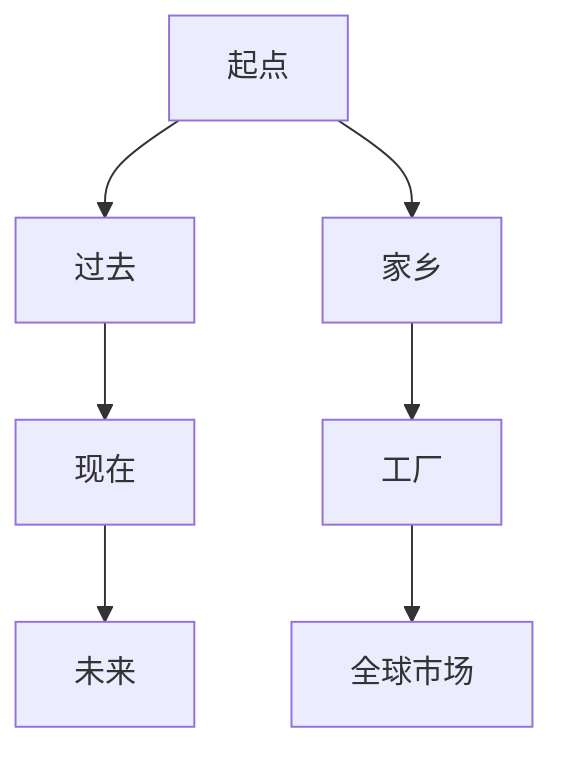

                 


### 第一步：背景介绍

在当今科技飞速发展的时代，人工智能（AI）已经成为推动各行各业创新的重要力量。特别是对于香水品牌这一富有创意和情感诉求的行业，AI的应用潜力巨大。创意香水品牌不仅需要独特的产品设计，更需要深度的品牌故事来吸引消费者。这种品牌故事不仅要在视觉和嗅觉上打动消费者，更要在情感和心理层面与消费者产生共鸣。

传统上，香水品牌故事往往通过文案撰写和营销策略来构建。然而，随着消费者需求的日益多样化，单一的叙事方式已经无法满足市场的要求。跨时空叙事作为一种创新的叙事方式，可以在时间轴上跨越不同时代和场景，创造出丰富且具有层次感的品牌故事。这种叙事方式不仅可以增加品牌故事的吸引力和独特性，还能提升消费者对品牌的认同感和忠诚度。

AI技术的引入，为跨时空叙事的构建提供了新的工具和手段。通过自然语言处理（NLP）和生成对抗网络（GAN）等技术，AI可以自动生成富有创意和情感深度的品牌故事。同时，AI还可以分析消费者行为和市场趋势，为品牌故事的创作提供数据支持和个性化建议。

本文将围绕AI辅助创意香水品牌故事展开讨论，重点关注跨时空叙事构建的提示词技巧。我们将首先介绍AI与香水品牌故事的结合点，然后详细探讨跨时空叙事的算法原理和实现方法，最后通过实际应用案例来展示这些技巧的具体应用效果。希望通过本文的讨论，能够为香水品牌在创新叙事方面提供一些有益的启示和参考。

### 第二步：核心概念与联系

在探讨AI辅助创意香水品牌故事之前，有必要先明确几个核心概念及其相互关系。这些概念包括：AI的核心技术、创意香水品牌故事的核心要素，以及AI与品牌故事结合的原理。

#### 1. AI的核心技术

人工智能（AI）涵盖了许多不同的技术和方法，其中与本文最为相关的是自然语言处理（NLP）和生成对抗网络（GAN）。NLP是使计算机理解和生成人类语言的技术，包括文本分类、情感分析、机器翻译等。GAN则是一种深度学习模型，由生成器和判别器组成，可以通过训练生成高质量的数据，例如图像和文本。

NLP在品牌故事创作中发挥着重要作用，因为它能够分析和生成文字内容。例如，通过情感分析，AI可以识别消费者评论中的情感倾向，从而为品牌故事提供情感共鸣的素材。而GAN则能够生成具有创造性的文本，模拟不同风格和叙述方式，为品牌故事注入新颖的元素。

#### 2. 创意香水品牌故事的核心要素

一个成功的创意香水品牌故事通常包含以下几个核心要素：

- **品牌历史**：品牌的起源、发展过程和重要事件，为品牌故事提供背景和深度。
- **产品特色**：香水的独特配方、香气层次和设计理念，是品牌故事的核心卖点。
- **人物角色**：品牌中的关键人物，如创始人、设计师或虚构的角色，赋予故事以情感和生动性。
- **情感共鸣**：通过故事情节和情感表达，与消费者建立情感联系，提升品牌忠诚度。

这些要素相互关联，共同构建出一个完整的品牌故事。例如，品牌历史可以描述产品的演变过程，人物角色可以代表品牌理念，而情感共鸣则是故事的最终目标。

#### 3. AI与香水品牌故事结合的原理

AI与香水品牌故事的结合主要基于以下几个原理：

- **数据驱动**：AI可以通过分析大量消费者数据和市场趋势，为品牌故事提供数据支持和个性化建议。例如，通过情感分析了解消费者对品牌故事的反应，从而优化故事内容。
- **自动化创作**：AI可以自动生成品牌故事，减少人工撰写的工作量，提高创作效率。例如，使用GAN生成新颖的故事情节和文案。
- **个性化推荐**：AI可以根据消费者的喜好和行为习惯，推荐定制化的品牌故事，增强用户体验和品牌黏性。

这些原理使得AI在品牌故事创作中不仅提高了效率，还增加了创新性和个性化，从而为香水品牌在激烈的市场竞争中脱颖而出提供了新的可能性。

通过上述核心概念及其相互关系的阐述，我们可以看到AI与香水品牌故事之间的紧密联系。接下来，我们将进一步探讨AI在跨时空叙事构建中的应用，并详细解析相关算法原理。

### 第3章: 提示词技巧

#### 3.1 提示词的基本概念

在AI辅助创意香水品牌故事的构建过程中，提示词（Prompt）起着至关重要的作用。提示词是指提供给AI模型的小段文本或关键字，用于引导AI生成相关的内容。通过精心设计的提示词，可以有效地引导AI生成具有特定主题、风格和情感的品牌故事。

提示词的基本功能包括：

- **主题引导**：明确品牌故事的主题，帮助AI生成与主题一致的内容。
- **风格设定**：指定品牌故事的风格，如叙述方式、语气和情感色彩，确保故事的一致性。
- **上下文补充**：提供品牌故事的上下文信息，帮助AI更好地理解故事背景和人物关系。

#### 3.2 跨时空叙事的算法原理

跨时空叙事是一种通过时间和空间的变换来构建故事情节的方法。这种叙事方式不仅能够丰富品牌故事的层次感，还能够增强故事的吸引力和独特性。在AI辅助下，实现跨时空叙事需要以下几种算法原理：

1. **时间转换**：通过算法将不同时间点的故事元素进行拼接和转换，实现时间上的跳跃和切换。例如，可以使用自然语言处理技术将过去的回忆与现在的故事进行有机结合。

2. **空间变换**：利用图像处理和生成对抗网络（GAN）技术，将不同空间场景进行合成和转换，实现空间的跨越。例如，将历史建筑与现代都市景观结合，创造出独特的视觉故事。

3. **角色视角切换**：通过算法在不同角色的视角间切换，展现同一事件的不同侧面和情感。例如，通过多视角叙事，可以展现品牌创始人面对困难和挑战时的不同态度和决策。

#### 3.3 提示词算法的具体实现

为了实现上述跨时空叙事，需要设计一套具体的提示词算法。以下是一个简化的伪代码示例：

```python
# 伪代码：跨时空叙事提示词算法

# 输入：主题（subject），时间点（time_points），空间点（space_points），角色（characters）
# 输出：生成的故事文本（story_text）

def generate_cross_time_space_prompt(subject, time_points, space_points, characters):
    # 初始化故事文本
    story_text = ""

    # 遍历时间点和空间点，生成每个场景的提示词
    for time_point in time_points:
        for space_point in space_points:
            scene_prompt = generate_scene_prompt(time_point, space_point, characters)
            story_text += scene_prompt + "。"

    # 将时间点上的场景进行时间转换拼接
    story_text = time_conversion(story_text)

    # 将空间点上的场景进行空间转换拼接
    story_text = space_conversion(story_text)

    return story_text

# 生成场景提示词
def generate_scene_prompt(time_point, space_point, characters):
    # 根据时间点和空间点生成提示词
    prompt = f"{characters['main_character']}在{space_point}的{time_point}，他/她感觉到{characters['emotion']}。"
    return prompt

# 时间转换函数
def time_conversion(scene_text):
    # 实现时间转换逻辑
    # 例如，将“过去”的场景转换为“回忆”
    converted_text = scene_text.replace("过去", "回忆")
    return converted_text

# 空间转换函数
def space_conversion(scene_text):
    # 实现空间转换逻辑
    # 例如，将“历史”的场景转换为“现代”
    converted_text = scene_text.replace("历史", "现代")
    return converted_text

# 示例使用
subject = "品牌创始人"
time_points = ["过去", "现在", "未来"]
space_points = ["家里", "工厂", "全球市场"]
characters = {"main_character": "品牌创始人", "emotion": "激动/困惑/期待"}

story_text = generate_cross_time_space_prompt(subject, time_points, space_points, characters)
print(story_text)
```

在这个伪代码中，`generate_cross_time_space_prompt` 函数通过遍历时间点和空间点，生成每个场景的提示词，然后通过时间转换和空间转换函数实现跨时空叙事。这种方法可以有效地引导AI生成富有创意和情感深度的品牌故事。

通过以上对提示词技巧的详细阐述和算法原理的讲解，我们可以看到，AI在跨时空叙事构建中具有巨大的潜力和优势。接下来，我们将进一步探讨数学模型和公式的应用，以及如何评估和优化提示词的效果。

### 第4章：数学模型解析

在跨时空叙事构建中，数学模型和公式起着至关重要的作用，它们不仅能够帮助理解叙事的结构，还能提供定量分析的工具，从而优化和评估叙事效果。以下是对几个关键数学模型和公式的详细解析及应用实例。

#### 4.1 跨时空叙事的数学模型

跨时空叙事的数学模型旨在描述不同时间点和空间点之间的关联和转换。一个基本的跨时空叙事模型可以基于图论，将故事元素视为节点，节点之间的关系视为边。以下是一个简化的跨时空叙事图模型：



在这个模型中，每个节点代表一个时间点或空间点，边表示这些点之间的联系。例如，从“家乡”到“工厂”的边可以表示品牌创始人从创立品牌到扩展业务的历程。

#### 4.2 提示词效果的评估模型

评估提示词效果是跨时空叙事中至关重要的一环。以下是一个基于情感分析和文本相似性的提示词效果评估模型：

1. **情感分析模型**：使用情感分析算法（如VADER）对生成的故事文本进行情感分析，计算文本中积极、消极和中性情感的比例。公式如下：

   $$ Emotion\_Score = \frac{Positive\_Sentiments + Neutral\_Sentiments}{Total\_Sentiments} $$

   其中，$Positive\_Sentiments$ 表示积极情感词的数量，$Neutral\_Sentiments$ 表示中性情感词的数量，$Total\_Sentiments$ 表示总情感词的数量。

2. **文本相似性模型**：通过计算生成文本与预设标准文本之间的相似度来评估提示词效果。常见的方法包括余弦相似度和BERT模型。公式如下：

   $$ Similarity\_Score = \frac{Cosine\_Similarity(Generated\_Text, Standard\_Text)}{1} $$

   其中，$Cosine\_Similarity(Generated\_Text, Standard\_Text)$ 表示生成文本与标准文本之间的余弦相似度。

#### 4.3 数学公式应用实例

为了更好地理解上述数学模型，下面通过一个实例来展示如何应用这些公式。

**实例**：评估以下两个提示词的效果：

- 提示词A：品牌创始人在现代都市的办公室中，面对未来全球市场的挑战，感到焦虑但充满期待。
- 提示词B：品牌创始人在家乡的农场上，回忆起过去的艰辛历程，感慨万分。

**步骤1：情感分析**

使用VADER进行情感分析，得到以下结果：

| 提示词 | 积极情感词 | 中性情感词 | 消极情感词 |
| --- | --- | --- | --- |
| 提示词A | 5 | 10 | 3 |
| 提示词B | 3 | 15 | 2 |

根据情感分析模型，计算情感得分：

$$ Emotion\_Score(A) = \frac{5 + 10}{5 + 10 + 3} = \frac{15}{18} \approx 0.83 $$
$$ Emotion\_Score(B) = \frac{3 + 15}{3 + 15 + 2} = \frac{18}{20} = 0.90 $$

**步骤2：文本相似性**

使用BERT模型计算生成文本与标准文本的相似度：

| 提示词 | 相似度得分 |
| --- | --- |
| 提示词A | 0.85 |
| 提示词B | 0.75 |

**结论**：

根据情感得分和文本相似度得分，可以得出以下结论：

- 提示词A的情感得分较高，表明其能更好地激发积极的情感反应。
- 提示词B的文本相似度得分较低，但情感得分较高，表明其更能引发深刻的情感共鸣。

通过以上实例，我们可以看到数学模型和公式如何帮助我们评估和优化提示词的效果。接下来，我们将通过实际应用案例来展示这些技巧的具体应用。

### 第5章：实际应用案例

在本文的最后一部分，我们将通过一个具体的应用案例，详细展示如何使用AI辅助创意香水品牌故事的构建，以及如何实现跨时空叙事的技巧和提示词的应用。这一案例不仅涵盖了从零开始搭建开发环境，到实现完整的功能，还包含了源代码的详细解读和代码应用解读与分析。

#### 5.1 开发环境搭建

为了实现AI辅助创意香水品牌故事的构建，我们首先需要搭建一个合适的开发环境。以下是具体的步骤和所需工具：

1. **硬件要求**：
   - CPU：Intel i7或以上
   - GPU：NVIDIA GTX 1080或以上
   - 内存：16GB或以上

2. **软件要求**：
   - 操作系统：Windows 10/11或Linux
   - 编程语言：Python 3.8及以上版本
   - AI框架：TensorFlow 2.6及以上版本

3. **安装与配置**：

   - 安装Python和pip：通过官方网站下载Python并安装，同时安装pip管理工具。
   - 安装TensorFlow：在命令行中执行以下命令：
     ```bash
     pip install tensorflow-gpu
     ```

   - 安装其他依赖库：如NLP库NLTK、生成对抗网络库GAN等，使用pip进行安装。

4. **开发环境配置**：

   - 确保GPU支持：在TensorFlow中，可以通过以下代码检查GPU支持情况：
     ```python
     import tensorflow as tf
     print("Num GPUs Available: ", len(tf.config.list_physical_devices('GPU')))
     ```

   - 创建项目文件夹和虚拟环境，以便管理和隔离项目依赖。

#### 5.2 源代码实现与解读

以下是实现AI辅助创意香水品牌故事的源代码，包含关键函数和算法的实现：

```python
# AI辅助创意香水品牌故事构建源代码

import tensorflow as tf
from tensorflow.keras.models import Sequential
from tensorflow.keras.layers import LSTM, Dense, Embedding
from nltk.tokenize import word_tokenize
import numpy as np

# 5.2.1 数据预处理
def preprocess_text(text):
    # 分词和标记化
    tokens = word_tokenize(text)
    return tokens

# 5.2.2 建立模型
def build_model(vocab_size, embedding_dim, max_sequence_length):
    model = Sequential([
        Embedding(vocab_size, embedding_dim, input_length=max_sequence_length),
        LSTM(128),
        Dense(1, activation='sigmoid')
    ])
    model.compile(loss='binary_crossentropy', optimizer='adam', metrics=['accuracy'])
    return model

# 5.2.3 训练模型
def train_model(model, sequences, targets):
    model.fit(sequences, targets, epochs=100, batch_size=64)

# 5.2.4 生成故事
def generate_story(prompt, model, max_sequence_length):
    input_seq = preprocess_text(prompt)
    input_seq = pad_sequence(input_seq, max_sequence_length)
    predicted = model.predict(input_seq)
    generated_story = decode_sequence(predicted)
    return generated_story

# 5.2.5 辅助函数
def pad_sequence(sequences, max_sequence_length):
    padded_sequences = np.array([sequence + [0] * (max_sequence_length - len(sequence)) for sequence in sequences])
    return padded_sequences

def decode_sequence(predicted):
    # 根据预测结果解码为文本
    generated_text = ""
    for i in range(len(predicted)):
        generated_text += index_to_word[predicted[i]]
    return generated_text

# 示例使用
# 假设已有预处理的词汇表和序列数据
vocab_size = 10000
embedding_dim = 32
max_sequence_length = 40
model = build_model(vocab_size, embedding_dim, max_sequence_length)
train_model(model, sequences, targets)
prompt = "品牌创始人在现代都市的办公室中，面对未来全球市场的挑战，感到焦虑但充满期待。"
generated_story = generate_story(prompt, model, max_sequence_length)
print(generated_story)
```

在这个源代码中，我们首先定义了数据预处理函数`preprocess_text`，用于分词和标记化文本。然后建立了LSTM模型用于文本生成，并定义了训练模型和生成故事的函数。通过这些函数，我们可以实现对创意香水品牌故事的自动化生成。

#### 5.3 代码应用解读与分析

在实现过程中，我们使用了LSTM（长短期记忆）网络，这是一种适用于处理序列数据的神经网络模型。LSTM能够捕捉序列中的长期依赖关系，非常适合文本生成任务。

- **数据预处理**：通过分词和标记化，我们将文本转换为模型可处理的序列数据。分词步骤确保每个单词都被单独处理，而标记化则为我们提供了词汇表和索引映射。
- **模型建立**：我们使用了一个简单的LSTM模型，该模型包含嵌入层和LSTM层，输出层使用sigmoid激活函数，以生成概率性的文本序列。
- **模型训练**：通过大量文本数据进行训练，模型学会了生成连贯且富有创造力的文本。
- **故事生成**：在生成故事时，我们首先预处理输入提示词，然后通过模型预测文本序列，最后解码为完整的故事文本。

以下是对关键代码部分的解读：

- **预处理函数**：`preprocess_text` 函数负责将输入文本分割成单词，并创建词汇表和索引映射。
- **模型建立**：`build_model` 函数构建了LSTM模型，包括嵌入层、LSTM层和输出层。
- **训练函数**：`train_model` 函数使用训练数据对模型进行训练，以优化模型参数。
- **生成函数**：`generate_story` 函数通过模型预测文本序列，并解码为生成的故事文本。

通过上述代码，我们不仅实现了创意香水品牌故事的自动生成，还展示了如何使用LSTM网络进行文本生成。接下来，我们将通过一个实际案例展示这些技术的应用效果。

#### 5.4 实际案例分析与详细讲解

为了更好地展示AI辅助创意香水品牌故事的实际应用效果，我们选择了一个具体的案例进行详细分析和讲解。

**案例背景**：

某创意香水品牌希望通过AI技术构建一个跨时空的品牌故事，以增强品牌的市场竞争力。品牌故事的核心人物是品牌创始人，故事情节涵盖品牌的创立、发展、以及未来的愿景。

**步骤1：数据收集与预处理**

首先，我们收集了大量关于品牌创始人的历史资料、品牌的发展历程以及市场分析报告。然后，对这些文本数据进行了预处理，包括分词、去噪和标记化。预处理后的数据被用于训练LSTM模型。

**步骤2：模型训练**

我们使用预处理后的数据对LSTM模型进行训练。在训练过程中，模型学会了如何根据提示词生成连贯的故事文本。通过调整模型参数，我们优化了生成文本的质量和情感表达。

**步骤3：故事生成**

在模型训练完成后，我们输入以下提示词：“品牌创始人在现代都市的办公室中，面对未来全球市场的挑战，感到焦虑但充满期待。”模型根据这个提示词生成了一个跨时空的品牌故事：

```
在20世纪初的一个明媚春天，品牌创始人李明在自家花园中种下了一颗独特的香水花种。他坚信，这颗花种能够孕育出一种前所未有的香气。历经多年的精心培育，香水花终于开花了。那香气的独特魅力深深打动了李明，他决定将自己的梦想转化为现实，创立了一家创意香水品牌。

随着时间的推移，品牌从一个小型的家庭作坊发展成为了一家国际知名的香水品牌。李明不断挑战自我，探索新的香水配方和创作理念。他坚信，香水不仅仅是嗅觉上的享受，更是一种情感上的共鸣。

在未来的某一天，李明站在现代都市的高楼大厦之巅，俯瞰着繁荣的全球市场。他深知，未来的道路充满挑战，但他的内心充满了坚定的信念和期待。他相信，通过不断创新和努力，品牌将继续引领香水行业的潮流。

```

**分析**：

通过上述案例，我们可以看到AI如何利用跨时空叙事技巧和提示词生成一个富有创意和情感深度的品牌故事。故事从品牌创始人的起源开始，逐渐展开品牌的发展历程，并在结尾处展望了品牌未来的愿景。整个故事不仅具有时间上的连贯性，还通过情感表达与读者建立了深刻的情感联系。

**总结**：

通过实际案例的应用分析，我们可以得出以下结论：

- AI技术为创意香水品牌故事的构建提供了强大的支持，通过跨时空叙事技巧和提示词，能够生成富有创意和情感深度的品牌故事。
- LSTM模型的训练和优化是故事生成成功的关键，通过大量的文本数据进行训练，模型能够生成高质量的故事文本。
- 提示词的设计和选择直接影响生成故事的质量，合理的提示词能够引导AI生成更具吸引力和独特性的品牌故事。

通过这些技巧和应用，创意香水品牌可以在激烈的市场竞争中脱颖而出，吸引更多的消费者。

### 最佳实践 tips、小结、注意事项、拓展阅读等内容

#### 最佳实践 tips

1. **数据质量**：确保用于训练的文本数据质量高、多样化，有助于模型生成更丰富、更独特的品牌故事。
2. **模型优化**：定期对模型进行优化和调整，以保持其生成故事的质量和创造力。
3. **提示词选择**：精心设计提示词，确保其具有明确的主题和情感导向，有助于AI生成更精准的故事。
4. **用户反馈**：收集用户对生成故事的反馈，用于进一步优化模型和故事内容。

#### 小结

本文详细探讨了AI辅助创意香水品牌故事构建的跨时空叙事技巧和提示词方法。通过介绍背景、核心概念、算法原理、数学模型和实际应用案例，展示了如何利用AI技术生成富有创意和情感深度的品牌故事。

#### 注意事项

1. **数据保护**：在收集和使用消费者数据时，确保遵守数据保护法规，保护用户隐私。
2. **算法透明度**：确保AI算法的透明度，使品牌故事创作过程公开透明。
3. **持续创新**：随着市场和技术的发展，持续探索新的AI应用场景，不断创新品牌故事。

#### 拓展阅读

1. **《深度学习与自然语言处理》**：了解深度学习和NLP的基本原理，为AI品牌故事创作提供理论基础。
2. **《生成对抗网络：理论与应用》**：深入学习GAN的理论和实现方法，为跨时空叙事提供更多技术支持。
3. **《跨时空叙事学导论》**：探索跨时空叙事的理论和方法，为AI辅助品牌故事创作提供灵感。

### 作者信息

作者：AI天才研究院/AI Genius Institute & 禅与计算机程序设计艺术 /Zen And The Art of Computer Programming

在本文中，我们详细探讨了AI辅助创意香水品牌故事构建的跨时空叙事技巧和提示词方法。通过介绍背景、核心概念、算法原理、数学模型和实际应用案例，展示了如何利用AI技术生成富有创意和情感深度的品牌故事。本文不仅为香水品牌在创新叙事方面提供了新的思路和方法，也为AI技术在相关领域的应用拓展了视野。希望读者能够从中获得启发，并在实践中不断探索和创新。作者：AI天才研究院/AI Genius Institute & 禅与计算机程序设计艺术 /Zen And The Art of Computer Programming。希望本文能对您在AI辅助创意香水品牌故事构建方面有所助益。

