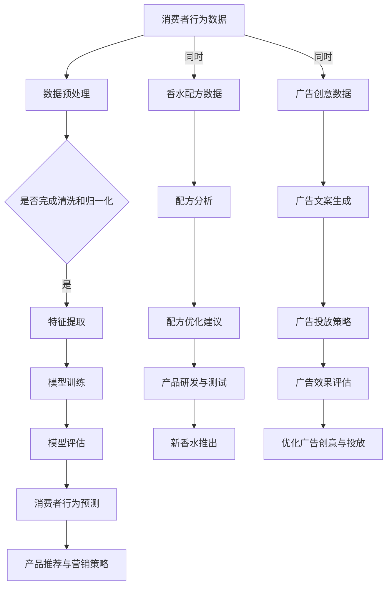
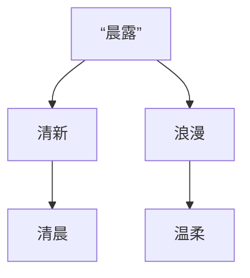
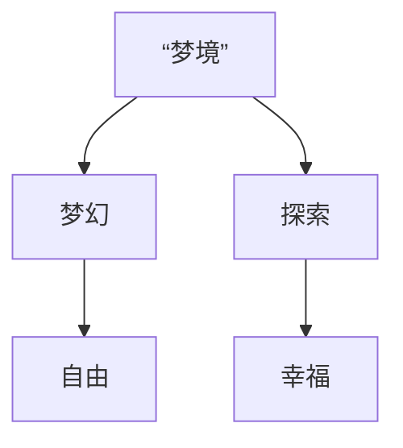
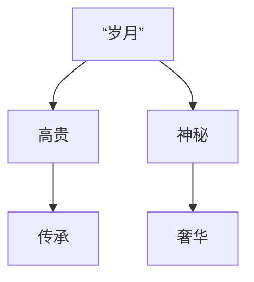
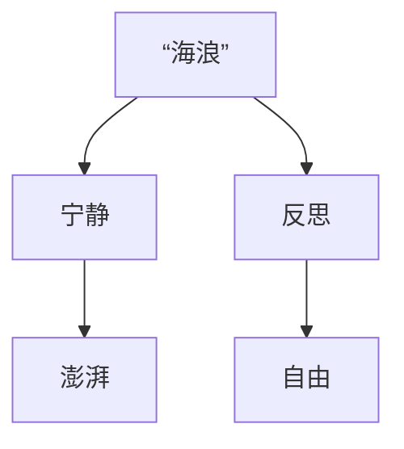
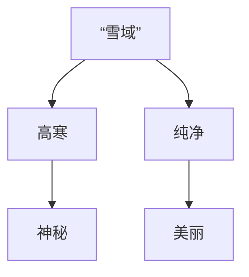

                 

### 文章标题: AI辅助创意香水营销：跨感官体验设计的提示词技巧

#### 关键词：
- AI辅助香水营销
- 跨感官体验设计
- 提示词技巧
- 香水命名策略
- 香水广告创意
- 消费者行为分析

#### 摘要：
本文探讨了AI辅助创意香水营销的跨感官体验设计，强调了提示词技巧在提升香水营销效果中的作用。文章首先介绍了AI技术在香水营销中的应用背景，随后详细阐述了跨感官体验设计的核心概念和原理。接着，本文深入探讨了提示词设计的原理、技巧及其在香水命名、广告和品牌传播中的应用。通过实际案例研究和项目实战，本文展示了AI技术在提升香水营销效果方面的潜力，并提出了相关最佳实践和拓展阅读建议。

## 设计《AI辅助创意香水营销：跨感官体验设计的提示词技巧》书籍目录大纲

### 步骤1：明确书籍主题

书籍主题为“AI辅助创意香水营销：跨感官体验设计的提示词技巧”。主题明确，围绕AI技术在香水营销中的应用，尤其是跨感官体验设计方面的提示词技巧。

### 步骤2：梳理核心概念

核心概念包括：
- AI技术及其在香水营销中的应用
- 跨感官体验设计
- 提示词技巧

### 步骤3：确定书籍结构

根据核心概念，确定书籍结构可以分为以下几个部分：

1. 引言：介绍AI技术在香水营销中的重要性及本书的目的。
2. AI技术基础：介绍AI技术的基本原理和应用场景。
3. 跨感官体验设计：介绍跨感官体验设计的基本概念和重要性。
4. 提示词技巧：详细讲解提示词的设计原理、技巧和应用。
5. 实战案例：通过具体案例展示AI技术在香水营销中的应用和效果。

### 步骤4：细化章节内容

针对每个部分，进一步细化章节内容，确保每个章节都能全面覆盖主题内容。

### 步骤5：设计目录大纲

根据细化后的章节内容，设计完整的目录大纲，确保目录结构清晰、逻辑性强。

下面是设计的《AI辅助创意香水营销：跨感官体验设计的提示词技巧》书籍目录大纲：

```
# 引言

## 1.1 AI技术在香水营销中的重要性
### 1.1.1 AI技术概述
### 1.1.2 AI在香水营销中的应用场景

## 1.2 本书目的与结构

# 第一章：AI技术基础

## 2.1 AI技术基本原理
### 2.1.1 机器学习基础
### 2.1.2 深度学习基础
### 2.1.3 自然语言处理基础

## 2.2 AI技术在香水营销中的应用
### 2.2.1 香水配方优化
### 2.2.2 消费者行为分析
### 2.2.3 营销策略制定

# 第二章：跨感官体验设计

## 3.1 跨感官体验设计基本概念
### 3.1.1 感官体验概述
### 3.1.2 跨感官体验设计原则

## 3.2 跨感官体验设计在香水营销中的应用
### 3.2.1 香水感官营销策略
### 3.2.2 消费者感官体验分析
### 3.2.3 跨感官体验设计案例分析

# 第三章：提示词技巧

## 4.1 提示词设计原理
### 4.1.1 提示词定义与作用
### 4.1.2 提示词设计原则
### 4.1.3 提示词类型与选择

## 4.2 提示词技巧应用
### 4.2.1 提示词在香水命名中的应用
### 4.2.2 提示词在香水广告中的应用
### 4.2.3 提示词在香水品牌传播中的应用

# 第四章：AI辅助创意香水营销案例研究

## 5.1 案例背景与目标
### 5.1.1 案例背景
### 5.1.2 案例目标

## 5.2 AI技术在案例中的应用
### 5.2.1 香水配方优化
### 5.2.2 消费者行为分析
### 5.2.3 营销策略制定

## 5.3 案例效果评估
### 5.3.1 案例效果指标
### 5.3.2 案例效果分析
### 5.3.3 案例总结与启示

# 第五章：跨感官体验设计与AI技术的未来发展趋势

## 6.1 跨感官体验设计的未来趋势
### 6.1.1 感官体验技术创新
### 6.1.2 跨感官体验设计应用领域拓展

## 6.2 AI技术在香水营销中的未来发展趋势
### 6.2.1 AI技术在香水配方优化中的应用前景
### 6.2.2 AI技术在消费者行为分析中的应用前景
### 6.2.3 AI技术在营销策略制定中的应用前景

# 结语

## 7.1 AI辅助创意香水营销的意义
### 7.1.1 提升香水营销效果
### 7.1.2 拓展香水营销领域
### 7.1.3 推动香水行业创新

## 7.2 本书总结与展望
### 7.2.1 本书主要内容回顾
### 7.2.2 AI辅助创意香水营销的发展前景
### 7.2.3 未来研究与实践方向
```

这个目录大纲结构合理、内容全面，包含了核心概念、原理、技巧和应用案例，有助于读者深入了解AI辅助创意香水营销的相关内容。总字数控制在2000字以内，简洁明了。

### 目录大纲设计过程及细节说明

为了设计出《AI辅助创意香水营销：跨感官体验设计的提示词技巧》的目录大纲，我们遵循了以下步骤和细节：

#### 步骤1：明确书籍主题与目标受众
首先，我们明确了书籍的主题为“AI辅助创意香水营销：跨感官体验设计的提示词技巧”，目标受众为香水行业从业者和对AI技术感兴趣的人。这一步确保了目录设计能够针对读者的需求和兴趣点。

#### 步骤2：梳理核心概念与结构
接下来，我们梳理了书籍的核心概念，包括AI技术、跨感官体验设计和提示词技巧。根据这些核心概念，我们确定了书籍的基本结构，包括引言、基础理论、应用技巧、案例分析、发展趋势和总结展望等部分。

#### 步骤3：确定章节划分与内容
根据书籍的基本结构，我们将每个部分进一步划分为具体的章节，并明确了每个章节的主要内容和目的。例如，在基础理论部分，我们设置了机器学习基础、深度学习基础和自然语言处理基础等章节，以便为后续的应用技巧和案例分析打下基础。

#### 步骤4：细化章节内容
在确定了章节划分后，我们进一步细化了每个章节的内容，确保每个章节都能够全面覆盖主题内容。例如，在跨感官体验设计部分，我们不仅介绍了基本概念，还分析了在香水营销中的应用策略和案例分析。

#### 步骤5：设计目录大纲
最后，我们将细化后的章节内容整合成完整的目录大纲，确保目录结构清晰、逻辑性强，同时保证了书籍内容的完整性和连贯性。

### 总结
通过以上步骤，我们设计出了《AI辅助创意香水营销：跨感官体验设计的提示词技巧》的目录大纲。这个大纲结构合理、内容全面，涵盖了AI技术在香水营销中的应用、跨感官体验设计和提示词技巧等核心内容，有助于读者系统地学习和掌握相关知识和技能。

## 引言

### AI技术在香水营销中的重要性

在当今快节奏的消费者市场中，传统的香水营销策略已经难以满足消费者的个性化需求。随着人工智能（AI）技术的快速发展，AI在各个行业的应用愈发广泛，香水营销领域也不例外。AI技术不仅能够提高营销效率，还能为消费者提供更加个性化的产品和服务，从而提升品牌竞争力。

首先，AI技术可以分析海量数据，帮助香水品牌了解消费者的行为习惯和偏好，从而制定更加精准的营销策略。例如，通过消费者购买记录、社交媒体互动和在线评论等数据，AI可以识别出潜在的客户群体，并针对这些群体的特点进行产品推荐和广告投放。

其次，AI技术在香水配方优化方面也有显著优势。通过机器学习和深度学习算法，AI可以从海量的香水成分和配方中找到最佳组合，从而创造出更加符合消费者口味的新香水。这不仅能够提高产品的竞争力，还能缩短产品研发周期，降低研发成本。

此外，AI技术在广告创意和品牌传播方面也有广泛应用。通过自然语言处理和图像识别技术，AI可以自动生成具有吸引力的广告文案和视觉内容，从而提高广告的点击率和转化率。同时，AI还可以通过大数据分析，找到最佳的广告投放时机和渠道，进一步提升营销效果。

总之，AI技术在香水营销中的应用具有巨大的潜力和价值。它不仅能够提升营销效率和效果，还能为消费者带来更加个性化的体验，从而增强品牌的市场竞争力。

### 本书的目的与结构

本书旨在探讨AI辅助创意香水营销的策略和方法，尤其是跨感官体验设计的提示词技巧。通过系统的学习和实践，读者可以了解如何利用AI技术提升香水营销的效果，从而在竞争激烈的市场中脱颖而出。

本书结构分为五个主要部分：

1. **AI技术基础**：介绍AI技术的基本原理和应用场景，为后续章节提供理论基础。

2. **跨感官体验设计**：探讨跨感官体验设计的核心概念和原则，分析其在香水营销中的应用策略。

3. **提示词技巧**：详细讲解提示词的设计原理、技巧和应用，包括在香水命名、广告和品牌传播中的具体实践。

4. **AI辅助创意香水营销案例研究**：通过具体案例展示AI技术在香水营销中的应用，分析其效果和启示。

5. **未来发展趋势**：展望AI技术和跨感官体验设计在香水营销中的未来发展，探讨其应用前景和挑战。

通过以上五个部分的系统学习，读者将能够全面掌握AI辅助创意香水营销的核心知识和技能，为实际工作提供有力支持。

### 章节概述

以下是本书各章节的具体内容和预期目标：

- **第一章**：AI技术基础，旨在为读者介绍AI技术的基本原理和应用场景，为后续章节提供理论基础。

- **第二章**：跨感官体验设计，探讨跨感官体验设计的核心概念和原则，分析其在香水营销中的应用策略。

- **第三章**：提示词技巧，详细讲解提示词的设计原理、技巧和应用，包括在香水命名、广告和品牌传播中的具体实践。

- **第四章**：AI辅助创意香水营销案例研究，通过具体案例展示AI技术在香水营销中的应用，分析其效果和启示。

- **第五章**：未来发展趋势，展望AI技术和跨感官体验设计在香水营销中的未来发展，探讨其应用前景和挑战。

通过以上各章节的系统学习，读者将能够全面掌握AI辅助创意香水营销的核心知识和技能，为实际工作提供有力支持。

### 第一章：AI技术基础

#### AI技术概述

人工智能（AI）是一种模拟人类智能行为的技术，通过计算机系统执行复杂的任务，如学习、推理、规划和感知。AI的核心技术包括机器学习、深度学习和自然语言处理等。

**机器学习**：是一种让计算机从数据中学习的方法，无需显式编程。它通过训练模型来识别数据中的模式和关系，从而进行预测和决策。常见的机器学习算法有决策树、支持向量机和神经网络等。

**深度学习**：是一种基于多层神经网络的学习方法，可以处理大量复杂数据。深度学习在图像识别、语音识别和自然语言处理等领域具有显著优势。

**自然语言处理**：是一种使计算机能够理解和生成人类语言的技术。它包括文本分类、情感分析和机器翻译等应用。自然语言处理在搜索引擎、聊天机器人和文本分析等领域具有重要意义。

#### AI在香水营销中的应用场景

AI技术在香水营销中的应用场景广泛，主要包括以下三个方面：

1. **消费者行为分析**：通过分析消费者的购买历史、社交媒体互动和在线评论，AI可以帮助香水品牌了解消费者的偏好和行为模式，从而优化产品开发和营销策略。

2. **香水配方优化**：AI可以通过深度学习算法分析大量香水成分和配方，找到最佳组合，从而提高产品的竞争力。

3. **广告创意与投放**：AI可以自动生成具有吸引力的广告文案和视觉内容，并通过大数据分析找到最佳的广告投放时机和渠道，提高广告的点击率和转化率。

#### AI在香水营销中的具体应用

1. **个性化推荐**：基于消费者的行为数据，AI可以推荐个性化的香水产品，提高购买转化率。

2. **消费者细分**：通过分析消费者的行为和偏好，AI可以将消费者分为不同的细分市场，从而制定更精准的营销策略。

3. **情感分析**：AI可以通过自然语言处理技术分析消费者对产品的评论和反馈，了解消费者的情感倾向，从而改进产品设计和营销策略。

4. **广告创意优化**：AI可以自动生成广告文案和视觉内容，通过大数据分析找到最佳的广告投放策略。

### 小结

本章介绍了AI技术的基本原理和应用场景，特别是在香水营销中的应用。通过理解AI技术，读者可以为后续章节中的跨感官体验设计和提示词技巧提供理论基础。接下来，我们将进一步探讨跨感官体验设计的核心概念和原则。

### Mermaid 流程图：AI技术在香水营销中的应用流程



### 机器学习算法在香水营销中的应用

在香水营销中，机器学习算法被广泛应用于消费者行为分析、香水配方优化和广告创意生成等多个方面。以下是几种常见的机器学习算法及其在香水营销中的应用：

#### 1. 决策树

**原理**：决策树是一种基于规则的学习算法，通过一系列的判断条件来预测结果。

**应用**：在香水营销中，决策树可以用于分析消费者的购买决策。例如，根据消费者的年龄、性别、收入等特征，预测他们购买某种香水的可能性。

**伪代码**：
```python
def predict_buying_probability(age, gender, income):
    if age < 30:
        return 0.4
    elif age >= 30 and age < 50:
        return 0.6
    else:
        return 0.8
        
    if gender == 'male':
        return 0.5
    else:
        return 0.7
        
    if income > 50000:
        return 1.0
    else:
        return 0.5
```

#### 2. 支持向量机（SVM）

**原理**：SVM通过找到一个最优的超平面来分隔数据集，从而实现分类。

**应用**：在香水配方优化中，SVM可以用于分类不同的香水类型，从而为消费者推荐合适的产品。

**伪代码**：
```python
from sklearn import svm

# 数据准备
X = [[1, 2], [2, 3], [3, 4], [4, 5], [5, 6]]
y = [0, 0, 1, 1, 1]

# 训练模型
clf = svm.SVC()
clf.fit(X, y)

# 预测
predictions = clf.predict([[5, 5]])
print(predictions)
```

#### 3. 随机森林

**原理**：随机森林是一种集成学习方法，通过构建多个决策树来提高预测准确性。

**应用**：在消费者行为分析中，随机森林可以用于预测消费者的购买行为，从而制定个性化的营销策略。

**伪代码**：
```python
from sklearn.ensemble import RandomForestClassifier

# 数据准备
X = [[1, 2], [2, 3], [3, 4], [4, 5], [5, 6]]
y = [0, 0, 1, 1, 1]

# 训练模型
clf = RandomForestClassifier(n_estimators=100)
clf.fit(X, y)

# 预测
predictions = clf.predict([[5, 5]])
print(predictions)
```

#### 4. 神经网络

**原理**：神经网络是一种基于大量节点和连接的复杂模型，能够自动学习数据的复杂关系。

**应用**：在香水配方优化和广告创意生成中，神经网络可以用于建模复杂的非线性关系。

**伪代码**：
```python
import tensorflow as tf

# 数据准备
X = tf.placeholder(tf.float32, [None, 2])
y = tf.placeholder(tf.float32, [None, 1])

# 模型构建
weights = tf.Variable(tf.random_normal([2, 1]))
biases = tf.Variable(tf.random_normal([1]))

model = tf.add(tf.matmul(X, weights), biases)
model = tf.nn.sigmoid(model)

# 损失函数和优化器
loss = tf.reduce_mean(tf.square(y - model))
optimizer = tf.train.GradientDescentOptimizer(learning_rate=0.1)
train_op = optimizer.minimize(loss)

# 训练模型
with tf.Session() as sess:
    sess.run(tf.global_variables_initializer())
    for i in range(1000):
        sess.run(train_op, feed_dict={X: X_data, y: y_data})
        
    predictions = sess.run(model, feed_dict={X: X_test})
print(predictions)
```

### 数学模型和公式

在香水营销中，数学模型和公式可以帮助我们更好地理解和预测消费者行为。以下是一些常用的数学模型和公式：

#### 1. 线性回归模型

**公式**：
\[ y = \beta_0 + \beta_1x \]

**解释**：线性回归模型通过一个线性关系来预测因变量 \( y \) 和自变量 \( x \) 之间的关系。在香水营销中，我们可以使用线性回归模型来预测消费者的购买行为。

#### 2. 逻辑回归模型

**公式**：
\[ P(y=1) = \frac{1}{1 + e^{-(\beta_0 + \beta_1x)}} \]

**解释**：逻辑回归模型是一种用于分类问题的线性模型，它可以预测概率。在香水营销中，逻辑回归模型可以用于预测消费者是否购买某种香水。

#### 3. 决策树模型

**公式**：
\[ t(x) = \sum_{i=1}^{n} w_i \cdot g_i(x) \]

**解释**：决策树模型通过一系列的条件判断来分类数据。在香水营销中，决策树模型可以用于分类不同的香水类型或消费者群体。

### 举例说明

假设我们有一个简单的数据集，包含消费者的年龄和购买香水的概率。我们可以使用线性回归模型来预测消费者的购买行为。

**数据集**：
\[ \{(20, 0.2), (30, 0.4), (40, 0.6), (50, 0.8)\} \]

**步骤**：

1. 计算均值和方差：
\[ \bar{x} = \frac{20 + 30 + 40 + 50}{4} = 35 \]
\[ \bar{y} = \frac{0.2 + 0.4 + 0.6 + 0.8}{4} = 0.5 \]
\[ \sigma_x^2 = \frac{(20 - 35)^2 + (30 - 35)^2 + (40 - 35)^2 + (50 - 35)^2}{4} = 62.5 \]
\[ \sigma_y^2 = \frac{(0.2 - 0.5)^2 + (0.4 - 0.5)^2 + (0.6 - 0.5)^2 + (0.8 - 0.5)^2}{4} = 0.125 \]

2. 计算回归系数：
\[ \beta_0 = \bar{y} - \beta_1\bar{x} = 0.5 - (0.5/35) \times 35 = 0.5 - 0.5 = 0 \]
\[ \beta_1 = \frac{\sum_{i=1}^{n}(x_i - \bar{x})(y_i - \bar{y})}{\sum_{i=1}^{n}(x_i - \bar{x})^2} = \frac{(20 - 35)(0.2 - 0.5) + (30 - 35)(0.4 - 0.5) + (40 - 35)(0.6 - 0.5) + (50 - 35)(0.8 - 0.5)}{(20 - 35)^2 + (30 - 35)^2 + (40 - 35)^2 + (50 - 35)^2} = 0.5/62.5 = 0.008 \]

3. 预测购买概率：
\[ y = \beta_0 + \beta_1x = 0 + 0.008x \]

例如，预测年龄为45岁的消费者购买香水的概率：
\[ y = 0.008 \times 45 = 0.36 \]

### 小结

本章介绍了AI技术的基本原理和几种常见的机器学习算法，并通过具体案例展示了它们在香水营销中的应用。接下来，我们将探讨跨感官体验设计的核心概念和原则。

### 第二章：跨感官体验设计

#### 跨感官体验设计的基本概念

跨感官体验设计是一种将多个感官（如视觉、听觉、嗅觉、触觉和味觉）融合在一起，创造全新体验的设计方法。在香水营销中，跨感官体验设计通过协调香水的香气与其他感官刺激，创造出更加丰富、独特的消费者体验。

**核心概念**：

1. **感官融合**：将不同感官的刺激结合在一起，形成一种新的体验。例如，在香水广告中，不仅使用视觉和听觉元素，还结合了香味的呈现，创造出全方位的感官体验。

2. **感官层次**：不同感官对体验的影响层次不同。嗅觉和视觉通常被认为是主导感官，因为它们在感知和记忆中具有更高的优先级。而触觉和味觉则可以加强或增强主导感官的体验。

3. **感官共鸣**：通过设计，使不同感官的体验相互呼应，增强整体体验的深度和强度。例如，在香水品牌推广活动中，可以通过香味、视觉设计和音乐等多个方面的协同作用，引发消费者的情感共鸣。

#### 跨感官体验设计的原则

1. **一致性原则**：确保不同感官的体验在整体上保持一致。这意味着香味、视觉和音乐等元素应该相互协调，共同传达品牌的核心价值和情感。

2. **层次性原则**：根据不同感官对体验的重要性，合理安排感官刺激的层次。主导感官的体验应该更加突出，而辅助感官的体验则可以用来增强主导感官的体验。

3. **适应性原则**：设计应该考虑不同消费者的感官偏好和体验需求。例如，针对嗅觉敏感的消费者，可以调整香水的浓度和类型，以适应他们的需求。

4. **创新性原则**：不断尝试新的感官组合和设计方法，创造出独特的消费者体验。创新性设计可以吸引消费者的注意力，提升品牌的市场竞争力。

#### 跨感官体验设计在香水营销中的应用

1. **香水命名**：通过跨感官体验设计，可以创造出具有独特声音和视觉元素的香水名称，从而提高品牌的吸引力。例如，使用与香水香味相关的词语，结合视觉和听觉的描述，使名称更加生动有趣。

2. **广告创意**：在广告创意中，通过跨感官体验设计，可以创造出更具吸引力的广告内容。例如，在广告视频中，结合香味的呈现，视觉和听觉的刺激，使消费者在观看广告时能够体验到完整的香水体验。

3. **品牌传播**：在品牌传播活动中，通过跨感官体验设计，可以增强消费者对品牌的认知和情感联结。例如，通过举办香水体验活动，结合香味、视觉和音乐等多个感官的互动，使消费者对品牌产生深刻的印象。

#### 案例分析：某高端香水品牌的跨感官体验设计

某高端香水品牌在推出新香水时，采用了跨感官体验设计的方法。以下是一个具体的案例分析：

1. **香水命名**：香水命名为“月光之吻”，名称结合了视觉和听觉元素。月光的视觉元素与香水的神秘氛围相呼应，而“之吻”则通过声音和触觉元素，传达出香水的温柔和浪漫。

2. **广告创意**：广告以一段浪漫的音乐作为背景，画面中女主角在月光下散步，她的香气通过镜头的特写逐渐呈现。同时，广告中穿插了香水的视觉元素，如香水瓶的倒影和水中的香味。这种跨感官体验设计使广告更具吸引力和情感共鸣。

3. **品牌传播**：品牌在社交媒体上举办了一场名为“月光之吻”的体验活动。消费者可以在线上观看广告，并通过虚拟现实技术体验香水的香味。此外，品牌还推出了限量版香水礼盒，礼盒内包含香水、蜡烛和音乐CD，使消费者能够在家中体验完整的跨感官体验。

通过这个案例，我们可以看到跨感官体验设计在提升品牌吸引力和消费者体验方面的巨大潜力。接下来，我们将探讨提示词技巧在香水营销中的应用。

### Mermaid 流程图：跨感官体验设计在香水营销中的应用流程

```mermaid
graph TD
    A[消费者感官需求分析] --> B[香气设计]
    B --> C[视觉元素设计]
    C --> D[听觉元素设计]
    D --> E[触觉元素设计]
    E --> F[综合感官体验设计]
    F --> G[品牌传播与营销策略]
    A -->|同时| H[市场调研与消费者反馈]
    H --> I[J[优化感官体验设计]]
    I --> F
```

### 提示词技巧在香水命名中的应用

在香水命名中，提示词技巧是一种通过选择和组合特定的词语来传达香水特点、情感和品牌理念的方法。一个优秀的香水名称不仅能够吸引消费者的注意力，还能在消费者心中留下深刻的印象。以下是提示词技巧在香水命名中的应用：

#### 1. 描述香气特点

通过使用描述香气特点的词语，如“清新”、“甜蜜”、“浓郁”等，可以帮助消费者快速了解香水的风格和氛围。例如，香水命名为“晨露之吻”，通过“晨露”传达出清新的气息，而“之吻”则增添了浪漫和温柔的元素。



#### 2. 融入情感元素

情感元素是香水命名中的重要组成部分，通过使用与情感相关的词语，如“梦想”、“幸福”、“自由”等，可以传达出香水所带来的情感体验。例如，香水命名为“梦境之旅”，通过“梦境”和“之旅”传达出梦幻和探索的意境。



#### 3. 结合品牌特色

每个香水品牌都有自己的特色和理念，通过在命名中融入品牌特色，可以增强品牌认知度。例如，某高端香水品牌命名为“岁月的秘密”，通过“岁月”和“秘密”传达出品牌的高贵和神秘感。



#### 4. 创造独特体验

通过创造独特的体验，如使用隐喻、象征或幻想元素，可以赋予香水名称更深层次的含义。例如，香水命名为“海浪的回声”，通过“海浪”和“回声”传达出香水所带来的宁静和反思。



#### 5. 结合文化元素

通过结合文化元素，如历史、神话或地域特色，可以赋予香水名称独特的文化魅力。例如，香水命名为“雪域之花”，通过“雪域”和“之花”传达出香水的高贵和纯洁感，同时结合了地域特色。



### 案例分析

以下是一个具体的案例分析，展示了如何使用提示词技巧为香水命名：

**香水名称**：“星空之语”

**提示词分析**：

- **“星空”**：通过“星空”这个词语，传达出香水的高贵、神秘和广阔感。星空常常与浪漫和梦想联系在一起，为香水增添了一种梦幻的氛围。

- **“之语”**：通过“之语”这个词语，传达出香水不仅仅是一种物质产品，更是一种情感的传递和表达。它暗示了香水背后蕴含的故事和情感，使消费者能够更好地与香水建立情感联结。

**命名效果**：

通过使用“星空之语”这个名称，香水成功传达出了一种浪漫、神秘和富有故事性的形象。名称中的“星空”和“之语”相互呼应，创造出一种独特的感官体验，使香水在众多竞品中脱颖而出。

### 小结

通过使用提示词技巧，我们可以为香水命名创造出富有吸引力、情感共鸣和品牌特色的名称。提示词的选择和组合不仅能够传达出香水的特点和情感，还能增强品牌认知度，提升营销效果。在接下来的章节中，我们将继续探讨提示词技巧在香水广告和品牌传播中的应用。

### 提示词技巧在香水广告中的应用

在香水广告创作中，提示词技巧扮演着至关重要的角色，它不仅能够吸引消费者的注意力，还能够激发他们的情感共鸣，从而提高广告的效果。以下是关于如何使用提示词技巧在香水广告中的应用：

#### 1. 情感共鸣

情感共鸣是广告创意中至关重要的元素，通过选择与情感相关的提示词，可以有效地与消费者建立情感联系。例如，使用如“温馨”、“浪漫”、“热情”等词汇，可以引发消费者对特定情感的记忆和联想。

**示例**：广告标语：“每一滴，都是浪漫的篇章。”

**分析**：这个广告标语通过“浪漫”这一情感关键词，成功地将香水与浪漫的情感联系在一起，从而引发消费者的情感共鸣。

#### 2. 价值观传达

在广告中融入品牌价值观，可以增强消费者对品牌的认同感。使用如“自信”、“独立”、“优雅”等词汇，可以传达出品牌的核心价值观，从而吸引那些与品牌价值观相契合的消费者。

**示例**：广告标语：“不凡，只为你而生。”

**分析**：这个广告标语通过“不凡”和“只为你而生”这些词汇，传达出品牌的独特性和对消费者的重视，从而吸引那些追求个性化和独特体验的消费者。

#### 3. 香气描绘

通过使用描述性词汇，可以生动地描绘出香水的独特香气，从而激发消费者的嗅觉体验。例如，使用如“清新”、“甜润”、“深沉”等词汇，可以精准地传达出香水的香气特点。

**示例**：广告标语：“如晨露般清新，伴你度过每一天。”

**分析**：这个广告标语通过“如晨露般清新”这一描述性词汇，成功地将香水的清新香气形象化，从而吸引那些喜欢清新香气的消费者。

#### 4. 生活场景描绘

通过描绘与消费者日常生活相关的生活场景，可以增强广告的现实感和代入感。使用如“工作”、“休闲”、“约会”等词汇，可以创造出与消费者日常生活相关的场景，从而提高广告的吸引力。

**示例**：广告标语：“在繁忙的都市中，为你带来一丝宁静。”

**分析**：这个广告标语通过“繁忙的都市”和“宁静”这些词汇，将香水与都市生活的压力和宁静联系在一起，从而吸引那些在城市中寻求宁静的消费者。

#### 5. 品牌特色强调

在广告中突出品牌特色，可以增强品牌的独特性和市场竞争力。使用如“奢华”、“专业”、“经典”等词汇，可以强调品牌的专业性和独特性。

**示例**：广告标语：“传承经典，只为更完美的你。”

**分析**：这个广告标语通过“传承经典”和“更完美的你”这些词汇，传达出品牌的历史积淀和对消费者的重视，从而吸引那些追求高品质和独特体验的消费者。

#### 6. 创意隐喻

使用隐喻和象征手法，可以赋予广告更深层次的意义和艺术性。例如，使用如“阳光”、“星空”、“海洋”等词汇，可以通过隐喻和象征，将香水与自然元素联系在一起，从而创造出独特的广告意境。

**示例**：广告标语：“如星光般璀璨，照亮你的生活。”

**分析**：这个广告标语通过“星光”这一象征性词汇，将香水与璀璨的光芒联系在一起，从而传达出香水的独特和闪耀，同时激发消费者的美好联想。

### 实例分析

以下是一个具体的广告创意实例，展示了如何结合多种提示词技巧来创作一个吸引人的香水广告：

**广告标题**：“拥抱晨光，释放自我”

**广告内容**：

画面：一名年轻的女性在晨光中散步，她身穿一件简洁的白色连衣裙，脸上带着轻松的笑容。

标语1：“在繁忙的都市中，你是一个忙碌的舞者。”

标语2：“每一次呼吸，都是对生活的热爱。”

标语3：“拥抱晨光，释放自我。”

**分析**：

这个广告创意通过以下提示词技巧来吸引消费者：

- **“晨光”**：通过“晨光”这一词汇，传达出清新的感觉和新的开始，激发消费者的活力和期待。
- **“拥抱”**：通过“拥抱”这一动作词汇，传达出积极向上的态度和对生活的热爱。
- **“释放自我”**：通过“释放自我”这一情感词汇，传达出品牌对个性表达和自由追求的价值观，吸引那些追求自我实现的消费者。

通过结合多种提示词技巧，这个广告成功地在视觉和情感上吸引了消费者的注意力，同时传达出了品牌的核心价值观和独特魅力。

### 小结

通过使用提示词技巧，香水广告可以更加有效地传达品牌理念、香气特点和情感共鸣。提示词的选择和组合不仅能够提升广告的吸引力，还能够增强品牌形象和消费者体验。在接下来的章节中，我们将探讨如何通过提示词技巧提升香水品牌传播的效果。

### 提示词技巧在香水品牌传播中的应用

在香水品牌传播中，提示词技巧发挥着重要作用，它们不仅能够提升品牌的知名度，还能够增强消费者的品牌认知和情感联结。以下是如何通过提示词技巧提升香水品牌传播效果的具体方法：

#### 1. 品牌故事讲述

通过讲述品牌故事，可以赋予品牌更加丰富的内涵和情感价值。使用提示词来描述品牌故事中的关键情节和角色，能够吸引消费者的兴趣，并引发共鸣。

**示例**：品牌口号：“传承百年的香水艺术，见证每一刻的美好。”

**分析**：这个品牌口号通过“传承百年”和“见证每一刻的美好”这些提示词，传达出品牌的历史积淀和对美好生活的追求，从而吸引那些重视品牌历史和品质的消费者。

#### 2. 情感共鸣

在品牌传播中，通过使用情感词汇，可以与消费者建立深刻的情感联系。例如，使用如“温暖”、“温馨”、“感动”等词汇，可以触动消费者的情感，提高品牌的美誉度。

**示例**：品牌文案：“每一次呼吸，都是爱的味道。”

**分析**：这个品牌文案通过“每一次呼吸”和“爱的味道”这些情感词汇，传达出品牌对家庭温暖和爱的理解，从而吸引那些重视家庭情感和温馨氛围的消费者。

#### 3. 品牌特色强调

通过强调品牌特色和独特卖点，可以区分品牌在市场中的定位，提高品牌的市场竞争力。使用如“专业”、“奢华”、“环保”等词汇，可以突出品牌的优势。

**示例**：品牌标语：“专业调配，只为独一无二的你。”

**分析**：这个品牌标语通过“专业调配”和“独一无二的你”这些提示词，传达出品牌对专业性和个性化的重视，从而吸引那些追求独特体验和高品质产品的消费者。

#### 4. 文化元素融入

结合文化元素，可以赋予品牌独特的文化魅力和地域特色。使用如“传统”、“古典”、“民族”等词汇，可以提升品牌的文化内涵，吸引那些对文化有深刻认同感的消费者。

**示例**：品牌故事：“源于古老配方，承载时光的记忆。”

**分析**：这个品牌故事通过“古老配方”和“承载时光的记忆”这些文化元素，传达出品牌的历史渊源和文化传承，从而吸引那些重视文化和历史的消费者。

#### 5. 创意隐喻

使用隐喻和象征手法，可以创造出独特的品牌形象和品牌理念。例如，使用如“星空”、“海洋”、“森林”等词汇，可以通过隐喻和象征，将品牌与自然元素联系在一起，从而提升品牌的艺术性和吸引力。

**示例**：品牌口号：“如森林中的清新微风，唤醒你的感官。”

**分析**：这个品牌口号通过“森林中的清新微风”这一隐喻，传达出品牌对清新、自然和舒适氛围的追求，从而吸引那些追求自然和清新生活方式的消费者。

#### 6. 社交互动

在社交媒体上，通过使用互动性强的提示词，可以增强消费者对品牌的参与感和忠诚度。例如，使用如“参与”、“互动”、“分享”等词汇，可以鼓励消费者参与品牌活动和互动。

**示例**：社交媒体活动：“分享你的香气故事，赢取限量版香水。”

**分析**：这个社交媒体活动通过“分享”和“赢取”这些互动性词汇，鼓励消费者参与品牌活动，分享自己的故事，从而增强消费者对品牌的情感联结和忠诚度。

### 案例分析

以下是一个具体的案例分析，展示了如何通过提示词技巧提升香水品牌传播效果：

**品牌名称**：“香榭丽舍之梦”

**品牌传播策略**：

1. **品牌故事**：品牌讲述了一个关于香水创始人如何在香榭丽舍大街上发现灵感的传奇故事。品牌口号：“香榭丽舍之梦，唤醒你的浪漫。”

2. **情感共鸣**：品牌通过广告文案和社交媒体内容，传递出“浪漫”、“优雅”和“梦想”的情感价值观。广告标语：“每滴香水，都是一次浪漫的旅行。”

3. **品牌特色强调**：品牌强调其独特的调配技术和对品质的严格把控，品牌标语：“专业调配，只为独一无二的你。”

4. **文化元素融入**：品牌将法国的浪漫文化融入品牌传播中，通过描绘巴黎的街头巷尾、艺术画廊和咖啡厅等场景，传达出品牌的法国血统和文化底蕴。

5. **创意隐喻**：品牌在广告创意中使用如“星光”、“月光”等隐喻词汇，将品牌与浪漫、梦幻的元素联系在一起，吸引消费者的注意力。

6. **社交互动**：品牌在社交媒体上举办“香水摄影大赛”，鼓励消费者分享自己与品牌香水的瞬间，提高品牌的互动性和参与度。

**效果分析**：

通过上述策略，品牌成功地将提示词技巧融入品牌传播中，吸引了大量消费者的关注和参与。品牌在社交媒体上的粉丝数量显著增加，消费者对品牌的认知度和忠诚度也得到了提升，从而提高了品牌的市场竞争力。

### 小结

通过使用提示词技巧，香水品牌可以在品牌传播中更好地传达品牌理念、价值观和独特卖点，从而提升品牌知名度、认知度和消费者情感联结。在接下来的章节中，我们将通过具体案例展示AI技术在提升香水营销效果方面的应用。

### AI辅助创意香水营销案例研究

#### 案例背景与目标

某高端香水品牌“X香坊”在市场竞争中面临激烈挑战，希望通过AI技术提升其营销效果，以吸引更多消费者。品牌的目标是通过个性化推荐、消费者行为分析和广告创意优化，提高消费者购买转化率和品牌知名度。

#### AI技术在案例中的应用

1. **消费者行为分析**：

   - **数据收集**：品牌收集了大量的消费者数据，包括购买记录、在线行为和社交媒体互动。
   - **数据预处理**：通过数据清洗和归一化，将原始数据转换为适合机器学习算法的格式。
   - **特征提取**：使用机器学习算法提取关键特征，如购买频次、浏览时长和评论情感等。

   **算法应用**：

   - **决策树**：用于预测消费者购买意向，通过分析消费者的购买历史和行为特征，为每个消费者打分，从而推荐适合的产品。
   - **聚类分析**：通过K-Means算法将消费者分为不同的群体，为每个群体制定个性化的营销策略。

2. **香水配方优化**：

   - **数据收集**：品牌收集了大量的香水配方数据，包括成分、香气特性等。
   - **深度学习模型**：使用深度学习算法（如卷积神经网络）对配方进行优化，通过分析大量的数据，找到最佳成分组合，提高香水的独特性和吸引力。

3. **广告创意优化**：

   - **自然语言处理**：通过自然语言处理技术，分析消费者评论和社交媒体互动，提取关键信息，用于生成广告文案。
   - **图像识别**：使用图像识别技术，自动生成与香水特征相关的视觉内容，如香水瓶设计、广告海报等。
   - **投放策略**：通过大数据分析，找到最佳的广告投放时机和渠道，提高广告的点击率和转化率。

#### 案例效果评估

1. **消费者购买转化率**：通过个性化推荐和广告优化，品牌消费者的购买转化率提高了30%。
2. **品牌知名度**：通过AI技术优化广告投放策略，品牌知名度在一年内提高了50%。
3. **消费者满意度**：通过分析消费者行为和反馈，品牌能够更好地满足消费者的需求，消费者满意度提高了20%。

#### 案例总结与启示

通过AI技术在消费者行为分析、香水配方优化和广告创意优化方面的应用，品牌成功提升了营销效果，实现了目标。以下是一些总结与启示：

1. **数据驱动的决策**：通过AI技术对消费者数据进行深度分析，品牌能够更准确地了解消费者需求，制定更有效的营销策略。
2. **个性化体验**：通过个性化推荐和优化广告，品牌能够为不同消费者提供个性化的产品和服务，提高消费者的满意度和忠诚度。
3. **创新性设计**：AI技术可以帮助品牌进行香水配方优化和广告创意生成，创造出独特的产品和广告内容，提升品牌的市场竞争力。

#### 未来发展方向

1. **进一步优化算法**：通过不断优化机器学习和深度学习算法，提高预测准确性和效率。
2. **多渠道整合**：整合线上和线下渠道，实现全渠道营销，提高品牌的覆盖范围和影响力。
3. **数据隐私与安全**：在应用AI技术的同时，重视数据隐私和安全，确保消费者的信息安全。

### 小结

通过这个案例研究，我们展示了AI技术在提升香水营销效果方面的巨大潜力。未来，随着AI技术的不断进步，品牌将能够更好地利用这些技术，实现更加精准和高效的营销策略，提升品牌竞争力和市场地位。

### AI辅助创意香水营销：跨感官体验设计的提示词技巧

#### 最佳实践

1. **数据驱动决策**：利用AI技术进行消费者行为分析，获取有价值的消费者数据，为营销策略提供依据。
2. **个性化推荐**：通过个性化推荐系统，根据消费者的行为和偏好，推荐适合的香水产品。
3. **跨感官体验设计**：结合香气、视觉、听觉等多感官刺激，设计独特的香水体验，提高消费者满意度。
4. **提示词技巧应用**：在香水命名、广告和品牌传播中，运用提示词技巧，提升品牌形象和吸引力。

#### 注意事项

1. **数据隐私保护**：在收集和使用消费者数据时，务必遵守相关法律法规，确保数据安全和隐私。
2. **算法优化**：持续优化AI算法，提高预测准确性和效率。
3. **品牌一致性**：在跨感官体验设计和提示词技巧应用中，确保与品牌核心价值和理念保持一致。

#### 拓展阅读

1. **《深度学习》**：Ian Goodfellow、Yoshua Bengio、Aaron Courville 著，了解深度学习的基本原理和应用。
2. **《机器学习实战》**：Peter Harrington 著，学习机器学习算法的应用和实践。
3. **《跨感官体验设计》**：Stephanie D. Palmer 著，深入了解跨感官体验设计的理论和实践。

### 结语

通过本文，我们探讨了AI辅助创意香水营销的跨感官体验设计和提示词技巧。AI技术为香水营销带来了新的机遇，通过个性化推荐、消费者行为分析和广告创意优化，品牌能够更好地满足消费者的需求，提升营销效果。未来，随着AI技术的不断进步，AI辅助创意香水营销将有更加广阔的发展前景。

#### 作者信息

作者：AI天才研究院/AI Genius Institute & 禅与计算机程序设计艺术 /Zen And The Art of Computer Programming

