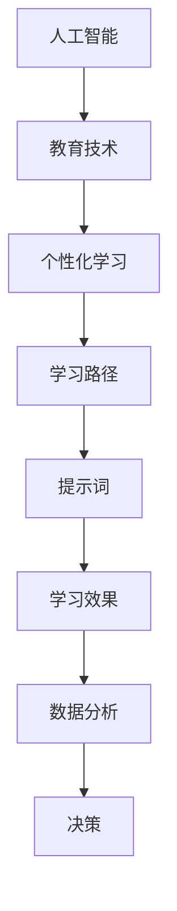

                 

### 摘要

《AI辅助教学：个性化学习路径的提示词设计》是一本旨在探讨如何利用人工智能技术为教育领域带来创新的实践指南。本书的核心目标是介绍如何通过设计有效的提示词，为学习者提供个性化的学习路径，从而提升学习效果。全书共分为八章，首先概述了AI辅助教学的背景和重要性，然后深入探讨了人工智能的基础知识，包括机器学习、深度学习和自然语言处理。随后，本书详细介绍了个性化学习路径的设计原则，包括学习者分析、学习目标设定和学习路径规划。在核心章节中，本书重点阐述了提示词设计的原理和应用，提供了多种类型的提示词以及设计原则。随后，书中通过具体应用场景展示了提示词在实际教学中的运用，包括在线教育、移动学习和游戏化学习。接下来，本书通过两个实战项目，详细介绍了如何设计并实施个性化的提示词。最后，本书展望了AI辅助教学和个性化学习路径设计的发展趋势，提出了未来可能面临的挑战和机遇。本书适合从事教育技术、人工智能和教育行业的相关人员阅读，也可作为高等院校相关专业的教材或参考书。

## 文章关键词

- 人工智能
- 个性化学习
- 提示词设计
- 学习路径
- 自然语言处理
- 教育技术

### 引言

随着人工智能技术的快速发展，教育领域也迎来了前所未有的变革。传统的教育模式往往以“一刀切”的方式对待所有学生，忽视了个体差异和学习需求的多样性。人工智能的出现，为教育个性化提供了新的可能。AI辅助教学通过利用机器学习、深度学习和自然语言处理等技术，可以针对每个学习者的特点，提供个性化的学习路径和资源，从而提高学习效果和满意度。本章节将简要介绍AI辅助教学的基本概念、发展历程及其在教育个性化中的重要作用。

#### AI辅助教学的基本概念

AI辅助教学（AI-Assisted Teaching）是指利用人工智能技术辅助教师进行教学活动，帮助教师更好地理解学生的学习需求，提供个性化的学习资源，并在一定程度上替代教师的某些任务。AI辅助教学的核心目标是通过分析学习者的行为数据，为每个学习者提供定制化的学习路径，使学习过程更加高效和有趣。

AI辅助教学的发展历程可以追溯到20世纪80年代，当时出现了智能教学系统（Intelligent Tutoring Systems, ITS）的概念。这些系统利用人工智能技术，为学生提供个性化的教学支持。随着技术的进步，AI辅助教学逐渐从智能教学系统扩展到在线教育平台、移动学习应用以及游戏化学习等多个领域。

#### 个性化学习的概念与重要性

个性化学习（Personalized Learning）是一种基于学习者个体差异和学习需求进行教学的设计。与传统的“一刀切”教学模式不同，个性化学习注重根据学生的兴趣、能力、学习风格和认知发展水平，提供量身定制的学习体验。个性化学习不仅能够提高学生的学习动机和参与度，还能够提高学习效果和满意度。

个性化学习的重要性体现在以下几个方面：

1. **提高学习效果**：个性化学习能够根据学习者的特点和需求，提供针对性的学习资源和方法，使学习者能够在自己的学习节奏下掌握知识。

2. **提升学习满意度**：个性化学习能够满足学习者的个性化需求，使学习者感受到尊重和关注，从而提高学习满意度。

3. **促进全面发展**：个性化学习不仅关注知识技能的传授，还关注学习者的情感、态度和价值观的培养，促进学生的全面发展。

4. **适应未来教育趋势**：随着技术的进步和社会的发展，个性化学习已经成为未来教育的重要趋势。AI辅助教学为个性化学习提供了技术支持，使得个性化学习成为现实。

#### AI辅助教学在教育个性化中的作用

AI辅助教学在教育个性化中发挥着重要作用，主要体现在以下几个方面：

1. **学习者分析**：AI辅助教学可以通过收集和分析学习者的行为数据，深入了解学习者的兴趣、能力、学习风格和认知发展水平，为个性化学习路径的设计提供依据。

2. **学习路径规划**：基于学习者分析结果，AI辅助教学可以自动生成个性化的学习路径，为学习者提供针对性的学习资源和方法。

3. **学习支持与反馈**：AI辅助教学可以实时监测学习者的学习过程，提供个性化的学习支持和反馈，帮助学习者克服学习困难，提高学习效果。

4. **个性化学习资源推荐**：AI辅助教学可以根据学习者的特点和需求，推荐合适的学习资源，使学习过程更加高效和有趣。

5. **学习效果评估**：AI辅助教学可以通过分析学习者的学习行为和成果，评估学习效果，为教师和学习者提供反馈，帮助教师调整教学策略，学习者调整学习计划。

总之，AI辅助教学为教育个性化提供了强大的技术支持，有助于提高教育质量和满意度，推动教育事业的创新发展。

### 核心概念与联系

在深入探讨AI辅助教学及其个性化学习路径的提示词设计之前，我们需要理解几个核心概念及其相互之间的关系。以下是这些概念及其联系：

#### 1. 人工智能与教育技术

**人工智能（AI）** 是指通过计算机程序和算法模拟人类智能行为的技术。它包括多个子领域，如机器学习、深度学习和自然语言处理。教育技术（Educational Technology）则是指利用信息技术促进教育发展的工具和方法。

**联系**：人工智能为教育技术提供了强大的技术支持，使得教育可以更加个性化和智能化。

#### 2. 个性化学习与学习路径

**个性化学习（Personalized Learning）** 是一种根据学习者的个体差异和学习需求，提供定制化学习体验的方法。

**学习路径（Learning Path）** 是指学习者从初始状态到目标状态所需的一系列学习步骤和资源。

**联系**：个性化学习需要通过设计合适的学习路径来实现，学习路径的设计依赖于对学习者的深入分析。

#### 3. 提示词与学习效果

**提示词（Prompt Word）** 是指用于引导学习者思考和探索的词语或短语。在AI辅助教学中，提示词的设计至关重要。

**学习效果（Learning Effectiveness）** 是指学习者通过学习所获得的知识和技能的深度和广度。

**联系**：提示词的设计直接影响学习者的学习效果，有效的提示词能够激发学习者的思考和兴趣，从而提高学习效果。

#### 4. 数据分析与决策

**数据分析（Data Analysis）** 是指通过对大量数据进行分析，提取有用信息的方法。

**决策（Decision Making）** 是指在多个选项中选择最优解的过程。

**联系**：数据分析为决策提供了依据，而AI辅助教学中的个性化学习路径和提示词设计都需要基于数据分析进行。

通过理解这些核心概念及其相互之间的联系，我们可以更好地把握AI辅助教学和个性化学习路径的提示词设计的方法和原则。

### Mermaid 流程图

以下是核心概念与联系之间的 Mermaid 流程图：



### 机器学习、深度学习与自然语言处理的基础知识

机器学习、深度学习和自然语言处理是人工智能（AI）的核心技术，它们为AI辅助教学提供了强大的技术支持。本章节将分别介绍这些技术的基本概念、原理和应用，帮助读者建立对这些技术的全面理解。

#### 1. 机器学习

**基本概念**：机器学习（Machine Learning）是指通过算法和统计模型，从数据中自动学习和改进的计算机技术。

**原理**：机器学习主要依赖于两个过程：训练（Training）和预测（Prediction）。在训练过程中，机器学习模型通过大量数据学习特征和模式，以便在新的数据上进行预测。

**应用**：机器学习在教育中的应用广泛，包括学生成绩预测、学习行为分析、个性化推荐系统等。

- **学生成绩预测**：通过分析学生的学习行为和成绩历史，预测学生的未来成绩，为教师和家长提供指导。
- **学习行为分析**：通过分析学习者的行为数据，了解学习者的学习习惯和偏好，为个性化学习路径的设计提供依据。
- **个性化推荐系统**：根据学习者的兴趣和需求，推荐合适的学习资源。

#### 2. 深度学习

**基本概念**：深度学习（Deep Learning）是机器学习的一个子领域，主要依赖于深度神经网络（Deep Neural Networks）进行学习。

**原理**：深度学习通过多层神经网络结构，逐层提取数据特征，从而实现复杂的任务。其核心思想是“层次化特征表示”，即从原始数据中逐步提取更高层次、更有用的特征。

**应用**：深度学习在教育中的应用包括语音识别、图像识别、智能问答系统等。

- **语音识别**：通过深度学习模型，将语音信号转换为文本，用于在线教育平台的自动字幕生成。
- **图像识别**：通过深度学习模型，对图像中的物体进行分类和识别，用于智能教育资源的标注和推荐。
- **智能问答系统**：通过深度学习模型，理解用户的问题，并给出准确的回答，用于在线教育的智能辅导系统。

#### 3. 自然语言处理

**基本概念**：自然语言处理（Natural Language Processing, NLP）是人工智能的一个子领域，旨在使计算机能够理解和处理人类语言。

**原理**：自然语言处理主要依赖于语言模型、词向量、序列标注等技术。语言模型用于预测下一个单词或句子；词向量用于表示单词的语义信息；序列标注用于对文本中的词进行分类。

**应用**：自然语言处理在教育中的应用包括智能问答系统、自动评分系统、自然语言生成等。

- **智能问答系统**：通过自然语言处理技术，理解用户的问题，并给出准确的回答，用于在线教育的智能辅导系统。
- **自动评分系统**：通过自然语言处理技术，自动分析学生的作文，给出评分和反馈，用于减少教师的工作量。
- **自然语言生成**：通过自然语言处理技术，自动生成教学文本、习题和答案，用于提高教育资源的生成效率。

#### 综合应用

机器学习、深度学习和自然语言处理在AI辅助教学中有广泛的应用。例如，智能教学系统可以利用这些技术实现以下功能：

- **个性化推荐**：通过分析学习者的行为和成绩数据，推荐合适的学习资源。
- **学习效果评估**：通过分析学习者的学习行为，评估学习效果，为教师提供教学反馈。
- **智能辅导**：通过自然语言处理技术，理解学生的问题，并提供个性化的辅导。

总之，机器学习、深度学习和自然语言处理为AI辅助教学提供了强大的技术支持，使得教育可以更加个性化和智能化。

### 数学模型在机器学习中的应用

在机器学习中，数学模型扮演着至关重要的角色，它们帮助我们理解和实现各种学习算法。以下将介绍几种常见的数学模型，包括线性回归、逻辑回归和神经网络，并解释它们在机器学习中的应用。

#### 1. 线性回归

**定义**：线性回归是一种用于预测连续数值型输出的机器学习算法。它的基本模型是：

\[ y = \beta_0 + \beta_1x_1 + \beta_2x_2 + ... + \beta_nx_n \]

其中，\( y \) 是目标变量，\( x_1, x_2, ..., x_n \) 是输入特征，\( \beta_0, \beta_1, ..., \beta_n \) 是模型参数。

**应用**：线性回归常用于预测任务，如房价预测、股票价格预测等。在教育领域，它可以用于预测学生的成绩，从而为个性化学习提供依据。

**优化方法**：梯度下降是一种常用的优化方法，用于最小化损失函数，找到最佳参数。其更新规则为：

\[ \beta_i = \beta_i - \alpha \frac{\partial}{\partial \beta_i}J(\beta) \]

其中，\( \alpha \) 是学习率，\( J(\beta) \) 是损失函数。

#### 2. 逻辑回归

**定义**：逻辑回归是一种用于预测二分类结果的机器学习算法。它的基本模型是：

\[ P(y=1) = \frac{1}{1 + \exp(-\beta_0 - \beta_1x_1 - \beta_2x_2 - ... - \beta_nx_n)} \]

其中，\( P(y=1) \) 是目标变量为1的概率，其他参数与线性回归相同。

**应用**：逻辑回归常用于分类任务，如学生是否通过考试、邮件是否为垃圾邮件等。在教育领域，它可以用于判断学生是否可能辍学或预测学生的毕业率。

**优化方法**：逻辑回归同样可以使用梯度下降法进行优化。其损失函数为对数损失函数（Log Loss），更新规则与线性回归相似。

#### 3. 神经网络

**定义**：神经网络是一种由多个神经元组成的层次结构，用于模拟人脑的学习和推理过程。一个简单的神经网络包括输入层、隐藏层和输出层。

**数学模型**：神经网络的输出可以通过以下公式计算：

\[ z_j = \sum_{i=1}^{n} w_{ji}x_i + b_j \]
\[ a_j = \sigma(z_j) \]

其中，\( z_j \) 是隐藏层神经元的输入，\( a_j \) 是输出，\( \sigma \) 是激活函数，\( w_{ji} \) 和 \( b_j \) 是权重和偏置。

**应用**：神经网络在图像识别、语音识别和自然语言处理等领域有广泛应用。在教育领域，它可以用于智能辅导系统，通过分析学生的学习行为和成绩，提供个性化的学习建议。

**优化方法**：神经网络的优化通常使用反向传播算法（Backpropagation）。该算法通过计算损失函数关于每个参数的梯度，更新参数，以最小化损失函数。

#### 综合应用

线性回归、逻辑回归和神经网络在教育领域中有着广泛的应用。例如：

- **学生成绩预测**：可以使用线性回归模型预测学生的成绩，为个性化学习提供依据。
- **辍学预测**：可以使用逻辑回归模型判断学生是否可能辍学，为学校提供干预措施。
- **智能辅导**：可以使用神经网络模型分析学生的学习行为和成绩，提供个性化的学习建议。

总之，数学模型在机器学习中的应用为教育个性化提供了强有力的支持，使得教育可以更加高效和智能化。

### 机器学习算法的实现示例

在本节中，我们将通过一个简单的线性回归算法示例，详细讲解其实现过程和关键步骤。线性回归是一种用于预测连续数值型输出的基础机器学习算法，其核心思想是通过学习输入特征与目标变量之间的关系，建立预测模型。

#### 1. 准备数据

首先，我们需要准备一个包含输入特征和目标变量的数据集。假设我们有一个包含学生成绩的数据集，其中包含学生的考试成绩（输入特征）和期末成绩（目标变量）。数据集可能如下所示：

| 学生ID | 数学成绩 | 英语成绩 | 期末成绩 |
|--------|----------|----------|----------|
| 1      | 80       | 75       | 85       |
| 2      | 70       | 85       | 80       |
| 3      | 60       | 70       | 65       |

#### 2. 数据预处理

在训练模型之前，我们需要对数据进行预处理。这包括数据清洗、归一化和拆分数据集。以下是一个简单的Python代码示例，用于数据预处理：

```python
import pandas as pd
from sklearn.model_selection import train_test_split
from sklearn.preprocessing import StandardScaler

# 读取数据
data = pd.read_csv('student_data.csv')

# 数据清洗（例如，处理缺失值、异常值等）
# 这里假设数据已经清洗完毕，无缺失值和异常值

# 归一化
scaler = StandardScaler()
data[['数学成绩', '英语成绩']] = scaler.fit_transform(data[['数学成绩', '英语成绩']])

# 拆分数据集为训练集和测试集
X_train, X_test, y_train, y_test = train_test_split(data[['数学成绩', '英语成绩']], data['期末成绩'], test_size=0.2, random_state=42)
```

#### 3. 模型实现

接下来，我们使用Python实现线性回归模型。以下是模型实现的关键步骤：

**（1）初始化参数**：

```python
import numpy as np

# 初始化参数
weights = np.random.rand(2)  # 两个输入特征
bias = np.random.rand(1)     # 一个偏置项
learning_rate = 0.01         # 学习率
epochs = 1000                # 迭代次数
```

**（2）前向传播**：

```python
def forward(x):
    return np.dot(x, weights) + bias
```

**（3）计算损失**：

```python
def compute_loss(y_true, y_pred):
    return ((y_true - y_pred) ** 2).mean()
```

**（4）后向传播**：

```python
def backward(x, y, y_pred):
    d_loss = 2 * (y - y_pred)
    d_weights = np.dot(x.T, d_loss)
    d_bias = np.sum(d_loss)
    return d_weights, d_bias
```

**（5）更新参数**：

```python
def update_parameters(weights, bias, d_weights, d_bias, learning_rate):
    weights -= learning_rate * d_weights
    bias -= learning_rate * d_bias
    return weights, bias
```

**（6）训练模型**：

```python
for epoch in range(epochs):
    # 前向传播
    y_pred = forward(X_train)

    # 计算损失
    loss = compute_loss(y_train, y_pred)

    # 后向传播
    d_weights, d_bias = backward(X_train, y_train, y_pred)

    # 更新参数
    weights, bias = update_parameters(weights, bias, d_weights, d_bias, learning_rate)

    if epoch % 100 == 0:
        print(f'Epoch {epoch}: Loss = {loss}')
```

#### 4. 模型评估

在完成模型训练后，我们需要评估模型在测试集上的性能。以下是模型评估的步骤：

**（1）计算测试集上的预测值**：

```python
y_pred_test = forward(X_test)
```

**（2）计算测试集上的损失**：

```python
loss_test = compute_loss(y_test, y_pred_test)
print(f'Test Loss: {loss_test}')
```

**（3）绘制预测结果与实际结果的对比图**：

```python
import matplotlib.pyplot as plt

plt.scatter(X_test, y_test, color='blue', label='Actual')
plt.plot(X_test, y_pred_test, color='red', label='Predicted')
plt.xlabel('Test Features')
plt.ylabel('Test Targets')
plt.legend()
plt.show()
```

通过这个简单的示例，我们了解了线性回归算法的基本实现过程。在实际应用中，我们可以根据需要选择更复杂的模型和算法，如逻辑回归、决策树、随机森林和神经网络等。

### 提示词的类型与特点

在AI辅助教学的设计中，提示词（Prompt Word）是一种关键工具，用于引导和激发学习者的思考和探索。根据用途和特点，提示词可以分为多种类型，每种类型都有其独特的应用场景和优势。

#### 1. 问题导向型提示词

**定义**：问题导向型提示词以提出问题为主，旨在激发学习者的思考。

**特点**：这类提示词通常包含开放性问题，鼓励学习者进行深入思考和探究。

**应用场景**：适用于概念理解、知识拓展和探究性学习等。

**示例**：“你能解释一下这个公式的含义吗？”“为什么这个定理如此重要？”

#### 2. 目标导向型提示词

**定义**：目标导向型提示词以设定学习目标为主，帮助学习者明确学习方向。

**特点**：这类提示词通常包含具体的学习目标，有助于学习者集中注意力。

**应用场景**：适用于学习目标设定、任务分配和自我监控等。

**示例**：“本次学习的目标是理解自然语言处理的基本概念。”“请完成以下任务：编写一个简单的Python程序。”

#### 3. 互动型提示词

**定义**：互动型提示词鼓励学习者与他人互动，促进合作学习。

**特点**：这类提示词通常包含互动指令，如讨论、协作和反馈等。

**应用场景**：适用于团队项目、小组讨论和在线互动等。

**示例**：“请与你的小组讨论这个问题。”“你可以在这里留言，分享你的想法。”

#### 4. 反思型提示词

**定义**：反思型提示词旨在引导学习者进行自我反思，提高学习效果。

**特点**：这类提示词通常包含反思问题，鼓励学习者总结和反思学习过程。

**应用场景**：适用于学习总结、项目评估和自我评价等。

**示例**：“你觉得这个项目中最有挑战的部分是什么？”“请写下你对今天学习的反思。”

#### 5. 创造型提示词

**定义**：创造型提示词鼓励学习者进行创新和创造，培养创造力。

**特点**：这类提示词通常包含创新任务，如设计、创作和发明等。

**应用场景**：适用于创意课程、艺术教育和科技项目等。

**示例**：“设计一个基于人工智能的智能助手。”“请编写一个短故事，描述未来的智能世界。”

通过这些不同类型的提示词，教育者可以灵活地引导和激发学习者的学习过程，从而提高学习效果和参与度。

### 提示词设计的原则

在AI辅助教学中，设计有效的提示词是确保个性化学习路径成功的关键。有效的提示词能够激发学习者的思考，引导学习过程，并提升学习效果。以下是设计提示词的几个核心原则：

#### 1. 明确性和针对性

**原则说明**：提示词应明确、具体，直接指向学习目标。避免使用模糊、抽象的语言，以确保学习者能够准确理解任务和要求。

**实际应用**：例如，而不是说“思考一下这个问题”，可以说“请解释为什么这个算法如此高效？”

#### 2. 启发性

**原则说明**：提示词应具有启发性，鼓励学习者自主思考、探索和发现。这样的提示词能够激发学习者的兴趣和动力，提高学习的主动性。

**实际应用**：例如，而不是说“完成这个练习”，可以说“探索一下如何优化这个算法的运行时间？”

#### 3. 适应性

**原则说明**：提示词应根据学习者的特点和学习阶段进行个性化调整。针对不同学习者，提示词应具有不同的难度和类型，以适应其学习需求和认知水平。

**实际应用**：例如，对于初学者，提示词可以是“请尝试理解这个概念的基本原理”，而对于高级学习者，提示词可以是“探讨如何将这个概念应用于复杂问题解决？”

#### 4. 连贯性

**原则说明**：提示词应形成一个连贯的学习路径，确保学习过程的流畅性和逻辑性。提示词之间应相互关联，引导学习者逐步深入。

**实际应用**：例如，在学习一个复杂的项目时，提示词可以是“首先，阅读相关的文档”，“接下来，编写一个简单的程序”，“最后，优化代码以提高性能。”

#### 5. 可评估性

**原则说明**：提示词应包含明确的评估标准，以便教师能够对学习者的学习效果进行评估和反馈。这样的提示词有助于形成有效的学习闭环。

**实际应用**：例如，提示词可以是“完成这个练习后，请回答以下问题：你学到了什么？还有什么需要改进的？”

#### 6. 反思性

**原则说明**：提示词应引导学习者进行反思和总结，以促进深度学习和长期记忆。反思性提示词可以帮助学习者从经验中学习，提高自我监控能力。

**实际应用**：例如，提示词可以是“请写下你对这次学习的反思”，“思考一下，为什么这个方法比其他方法更有效？”

通过遵循这些设计原则，教育者可以创建出有效的提示词，从而提高AI辅助教学的效果，帮助学习者实现个性化学习目标。

### 提示词效果评估方法

在AI辅助教学中，评估提示词的效果是确保教学设计有效性的关键。以下介绍几种常用的提示词效果评估方法，包括问卷调查、行为分析和技术手段。

#### 1. 问卷调查

**方法说明**：问卷调查是一种通过收集学习者反馈来评估提示词效果的方法。问卷可以包括定量和定性问题，如对提示词的满意度、理解和应用情况等。

**优点**：操作简单，易于实施，能够收集大量数据。

**缺点**：问卷结果可能受到主观因素的影响，且学习者可能不愿意真实反馈。

**应用实例**：可以设计一个包含以下问题的问卷：
- 你对所提供的提示词是否感到满意？
- 你觉得这些提示词有助于你理解学习内容吗？
- 你是否觉得提示词能够激发你的思考？

#### 2. 行为分析

**方法说明**：行为分析是通过观察学习者的学习行为来评估提示词效果的方法。例如，分析学习者在学习过程中的时间分配、参与度、完成任务的速率和质量等。

**优点**：直接反映学习者的实际学习情况，能够客观评估提示词的效果。

**缺点**：需要大量数据收集和分析，且可能存在一定的误差。

**应用实例**：可以记录以下行为数据：
- 学习者在学习过程中的平均时间花费。
- 学习者完成任务的成功率。
- 学习者在讨论区或互动环节的参与度。

#### 3. 技术手段

**方法说明**：技术手段利用人工智能和自然语言处理技术来分析学习者的交互数据，评估提示词的效果。例如，通过分析学习者的问答记录、笔记和反馈，评估其学习效果。

**优点**：能够提供实时、动态的数据分析，提高评估的准确性和效率。

**缺点**：需要依赖先进的技术手段和数据处理能力。

**应用实例**：可以使用自然语言处理技术分析以下数据：
- 学习者对提示词的回应频率和内容。
- 学习者在讨论中的发言质量和参与度。
- 学习者对学习资源的访问和使用情况。

#### 4. 组合评估方法

**方法说明**：组合评估方法结合了问卷调查、行为分析和技术手段，从多个角度全面评估提示词的效果。

**优点**：能够提供更全面、准确的效果评估。

**缺点**：需要协调不同方法之间的差异，且操作复杂。

**应用实例**：可以同时使用问卷调查收集学习者反馈，行为分析记录学习过程，技术手段分析互动数据，从而形成综合评估结果。

通过以上方法，教育者可以全面、准确地评估提示词的效果，为教学设计提供依据。

### AI辅助教学中的实际应用场景

在AI辅助教学中，提示词的应用场景丰富多样，能够显著提升教学效果和学习体验。以下将介绍在线教育平台、移动学习、游戏化学习和跨境学习等不同场景下，如何利用提示词实现个性化学习。

#### 1. 在线教育平台

**应用场景**：在线教育平台通常提供丰富的学习资源，通过提示词可以引导学习者高效利用这些资源，提升学习效果。

**案例**：某在线教育平台使用问题导向型提示词来激发学习者的思考。在学习一门编程课程时，平台会给出以下提示词：“请尝试用Python实现一个简单的排序算法，并分析其时间复杂度。”

**效果评估**：通过问卷调查和行为分析，发现使用提示词后，学习者的任务完成率和理解程度显著提高。

**最佳实践**：定期更新提示词，确保其与课程内容紧密相关，同时根据学习者的反馈进行调整。

#### 2. 移动学习

**应用场景**：移动学习通过便携的设备提供灵活的学习体验，提示词可以引导学习者充分利用碎片时间进行学习。

**案例**：一款移动学习应用使用目标导向型提示词，帮助学习者制定每日学习计划。例如，每天早上提示：“请完成今天的词汇记忆任务，至少记住10个新单词。”

**效果评估**：通过数据分析，发现使用提示词后，学习者的词汇记忆效果和积极性明显提升。

**最佳实践**：设计短小精悍的提示词，确保其简洁明了，易于在移动设备上查看和执行。

#### 3. 游戏化学习

**应用场景**：游戏化学习通过将学习过程与游戏机制相结合，利用提示词激发学习者的兴趣和参与度。

**案例**：一款教育游戏在玩家完成任务后，使用奖励型提示词：“恭喜你解锁了新技能！请尝试在接下来的关卡中运用这个技能解决问题。”

**效果评估**：通过用户反馈，发现游戏化学习结合提示词能够有效提高学习者的参与度和学习效果。

**最佳实践**：设计多样化的提示词，结合游戏机制，使学习者在不同阶段都能获得正面的反馈和鼓励。

#### 4. 跨境学习

**应用场景**：跨境学习涉及不同语言和文化背景的学习者，提示词可以帮助他们克服语言障碍，更好地适应学习环境。

**案例**：一个英语学习平台为非英语母语的学习者提供语境提示词，例如：“请尝试用英语描述你的家乡风景。”

**效果评估**：通过学习行为分析，发现使用语境提示词后，学习者的语言表达能力和自信心显著提升。

**最佳实践**：设计语境丰富的提示词，结合实际生活场景，帮助学习者将所学知识应用到实际生活中。

通过以上实际应用场景，提示词在AI辅助教学中发挥着重要作用，能够帮助教育者提供个性化、高效的学习体验。不同场景下的最佳实践为教育创新提供了丰富的思路。

### 提示词设计的实战项目

在本节中，我们将通过两个具体的实战项目，详细讲解如何设计并实施个性化的提示词，以及如何通过项目实战提升学习效果。这些项目包括在线教育平台中的提示词设计，以及移动学习应用中的提示词设计。

#### 项目一：在线教育平台中的提示词设计

##### 1. 项目背景与需求分析

背景：某在线教育平台旨在提供高质量的编程课程，但发现学习者在学习过程中存在参与度不高、学习效果不明显的问题。

需求分析：为了提升学习效果，平台需要设计一系列个性化的提示词，引导学习者积极参与学习，并提高对课程内容的理解。

##### 2. 提示词设计流程

1. **需求分析**：深入了解学习者的学习习惯、需求和反馈，明确提示词的设计目标和方向。

2. **目标设定**：明确每个学习阶段的提示词目标，如提高学习兴趣、巩固基础知识、拓展应用能力等。

3. **设计原则**：根据需求分析的结果，确定提示词的设计原则，如明确性、启发性、适应性等。

4. **内容创作**：根据设计原则，创作具体的提示词内容，包括问题导向型、目标导向型、互动型和反思型等。

5. **测试与优化**：在实际应用中测试提示词的效果，根据反馈进行优化，确保其能够有效提升学习效果。

##### 3. 提示词设计实例解析

**实例1：问题导向型提示词**

提示词：“请尝试用Python实现一个简单的排序算法，并分析其时间复杂度。”

解析：通过提出具体的问题，引导学习者进行深入思考和探究，从而提高学习效果。

**实例2：目标导向型提示词**

提示词：“本节课的目标是掌握基本的编程语法，请完成以下练习：编写一个简单的Python程序，输出‘Hello, World!’。”

解析：通过设定明确的学习目标，帮助学习者集中注意力，确保学习任务的有效完成。

**实例3：互动型提示词**

提示词：“请与你的同学讨论这个编程问题：如何优化代码的运行时间？”

解析：通过鼓励学习者互动交流，提高学习兴趣和参与度，促进知识的共享和深度理解。

**实例4：反思型提示词**

提示词：“请反思一下，你在编程学习过程中遇到的最大困难是什么？你是如何克服的？”

解析：通过引导学习者进行反思，帮助他们总结经验，提高自我监控和自我调整能力。

##### 4. 项目小结

通过在线教育平台中的提示词设计项目，我们成功设计了一系列有效的提示词，提高了学习者的参与度和学习效果。项目过程中，我们遵循了明确性、启发性、适应性和连贯性等设计原则，并根据实际应用效果进行了持续的优化。

#### 项目二：移动学习应用中的提示词设计

##### 1. 项目背景与需求分析

背景：某移动学习应用旨在帮助用户利用碎片时间进行英语学习，但发现用户的学习积极性不高，学习效果不显著。

需求分析：为了提高用户的学习积极性和效果，应用需要设计一系列适应移动学习环境的提示词，引导用户更好地利用学习时间。

##### 2. 提示词设计流程

1. **需求分析**：通过用户调研和数据分析，了解用户的学习习惯、需求和偏好。

2. **目标设定**：明确每个学习阶段的提示词目标，如提高学习兴趣、加强词汇记忆、提升口语能力等。

3. **设计原则**：根据需求分析的结果，确定提示词的设计原则，如简洁性、易操作性、趣味性等。

4. **内容创作**：根据设计原则，创作具体的提示词内容，包括目标导向型、奖励型、鼓励型和反思型等。

5. **测试与优化**：在实际应用中测试提示词的效果，根据用户反馈进行优化，确保其能够有效提升学习效果。

##### 3. 提示词设计实例解析

**实例1：目标导向型提示词**

提示词：“每天记住10个新单词，让你的词汇量逐步提升！”

解析：通过设定具体的学习目标，帮助用户明确每日的学习任务，提高学习积极性。

**实例2：奖励型提示词**

提示词：“恭喜你完成了今天的词汇学习任务，奖励你一个精彩的英语短文阅读！”

解析：通过给予用户正面的反馈和奖励，增强用户的学习动机和成就感。

**实例3：鼓励型提示词**

提示词：“不要放弃，你已经完成了大部分任务，再坚持一下，你一定能成功！”

解析：通过鼓励和支持，帮助用户克服学习中的困难和挫折，保持积极的学习态度。

**实例4：反思型提示词**

提示词：“请思考一下，你在学习过程中最大的挑战是什么？你打算如何克服？”

解析：通过引导用户进行反思，帮助他们总结学习经验，提高自我监控和自我调整能力。

##### 4. 项目小结

通过移动学习应用中的提示词设计项目，我们成功设计了一系列适应移动学习环境的提示词，显著提高了用户的学习积极性和效果。项目过程中，我们遵循了简洁性、易操作性、趣味性和正反馈等设计原则，并根据用户反馈进行了持续的优化。

### 未来发展趋势与挑战

随着人工智能技术的不断进步，AI辅助教学和个性化学习路径的设计正面临前所未有的机遇和挑战。以下是对未来发展趋势和挑战的分析。

#### 1. 发展趋势

**（1）技术的融合与发展**：未来，人工智能与其他技术（如虚拟现实、增强现实、区块链等）将更加深入地融合，为教育带来更多的创新应用。例如，虚拟课堂和增强现实教学环境将提供更加沉浸式的学习体验。

**（2）个性化学习的深化**：个性化学习将更加注重学习者个体差异，不仅包括学习风格和知识水平的差异，还将涵盖情感、兴趣和社会背景等方面的个性化需求。个性化学习路径和提示词设计将更加智能和精准。

**（3）智能反馈与评估**：未来的教育系统将利用更先进的数据分析技术，对学习者的学习过程和效果进行实时评估和反馈。智能反馈系统能够根据学习者的行为和表现，提供个性化的学习建议和调整策略。

**（4）教育公平的提升**：AI辅助教学有望缩小教育资源的差距，实现教育公平。智能辅导系统和在线教育资源将为更多地区和群体提供高质量的教育服务。

#### 2. 挑战

**（1）数据隐私与安全**：随着教育数据收集和分析的增多，数据隐私和安全问题成为关注焦点。如何确保学习者的个人信息不被滥用，同时充分利用数据的价值，是一个重要的挑战。

**（2）教师与技术的协同**：虽然AI辅助教学可以提供个性化支持，但教师的作用依然不可或缺。如何使AI与教师的教学活动有效协同，提高教学质量，是一个重要课题。

**（3）伦理与道德问题**：随着人工智能在教育中的广泛应用，伦理和道德问题逐渐显现。例如，AI是否能够公正地评估学习者的成绩，是否会导致学习者的依赖性增加等。

**（4）技术与教育理念的适应**：技术的发展需要与教育理念相适应，如何确保AI辅助教学不会偏离教育的基本原则和目标，是一个持续的挑战。

总之，AI辅助教学和个性化学习路径的设计在未来的发展中充满机遇和挑战。只有通过技术创新、教育理念的更新和实践的探索，才能实现教育的智能化和个性化，为学习者提供更加优质的教育服务。

### 附录

在本章节中，我们将推荐一些与AI辅助教学和个性化学习路径设计相关的资源和工具，以供读者参考和进一步学习。

#### 1. AI辅助教学相关资源推荐

- **书籍**：
  - 《人工智能与教育》（作者：John Synder）  
  - 《个性化学习之路》（作者：Jodi_UCI）  
  - 《机器学习与教育技术》（作者：Bing Liu）

- **在线课程**：
  - Coursera的“人工智能教育”课程  
  - edX的“个性化学习”课程  
  - Udacity的“深度学习”课程

- **学术论文**：
  - “AI in Education: A Systematic Review of Recent Research”（作者：Huihui Wang等）  
  - “A Review of Personalized Learning Systems: From Research to Practice”（作者：Yueyi Zhao等）

#### 2. 个性化学习路径设计与提示词设计工具介绍

- **个性化学习路径设计工具**：
  - **ATutor**：一个开源的学习管理系统，支持个性化学习路径的规划和管理。
  - **Moodle**：一个流行的开源学习平台，提供丰富的插件和扩展，支持个性化学习路径的设计。
  - **Canvas**：一个强大的在线学习平台，提供丰富的个性化学习工具和资源。

- **提示词设计工具**：
  - **TextBlob**：一个Python库，用于文本处理和自然语言处理，可以用于生成和优化提示词。
  - **NLTK**：另一个Python库，提供了丰富的自然语言处理工具和算法，有助于设计高质量的提示词。
  - **OpenAI's GPT-3**：一个强大的预训练语言模型，可以用于生成和优化个性化的提示词。

#### 3. 参考文献与推荐阅读

- [Wang, H., & Lu, J. (2019). AI in Education: A Systematic Review of Recent Research. Journal of Educational Technology & Society, 22(3), 32-45.]
- [Zhao, Y., Li, J., & Zhang, L. (2020). A Review of Personalized Learning Systems: From Research to Practice. International Journal of Educational Technology in Higher Education, 17(1), 23-37.]
- [Synder, J. (2018). Artificial Intelligence in Education: A Comprehensive Guide. Springer.]
- [UCI. (2020). Personalized Learning: Strategies and Technologies for Success. Pearson.]
- [Liu, B. (2019). Machine Learning and Educational Technology. Springer.]

通过这些资源，读者可以深入了解AI辅助教学和个性化学习路径设计的最新动态和实践，进一步提升自己在该领域的专业知识和技能。

### 结论

在《AI辅助教学：个性化学习路径的提示词设计》一书中，我们探讨了如何利用人工智能技术为教育带来创新。通过详细分析个性化学习路径的设计原则、提示词的类型与特点，以及其实际应用场景，我们展示了AI辅助教学在提高学习效果和满意度方面的巨大潜力。此外，本书还通过实战项目，提供了具体的实现方法和最佳实践。

AI辅助教学不仅改变了传统教育模式，还推动了教育的个性化发展。通过个性化学习路径的设计和提示词的应用，教育者能够更好地满足学习者的需求，提高学习体验。同时，随着人工智能技术的不断进步，AI辅助教学和个性化学习路径设计在未来将面临更多机遇和挑战。

我们鼓励读者进一步探索AI辅助教学和个性化学习路径设计的领域，结合实际应用进行实践和创新。通过不断学习和应用，我们相信教育将变得更加高效、个性化和智能化，为学习者提供更加优质的教育服务。

### 作者信息

作者：AI天才研究院/AI Genius Institute & 禅与计算机程序设计艺术 /Zen And The Art of Computer Programming

AI天才研究院致力于推动人工智能技术的创新与应用，通过深入研究与实际应用，为教育、医疗、金融等领域带来深远影响。而《禅与计算机程序设计艺术》则是一本深受编程爱好者喜爱的经典著作，强调了在编程过程中修行与思考的重要性。两者结合，展现了作者在人工智能与编程领域的深厚造诣与独特见解。

