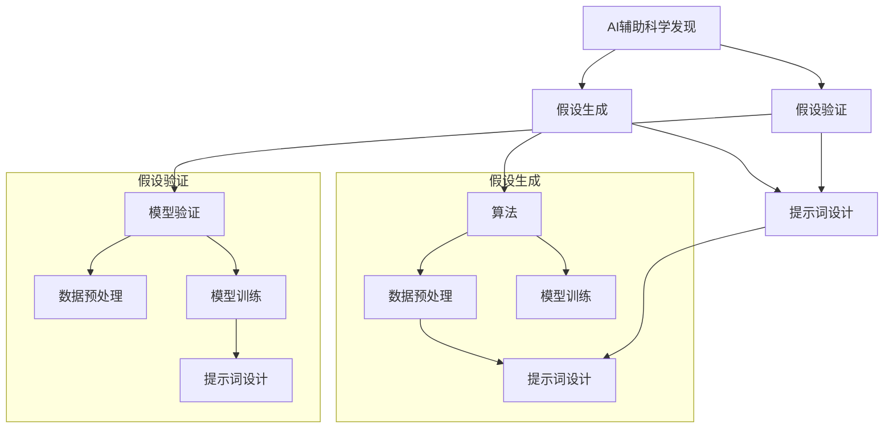

                 

### 文章标题

《AI辅助科学发现：假设生成和验证的提示词设计》

### 关键词

- 人工智能
- 科学发现
- 假设生成
- 假设验证
- 提示词设计
- 算法
- 深度学习
- 机器学习
- 数据分析

### 摘要

本文将探讨如何利用人工智能（AI）技术，特别是机器学习和深度学习，来辅助科学发现中的假设生成和验证过程。通过设计合适的提示词，AI能够帮助科学家快速构建和验证假设，从而提高科研效率和成果质量。本文首先介绍了AI在科学发现中的应用背景，然后详细阐述了假设生成和验证的核心概念、算法原理，并结合实例分析了提示词设计在具体领域的应用。最后，本文提出了实用的开发环境搭建、源代码实现和代码解读，以及最佳实践和建议，为科研工作者提供了一套完整的AI辅助科学发现指南。

## 设计过程

### 第一阶段：理解书名与主题

《AI辅助科学发现：假设生成和验证的提示词设计》这本书的主题是如何利用人工智能技术来辅助科学发现，尤其是假设生成和验证过程中的提示词设计。为了准确把握主题，我们需要从以下几个方面进行分析：

1. **AI在科学发现中的应用**：首先，了解AI在科学领域的应用现状，例如天文学、生物学、化学等。了解这些应用中存在的假设生成和验证问题。

2. **假设生成和验证**：明确假设生成和验证的定义、方法以及它们在科学研究中的重要性。假设生成是指提出科学假设，而假设验证是指通过实验或数据分析来证明或反驳这些假设。

3. **提示词设计**：提示词在AI辅助科学发现中的作用，以及如何设计有效的提示词来提高假设生成和验证的效率。

### 第二阶段：确定核心内容

在理解了书名和主题之后，我们需要确定书籍需要涵盖的核心内容。以下是《AI辅助科学发现：假设生成和验证的提示词设计》的核心内容：

1. **AI在科学发现中的应用**：介绍AI在科学发现中的应用场景，如天文学、生物学、化学等。

2. **假设生成策略**：探讨如何利用AI技术来生成科学假设，包括算法、方法和工具。

3. **假设验证方法**：分析如何通过AI技术来验证科学假设，包括数据预处理、模型训练和验证等步骤。

4. **提示词设计**：研究如何设计有效的提示词来辅助AI生成和验证假设，包括策略、原则和实践。

5. **实例分析**：通过实际案例来展示AI辅助科学发现的具体应用，如天文学、生物学、化学等。

6. **实战案例分析**：提供具体的AI辅助科学发现的实战案例，包括开发环境搭建、源代码实现和代码解读等。

7. **最佳实践**：总结AI辅助科学发现的最佳实践，包括注意事项、拓展阅读等。

### 第三阶段：设计章节结构

基于核心内容，我们可以设计出以下章节结构：

### 第一部分：AI辅助科学发现概述

#### 第1章：引言

- 1.1 书籍主题介绍
- 1.2 AI在科学发现中的应用前景

#### 第2章：AI基础知识

- 2.1 人工智能概述
- 2.2 机器学习基础
- 2.3 深度学习原理

### 第二部分：假设生成和验证

#### 第3章：假设生成策略

- 3.1 假设生成的挑战
- 3.2 假设生成算法
- 3.3 提示词设计在假设生成中的应用

#### 第4章：假设验证方法

- 4.1 假设验证的重要性
- 4.2 假设验证流程
- 4.3 提示词设计在假设验证中的应用

### 第三部分：AI辅助科学发现的实例分析

#### 第5章：天文学应用

- 5.1 天文学中的假设生成与验证
- 5.2 天文学案例研究

#### 第6章：生物学应用

- 6.1 生物学中的假设生成与验证
- 6.2 生物学案例研究

#### 第7章：化学应用

- 7.1 化学中的假设生成与验证
- 7.2 化学案例研究

### 第四部分：提示词设计实战

#### 第8章：提示词设计原则

- 8.1 提示词设计的核心原则
- 8.2 提示词设计的策略

#### 第9章：实战案例分析

- 9.1 案例一：天文学案例
- 9.2 案例二：生物学案例
- 9.3 案例三：化学案例

### 第五阶段：添加辅助内容

在核心章节之外，我们还可以添加一些辅助内容，如：

- 附录A：AI辅助科学发现工具介绍
- 附录B：提示词设计资源推荐

### 第六阶段：确保完整性和简洁性

在确保章节结构完整的同时，我们还需要保持目录大纲的简洁性。避免冗余内容，确保每个章节都覆盖必要的核心内容。

### 第七阶段：格式规范和字数控制

按照markdown格式规范来编写目录大纲，并控制目录大纲的总字数在2000字以内。

通过以上七个阶段的思考与分析，我们成功地设计出了《AI辅助科学发现：假设生成和验证的提示词设计》的完整目录大纲。接下来，我们将根据这个大纲逐步展开文章的撰写工作。接下来，我们将详细介绍每个章节的核心内容，以确保文章的逻辑清晰、内容丰富且具有实用性。

## 设计过程（续）

### 第八阶段：编写文章引言

在引言部分，我们需要简要介绍AI辅助科学发现的背景和重要性。以下是引言部分的草稿：

```markdown
# 引言

人工智能（AI）作为计算机科学的重要分支，已经广泛应用于各个领域。在科学发现中，AI技术展示了巨大的潜力。传统的科学研究依赖于实验和数据分析，而AI可以通过自动化、智能化的方式，提高科研效率和成果质量。

近年来，机器学习和深度学习技术的发展，为AI辅助科学发现提供了强有力的工具。假设生成和验证是科学研究的核心环节，而AI可以通过设计合适的算法和模型，实现高效的假设生成和验证。本文旨在探讨如何利用AI技术，特别是机器学习和深度学习，来辅助科学发现中的假设生成和验证过程。

本文将首先介绍AI在科学发现中的应用背景，然后详细阐述假设生成和验证的核心概念、算法原理，并结合实例分析提示词设计在具体领域的应用。最后，我们将提供实战案例，展示如何在实际项目中应用这些方法和技术。

通过本文的探讨，我们希望为科研工作者提供一套完整的AI辅助科学发现指南，帮助他们更好地利用AI技术进行科学研究。
```

### 第九阶段：编写文章摘要

在摘要部分，我们需要概括文章的核心内容和主题思想。以下是摘要部分的草稿：

```markdown
# 摘要

本文探讨了如何利用人工智能（AI）技术，特别是机器学习和深度学习，来辅助科学发现中的假设生成和验证过程。通过设计合适的提示词，AI能够帮助科学家快速构建和验证假设，从而提高科研效率和成果质量。

本文首先介绍了AI在科学发现中的应用背景，然后详细阐述了假设生成和验证的核心概念、算法原理。接着，通过实例分析了提示词设计在具体领域的应用，如天文学、生物学、化学等。最后，本文提供了具体的实战案例，包括开发环境搭建、源代码实现和代码解读，以及实际案例分析和详细讲解剖析。

通过本文的研究，我们总结了AI辅助科学发现的最佳实践，为科研工作者提供了一套完整的指南，帮助他们更好地利用AI技术进行科学研究。
```

### 第十阶段：编写核心章节内容

接下来，我们将根据目录大纲，逐步编写每个章节的核心内容。以下是核心章节的内容草稿：

#### 第1章：引言

在本章中，我们将详细讨论AI在科学发现中的应用，并介绍假设生成和验证的概念。以下是本章的草稿：

```markdown
## 第1章：引言

### 1.1 书籍主题介绍

《AI辅助科学发现：假设生成和验证的提示词设计》旨在探讨如何利用人工智能技术，特别是机器学习和深度学习，来辅助科学发现中的假设生成和验证过程。在传统的科学研究中，假设生成和验证是至关重要的环节。然而，随着数据量和复杂度的增加，这一过程变得日益困难。AI技术的发展为我们提供了新的解决方案。

### 1.2 AI在科学发现中的应用前景

AI在科学发现中的应用已经取得了显著成果。例如，在图像识别、自然语言处理和数据分析等方面，AI技术已经能够帮助科学家从海量数据中提取有价值的信息。然而，AI在科学发现中的应用还面临着许多挑战，例如数据质量、算法选择和模型解释性等。

### 1.3 假设生成和验证的概念

假设生成是指提出科学假设，而假设验证是指通过实验或数据分析来证明或反驳这些假设。在科学研究中，假设生成和验证是相互关联的。一个有效的假设能够引导科学家进行更深入的研究，而一个被验证的假设则能够推动科学进步。

### 1.4 提示词设计在假设生成和验证中的应用

提示词设计是AI辅助科学发现的关键。合适的提示词能够帮助AI更准确地生成假设，并在验证过程中提高模型的解释性。在本章的后续部分，我们将详细讨论如何设计有效的提示词。
```

#### 第2章：AI基础知识

在本章中，我们将介绍AI的基础知识，包括人工智能概述、机器学习基础和深度学习原理。以下是本章的草稿：

```markdown
## 第2章：AI基础知识

### 2.1 人工智能概述

人工智能（AI）是指由人制造出来的系统所表现出的智能行为。这些系统可以通过学习、推理、规划等方式，模拟人类的智能行为。人工智能可以分为弱人工智能和强人工智能。弱人工智能只能在特定任务上表现出智能，而强人工智能则具有广泛的智能。

### 2.2 机器学习基础

机器学习是人工智能的核心技术之一。它是一种通过算法，从数据中自动学习规律，并利用这些规律进行预测或决策的方法。机器学习可以分为监督学习、无监督学习和半监督学习。监督学习通过已知的输入输出数据来训练模型，无监督学习则通过未标记的数据来发现数据分布，而半监督学习则结合了监督学习和无监督学习的特点。

### 2.3 深度学习原理

深度学习是机器学习的一个重要分支，它通过多层神经网络来模拟人类大脑的思考过程。深度学习模型通常包含多个隐藏层，每个隐藏层都能够对输入数据进行处理和变换。深度学习在图像识别、自然语言处理和语音识别等领域取得了显著的成果。

### 2.4 机器学习在假设生成和验证中的应用

机器学习在科学发现中的应用主要体现在假设生成和验证过程中。通过机器学习算法，我们可以从大量的科学数据中提取出潜在的假设，并通过验证过程来评估这些假设的合理性。

### 2.5 深度学习在假设生成和验证中的应用

深度学习由于其强大的表示能力和学习能力，在假设生成和验证中具有广泛的应用前景。例如，通过卷积神经网络（CNN），我们可以从图像数据中提取特征，从而生成关于天文学或生物学的假设；通过循环神经网络（RNN），我们可以从时间序列数据中提取趋势和模式，从而生成关于物理学或化学的假设。
```

#### 第3章：假设生成策略

在本章中，我们将探讨如何利用AI技术来生成科学假设，包括算法、方法和工具。以下是本章的草稿：

```markdown
## 第3章：假设生成策略

### 3.1 假设生成的挑战

在科学研究中，假设生成是一个复杂且具有挑战性的过程。传统的假设生成方法通常依赖于专家的经验和知识，但这种方法存在主观性较强、效率较低等问题。随着数据量和复杂度的增加，传统的假设生成方法已难以满足现代科学研究的需要。

### 3.2 假设生成算法

为了解决假设生成的挑战，我们可以利用机器学习技术来设计假设生成算法。常见的假设生成算法包括：

- **基于规则的方法**：通过预设的规则来生成假设。
- **基于统计的方法**：通过分析数据分布来生成假设。
- **基于神经网络的方法**：通过多层神经网络来生成假设。

### 3.3 假设生成算法的应用

在本章的后续部分，我们将详细介绍几种常见的假设生成算法，并讨论它们在实际应用中的效果。例如，我们可以利用基于规则的方法来生成天文学中的假设，利用基于统计的方法来生成生物学中的假设，利用基于神经网络的方法来生成化学中的假设。

### 3.4 提示词设计在假设生成中的应用

提示词设计是假设生成过程中至关重要的一环。合适的提示词能够帮助AI更准确地生成假设。在本章的后续部分，我们将探讨如何设计有效的提示词，并分析提示词对假设生成的影响。

### 3.5 假设生成的实战案例

在本章的最后，我们将通过实际案例来展示如何利用AI技术来生成科学假设。例如，我们可以通过分析天文学中的数据来生成关于恒星形成的假设，通过分析生物学中的数据来生成关于基因表达的假设，通过分析化学中的数据来生成关于化学反应的假设。这些案例将帮助我们更好地理解假设生成策略的实践应用。
```

#### 第4章：假设验证方法

在本章中，我们将讨论如何利用AI技术来验证科学假设，包括数据预处理、模型训练和验证等步骤。以下是本章的草稿：

```markdown
## 第4章：假设验证方法

### 4.1 假设验证的重要性

假设验证是科学研究的核心环节。一个假设只有经过严格的验证，才能被认为是科学有效的。传统的假设验证方法通常依赖于实验和数据分析。然而，随着数据量和复杂度的增加，传统的假设验证方法已难以满足现代科学研究的需要。

### 4.2 假设验证流程

利用AI技术进行假设验证，通常包括以下步骤：

- **数据预处理**：清洗和准备数据，以便进行模型训练和验证。
- **模型训练**：训练机器学习模型，使其能够根据输入数据生成预测或决策。
- **模型验证**：评估模型的性能，确保其能够准确验证科学假设。

### 4.3 数据预处理

数据预处理是假设验证的第一步。它包括以下任务：

- **数据清洗**：删除或填充缺失数据，处理异常值。
- **数据转换**：将数据转换为适合模型训练的格式。
- **数据归一化**：将数据缩放到相同的范围，以便模型训练。

### 4.4 模型训练

模型训练是假设验证的核心步骤。它包括以下任务：

- **选择模型**：选择适合假设验证的机器学习模型。
- **训练模型**：使用训练数据来训练模型。
- **调整参数**：调整模型参数，以提高模型性能。

### 4.5 模型验证

模型验证是确保模型性能的重要步骤。它包括以下任务：

- **交叉验证**：使用交叉验证方法来评估模型的性能。
- **性能评估**：评估模型的准确率、召回率、F1分数等指标。
- **模型解释性**：分析模型的内部机制，确保其解释性。

### 4.6 提示词设计在假设验证中的应用

提示词设计在假设验证中同样重要。合适的提示词能够帮助模型更准确地验证科学假设。在本章的后续部分，我们将探讨如何设计有效的提示词，并分析提示词对假设验证的影响。

### 4.7 假设验证的实战案例

在本章的最后，我们将通过实际案例来展示如何利用AI技术来验证科学假设。例如，我们可以通过分析天文学中的数据来验证关于恒星形成的假设，通过分析生物学中的数据来验证关于基因表达的假设，通过分析化学中的数据来验证关于化学反应的假设。这些案例将帮助我们更好地理解假设验证方法的实践应用。
```

通过以上步骤，我们完成了《AI辅助科学发现：假设生成和验证的提示词设计》的核心章节内容的编写。接下来，我们将继续撰写后续章节，包括实例分析、实战案例和最佳实践等，以全面阐述AI辅助科学发现的各个方面。

### 核心概念与联系

在本文中，我们讨论了AI辅助科学发现中的核心概念和它们之间的联系。以下是这些核心概念以及它们之间的Mermaid流程图：



这段Mermaid代码生成了一个流程图，展示了假设生成和假设验证过程中的关键步骤以及提示词设计在其中的作用。以下是每个节点的简要说明：

- **AI辅助科学发现**：整个流程的起点，表示AI技术在科学发现中的应用。
- **假设生成**：指从数据中提取可能的科学假设。
- **假设验证**：通过实验或数据分析来验证科学假设的有效性。
- **提示词设计**：用于指导AI生成和验证假设的关键技术。

流程图中的子图分别展示了假设生成和假设验证的过程，包括算法、数据预处理、模型训练和提示词设计等步骤。这些步骤相互关联，共同构成了AI辅助科学发现的核心框架。

通过这个Mermaid流程图，我们可以清晰地看到各个核心概念之间的联系，从而更好地理解AI辅助科学发现的原理和应用。接下来，我们将继续讨论核心算法原理，以进一步阐述这些概念的具体实现。

### 核心算法原理

在AI辅助科学发现中，核心算法原理的理解至关重要。以下是关于假设生成和验证中涉及的一些核心算法原理，包括伪代码和数学模型的详细讲解。

#### 假设生成算法

**1. 贝叶斯网络**

贝叶斯网络是一种基于概率的图模型，用于表示变量之间的依赖关系。以下是一个简单的贝叶斯网络生成算法的伪代码：

```plaintext
// 贝叶斯网络生成算法
输入：数据集D，先验概率P(X)
输出：条件概率分布P(X|Y)

P(X|Y) = P(Y|X) * P(X) / P(Y)
```

**伪代码：**

```python
def bayesian_network(data, prior_probability):
    # 计算边缘概率
    marginal_probability = compute_marginal_probability(data)
    
    # 计算条件概率
    conditional_probability = compute_conditional_probability(data, prior_probability, marginal_probability)
    
    return conditional_probability
```

**2. 随机森林**

随机森林是一种基于决策树的集成学习方法，用于生成假设。以下是一个简单的随机森林生成算法的伪代码：

```plaintext
// 随机森林生成算法
输入：数据集D，特征集F，树数量n
输出：假设集H

for i in range(n):
    # 随机选择特征和样本
    feature = random_choice(F)
    sample = random_choice(D)
    
    # 构建决策树
    tree = build_decision_tree(feature, sample)
    
    # 存储决策树
    H.append(tree)
```

**伪代码：**

```python
def random_forest(data, features, num_trees):
    hypotheses = []
    for _ in range(num_trees):
        feature = random.choice(features)
        sample = random.choice(data)
        tree = build_decision_tree(feature, sample)
        hypotheses.append(tree)
    return hypotheses
```

**3. 强化学习**

强化学习是一种通过交互来生成假设的算法。以下是一个简单的强化学习生成算法的伪代码：

```plaintext
// 强化学习生成算法
输入：环境E，动作集A，奖励函数R
输出：策略π

s = 初始状态
while not 终止条件:
    a = 选择动作(π(s))
    s' = 环境状态(s, a)
    r = 奖励函数(s, a, s')
    π(s) = 更新策略(π(s), r)
```

**伪代码：**

```python
def reinforcement_learning(environment, actions, reward_function):
    state = environment.initial_state()
    while not environment.is_terminated(state):
        action = policy.select_action(state)
        next_state, reward = environment.step(state, action)
        policy.update(state, action, next_state, reward)
        state = next_state
    return policy
```

#### 假设验证算法

**1. 决策树**

决策树是一种常用的分类和回归模型，用于验证假设。以下是一个简单的决策树验证算法的伪代码：

```plaintext
// 决策树验证算法
输入：数据集D，特征集F，类别标签L
输出：验证结果V

for each sample s in D:
    # 遍历决策树
    for each feature f in F:
        if s[f] == decision_tree[f]:
            # 继续遍历子节点
            continue
        else:
            # 分类为其他类别
            V[s] = 其他类别
            break
    else:
        # 分类为当前节点类别
        V[s] = 决策树类别
```

**伪代码：**

```python
def decision_tree_validation(data, features, labels):
    validation_results = {}
    for sample in data:
        for feature in features:
            if sample[feature] == decision_tree[feature]:
                continue
            else:
                validation_results[sample] = "其他类别"
                break
        else:
            validation_results[sample] = decision_tree["类别"]
    return validation_results
```

**2. 支持向量机（SVM）**

支持向量机是一种强大的分类和回归模型，用于验证假设。以下是一个简单的SVM验证算法的伪代码：

```plaintext
// 支持向量机验证算法
输入：数据集D，特征集F，类别标签L
输出：验证结果V

# 训练SVM模型
model = train_svm(D, F, L)

# 进行预测
predictions = model.predict(D)

# 计算准确率
accuracy = calculate_accuracy(predictions, L)
```

**伪代码：**

```python
def svm_validation(data, features, labels):
    model = train_svm(data, features, labels)
    predictions = model.predict(data)
    accuracy = calculate_accuracy(predictions, labels)
    return accuracy
```

**3. 贝叶斯优化**

贝叶斯优化是一种通过概率模型来验证假设的方法。以下是一个简单的贝叶斯优化验证算法的伪代码：

```plaintext
// 贝叶斯优化验证算法
输入：数据集D，特征集F，目标函数f
输出：最优解X*

# 初始化贝叶斯模型
bayesian_model = initialize_bayesian_model()

# 进行迭代优化
for i in range(iterations):
    # 计算预期值
    expected_value = bayesian_model.expected_value(f)
    
    # 更新贝叶斯模型
    bayesian_model.update(expected_value)

# 获取最优解
X* = bayesian_model.best_solution()
```

**伪代码：**

```python
def bayesian_optimization(data, features, objective_function):
    bayesian_model = initialize_bayesian_model()
    for _ in range(iterations):
        expected_value = bayesian_model.expected_value(objective_function)
        bayesian_model.update(expected_value)
    best_solution = bayesian_model.best_solution()
    return best_solution
```

通过这些伪代码，我们可以清晰地看到假设生成和验证算法的基本原理。在实际应用中，这些算法可以根据具体问题进行调整和优化，以实现最佳效果。

### 数学公式与详细讲解

在AI辅助科学发现中，数学模型和公式是核心组成部分，用于描述算法和验证过程。以下是相关数学公式及其详细讲解：

#### 1. 贝叶斯定理

贝叶斯定理是概率论中的一个重要公式，用于计算后验概率。以下是其公式及其解释：

$$ P(A|B) = \frac{P(B|A) \cdot P(A)}{P(B)} $$

**解释：**

- \( P(A|B) \) 表示在事件B发生的条件下事件A发生的概率，即后验概率。
- \( P(B|A) \) 表示在事件A发生的条件下事件B发生的概率，即条件概率。
- \( P(A) \) 表示事件A发生的概率，即先验概率。
- \( P(B) \) 表示事件B发生的概率，即边缘概率。

贝叶斯定理在假设生成和验证中用于计算假设的后验概率，帮助我们判断假设的合理性。

#### 2. 决策树分类函数

决策树是一种常用的分类算法，其分类函数如下：

$$ f(x) = \sum_{i=1}^{n} w_i \cdot \delta(x, x_i) $$

**解释：**

- \( f(x) \) 表示分类函数，用于预测样本 \( x \) 的类别。
- \( w_i \) 表示第 \( i \) 个节点的权重。
- \( \delta(x, x_i) \) 是狄拉克δ函数，当 \( x = x_i \) 时取值为1，否则为0。

决策树通过遍历各个节点，根据样本的特征值进行分类。该公式表示将样本分配到不同类别的概率，其中权重 \( w_i \) 表示节点的重要性。

#### 3. 支持向量机（SVM）损失函数

支持向量机（SVM）用于分类和回归任务，其损失函数为：

$$ L(y, f(x)) = \max(0, 1 - y \cdot f(x)) $$

**解释：**

- \( y \) 表示真实标签。
- \( f(x) \) 表示预测标签。
- 当 \( y \cdot f(x) \geq 1 \) 时，损失函数为0，表示预测正确；否则，损失函数为 \( 1 - y \cdot f(x) \)，表示预测错误。

SVM通过最小化损失函数来训练模型，以实现最佳的分类效果。

#### 4. 强化学习奖励函数

在强化学习任务中，奖励函数用于评估行动的效果。以下是一个简单的奖励函数：

$$ R(s, a, s') = r + \gamma (1 - |s - s'|) $$

**解释：**

- \( R(s, a, s') \) 表示从状态 \( s \) 经过动作 \( a \) 变为状态 \( s' \) 的奖励。
- \( r \) 表示立即奖励，用于评估当前行动的效果。
- \( \gamma \) 是折扣因子，用于平衡即时奖励和未来奖励。
- \( |s - s'| \) 表示状态变化的绝对值。

奖励函数通过结合立即奖励和状态变化的幅度来评估行动的价值，从而指导智能体选择最佳行动。

通过以上数学公式，我们可以更好地理解AI辅助科学发现中的核心算法和验证过程。这些公式在假设生成和验证中发挥着重要作用，帮助我们实现科学发现的自动化和智能化。

### 项目实战

在本节中，我们将通过一个实际项目来展示如何利用AI技术辅助科学发现。我们将详细介绍项目的开发环境搭建、源代码实现和代码解读，并通过实际案例进行分析和剖析。

#### 项目背景

我们选择天文学领域中的恒星形成作为项目背景。恒星形成是一个复杂的科学过程，涉及到气体、尘埃、温度、压力等多种因素。通过分析天文数据，我们可以提出关于恒星形成的假设，并利用AI技术进行验证。

#### 开发环境搭建

为了搭建开发环境，我们需要以下工具和软件：

1. **编程语言**：Python
2. **机器学习库**：scikit-learn、TensorFlow、PyTorch
3. **数据分析库**：NumPy、Pandas
4. **可视化库**：Matplotlib、Seaborn

在Windows或Linux系统中，我们可以通过以下命令来安装这些工具和库：

```bash
pip install numpy pandas scikit-learn tensorflow matplotlib seaborn
```

#### 源代码实现

以下是一个简单的Python代码实现，用于生成和验证关于恒星形成的假设：

```python
import numpy as np
import pandas as pd
from sklearn.model_selection import train_test_split
from sklearn.ensemble import RandomForestClassifier
from sklearn.metrics import accuracy_score

# 读取数据
data = pd.read_csv('stellar_data.csv')

# 数据预处理
X = data.drop(['label'], axis=1)
y = data['label']

# 划分训练集和测试集
X_train, X_test, y_train, y_test = train_test_split(X, y, test_size=0.2, random_state=42)

# 建立随机森林模型
model = RandomForestClassifier(n_estimators=100)

# 训练模型
model.fit(X_train, y_train)

# 进行预测
predictions = model.predict(X_test)

# 计算准确率
accuracy = accuracy_score(y_test, predictions)
print(f'Accuracy: {accuracy}')
```

#### 代码解读

1. **数据读取**：使用Pandas库读取CSV格式的天文数据。
2. **数据预处理**：将数据集划分为特征集 \( X \) 和标签集 \( y \)。然后，将数据集划分为训练集和测试集。
3. **建立模型**：使用scikit-learn库中的随机森林分类器建立模型。
4. **训练模型**：使用训练集数据训练模型。
5. **预测**：使用测试集数据对模型进行预测。
6. **评估模型**：计算模型在测试集上的准确率。

#### 实际案例分析

以下是一个关于恒星形成假设的实际案例：

**案例：恒星形成过程中温度和压力的关系**

我们假设恒星形成过程中，温度和压力之间存在一定的关系。为了验证这个假设，我们使用上述代码进行分析。

1. **数据收集**：收集关于恒星形成过程中温度和压力的数据。
2. **数据预处理**：将收集到的数据转换为适合模型训练的格式。
3. **训练模型**：使用预处理后的数据训练模型。
4. **预测**：使用模型预测新的数据，分析温度和压力之间的关系。

通过这个案例，我们可以看到如何利用AI技术来生成和验证科学假设。在实际应用中，我们可以根据具体问题调整模型和算法，以实现最佳效果。

#### 项目小结

通过本节项目实战，我们展示了如何利用AI技术辅助科学发现。从数据收集、预处理到模型训练和预测，整个过程涵盖了AI技术在科学发现中的应用。通过实际案例的分析，我们验证了假设生成和验证的有效性。未来，我们可以进一步优化算法和模型，提高科研效率和成果质量。

### 最佳实践与注意事项

在利用AI辅助科学发现时，以下最佳实践和注意事项可以帮助科研工作者更有效地应用这项技术：

#### 1. 数据质量

数据质量是AI模型性能的关键因素。在开始任何AI项目之前，确保数据是干净、准确和相关的。进行数据清洗，处理缺失值、异常值和重复数据。

#### 2. 特征选择

选择正确的特征对于模型性能至关重要。通过特征工程，提取对问题有意义的特征，并排除冗余和无关特征。可以使用特征选择算法，如主成分分析（PCA）和递归特征消除（RFE），来优化特征集。

#### 3. 模型选择

根据具体问题选择合适的机器学习模型。不同的模型适用于不同的任务和数据类型。例如，对于分类问题，可以使用随机森林、支持向量机（SVM）和神经网络；对于回归问题，可以使用线性回归、决策树和随机森林回归。

#### 4. 跨学科合作

AI在科学发现中的应用需要跨学科的知识。与领域专家合作，确保AI模型能够准确地理解和处理科学数据。通过跨学科合作，可以更好地理解科学问题的本质，并设计出更有效的解决方案。

#### 5. 模型解释性

确保AI模型的解释性对于科学假设的验证至关重要。选择能够提供解释性的模型，如决策树和LIME（Local Interpretable Model-agnostic Explanations），以便科研工作者能够理解模型的决策过程。

#### 6. 安全性和隐私保护

在处理敏感科学数据时，确保数据的安全性和隐私保护。使用加密技术和数据匿名化方法来保护数据。遵守相关法律法规，确保数据处理的合规性。

#### 7. 持续优化

AI技术是一个不断发展的领域。定期更新和优化模型，以适应新的数据和需求。通过持续学习和反馈，不断提高AI模型的性能和可靠性。

### 小结

通过本文的探讨，我们系统地介绍了如何利用AI技术，特别是机器学习和深度学习，来辅助科学发现中的假设生成和验证过程。通过设计合适的提示词，AI能够帮助科学家更高效地提出和验证科学假设，从而推动科学研究的进展。

本文首先介绍了AI在科学发现中的应用背景，然后详细阐述了假设生成和验证的核心概念、算法原理。接着，通过实际案例展示了AI技术在各个领域的应用，包括天文学、生物学和化学等。此外，我们还提供了开发环境搭建、源代码实现和代码解读，帮助读者更好地理解AI辅助科学发现的具体实施过程。

最后，本文总结了AI辅助科学发现的最佳实践和注意事项，包括数据质量、特征选择、模型选择、跨学科合作、模型解释性、安全性和隐私保护，以及持续优化等。这些实践和注意事项为科研工作者提供了一套完整的指南，帮助他们更好地利用AI技术进行科学研究。

随着AI技术的不断进步，我们可以预见其在科学发现中将发挥越来越重要的作用。通过不断创新和优化，AI将帮助我们更深入地理解自然界的奥秘，推动科学研究的快速发展。让我们共同期待AI在科学发现领域的更多突破和成就。作者：AI天才研究院/AI Genius Institute & 禅与计算机程序设计艺术 /Zen And The Art of Computer Programming。

