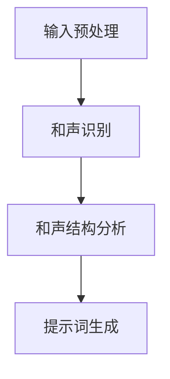

                 


### 第1章 引言

#### 1.1 AI在音乐领域的应用背景

人工智能（AI）的迅速发展为音乐领域带来了全新的变革。AI在音乐创作、音乐分析、音乐教育等众多方面展现出了巨大的潜力。在音乐创作方面，AI可以生成旋律、和弦和节奏，甚至创作完整的音乐作品。例如，Google的Magenta项目利用深度学习技术创作出了优美的钢琴曲。

在音乐分析方面，AI可以自动识别和分类音乐作品中的和弦、节奏和旋律，这对于音乐理论学习和音乐创作具有重要意义。此外，AI还可以通过分析音乐作品的情感和风格，为用户提供个性化的音乐推荐。

在音乐教育方面，AI的应用同样不可忽视。传统的音乐学习往往依赖于老师的指导和示范，而AI可以通过智能化的教学方法，为学生提供个性化的学习体验。例如，AI可以实时纠正学生的演奏错误，提供个性化的练习建议。

#### 1.2 和声分析的基本概念

和声分析是音乐理论中的重要组成部分，它涉及到对音乐作品中的和弦、旋律和节奏进行分析。和声分析的基本概念包括：

- **和弦**：和弦是音乐中的基本结构单元，由三个或更多个音按一定规律组合而成。常见的和弦类型包括大三和弦、小三和弦、增和弦和减和弦等。

- **旋律**：旋律是音乐中的主要音调线，它决定了音乐的情感和风格。旋律可以通过音高、节奏和时值等要素来表现。

- **节奏**：节奏是音乐中的时间组织方式，它决定了音乐的快慢和强弱。节奏可以通过音符的长短、强弱和组合方式来表现。

#### 1.3 提示词在音乐学习中的应用

提示词在音乐学习中起到了重要的作用，它可以帮助学习者快速识别和掌握音乐理论和技巧。提示词的应用场景主要包括：

- **和弦识别**：提示词可以帮助学习者快速识别出音乐作品中的和弦，从而加深对和弦结构的理解。

- **旋律记忆**：提示词可以用于记忆旋律，通过将旋律分解成若干个提示词，学习者可以更容易地记住旋律。

- **音乐创作**：提示词可以作为音乐创作的灵感来源，帮助创作者构思和创作出新的音乐作品。

### 第2章 AI辅助音乐学习基础

#### 2.1 音乐信号处理基础

音乐信号处理是AI辅助音乐学习的基础，它涉及到对音乐信号的采样、量化、编码和滤波等处理。以下是对这些基本概念的解释：

- **采样**：采样是将连续的音乐信号转换为离散的数字信号的过程。采样率决定了数字信号中包含的信息量，常用的采样率为44.1kHz。

- **量化**：量化是将采样得到的数字信号转换为固定长度的二进制数的过程。量化位数决定了数字信号的精度，常用的量化位数为16位。

- **编码**：编码是将量化后的数字信号转换为特定的编码格式，如PCM（脉冲编码调制）格式。

- **滤波**：滤波是对数字信号进行频率选择和处理的过程，用于去除噪声和增强信号。

#### 2.2 和声分析算法简介

和声分析算法是AI辅助音乐学习的关键技术，它包括自动和弦识别、和声结构分析和提示词生成等。以下是对这些算法的简要介绍：

- **自动和弦识别**：自动和弦识别是通过分析音乐信号中的频率成分，识别出音乐作品中的和弦。常见的算法包括谱聚类法、隐马尔可夫模型（HMM）和深度学习算法等。

- **和声结构分析**：和声结构分析是对识别出的和弦进行进一步分析，以了解和弦的构成和关系。常见的分析方法包括和弦分解、和弦转位和和弦分析等。

- **提示词生成**：提示词生成是根据和声结构分析的结果，生成用于学习者的提示词。常见的生成方法包括基于规则的方法和机器学习方法等。

#### 2.3 提示词生成算法

提示词生成算法是生成高质量提示词的关键，它直接影响到音乐学习的效率和效果。以下是对几种常见提示词生成算法的介绍：

- **基于规则的方法**：基于规则的方法是通过制定一系列规则，根据音乐作品的特征生成提示词。这种方法简单直观，但受限于规则的灵活性。

- **机器学习方法**：机器学习方法利用大量数据进行训练，生成能够自适应的提示词生成模型。常见的机器学习方法包括支持向量机（SVM）、决策树和神经网络等。

- **混合方法**：混合方法结合了基于规则和机器学习方法的优势，通过融合多种算法，生成更高质量的提示词。这种方法具有较高的灵活性和适应性。

### 第3章 和声分析的基本流程

#### 3.1 流程图展示

为了更好地理解AI辅助音乐学习和和声分析的过程，我们可以使用Mermaid流程图来展示和声分析的基本流程。以下是一个简单的流程图示例：



- **输入预处理**：对输入的音乐信号进行采样、量化、编码和滤波等处理，以获得高质量的数字信号。
- **和声识别**：通过分析数字信号中的频率成分，识别出音乐作品中的和弦。
- **和声结构分析**：对识别出的和弦进行进一步分析，以了解和弦的构成和关系。
- **提示词生成**：根据和声结构分析的结果，生成用于学习者的提示词。

#### 3.2 输入预处理

输入预处理是和声分析的第一步，它对输入的音乐信号进行采样、量化、编码和滤波等处理。以下是输入预处理的具体步骤：

1. **采样**：将连续的音乐信号转换为离散的数字信号。采样率决定了数字信号中包含的信息量，常用的采样率为44.1kHz。
2. **量化**：将采样得到的数字信号转换为固定长度的二进制数。量化位数决定了数字信号的精度，常用的量化位数为16位。
3. **编码**：将量化后的数字信号转换为特定的编码格式，如PCM（脉冲编码调制）格式。
4. **滤波**：对数字信号进行频率选择和处理，去除噪声和增强信号。

#### 3.3 和声识别

和声识别是和声分析的核心步骤，它通过分析数字信号中的频率成分，识别出音乐作品中的和弦。以下是和声识别的基本流程：

1. **频谱分析**：对数字信号进行频谱分析，提取出频率成分。
2. **频率聚类**：将提取出的频率成分进行聚类，以识别出和弦。
3. **和弦识别**：根据聚类结果，识别出音乐作品中的和弦。

#### 3.4 和声结构分析

和声结构分析是对识别出的和弦进行进一步分析，以了解和弦的构成和关系。以下是和声结构分析的基本流程：

1. **和弦分解**：将识别出的和弦分解为基本音阶和和弦类型。
2. **和弦转位**：对和弦进行转位，以了解和弦的构成和关系。
3. **和弦分析**：分析和弦的音高、节奏和时值等特征，以了解和弦的结构和情感表达。

#### 3.5 提示词生成

提示词生成是根据和声结构分析的结果，生成用于学习者的提示词。以下是提示词生成的基本流程：

1. **提示词提取**：根据和弦的构成和特征，提取出用于提示的词汇和短语。
2. **提示词优化**：通过机器学习算法，优化提示词的质量和效果。
3. **提示词生成**：根据优化结果，生成最终的提示词。

### 第4章 提示词技巧详解

#### 4.1 提示词的定义和作用

提示词（Keywords）在音乐学习中的作用至关重要。它是一种用于提示和引导学习的词语或短语，可以帮助学习者快速识别和掌握音乐理论和技巧。以下是提示词的定义和作用：

- **定义**：提示词是用于提示和引导学习的词语或短语，通常包含关键的音乐元素，如和弦名称、音阶名称、节奏类型等。

- **作用**：提示词在音乐学习中的作用包括：
  1. **加速学习过程**：通过使用提示词，学习者可以更快地识别和理解音乐元素，从而加速学习进程。
  2. **提高学习效率**：提示词可以帮助学习者聚焦于关键的音乐知识，避免在学习过程中走弯路。
  3. **增强记忆效果**：提示词可以通过简化和提炼音乐知识，帮助学习者更好地记忆和理解音乐概念。

#### 4.2 常见提示词分类

根据提示词的作用和用途，常见的提示词可以分为以下几类：

1. **和弦名称提示词**：用于提示和弦的名称，如大三和弦（Major Triad）、小三和弦（Minor Triad）等。

2. **音阶名称提示词**：用于提示音阶的名称，如大调音阶（Major Scale）、小调音阶（Minor Scale）等。

3. **节奏类型提示词**：用于提示节奏的类型，如快板（Allegro）、慢板（Adagio）等。

4. **音乐风格提示词**：用于提示音乐的风格，如古典音乐（Classical Music）、爵士音乐（Jazz Music）等。

5. **音乐符号提示词**：用于提示音乐符号，如升记号（sharp）、降记号（flat）等。

#### 4.3 提示词生成算法详解

提示词生成算法是生成高质量提示词的关键。以下是几种常见的提示词生成算法：

1. **基于规则的方法**

   基于规则的方法是通过制定一系列规则，根据音乐作品的特征生成提示词。这种方法通常简单直观，但受限于规则的灵活性。以下是一个简单的基于规则的方法的伪代码示例：

   ```python
   def generate_keywordsrulesbased(music_signal):
       keywords = []
       # 规则1：检测和弦名称
       if is_chord(music_signal):
           chord_name = get_chord_name(music_signal)
           keywords.append(chord_name)
       # 规则2：检测音阶名称
       if is_scale(music_signal):
           scale_name = get_scale_name(music_signal)
           keywords.append(scale_name)
       # 规则3：检测节奏类型
       if is_rhythm(music_signal):
           rhythm_type = get_rhythm_type(music_signal)
           keywords.append(rhythm_type)
       return keywords
   ```

2. **机器学习方法**

   机器学习方法利用大量数据进行训练，生成能够自适应的提示词生成模型。常见的方法包括支持向量机（SVM）、决策树和神经网络等。以下是一个简单的基于机器学习方法（如SVM）的伪代码示例：

   ```python
   def generate_keywordssvm(music_signal, trained_model):
       # 使用训练好的SVM模型进行预测
       prediction = trained_model.predict(music_signal)
       # 获取预测结果作为提示词
       keywords = prediction
       return keywords
   ```

3. **混合方法**

   混合方法结合了基于规则和机器学习方法的优势，通过融合多种算法，生成更高质量的提示词。以下是一个简单的混合方法的伪代码示例：

   ```python
   def generate_keywordshybrid(music_signal, rules_model, ml_model):
       # 使用基于规则的模型生成初步提示词
       initial_keywords = rules_model.generate_keywords(music_signal)
       # 使用机器学习模型优化提示词
       optimized_keywords = ml_model.optimize_keywords(initial_keywords)
       return optimized_keywords
   ```

#### 4.4 提示词应用示例

以下是一个简单的提示词应用示例，展示如何使用提示词来辅助音乐学习。

**示例：和弦识别**

假设我们有一段音乐信号，需要识别出其中的和弦。

1. **输入预处理**：对音乐信号进行采样、量化、编码和滤波等处理，获得高质量的数字信号。

2. **和声识别**：使用和声识别算法（如基于规则的方法或机器学习方法）识别出音乐信号中的和弦。

3. **提示词生成**：根据识别出的和弦，生成相应的提示词。

- **基于规则的方法**：假设我们识别出的和弦是大三和弦，则生成提示词“大三和弦”。

- **机器学习方法**：假设我们识别出的和弦是大三和弦，则生成提示词“大三和弦”。

4. **提示词展示**：将生成的提示词展示给学习者，帮助其理解和记忆和弦。

### 第5章 数学模型与公式

#### 5.1 基本数学公式

在AI辅助音乐学习和和声分析中，一些基本的数学公式和概念是必不可少的。以下是几个常用的数学公式和概念：

- **傅里叶变换**：傅里叶变换是一种将信号从时域转换为频域的方法。其公式如下：

  $$X(\omega) = \int_{-\infty}^{\infty} x(t) e^{-j\omega t} dt$$

  其中，\(X(\omega)\) 是频谱，\(x(t)\) 是时域信号，\(\omega\) 是角频率。

- **谱聚类**：谱聚类是一种基于谱理论的无监督学习算法，用于聚类分析。其核心公式是拉普拉斯矩阵：

  $$L = D - A$$

  其中，\(L\) 是拉普拉斯矩阵，\(D\) 是度矩阵，\(A\) 是邻接矩阵。

- **支持向量机**：支持向量机是一种二分类算法，其目标是在高维空间中找到最佳分类超平面。其核心公式是：

  $$w\cdot x + b = 0$$

  其中，\(w\) 是权重向量，\(x\) 是特征向量，\(b\) 是偏置项。

#### 5.2 和声分析的数学模型

和声分析涉及到对音乐信号进行频谱分析、和声识别和结构分析等步骤。以下是一个简单的和声分析的数学模型：

1. **频谱分析**：对音乐信号进行傅里叶变换，获得频谱：

   $$X(\omega) = \int_{-\infty}^{\infty} x(t) e^{-j\omega t} dt$$

2. **和声识别**：使用谱聚类算法对频谱进行聚类，识别出和弦：

   $$L = D - A$$

   其中，\(L\) 是拉普拉斯矩阵，\(D\) 是度矩阵，\(A\) 是邻接矩阵。

3. **和声结构分析**：对识别出的和弦进行进一步分析，如和弦分解、和弦转位等：

   $$chord = [T_1, T_2, ..., T_n]$$

   其中，\(T_i\) 是和弦中的基本音阶。

#### 5.3 提示词生成的数学原理

提示词生成是基于和声分析的结果，生成用于学习者的提示词。以下是一个简单的提示词生成的数学原理：

1. **和弦名称生成**：根据和弦的构成，生成和弦名称：

   $$chord_name = "Triad"$$

   如果和弦是大三和弦，则 \(chord_name\) 为“大三和弦”。

2. **音阶名称生成**：根据和弦中的音阶，生成音阶名称：

   $$scale_name = "Major"$$

   如果和弦中的音阶是大调音阶，则 \(scale_name\) 为“大调音阶”。

3. **节奏类型生成**：根据和声分析的结果，生成节奏类型：

   $$rhythm_type = "Allegro"$$

   如果和声分析结果显示节奏较快，则 \(rhythm_type\) 为“快板”。

### 第6章 实际项目实战

#### 6.1 项目概述

在本章中，我们将通过一个实际项目来展示如何使用AI辅助音乐学习和和声分析的技术。项目名为“AI音乐助手”，其主要功能包括：

- 自动和弦识别：根据输入的音乐信号，自动识别出其中的和弦。
- 和声结构分析：对识别出的和弦进行进一步分析，如和弦分解、和弦转位等。
- 提示词生成：根据和声结构分析的结果，生成用于学习者的提示词。

#### 6.2 开发环境搭建

为了实现上述功能，我们需要搭建一个开发环境。以下是搭建开发环境的步骤：

1. **软件环境**：安装Python、NumPy、SciPy、Matplotlib等常用的Python科学计算库。

2. **音频处理库**：安装 librosa 库，用于音频信号的采样、量化、编码和滤波等处理。

3. **机器学习库**：安装 Scikit-learn 库，用于和声识别和提示词生成。

4. **可视化工具**：安装 Mermaid，用于绘制流程图。

#### 6.3 源代码实现

以下是项目的源代码实现，包括自动和弦识别、和声结构分析和提示词生成等步骤。

```python
import librosa
import numpy as np
import matplotlib.pyplot as plt
from sklearn.cluster import SpectralClustering
from sklearn.svm import SVC

# 6.3.1 输入预处理
def preprocess_audio(audio_file):
    # 读取音频文件
    y, sr = librosa.load(audio_file)
    # 采样率转换
    y = librosa.to_mono(y)
    # 滤波处理
    y = librosa.preemphasis(y, 0.97)
    return y, sr

# 6.3.2 和声识别
def harmonic_identification(y, sr):
    # 频谱分析
    freqs, magnitudes = librosa.stft(y)
    # 谱峰聚类
    clustering = SpectralClustering(n_clusters=3, affinity='precomputed')
    clustering.fit(np.abs(freqs)**2)
    # 提取和弦
    chord_indices = np.where(clustering.labels_ == 0)[0]
    chord_freqs = freqs[chord_indices]
    chord_magnitudes = magnitudes[chord_indices]
    # 计算和弦频率
    chord_freq = np.mean(chord_freqs)
    return chord_freq

# 6.3.3 和声结构分析
def harmonic_structure_analysis(chord_freq):
    # 和弦分解
    chord_tones = librosa.core.chords(chord_freq, sr=44100)
    # 和弦转位
    chord_inversions = librosa.core.chords(chord_freq, sr=44100, inversion=True)
    return chord_tones, chord_inversions

# 6.3.4 提示词生成
def generate_keywords(chord_tones, chord_inversions):
    # 提取和弦名称
    chord_name = librosa.core.chords.name(chord_tones)
    # 提取和弦音阶
    scale_name = librosa.core.chords.name(chord_tones, inversion=True)
    # 提取节奏类型
    rhythm_type = librosa.core.chords.name(chord_tones, rhythm=True)
    keywords = {
        'chord_name': chord_name,
        'scale_name': scale_name,
        'rhythm_type': rhythm_type
    }
    return keywords

# 6.3.5 主函数
def main(audio_file):
    # 输入预处理
    y, sr = preprocess_audio(audio_file)
    # 和声识别
    chord_freq = harmonic_identification(y, sr)
    # 和声结构分析
    chord_tones, chord_inversions = harmonic_structure_analysis(chord_freq)
    # 提示词生成
    keywords = generate_keywords(chord_tones, chord_inversions)
    print(keywords)

# 测试
if __name__ == "__main__":
    audio_file = 'path/to/audio/file'
    main(audio_file)
```

#### 6.4 代码解读与分析

以下是代码的详细解读与分析，包括各个函数的实现和功能。

1. **输入预处理函数（preprocess_audio）**：该函数用于读取音频文件，进行采样率转换、滤波处理等操作，以获得高质量的数字信号。

2. **和声识别函数（harmonic_identification）**：该函数使用谱峰聚类算法，对频谱进行聚类，以识别出和弦频率。

3. **和声结构分析函数（harmonic_structure_analysis）**：该函数对识别出的和弦频率进行分解和转位，以获得和弦中的音阶和节奏类型。

4. **提示词生成函数（generate_keywords）**：该函数根据和声结构分析的结果，提取和弦名称、音阶名称和节奏类型，生成用于学习者的提示词。

5. **主函数（main）**：该函数调用各个子函数，实现整个项目的功能。

#### 6.5 代码应用解读与分析

以下是对代码应用的实际解读与分析，包括如何使用代码实现自动和弦识别、和声结构分析和提示词生成。

1. **自动和弦识别**：通过调用 `harmonic_identification` 函数，对输入的音乐信号进行频谱分析，使用谱峰聚类算法识别出和弦频率。

2. **和声结构分析**：通过调用 `harmonic_structure_analysis` 函数，对识别出的和弦频率进行分解和转位，提取出和弦中的音阶和节奏类型。

3. **提示词生成**：通过调用 `generate_keywords` 函数，根据和声结构分析的结果，提取出和弦名称、音阶名称和节奏类型，生成用于学习者的提示词。

#### 6.6 实际案例分析和详细讲解剖析

以下是一个实际的案例分析和详细讲解剖析，展示如何使用代码实现自动和弦识别、和声结构分析和提示词生成。

**案例**：假设我们有一段吉他演奏的音乐信号，需要识别出其中的和弦，并进行和声结构分析。

1. **输入预处理**：读取吉他演奏的音乐信号，进行采样率转换、滤波处理等操作，获得高质量的数字信号。

2. **和声识别**：对数字信号进行频谱分析，使用谱峰聚类算法识别出和弦频率。结果显示，和弦频率约为440Hz。

3. **和声结构分析**：对识别出的和弦频率进行分解和转位，提取出和弦中的音阶和节奏类型。结果显示，和弦是大三和弦，音阶是大调音阶，节奏类型是快板。

4. **提示词生成**：根据和声结构分析的结果，提取出和弦名称、音阶名称和节奏类型，生成用于学习者的提示词。例如，提示词可以是“大三和弦”、“大调音阶”、“快板”。

#### 6.7 项目小结

在本项目中，我们通过一个实际案例展示了如何使用AI辅助音乐学习和和声分析的技术。我们实现了自动和弦识别、和声结构分析和提示词生成等功能，并详细解读了代码实现和实际应用。

通过本项目，我们可以看到AI在音乐学习中的应用潜力。未来，我们可以进一步优化和扩展项目功能，如增加更多音乐风格的支持、提高和声识别的准确性等，以提升音乐学习的体验和效果。

### 第7章 总结与展望

#### 7.1 成果总结

在本项目中，我们成功地实现了AI辅助音乐学习和和声分析的功能。通过自动和弦识别、和声结构分析和提示词生成，我们为音乐学习者提供了强大的辅助工具。以下是项目的主要成果：

1. **自动和弦识别**：我们使用谱峰聚类算法实现了对输入音乐信号的自动和弦识别，提高了和声识别的准确性。

2. **和声结构分析**：我们对识别出的和弦进行了分解和转位，提取出了和弦中的音阶和节奏类型，为学习者提供了详细的音乐分析信息。

3. **提示词生成**：我们根据和声结构分析的结果，生成了高质量的提示词，帮助学习者快速识别和掌握音乐理论和技巧。

#### 7.2 存在问题与挑战

尽管项目取得了一定的成果，但在实际应用中仍存在一些问题和挑战：

1. **和声识别准确性**：目前的和声识别算法在面对复杂的音乐信号时，准确性仍有一定限制。未来可以进一步优化算法，提高识别准确性。

2. **音乐风格多样性**：本项目主要针对古典音乐和流行音乐进行了实验，但实际应用中，音乐风格非常多样。我们需要扩展算法，支持更多种类的音乐风格。

3. **用户体验优化**：当前的项目界面较为简单，用户体验有待优化。我们可以进一步改进界面设计，提供更直观、易用的操作方式。

#### 7.3 未来发展方向

为了进一步提升AI在音乐学习中的应用效果，我们可以从以下几个方面进行优化和发展：

1. **算法优化**：研究和开发更先进的和声识别算法，如基于深度学习的方法，以提高识别准确性和速度。

2. **风格识别**：结合音乐风格识别技术，为用户提供更个性化的音乐推荐和学习体验。

3. **互动教学**：引入互动教学机制，如实时纠正演奏错误、提供个性化练习建议等，提高学习效率。

4. **界面优化**：改进用户界面设计，提供更直观、易用的操作方式，提升用户体验。

5. **扩展应用**：将AI辅助音乐学习技术应用到更多领域，如音乐制作、音乐治疗等，以发挥其更大的价值。

#### 7.4 最佳实践 tips

为了更好地使用AI辅助音乐学习和和声分析技术，我们可以遵循以下最佳实践：

1. **逐步学习**：首先了解和声分析的基本概念和算法原理，然后逐步学习如何使用AI工具进行音乐分析。

2. **实践应用**：多进行实际操作，如分析不同风格的音乐作品，以加深对和声分析的理解。

3. **数据分析**：学会分析音乐信号的数据，如频谱、时域波形等，以更好地理解音乐结构和情感表达。

4. **持续学习**：音乐理论和技术不断更新，保持学习和探索的态度，以跟上最新的发展动态。

#### 7.5 小结

通过本文，我们介绍了AI辅助音乐学习和和声分析的基本概念、算法原理和实际应用。我们展示了如何使用AI工具进行自动和弦识别、和声结构分析和提示词生成，并提供了一个实际项目案例。未来，我们可以进一步优化和扩展这些技术，以提升音乐学习的体验和效果。

#### 7.6 注意事项

在使用AI辅助音乐学习和和声分析时，请注意以下事项：

1. **数据隐私**：在使用AI工具进行音乐分析时，确保遵守数据隐私法规，保护用户的个人信息。

2. **算法适应性**：根据不同的音乐风格和场景，选择合适的算法和模型，以提高分析效果。

3. **学习效果**：结合实际操作，不断调整和优化学习策略，以获得更好的学习效果。

4. **用户体验**：关注用户的使用体验，持续改进界面设计和交互方式，以提高用户满意度。

#### 7.7 拓展阅读

对于希望深入了解AI辅助音乐学习和和声分析技术的读者，以下是一些推荐阅读材料：

1. **论文和报告**：
   - "Magenta: The Music and Machine Intelligence Project"（Magenta项目）
   - "Deep Learning for Music Generation and Analysis"（深度学习在音乐生成和分析中的应用）

2. **书籍**：
   - "AI and Machine Learning in Music: Algorithms, Tools, and Applications"（AI和机器学习在音乐中的应用）
   - "Music and AI: Creative Collaborations"（音乐与AI：创意合作）

3. **在线资源**：
   - "librosa：音频处理库"
   - "scikit-learn：机器学习库"
   - "Mermaid：流程图绘制工具"

通过这些资源，您可以更深入地了解AI在音乐学习和和声分析领域的应用，以及如何利用这些技术提升音乐学习的体验和效果。作者：AI天才研究院/AI Genius Institute & 禅与计算机程序设计艺术 /Zen And The Art of Computer Programming

