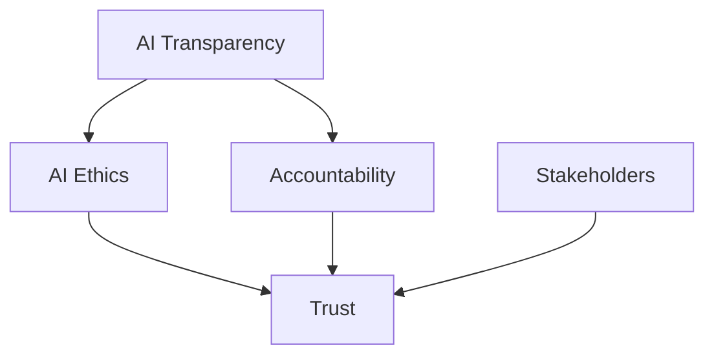

                 

### Introduction to AI Transparency

**关键词**: AI Transparency, AI Ethics, Accountability, Stakeholders

**摘要**: This article delves into the concept of AI transparency, its importance in the current landscape, and how businesses can effectively communicate AI decisions to their stakeholders. We will explore the ethical and accountability implications of AI and discuss the steps involved in developing and testing AI models.

---

**Background Introduction**

Artificial Intelligence (AI) has revolutionized various industries, offering unprecedented capabilities for decision-making, automation, and optimization. However, the increasing integration of AI into everyday systems has raised concerns about transparency, ethical implications, and accountability. As AI systems become more complex, the need for transparency has become increasingly important to build trust with stakeholders, including customers, employees, regulators, and investors.

**Core Concepts and Relationships**

To understand AI transparency, we need to explore the core concepts and their relationships. Below is a Mermaid diagram illustrating the key components:

**AI Ethics and Accountability**

AI ethics revolves around the principles and values that guide the development, deployment, and use of AI systems. These principles include fairness, privacy, and accountability. Accountability ensures that individuals or organizations are held responsible for the actions and outcomes of AI systems.

**Impact on Stakeholders**

The impact of AI transparency on stakeholders can be profound. For internal stakeholders, such as employees, transparency fosters trust and understanding of AI-driven decisions. For external stakeholders, such as customers and investors, transparency enhances trust and credibility in the organization. Furthermore, regulatory requirements often mandate the disclosure of AI transparency, making it a crucial aspect for compliance.

**Conclusion**

In conclusion, AI transparency is essential for building trust, ensuring ethical practices, and complying with regulatory requirements. Understanding the importance of AI transparency and its impact on stakeholders is the first step in developing and communicating AI decisions effectively. In the following sections, we will delve deeper into the technical aspects of AI transparency, including model development, testing, and communication strategies.

---

In the next section, we will explore the various AI technologies and their role in transparency. We will discuss key AI concepts, the differences between machine learning and deep learning, and the applications of neural networks. Stay tuned!

---

### Understanding AI Technologies

**Keywords**: AI Technologies, Machine Learning, Deep Learning, Neural Networks

**Summary**: This section provides an overview of the key AI technologies and their roles in enhancing transparency. We will discuss the fundamental concepts of AI, including machine learning, deep learning, and neural networks, and explore how these technologies contribute to transparency.

---

**AI Basics**

Artificial Intelligence (AI) refers to the simulation of human intelligence in machines that are programmed to think like humans and perform tasks typically requiring human intelligence, such as visual perception, speech recognition, decision-making, and language translation.

**Machine Learning vs. Deep Learning**

Machine Learning (ML) is a subset of AI that involves training algorithms to learn from data and make predictions or decisions without being explicitly programmed. ML algorithms analyze data patterns to identify relationships and make predictions based on new data.

Deep Learning (DL) is a subfield of machine learning concerned with neural networks, specifically deep neural networks, that have many layers for extracting features from data. DL is inspired by the structure and function of the human brain, with artificial neural networks designed to recognize patterns.

**Neural Networks and Their Applications**

Neural networks are a fundamental component of deep learning. They are composed of layers of interconnected nodes, or neurons, that process and transmit information. Neural networks can be used for various tasks, including image and speech recognition, natural language processing, and time series analysis.

**Model Complexity and Interpretability**

AI model complexity is a significant challenge in achieving transparency. As models become more complex, it becomes harder to understand how and why they make specific decisions. To address this, researchers have developed various techniques for enhancing model interpretability, such as attention mechanisms, visualization tools, and explainable AI (XAI) methods.

**Techniques for Enhancing Transparency**

To improve transparency, several techniques can be employed:

1. **Model Simplification**: Reducing the complexity of models by removing unnecessary layers or features can improve interpretability.
2. **Attention Mechanisms**: These mechanisms highlight important parts of the input data that contribute to the model's decision, making it easier to understand.
3. **Visualization Tools**: Tools like heatmaps and decision trees can visualize the decision-making process, making it more transparent.
4. **Explainable AI (XAI)**: XAI methods provide explanations for AI decisions, helping stakeholders understand the reasoning behind them.

**Conclusion**

Understanding AI technologies is crucial for achieving transparency in AI systems. By exploring the fundamentals of AI, including machine learning, deep learning, and neural networks, and discussing techniques for enhancing transparency, we can better communicate AI decisions to stakeholders. In the following sections, we will delve into the model development and testing process to further understand AI transparency. Stay tuned!

---

In the next section, we will discuss the model development and testing process, including data preparation, model selection, training, and evaluation. This will provide a deeper understanding of how to ensure AI model transparency. Let's continue!

---

### Developing and Testing AI Models

**Keywords**: AI Model Development, Data Preparation, Model Selection, Training, Evaluation

**Summary**: This section discusses the essential steps in developing and testing AI models to ensure transparency. We will cover data preparation, model selection and training, hyperparameter tuning, model evaluation, and validation techniques.

---

**AI Model Development Process**

Developing an AI model involves several critical steps, each contributing to the overall transparency of the system. Below is a detailed explanation of these steps:

**1. Data Preparation and Preprocessing**

The first step in developing an AI model is data preparation and preprocessing. This involves collecting and cleaning the data, handling missing values, and transforming the data into a suitable format for modeling. Data preprocessing is crucial as the quality of the input data directly impacts the performance and interpretability of the model.

**Data Collection and Cleaning**
- **Data Collection**: Gather relevant data from various sources, ensuring the data is representative of the problem domain.
- **Data Cleaning**: Remove or impute missing values, handle outliers, and correct any inconsistencies in the data.

**Feature Engineering**
- **Feature Extraction**: Select and transform input features to enhance the model's ability to capture relevant patterns in the data.
- **Feature Scaling**: Normalize or standardize the data to ensure that all features contribute equally to the model's training process.

**2. Model Selection and Training**

Once the data is prepared, the next step is selecting an appropriate model and training it on the data. Model selection involves choosing a suitable algorithm based on the problem's nature and the data's characteristics.

**Model Selection**
- **Algorithm Selection**: Choose an algorithm that best fits the problem, such as logistic regression, decision trees, or neural networks.
- **Cross-Validation**: Use cross-validation techniques to evaluate the model's performance and select the best model.

**Model Training**
- **Training Data**: Split the data into training and validation sets to train and evaluate the model.
- **Training Process**: Train the model using the training data and adjust the model parameters to optimize its performance.

**3. Hyperparameter Tuning and Optimization**

Hyperparameter tuning is a critical step in model development to improve the model's performance and transparency. Hyperparameters are the parameters set before training the model, such as the learning rate, number of layers, or the number of neurons in a layer.

**Hyperparameter Tuning**
- **Tuning Methods**: Use techniques like grid search or random search to find the optimal combination of hyperparameters.
- **Optimization**: Optimize the hyperparameters to improve the model's accuracy, robustness, and interpretability.

**4. Model Evaluation and Validation**

Evaluating and validating the model is crucial to ensure its transparency and reliability. This step involves assessing the model's performance using various metrics and validation techniques.

**Model Evaluation**
- **Performance Metrics**: Use metrics such as accuracy, precision, recall, and F1 score to evaluate the model's performance.
- **Confusion Matrix**: Analyze the confusion matrix to understand the model's performance across different classes.

**Model Validation**
- **Cross-Validation**: Apply cross-validation techniques to ensure the model's generalizability and robustness.
- **Validation Sets**: Use validation sets to evaluate the model's performance on unseen data and detect overfitting.

**Ensuring Model Reliability**
- **Robustness Testing**: Test the model's robustness to various input variations and anomalies.
- **Error Analysis**: Analyze the model's errors to identify patterns and improve its performance.

**Conclusion**

Developing and testing AI models is a complex process that requires careful consideration of data preparation, model selection, training, hyperparameter tuning, and evaluation. By following these steps, businesses can ensure that their AI models are transparent, reliable, and interpretable, fostering trust and credibility with stakeholders. In the next section, we will discuss how to effectively communicate AI transparency to stakeholders. Let's continue!

---

In the next section, we will explore how to communicate AI transparency to stakeholders, including the target audiences, communication goals, and best practices for creating AI transparency reports. Stay tuned!

---

### Communicating AI Transparency to Stakeholders

**Keywords**: AI Transparency Communication, Stakeholders, Target Audiences, Legal Requirements

**Summary**: This section outlines how businesses can effectively communicate AI transparency to their stakeholders. We will discuss the target audiences, communication goals, and the best practices for creating AI transparency reports, including content and structure.

---

**Target Audiences and Communication Goals**

Effective communication of AI transparency is essential to build trust and credibility with various stakeholders. The primary target audiences and their communication goals include:

**Internal Stakeholders**

1. **Employees**: Building trust and understanding of AI-driven decisions to enhance employee confidence and engagement.
2. **Management**: Ensuring transparency in AI initiatives to facilitate informed decision-making and resource allocation.

**External Stakeholders**

1. **Customers**: Enhancing trust in AI products and services by providing insights into AI decision-making processes.
2. **Investors**: Demonstrating the reliability and potential of AI initiatives to attract investment and maintain stakeholder confidence.
3. **Regulators**: Complying with legal and regulatory requirements to avoid penalties and maintain compliance.

**Legal and Regulatory Requirements**

Legal and regulatory requirements often mandate the disclosure of AI transparency. For example, the European Union's General Data Protection Regulation (GDPR) requires organizations to be transparent about AI systems' data processing and decision-making processes. Similarly, other countries and regions may have specific regulations governing AI transparency.

**Creating AI Transparency Reports**

To effectively communicate AI transparency, businesses should create comprehensive AI transparency reports. These reports should include the following components:

**1. Content and Structure**

AI transparency reports should be well-structured and informative, with clear sections that address different aspects of AI transparency. The key sections include:

- **Executive Summary**: A concise overview of the AI system, its purpose, and the main findings of the transparency report.
- **Introduction**: Background information on the AI system, including its development context and the problem it aims to solve.
- **AI Model Description**: Detailed information on the AI model, including its architecture, training data, and performance metrics.
- **Model Interpretability**: Methods used to enhance model interpretability, such as visualization tools, attention mechanisms, or explainable AI (XAI) techniques.
- **Risk Assessment**: Identification and analysis of potential risks associated with the AI system, including biases, errors, and ethical concerns.
- **Validation and Testing**: Description of the validation and testing processes, including cross-validation techniques and robustness testing.
- **Conclusion**: Summary of the main findings, recommendations for improvement, and future research directions.

**2. Visualizing AI Models and Decisions**

Visualizing AI models and decisions can significantly enhance transparency. Tools such as heatmaps, decision trees, and attention mechanisms can help stakeholders understand the model's decision-making process. For example:

- **Heatmaps**: Visual representations of feature importance, highlighting the most influential variables in the model's predictions.
- **Decision Trees**: Visual models that display the decision paths and rules used by the AI system to make predictions.
- **Attention Mechanisms**: Visualizations of the attention weights, indicating which parts of the input data the model focuses on during decision-making.

**3. Best Practices**

To ensure effective communication of AI transparency, businesses should follow these best practices:

- **Clarity and Conciseness**: Use clear and concise language to convey complex information without sacrificing detail.
- **Accessibility**: Ensure that the transparency report is accessible to a diverse audience, including non-technical stakeholders.
- **Consistency**: Maintain consistency in the report's format, structure, and terminology to enhance readability and comprehension.
- **Feedback and Iteration**: Gather feedback from stakeholders to refine and improve the transparency report, ensuring that it meets their needs and expectations.

**Conclusion**

Communicating AI transparency to stakeholders is crucial for building trust, ensuring compliance with legal and regulatory requirements, and fostering informed decision-making. By following best practices and creating comprehensive AI transparency reports, businesses can effectively communicate the complexities of their AI systems and enhance stakeholder understanding and confidence. In the next section, we will discuss the challenges and best practices in implementing AI transparency in real-world applications. Let's continue!

---

In the next section, we will address the challenges and best practices in implementing AI transparency in real-world applications. We will explore common challenges, strategies for overcoming them, and the importance of continuous improvement. Stay tuned!

---

### Challenges and Best Practices in Implementing AI Transparency

**Keywords**: AI Transparency Implementation, Challenges, Strategies, Continuous Improvement

**Summary**: This section addresses the challenges businesses face when implementing AI transparency and discusses best practices for overcoming these challenges. We will explore strategies for improving AI transparency and the importance of continuous improvement in ensuring long-term success.

---

**Challenges in Implementing AI Transparency**

Implementing AI transparency is not without challenges. Businesses often face several obstacles that can hinder the effectiveness of their AI transparency initiatives. Some common challenges include:

1. **Data Privacy and Security**
   - Ensuring the privacy and security of sensitive data used in AI models can be a significant challenge. Businesses must balance transparency with the need to protect personal information and comply with data protection regulations.

2. **Model Complexity**
   - As AI models become more complex, it becomes increasingly difficult to interpret and explain their decision-making processes. This complexity can make it challenging to achieve the level of transparency required by stakeholders.

3. **Resource Constraints**
   - Implementing AI transparency often requires additional resources, including time, expertise, and technology. Businesses may face constraints in allocating these resources effectively.

4. **Regulatory Compliance**
   - Compliance with evolving legal and regulatory requirements related to AI transparency can be a complex and time-consuming process. Businesses must stay updated with the latest regulations and ensure their AI systems meet these requirements.

**Best Practices for Overcoming Challenges**

To overcome these challenges and effectively implement AI transparency, businesses should consider the following best practices:

1. **Invest in Data Governance**
   - Establishing a robust data governance framework is essential for ensuring the privacy and security of sensitive data. This framework should include data anonymization, encryption, and regular audits to identify and mitigate potential risks.

2. **Enhance Model Interpretability**
   - Businesses should invest in developing and deploying interpretability tools that can help demystify complex models. Techniques such as visualization, attention mechanisms, and explainable AI (XAI) can enhance model transparency and build stakeholder trust.

3. ** Allocate Resources Strategically**
   - Allocate resources strategically to ensure that AI transparency initiatives are adequately supported. This may involve hiring experts in AI interpretability and data governance, investing in advanced tools and technologies, and providing ongoing training for employees.

4. **Stay Updated with Regulations**
   - Regularly monitor and comply with evolving legal and regulatory requirements related to AI transparency. Engage with industry experts, legal advisors, and regulatory bodies to stay informed about the latest developments and ensure compliance.

**Continuous Improvement**

Continuous improvement is crucial for ensuring the long-term success of AI transparency initiatives. Businesses should adopt a proactive approach to identify, address, and mitigate potential risks and challenges. This can be achieved through the following strategies:

1. **Regular Audits and Assessments**
   - Conduct regular audits and assessments of AI systems to evaluate their transparency and identify areas for improvement. This can help businesses stay ahead of regulatory requirements and maintain stakeholder trust.

2. **Feedback and Collaboration**
   - Gather feedback from stakeholders, including employees, customers, and investors, to identify their needs and concerns. Collaborate with stakeholders to develop and refine transparency reports and strategies.

3. **Ongoing Training and Education**
   - Provide ongoing training and education for employees on AI transparency, data governance, and regulatory compliance. This can help build a culture of transparency and ensure that all team members are aligned with the organization's goals.

4. **Innovation and Research**
   - Encourage innovation and research in AI transparency to explore new techniques and approaches. This can help businesses stay at the forefront of the field and develop cutting-edge solutions.

**Conclusion**

Implementing AI transparency is a complex and ongoing process that requires careful planning, resource allocation, and continuous improvement. By addressing the challenges and adopting best practices, businesses can effectively communicate AI decisions to stakeholders, build trust, and ensure compliance with legal and regulatory requirements. Continuous improvement and a proactive approach are key to ensuring the long-term success of AI transparency initiatives. In the next section, we will summarize the key points and provide a final message on the importance of AI transparency. Stay tuned!

---

In the final section, we will summarize the key points discussed in the article and emphasize the importance of AI transparency. We will also provide a concluding message to encourage further exploration and application of AI transparency principles. Let's proceed!

---

### Conclusion and Final Message

**Keywords**: AI Transparency, Stakeholder Communication, Continuous Improvement

**Summary**: This article has explored the concept of AI transparency, its significance, and the steps involved in developing and communicating AI models to stakeholders. We have discussed the challenges and best practices for implementing AI transparency and highlighted the importance of continuous improvement.

---

**Key Points**

1. **The Importance of AI Transparency**: AI transparency is essential for building trust, ensuring ethical practices, and complying with regulatory requirements.
2. **Understanding AI Technologies**: We discussed the fundamentals of AI, including machine learning, deep learning, and neural networks, and their role in enhancing transparency.
3. **Model Development and Testing**: The process of developing and testing AI models, including data preparation, model selection, training, and evaluation, is crucial for achieving transparency.
4. **Communicating AI Transparency**: Effective communication of AI transparency to stakeholders, including internal and external audiences, is vital for building trust and credibility.
5. **Challenges and Best Practices**: We addressed the challenges in implementing AI transparency and discussed best practices for overcoming these challenges and ensuring continuous improvement.

**Final Message**

As we have seen, AI transparency is a critical aspect of AI development and deployment. By following the principles and best practices outlined in this article, businesses can enhance their AI systems' transparency, build trust with stakeholders, and ensure compliance with legal and regulatory requirements.

However, AI transparency is an ongoing process that requires continuous improvement. We encourage readers to explore further resources, stay updated with the latest developments in AI, and actively participate in the discussion surrounding AI ethics and transparency.

**Encouragement for Further Exploration**

- Engage with industry experts and thought leaders to gain insights into the latest AI transparency trends and practices.
- Participate in workshops, conferences, and webinars focused on AI ethics, transparency, and governance.
- Contribute to open-source projects and research initiatives that promote AI transparency and ethical practices.
- Encourage a culture of transparency and collaboration within your organization, fostering a supportive environment for continuous improvement.

**Closing Thoughts**

In conclusion, AI transparency is not just a technical challenge but a fundamental principle that underpins the responsible development and deployment of AI systems. By prioritizing transparency, businesses can build a foundation of trust, credibility, and ethical integrity that will serve them well in the rapidly evolving landscape of AI.

**Authors**

- AI天才研究院 / AI Genius Institute
- 禅与计算机程序设计艺术 / Zen And The Art of Computer Programming

---

Thank you for reading this article. We hope that it has provided valuable insights into the importance of AI transparency and its implications for businesses and stakeholders. Remember, the journey towards AI transparency is an ongoing one, and we invite you to join us in this exciting and transformative journey.

**References**

- European Commission. (2016). General Data Protection Regulation.
- McSherry, F., & Fong, R. (2018). AI & the Law: An Introduction.
- Russell, S., & Norvig, P. (2020). Artificial Intelligence: A Modern Approach.

