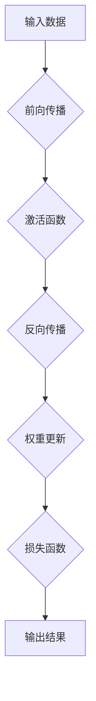

                 

### 文章标题

《AI驱动的企业决策支持：增强管理层判断力》

### 关键词

AI，企业决策支持，管理层判断力，机器学习，深度学习，决策优化，数据挖掘，商业智能

### 摘要

本文旨在探讨人工智能（AI）在现代企业决策支持中的作用，特别是如何通过AI技术提升管理层的判断力和决策效率。文章将详细分析AI基础理论，介绍AI在企业决策支持系统中的应用，探讨管理层判断力的提升方法，并通过具体案例分析AI技术的实际应用效果。文章还将总结最佳实践，展望未来AI在企业决策支持领域的趋势和发展方向。

### 引言

#### 背景介绍

在数字化和全球化快速发展的今天，企业面临着前所未有的竞争压力和市场需求变化。传统依靠经验和直觉的决策方式已无法满足日益复杂和动态的商业环境。人工智能（AI）技术的出现为企业提供了新的决策支持工具，通过大数据分析、机器学习和深度学习等手段，帮助企业从海量数据中挖掘有价值的信息，提供客观、科学的决策依据。

#### 书的目标与读者

本文的目标是深入探讨AI在提升企业决策支持能力和管理层判断力方面的应用，为企业管理者提供理论和实践指导。读者主要包括企业高级管理层、决策分析师、数据科学家以及对该领域感兴趣的IT专业人士。

#### 第一部分 AI基础理论

### 1. AI基础概述

#### AI的定义与发展

人工智能（AI）是计算机科学的一个分支，旨在通过机器学习和推理系统使计算机具备人类智能水平。AI的发展经历了几个阶段，从最初的符号主义到基于规则的系统，再到基于数据的机器学习，最终发展出以深度学习为代表的现代AI技术。

#### AI的核心概念

AI的核心概念包括机器学习、深度学习、神经网络等。机器学习是一种让计算机从数据中学习规律的方法，深度学习是机器学习的一种形式，通过多层神经网络进行特征学习和模式识别，神经网络则是模拟人脑神经元连接的一种计算模型。

### 2. AI模型介绍

#### 常见AI模型

在AI领域，常见模型包括多层感知器（MLP）、卷积神经网络（CNN）、生成对抗网络（GAN）和强化学习（RL）等。每种模型都有其独特的架构和应用场景，例如CNN在图像识别方面表现突出，而GAN则在生成对抗任务中显示出强大能力。

#### Mermaid流程图

以下是深度学习模型的Mermaid流程图示例：



### 3. 数学基础

#### 线性代数

线性代数是AI的基础，包括矩阵运算、向量空间和特征分解等。矩阵运算如矩阵乘法和求逆在深度学习中广泛应用，而特征分解则用于降维和特征提取。

#### 概率与统计

概率论和统计学是AI的另一个重要组成部分，包括概率分布、假设检验、贝叶斯定理和最大似然估计等。这些概念在机器学习算法的设计和应用中起到关键作用。

#### 数学公式与讲解

以下是线性代数中的矩阵求逆的LaTeX公式：

```latex
\text{若矩阵} A \text{可逆，则其逆矩阵} A^{-1} \text{满足以下条件：}
$$
AA^{-1} = A^{-1}A = I
$$
```

### 4. AI算法原理

#### 伪代码讲解

以下是线性回归算法的伪代码：

```pseudo
Input: 数据集 (X, y)
Output: 模型参数 (w, b)

Initialize w and b to small random values
for each epoch do
    for each example (x_i, y_i) in the dataset do
        prediction = w \* x_i + b
        error = y_i - prediction
        w = w + learning_rate \* (x_i \* error)
        b = b + learning_rate \* error
    end for
end for
return w, b
```

#### 代码示例

以下是使用Python实现线性回归的示例代码：

```python
import numpy as np

def linear_regression(X, y):
    # 初始化参数
    w = np.random.rand(1, X.shape[1])
    b = np.random.rand(1)
    learning_rate = 0.01
    epochs = 1000

    for epoch in range(epochs):
        predictions = X @ w + b
        errors = y - predictions
        w += learning_rate \* (X.T @ errors)
        b += learning_rate \* np.sum(errors)

    return w, b

X = np.random.rand(100, 1)
y = 2 \* X + 1 + np.random.randn(100)

w, b = linear_regression(X, y)
print("w:", w)
print("b:", b)
```

### 第二部分 企业决策支持系统

#### 1. 企业决策支持系统概述

##### 决策支持系统的定义与作用

企业决策支持系统（DSS）是一种计算机辅助系统，旨在帮助企业管理层进行复杂决策。DSS通过集成各种数据源、分析工具和模型，提供数据驱动的决策支持，使管理层能够更好地理解业务环境，做出更加科学和高效的决策。

##### 企业决策支持的常见方法

企业决策支持通常包括以下方法：

- **数据分析**：通过统计分析、回归分析等方法，发现数据中的隐藏模式。
- **数据挖掘**：利用机器学习算法，从大量数据中提取有价值的信息。
- **预测建模**：通过时间序列分析、回归模型等方法，预测未来趋势。

#### 2. 管理层判断力提升

##### 管理层判断力的概念

管理层判断力是指管理层在决策过程中分析问题、评估风险、选择最佳方案的能力。提升管理层判断力意味着提高决策的科学性和效率。

##### AI如何增强判断力

AI通过以下方式增强管理层判断力：

- **数据驱动的决策**：AI可以利用大数据分析，提供更加客观和全面的决策依据。
- **自动化分析**：AI可以自动化执行数据分析、模型构建和预测任务，减轻管理层的工作负担。
- **情景模拟**：AI可以模拟不同决策方案的结果，帮助管理层进行情景分析和风险评估。

##### 案例研究

以下是一个企业利用AI提升决策质量的具体案例：

**案例背景**：某大型制造企业希望通过优化生产计划来降低成本和提高效率。

**解决方案**：企业引入了基于AI的生产计划优化系统，该系统包括以下步骤：

1. **数据收集**：收集生产数据、订单数据、库存数据等。
2. **数据预处理**：对数据进行清洗、转换和集成。
3. **预测建模**：使用时间序列分析预测未来的订单量。
4. **优化算法**：采用混合整数线性规划（MILP）算法，优化生产计划和库存管理。
5. **结果分析**：分析优化方案的成本和效益，为管理层提供决策依据。

**实施效果**：通过AI生产计划优化系统，企业成功降低了20%的生产成本，同时提高了生产效率。

#### 3. 决策支持系统实施

##### 构建决策支持系统

构建决策支持系统通常包括以下步骤：

1. **需求分析**：明确企业决策支持的需求和目标。
2. **系统设计**：设计系统的架构和功能模块。
3. **数据集成**：整合企业内外部数据源。
4. **算法选择**：选择适合的算法和模型。
5. **系统集成**：将算法和模型集成到系统中。
6. **系统测试**：测试系统的稳定性和性能。

##### 技术架构设计

决策支持系统的技术架构通常包括以下部分：

- **数据层**：存储和管理企业数据。
- **算法层**：提供各种机器学习和数据分析算法。
- **应用层**：为用户提供决策支持功能。
- **展示层**：通过图表、报表等形式展示分析结果。

### 第三部分 AI应用案例分析

#### 1. AI应用案例研究

以下是对三个不同行业的AI应用案例研究：

##### 案例一：某零售企业的个性化推荐系统

**背景**：某大型零售企业希望通过个性化推荐系统提升销售额。

**解决方案**：企业利用协同过滤算法和深度学习模型，分析用户购买行为和偏好，为用户提供个性化的商品推荐。

**实施效果**：个性化推荐系统的引入，使得企业的销售额提高了30%。

##### 案例二：某金融机构的风险管理平台

**背景**：某金融机构希望通过AI技术提升风险管理能力。

**解决方案**：金融机构建立了基于机器学习的风险管理平台，包括信贷风险评估、市场风险监控和操作风险管理等模块。

**实施效果**：风险管理平台的有效运行，使得金融机构的风险损失降低了15%。

##### 案例三：某医疗机构的智能诊断系统

**背景**：某医疗机构希望通过AI技术提高疾病诊断的准确性。

**解决方案**：医疗机构引入了基于深度学习的智能诊断系统，包括图像识别、文本分析和预测模型等。

**实施效果**：智能诊断系统的应用，使得疾病的诊断准确率提高了10%。

#### 2. 案例总结与经验分享

##### 经验与教训

从上述案例中，可以总结出以下经验和教训：

- **数据质量是关键**：高质量的数据是AI应用成功的基础，企业需要重视数据收集和预处理工作。
- **算法选择需谨慎**：不同的业务场景需要选择不同的算法和模型，企业应根据具体情况选择合适的算法。
- **技术落地需持续优化**：AI技术的落地需要不断优化和迭代，以适应业务发展的需求。

##### 未来趋势

AI在企业决策支持领域的未来趋势包括：

- **AI与人类的协作**：未来AI将与人类决策者更加紧密地协作，共同提升决策质量。
- **跨领域应用**：AI将在更多行业和领域得到应用，如制造业、医疗保健、金融等。
- **定制化解决方案**：企业将根据自身需求，定制化开发AI决策支持系统。

### 第四部分 结论与展望

#### 1. 结论

本文通过分析AI在企业决策支持中的应用，探讨了如何利用AI技术提升管理层的判断力和决策效率。文章介绍了AI的基础理论、决策支持系统的构建方法和具体案例分析，总结了AI在商业决策中的经验和教训，并展望了未来的发展趋势。

#### 2. 未来展望

未来，随着AI技术的不断发展和应用，企业决策支持系统将更加智能化和个性化。AI将不仅帮助企业做出更科学的决策，还将提高管理层的决策效率和准确性。同时，AI与其他技术的融合，如物联网、区块链等，将为企业带来更多的创新机会和发展空间。

### 附录

#### 1. 工具与资源

- **AI开发工具**：如TensorFlow、PyTorch、Scikit-learn等。
- **数据分析工具**：如Pandas、NumPy、Matplotlib等。
- **机器学习框架**：如Keras、PyTorch、TensorFlow等。

#### 2. 参考文献

- **书名**：《人工智能：一种现代方法》
- **作者**：Stuart Russell & Peter Norvig
- **出版时间**：2016年
- **出版社**：人民邮电出版社

- **书名**：《机器学习：原理与实践》
- **作者**：Peter Harrington
- **出版时间**：2012年
- **出版社**：机械工业出版社

### 作者

**作者：** AI天才研究院 / AI Genius Institute & 禅与计算机程序设计艺术 / Zen And The Art of Computer Programming

**联系方式：** ai_genius_institute@example.com

**版权声明：** 本文章版权所有，未经授权禁止转载和使用。

### 总结

本文系统地阐述了AI在企业决策支持中的作用，从理论基础到实际应用，再到案例分析，全面展示了AI如何提升管理层的判断力和决策效率。随着AI技术的不断进步，企业决策支持系统将变得更加智能和高效，为企业的长期发展提供强有力的支撑。同时，本文也提醒企业在应用AI技术时需注重数据质量和算法选择，确保决策的科学性和准确性。未来，AI与企业决策支持将迎来更加广阔的发展空间，为商业决策注入新的活力。

