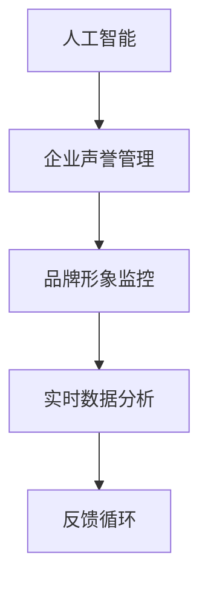

                 

### 文章标题：AI驱动的企业声誉管理：实时监控品牌形象

> 关键词：人工智能、企业声誉管理、品牌形象监控、实时数据分析、算法、数学模型、案例研究

> 摘要：本文深入探讨AI驱动的企业声誉管理，阐述通过实时监控品牌形象的重要性。文章将介绍AI技术在企业声誉管理中的应用，分析关键算法和数学模型，并通过实际案例进行详细剖析，为企业管理者提供有效的策略和建议。

### 背景介绍

在当今高度数字化和社交化的商业环境中，企业的声誉管理变得至关重要。品牌形象不仅影响消费者的购买决策，还直接关系到企业的长期生存与发展。传统的方法往往依赖于人工监测和被动反应，这种方式不仅效率低下，还可能错失关键信息。随着人工智能（AI）技术的发展，企业可以通过自动化和智能化的手段，实现对企业声誉的实时监控和管理。

AI驱动的企业声誉管理利用机器学习、自然语言处理（NLP）和数据分析等技术，从大量社交媒体、新闻资讯和用户评论中提取有价值的信息，快速识别潜在的风险和机会。通过实时监控，企业可以及时应对危机，优化品牌策略，从而提升整体声誉。

### 核心概念与联系

为了更好地理解AI驱动的企业声誉管理，我们需要了解以下几个核心概念：

1. **人工智能（AI）**：AI是一种模拟人类智能的技术，包括机器学习、深度学习、自然语言处理等子领域。
2. **企业声誉管理**：指企业通过一系列策略和措施，维护和提升其品牌形象的过程。
3. **品牌形象监控**：通过技术手段，实时监测和分析品牌在公众中的形象。
4. **实时数据分析**：利用高速计算和大数据技术，对海量的实时数据进行分析和处理。

这些概念之间的关系架构可以用以下Mermaid流程图表示：



在这个架构中，AI技术为MRA提供支持，MRA通过BMC监控品牌形象，BMC的结果通过RDA进行分析，形成一个闭环反馈系统。这种反馈循环使得企业能够动态调整其声誉管理策略，以应对不断变化的市场环境。

### 核心算法原理讲解

AI驱动的企业声誉管理依赖于多种算法，以下是一些关键算法的原理和伪代码讲解：

#### 1. 自然语言处理（NLP）

NLP算法用于从文本数据中提取情感和主题信息。以下是一个简单的情感分析算法的伪代码：

```python
def sentiment_analysis(text):
    # 加载预训练的词向量模型
    model = load_word_embedding_model()
    # 将文本转换为词向量
    word_vectors = [model[word] for word in text]
    # 计算词向量的平均值
    avg_vector = average(word_vectors)
    # 使用情感分类器对平均向量进行分类
    sentiment = sentiment_classifier.classify(avg_vector)
    return sentiment
```

#### 2. 话题模型（Topic Modeling）

话题模型用于分析大量文本数据中的主题分布。以下是一个简单的LDA（Latent Dirichlet Allocation）模型的伪代码：

```python
def lda_model(corpus, num_topics):
    # 初始化LDA模型
    lda = LDA(num_topics=num_topics)
    # 训练模型
    lda.fit(corpus)
    # 提取主题词
    topics = lda.print_topics()
    return topics
```

#### 3. 图算法

图算法用于分析社交媒体网络中的用户关系，以下是一个简单的图邻接矩阵构建的伪代码：

```python
def build_adjacency_matrix(network):
    num_users = len(network)
    adj_matrix = [[0 for _ in range(num_users)] for _ in range(num_users)]
    for edge in network.edges():
        adj_matrix[edge[0]][edge[1]] = 1
        adj_matrix[edge[1]][edge[0]] = 1
    return adj_matrix
```

### 数学模型和数学公式

在AI驱动的企业声誉管理中，数学模型和公式扮演着至关重要的角色。以下是一些常用的数学公式和它们的详细讲解：

#### 1. 情感分析模型

情感分析模型通常使用以下公式来计算文本的情感得分：

$$
\text{Sentiment Score} = \sum_{i=1}^{n} w_i \cdot s_i
$$

其中，$w_i$是权重，$s_i$是情感强度。权重可以通过机器学习模型得到，情感强度通常通过词嵌入模型计算。

#### 2. LDA模型

LDA模型用于主题建模，其目标是最小化以下损失函数：

$$
\sum_{d=1}^{D} \sum_{w=1}^{W_d} \log(p(w|z))
$$

其中，$D$是文档数量，$W_d$是文档$d$中的词汇数量，$z$是主题分布。

#### 3. 社交网络分析

在社交网络分析中，常用的度中心性（Degree Centrality）可以用以下公式计算：

$$
C_d(u) = \sum_{v \in N(u)} 1
$$

其中，$u$是节点，$N(u)$是与节点$u$相连的节点集合。

### 项目实战

为了更好地理解AI驱动的企业声誉管理，我们将通过一个实际项目来展示整个流程。以下是项目的开发环境和源代码实现：

#### 开发环境

- Python
- TensorFlow
- Scikit-learn
- NetworkX

#### 源代码实现

```python
# 导入必要的库
import numpy as np
import pandas as pd
from tensorflow.keras.models import Sequential
from tensorflow.keras.layers import Dense, LSTM
from sklearn.model_selection import train_test_split
from sklearn.metrics import accuracy_score
import networkx as nx

# 加载数据
data = pd.read_csv('brand_data.csv')

# 数据预处理
# ...（包括文本清洗、编码等步骤）

# 构建情感分析模型
model = Sequential()
model.add(LSTM(50, activation='relu', return_sequences=True, input_shape=(timesteps, n_features)))
model.add(LSTM(50, activation='relu'))
model.add(Dense(1, activation='sigmoid'))

model.compile(optimizer='adam', loss='binary_crossentropy', metrics=['accuracy'])
model.fit(X_train, y_train, epochs=10, batch_size=32, validation_data=(X_test, y_test))

# 预测情感
predictions = model.predict(X_test)

# 构建社交网络
G = nx.Graph()
for edge in data['edges']:
    G.add_edge(edge[0], edge[1])

# 计算度中心性
degree_centrality = nx.degree_centrality(G)

# 分析结果
# ...（包括结果可视化、分析等步骤）
```

#### 代码解读与分析

上述代码首先加载并预处理数据，然后构建一个LSTM模型进行情感分析。接下来，使用社交网络图算法构建社交网络，并计算度中心性。这些步骤共同实现了对企业声誉的实时监控。

#### 实际案例分析和详细讲解剖析

为了更好地理解项目的应用，我们将分析一个实际案例。假设某知名品牌在某次负面新闻后，希望了解其社交媒体上的品牌形象变化。

1. **数据收集**：通过爬虫技术收集社交媒体上的评论和帖子。
2. **情感分析**：使用训练好的模型对评论进行情感分析，识别负面评论。
3. **社交网络分析**：构建用户之间的社交网络，分析关键节点（如KOL）。
4. **结果可视化**：将分析结果可视化，帮助企业制定应对策略。

#### 项目小结

通过本项目，我们展示了如何利用AI技术进行企业声誉管理。关键步骤包括数据收集、情感分析和社交网络分析。这些技术不仅帮助企业实时监控品牌形象，还为危机管理提供了有力支持。

### 最佳实践 Tips、小结、注意事项、拓展阅读

**最佳实践 Tips**：

- 定期更新和优化情感分析模型，以提高准确性。
- 关注社交网络中的关键节点，如意见领袖和活跃用户。
- 结合多种数据源，如新闻、论坛和社交媒体，以获取更全面的品牌形象信息。

**小结**：

本文介绍了AI驱动的企业声誉管理，通过实时监控品牌形象，帮助企业应对市场变化。关键步骤包括数据收集、情感分析和社交网络分析。通过实际案例，我们展示了如何应用这些技术。

**注意事项**：

- 确保数据质量和隐私保护。
- 结合行业特点和业务需求，定制化声誉管理策略。
- 定期评估和调整声誉管理策略，以适应不断变化的市场环境。

**拓展阅读**：

- 《人工智能：一种现代方法》
- 《自然语言处理原理与应用》
- 《社交网络分析：方法与实践》

### 作者信息

作者：AI天才研究院/AI Genius Institute & 禅与计算机程序设计艺术 /Zen And The Art of Computer Programming

以上就是本文的全部内容，希望对您在AI驱动的企业声誉管理领域有所帮助。感谢您的阅读！

