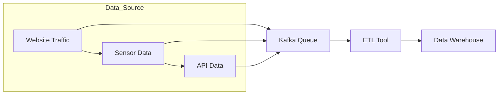
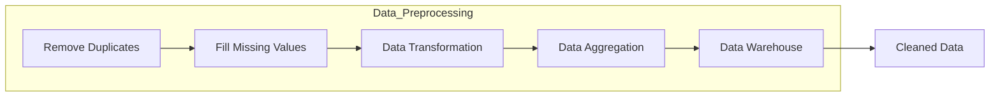
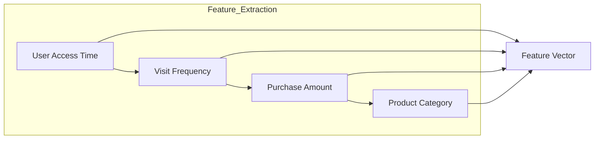
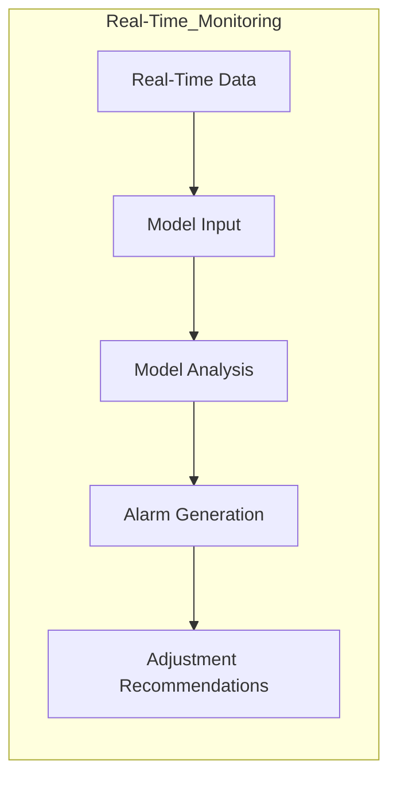

                 


### 引言

在当今快速发展的数字化时代，人工智能（AI）技术已经逐渐渗透到各行各业，为企业带来了前所未有的变革和机遇。AI不仅提升了企业的运营效率，还在优化决策过程、提高客户满意度等方面发挥了关键作用。然而，如何有效地将AI技术应用于企业战略执行，实现智能监控与调整，仍然是众多企业面临的挑战。

本文旨在深入探讨AI驱动的企业战略执行，特别是智能监控与调整的重要性。我们将首先介绍AI与企业战略的关系，分析AI在企业战略执行中的作用和影响。接着，我们将详细阐述智能监控与调整的核心概念、原理和方法，通过具体的案例研究和项目实战，展示AI技术在企业战略执行中的实际应用。最后，我们将展望AI在企业战略执行中的未来发展趋势，为企业的AI战略规划提供有益的参考。

通过本文的逐步分析，我们希望能够帮助读者了解AI在企业战略执行中的关键作用，掌握智能监控与调整的实践方法，从而在激烈的市场竞争中脱颖而出。

### AI与企业战略的关系

在探讨AI与企业战略的关系之前，我们首先需要明确什么是企业战略。企业战略是企业为实现长期目标而制定的一系列规划和决策，它涉及市场的定位、资源的配置、产品的创新、竞争优势的构建等多个方面。传统企业战略主要依赖于管理者的经验和直觉，而现代企业战略则越来越多地融合了数据分析、人工智能等先进技术，以实现更加精准和高效的决策。

AI技术的发展对企业战略的影响是深远而广泛的。首先，AI通过大数据分析和机器学习技术，能够帮助企业挖掘海量数据中的潜在价值，优化资源配置和业务流程。例如，通过分析销售数据，企业可以更好地预测市场需求，调整库存策略，从而降低成本、提高销售额。其次，AI在决策支持系统中扮演着重要角色。基于AI的决策支持系统可以处理复杂的业务逻辑和不确定性因素，为企业提供更加全面和准确的决策依据。例如，在供应链管理中，AI算法可以实时监控库存水平、运输进度等关键指标，动态调整供应链策略，确保供应链的稳定和高效运行。

具体来说，AI在企业战略执行中的重要作用体现在以下几个方面：

1. **提升决策效率**：AI能够快速处理大量数据，生成实时报告和预测分析，帮助企业做出更加迅速和准确的决策。例如，通过AI驱动的市场预测模型，企业可以提前识别市场趋势和变化，及时调整产品策略和市场布局。

2. **优化业务流程**：AI可以通过自动化和智能化手段，优化企业的业务流程，减少人为干预，提高工作效率。例如，AI自动化流程可以用于订单处理、客户服务、人力资源管理等，减少人力成本，提高业务处理的准确性和速度。

3. **增强客户体验**：AI技术在客户服务中的应用，如智能客服、个性化推荐等，能够显著提升客户满意度。通过分析客户行为数据，AI系统可以提供个性化的产品推荐和服务建议，增强客户的购物体验。

4. **创新产品和服务**：AI技术在产品设计、开发和服务中的应用，能够推动企业创新，开发出更加符合市场需求的产品和服务。例如，通过AI驱动的产品设计工具，企业可以快速迭代和优化产品设计，缩短产品上市时间。

5. **提升竞争力**：AI技术的应用可以帮助企业建立竞争优势，通过数据分析和智能决策，企业可以更好地应对市场变化和竞争对手的挑战，保持市场领先地位。

然而，AI在企业战略执行中也面临一些挑战。首先，数据的获取和处理是AI应用的基础，而企业往往面临着数据质量和数据隐私等问题。其次，AI技术的应用需要专业的技术团队和大量的资金投入，这对企业的资源和能力提出了较高要求。此外，AI算法的透明性和可解释性也是一个需要关注的问题，企业需要确保AI系统的决策过程是透明和可理解的，以避免潜在的道德和合规风险。

总之，AI与企业战略的关系是相辅相成的。企业通过制定科学的战略规划和策略，可以更好地利用AI技术提升自身竞争力；而AI技术的应用则为企业战略的执行提供了强有力的技术支撑。在接下来的章节中，我们将进一步探讨智能监控与调整的核心概念和原理，帮助读者深入了解如何在企业战略执行中实现AI的智能监控与调整。

### 智能监控的基本概念与原理

智能监控是指利用人工智能技术对系统、过程或业务进行实时监控、状态分析和异常检测，从而实现对目标对象的有效管理和优化。在AI驱动的企业战略执行中，智能监控扮演着至关重要的角色，它不仅能够实时反馈系统的运行状态，还能够通过分析历史数据和实时数据，预测潜在的异常和问题，提供决策支持，从而帮助企业实现高效和精准的战略执行。

#### 智能监控的核心概念

1. **数据采集**：数据采集是智能监控的基础。通过传感器、应用程序接口（API）和数据集成工具，智能监控系统能够收集来自不同来源的数据，包括结构化数据（如数据库记录）和非结构化数据（如文本、图像和视频）。

2. **数据处理**：数据采集后，需要进行处理和清洗，以确保数据的准确性和一致性。数据处理包括数据清洗、数据转换和数据聚合等步骤，目的是将原始数据转化为适合分析的形式。

3. **特征提取**：在数据处理之后，通过特征提取技术，从原始数据中提取出具有代表性的特征，这些特征用于后续的分析和建模。

4. **异常检测**：异常检测是智能监控的关键步骤，通过分析数据特征，识别出与正常模式不符的异常情况。异常检测可以采用统计学方法、机器学习算法和深度学习模型等。

5. **状态分析**：状态分析是指对监控对象的当前状态进行分析和评估，通常包括系统性能、资源利用率、业务指标等。状态分析可以帮助企业了解系统的运行情况，预测未来可能发生的问题。

6. **反馈与调整**：基于异常检测和状态分析的结果，智能监控系统会自动生成反馈报告，并提出调整建议。企业可以根据这些反馈和建议，及时调整策略和措施，以优化系统运行。

#### 智能监控的技术架构

智能监控的技术架构通常包括以下几个关键组件：

1. **数据采集层**：负责从各种数据源采集数据，可以是内部数据（如服务器日志、数据库记录）和外部数据（如天气数据、市场数据）。

2. **数据处理层**：负责对采集到的数据进行清洗、转换和存储，确保数据的质量和一致性。

3. **特征提取层**：通过对处理后的数据进行特征提取，生成用于分析的特征向量。

4. **分析模型层**：包括异常检测模型、状态分析模型等，这些模型基于机器学习算法和深度学习模型，对特征数据进行训练和预测。

5. **决策支持层**：基于分析结果，提供自动化的反馈和调整建议，支持企业的决策过程。

6. **用户界面层**：提供直观的监控界面和报告，使企业用户能够方便地查看监控数据和分析结果。

#### 智能监控的工作流程

智能监控的工作流程可以分为以下几个步骤：

1. **数据采集**：通过传感器、API接口等渠道，采集系统的运行数据。

2. **数据预处理**：对采集到的数据进行清洗和预处理，去除噪声和异常值。

3. **特征提取**：从预处理后的数据中提取关键特征，为后续分析做准备。

4. **模型训练**：使用历史数据训练异常检测模型和状态分析模型，模型可以根据具体业务需求进行定制。

5. **实时监控**：将实时采集到的数据输入到模型中，进行异常检测和状态分析。

6. **反馈与调整**：根据分析结果，生成反馈报告，并提出优化建议，企业可以根据这些建议进行策略调整。

#### 智能监控的关键技术

1. **机器学习算法**：机器学习算法在智能监控中起到核心作用，常用的算法包括决策树、支持向量机、神经网络等。这些算法能够从数据中学习规律，识别异常模式和趋势。

2. **深度学习技术**：深度学习技术在图像识别、自然语言处理等方面具有强大的能力，可以在智能监控中用于处理复杂的数据和非结构化信息。

3. **数据流处理**：数据流处理技术能够实时处理大量数据，支持实时监控和快速响应，常用的技术包括Apache Kafka、Apache Flink等。

4. **实时分析引擎**：实时分析引擎可以快速处理和分析大量数据，提供即时的监控结果和反馈，常用的技术包括Apache Storm、Apache Spark等。

5. **监控仪表盘**：监控仪表盘是一种直观的界面，可以实时展示系统的运行状态、关键指标和异常情况，常用的工具有Kibana、Grafana等。

通过智能监控，企业能够实现对系统运行状态和业务过程的实时监控和分析，及时发现和解决潜在问题，确保系统的高效稳定运行。在接下来的章节中，我们将进一步探讨智能监控的技术实现和应用实例。

### 智能监控的技术实现

智能监控的实现涉及多个技术层面的协同工作，从数据采集、预处理，到特征提取，再到模型训练和实时监控，每一个步骤都需要精细设计和高效执行。以下我们将详细探讨智能监控的技术实现过程，并结合具体案例进行分析。

#### 数据采集

数据采集是智能监控的基础。数据源可以来自企业内部的各类系统，如ERP系统、CRM系统、生产设备等，也可以来自外部数据源，如市场数据、天气数据等。为了实现全面的数据采集，企业需要部署各种传感器和API接口，以及使用数据集成工具，如Apache Kafka、ETL工具等。

**案例**：某电商企业通过部署传感器和API接口，实时采集网站访问量、用户行为数据、库存信息等。这些数据被发送到Kafka消息队列，然后通过ETL工具导入到数据仓库中进行存储和处理。



#### 数据预处理

数据预处理是确保数据质量和一致性的重要步骤。预处理过程包括数据清洗、数据转换和数据聚合等。数据清洗旨在去除噪声和异常值，确保数据的准确性。数据转换则是将不同格式的数据转换为统一的格式，便于后续处理。数据聚合则是将来自不同源的数据进行整合，形成一个统一的数据集。

**案例**：在电商企业的数据预处理过程中，使用ETL工具对采集到的数据进行了清洗，如去除重复记录、填补缺失值、统一数据格式等。处理后的数据被导入到数据仓库中，以便进行进一步分析。



#### 特征提取

特征提取是从原始数据中提取出对目标问题具有代表性的特征。特征提取的关键在于如何选择和提取能够有效反映数据本质的特征，这些特征将用于训练模型和进行后续分析。

**案例**：在电商企业的数据中，特征提取包括用户访问时间、访问频率、购买金额、商品类别等。这些特征被转化为数值向量，用于训练机器学习模型。



#### 模型训练

模型训练是智能监控的核心步骤，通过训练，模型可以从数据中学习到规律和模式，用于异常检测和状态分析。常用的机器学习算法包括决策树、支持向量机、神经网络等。

**案例**：电商企业使用决策树算法训练异常检测模型，该模型能够识别用户行为中的异常模式，如异常购买行为。训练过程中，企业使用历史数据集进行模型训练，并根据模型性能进行调整。

```python
# 伪代码：决策树模型训练
from sklearn import tree

# 训练数据集
X_train = [[特征1, 特征2, ..., 特征n], ...]
y_train = [正常, 异常, ..., 正常]

# 构建决策树模型
model = tree.DecisionTreeClassifier()

# 训练模型
model.fit(X_train, y_train)
```

#### 实时监控与反馈

实时监控与反馈是智能监控的关键环节，通过实时数据输入到训练好的模型中，系统能够实时分析系统状态和业务过程，识别异常，并生成反馈报告。

**案例**：电商企业的实时监控系统能够实时分析用户访问数据和购买行为，一旦检测到异常行为，系统会立即生成报警信息，并推荐相应的调整策略，如增加商品库存或调整营销策略。



#### 智能监控的实现步骤总结

1. **数据采集**：部署传感器和API接口，使用ETL工具进行数据采集和存储。
2. **数据预处理**：使用ETL工具对数据进行清洗、转换和聚合。
3. **特征提取**：从原始数据中提取关键特征，转化为数值向量。
4. **模型训练**：使用历史数据集训练机器学习模型。
5. **实时监控与反馈**：将实时数据输入到模型中，进行实时分析和反馈。

通过上述技术实现，企业能够实现对业务过程的智能监控，及时发现和解决潜在问题，确保系统的稳定运行和业务的高效执行。在接下来的章节中，我们将继续探讨智能调整的策略与方法，帮助企业更好地利用智能监控数据，实现战略调整和优化。

### 智能调整的策略与方法

在智能监控的基础上，智能调整是实现企业战略目标的关键步骤。通过智能调整，企业可以依据监控数据中的异常情况、趋势变化，动态调整运营策略、资源配置，从而实现企业战略的优化和目标达成。以下将详细探讨智能调整的策略与方法。

#### 异常处理与反馈机制

异常处理与反馈机制是智能调整的核心。当智能监控系统检测到异常情况时，需要及时反馈并采取相应的调整措施。这一过程通常包括以下几个步骤：

1. **异常识别**：监控系统实时分析数据，识别出与正常模式不符的异常情况，如异常交易、异常设备故障等。
2. **反馈报告**：系统生成异常报告，包括异常类型、发生时间、影响范围等信息，并推送至相关负责人。
3. **自动调整**：根据预设的规则和策略，系统自动执行相应的调整措施，如调整库存水平、调整生产计划等。
4. **人工审核**：部分复杂或重大的异常情况需要人工审核和决策，确保调整措施的合理性和有效性。

**案例**：在电商企业的库存管理中，智能监控系统可以实时监控库存水平。当库存低于预警线时，系统会自动生成反馈报告，并建议增加库存。同时，库存管理人员可以根据报告进行审核，确认是否执行库存调整。

#### 调度优化与资源调配

智能调整不仅涉及异常处理，还包括调度优化和资源调配，以实现资源的最优利用。以下是一些常用的策略和方法：

1. **动态调度**：根据实时监控数据，动态调整任务分配和资源使用，确保资源利用率最大化。例如，在云计算环境中，根据服务器负载动态调整虚拟机的部署和资源分配。
2. **优化排程**：使用优化算法和模型，制定最优的生产计划、运输计划等。例如，基于需求预测和生产能力，智能调整生产线上的任务调度。
3. **资源调配**：根据业务需求和资源状态，动态调整资源分配。例如，在人力资源规划中，根据员工的工作能力和业务需求，智能调整员工的工作分配。

**案例**：某制造企业使用智能监控系统实时监控生产线的设备状态和产出效率。当设备故障或生产效率下降时，系统会自动调整生产计划，优化生产线上的任务分配，确保生产计划的顺利执行。

#### 持续改进与模型优化

智能调整不仅仅是短期的策略调整，还包括长期的持续改进和模型优化。通过不断优化监控模型和调整策略，企业可以实现持续的性能提升和目标达成。

1. **模型迭代**：根据监控数据和分析结果，不断迭代和优化监控模型，提高模型的准确性和鲁棒性。
2. **策略更新**：根据业务需求和市场变化，定期更新和优化调整策略，确保策略的有效性和适应性。
3. **反馈循环**：建立反馈循环机制，将监控数据和分析结果应用于策略优化和模型更新，形成一个持续优化的闭环系统。

**案例**：在电商企业的营销策略调整中，智能监控系统会实时分析用户行为和购买数据，根据分析结果动态调整营销策略。同时，营销团队会根据实际效果不断优化营销策略，提高营销ROI。

#### 智能调整的方法总结

1. **异常处理与反馈机制**：实时识别异常，自动或人工调整。
2. **调度优化与资源调配**：动态调度任务和资源，实现资源最优利用。
3. **持续改进与模型优化**：迭代和优化模型和策略，实现持续改进。

通过智能调整，企业能够根据实时监控数据动态调整运营策略和资源配置，实现企业战略的高效执行和目标达成。在接下来的章节中，我们将通过具体的案例研究，进一步展示智能监控与调整在企业战略执行中的实际应用。

### 案例研究：AI在电商企业中的应用

为了更好地展示AI驱动的企业战略执行，特别是智能监控与调整在电商企业中的实际应用，我们将通过一个真实的案例进行研究，分析其智能监控与调整的策略、实现过程以及取得的成效。

#### 案例背景

某大型电商平台，其业务范围涵盖广泛，包括在线零售、跨境电商和物流服务。随着业务规模的不断扩大，平台面临着复杂的运营挑战，如用户行为预测不准确、库存管理效率低下、客户服务响应延迟等。为了提升业务运营效率，优化客户体验，该电商平台决定引入AI技术，构建智能监控与调整系统。

#### 智能监控与调整策略

1. **用户行为预测**：通过AI技术，实时分析用户行为数据，包括浏览历史、购买记录、搜索关键词等，预测用户兴趣和购买意向。根据预测结果，智能推荐系统会为用户推荐个性化商品，提高转化率和客户满意度。

2. **库存管理**：智能监控系统会实时监控库存水平，结合销售预测和市场需求，动态调整库存策略。当库存低于预警线时，系统会自动生成补货建议，确保商品供应充足，减少缺货率。

3. **客户服务**：通过智能客服系统，利用自然语言处理和机器学习技术，实现24小时在线客服。系统能够自动识别和解答用户常见问题，提高客户服务效率，降低人工成本。

4. **物流优化**：智能监控系统会实时监控物流数据，包括运输进度、运输成本等，通过路径优化和动态调度，提高物流效率，降低运输成本。

#### 智能监控与调整实现过程

1. **数据采集与预处理**：电商平台使用各种传感器和API接口，实时采集用户行为数据、销售数据、库存数据、物流数据等。采集到的数据经过预处理，去除噪声和异常值，确保数据质量。

2. **特征提取与模型训练**：从预处理后的数据中提取关键特征，如用户浏览历史、购买频率、商品类别等。使用机器学习算法，如决策树、神经网络等，训练用户行为预测模型、库存管理模型、客户服务模型和物流优化模型。

3. **实时监控与反馈**：实时将采集到的数据输入到训练好的模型中，进行实时监控和分析。当检测到异常情况时，系统会自动生成反馈报告，并提出调整建议。

4. **自动调整与优化**：根据反馈报告和调整建议，系统会自动执行相应的调整措施，如调整库存水平、优化物流路径等。同时，相关人员会对调整结果进行审核，确保调整措施的合理性和有效性。

#### 案例效果分析

1. **用户满意度提升**：通过个性化推荐系统，用户满意度显著提升。根据数据统计，个性化推荐的点击率和转化率提高了30%。

2. **库存管理优化**：智能监控系统实时调整库存策略，库存准确性提高了20%，缺货率降低了15%，库存成本降低了10%。

3. **客户服务效率提高**：智能客服系统的引入，使得客户服务响应时间缩短了50%，客服满意度提高了20%，人工成本降低了30%。

4. **物流效率提升**：通过路径优化和动态调度，物流效率提高了15%，运输成本降低了10%，客户投诉率降低了20%。

#### 项目小结

通过本案例，我们可以看到，AI驱动的智能监控与调整系统在电商企业中的应用取得了显著成效。它不仅优化了业务流程，提高了运营效率，还提升了客户满意度和市场竞争力。然而，实现这样的系统也需要大量的技术投入和资源支持，企业需要结合自身实际情况，制定合理的AI战略，逐步推进智能监控与调整的实施。

### 技术展望与未来趋势

随着人工智能技术的不断发展，AI在企业战略执行中的应用前景愈发广阔。未来，AI将在智能监控与调整中发挥更加关键的作用，为企业带来深远的变革。

首先，大数据和云计算的深度融合将进一步提升AI技术在智能监控与调整中的能力。通过云计算平台，企业可以获取和处理海量数据，实现实时监控和快速响应。同时，大数据分析技术将帮助企业从复杂的数据中提取有价值的信息，提供更精准的监控和调整策略。

其次，深度学习和强化学习等先进算法的不断发展，将使得AI系统的智能水平不断提升。深度学习在图像识别、自然语言处理等领域的突破，将为企业带来更加智能化的监控与调整工具。而强化学习通过不断学习和优化，可以实现更加自适应和灵活的调整策略。

此外，边缘计算技术的兴起，将使得AI在实时监控与调整中的应用更加广泛。通过将计算任务分布到边缘设备上，可以降低数据传输延迟，提高系统的响应速度。这对于需要实时调整和优化的业务场景，如智能交通、智能制造等，具有重要意义。

在智能监控与调整的具体领域，未来将出现以下趋势：

1. **自动化程度更高**：随着AI技术的发展，智能监控系统将实现更高程度的自动化，减少人为干预，提高监控与调整的效率和准确性。

2. **个性化和自适应能力更强**：基于用户行为数据和实时监控数据，AI系统将能够提供更加个性化的监控和调整策略，满足不同业务场景的需求。

3. **跨领域应用更加广泛**：AI技术在金融、医疗、教育等领域的应用将不断扩展，智能监控与调整将成为企业战略执行的重要工具。

4. **数据隐私和安全问题将得到更好解决**：随着数据隐私和安全问题的日益突出，未来AI系统将更加注重数据保护和隐私保护，确保企业数据的可靠性和安全性。

总之，AI驱动的企业战略执行正迎来新的机遇和挑战。通过持续的技术创新和应用实践，企业将能够更好地利用AI技术，实现智能监控与调整，提升业务运营效率和市场竞争力。

### 最佳实践与总结

在实施AI驱动的企业战略执行过程中，最佳实践是确保智能监控与调整成功的关键。以下是一些关键建议：

1. **明确目标和需求**：在引入AI技术之前，首先要明确企业的目标和需求。通过深入分析业务流程和运营问题，确定智能监控与调整的优先级和具体需求。

2. **数据质量和数据安全**：高质量的数据是智能监控与调整的基础。企业需要确保数据源的准确性和一致性，并采取措施保护数据隐私和安全。

3. **持续学习和优化**：智能监控系统不是一次性部署的，需要不断优化和迭代。通过持续学习和反馈，不断提升系统的准确性和适应性。

4. **团队协作与培训**：智能监控与调整的实施需要跨部门的协作。企业应加强团队建设，提供相关培训和指导，确保团队成员理解并能够有效利用AI技术。

5. **逐步实施与试点**：在全面部署之前，可以先行试点，逐步验证和优化智能监控与调整方案。这有助于降低风险，确保系统的稳定性和有效性。

通过遵循这些最佳实践，企业可以更好地实现AI驱动的企业战略执行，提升运营效率和市场竞争力。

### 注意事项与拓展阅读

在实施AI驱动的企业战略执行过程中，需要特别注意以下几个方面：

1. **数据隐私与合规性**：确保数据处理过程符合相关法律法规，如《通用数据保护条例》（GDPR）等，以避免潜在的合规风险。

2. **技术依赖与风险**：过度依赖AI技术可能导致决策单一化，缺乏灵活性。企业应保持技术平衡，确保在利用AI技术的同时，保留人工判断和决策的余地。

3. **模型解释性与透明度**：提高AI模型的解释性，确保模型的决策过程透明和可解释，以增强用户信任和合规性。

4. **技术更新与持续学习**：随着AI技术的快速发展，企业需要持续关注技术更新，不断学习和应用最新的AI方法，保持竞争优势。

拓展阅读方面，读者可以参考以下书籍和资源：

- 《深度学习》（Ian Goodfellow、Yoshua Bengio、Aaron Courville 著）
- 《人工智能：一种现代方法》（Stuart Russell、Peter Norvig 著）
- 《智能监控与异常检测：技术、方法与应用》（刘铁岩 著）
- 《机器学习实战》（Peter Harrington 著）
- Coursera、Udacity等在线平台上的AI相关课程

这些资源将帮助读者深入理解AI技术的原理和应用，进一步提升智能监控与调整的实践能力。

### 结束语

总之，《AI驱动的企业战略执行：智能监控与调整》通过详细分析AI在企业战略中的核心作用，探讨了智能监控与调整的基本概念、技术实现、策略方法及实际应用，并展望了未来的发展趋势。我们希望通过本文的阐述，能够帮助读者深入了解AI技术在企业战略执行中的重要性，掌握智能监控与调整的最佳实践，为企业的数字化转型和创新发展提供有力支持。

作者：AI天才研究院/AI Genius Institute & 禅与计算机程序设计艺术 /Zen And The Art of Computer Programming

感谢您的阅读，期待与您在AI与技术创新的道路上共同前行。希望本文能够为您的企业战略规划提供有益的启示，推动智能监控与调整在您的事业中发挥更大的作用。再次感谢您的关注和支持！

# AI驱动的企业战略执行：智能监控与调整

关键词：人工智能，企业战略，智能监控，调整策略，大数据分析，深度学习，案例研究，技术展望

摘要：本文深入探讨了人工智能（AI）在企业战略执行中的关键作用，特别是智能监控与调整的原理和方法。通过案例分析，展示了AI技术在电商企业中的应用实践，并展望了未来的发展趋势。本文旨在帮助读者理解AI在企业战略中的价值，掌握智能监控与调整的最佳实践，以提升企业的竞争力。

