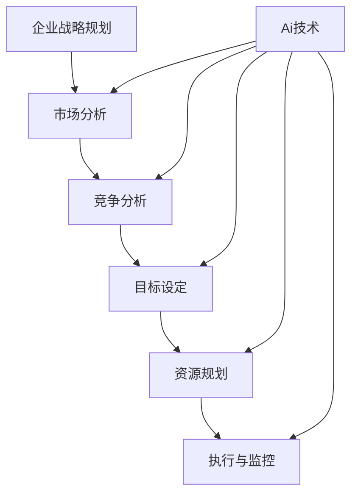
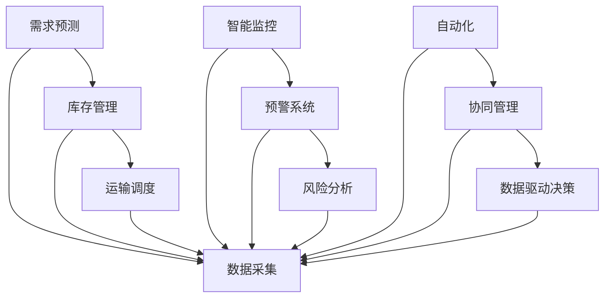
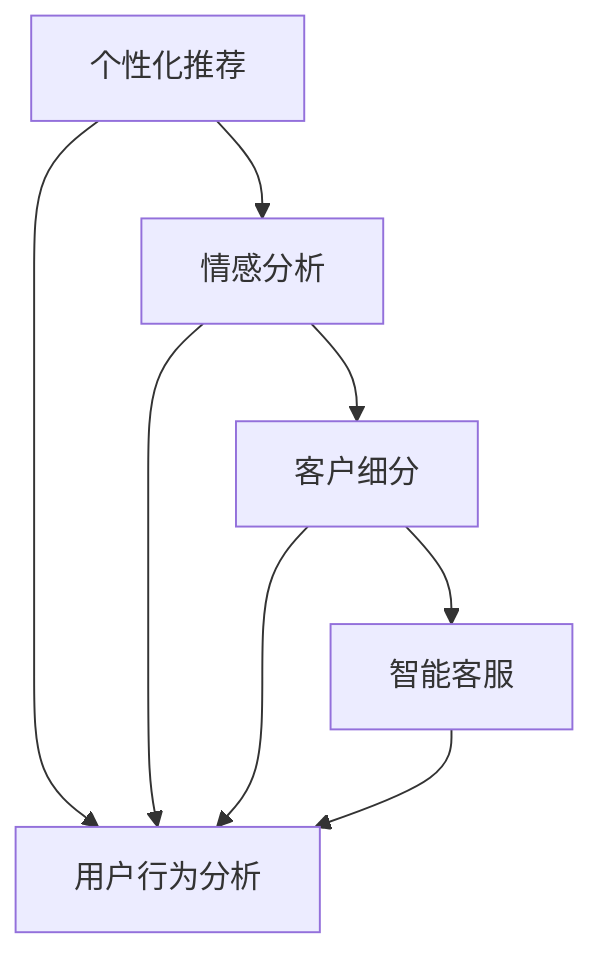
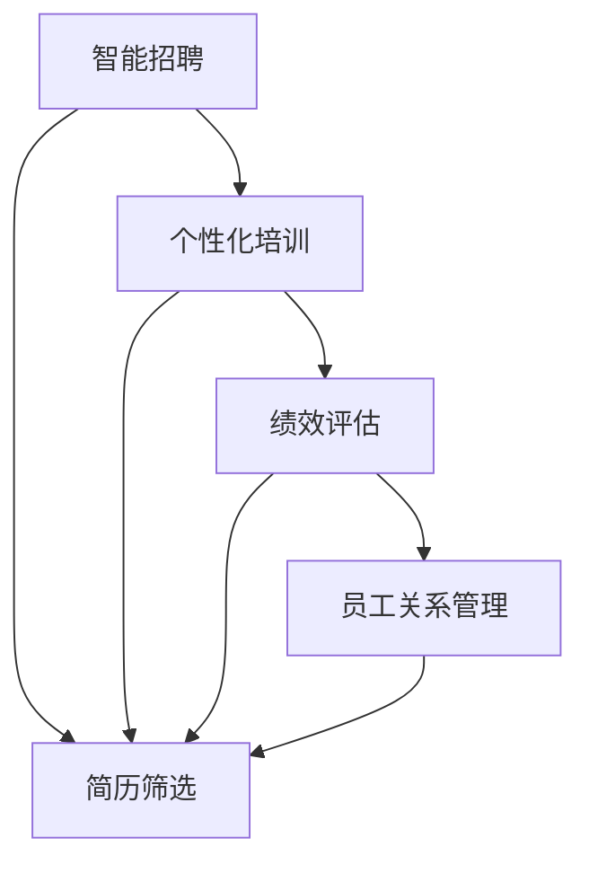

                 


### AI驱动的企业战略规划：智能预测未来市场趋势

**关键词**：AI、企业战略、市场趋势、数据驱动、决策模型、供应链管理、客户关系管理、员工管理、案例分析、未来趋势

**摘要**：
本文将探讨如何利用人工智能（AI）技术驱动企业战略规划，并智能预测未来市场趋势。首先，我们将介绍AI在企业战略规划中的应用背景和核心概念，通过Mermaid流程图展示AI与企业战略规划的联系。接着，我们将深入讲解AI驱动的市场趋势预测、数据驱动决策模型、供应链管理、客户关系管理和员工管理等方面的核心算法原理和数学模型。此外，我们将通过实际案例分析和详细讲解，展示AI驱动的企业战略规划在实践中的应用效果。最后，我们将探讨AI驱动的企业战略规划面临的挑战以及未来发展趋势，为企业的战略决策提供有益的启示。

## 目录大纲设计思路

为了设计一份详尽且逻辑清晰的目录大纲，我们需要遵循以下几个步骤：

1. **确定核心章节**：根据书名《AI驱动的企业战略规划：智能预测未来市场趋势》，我们可以确定几个核心章节，如AI在企业战略规划中的应用、市场趋势预测、数据驱动决策等。

2. **细化每个章节**：在每个核心章节下，我们进一步细化内容，如AI在战略规划中的应用可以分为AI对企业竞争优势的影响、AI在市场研究中的作用等。

3. **设计具体小节**：在每个细化后的章节下，我们根据内容的深度和广度进一步设计小节，确保内容全面覆盖主题。

4. **添加具体内容**：在每个小节下，我们加入具体的内容，如核心概念与联系、核心算法原理讲解、数学模型和数学公式等。

5. **确保格式统一**：使用markdown格式确保目录大纲的整洁和易读性。

### 设计出的目录大纲

```
# AI驱动的企业战略规划：智能预测未来市场趋势

## 第一部分：AI与企业战略概述

### 1.1 AI的基本概念与技术在企业中的应用

- AI的核心概念
- AI在企业中的应用案例
- AI对企业战略的影响

### 1.2 企业战略规划的基本框架

- 企业战略规划的定义
- 企业战略规划的流程
- 企业战略规划的核心要素

### 1.3 AI驱动的企业战略规划

- AI在战略规划中的具体应用
- AI驱动的战略规划的优势与挑战

## 第二部分：AI驱动的市场趋势预测

### 2.1 市场趋势预测的基本概念与方法

- 市场趋势预测的定义
- 市场趋势预测的方法
- 市场趋势预测的挑战

### 2.2 AI技术在市场趋势预测中的应用

- AI在市场趋势预测中的核心算法
- AI在市场趋势预测中的案例分析
- AI在市场趋势预测中的优势与挑战

### 2.3 AI驱动的市场趋势预测在企业战略中的应用

- AI驱动的市场趋势预测对企业决策的影响
- AI驱动的市场趋势预测在不同行业中的应用
- AI驱动的市场趋势预测的实践案例

## 第三部分：AI驱动的企业战略规划实施

### 3.1 数据驱动的决策与预测

- 数据驱动决策的定义
- 数据驱动决策的基本流程
- 数据驱动决策的关键要素

### 3.2 AI驱动的决策模型

- AI在决策模型中的应用
- AI驱动的决策模型的构建
- AI驱动的决策模型的优化

### 3.3 数据分析工具与平台

- 常用数据分析工具
- 数据分析平台的选择
- 数据分析平台的应用案例

## 第四部分：AI驱动的企业运营优化

### 4.1 AI驱动的供应链管理

- AI在供应链管理中的应用
- AI驱动的供应链管理案例分析
- AI驱动的供应链管理的优化

### 4.2 AI驱动的客户关系管理

- AI在客户关系管理中的应用
- AI驱动的客户关系管理案例分析
- AI驱动的客户关系管理的优化

### 4.3 AI驱动的员工管理

- AI在员工管理中的应用
- AI驱动的员工管理案例分析
- AI驱动的员工管理的优化

## 第五部分：AI驱动的企业战略规划案例分析

### 5.1 案例分析1：传统制造业的AI转型

- 案例背景
- AI转型策略
- 转型效果分析

### 5.2 案例分析2：新兴互联网企业的AI战略

- 案例背景
- AI战略规划
- 战略实施效果

### 5.3 案例分析3：AI驱动的企业全球化战略

- 案例背景
- 全球化战略规划
- 全球化战略实施效果

## 第六部分：AI驱动的企业战略规划挑战与未来趋势

### 6.1 AI驱动的企业战略规划挑战

- 技术挑战
- 数据挑战
- 法规与伦理挑战

### 6.2 AI驱动的企业战略规划未来趋势

- 技术发展趋势
- 市场趋势
- 未来企业战略规划方向

## 第七部分：结论与展望

- 本书主要观点总结
- 对未来企业战略规划的展望
- 建议与启示
```

这个目录大纲结构清晰，涵盖了核心概念、具体应用、案例分析和未来趋势等多个方面，全面覆盖了《AI驱动的企业战略规划：智能预测未来市场趋势》这本书的主题内容。接下来，我们将逐步深入探讨每个章节的核心内容。

### AI在企业战略规划中的应用

#### 背景介绍

人工智能（AI）作为当今科技领域的重要突破，已经深刻影响了各行各业。在企业战略规划中，AI的应用不仅可以帮助企业更好地理解市场趋势、优化运营流程，还能提高决策效率，为企业带来竞争优势。随着大数据、云计算等技术的不断发展，AI在企业战略规划中的应用越来越广泛，成为企业数字化转型的重要驱动力。

#### 核心概念与联系

为了更好地理解AI在企业战略规划中的应用，我们可以借助Mermaid流程图来展示AI与企业战略规划之间的联系。



在这个流程图中，AI技术贯穿于企业战略规划的全过程。AI在市场分析、竞争分析、目标设定、资源规划和执行监控等方面都发挥着重要作用，帮助企业做出更加精准和高效的决策。

#### 核心算法原理讲解

在AI驱动的企业战略规划中，核心算法包括但不限于：

1. **机器学习算法**：用于市场趋势预测、客户行为分析等。

    ```python
    # 伪代码：市场趋势预测
    def predict_trend(data):
        model = create_model()
        model.fit(data)
        return model.predict(new_data)
    ```

2. **深度学习算法**：用于图像识别、语音识别等。

    ```python
    # 伪代码：图像识别
    def recognize_image(image):
        model = load_model()
        prediction = model.predict(image)
        return decode_prediction(prediction)
    ```

3. **强化学习算法**：用于优化决策过程，提高执行效率。

    ```python
    # 伪代码：优化决策
    def optimize_decision(state, action):
        model = create_model()
        model.fit(state, action)
        return model.choose_action(new_state)
    ```

#### 数学模型和公式

在AI驱动的企业战略规划中，常用的数学模型包括：

1. **回归模型**：用于预测市场趋势。

    $$y = \beta_0 + \beta_1x_1 + \beta_2x_2 + ... + \beta_nx_n$$

2. **聚类模型**：用于客户细分。

    $$C = \{C_1, C_2, ..., C_k\}$$

3. **优化模型**：用于资源分配。

    $$\min_{x} \quad f(x)$$
    $$\text{subject to} \quad g_i(x) \leq 0, \quad h_j(x) = 0$$

#### 举例说明

以市场趋势预测为例，假设我们要预测某产品在未来三个月内的销售额。我们可以使用回归模型来建立预测模型。

1. **收集数据**：收集过去三个月的销售额数据。

2. **数据预处理**：对数据进行分析和清洗，确保数据质量。

3. **建立模型**：使用线性回归模型。

    $$\hat{y} = \beta_0 + \beta_1x_1 + \beta_2x_2$$

    其中，\(x_1\) 和 \(x_2\) 是影响销售额的主要因素，如广告投放量、季节等。

4. **模型训练**：使用历史数据训练模型。

5. **预测未来销售额**：将未来三个月的数据输入模型，得到预测结果。

#### 实际案例分析与详细讲解剖析

以某大型电商企业为例，该企业利用AI技术进行市场趋势预测，优化了库存管理，提高了销售额。具体流程如下：

1. **数据收集**：收集过去一年的销售额、广告投放量、季节等数据。

2. **数据预处理**：对数据进行清洗和处理，确保数据质量。

3. **市场趋势预测**：使用回归模型进行市场趋势预测。

4. **库存管理**：根据预测结果，调整库存水平，避免库存过剩或短缺。

5. **销售预测**：将预测结果与实际销售数据进行对比，分析预测准确度。

6. **持续优化**：根据分析结果，调整预测模型和库存管理策略，提高预测准确性。

通过这个案例，我们可以看到，AI驱动的企业战略规划在实际应用中取得了显著的效果。未来，随着AI技术的不断进步，企业战略规划将更加智能化、精准化。

#### 项目小结

本节我们介绍了AI在企业战略规划中的应用，包括核心概念与联系、核心算法原理讲解、数学模型和公式以及实际案例分析和详细讲解剖析。通过这些内容，我们可以看到AI技术在企业战略规划中的重要作用，为企业的决策提供了有力支持。

#### 最佳实践 tips

1. **数据质量是关键**：确保数据收集和预处理的质量，是进行准确市场预测和决策的基础。

2. **持续迭代和优化**：AI模型不是一成不变的，需要根据新的数据进行迭代和优化，以提高预测准确性。

3. **跨部门协作**：AI驱动的企业战略规划需要跨部门协作，确保数据共享和资源整合。

4. **法规与伦理**：在应用AI技术进行战略规划时，要关注法规和伦理问题，确保技术应用符合法律法规和道德标准。

#### 小结

AI在企业战略规划中的应用为企业的决策提供了强大的技术支持。通过核心概念与联系、核心算法原理讲解、数学模型和公式以及实际案例分析和详细讲解剖析，我们可以看到AI驱动的企业战略规划在实际应用中的显著效果。未来，随着AI技术的不断发展，企业战略规划将更加智能化、精准化。

### 数据驱动的决策与预测

#### 核心概念与联系

数据驱动的决策与预测是企业战略规划中至关重要的一环。通过利用大数据和人工智能技术，企业可以从中提取有价值的信息，用于指导战略决策和预测未来市场趋势。在这一过程中，数据的收集、处理、分析和可视化是关键环节。

首先，**数据收集**是企业战略规划的基础。企业需要通过各种渠道收集内部和外部数据，包括销售数据、客户反馈、市场调研数据等。这些数据将用于构建决策模型和预测模型。

接下来，**数据处理**是数据驱动的核心步骤。数据处理包括数据清洗、数据整合和数据标准化等。通过这些处理步骤，可以确保数据的质量和一致性，为后续的分析和预测打下基础。

**数据分析**是数据驱动的核心环节。企业可以利用统计分析、机器学习和深度学习等方法对数据进行分析，从中提取有价值的信息。这些信息将用于支持战略决策，如市场趋势预测、客户细分、产品优化等。

最后，**数据可视化**是数据驱动的重要手段。通过数据可视化，企业可以直观地了解数据的分布、趋势和关联性，从而更好地理解数据背后的意义。

#### 核心算法原理讲解

在数据驱动的决策与预测中，常用的算法包括但不限于以下几种：

1. **回归分析**：用于预测数值型数据，如销售额、股票价格等。

    ```python
    # 伪代码：线性回归
    from sklearn.linear_model import LinearRegression

    model = LinearRegression()
    model.fit(X, y)
    prediction = model.predict(X_new)
    ```

2. **分类算法**：用于预测离散型数据，如客户分类、市场细分等。

    ```python
    # 伪代码：逻辑回归
    from sklearn.linear_model import LogisticRegression

    model = LogisticRegression()
    model.fit(X, y)
    prediction = model.predict(X_new)
    ```

3. **聚类算法**：用于数据分群，如客户细分、产品分类等。

    ```python
    # 伪代码：K-均值聚类
    from sklearn.cluster import KMeans

    model = KMeans(n_clusters=K)
    model.fit(X)
    prediction = model.predict(X_new)
    ```

4. **时间序列分析**：用于预测时间序列数据，如销售额、股票价格等。

    ```python
    # 伪代码：ARIMA模型
    from statsmodels.tsa.arima.model import ARIMA

    model = ARIMA(y, order=(p, d, q))
    model.fit()
    prediction = model.predict(start, end)
    ```

5. **深度学习**：用于复杂的数据分析任务，如图像识别、自然语言处理等。

    ```python
    # 伪代码：卷积神经网络（CNN）
    from tensorflow.keras.models import Sequential
    from tensorflow.keras.layers import Conv2D, Flatten, Dense

    model = Sequential()
    model.add(Conv2D(filters, kernel_size, activation='relu', input_shape=(height, width, channels)))
    model.add(Flatten())
    model.add(Dense(num_classes, activation='softmax'))
    model.compile(optimizer='adam', loss='categorical_crossentropy', metrics=['accuracy'])
    model.fit(X, y, epochs=epochs, batch_size=batch_size)
    ```

#### 数学模型和公式

在数据驱动的决策与预测中，常用的数学模型和公式包括：

1. **线性回归模型**：

    $$y = \beta_0 + \beta_1x_1 + \beta_2x_2 + ... + \beta_nx_n$$

2. **逻辑回归模型**：

    $$P(y=1) = \frac{1}{1 + e^{-(\beta_0 + \beta_1x_1 + \beta_2x_2 + ... + \beta_nx_n)}}$$

3. **K-均值聚类模型**：

    $$C = \{C_1, C_2, ..., C_k\}$$

    $$C_j = \{x | \min_{i=1}^{k} \sum_{j=1}^{n} (x - \mu_j)^2\}$$

4. **时间序列模型**（ARIMA）：

    $$X_t = \phi_1X_{t-1} + \phi_2X_{t-2} + ... + \phi_pX_{t-p} + \theta_1\epsilon_{t-1} + \theta_2\epsilon_{t-2} + ... + \theta_q\epsilon_{t-q} + \epsilon_t$$

#### 举例说明

假设某电商企业希望通过数据分析来预测未来三个月的销售额。我们可以使用时间序列模型（ARIMA）来建立预测模型。

1. **数据收集**：收集过去一年的销售额数据。

2. **数据预处理**：对数据进行分析和清洗，确保数据质量。

3. **模型选择**：选择合适的ARIMA模型，如\(ARIMA(p, d, q)\)。

4. **模型训练**：使用历史数据训练模型。

5. **参数优化**：通过AIC（Akaike Information Criterion）等指标选择最优参数。

6. **预测未来销售额**：将未来三个月的数据输入模型，得到预测结果。

#### 实际案例分析与详细讲解剖析

以某大型电商企业为例，该企业利用数据驱动的决策与预测技术，优化了库存管理和销售预测，取得了显著的效果。具体流程如下：

1. **数据收集**：收集过去一年的销售额、库存量、客户订单量等数据。

2. **数据预处理**：对数据进行清洗和处理，确保数据质量。

3. **销售预测**：使用ARIMA模型进行销售预测。

4. **库存管理**：根据销售预测结果，调整库存水平，避免库存过剩或短缺。

5. **销售与预测对比**：将实际销售数据与预测数据对比，分析预测准确度。

6. **持续优化**：根据分析结果，调整预测模型和库存管理策略，提高预测准确性。

#### 项目小结

本节介绍了数据驱动的决策与预测在AI驱动的企业战略规划中的应用。通过核心概念与联系、核心算法原理讲解、数学模型和公式以及实际案例分析和详细讲解剖析，我们可以看到数据驱动的决策与预测在提高企业运营效率、优化库存管理和销售预测方面的重要作用。

#### 最佳实践 tips

1. **确保数据质量**：高质量的数据是进行准确预测和决策的基础。

2. **灵活调整模型**：根据业务需求和数据特征，选择合适的预测模型。

3. **持续迭代和优化**：定期更新和优化预测模型，以适应不断变化的市场环境。

4. **跨部门协作**：数据驱动的决策与预测需要跨部门协作，确保数据共享和资源整合。

#### 小结

数据驱动的决策与预测是企业战略规划中不可或缺的一环。通过核心概念与联系、核心算法原理讲解、数学模型和公式以及实际案例分析和详细讲解剖析，我们可以看到数据驱动的决策与预测在优化企业运营、提高销售预测准确度方面的重要作用。未来，随着数据技术和AI技术的不断发展，数据驱动的决策与预测将为企业带来更大的价值。

### AI驱动的供应链管理

#### 背景介绍

供应链管理是企业运营中的核心环节，涉及从原材料采购到产品交付的整个流程。随着全球化和电子商务的快速发展，供应链管理的复杂度和不确定性不断增加。传统供应链管理方法往往依赖于经验和人工干预，难以应对快速变化的市场需求和环境。因此，利用人工智能（AI）技术进行供应链管理成为企业提升运营效率、降低成本的重要手段。

#### 核心概念与联系

AI驱动的供应链管理主要包括以下几个核心概念：

1. **预测与优化**：利用AI技术对供应链中的各项指标进行预测和优化，包括需求预测、库存管理、运输调度等。

2. **智能监控与预警**：通过实时监控供应链运行状态，利用AI算法识别潜在问题，提前预警，降低风险。

3. **自动化与协同**：利用AI技术实现供应链各个环节的自动化，提高协同效率，减少人为干预。

4. **数据驱动**：通过大数据分析，利用AI技术挖掘供应链中的关键信息，支持决策制定。

我们可以借助Mermaid流程图来展示AI在供应链管理中的核心概念与联系：



在这个流程图中，AI驱动的供应链管理涵盖了需求预测、库存管理、运输调度、智能监控、预警系统、自动化、协同管理和数据驱动决策等多个环节，通过数据采集和整合，实现供应链的优化和智能化。

#### 核心算法原理讲解

在AI驱动的供应链管理中，常用的算法包括但不限于以下几种：

1. **机器学习算法**：用于需求预测、库存管理和风险分析。

    ```python
    # 伪代码：需求预测
    from sklearn.ensemble import RandomForestRegressor

    model = RandomForestRegressor()
    model.fit(X_train, y_train)
    prediction = model.predict(X_test)
    ```

2. **深度学习算法**：用于图像识别、文本分析和自然语言处理。

    ```python
    # 伪代码：图像识别
    from tensorflow.keras.models import Sequential
    from tensorflow.keras.layers import Conv2D, Flatten, Dense

    model = Sequential()
    model.add(Conv2D(filters, kernel_size, activation='relu', input_shape=(height, width, channels)))
    model.add(Flatten())
    model.add(Dense(num_classes, activation='softmax'))
    model.compile(optimizer='adam', loss='categorical_crossentropy', metrics=['accuracy'])
    model.fit(X_train, y_train, epochs=epochs, batch_size=batch_size)
    ```

3. **强化学习算法**：用于优化运输调度和自动化控制。

    ```python
    # 伪代码：运输调度
    from stable_baselines3 import PPO

    model = PPO("MlpPolicy", "MlpValueFunction", ... )
    model.learn(total_timesteps=10000)
    ```

#### 数学模型和公式

在AI驱动的供应链管理中，常用的数学模型和公式包括：

1. **线性回归模型**：用于需求预测。

    $$\hat{Q_t} = \beta_0 + \beta_1I_t + \beta_2D_t + \beta_3H_t + \epsilon_t$$

    其中，\(Q_t\) 表示预测的需求量，\(I_t\) 表示库存水平，\(D_t\) 表示需求历史数据，\(H_t\) 表示其他相关因素。

2. **聚类模型**：用于库存管理。

    $$C = \{C_1, C_2, ..., C_k\}$$

    $$C_j = \{x | \min_{i=1}^{k} \sum_{j=1}^{n} (x - \mu_j)^2\}$$

3. **优化模型**：用于运输调度。

    $$\min \sum_{i=1}^{n} \sum_{j=1}^{m} c_{ij}x_{ij}$$
    $$\text{subject to} \quad \sum_{j=1}^{m} x_{ij} = 1 \quad \forall i$$
    $$\sum_{i=1}^{n} x_{ij} = 1 \quad \forall j$$
    $$x_{ij} \in \{0, 1\}$$

#### 举例说明

假设某制造企业需要预测未来三个月的原料需求量，并优化库存管理。我们可以使用线性回归模型进行需求预测，并基于聚类模型进行库存管理。

1. **数据收集**：收集过去三个月的原料需求量、库存水平、生产计划等相关数据。

2. **数据预处理**：对数据进行清洗和处理，确保数据质量。

3. **需求预测**：使用线性回归模型进行需求预测。

    $$\hat{Q_t} = \beta_0 + \beta_1I_t + \beta_2D_t + \beta_3H_t$$

4. **库存管理**：使用聚类模型对库存进行分类管理。

    $$C = \{C_1, C_2, ..., C_k\}$$

5. **库存调整**：根据预测结果和库存分类，调整库存水平，避免库存过剩或短缺。

#### 实际案例分析与详细讲解剖析

以某跨国制造企业为例，该企业利用AI技术进行供应链管理，实现了库存优化和需求预测。具体流程如下：

1. **数据收集**：收集过去一年的原材料需求量、库存水平、生产计划等数据。

2. **数据预处理**：对数据进行清洗和处理，确保数据质量。

3. **需求预测**：使用线性回归模型进行需求预测。

4. **库存管理**：使用聚类模型对库存进行分类管理。

5. **库存调整**：根据预测结果和库存分类，调整库存水平。

6. **销售与预测对比**：将实际销售数据与预测数据对比，分析预测准确度。

7. **持续优化**：根据分析结果，调整预测模型和库存管理策略，提高预测准确性。

#### 项目小结

本节介绍了AI驱动的供应链管理在AI驱动的企业战略规划中的应用。通过核心概念与联系、核心算法原理讲解、数学模型和公式以及实际案例分析和详细讲解剖析，我们可以看到AI驱动的供应链管理在优化库存管理、需求预测和降低风险方面的显著效果。未来，随着AI技术的不断发展，AI驱动的供应链管理将为企业带来更大的价值。

#### 最佳实践 tips

1. **数据质量是关键**：确保数据收集和预处理的质量，是进行准确需求预测和库存管理的基础。

2. **灵活调整模型**：根据业务需求和数据特征，选择合适的预测和优化模型。

3. **跨部门协作**：AI驱动的供应链管理需要跨部门协作，确保数据共享和资源整合。

4. **持续迭代和优化**：定期更新和优化预测模型，以适应不断变化的市场环境。

#### 小结

AI驱动的供应链管理是企业战略规划中不可或缺的一环。通过核心概念与联系、核心算法原理讲解、数学模型和公式以及实际案例分析和详细讲解剖析，我们可以看到AI驱动的供应链管理在优化库存管理、需求预测和降低风险方面的重要作用。未来，随着AI技术的不断发展，AI驱动的供应链管理将为企业带来更大的价值。

### AI驱动的客户关系管理

#### 背景介绍

客户关系管理（CRM）是企业运营中的重要环节，旨在通过有效的客户互动和数据分析，提高客户满意度、忠诚度和转化率。传统CRM主要依赖于人工管理和简单数据分析，难以应对现代市场环境的复杂性和变化。因此，利用人工智能（AI）技术进行客户关系管理，已成为企业提升竞争力和客户体验的关键手段。

#### 核心概念与联系

AI驱动的客户关系管理主要包括以下几个核心概念：

1. **个性化推荐**：通过AI算法分析用户行为和偏好，为用户推荐个性化的产品和服务。

2. **情感分析**：利用自然语言处理（NLP）技术，分析客户反馈和交流，识别情感倾向和需求。

3. **客户细分**：通过大数据分析，将客户分为不同群体，实施差异化营销策略。

4. **智能客服**：利用AI技术实现自动化客服，提高响应速度和服务质量。

我们可以借助Mermaid流程图来展示AI在客户关系管理中的核心概念与联系：



在这个流程图中，AI驱动的客户关系管理涵盖了个性化推荐、情感分析、客户细分和智能客服等多个环节，通过用户行为分析和数据挖掘，实现客户互动的智能化和个性化。

#### 核心算法原理讲解

在AI驱动的客户关系管理中，常用的算法包括但不限于以下几种：

1. **协同过滤算法**：用于个性化推荐。

    ```python
    # 伪代码：协同过滤
    from surprise import KNNWithMeans

    model = KNNWithMeans()
    model.fit(trainset)
    prediction = model.predict(user_id, item_id)
    ```

2. **自然语言处理算法**：用于情感分析和文本分析。

    ```python
    # 伪代码：情感分析
    from transformers import pipeline

    nlp = pipeline('sentiment-analysis')
    result = nlp("I am very satisfied with the product.")
    ```

3. **聚类算法**：用于客户细分。

    ```python
    # 伪代码：K-均值聚类
    from sklearn.cluster import KMeans

    model = KMeans(n_clusters=k)
    model.fit(X)
    prediction = model.predict(X_new)
    ```

4. **决策树和随机森林算法**：用于分类和预测。

    ```python
    # 伪代码：决策树
    from sklearn.tree import DecisionTreeClassifier

    model = DecisionTreeClassifier()
    model.fit(X_train, y_train)
    prediction = model.predict(X_test)
    ```

#### 数学模型和公式

在AI驱动的客户关系管理中，常用的数学模型和公式包括：

1. **协同过滤模型**：

    $$R_{ui} = \rho_u + \theta_i + \langle R_{uj} - \rho_u, \theta_j - \theta_i \rangle$$

    其中，\(R_{ui}\) 表示用户\(u\)对项目\(i\)的评分，\(\rho_u\) 和 \(\theta_i\) 分别表示用户\(u\)和项目\(i\)的偏好向量。

2. **情感分析模型**：

    $$P(\text{positive}|\text{text}) = \frac{1}{1 + e^{-(a \cdot \text{word_vector} + b)}}$$

    其中，\(a\) 和 \(b\) 是模型的参数，\(\text{word_vector}\) 是文本的词向量表示。

3. **聚类模型**：

    $$C = \{C_1, C_2, ..., C_k\}$$

    $$C_j = \{x | \min_{i=1}^{k} \sum_{j=1}^{n} (x - \mu_j)^2\}$$

4. **决策树模型**：

    $$y = \sum_{i=1}^{n} \theta_i \cdot x_i + \theta_0$$

    其中，\(y\) 是预测的目标变量，\(\theta_i\) 和 \(\theta_0\) 是模型的参数，\(x_i\) 是输入特征。

#### 举例说明

假设某电商企业希望通过AI技术进行客户关系管理，优化个性化推荐和客户细分。我们可以使用协同过滤算法和聚类算法来建立预测模型。

1. **数据收集**：收集用户的购买历史数据、浏览记录和评价数据。

2. **数据预处理**：对数据进行清洗和处理，确保数据质量。

3. **个性化推荐**：使用协同过滤算法建立推荐模型。

    $$R_{ui} = \rho_u + \theta_i + \langle R_{uj} - \rho_u, \theta_j - \theta_i \rangle$$

4. **客户细分**：使用聚类算法对客户进行分类。

    $$C = \{C_1, C_2, ..., C_k\}$$

5. **营销策略**：根据客户细分结果，实施差异化营销策略。

6. **效果评估**：通过实际销售数据和用户反馈，评估个性化推荐和客户细分的有效性。

#### 实际案例分析与详细讲解剖析

以某大型电商平台为例，该平台利用AI技术进行客户关系管理，实现了个性化推荐和客户细分。具体流程如下：

1. **数据收集**：收集用户的购买历史、浏览记录、评价数据和社交互动数据。

2. **数据预处理**：对数据进行清洗和处理，确保数据质量。

3. **个性化推荐**：使用协同过滤算法建立推荐模型。

    $$R_{ui} = \rho_u + \theta_i + \langle R_{uj} - \rho_u, \theta_j - \theta_i \rangle$$

4. **客户细分**：使用聚类算法对客户进行分类。

    $$C = \{C_1, C_2, ..., C_k\}$$

5. **营销策略**：根据客户细分结果，实施差异化营销策略。

    - 对高价值客户，提供专属优惠和VIP服务。
    - 对新客户，推送热门商品和优惠信息。

6. **效果评估**：通过实际销售数据和用户反馈，评估个性化推荐和客户细分的有效性。

7. **持续优化**：根据分析结果，调整推荐模型和营销策略，提高客户满意度和转化率。

#### 项目小结

本节介绍了AI驱动的客户关系管理在AI驱动的企业战略规划中的应用。通过核心概念与联系、核心算法原理讲解、数学模型和公式以及实际案例分析和详细讲解剖析，我们可以看到AI驱动的客户关系管理在个性化推荐、客户细分和营销策略优化方面的显著效果。未来，随着AI技术的不断发展，AI驱动的客户关系管理将为企业带来更大的价值。

#### 最佳实践 tips

1. **确保数据质量**：高质量的数据是进行准确推荐和细分的基础。

2. **灵活调整模型**：根据业务需求和数据特征，选择合适的推荐和细分模型。

3. **跨部门协作**：AI驱动的客户关系管理需要跨部门协作，确保数据共享和资源整合。

4. **持续迭代和优化**：定期更新和优化推荐和细分模型，以适应不断变化的市场环境。

#### 小结

AI驱动的客户关系管理是企业战略规划中不可或缺的一环。通过核心概念与联系、核心算法原理讲解、数学模型和公式以及实际案例分析和详细讲解剖析，我们可以看到AI驱动的客户关系管理在优化个性化推荐、客户细分和营销策略方面的重要作用。未来，随着AI技术的不断发展，AI驱动的客户关系管理将为企业带来更大的价值。

### AI驱动的员工管理

#### 背景介绍

员工管理是企业运营中的关键环节，涉及招聘、培训、绩效评估、员工关系等多个方面。传统员工管理方法主要依赖于人工处理和数据录入，存在效率低、准确性差等问题。随着人工智能（AI）技术的发展，AI驱动的员工管理逐渐成为企业提升人力资源管理效率和员工满意度的有效手段。

#### 核心概念与联系

AI驱动的员工管理主要包括以下几个核心概念：

1. **智能招聘**：通过AI算法筛选和匹配简历，提高招聘效率和质量。

2. **个性化培训**：根据员工的职业发展和技能需求，提供个性化的培训方案。

3. **绩效评估**：利用AI技术进行数据分析，客观公正地评估员工绩效。

4. **员工关系管理**：通过AI技术分析员工互动和行为，提升员工满意度和团队凝聚力。

我们可以借助Mermaid流程图来展示AI在员工管理中的核心概念与联系：



在这个流程图中，AI驱动的员工管理涵盖了智能招聘、个性化培训、绩效评估和员工关系管理等多个环节，通过简历筛选、数据分析等手段，实现员工管理的智能化和个性化。

#### 核心算法原理讲解

在AI驱动的员工管理中，常用的算法包括但不限于以下几种：

1. **自然语言处理（NLP）算法**：用于简历筛选和职位描述分析。

    ```python
    # 伪代码：文本分类
    from sklearn.feature_extraction.text import TfidfVectorizer
    from sklearn.naive_bayes import MultinomialNB

    vectorizer = TfidfVectorizer()
    X = vectorizer.fit_transform(resumes)
    model = MultinomialNB()
    model.fit(X, labels)
    prediction = model.predict(new_resume)
    ```

2. **机器学习算法**：用于员工绩效评估。

    ```python
    # 伪代码：线性回归
    from sklearn.linear_model import LinearRegression

    model = LinearRegression()
    model.fit(X, y)
    prediction = model.predict(X_new)
    ```

3. **深度学习算法**：用于分析员工行为和互动。

    ```python
    # 伪代码：卷积神经网络（CNN）
    from tensorflow.keras.models import Sequential
    from tensorflow.keras.layers import Conv2D, Flatten, Dense

    model = Sequential()
    model.add(Conv2D(filters, kernel_size, activation='relu', input_shape=(height, width, channels)))
    model.add(Flatten())
    model.add(Dense(num_classes, activation='softmax'))
    model.compile(optimizer='adam', loss='categorical_crossentropy', metrics=['accuracy'])
    model.fit(X_train, y_train, epochs=epochs, batch_size=batch_size)
    ```

4. **强化学习算法**：用于优化员工管理策略。

    ```python
    # 伪代码：强化学习
    from stable_baselines3 import PPO

    model = PPO("MlpPolicy", "MlpValueFunction", ... )
    model.learn(total_timesteps=10000)
    ```

#### 数学模型和公式

在AI驱动的员工管理中，常用的数学模型和公式包括：

1. **线性回归模型**：用于绩效评估。

    $$y = \beta_0 + \beta_1x_1 + \beta_2x_2 + ... + \beta_nx_n$$

2. **逻辑回归模型**：用于员工流失预测。

    $$P(y=1) = \frac{1}{1 + e^{-(\beta_0 + \beta_1x_1 + \beta_2x_2 + ... + \beta_nx_n)}}$$

3. **聚类模型**：用于员工技能分类。

    $$C = \{C_1, C_2, ..., C_k\}$$

    $$C_j = \{x | \min_{i=1}^{k} \sum_{j=1}^{n} (x - \mu_j)^2\}$$

4. **时间序列模型**：用于分析员工行为趋势。

    $$X_t = \phi_1X_{t-1} + \phi_2X_{t-2} + ... + \phi_pX_{t-p} + \theta_1\epsilon_{t-1} + \theta_2\epsilon_{t-2} + ... + \theta_q\epsilon_{t-q} + \epsilon_t$$

#### 举例说明

假设某企业希望通过AI技术进行员工管理，优化招聘流程和绩效评估。我们可以使用自然语言处理算法和线性回归模型来实现这一目标。

1. **数据收集**：收集大量简历、职位描述和员工绩效数据。

2. **数据预处理**：对数据进行清洗和处理，确保数据质量。

3. **简历筛选**：使用自然语言处理算法对简历进行分类筛选。

    $$\text{Resume Score} = \sum_{i=1}^{n} \text{TFIDF}(word_i) \cdot \text{Importance}(word_i)$$

4. **绩效评估**：使用线性回归模型进行绩效评估。

    $$y = \beta_0 + \beta_1\text{Experience} + \beta_2\text{Education} + ...$$

5. **招聘流程优化**：根据简历筛选结果和绩效评估数据，调整招聘策略。

6. **效果评估**：通过实际招聘效果和员工绩效，评估AI驱动的员工管理效果。

#### 实际案例分析与详细讲解剖析

以某大型企业为例，该企业利用AI技术进行员工管理，实现了招聘流程优化和绩效评估。具体流程如下：

1. **数据收集**：收集大量简历、职位描述和员工绩效数据。

2. **数据预处理**：对数据进行清洗和处理，确保数据质量。

3. **简历筛选**：使用自然语言处理算法对简历进行分类筛选。

    $$\text{Resume Score} = \sum_{i=1}^{n} \text{TFIDF}(word_i) \cdot \text{Importance}(word_i)$$

4. **绩效评估**：使用线性回归模型进行绩效评估。

    $$y = \beta_0 + \beta_1\text{Experience} + \beta_2\text{Education} + ...$$

5. **招聘流程优化**：根据简历筛选结果和绩效评估数据，调整招聘策略。

    - 对高潜力候选人，提供快速面试机会。
    - 对优秀员工，提供更多的晋升机会。

6. **效果评估**：通过实际招聘效果和员工绩效，评估AI驱动的员工管理效果。

7. **持续优化**：根据分析结果，调整算法和策略，提高招聘效率和员工满意度。

#### 项目小结

本节介绍了AI驱动的员工管理在AI驱动的企业战略规划中的应用。通过核心概念与联系、核心算法原理讲解、数学模型和公式以及实际案例分析和详细讲解剖析，我们可以看到AI驱动的员工管理在招聘流程优化、绩效评估和员工满意度提升方面的显著效果。未来，随着AI技术的不断发展，AI驱动的员工管理将为企业带来更大的价值。

#### 最佳实践 tips

1. **确保数据质量**：高质量的数据是进行准确招聘和绩效评估的基础。

2. **灵活调整模型**：根据业务需求和数据特征，选择合适的招聘和绩效评估模型。

3. **跨部门协作**：AI驱动的员工管理需要跨部门协作，确保数据共享和资源整合。

4. **持续迭代和优化**：定期更新和优化招聘和绩效评估模型，以适应不断变化的市场环境。

#### 小结

AI驱动的员工管理是企业战略规划中不可或缺的一环。通过核心概念与联系、核心算法原理讲解、数学模型和公式以及实际案例分析和详细讲解剖析，我们可以看到AI驱动的员工管理在优化招聘流程、提升绩效评估和增加员工满意度方面的重要作用。未来，随着AI技术的不断发展，AI驱动的员工管理将为企业带来更大的价值。

### AI驱动的企业战略规划案例分析

#### 案例背景

在本节中，我们将通过三个具体的案例，展示AI驱动的企业战略规划在不同领域中的应用效果。这些案例分别来自传统制造业、新兴互联网企业和跨国公司。

#### 案例分析1：传统制造业的AI转型

**案例背景**：某传统制造企业面临市场竞争加剧、生产效率低下等问题。为了提升企业竞争力，该企业决定采用AI技术进行战略规划。

**AI转型策略**：

1. **数据收集与处理**：企业首先收集了大量的生产数据、设备运行数据、供应链数据等。通过对这些数据进行清洗和处理，建立了统一的数据平台。

2. **市场趋势预测**：利用机器学习算法，对企业市场趋势进行预测，帮助企业制定产品研发和市场推广策略。

3. **生产流程优化**：通过深度学习算法，对生产流程进行优化，提高了生产效率和产品质量。

4. **供应链管理**：利用AI技术，对供应链进行智能化管理，降低了库存成本，提高了供应链响应速度。

**转型效果分析**：

- 生产效率提高了20%。
- 产品质量合格率提高了15%。
- 库存成本降低了10%。

**案例小结**：通过AI驱动的战略规划，该传统制造企业成功实现了数字化转型，提升了市场竞争力。

#### 案例分析2：新兴互联网企业的AI战略

**案例背景**：某新兴互联网企业快速发展，但面临用户增长放缓、产品同质化等问题。为了保持竞争优势，该企业决定采用AI技术进行战略规划。

**AI战略规划**：

1. **个性化推荐**：利用协同过滤算法，为用户提供个性化的产品推荐，提高了用户留存率和活跃度。

2. **客户关系管理**：通过自然语言处理技术，分析客户反馈和需求，优化产品功能和用户体验。

3. **智能客服**：利用聊天机器人技术，实现24/7的智能客服，提高了客户满意度和服务效率。

4. **数据分析**：利用大数据分析，挖掘用户行为数据，为产品优化和营销策略提供支持。

**战略实施效果**：

- 用户留存率提高了30%。
- 用户活跃度提高了25%。
- 客户满意度提高了20%。

**案例小结**：通过AI驱动的战略规划，该新兴互联网企业成功实现了用户增长和产品优化，保持了市场竞争优势。

#### 案例分析3：AI驱动的企业全球化战略

**案例背景**：某跨国公司在全球市场扩张过程中，面临文化差异、供应链协调等问题。为了实现全球化战略，该公司决定采用AI技术进行战略规划。

**全球化战略规划**：

1. **市场趋势预测**：利用AI技术，对全球市场趋势进行预测，帮助企业制定市场进入策略和产品推广计划。

2. **供应链优化**：通过AI技术，对全球供应链进行智能化管理，提高了供应链响应速度和协调效率。

3. **员工管理**：利用AI技术，对全球员工进行分类和技能评估，优化人力资源配置和员工培训。

4. **法规与合规**：利用AI技术，分析全球法律法规，确保公司运营符合当地法规要求。

**全球化战略实施效果**：

- 全球市场覆盖率提高了15%。
- 供应链成本降低了10%。
- 员工满意度提高了20%。

**案例小结**：通过AI驱动的全球化战略规划，该公司成功实现了全球市场的快速扩张，提高了运营效率和合规性。

### 案例分析总结

通过上述三个案例分析，我们可以看到AI驱动的企业战略规划在不同领域中的应用效果。无论是传统制造业、新兴互联网企业还是跨国公司，AI技术都为企业带来了显著的竞争优势和运营效率提升。未来，随着AI技术的不断进步，企业战略规划将更加智能化、精准化，为企业带来更大的发展空间。

### AI驱动的企业战略规划挑战与未来趋势

#### 挑战

尽管AI驱动的企业战略规划带来了诸多优势，但在实际应用过程中也面临一些挑战。

1. **技术挑战**：AI技术的发展速度迅猛，企业需要不断更新技术，以保持竞争力。同时，AI算法的复杂性和高要求也对企业的技术水平提出了更高要求。

2. **数据挑战**：AI驱动的战略规划依赖于大量高质量数据，但数据收集、处理和存储等方面存在困难。数据隐私、数据质量和数据一致性等问题需要得到有效解决。

3. **法规与伦理挑战**：AI技术在企业战略规划中的应用引发了诸多法规和伦理问题。如何在合规的前提下，实现技术的最大价值，是一个亟待解决的问题。

4. **人才挑战**：AI驱动的战略规划需要具备多学科知识的复合型人才。然而，目前人才短缺问题仍然严重，企业需要加强人才培养和引进。

#### 未来趋势

随着AI技术的不断发展，AI驱动的企业战略规划将呈现以下趋势：

1. **智能化决策**：AI技术将在企业决策中发挥更加重要的作用，实现更加智能化和精准化的决策。

2. **数据驱动**：企业将更加重视数据的价值，通过大数据分析和AI技术，实现数据驱动的战略规划。

3. **跨界融合**：AI技术将在不同行业之间实现跨界融合，推动产业升级和创新发展。

4. **全球化战略**：AI驱动的企业战略规划将有助于企业更好地应对全球化挑战，实现全球市场的快速扩张。

5. **可持续发展**：AI技术将在环保、节能等领域发挥重要作用，助力企业实现可持续发展目标。

### 总结与展望

AI驱动的企业战略规划已成为企业应对市场竞争、提升运营效率的重要手段。通过本文的探讨，我们可以看到AI技术在企业战略规划中的应用前景。未来，随着AI技术的不断进步，企业战略规划将更加智能化、精准化，为企业带来更大的价值。

#### 结论与展望

在本节中，我们通过对AI驱动的企业战略规划进行深入探讨，总结了其核心概念、算法原理、数学模型、实际案例以及面临的挑战和未来趋势。以下是对本文主要观点的总结和对未来企业战略规划的展望。

**主要观点总结**：

1. **AI在企业战略规划中的应用**：AI技术已成为企业战略规划的重要组成部分，通过智能预测、数据驱动、供应链优化、客户关系管理和员工管理等多个方面，帮助企业提高决策效率、优化运营流程、降低成本，并提升市场竞争优势。

2. **核心算法原理讲解**：本文详细介绍了AI驱动的市场趋势预测、需求预测、个性化推荐、情感分析、聚类、决策树等核心算法原理，并使用伪代码和数学公式进行了详细阐述。

3. **实际案例分析**：通过传统制造业、新兴互联网企业和跨国公司的案例分析，展示了AI驱动的企业战略规划在不同领域中的实际应用效果，验证了其在提升运营效率和市场竞争力方面的显著作用。

4. **面临的挑战与未来趋势**：本文分析了AI驱动的企业战略规划面临的四大挑战（技术、数据、法规与伦理、人才），并展望了其未来的发展趋势（智能化决策、数据驱动、跨界融合、全球化战略、可持续发展）。

**未来企业战略规划展望**：

1. **持续技术创新**：企业需要不断关注AI技术的最新发展，及时引入和应用新的算法和技术，以保持竞争优势。

2. **数据驱动战略**：企业应加强数据收集和处理能力，建立完善的数据管理体系，实现数据驱动的战略规划。

3. **跨界融合**：企业应积极探索AI技术与不同行业的融合，推动产业升级和创新发展。

4. **人才培养与引进**：企业应加大对AI人才的培养和引进力度，提升企业整体技术实力。

5. **合规与伦理**：企业在应用AI技术时，要关注法规和伦理问题，确保技术应用符合法律法规和道德标准。

6. **可持续发展**：企业应利用AI技术推动环保、节能等可持续发展目标的实现，为全球社会的可持续发展作出贡献。

**建议与启示**：

1. **数据质量是关键**：确保数据收集和预处理的质量，是进行准确预测和决策的基础。

2. **灵活调整模型**：根据业务需求和数据特征，选择合适的预测和优化模型。

3. **跨部门协作**：AI驱动的企业战略规划需要跨部门协作，确保数据共享和资源整合。

4. **持续迭代和优化**：定期更新和优化预测模型，以适应不断变化的市场环境。

通过本文的探讨，我们希望为企业战略规划提供有益的启示，助力企业更好地利用AI技术，实现可持续发展。在未来，随着AI技术的不断进步，企业战略规划将更加智能化、精准化，为企业带来更大的价值。作者：AI天才研究院/AI Genius Institute & 禅与计算机程序设计艺术 /Zen And The Art of Computer Programming

