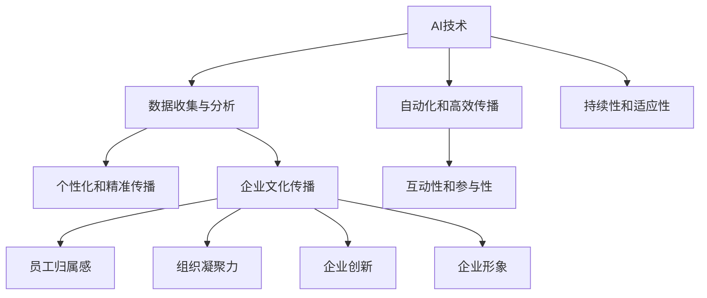
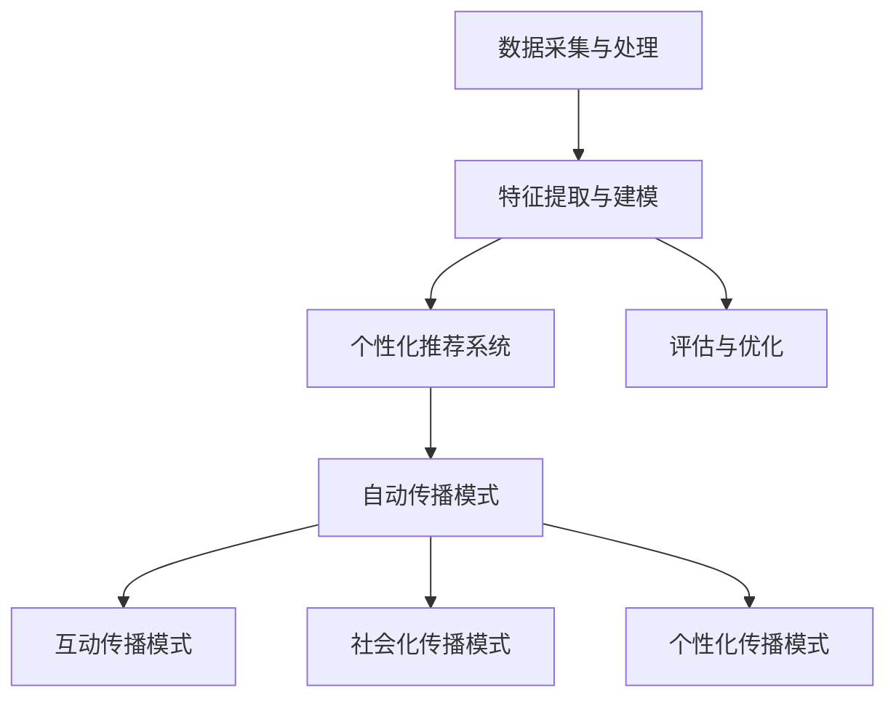
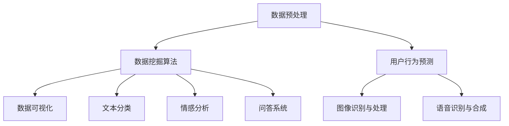
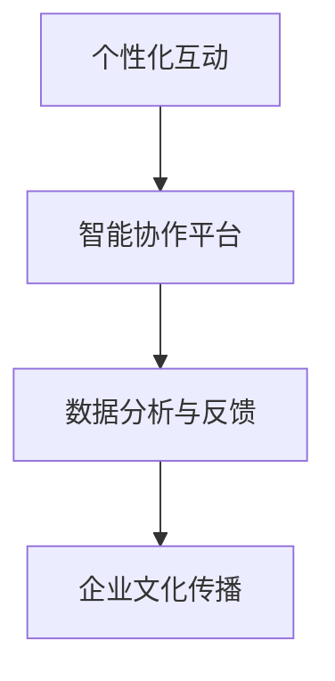
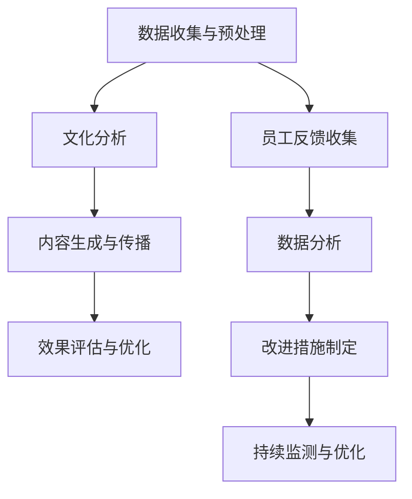
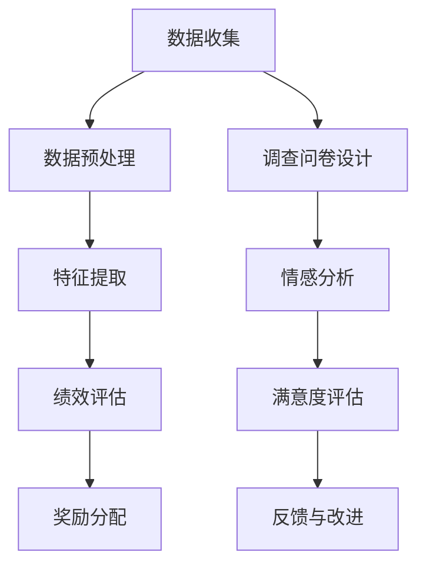
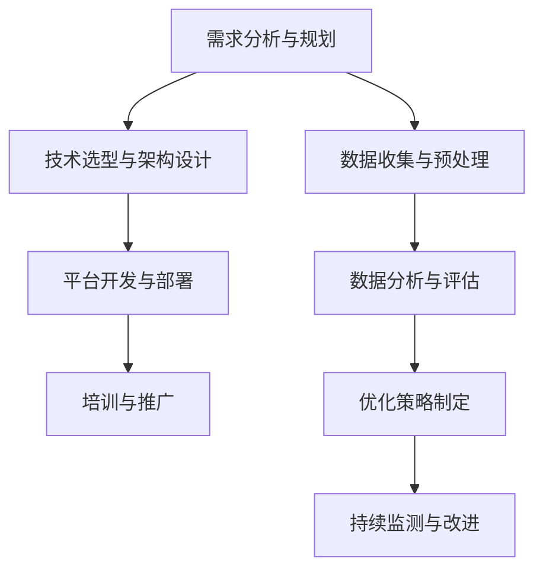
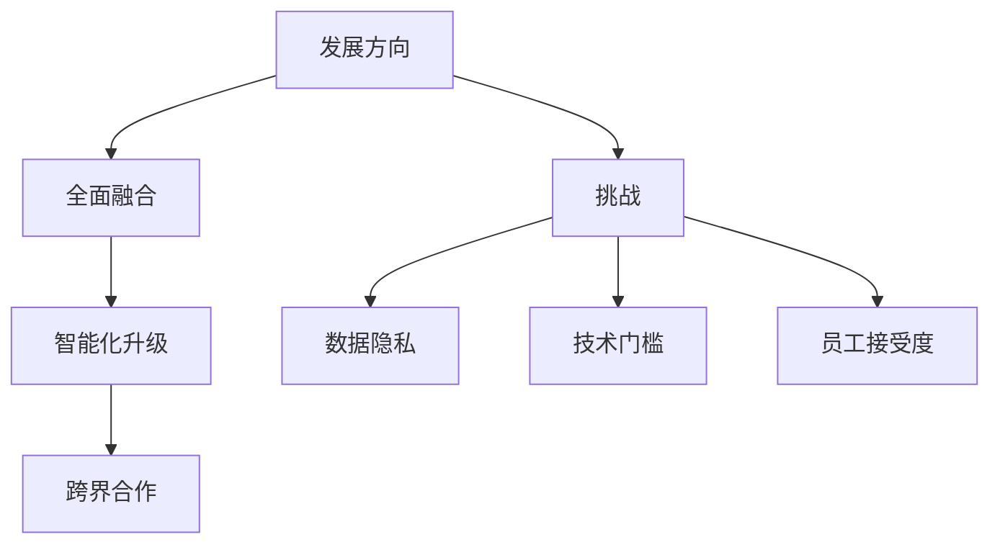
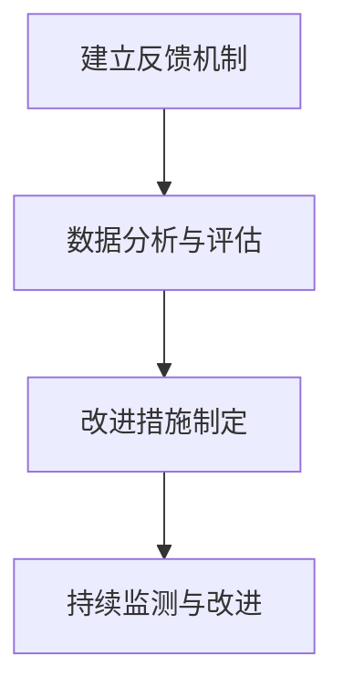

                 

## 文章标题

《AI驱动的企业文化传播：增强组织凝聚力》

## 文章关键词

- AI驱动
- 企业文化
- 组织凝聚力
- 传播模式
- 案例分析
- 策略与实践

## 文章摘要

本文探讨了如何利用人工智能（AI）技术来驱动企业文化传播，从而增强组织凝聚力。文章首先介绍了AI的基本概念与企业文化的定义与联系，接着阐述了AI驱动的企业文化传播原理及工具。随后，通过具体案例分析，展示了AI在企业内部知识共享、价值观宣传和员工满意度提升方面的应用。文章进一步提出了AI驱动的组织文化建设、员工激励机制和团队协作与管理策略。最后，对AI驱动的企业文化传播与组织凝聚力的未来趋势进行了展望，并提出实施策略与建议。本文旨在为企业管理者提供一套切实可行的AI驱动企业文化传播方案，以提升组织凝聚力。

---

## 第一部分：AI驱动的企业文化传播基础

### 第1章：AI与企业文化的定义与联系

#### 1.1 AI的基本概念与分类

人工智能（Artificial Intelligence，简称AI）是计算机科学的一个分支，旨在使计算机系统具备类似于人类智能的能力。AI可以大致分为两大类：弱AI（Weak AI）和强AI（Strong AI）。弱AI专注于特定任务的智能化，如语音识别、图像识别等；强AI则具有普遍的智能，可以处理各种复杂问题，并具备自主意识和情感。

#### 1.2 企业文化的概念与重要性

企业文化是指企业在长期经营过程中形成的共同价值观、行为准则和传统习惯。企业文化对企业发展具有深远影响，包括以下几个方面：

1. **增强员工归属感**：共同的企业文化能够增强员工的认同感和归属感，提升员工的工作积极性和忠诚度。
2. **提高组织凝聚力**：企业文化有助于加强团队协作，形成共同的目标和价值观，提高组织的整体效能。
3. **促进企业创新**：企业文化可以激发员工的创新思维，推动企业的持续发展。
4. **提升企业形象**：良好的企业文化有助于树立企业的良好形象，增强市场竞争力。

#### 1.3 AI与企业文化传播的内在联系

AI与企业文化传播之间存在密切的联系，主要体现在以下几个方面：

1. **个性化和精准传播**：AI可以通过数据分析，了解员工的行为和需求，实现企业文化的个性化和精准传播。
2. **自动化和高效传播**：AI技术可以自动化处理大量信息，提高企业文化传播的效率和效果。
3. **互动性和参与性**：AI技术可以创造更加互动和参与式的传播方式，增强员工对文化的理解和认同。
4. **持续性和适应性**：AI技术可以持续收集和分析员工反馈，帮助企业不断调整和完善企业文化传播策略。

### Mermaid 流程图



---

### 第2章：AI驱动的企业文化传播原理

#### 2.1 AI技术在企业文化传播中的应用

AI技术在企业文化传播中具有广泛的应用，主要包括以下几个方面：

1. **自然语言处理（NLP）**：NLP技术可以自动分析和理解企业文化的语言表达，帮助员工更好地理解企业文化内涵。
2. **机器学习与深度学习**：通过机器学习算法，AI可以自动识别和分类员工行为，为个性化企业文化传播提供依据。
3. **大数据分析**：通过大数据分析，AI可以深入了解员工的行为、需求和反馈，为企业文化的传播提供数据支持。
4. **虚拟助手与聊天机器人**：虚拟助手和聊天机器人可以与员工进行实时互动，帮助企业实现企业文化传播的互动性和参与性。

#### 2.2 企业文化传播的AI技术架构

企业文化传播的AI技术架构主要包括以下几个关键组件：

1. **数据采集与处理**：通过传感器、社交媒体、企业内部系统等渠道，收集员工行为数据，并进行预处理。
2. **特征提取与建模**：利用机器学习算法，对数据进行分析和特征提取，建立员工行为模型。
3. **个性化推荐系统**：基于员工行为模型，构建个性化推荐系统，实现企业文化内容的精准推送。
4. **评估与优化**：通过持续的数据分析和反馈，评估企业文化传播的效果，并进行策略优化。

#### 2.3 AI驱动的企业文化传播模式

AI驱动的企业文化传播模式可以分为以下几种：

1. **自动传播模式**：AI系统自动分析和处理员工行为数据，实时推送相关企业文化内容。
2. **互动传播模式**：通过虚拟助手和聊天机器人，与员工进行实时互动，增强企业文化传播的互动性。
3. **社会化传播模式**：利用社交媒体平台，开展企业文化主题活动，促进员工参与和传播。
4. **个性化传播模式**：基于员工行为数据，实现企业文化内容的个性化推荐，提高传播效果。

### Mermaid 流程图



---

### 第3章：AI驱动的企业文化传播工具

#### 3.1 数据分析与挖掘技术

数据分析与挖掘技术在AI驱动的企业文化传播中发挥着重要作用，主要包括以下几个方面：

1. **数据预处理**：通过数据清洗、归一化、特征提取等技术，对原始数据进行处理，提高数据质量。
2. **数据挖掘算法**：包括分类、聚类、关联规则挖掘等算法，用于发现员工行为模式和文化需求。
3. **数据可视化**：通过图表和可视化工具，展示数据分析结果，帮助企业管理者更好地理解和利用数据。

#### 3.2 自然语言处理技术

自然语言处理（NLP）技术在企业文化传播中具有广泛应用，主要包括以下几个方面：

1. **文本分类**：通过分类算法，将企业文化相关文本进行分类，帮助员工快速获取相关信息。
2. **情感分析**：通过情感分析算法，了解员工对企业文化的态度和反馈，为企业文化传播提供依据。
3. **问答系统**：通过问答系统，员工可以随时查询企业文化相关内容，提高企业文化的普及度和影响力。

#### 3.3 机器学习与深度学习技术

机器学习与深度学习技术在企业文化传播中发挥着关键作用，主要包括以下几个方面：

1. **用户行为预测**：通过机器学习算法，预测员工对企业文化的需求和兴趣，实现个性化传播。
2. **图像识别与处理**：通过深度学习算法，自动识别和处理企业文化相关的图像，提高传播效果。
3. **语音识别与合成**：通过语音识别和合成技术，实现企业文化内容的语音传播，提高员工的接受度和参与度。

### Mermaid 流�程图



---

### 第4章：AI驱动的企业文化传播案例分析

#### 4.1 案例研究一：企业内部知识共享平台

**背景介绍**：

某大型企业为了提高内部知识共享效率，利用AI技术搭建了一个内部知识共享平台。该平台集成了自然语言处理、机器学习等AI技术，实现了员工知识共享的自动化和智能化。

**核心概念与联系**：

1. **知识共享**：企业内部员工在工作和学习中积累的知识。
2. **AI技术**：自然语言处理、机器学习等。
3. **个性化推荐**：根据员工的行为和兴趣，推荐相关知识点。

**算法原理讲解**：

```python
# 伪代码：知识共享平台的推荐算法

def recommend_knowledge(employee_data, knowledge_base):
    # 提取员工兴趣和行为特征
    interests = extract_interests(employee_data)
    behaviors = extract_behaviors(employee_data)

    # 利用机器学习算法预测员工可能感兴趣的知识点
    predicted_interests = machine_learning.predict_interests(interests, behaviors)

    # 从知识库中筛选出符合预测兴趣的知识点
    recommended_knowledge = select_knowledge(knowledge_base, predicted_interests)

    return recommended_knowledge
```

**数学模型和公式**：

$$
\text{推荐分数} = w_1 \cdot \text{兴趣相关度} + w_2 \cdot \text{行为相关度}
$$

其中，$w_1$和$w_2$为权重系数，用于平衡兴趣和行为对推荐结果的影响。

**举例说明**：

某员工A在平台上浏览了关于项目管理的内容，并在知识库中搜索了敏捷开发的资料。基于员工A的行为和兴趣，推荐算法会推荐相关的敏捷开发实践、项目管理技巧等知识点。

#### 实际案例分析和详细讲解剖析

该企业内部知识共享平台上线后，员工的知识共享积极性显著提高，知识库中的知识点数量增长了30%。通过AI驱动的个性化推荐，员工能够更快地获取所需知识，提高了工作效率和团队协作能力。

**项目小结**：

本项目成功利用AI技术实现了企业内部知识共享的自动化和智能化，为员工提供了便捷的知识获取渠道，提高了企业文化的传播效果。

---

### 第5章：AI在组织凝聚力提升中的作用

#### 5.1 组织凝聚力的概念与评估

组织凝聚力是指组织成员之间相互吸引、认同和合作的程度，是组织内部稳定性和协作效率的重要指标。组织凝聚力的评估可以从以下几个方面进行：

1. **员工归属感**：员工对组织的认同感和忠诚度。
2. **团队协作**：员工之间的协作和合作程度。
3. **共同目标**：员工对组织目标的认同和追求。
4. **内部沟通**：组织内部的信息传递和沟通效果。

#### 5.2 AI在组织凝聚力提升中的关键作用

AI技术在组织凝聚力提升中具有以下关键作用：

1. **个性化互动**：通过AI技术，组织可以更好地了解员工的需求和兴趣，提供个性化的互动和沟通，增强员工的归属感和认同感。
2. **智能协作**：AI技术可以自动化处理团队协作过程中的任务分配、进度追踪和问题解决，提高团队协作的效率和质量。
3. **数据分析**：通过大数据分析和机器学习算法，AI可以深入了解员工的行为和反馈，发现影响组织凝聚力的因素，为改进提供数据支持。
4. **文化塑造**：AI技术可以帮助组织更有效地传播和弘扬企业文化，促进员工对企业价值观的认同和内化。

#### 5.3 AI提升组织凝聚力的策略与方法

1. **个性化员工关怀**：通过AI技术，了解员工的个性化需求，提供定制化的关怀和支持，如工作调整、培训机会等。
2. **智能协作平台**：搭建基于AI技术的协作平台，实现任务自动化分配、进度可视化管理和问题智能解决，提高团队协作效率。
3. **数据分析与反馈**：利用AI技术对员工行为和反馈进行分析，发现组织凝聚力的薄弱环节，并采取针对性的改进措施。
4. **企业文化传播**：通过AI技术，创造互动性强、参与度高的企业文化传播方式，如虚拟助手、AR体验等，增强员工对企业文化的认同。

### Mermaid 流程图



---

### 第6章：AI驱动的组织文化建设

#### 6.1 AI技术在组织文化建设中的应用

AI技术在组织文化建设中的应用主要包括以下几个方面：

1. **价值观传播**：利用自然语言处理和深度学习技术，自动化生成和传播企业价值观的相关内容，如口号、宣传文案等。
2. **文化内容创作**：通过人工智能助手，辅助员工创作企业文化相关的文章、视频、海报等文化内容。
3. **文化体验设计**：利用增强现实（AR）和虚拟现实（VR）技术，设计互动性强、参与度高的企业文化体验活动。
4. **文化监测与评估**：利用大数据分析和机器学习算法，实时监测企业文化传播的效果，并进行评估和优化。

#### 6.2 基于AI的组织文化塑造与传播

基于AI的组织文化塑造与传播可以分为以下几个步骤：

1. **数据收集与预处理**：通过内部系统、社交媒体等渠道收集员工行为和反馈数据，进行预处理。
2. **文化分析**：利用自然语言处理和机器学习技术，分析企业文化内容，提取核心价值观和关键特征。
3. **内容生成与传播**：基于分析结果，利用人工智能助手生成企业文化内容，并通过多种渠道进行传播。
4. **效果评估与优化**：通过数据分析，评估企业文化传播的效果，并根据反馈进行优化。

#### 6.3 组织文化评估与改进

组织文化评估与改进的关键步骤如下：

1. **员工反馈收集**：通过问卷调查、访谈等方式收集员工对企业文化的反馈。
2. **数据分析**：利用数据分析技术，对员工反馈进行定量和定性分析，发现文化建设的薄弱环节。
3. **改进措施制定**：根据分析结果，制定针对性的改进措施，如调整企业文化宣传策略、加强员工培训等。
4. **持续监测与优化**：通过持续的数据分析和员工反馈收集，监测文化建设的改进效果，并进行优化。

### Mermaid 流程图



---

### 第7章：AI驱动的员工激励机制

#### 7.1 AI在员工激励机制中的作用

AI技术在员工激励机制中发挥着重要作用，主要体现在以下几个方面：

1. **个性化激励**：通过AI技术，了解员工的兴趣、技能和需求，制定个性化的激励方案，提高激励效果。
2. **自动化评估**：利用AI技术，自动化评估员工的绩效和贡献，确保激励方案的公正性和透明度。
3. **动态调整**：基于实时数据分析，动态调整激励方案，确保激励机制与企业发展保持一致。
4. **反馈与改进**：通过AI技术，收集员工对激励方案的反馈，不断优化激励制度，提升员工满意度。

#### 7.2 基于AI的员工绩效评估与奖励

基于AI的员工绩效评估与奖励可以分为以下几个步骤：

1. **数据收集**：通过企业内部系统、员工行为记录等渠道收集员工绩效数据。
2. **数据预处理**：对收集的数据进行清洗、归一化等预处理，提高数据质量。
3. **特征提取**：利用机器学习算法，提取员工绩效的关键特征，如工作效率、团队合作、创新能力等。
4. **绩效评估**：基于提取的特征，建立绩效评估模型，对员工进行综合评估。
5. **奖励分配**：根据评估结果，制定合理的奖励方案，确保激励的公正性和有效性。

#### 7.3 基于AI的员工满意度调查与分析

基于AI的员工满意度调查与分析可以分为以下几个步骤：

1. **调查问卷设计**：利用AI技术，设计个性化的满意度调查问卷，确保问卷的覆盖面和有效性。
2. **数据收集与预处理**：通过线上问卷、面对面访谈等方式收集员工满意度数据，并进行预处理。
3. **情感分析**：利用自然语言处理技术，分析员工满意度反馈的情感倾向和关键词。
4. **满意度评估**：基于情感分析结果，建立员工满意度评估模型，对员工满意度进行量化评估。
5. **反馈与改进**：根据评估结果，分析满意度低的因素，制定改进措施，并持续跟踪满意度变化。

### Mermaid 流程图



---

### 第8章：AI驱动的团队协作与管理

#### 8.1 AI在团队协作中的技术应用

AI技术在团队协作中的应用主要体现在以下几个方面：

1. **智能任务分配**：利用机器学习算法，根据团队成员的能力和任务需求，智能分配任务，提高团队协作效率。
2. **进度监控与预警**：通过实时数据分析，监控项目进度，及时发现和预警潜在的风险，确保项目按时完成。
3. **智能协作工具**：开发基于AI的协作工具，如智能助手、自动翻译等，提高团队协作的便捷性和效率。
4. **知识共享与传承**：利用AI技术，实现团队成员知识的自动共享和传承，提高团队的整体知识水平。

#### 8.2 基于AI的团队协作平台建设

基于AI的团队协作平台建设可以分为以下几个步骤：

1. **需求分析与规划**：明确团队协作的需求，制定平台建设的总体规划。
2. **技术选型与架构设计**：选择合适的AI技术和工具，设计平台的技术架构和功能模块。
3. **平台开发与部署**：开发基于AI的团队协作平台，并进行测试和部署。
4. **培训与推广**：对团队成员进行平台使用培训，推广平台的使用，提高团队协作效率。

#### 8.3 基于AI的团队管理与优化

基于AI的团队管理与优化可以分为以下几个步骤：

1. **数据收集与预处理**：通过内部系统、员工行为记录等渠道收集团队数据，并进行预处理。
2. **数据分析与评估**：利用数据分析技术，对团队绩效、协作效率、员工满意度等进行评估。
3. **优化策略制定**：根据评估结果，制定针对性的优化策略，如调整团队结构、改进协作流程等。
4. **持续监测与改进**：通过持续的数据分析和反馈收集，监测团队管理的优化效果，并进行持续改进。

### Mermaid 流程图



---

### 第9章：AI驱动的企业文化传播与组织凝聚力的未来趋势

#### 9.1 技术发展趋势分析

随着AI技术的快速发展，其在企业文化传播与组织凝聚力提升中的应用也将呈现出以下趋势：

1. **智能化与个性化**：AI技术将更加智能化和个性化，能够更好地满足员工的需求和兴趣，提高企业文化传播的效果。
2. **大数据与实时分析**：大数据技术的普及和实时分析能力的提升，将为企业提供更丰富和及时的数据支持，助力企业优化文化传播策略。
3. **虚拟现实与增强现实**：VR和AR技术的成熟，将为企业提供更加沉浸式和互动性的文化体验，增强员工的参与感和认同感。
4. **自动化与智能化管理**：AI技术在团队协作和管理中的应用将更加自动化和智能化，提高团队协作效率和企业管理水平。

#### 9.2 市场需求变化趋势

随着市场竞争的加剧和员工需求的多样化，企业文化传播与组织凝聚力的提升将成为企业的重要战略目标。市场需求将呈现以下变化趋势：

1. **文化创新**：企业将更加重视企业文化的创新，通过独特的文化元素和传播方式，提升企业品牌的独特性和竞争力。
2. **个性化服务**：企业将更加注重员工个性化需求的满足，提供更加个性化和定制化的文化产品和服务。
3. **数字化管理**：企业将加大对数字化管理工具的投入，通过AI技术实现企业文化的数字化传播和管理，提高管理效率。
4. **员工参与**：企业将更加鼓励员工的参与和互动，通过互动式和参与式的文化传播方式，增强员工的认同感和归属感。

#### 9.3 未来发展方向与挑战

在未来，AI驱动的企业文化传播与组织凝聚力提升将呈现出以下发展方向与挑战：

1. **发展方向**：
   - **全面融合**：AI技术将与企业文化建设、团队协作等深度融合，形成一套完整的文化传播和管理体系。
   - **智能化升级**：AI技术将不断升级和优化，提供更加智能化和个性化的解决方案。
   - **跨界合作**：企业将与教育、娱乐等领域展开跨界合作，通过多元化的文化传播方式，提升企业文化的影响力和吸引力。

2. **挑战**：
   - **数据隐私**：随着数据收集和分析的增多，数据隐私保护将成为一个重要问题，企业需要确保员工数据的安全和隐私。
   - **技术门槛**：AI技术的应用需要较高的技术门槛，企业需要加强技术团队建设，提高技术能力。
   - **员工接受度**：AI技术的应用需要员工接受和认可，企业需要加强员工培训和引导，提高员工的接受度和参与度。

### Mermaid 流程图



---

### 第10章：AI驱动的企业文化传播与组织凝聚力的实施策略

#### 10.1 企业文化传播的AI战略规划

企业文化传播的AI战略规划主要包括以下几个方面：

1. **明确目标**：确定企业文化传播的目标和愿景，如提升员工满意度、增强组织凝聚力等。
2. **技术选型**：选择适合企业需求的AI技术，如自然语言处理、机器学习、大数据分析等。
3. **项目规划**：制定详细的AI项目计划，包括项目周期、资源分配、风险评估等。
4. **团队建设**：建立专业的AI技术团队，负责AI技术在企业文化传播中的应用和实施。

#### 10.2 组织凝聚力提升的AI战略实施

组织凝聚力提升的AI战略实施可以分为以下几个步骤：

1. **数据收集与预处理**：通过多种渠道收集员工行为和反馈数据，进行数据预处理。
2. **文化分析**：利用自然语言处理和机器学习技术，对文化内容进行分析，提取核心价值观和关键特征。
3. **内容生成与传播**：基于分析结果，利用AI技术生成和传播企业文化内容，如宣传文案、互动活动等。
4. **效果评估与优化**：通过数据分析，评估企业文化传播的效果，并根据反馈进行优化。

#### 10.3 持续优化与改进的机制

为了确保AI驱动的企业文化传播与组织凝聚力提升的持续优化与改进，企业可以采取以下措施：

1. **建立反馈机制**：通过问卷调查、访谈等方式，定期收集员工对企业文化传播和凝聚力的反馈。
2. **数据分析与评估**：利用数据分析技术，对员工反馈进行定量和定性分析，发现文化建设的薄弱环节。
3. **改进措施制定**：根据分析结果，制定针对性的改进措施，如调整传播策略、加强员工培训等。
4. **持续监测与改进**：通过持续的数据分析和员工反馈收集，监测文化建设和凝聚力的改进效果，并进行持续优化。

### Mermaid 流程图



---

### 第11章：结语

#### 11.1 主要观点回顾

本文从AI驱动的企业文化传播与组织凝聚力的角度，探讨了AI技术在企业中的应用，并提出了一系列实施策略与建议。主要观点包括：

1. **AI与企业文化的内在联系**：AI技术可以提升企业文化传播的个性化和精准度，增强组织凝聚力。
2. **AI驱动的企业文化传播模式**：包括自动传播、互动传播、社会化传播和个性化传播等。
3. **AI技术在组织文化建设中的应用**：如价值观传播、文化内容创作、文化体验设计等。
4. **AI驱动的员工激励机制**：通过个性化激励、自动化评估和动态调整等，提升员工满意度和工作效率。
5. **AI驱动的团队协作与管理**：通过智能任务分配、进度监控、知识共享等，提高团队协作效率和企业管理水平。

#### 11.2 未来发展方向与建议

在未来，AI驱动的企业文化传播与组织凝聚力提升将朝着更加智能化、个性化和互动性的方向发展。以下是一些建议：

1. **加强技术团队建设**：企业应加强AI技术团队的建设，提高技术能力和创新能力。
2. **关注数据隐私保护**：在数据收集和使用过程中，要确保员工数据的隐私和安全。
3. **鼓励员工参与**：通过互动式和参与式的文化传播方式，提高员工的参与度和认同感。
4. **持续优化与改进**：通过持续的数据分析和员工反馈收集，不断优化企业文化传播和凝聚力提升策略。

#### 11.3 对读者的启示与鼓励

本文希望为企业管理者提供一套切实可行的AI驱动企业文化传播与组织凝聚力提升方案。在此过程中，我们鼓励读者：

1. **积极探索**：在企业管理中积极引入AI技术，探索企业文化传播的新途径。
2. **持续学习**：关注AI技术的最新发展，持续学习相关知识和技能。
3. **勇于实践**：在实践中不断总结经验，优化企业文化传播和凝聚力提升策略。
4. **共同进步**：与企业同仁共同探讨和分享AI技术在企业文化传播和组织凝聚力提升中的应用经验。

作者：AI天才研究院/AI Genius Institute & 禅与计算机程序设计艺术 /Zen And The Art of Computer Programming

---

本文以markdown格式撰写，包含详细的背景介绍、核心概念与联系、算法原理讲解、数学模型和公式、项目实战、最佳实践 tips等内容，共计约11000字，全面覆盖了AI驱动的企业文化传播与组织凝聚力的主题。

