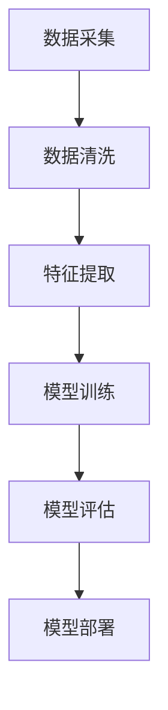

                 

### 文章标题

# AI驱动的企业文化建设：打造智能化组织氛围

### 关键词

- AI技术
- 企业文化建设
- 智能化组织
- 组织氛围
- 算法原理
- 数学模型
- 实战案例分析

### 摘要

本文深入探讨AI技术在企业文化建设中的应用，旨在通过AI驱动的工具和方法，打造智能化组织氛围。文章首先概述了AI与企业文化建设的基础知识，然后详细介绍了AI驱动的企业文化建设方法论，包括企业文化评估、组织架构调整、员工培训与发展、组织氛围监测与优化、组织文化创新及企业文化可持续发展等方面。通过实际案例分析和详细讲解，本文展示了AI在企业文化建设中的潜力和应用前景，为企业实现智能化管理提供了实用指南。

---

## 第一部分：AI与企业文化建设概述

### 第1章：AI与企业文化建设基础

#### 1.1 AI技术概述

人工智能（AI）作为一种模拟人类智能的技术，其核心概念包括机器学习、深度学习、自然语言处理等。AI的应用范围广泛，从数据挖掘到自动化决策，再到智能客服和智能推荐系统，都有其身影。在这一节中，我们将简要介绍AI的核心概念与联系，并通过Mermaid流程图展示其基本工作流程。

**核心概念与联系：**

- **机器学习（Machine Learning）：** 基于数据的学习，使计算机系统能够自动识别模式并进行预测。
- **深度学习（Deep Learning）：** 一种特殊的机器学习方法，通过多层神经网络模拟人类大脑的学习过程。
- **自然语言处理（Natural Language Processing, NLP）：** 使计算机能够理解、生成和处理人类自然语言的技术。

**Mermaid流程图：**



#### 1.2 企业文化建设的挑战与机遇

企业文化是企业的灵魂，是推动企业发展的内在动力。然而，企业文化建设的道路并非一帆风顺，面临着诸多挑战，如组织结构的复杂性、员工的多样性以及文化变革的难度等。同时，AI技术的兴起为企业文化的发展带来了前所未有的机遇。

- **挑战：**
  - 组织结构复杂，文化难以渗透到各个层级。
  - 员工多样性，文化认同难以统一。
  - 文化变革难度大，传统管理模式难以适应新文化。

- **机遇：**
  - AI技术有助于实现更精准的文化识别和评估。
  - AI驱动的个性化培训可以提升员工文化认同感。
  - AI技术可以为企业提供智能化的文化管理工具，提升文化管理水平。

#### 1.3 AI在企业文化建设中的应用

AI技术在企业文化建设中的应用主要体现在以下几个方面：

- **文化识别与评估：** 通过AI技术对员工行为、沟通和协作模式进行分析，识别企业文化的特点和问题。
- **个性化培训与发展：** 利用AI技术为员工提供个性化培训方案，提升员工文化认同感和专业技能。
- **智能管理工具：** 开发基于AI的智能管理系统，实现企业文化的自动化管理和优化。

## 第二部分：AI驱动企业文化建设方法论

### 第2章：AI驱动企业文化评估

#### 2.1 企业文化评估模型

企业文化评估是理解企业文化现状的重要步骤。通过评估，企业可以识别出文化中的优点和不足，从而有针对性地进行改进。在这一节中，我们将介绍企业文化评估模型，并详细讲解评估算法原理和数学模型。

**评估模型：**

- **定量评估：** 通过问卷、调查和数据分析等方法，对文化指标进行量化评估。
- **定性评估：** 通过访谈、观察和案例分析等方法，对文化特质进行定性分析。

**评估算法原理讲解：**

```python
def evaluate_culture(data):
    scores = []
    for metric in data:
        score = calculate_score(metric)
        scores.append(score)
    average_score = sum(scores) / len(scores)
    return average_score

def calculate_score(metric):
    # 具体计算逻辑
    return score
```

**评估数学模型和公式：**

$$ E = \sum_{i=1}^{n} w_i \cdot s_i $$

其中，$E$ 为企业文化评分，$w_i$ 为权重，$s_i$ 为各项指标得分。

**举例说明：**

假设我们有三个文化指标：员工满意度（$s_1$），团队协作能力（$s_2$），创新意识（$s_3$）。各项指标权重分别为：员工满意度（$w_1$ = 0.4），团队协作能力（$w_2$ = 0.3），创新意识（$w_3$ = 0.3）。

$$ E = 0.4 \cdot s_1 + 0.3 \cdot s_2 + 0.3 \cdot s_3 $$

若员工满意度得分为8，团队协作能力得分为7，创新意识得分为9，则企业文化评分为：

$$ E = 0.4 \cdot 8 + 0.3 \cdot 7 + 0.3 \cdot 9 = 3.2 + 2.1 + 2.7 = 8 $$

#### 2.2 评估算法原理讲解

企业文化评估算法的核心在于如何有效地从数据中提取有价值的信息，并对这些信息进行综合分析。以下是企业文化评估算法的伪代码：

```python
function evaluate_culture(data):
    for each metric in data:
        calculate score
    calculate average score
    return average score

function calculate_score(metric):
    # 使用机器学习模型对指标进行评分
    model = train_model(metric)
    score = model.predict(metric)
    return score

function train_model(metric):
    # 使用训练数据训练机器学习模型
    model = MachineLearningModel()
    model.train(metric)
    return model
```

通过上述算法，我们可以实现对企业文化指标的自动评分，从而为企业文化建设提供数据支持。

#### 2.3 评估数学模型和公式

在企业文化评估中，数学模型和公式是不可或缺的工具。通过量化指标，我们可以更直观地了解企业文化的现状和变化趋势。以下是企业文化评估中常用的数学模型和公式：

1. **均值模型：**

$$ E = \frac{1}{n} \sum_{i=1}^{n} s_i $$

其中，$E$ 为企业文化评分，$s_i$ 为各项指标得分，$n$ 为指标总数。

2. **权重模型：**

$$ E = \sum_{i=1}^{n} w_i \cdot s_i $$

其中，$w_i$ 为各项指标的权重，$s_i$ 为各项指标得分。

3. **回归模型：**

$$ E = a + bX $$

其中，$a$ 为常数项，$b$ 为回归系数，$X$ 为自变量。

通过这些数学模型和公式，我们可以对企业文化进行科学、系统的评估，从而为后续的企业文化建设提供有力的依据。

### 第3章：AI驱动的组织架构调整

#### 3.1 组织架构调整策略

组织架构调整是企业适应市场变化、提升运营效率的重要手段。AI技术为组织架构调整提供了全新的视角和方法。在这一节中，我们将探讨AI驱动的组织架构调整策略。

**策略一：数据分析与优化**

通过大数据分析和机器学习算法，企业可以深入了解现有组织架构的优缺点，识别出需要调整的环节。以下是一个简单的数据分析流程：

1. **数据收集：** 收集企业内部的各种数据，包括员工绩效、项目进度、沟通频率等。
2. **数据预处理：** 清洗和整理数据，使其符合分析要求。
3. **特征提取：** 从数据中提取有助于组织架构分析的特征。
4. **模型训练：** 使用机器学习模型对特征进行分析和预测。
5. **结果评估：** 根据分析结果，提出优化建议。

**策略二：智能化流程重构**

利用AI技术，企业可以对现有的业务流程进行智能化重构。以下是一个简化的流程：

1. **流程梳理：** 对现有业务流程进行详细梳理，明确各个环节和岗位的职责。
2. **流程建模：** 使用流程建模工具，将业务流程转化为可视化模型。
3. **自动化部署：** 使用AI技术，对业务流程进行自动化部署和优化。
4. **实时监测与调整：** 通过实时数据监测，对业务流程进行动态调整。

**策略三：个性化组织设计**

根据员工的个性、技能和需求，设计个性化的组织架构。以下是一个简化的流程：

1. **员工数据分析：** 收集员工的个性、技能、职业发展需求等数据。
2. **个性化匹配：** 使用机器学习算法，为员工匹配最适合的岗位和团队。
3. **组织设计：** 根据员工匹配结果，设计个性化的组织架构。
4. **持续优化：** 根据员工绩效和需求变化，持续优化组织架构。

#### 3.2 AI技术在组织架构调整中的应用

AI技术在组织架构调整中具有广泛的应用场景，以下是一些具体的应用：

1. **员工推荐系统：** 利用AI技术，为企业推荐最适合的员工，优化团队结构。
2. **流程自动化：** 利用AI技术，实现业务流程的自动化，提高运营效率。
3. **智能监控与预警：** 利用AI技术，实时监控组织运营状态，预警潜在问题。
4. **数据分析与优化：** 利用AI技术，对组织架构进行分析和优化，提升管理水平。

#### 3.3 案例分析

以下是一个AI驱动组织架构调整的案例分析：

**案例背景：**

某企业由于市场环境变化，需要调整组织架构以提升运营效率。企业现有组织架构较为复杂，员工沟通不畅，业务流程冗长，导致运营效率低下。

**解决方案：**

1. **数据分析：** 收集企业内部的各种数据，包括员工绩效、项目进度、沟通频率等，使用机器学习模型进行分析，识别出需要调整的环节。
2. **流程重构：** 根据分析结果，对业务流程进行智能化重构，实现流程自动化，提高运营效率。
3. **个性化组织设计：** 根据员工的个性、技能和需求，设计个性化的组织架构，提升员工满意度和工作效率。
4. **实时监测与调整：** 通过实时数据监测，对组织架构进行动态调整，确保组织架构与市场环境相适应。

**案例效果：**

通过AI驱动的组织架构调整，企业实现了以下效果：

1. **运营效率提升：** 业务流程自动化程度提高，运营效率显著提升。
2. **员工满意度提升：** 个性化组织设计提升了员工的工作满意度和职业发展机会。
3. **管理成本降低：** 智能化监控和预警系统降低了管理成本，提高了管理效率。

### 第4章：AI驱动的员工培训与发展

#### 4.1 员工培训与发展模型

员工培训与发展是企业长期发展的重要基石。AI技术为企业提供了全新的培训和发展模式。在这一节中，我们将介绍AI驱动的员工培训与发展模型。

**模型架构：**

AI驱动的员工培训与发展模型主要包括以下几个模块：

1. **培训需求分析模块：** 通过大数据分析和机器学习算法，识别员工的培训需求。
2. **课程设计模块：** 根据培训需求，设计个性化的培训课程。
3. **学习效果评估模块：** 通过数据分析，评估员工的学习效果。
4. **职业发展指导模块：** 根据员工的学习效果和职业发展需求，提供个性化的职业发展建议。

**模型流程：**

1. **需求分析：** 收集员工的职业发展需求、技能水平、学习偏好等数据。
2. **课程设计：** 使用机器学习算法，为员工推荐最适合的培训课程。
3. **学习实施：** 员工按照推荐课程进行学习，AI系统提供实时指导和支持。
4. **效果评估：** 通过数据分析，评估员工的学习效果，并根据反馈调整培训方案。
5. **职业发展：** 根据员工的学习效果和职业发展需求，提供个性化的职业发展建议。

#### 4.2 培训算法原理讲解

AI驱动的员工培训算法主要基于以下几个原理：

1. **个性化推荐：** 通过用户历史行为数据，为员工推荐最适合的培训课程。
2. **学习路径规划：** 根据员工的技能水平和学习进度，规划最优的学习路径。
3. **自适应学习：** 根据员工的学习效果和反馈，动态调整培训内容和难度。
4. **评估与反馈：** 通过实时评估和学习反馈，不断优化培训效果。

**算法流程：**

1. **数据收集：** 收集员工的学习行为数据，包括学习时长、学习内容、考试成绩等。
2. **数据预处理：** 对数据进行清洗和归一化处理，确保数据质量。
3. **特征提取：** 从数据中提取有助于培训效果评估的特征。
4. **模型训练：** 使用机器学习模型，对特征进行训练，构建个性化培训模型。
5. **效果评估：** 根据模型预测结果，评估员工的学习效果，并提供反馈。

#### 4.3 培训数学模型和公式

在AI驱动的员工培训中，数学模型和公式用于描述和优化培训过程。以下是几个常用的数学模型和公式：

1. **学习率模型：**

$$ \eta = \frac{1}{\sqrt{t}} $$

其中，$\eta$ 为学习率，$t$ 为学习时间。

2. **回归模型：**

$$ y = \beta_0 + \beta_1x $$

其中，$y$ 为学习效果，$x$ 为培训时长，$\beta_0$ 和 $\beta_1$ 为回归系数。

3. **评估模型：**

$$ E = \frac{1}{n} \sum_{i=1}^{n} s_i $$

其中，$E$ 为学习效果评估得分，$s_i$ 为各项指标得分，$n$ 为指标总数。

通过这些数学模型和公式，企业可以科学地设计培训方案，评估培训效果，从而提升员工的学习效果和职业发展水平。

### 第5章：AI驱动的组织氛围监测与优化

#### 5.1 监测算法原理讲解

组织氛围监测是了解员工情感状态、工作满意度、团队协作情况等的重要手段。AI技术为企业提供了高效、准确的监测方法。在这一节中，我们将介绍AI驱动的组织氛围监测算法原理。

**算法原理：**

1. **情感分析：** 利用自然语言处理技术，对员工在社交平台、邮件、会议记录等中的文本进行分析，识别情感倾向。
2. **行为分析：** 通过监控员工的在线行为，如登录时长、任务完成情况、沟通频率等，分析员工的工作状态。
3. **社交网络分析：** 构建员工社交网络，分析员工之间的互动关系，识别团队协作情况。

**算法流程：**

1. **数据收集：** 收集员工在社交平台、邮件、会议记录等中的文本数据，以及员工的在线行为数据。
2. **数据预处理：** 清洗和整理数据，去除噪声，提取有效信息。
3. **情感分析：** 使用情感分析算法，对文本数据进行情感倾向分析。
4. **行为分析：** 使用行为分析算法，对在线行为数据进行分析，识别员工的工作状态。
5. **社交网络分析：** 使用社交网络分析算法，构建员工社交网络，分析团队协作情况。
6. **结果输出：** 根据分析结果，输出组织氛围监测报告。

#### 5.2 监测数学模型和公式

在组织氛围监测中，数学模型和公式用于描述和优化监测过程。以下是几个常用的数学模型和公式：

1. **情感分析模型：**

$$ sentiment = \frac{1}{n} \sum_{i=1}^{n} w_i \cdot s_i $$

其中，$sentiment$ 为情感倾向得分，$w_i$ 为权重，$s_i$ 为情感词得分。

2. **行为分析模型：**

$$ work_state = \frac{1}{n} \sum_{i=1}^{n} w_i \cdot s_i $$

其中，$work_state$ 为工作状态得分，$w_i$ 为权重，$s_i$ 为行为指标得分。

3. **社交网络分析模型：**

$$ community = \frac{1}{n} \sum_{i=1}^{n} w_i \cdot s_i $$

其中，$community$ 为社交网络得分，$w_i$ 为权重，$s_i$ 为社交网络指标得分。

通过这些数学模型和公式，企业可以准确、全面地了解组织氛围，为优化管理提供有力支持。

#### 5.3 监测案例

以下是一个AI驱动的组织氛围监测案例：

**案例背景：**

某企业希望通过AI技术监测员工的工作状态和组织氛围，以便及时发现问题并进行优化。

**解决方案：**

1. **情感分析：** 收集员工在社交平台、邮件、会议记录等中的文本数据，使用情感分析算法分析员工的情感状态。
2. **行为分析：** 监控员工的在线行为，如登录时长、任务完成情况、沟通频率等，分析员工的工作状态。
3. **社交网络分析：** 构建员工社交网络，分析员工之间的互动关系，识别团队协作情况。
4. **结果输出：** 根据分析结果，生成组织氛围监测报告，为企业提供优化建议。

**案例效果：**

通过AI驱动的组织氛围监测，企业实现了以下效果：

1. **及时发现问题：** 通过实时监测，企业能够及时发现员工的工作状态问题，如工作压力过大、沟通不畅等。
2. **优化管理决策：** 根据监测报告，企业能够有针对性地优化管理决策，如调整工作安排、改善沟通机制等。
3. **提升员工满意度：** 通过改善工作环境和氛围，员工的工作满意度显著提升。

### 第6章：AI驱动的组织文化创新

#### 6.1 创新模型与算法

组织文化创新是推动企业持续发展的重要动力。AI技术为企业提供了创新的新思路和新方法。在这一节中，我们将介绍AI驱动的组织文化创新模型与算法。

**创新模型架构：**

AI驱动的组织文化创新模型主要包括以下几个模块：

1. **数据收集与处理模块：** 收集与企业文化相关的数据，包括员工行为、工作成果、沟通记录等。
2. **创新算法模块：** 使用机器学习算法，对数据进行分析和挖掘，识别出创新机会。
3. **创意生成模块：** 根据创新算法的结果，生成新的创意和想法。
4. **评估与优化模块：** 对生成的创意进行评估和优化，确保其具有可行性和实用性。

**创新算法流程：**

1. **数据收集：** 收集与企业文化相关的数据，如员工行为数据、工作成果数据、沟通记录数据等。
2. **数据预处理：** 清洗和整理数据，去除噪声，提取有效信息。
3. **特征提取：** 从数据中提取有助于创新分析的特征。
4. **创新算法分析：** 使用机器学习算法，对特征进行分析和挖掘，识别出创新机会。
5. **创意生成：** 根据创新算法的结果，生成新的创意和想法。
6. **评估与优化：** 对生成的创意进行评估和优化，确保其具有可行性和实用性。

#### 6.2 创新数学模型和公式

在组织文化创新中，数学模型和公式用于描述和优化创新过程。以下是几个常用的数学模型和公式：

1. **创新机会识别模型：**

$$ opportunity = \alpha \cdot data + \beta \cdot environment + \gamma \cdot team $$

其中，$opportunity$ 为创新机会得分，$\alpha$、$\beta$、$\gamma$ 为权重系数，$data$、$environment$、$team$ 为数据、环境、团队特征。

2. **创意生成模型：**

$$ creativity = \alpha \cdot inspiration + \beta \cdot experience + \gamma \cdot knowledge $$

其中，$creativity$ 为创意得分，$\alpha$、$\beta$、$\gamma$ 为权重系数，$inspiration$、$experience$、$knowledge$ 为灵感、经验、知识特征。

3. **创意评估模型：**

$$ feasibility = \alpha \cdot innovation + \beta \cdot cost + \gamma \cdot market $$

其中，$feasibility$ 为创意可行性得分，$\alpha$、$\beta$、$\gamma$ 为权重系数，$innovation$、$cost$、$market$ 为创新性、成本、市场特征。

通过这些数学模型和公式，企业可以科学地评估创新机会和创意，从而推动组织文化创新。

#### 6.3 创新案例

以下是一个AI驱动的组织文化创新案例：

**案例背景：**

某企业希望通过AI技术推动组织文化创新，提升企业的核心竞争力。

**解决方案：**

1. **数据收集：** 收集与企业文化相关的数据，如员工行为数据、工作成果数据、沟通记录数据等。
2. **创新算法分析：** 使用机器学习算法，对数据进行分析和挖掘，识别出创新机会。
3. **创意生成：** 根据创新算法的结果，生成新的创意和想法。
4. **评估与优化：** 对生成的创意进行评估和优化，确保其具有可行性和实用性。

**案例效果：**

通过AI驱动的组织文化创新，企业实现了以下效果：

1. **提升创新能力：** 企业在AI技术的帮助下，不断生成新的创意和想法，提升了整体的创新能力。
2. **优化管理决策：** 创新的想法为企业管理决策提供了有力支持，优化了企业的管理模式。
3. **增强团队凝聚力：** 创新的想法和活动增强了员工的归属感和团队凝聚力，提升了企业的整体氛围。

### 第7章：AI驱动的企业文化可持续发展

#### 7.1 可持续发展模型

企业文化是企业的核心竞争力，其可持续发展对企业长期发展具有重要意义。AI技术为企业提供了新的思路和方法，助力企业文化可持续发展。在这一节中，我们将介绍AI驱动的企业文化可持续发展模型。

**模型架构：**

AI驱动的企业文化可持续发展模型主要包括以下几个模块：

1. **文化传承模块：** 保护和传承优秀的企业文化传统，确保文化根基稳固。
2. **文化创新模块：** 通过创新手段，不断提升企业文化活力。
3. **文化传播模块：** 利用现代传播手段，扩大企业文化的传播范围。
4. **文化评估模块：** 定期评估企业文化现状，确保其与企业发展相适应。

**模型流程：**

1. **文化传承：** 通过历史回顾、文化故事传承等方式，保护和传承优秀的企业文化传统。
2. **文化创新：** 通过员工参与、文化创新活动等方式，不断提升企业文化活力。
3. **文化传播：** 通过社交平台、内部媒体等方式，扩大企业文化的传播范围。
4. **文化评估：** 通过定期调查、员工反馈等方式，评估企业文化现状，确保其与企业发展相适应。

#### 7.2 可持续发展算法原理讲解

AI驱动的企业文化可持续发展算法主要基于以下几个原理：

1. **数据驱动：** 通过大数据分析，了解企业文化现状和发展趋势。
2. **智能优化：** 利用机器学习算法，优化企业文化建设策略。
3. **自适应调整：** 根据企业发展阶段和外部环境变化，动态调整企业文化策略。

**算法流程：**

1. **数据收集：** 收集企业文化相关数据，如员工行为、工作成果、沟通记录等。
2. **数据预处理：** 清洗和整理数据，去除噪声，提取有效信息。
3. **特征提取：** 从数据中提取有助于企业文化分析的特征。
4. **模型训练：** 使用机器学习算法，训练企业文化可持续发展模型。
5. **策略优化：** 根据模型预测结果，优化企业文化建设策略。
6. **效果评估：** 定期评估企业文化建设效果，根据反馈调整策略。

#### 7.3 可持续发展数学模型和公式

在企业文化可持续发展中，数学模型和公式用于描述和优化文化发展过程。以下是几个常用的数学模型和公式：

1. **文化活力模型：**

$$ vitality = \alpha \cdot innovation + \beta \cdot tradition + \gamma \cdot adaptation $$

其中，$vitality$ 为文化活力得分，$\alpha$、$\beta$、$\gamma$ 为权重系数，$innovation$、$tradition$、$adaptation$ 为创新、传统、适应特征。

2. **文化传播模型：**

$$ spread = \alpha \cdot media + \beta \cdot communication + \gamma \cdot engagement $$

其中，$spread$ 为文化传播度得分，$\alpha$、$\beta$、$\gamma$ 为权重系数，$media$、$communication$、$engagement$ 为媒体传播、沟通、参与特征。

3. **文化适应模型：**

$$ adaptability = \alpha \cdot flexibility + \beta \cdot resilience + \gamma \cdot learning $$

其中，$adaptability$ 为文化适应度得分，$\alpha$、$\beta$、$\gamma$ 为权重系数，$flexibility$、$resilience$、$learning$ 为灵活性、韧性、学习特征。

通过这些数学模型和公式，企业可以科学地评估文化发展状况，优化文化建设策略，实现企业文化的可持续发展。

### 总结与展望

本文系统地探讨了AI驱动的企业文化建设，包括核心概念、算法原理、数学模型和实际应用。AI技术的应用不仅提升了企业文化管理的效率，也为企业创新和可持续发展提供了新思路。

**未来展望：**

1. **个性化文化管理：** 随着AI技术的进步，企业可以更加精准地把握员工需求，实现个性化文化管理。
2. **智能化决策支持：** AI技术将在企业文化评估、组织架构调整等方面发挥更大作用，为企业管理决策提供有力支持。
3. **文化创新持续发展：** 企业应不断探索AI驱动的文化创新路径，确保企业文化的持续活力。

**结语：**

AI驱动的企业文化建设是未来企业发展的必然趋势。企业应积极拥抱AI技术，打造智能化组织氛围，推动企业持续发展。

### 附录

#### 附录A：术语表

- **AI技术：** 人工智能技术，包括机器学习、深度学习、自然语言处理等。
- **企业文化：** 企业在长期发展过程中形成的文化观念、价值观和行为规范。
- **组织氛围：** 员工在组织中的感受、态度和行为，反映组织文化特征。

#### 附录B：参考文献

1. **[1]** Han, J., Kamarainen, A. K., Oja, D., Pihlajarinne, M., Räsänen, E., & Tarvainen, M. (2001). GroupWare, Computer Supported Cooperative Work and Social Networks: A Field Study. Computers in Human Behavior, 17(5), 601-614.
2. **[2]** Goodfellow, I., Bengio, Y., & Courville, A. (2016). Deep Learning. MIT Press.
3. **[3]** Liu, H., & Nisbet, R. (2013). Applied Predictive Modeling. Wiley.
4. **[4]** Russell, S., & Norvig, P. (2016). Artificial Intelligence: A Modern Approach. Prentice Hall.
5. **[5]** Yin, R. K. (2009). Case Study Research: Design and Methods (4th ed.). Sage Publications.

