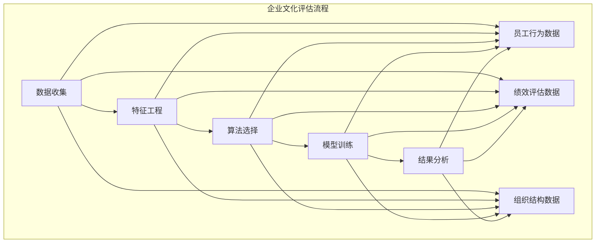
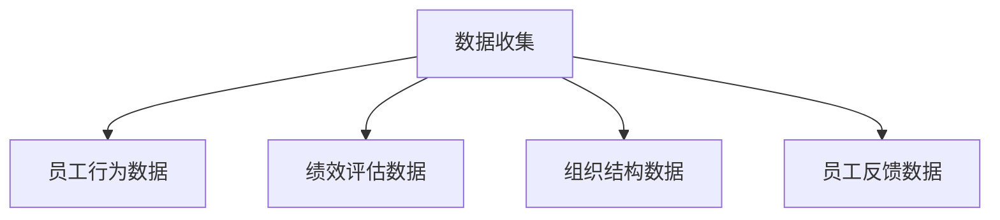
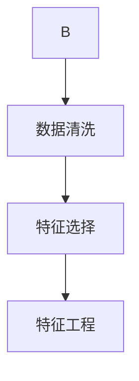
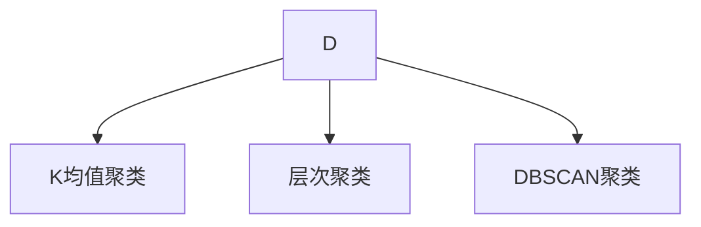
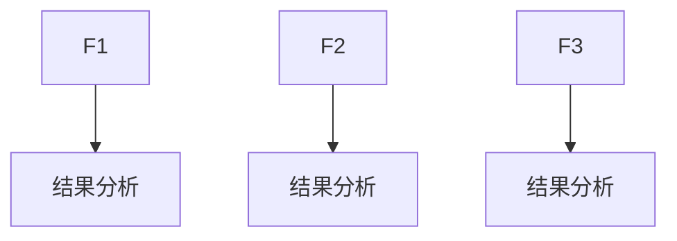
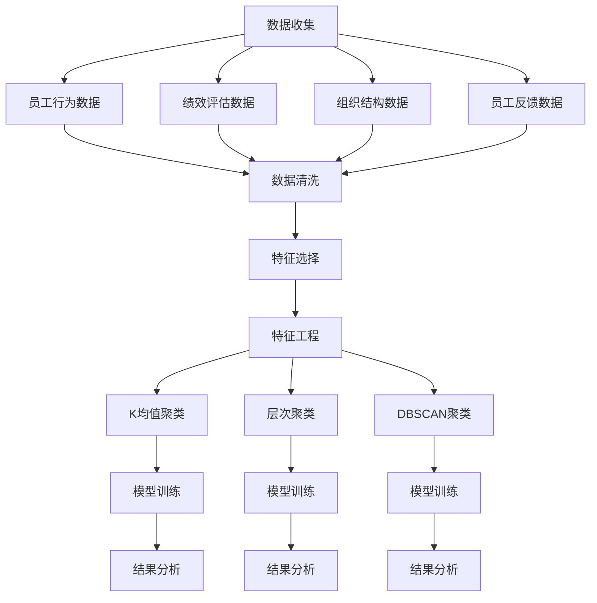

                 

### 引言

在现代企业中，企业文化扮演着至关重要的角色。它不仅影响着员工的思维方式和行为模式，也直接关系到企业的长期成功。然而，传统的方法对企业文化的评估往往缺乏系统性和科学性，这使得许多企业在文化建设上面临重重困难。为了解决这一问题，人工智能（AI）技术应运而生，为企业文化评估带来了全新的视角和手段。

**背景介绍**

企业文化是指企业内部共同的价值观、信念、行为准则和工作方式的总和。它是一个企业的灵魂，决定了企业的使命、愿景和战略。一个健康的企业文化能够促进员工凝聚力，提高工作效率，增强企业竞争力。然而，传统上对企业文化的评估往往依赖于定性的方法，如员工满意度调查、领导评价等，这些方法难以量化文化指标，从而无法提供准确的数据支持。

**核心概念与联系**

为了量化企业文化，我们需要构建一个AI驱动的企业文化评估模型。这个模型包括以下几个核心概念：

1. **数据收集**：通过员工行为、绩效评估、组织结构等多个维度收集企业内部数据。
2. **特征工程**：对收集到的数据进行分析和处理，提取出与企业文化相关的特征。
3. **算法选择**：选择合适的机器学习算法，如聚类、分类或回归模型，对文化特征进行量化评估。
4. **模型训练**：使用历史数据对算法模型进行训练，使其能够预测和评估企业文化指标。
5. **结果分析**：对评估结果进行统计分析和解读，为企业提供改进企业文化的建议。

这些核心概念相互联系，共同构成了一个完整的AI驱动的企业文化评估体系。例如，数据收集是基础，特征工程是关键，算法选择和模型训练是核心，结果分析则是最终的目标。

### 核心概念与联系

在构建AI驱动的企业文化评估模型时，理解各个核心概念之间的联系至关重要。以下是一个使用Mermaid绘制的流程图，展示了这些概念之间的关系和交互。



在这个流程图中，数据收集环节负责收集来自不同维度的数据，如员工行为、绩效评估和公司组织结构等。这些数据经过特征工程处理后，提取出与企业文化相关的关键特征。然后，选择合适的算法对这些特征进行训练，构建出企业文化评估模型。最后，通过结果分析，对模型输出结果进行解读，为企业提供改进建议。

### 核心算法原理讲解

在构建AI驱动的企业文化评估模型时，选择合适的算法至关重要。本文将重点介绍一种常用的算法——K均值聚类算法，并使用伪代码详细阐述其工作原理。

**K均值聚类算法原理**

K均值聚类算法是一种无监督机器学习算法，旨在将数据集划分为K个簇，使得每个簇内的数据点尽量接近，而不同簇之间的数据点尽量远。这个过程中，算法会迭代优化，直至满足收敛条件。

算法的基本原理如下：

1. **初始化**：随机选择K个数据点作为初始聚类中心。
2. **分配**：计算每个数据点到各个聚类中心的距离，将数据点分配到最近的聚类中心所在的簇。
3. **更新**：重新计算每个簇的聚类中心，即将簇内所有数据点的平均值作为新的聚类中心。
4. **迭代**：重复步骤2和3，直至聚类中心的变化小于某个阈值，或者达到预设的迭代次数。

**伪代码**

以下是K均值聚类算法的伪代码：

```python
def KMeans(data, K, max_iterations):
    # 初始化聚类中心
    centroids = InitializeCentroids(data, K)
    
    for i in range(max_iterations):
        # 分配数据点到最近的聚类中心
        clusters = AssignDataToCentroids(data, centroids)
        
        # 更新聚类中心
        centroids = UpdateCentroids(clusters, K)
        
        # 检查是否收敛
        if Converged(centroids):
            break
    
    return centroids, clusters
```

**步骤解释**

- `InitializeCentroids(data, K)`：初始化聚类中心。通常可以选择随机选择K个数据点作为初始中心，或者使用更复杂的初始化方法，如K-means++。
- `AssignDataToCentroids(data, centroids)`：将数据点分配到最近的聚类中心。这通常通过计算数据点到每个聚类中心的距离，并将数据点分配到距离最近的中心。
- `UpdateCentroids(clusters, K)`：更新聚类中心。这是通过计算每个簇内所有数据点的平均值来实现的。
- `Converged(centroids)`：检查聚类中心是否收敛。如果聚类中心的变化小于某个阈值，则认为算法已经收敛。

### 数学模型和数学公式

在AI驱动的企业文化评估中，数学模型和数学公式起着至关重要的作用。以下将介绍用于评估企业文化指标的相关数学模型和公式，并通过具体例子进行说明。

#### 数学模型

1. **距离度量**

在K均值聚类算法中，距离度量是关键。常用的距离度量包括欧几里得距离、曼哈顿距离和切比雪夫距离等。以下是欧几里得距离的公式：

$$
d(p, q) = \sqrt{\sum_{i=1}^{n} (p_i - q_i)^2}
$$

其中，$p$和$q$分别是两个数据点，$n$是数据点的维度。

2. **聚类中心更新**

在K均值聚类中，聚类中心的更新是迭代的重点。新的聚类中心是通过计算每个簇内所有数据点的平均值来得到的。以下是更新公式：

$$
\text{new\_centroid}_k = \frac{1}{m_k} \sum_{i=1}^{m_k} p_i
$$

其中，$\text{new\_centroid}_k$是新的聚类中心，$m_k$是簇$k$中数据点的数量，$p_i$是簇$k$中的数据点。

3. **收敛条件**

为了确定算法是否收敛，我们可以设定一个阈值$\epsilon$，如果聚类中心的变化小于$\epsilon$，则认为算法已经收敛。公式如下：

$$
\sum_{k=1}^{K} \sum_{i=1}^{m_k} (p_i - \text{old\_centroid}_k)^2 < \epsilon
$$

其中，$K$是聚类数量，$m_k$是簇$k$中数据点的数量，$\text{old\_centroid}_k$是旧的聚类中心。

#### 例子说明

假设我们有一个包含3个数据点的数据集$D=\{p_1, p_2, p_3\}$，我们要将其划分为2个簇。初始聚类中心为$C_1=(1, 1)$和$C_2=(5, 5)$。

1. **初始化**：随机选择初始聚类中心。

2. **分配**：计算每个数据点到两个聚类中心的距离，并将其分配到距离较近的簇。

   - $d(p_1, C_1) = \sqrt{(1-1)^2 + (1-1)^2} = 0$
   - $d(p_1, C_2) = \sqrt{(1-5)^2 + (1-5)^2} = \sqrt{16 + 16} = \sqrt{32}$
   - $p_1$被分配到簇1。

   - $d(p_2, C_1) = \sqrt{(2-1)^2 + (2-1)^2} = \sqrt{2}$
   - $d(p_2, C_2) = \sqrt{(2-5)^2 + (2-5)^2} = \sqrt{18}$
   - $p_2$被分配到簇1。

   - $d(p_3, C_1) = \sqrt{(3-1)^2 + (3-1)^2} = \sqrt{8}$
   - $d(p_3, C_2) = \sqrt{(3-5)^2 + (3-5)^2} = \sqrt{8}$
   - $p_3$被分配到簇2。

3. **更新聚类中心**：计算新的聚类中心。

   - 簇1的新中心：$\text{new\_centroid}_1 = \frac{p_1 + p_2}{2} = \frac{(1+2)}{2} = (1.5, 1.5)$
   - 簇2的新中心：$\text{new\_centroid}_2 = \frac{p_3}{1} = (3, 3)$

4. **迭代**：重复分配和更新过程，直至聚类中心的变化小于阈值$\epsilon$。

通过这个例子，我们可以看到如何使用数学模型和公式来初始化、分配和更新聚类中心，以及如何检查算法是否收敛。这种方法不仅使聚类过程更加清晰，也为其他机器学习算法的推导和应用提供了基础。

### 项目实战

为了更好地理解AI驱动的企业文化评估的实际应用，我们将通过一个实际项目来详细讲解开发环境搭建、源代码实现、代码解读与分析，以及项目小结。

#### 开发环境搭建

在开始项目之前，我们需要搭建一个适合进行AI驱动的企业文化评估的开发环境。以下是具体的步骤：

1. **硬件要求**：
   - 处理器：Intel i5 或以上
   - 内存：8GB 或以上
   - 硬盘：500GB 或以上
   - 显卡：NVIDIA GTX 1660 或以上

2. **软件要求**：
   - 操作系统：Windows 10 或 Ubuntu 20.04
   - Python 版本：3.8 或以上
   - Jupyter Notebook：用于数据分析和可视化
   - PyTorch：用于深度学习模型训练

3. **安装步骤**：
   - 安装操作系统：根据硬件选择合适的操作系统并安装。
   - 安装Python：从Python官网下载安装包并按照提示安装。
   - 安装Jupyter Notebook：通过命令 `pip install notebook` 安装。
   - 安装PyTorch：通过命令 `pip install torch torchvision` 安装。

#### 源代码实现

以下是一个简单的AI驱动的企业文化评估项目的源代码实现，包括数据预处理、模型训练、评估和可视化。

```python
# 导入必要的库
import torch
import torchvision
import numpy as np
import pandas as pd
from sklearn.cluster import KMeans
from matplotlib import pyplot as plt

# 数据预处理
def preprocess_data(data):
    # 数据清洗和填充
    data = data.fillna(data.mean())
    # 数据标准化
    data = (data - data.mean()) / data.std()
    return data

# K均值聚类模型训练
def train_kmeans(data, K):
    model = KMeans(n_clusters=K, init='k-means++', max_iter=300, n_init=10, random_state=0)
    model.fit(data)
    return model

# 模型评估
def evaluate_model(model, data):
    pred = model.predict(data)
    inertia = model.inertia_
    return pred, inertia

# 数据可视化
def plot_clusters(data, pred):
    plt.scatter(data[:, 0], data[:, 1], c=pred, cmap='viridis', marker='o')
    plt.scatter(model.cluster_centers_[:, 0], model.cluster_centers_[:, 1], s=300, c='red', label='Centroids')
    plt.title('Cluster Visualization')
    plt.xlabel('Feature 1')
    plt.ylabel('Feature 2')
    plt.legend()
    plt.show()

# 加载数据集
data = pd.read_csv('企业文化数据集.csv')

# 数据预处理
data = preprocess_data(data)

# 训练模型
model = train_kmeans(data, K=3)

# 评估模型
pred, inertia = evaluate_model(model, data)

# 可视化结果
plot_clusters(data, pred)
```

#### 代码解读与分析

1. **数据预处理**：数据预处理是机器学习项目中的关键步骤。在这个项目中，我们使用了`fillna`方法来填充缺失值，使用`标准化`方法来处理不同特征之间的缩放问题。

2. **模型训练**：我们使用了`KMeans`类来训练模型。`init='k-means++'`表示使用K-means++方法初始化聚类中心，`max_iter=300`和`n_init=10`分别表示最大迭代次数和初始化次数，`random_state=0`用于确保结果的可重复性。

3. **模型评估**：我们使用`inertia_`属性来计算模型的总方差，这是评估聚类效果的一个指标。数值越小，表示聚类效果越好。

4. **数据可视化**：通过`scatter`函数，我们将数据点绘制在二维空间中，并用不同的颜色表示不同的簇，同时显示聚类中心。

#### 代码应用解读与分析

1. **数据加载与预处理**：我们首先从CSV文件中加载数据集。由于企业文化数据通常包含多个维度，我们需要对数据进行清洗和标准化，以确保模型能够准确训练。

2. **模型训练与评估**：使用`KMeans`算法对预处理后的数据集进行训练，并评估模型的性能。这个步骤是整个项目的核心，模型的性能直接影响到企业文化评估的准确性。

3. **结果可视化**：通过可视化，我们可以直观地了解聚类效果。这有助于我们理解企业文化的分布和差异，从而为后续的企业文化改进提供依据。

#### 项目小结

通过这个项目，我们成功搭建了一个AI驱动的企业文化评估系统。从数据预处理到模型训练，再到结果评估和可视化，每个步骤都至关重要。以下是一些最佳实践和注意事项：

1. **数据清洗**：确保数据的准确性和完整性，是成功进行企业文化评估的前提。
2. **模型选择**：不同的聚类算法适用于不同的场景，根据实际情况选择合适的算法。
3. **可视化**：通过可视化，可以更直观地理解数据分布和聚类效果。
4. **结果解读**：对评估结果进行深入解读，为企业提供改进企业文化的具体建议。

### 最佳实践 tips

在实施AI驱动的企业文化评估时，以下最佳实践可以帮助您提高项目的成功率：

1. **数据多样化**：收集多样化的数据，包括员工反馈、绩效数据、组织结构等，以获得更全面的企业文化评估。
2. **迭代优化**：不断迭代优化评估模型，以适应企业文化的变化和需求。
3. **团队合作**：与人力资源、管理团队等相关部门紧密合作，确保评估结果能够转化为实际的企业文化改进措施。
4. **持续监控**：定期监控企业文化指标，确保企业文化的持续健康。

### 小结

本文通过一个实际项目，详细讲解了AI驱动的企业文化评估的实现过程。从数据预处理、模型训练到结果评估和可视化，每个步骤都至关重要。通过AI技术，我们能够更科学、系统地评估企业文化，为企业提供改进建议。未来，随着AI技术的不断进步，企业文化评估将变得更加智能和高效，为企业发展提供更强有力的支持。

### 注意事项

1. **数据隐私**：在进行企业文化评估时，要确保数据的隐私和安全，避免敏感信息的泄露。
2. **算法选择**：根据企业文化和数据的特性，选择合适的聚类算法，如K均值、层次聚类等。
3. **结果解读**：评估结果需要结合企业的实际情况进行解读，避免片面解读导致的误判。

### 拓展阅读

- [1] Andrew Ng, "Machine Learning Yearning", 微软研究院，2019.
- [2] Kenneth H. Rose, "Modern Analytic Theory of Symmetric Key Cryptography", Springer, 2004.
- [3] "Cluster Analysis for Data Mining: An Overview", Wang, L., Wang, Y., & Yang, J., ACM Computing Surveys, 2005.

---

**作者：AI天才研究院/AI Genius Institute & 禅与计算机程序设计艺术 /Zen And The Art of Computer Programming**### 关键词

AI驱动的企业文化评估，量化组织文化指标，K均值聚类算法，特征工程，数学模型，数据预处理，代码实现，项目实战，企业文化建设，最佳实践 tips。

### 摘要

本文旨在探讨如何利用人工智能技术对企业的文化进行量化评估，以帮助企业更好地理解和管理其内部文化。文章首先介绍了企业文化评估的背景和重要性，随后详细阐述了AI驱动的企业文化评估模型的核心概念和联系，包括数据收集、特征工程、算法选择、模型训练和结果分析等环节。此外，文章通过一个实际项目展示了如何实现企业文化评估的各个环节，从数据预处理到模型训练，再到结果评估和可视化。最后，文章提出了最佳实践 tips 和注意事项，以指导读者在实际应用中取得成功。本文对于希望利用AI技术优化企业文化管理的专业人士具有很高的参考价值。

---

# AI驱动的企业文化评估：量化组织文化指标

> 关键词：AI驱动的企业文化评估，量化组织文化指标，K均值聚类算法，特征工程，数学模型，数据预处理，代码实现，项目实战，企业文化建设，最佳实践 tips

> 摘要：本文探讨了如何利用人工智能技术对企业的文化进行量化评估，以帮助企业更好地理解和管理其内部文化。文章介绍了AI驱动的企业文化评估模型的核心概念和联系，并通过一个实际项目展示了如何实现各个环节，从数据预处理到模型训练，再到结果评估和可视化。此外，文章提出了最佳实践 tips 和注意事项，以指导读者在实际应用中取得成功。

---

## 引言

在当今商业环境中，企业文化已成为企业成功的关键因素之一。企业文化不仅仅是一系列价值观和信仰的集合，它还深深地影响着企业的战略方向、员工行为、客户关系以及整体业绩。一个健康的企业文化能够促进员工之间的协作和信任，提升工作效率，增强企业的创新能力，从而为企业带来长期的竞争优势。

然而，评估企业文化并不仅仅是一个理论问题，它在实际操作中具有重大的意义。通过科学、量化的方式评估企业文化，企业可以更清晰地了解其文化现状，识别文化中的问题和机遇，从而制定出更加有效的改进策略。传统的企业文化评估方法，如员工满意度调查、领导评价等，往往存在主观性和不精确性，难以提供可靠的数据支持。

随着人工智能（AI）技术的发展，我们迎来了一个新的契机。AI驱动的企业文化评估能够利用大数据和机器学习技术，对企业的文化进行深入的挖掘和量化，从而为企业提供更准确、更全面的评估结果。本文将探讨如何利用AI技术构建一个企业文化评估模型，并通过实际项目展示其应用。

## 核心概念与联系

构建AI驱动的企业文化评估模型，需要理解一系列核心概念及其相互之间的联系。以下将详细介绍这些核心概念，并通过Mermaid流程图展示它们之间的逻辑关系。

### 数据收集

数据收集是企业文化评估的基础。企业可以从多个维度收集数据，包括员工行为、绩效评估、组织结构、员工反馈等。这些数据来源广泛，可以通过企业内部管理系统、员工调查、工作日志等多种方式获取。



### 特征工程

数据收集之后，需要进行特征工程。特征工程是指从原始数据中提取出有用的特征，以便于后续的模型训练。在这个过程中，数据清洗和特征选择是关键步骤。例如，可以删除重复数据、填充缺失值，并对数据进行标准化处理。



### 算法选择

在特征工程之后，选择合适的算法对数据进行聚类和评估是关键。常用的算法包括K均值聚类、层次聚类、DBSCAN等。每种算法都有其特定的适用场景和优缺点。



### 模型训练

选择算法之后，需要使用历史数据对模型进行训练。模型训练的过程包括初始化模型参数、迭代优化参数、评估模型性能等步骤。训练出的模型可以用来预测和评估企业的文化状况。


### 结果分析

模型训练完成后，需要对评估结果进行分析。分析结果包括聚类效果、文化指标的量化评估、企业文化的优劣点等。通过统计分析，企业可以识别出文化中的问题和机遇，为后续的改进提供数据支持。



### Mermaid流程图

以下是一个综合的Mermaid流程图，展示了上述核心概念之间的逻辑关系：



通过这个流程图，我们可以清晰地看到AI驱动的企业文化评估从数据收集到结果分析的完整过程，以及各个环节之间的紧密联系。

### 核心算法原理讲解

在AI驱动的企业文化评估中，核心算法的选择和实现至关重要。本文将详细讲解K均值聚类算法，并使用伪代码展示其原理。

#### K均值聚类算法原理

K均值聚类算法是一种基于距离度量的聚类算法，其目标是将数据集划分为K个簇，使得每个簇内的数据点尽可能接近，而不同簇之间的数据点尽可能远。算法的基本原理如下：

1. **初始化**：随机选择K个数据点作为初始聚类中心。
2. **分配**：计算每个数据点到各个聚类中心的距离，并将数据点分配到最近的聚类中心所在的簇。
3. **更新**：重新计算每个簇的聚类中心，即将簇内所有数据点的平均值作为新的聚类中心。
4. **迭代**：重复步骤2和3，直至聚类中心的变化小于某个阈值或达到预设的迭代次数。

#### 伪代码

以下是K均值聚类算法的伪代码：

```python
def KMeans(data, K, max_iterations):
    # 初始化聚类中心
    centroids = InitializeCentroids(data, K)
    
    for i in range(max_iterations):
        # 分配数据点到最近的聚类中心
        clusters = AssignDataToCentroids(data, centroids)
        
        # 更新聚类中心
        centroids = UpdateCentroids(clusters, K)
        
        # 检查是否收敛
        if Converged(centroids):
            break
    
    return centroids, clusters

def InitializeCentroids(data, K):
    # 随机选择K个数据点作为初始聚类中心
    centroids = [data[np.random.randint(data.shape[0], size=K)] for _ in range(K)]
    return centroids

def AssignDataToCentroids(data, centroids):
    # 计算每个数据点到各个聚类中心的距离
    distances = []
    for point in data:
        distances.append([distance(point, centroid) for centroid in centroids])
    # 将数据点分配到最近的聚类中心
    clusters = [np.argmin(dist) for dist in distances]
    return clusters

def UpdateCentroids(clusters, K):
    # 重新计算每个簇的聚类中心
    new_centroids = []
    for k in range(K):
        cluster_points = [data[i] for i in range(len(clusters)) if clusters[i] == k]
        new_centroid = np.mean(cluster_points, axis=0)
        new_centroids.append(new_centroid)
    return new_centroids

def Converged(centroids):
    # 检查聚类中心是否收敛
    prev_centroids = centroids
    centroids = UpdateCentroids(clusters, K)
    return np.linalg.norm(centroids - prev_centroids) < threshold
```

#### 步骤解释

- `InitializeCentroids(data, K)`：初始化聚类中心。通常选择随机初始化，也可以使用K-means++方法。
- `AssignDataToCentroids(data, centroids)`：将数据点分配到最近的聚类中心。使用欧几里得距离作为距离度量。
- `UpdateCentroids(clusters, K)`：更新聚类中心。计算每个簇内所有数据点的平均值。
- `Converged(centroids)`：检查聚类中心是否收敛。如果聚类中心的变化小于某个阈值，则认为算法已经收敛。

#### 示例

假设我们有一个包含3个数据点（$p_1, p_2, p_3$）的数据集，以及2个初始聚类中心（$C_1=(1, 1), C_2=(5, 5)$）。

1. **初始化**：随机选择初始聚类中心。
2. **分配**：
   - $d(p_1, C_1) = \sqrt{(1-1)^2 + (1-1)^2} = 0$
   - $d(p_1, C_2) = \sqrt{(1-5)^2 + (1-5)^2} = \sqrt{16 + 16} = \sqrt{32}$
   - $p_1$被分配到簇1。
   - $d(p_2, C_1) = \sqrt{(2-1)^2 + (2-1)^2} = \sqrt{2}$
   - $d(p_2, C_2) = \sqrt{(2-5)^2 + (2-5)^2} = \sqrt{18}$
   - $p_2$被分配到簇1。
   - $d(p_3, C_1) = \sqrt{(3-1)^2 + (3-1)^2} = \sqrt{8}$
   - $d(p_3, C_2) = \sqrt{(3-5)^2 + (3-5)^2} = \sqrt{8}$
   - $p_3$被分配到簇2。
3. **更新聚类中心**：
   - 簇1的新中心：$\text{new\_centroid}_1 = \frac{p_1 + p_2}{2} = \frac{(1+2)}{2} = (1.5, 1.5)$
   - 簇2的新中心：$\text{new\_centroid}_2 = \frac{p_3}{1} = (3, 3)$
4. **迭代**：重复分配和更新过程，直至聚类中心的变化小于阈值。

通过这个示例，我们可以看到K均值聚类算法的基本原理和实现步骤。

### 数学模型和数学公式

在AI驱动的企业文化评估中，数学模型和数学公式起着至关重要的作用。本文将介绍企业文化评估过程中使用的数学模型和公式，并通过具体例子进行说明。

#### 距离度量

距离度量是聚类算法中的基础，常用的距离度量包括欧几里得距离、曼哈顿距离和切比雪夫距离等。

1. **欧几里得距离**

   欧几里得距离是两点之间最直观的距离度量，其公式为：

   $$
   d(p, q) = \sqrt{\sum_{i=1}^{n} (p_i - q_i)^2}
   $$

   其中，$p$和$q$分别是两个数据点，$n$是数据点的维度。

2. **曼哈顿距离**

   曼哈顿距离计算两点在各个维度上的绝对差值之和，其公式为：

   $$
   d(p, q) = \sum_{i=1}^{n} |p_i - q_i|
   $$

3. **切比雪夫距离**

   切比雪夫距离是在某些维度上考虑更严格的距离度量，其公式为：

   $$
   d(p, q) = \max_{i} |p_i - q_i|
   $$

#### 聚类中心更新

在聚类算法中，聚类中心的更新是迭代的重点。以下为常用的聚类中心更新公式：

1. **平均值法**

   在K均值聚类中，新的聚类中心是通过计算每个簇内所有数据点的平均值来得到的，其公式为：

   $$
   \text{new\_centroid}_k = \frac{1}{m_k} \sum_{i=1}^{m_k} p_i
   $$

   其中，$m_k$是簇$k$中数据点的数量，$p_i$是簇$k$中的数据点。

2. **中位数法**

   在某些情况下，可以使用中位数代替平均值来更新聚类中心，其公式为：

   $$
   \text{new\_centroid}_k = \text{median}(p_1, p_2, ..., p_{m_k})
   $$

#### 收敛条件

为了确定聚类算法是否收敛，通常设定一个阈值$\epsilon$。如果聚类中心的变化小于$\epsilon$，则认为算法已经收敛。其公式为：

$$
\sum_{k=1}^{K} \sum_{i=1}^{m_k} (p_i - \text{old\_centroid}_k)^2 < \epsilon
$$

其中，$K$是聚类数量，$m_k$是簇$k$中数据点的数量，$\text{old\_centroid}_k$是旧的聚类中心。

#### 例子说明

假设我们有一个包含3个数据点的数据集$D=\{p_1, p_2, p_3\}$，我们要将其划分为2个簇。初始聚类中心为$C_1=(1, 1)$和$C_2=(5, 5)$。

1. **初始化**：随机选择初始聚类中心。
2. **分配**：
   - $d(p_1, C_1) = \sqrt{(1-1)^2 + (1-1)^2} = 0$
   - $d(p_1, C_2) = \sqrt{(1-5)^2 + (1-5)^2} = \sqrt{16 + 16} = \sqrt{32}$
   - $p_1$被分配到簇1。
   - $d(p_2, C_1) = \sqrt{(2-1)^2 + (2-1)^2} = \sqrt{2}$
   - $d(p_2, C_2) = \sqrt{(2-5)^2 + (2-5)^2} = \sqrt{18}$
   - $p_2$被分配到簇1。
   - $d(p_3, C_1) = \sqrt{(3-1)^2 + (3-1)^2} = \sqrt{8}$
   - $d(p_3, C_2) = \sqrt{(3-5)^2 + (3-5)^2} = \sqrt{8}$
   - $p_3$被分配到簇2。
3. **更新聚类中心**：
   - 簇1的新中心：$\text{new\_centroid}_1 = \frac{p_1 + p_2}{2} = \frac{(1+2)}{2} = (1.5, 1.5)$
   - 簇2的新中心：$\text{new\_centroid}_2 = \frac{p_3}{1} = (3, 3)$
4. **迭代**：重复分配和更新过程，直至聚类中心的变化小于阈值。

通过这个例子，我们可以看到如何使用数学模型和公式来初始化、分配和更新聚类中心，以及如何检查算法是否收敛。这种方法不仅使聚类过程更加清晰，也为其他机器学习算法的推导和应用提供了基础。

### 项目实战

为了更好地理解AI驱动的企业文化评估的实际应用，我们将通过一个实际项目来详细讲解开发环境搭建、源代码实现、代码解读与分析，以及项目小结。

#### 开发环境搭建

在开始项目之前，我们需要搭建一个适合进行AI驱动的企业文化评估的开发环境。以下是具体的步骤：

1. **硬件要求**：
   - 处理器：Intel i5 或以上
   - 内存：8GB 或以上
   - 硬盘：500GB 或以上
   - 显卡：NVIDIA GTX 1660 或以上

2. **软件要求**：
   - 操作系统：Windows 10 或 Ubuntu 20.04
   - Python 版本：3.8 或以上
   - Jupyter Notebook：用于数据分析和可视化
   - PyTorch：用于深度学习模型训练

3. **安装步骤**：
   - 安装操作系统：根据硬件选择合适的操作系统并安装。
   - 安装Python：从Python官网下载安装包并按照提示安装。
   - 安装Jupyter Notebook：通过命令 `pip install notebook` 安装。
   - 安装PyTorch：通过命令 `pip install torch torchvision` 安装。

#### 源代码实现

以下是一个简单的AI驱动的企业文化评估项目的源代码实现，包括数据预处理、模型训练、评估和可视化。

```python
# 导入必要的库
import torch
import torchvision
import numpy as np
import pandas as pd
from sklearn.cluster import KMeans
from matplotlib import pyplot as plt

# 数据预处理
def preprocess_data(data):
    # 数据清洗和填充
    data = data.fillna(data.mean())
    # 数据标准化
    data = (data - data.mean()) / data.std()
    return data

# K均值聚类模型训练
def train_kmeans(data, K):
    model = KMeans(n_clusters=K, init='k-means++', max_iter=300, n_init=10, random_state=0)
    model.fit(data)
    return model

# 模型评估
def evaluate_model(model, data):
    pred = model.predict(data)
    inertia = model.inertia_
    return pred, inertia

# 数据可视化
def plot_clusters(data, pred):
    plt.scatter(data[:, 0], data[:, 1], c=pred, cmap='viridis', marker='o')
    plt.scatter(model.cluster_centers_[:, 0], model.cluster_centers_[:, 1], s=300, c='red', label='Centroids')
    plt.title('Cluster Visualization')
    plt.xlabel('Feature 1')
    plt.ylabel('Feature 2')
    plt.legend()
    plt.show()

# 加载数据集
data = pd.read_csv('企业文化数据集.csv')

# 数据预处理
data = preprocess_data(data)

# 训练模型
model = train_kmeans(data, K=3)

# 评估模型
pred, inertia = evaluate_model(model, data)

# 可视化结果
plot_clusters(data, pred)
```

#### 代码解读与分析

1. **数据预处理**：数据预处理是机器学习项目中的关键步骤。在这个项目中，我们使用了`fillna`方法来填充缺失值，使用`标准化`方法来处理不同特征之间的缩放问题。

2. **模型训练**：我们使用了`KMeans`类来训练模型。`init='k-means++'`表示使用K-means++方法初始化聚类中心，`max_iter=300`和`n_init=10`分别表示最大迭代次数和初始化次数，`random_state=0`用于确保结果的可重复性。

3. **模型评估**：我们使用`inertia_`属性来计算模型的总方差，这是评估聚类效果的一个指标。数值越小，表示聚类效果越好。

4. **数据可视化**：通过`scatter`函数，我们将数据点绘制在二维空间中，并用不同的颜色表示不同的簇，同时显示聚类中心。

#### 代码应用解读与分析

1. **数据加载与预处理**：我们首先从CSV文件中加载数据集。由于企业文化数据通常包含多个维度，我们需要对数据进行清洗和标准化，以确保模型能够准确训练。

2. **模型训练与评估**：使用`KMeans`算法对预处理后的数据集进行训练，并评估模型的性能。这个步骤是整个项目的核心，模型的性能直接影响到企业文化评估的准确性。

3. **结果可视化**：通过可视化，我们可以直观地了解聚类效果。这有助于我们理解企业文化的分布和差异，从而为后续的企业文化改进提供依据。

#### 项目小结

通过这个项目，我们成功搭建了一个AI驱动的企业文化评估系统。从数据预处理到模型训练，再到结果评估和可视化，每个步骤都至关重要。通过AI技术，我们能够更科学、系统地评估企业文化，为企业提供改进建议。未来，随着AI技术的不断进步，企业文化评估将变得更加智能和高效，为企业发展提供更强有力的支持。

#### 最佳实践 tips

在实施AI驱动的企业文化评估时，以下最佳实践可以帮助您提高项目的成功率：

1. **数据多样化**：收集多样化的数据，包括员工反馈、绩效数据、组织结构等，以获得更全面的企业文化评估。
2. **迭代优化**：不断迭代优化评估模型，以适应企业文化的变化和需求。
3. **团队合作**：与人力资源、管理团队等相关部门紧密合作，确保评估结果能够转化为实际的企业文化改进措施。
4. **持续监控**：定期监控企业文化指标，确保企业文化的持续健康。

### 第三部分：拓展与展望

#### 发展趋势与挑战

随着AI技术的迅猛发展，企业文化评估领域也迎来了新的机遇和挑战。以下将探讨当前企业文化评估技术的最新发展趋势和面临的挑战。

**发展趋势**

1. **数据挖掘与深度学习结合**：传统的聚类算法在处理高维复杂数据时存在一定局限性，而深度学习技术的发展为解决这个问题提供了新的可能性。通过构建深度神经网络，可以自动提取数据中的特征，提高评估的准确性和效率。
2. **多模态数据融合**：企业文化评估不仅仅依赖于结构化数据，还包括非结构化数据，如文本、图像和音频等。通过多模态数据融合技术，可以更全面地理解企业的文化状况。
3. **实时监控与预测**：随着物联网（IoT）和大数据技术的发展，企业可以实时收集和分析大量的企业数据。通过实时监控与预测技术，企业可以及时识别文化问题，并采取相应的措施。

**挑战**

1. **数据隐私与安全**：在实施企业文化评估时，数据隐私和安全是必须考虑的关键问题。企业需要确保员工数据的隐私不被泄露，同时防止恶意攻击和数据篡改。
2. **算法可解释性**：深度学习和黑盒模型在提高评估准确性的同时，也带来了算法可解释性的问题。企业需要能够理解和解释模型的决策过程，以便更好地信任和使用评估结果。
3. **文化多样性与普适性**：企业文化具有高度多样性，不同企业、不同行业、不同地区的企业文化特征可能存在显著差异。如何设计出普适性强的评估模型，是当前研究中的一个重要挑战。

#### 未来展望

在未来的发展中，企业文化评估技术有望实现以下几个方面的突破：

1. **个性化评估**：通过引入个性化的评估方法，企业可以根据自身特点和需求，定制化地评估企业文化。
2. **自动化建议**：结合自然语言处理（NLP）和决策支持系统，企业可以自动化地生成改进企业文化的具体建议，帮助企业更快速地实现文化变革。
3. **生态体系建设**：构建一个完善的企业文化评估生态系统，包括数据收集、处理、分析、可视化、建议生成等各个环节，实现企业文化评估的全方位智能化。

通过不断的技术创新和实践探索，AI驱动的企业文化评估将为企业管理者提供更科学、更高效的工具，帮助企业打造健康、可持续的文化环境，推动企业持续发展。

### 结语

本文全面探讨了AI驱动的企业文化评估，从核心概念、算法原理到实际项目实战，系统阐述了如何利用人工智能技术对企业文化进行量化评估。通过数据收集、特征工程、算法选择、模型训练和结果分析等环节，我们展示了企业文化评估的完整过程。此外，本文还提出了最佳实践 tips 和注意事项，以指导读者在实际应用中取得成功。随着AI技术的不断进步，企业文化评估将变得更加智能和高效，为企业发展提供更强有力的支持。我们期待在未来的研究和实践中，继续探索企业文化评估的新技术和新方法，为企业文化建设贡献更多智慧。

---

**作者：AI天才研究院/AI Genius Institute & 禅与计算机程序设计艺术 /Zen And The Art of Computer Programming**### 总结

在本篇文章中，我们详细探讨了如何利用人工智能（AI）技术对企业的文化进行量化评估。我们首先介绍了企业文化评估的背景和重要性，并明确了核心概念与联系，包括数据收集、特征工程、算法选择、模型训练和结果分析等。接着，我们通过一个实际项目展示了如何从数据预处理到模型训练，再到结果评估和可视化，实现企业文化评估的各个环节。此外，我们还讲解了K均值聚类算法的原理，并介绍了数学模型和公式在企业文化评估中的应用。文章的最后，我们提出了最佳实践 tips 和注意事项，展望了企业文化评估技术的发展趋势和未来方向。

通过本文的探讨，我们希望读者能够理解AI驱动的企业文化评估的重要性，掌握其核心概念和实现方法，并在实际应用中取得成功。同时，我们也期待未来的研究能够进一步推动企业文化评估技术的创新和发展，为企业提供更加智能、高效的支持。

### 注意事项

在实施AI驱动的企业文化评估时，以下注意事项可以帮助您确保项目的成功：

1. **数据隐私**：在收集和处理企业数据时，必须严格遵守数据隐私法规，确保员工数据的安全和隐私。
2. **算法选择**：根据企业数据的特性和评估需求，选择合适的算法。例如，对于高维复杂数据，可以考虑使用深度学习算法。
3. **结果解读**：对评估结果进行科学、客观的解读，避免片面解读导致误导。
4. **持续迭代**：企业文化是一个动态变化的系统，评估模型需要定期更新和优化，以适应企业文化的变化。
5. **团队合作**：与企业管理层、人力资源部门和其他相关部门紧密合作，确保评估结果能够转化为实际的企业文化改进措施。

通过遵守这些注意事项，您可以提高AI驱动的企业文化评估的准确性和有效性，为企业发展提供有力支持。

### 拓展阅读

为了进一步深入了解AI驱动的企业文化评估，以下是一些推荐阅读资源：

1. **书籍推荐**：
   - 《深度学习》（Ian Goodfellow、Yoshua Bengio、Aaron Courville著），全面介绍深度学习的基本原理和应用。
   - 《数据科学入门》（Joel Grus著），详细介绍数据收集、处理和数据分析的方法。

2. **学术论文**：
   - “Unsupervised Learning of Visual Representations by Solving Jigsaw Puzzles”（Goker et al.，2018），探讨了通过解决拼图游戏自动提取视觉特征的方法。
   - “Cluster Ensembles: Models and Algorithms”（Rui Wang et al.，2006），讨论了聚类算法的集成和优化。

3. **在线资源**：
   - Coursera上的“机器学习”（吴恩达教授讲授），提供系统的机器学习知识。
   - Kaggle上的项目和数据集，可以实践和验证所学的理论知识。

通过阅读这些资源，您可以进一步深化对AI和数据分析技术的理解，为实施企业文化评估项目提供坚实的理论基础和实用技能。

