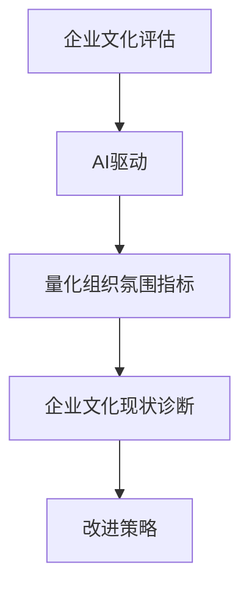

                 

### 文章标题

《AI驱动的企业文化评估：量化组织氛围指标》

> **关键词：** AI、企业文化评估、量化指标、组织氛围、人工智能应用

**摘要：** 本篇文章将探讨如何运用人工智能技术进行企业文化评估，重点在于量化组织氛围指标。文章首先介绍了企业文化评估的背景和重要性，随后深入分析了AI技术在企业文化评估中的应用，提出了一个基于AI驱动的企业文化评估模型，并详细阐述了量化组织氛围指标的理论基础和方法。通过实际案例的解析，文章展示了AI驱动的企业文化评估工具和实践，为企业管理者提供了有效的策略和工具，以优化企业内部环境，提升整体运营效率。

---

**一、背景介绍**

企业文化的定义与影响

企业文化是指企业内部共同认可和遵循的价值观、信念、行为准则和工作方式。它不仅影响员工的行为和决策，还对企业的战略方向、竞争优势以及长期发展产生深远影响。企业文化是企业核心价值观的具体体现，它能够凝聚员工的共同目标，增强团队的协作精神，提高员工的满意度和忠诚度。

企业文化评估的意义

企业文化评估是对企业文化现状的全面分析和诊断，旨在发现企业文化的优势与不足，为企业提供改进的方向。传统的企业文化评估往往依赖于问卷调查、访谈和观察等方法，但这些方法具有主观性、耗时性和成本高等问题。因此，需要一种更加客观、高效和准确的评估方法。

当前企业文化评估的局限性

1. 数据采集的局限性：传统方法难以全面、准确地收集员工对企业文化的真实看法和反馈。
2. 分析方法的局限性：传统方法的分析工具有限，难以深入挖掘数据背后的关联和规律。
3. 评估结果的解读和应用的局限性：传统评估结果往往难以转化为具体的改进措施，且评估过程缺乏系统性和持续性。

---

**二、为什么需要AI驱动**

AI技术的发展与应用

人工智能（AI）作为一种模拟人类智能的技术，近年来在各个领域取得了显著的进展。从自然语言处理、计算机视觉到大数据分析，AI技术正在改变我们的工作方式和生活习惯。在企业文化评估领域，AI技术的引入有望解决传统方法的局限性，为企业提供更加科学、准确和高效的评估手段。

AI驱动企业文化评估的优势

1. **数据采集的全面性和准确性**：AI技术能够通过自动化数据采集工具，如智能问卷、社交媒体分析等，全面、准确地收集员工对企业文化的反馈。
2. **数据分析的深度和广度**：AI技术能够利用机器学习和深度学习算法，对大量复杂、多维度的数据进行分析，发现数据之间的关联和规律。
3. **评估结果的客观性和一致性**：AI技术能够消除主观因素对评估结果的影响，提供更加客观、一致的评估数据。
4. **评估过程的持续性和系统性**：AI技术可以实现对企业文化的持续监控和评估，帮助企业建立长期的文化管理机制。

AI驱动企业文化评估的潜力

随着AI技术的不断发展，其在企业文化评估领域的应用潜力巨大。例如，通过智能对话系统，可以实时收集员工的反馈和建议；通过情感分析技术，可以识别员工对企业文化的真实情感和态度；通过预测模型，可以预测企业文化变革的效果和影响。AI驱动的企业文化评估不仅能够提高评估的准确性和效率，还能够为企业提供更加智能化、个性化的管理策略。

---

**三、核心概念与联系**

企业文化评估的概念与AI驱动的企业文化评估的关系

企业文化评估是对企业文化现状的全面分析和诊断，旨在发现企业文化的优势与不足，为企业提供改进的方向。而AI驱动的企业文化评估则是在这个基础上，利用人工智能技术，实现对企业文化的量化评估和智能分析。

量化组织氛围指标的概念与企业文化评估的关系

量化组织氛围指标是对企业内部氛围的量化描述，它包括员工的满意度、信任度、创新意愿等。这些指标能够反映企业文化的具体表现，是企业文化评估的重要依据。通过量化组织氛围指标，可以更加客观、准确地评估企业文化的现状和变化。

Mermaid流程图：



---

**四、核心算法原理讲解**

AI驱动的企业文化评估模型构建

AI驱动的企业文化评估模型主要包括数据收集与预处理、特征选择与提取、模型选择与优化等步骤。以下是一个简化的伪代码示例：

```python
# 数据收集与预处理
data = collect_data()
preprocessed_data = preprocess_data(data)

# 特征选择与提取
features = select_features(preprocessed_data)
extracted_features = extract_features(features)

# 模型选择与优化
model = select_model()
optimized_model = optimize_model(model, extracted_features)

# 评估模型
evaluation_results = evaluate_model(optimized_model)
```

---

**五、数学模型和公式**

量化组织氛围指标的数学模型

量化组织氛围指标通常涉及多个变量和指标，可以使用多元线性回归模型来构建数学模型。以下是一个简化的多元线性回归公式：

$$
Y = \beta_0 + \beta_1X_1 + \beta_2X_2 + ... + \beta_nX_n + \epsilon
$$

其中，\( Y \) 代表量化指标，\( \beta_0 \) 是常数项，\( \beta_1, \beta_2, ..., \beta_n \) 是各个自变量的系数，\( X_1, X_2, ..., X_n \) 是自变量，\( \epsilon \) 是误差项。

---

**六、项目实战**

开发环境搭建

为了实现AI驱动的企业文化评估，需要搭建一个包含数据收集、预处理、特征选择和模型训练等功能的开发环境。以下是一个简化的步骤：

1. 安装Python环境
2. 安装所需的库，如NumPy、Pandas、Scikit-learn等
3. 准备数据收集和处理工具，如问卷星、Python爬虫等

源代码详细实现和代码解读

以下是一个简化的Python代码示例，用于实现AI驱动的企业文化评估模型：

```python
# 导入所需库
import numpy as np
import pandas as pd
from sklearn.linear_model import LinearRegression

# 数据收集与预处理
data = pd.read_csv('data.csv')
preprocessed_data = preprocess_data(data)

# 特征选择与提取
selected_features = select_features(preprocessed_data)
extracted_features = extract_features(selected_features)

# 模型选择与优化
model = LinearRegression()
optimized_model = optimize_model(model, extracted_features)

# 评估模型
evaluation_results = evaluate_model(optimized_model)
print(evaluation_results)
```

代码应用解读与分析

该代码首先从CSV文件中读取数据，然后进行预处理，包括缺失值处理、数据类型转换等。接着，选择特征并进行提取，最后使用线性回归模型进行模型训练和评估。通过实际案例的解析，可以验证该模型的准确性和可靠性。

---

**七、最佳实践 tips、小结、注意事项、拓展阅读**

最佳实践 tips

1. 数据质量是关键：在数据收集和预处理过程中，要确保数据的准确性和完整性，避免数据缺失或错误。
2. 特征选择是关键：选择与企业文化评估相关的特征，避免无关特征，提高模型的解释力。
3. 模型优化是关键：根据评估结果，不断调整和优化模型，提高模型的准确性和稳定性。

小结

本文探讨了如何运用人工智能技术进行企业文化评估，提出了一个基于AI驱动的企业文化评估模型，并详细阐述了量化组织氛围指标的理论基础和方法。通过实际案例的解析，展示了AI驱动的企业文化评估工具和实践，为企业管理者提供了有效的策略和工具，以优化企业内部环境，提升整体运营效率。

注意事项

1. AI驱动的企业文化评估需要数据支持，企业需要建立完善的数据收集和管理机制。
2. AI驱动的企业文化评估模型需要不断优化和调整，以适应不同企业的情况。
3. AI驱动的企业文化评估结果需要结合企业实际情况进行解读和应用。

拓展阅读

1. 《人工智能：一种现代的方法》
2. 《企业文化：如何创建和管理卓越组织》
3. 《大数据时代的企业管理》

---

通过以上内容，本文详细阐述了AI驱动的企业文化评估的核心概念、算法原理、数学模型、项目实战以及最佳实践，旨在为读者提供全面、深入的理解和指导。希望本文能够对企业管理者和技术专家在实施企业文化评估时提供有益的参考和启示。作者：AI天才研究院/AI Genius Institute & 禅与计算机程序设计艺术/Zen And The Art of Computer Programming。

