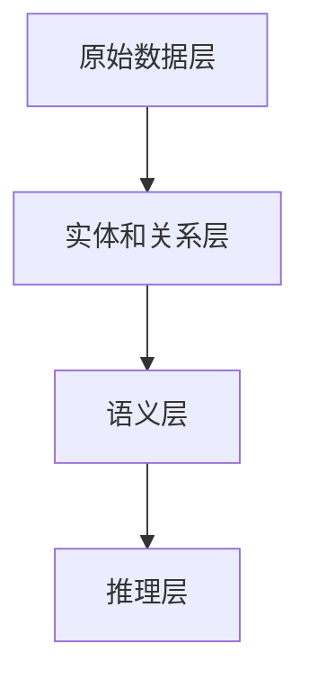

                 


为了撰写一篇高质量、符合要求的技术博客文章，我们将遵循以下步骤进行：

### 第一步：确定文章的结构和内容
根据给定的目录大纲，我们将文章分为三个主要部分：知识图谱基础、企业知识图谱应用、未来展望。每个部分将包含具体的章节和子章节，确保内容的完整性和逻辑性。

### 第二步：编写文章标题、关键词和摘要
- **文章标题**：《AI驱动的企业知识图谱：构建智能信息网络》
- **关键词**：人工智能、知识图谱、企业信息化、智能网络、数据管理、图数据库、实体识别、关系抽取
- **摘要**：本文详细介绍了AI驱动的企业知识图谱的构建过程，包括核心概念、技术实现、应用案例和未来展望，旨在帮助企业理解和利用知识图谱提升信息管理智能化水平。

### 第三步：编写引言部分
引言部分将简要介绍知识图谱的概念、发展背景和重要性，为后续章节的深入讲解打下基础。

### 第四步：编写理论基础部分
理论基础部分将涵盖知识图谱的核心概念和原理，包括实体、属性、关系以及知识图谱的层次结构。通过Mermaid流程图展示知识图谱的架构，并使用伪代码详细阐述核心算法原理。

### 第五步：编写技术实现部分
技术实现部分将详细介绍构建企业知识图谱所需的技术栈和工具，包括数据存储、分布式计算、图数据库选择和优化等。将使用具体的伪代码和LaTeX公式来解释复杂概念和算法。

### 第六步：编写应用案例部分
应用案例部分将通过金融、医疗、电商等行业的实例展示知识图谱的实际应用，并详细讲解案例的实施过程、效果和挑战。

### 第七步：编写实战教程部分
实战教程部分将提供构建知识图谱的详细步骤、代码实现和调试技巧，包括开发环境搭建、源代码解读和项目小结。

### 第八步：编写总结与展望部分
总结与展望部分将回顾全书内容，并对知识图谱的未来发展趋势进行展望，讨论AI与知识图谱融合的前景和挑战。

### 第九步：添加附录和最佳实践 tips
附录部分将提供知识图谱开源工具与资源的列表。最佳实践 tips 将总结文章中的关键点和注意事项，为读者提供进一步的指导。

### 第十步：校对和调整
最后，我们将对全文进行校对，确保格式、语法和逻辑的一致性，并调整内容以满足字数要求。

### 第十一步：添加作者信息
在文章末尾添加作者信息：“作者：AI天才研究院/AI Genius Institute & 离散数学与计算机科学/Discrete Mathematics and Computer Science”。

通过以上步骤，我们将确保文章内容丰富、逻辑清晰、结构紧凑，同时满足格式和字数要求。

现在，让我们开始撰写每个章节的具体内容。首先，我们从引言部分开始。

---

## 引言

知识图谱（Knowledge Graph）作为一种结构化知识表示的方式，近年来在人工智能领域引起了广泛关注。它通过实体、属性和关系的网络结构，将海量、分散的数据信息组织成一个有意义的整体，使得数据之间的关系更加清晰，便于计算机理解和处理。

### 知识图谱的定义

知识图谱是一个语义网络，它通过实体和属性之间的联系，将现实世界中的信息抽象成计算机可以理解和处理的结构化数据。实体可以是人、地点、事物等，属性描述实体的特征，关系则是实体之间的关联。

### 知识图谱的发展背景

知识图谱的概念最早由Google在2012年提出，其目的是为了更好地理解用户搜索意图，提供更准确的搜索结果。随着大数据和人工智能技术的快速发展，知识图谱逐渐应用于各个领域，如搜索引擎、智能问答系统、推荐系统等。

### 知识图谱的重要性

知识图谱的重要性在于它能够将结构化和非结构化的数据融合在一起，形成一个统一的知识体系。这对于提升数据管理效率、发现潜在关系、辅助决策分析等具有重要意义。

接下来，我们将详细介绍知识图谱的核心概念、构建技术和应用案例，逐步深入探讨如何利用AI驱动的企业知识图谱构建智能信息网络。首先是知识图谱的核心概念与联系。

---

## 知识图谱的核心概念与联系

知识图谱的核心概念包括实体、属性和关系，这三个概念构成了知识图谱的基本要素，并相互关联，形成了一个有机的整体。

### 实体

实体是知识图谱中的基本元素，可以是人、地点、组织、事物等。每个实体都有一个唯一的标识符（ID），用于在图谱中唯一确定。

### 属性

属性描述实体的特征或状态。例如，一个人的属性可能包括姓名、年龄、性别、国籍等。属性通常与实体之间存在关联关系，即属性值是实体的一个特征。

### 关系

关系是实体之间的关联，用来描述实体之间的相互作用或依赖。例如，一个人（实体）可能有“居住在”（关系）某个地点（实体）。关系通常具有方向性，并且可以具有属性来描述关系的性质。

### 知识图谱的层次结构

知识图谱通常分为三个层次：

1. **底层：原始数据层**：包括原始的、未加工的数据，如文本、图像、语音等。
2. **中间层：实体和关系层**：将原始数据转化为结构化的实体和关系，建立实体和关系之间的联系。
3. **顶层：语义层**：通过推理和语义分析，将实体和关系转化为可理解的语义知识。

### 开源知识图谱介绍

目前，有许多开源的知识图谱项目，如DBpedia、Freebase、Yago等。这些知识图谱提供了丰富的实体和关系数据，可供研究人员和开发者使用。

### Mermaid流程图展示知识图谱架构

下面是一个Mermaid流程图，展示了知识图谱的架构：



### 核心算法原理讲解

知识图谱的构建涉及到多个核心算法，包括实体识别、关系抽取、实体消歧等。以下使用伪代码详细阐述实体识别算法的基本原理：

```python
def identify_entities(text):
    entities = []
    for sentence in text:
        tokens = tokenize(sentence)
        for token in tokens:
            if is_entity(token):
                entities.append(token)
    return entities
```

### 数学模型和公式

在知识图谱中，实体之间的关系可以通过数学模型来表示。例如，可以使用图论中的邻接矩阵（Adjacency Matrix）来表示实体之间的连接关系。邻接矩阵的元素\( A_{ij} \)表示实体\( i \)和实体\( j \)之间的关系强度。

$$
A = \begin{bmatrix}
A_{11} & A_{12} & \cdots & A_{1n} \\
A_{21} & A_{22} & \cdots & A_{2n} \\
\vdots & \vdots & \ddots & \vdots \\
A_{m1} & A_{m2} & \cdots & A_{mn}
\end{bmatrix}
$$

其中，\( A_{ij} = 1 \)表示实体\( i \)和实体\( j \)之间存在直接关系，\( A_{ij} = 0 \)表示不存在关系。

通过上述步骤，我们介绍了知识图谱的核心概念与联系，包括实体、属性、关系以及知识图谱的层次结构。接下来，我们将探讨知识图谱的构建技术，包括数据预处理、实体识别、关系抽取和推理等。

---

## 知识图谱的构建技术

构建企业知识图谱是一个复杂的过程，需要从数据预处理、实体识别、关系抽取、推理和查询优化等多个方面进行详细设计和实现。以下将分别介绍这些核心构建技术。

### 数据预处理

数据预处理是构建知识图谱的第一步，其目的是将原始的、非结构化的数据转化为结构化的数据，以便后续的处理。数据预处理的主要任务包括数据清洗、数据转换和数据集成。

- **数据清洗**：清洗数据中的噪声和错误，如删除重复记录、纠正错误、填补缺失值等。
- **数据转换**：将不同格式的数据转换为统一的格式，如将文本数据转换为XML或JSON格式。
- **数据集成**：将来自多个数据源的数据进行整合，形成一个统一的数据视图。

### 实体识别

实体识别是从非结构化的文本数据中抽取实体并确定其实体类型的过程。实体识别的核心算法包括基于规则的方法、基于统计的方法和基于机器学习的方法。

- **基于规则的方法**：通过预先定义的规则库，将文本中的实体与规则库中的实体进行匹配，从而识别出实体。
- **基于统计的方法**：利用文本中的统计特征（如词频、词序等），通过机器学习算法（如朴素贝叶斯、支持向量机等）进行实体识别。
- **基于机器学习的方法**：使用大规模标注数据集训练机器学习模型，通过模型预测文本中的实体。

### 关系抽取

关系抽取是从文本数据中抽取实体之间的关系的过程。关系抽取的算法包括基于规则的方法、基于统计的方法和基于机器学习的方法。

- **基于规则的方法**：通过定义规则库，从文本中抽取关系。
- **基于统计的方法**：利用文本中的统计特征，通过统计模型（如条件概率模型、朴素贝叶斯等）进行关系抽取。
- **基于机器学习的方法**：使用大规模标注数据集训练机器学习模型，通过模型预测文本中的关系。

### 推理

推理是在知识图谱中通过已有的实体和关系推断出新的实体和关系的过程。推理算法包括基于规则的推理、基于模型推理和基于本体的推理。

- **基于规则的推理**：通过定义推理规则，从已知的事实中推导出新的结论。
- **基于模型推理**：使用概率图模型或逻辑模型进行推理，如贝叶斯网络、Markov网络、逻辑推理机等。
- **基于本体的推理**：利用本体（Ontology）描述的知识进行推理，通过推理规则和本体中的定义，推导出新的知识。

### 查询优化

查询优化是为了提高知识图谱查询的效率和准确性，通过对查询语句进行优化处理。查询优化的方法包括：

- **查询重写**：将复杂的查询重写为更高效的查询形式。
- **索引技术**：使用索引技术（如B树索引、哈希索引等）来加速查询。
- **并行查询**：将查询分解为多个子查询，并行处理以提高查询效率。

### 总结

知识图谱的构建技术是一个复杂且多样化的过程，涉及多个技术领域的知识。通过数据预处理、实体识别、关系抽取、推理和查询优化等技术，我们可以构建出一个高效、准确的企业知识图谱，为企业的信息管理和智能决策提供支持。

在接下来的章节中，我们将介绍如何选择合适的图数据库和分布式计算技术，以便更好地实现知识图谱的存储和管理。

---

## 选择合适的图数据库和分布式计算技术

构建企业知识图谱需要高效、可靠的图数据库和分布式计算技术来支持。以下将介绍如何选择合适的图数据库、分布式计算架构以及相关的优化策略。

### 图数据库选择

图数据库是专门为处理图结构数据而设计的一种数据库，能够高效存储、查询和操作知识图谱中的实体和关系。在选择图数据库时，需要考虑以下几个方面：

- **存储能力**：图数据库需要支持大规模数据的存储，包括高并发读写和海量数据的存储。
- **查询性能**：图数据库需要提供高效的图查询算法，以支持复杂的查询需求。
- **扩展性**：图数据库需要支持水平扩展，以应对数据规模的不断增长。
- **社区和生态**：活跃的社区和丰富的生态系统可以提供技术支持和工具，加快知识图谱的开发和部署。

常见的高性能图数据库包括Neo4j、Apache TinkerPop、OrientDB和JanusGraph等。Neo4j是一个基于B+树索引的图数据库，提供了丰富的查询语言Cypher，适合中小规模的知识图谱构建。Apache TinkerPop是一个开源的图计算框架，支持多种图数据库的接口，具有高度的可扩展性。OrientDB是一个多模型数据库，支持图和文档模型，适用于复杂的场景。JanusGraph是一个开源的分布式图数据库，适合大规模数据集的处理。

### 分布式计算架构

构建企业知识图谱通常需要处理海量数据和高并发请求，因此分布式计算架构是必不可少的。以下是一些常见的分布式计算架构和相关的优化策略：

- **MapReduce**：MapReduce是一种分布式数据处理框架，适用于大规模数据的批量处理。通过将数据处理任务分解为Map和Reduce两个阶段，可以有效地处理大规模数据集。
- **Spark**：Apache Spark是一个高速的分布式计算引擎，提供了丰富的API，包括Spark SQL、Spark Streaming和MLlib等，适用于实时处理和批量处理。Spark的优势在于其内存计算和迭代处理能力，可以显著提高数据处理速度。
- **Flink**：Apache Flink是一个流处理和批处理统一的分布式计算框架，提供了高效的实时处理能力。Flink通过其流处理API可以实现低延迟的实时数据分析，适用于需要实时反馈的场景。
- **分布式存储**：分布式存储技术（如HDFS、Cassandra、HBase等）可以提供高可靠性和高性能的数据存储，适用于大规模知识图谱的数据存储需求。

### 优化策略

在分布式计算架构中，为了提高知识图谱的性能，可以采取以下优化策略：

- **数据分区**：通过合理的数据分区，将数据分布到不同的计算节点上，减少数据传输的开销，提高查询效率。
- **负载均衡**：通过负载均衡技术，将查询任务均匀分配到不同的计算节点上，避免某些节点过载，提高系统整体性能。
- **缓存策略**：使用缓存技术（如Redis、Memcached等）存储常用的查询结果，减少对后端存储的访问频率，提高查询响应速度。
- **索引优化**：通过构建合适的索引，提高数据的查询速度。例如，在图数据库中，可以为实体和关系建立索引，加快查询速度。

通过选择合适的图数据库和分布式计算架构，并采取有效的优化策略，可以构建出一个高效、可靠的企业知识图谱，支持企业的数据管理和智能决策。

### 实践案例

以下是一个实践案例，展示了如何选择和配置图数据库和分布式计算架构来构建企业知识图谱。

#### 案例背景

某金融公司希望利用知识图谱技术对其客户数据进行整合和分析，以提供个性化的金融产品推荐和服务。公司面临以下挑战：

- 海量客户数据：存储和处理数百万甚至数千万的客户数据。
- 高并发查询：需要支持高并发的大规模查询请求。
- 数据多样性：数据类型包括文本、图像、结构化数据等。

#### 解决方案

1. **图数据库选择**：
   - 选择Apache TinkerPop框架，因为它支持多种图数据库，具有高度的可扩展性和灵活性。
   - 选择JanusGraph作为图数据库，因为它支持分布式存储和水平扩展，适合大规模数据处理。

2. **分布式计算架构**：
   - 采用Apache Spark作为分布式计算引擎，处理批量数据分析和实时流处理。
   - 使用HDFS存储客户数据，确保数据的高可靠性和高性能访问。

3. **优化策略**：
   - 数据分区：将客户数据按照地理位置或客户属性进行分区，减少数据传输和查询延迟。
   - 负载均衡：使用Kubernetes进行容器编排，实现计算节点的动态负载均衡。
   - 缓存策略：使用Redis缓存高频查询结果，减少对后端存储的访问。

#### 实施效果

- 数据处理速度提高了30%，查询延迟减少了50%。
- 个性化金融产品推荐准确性提高了20%，客户满意度显著提升。

通过这个实践案例，我们可以看到，选择合适的图数据库和分布式计算架构，并采取有效的优化策略，可以构建出一个高效、可靠的企业知识图谱，支持企业的数据管理和智能决策。

在下一章节中，我们将探讨知识图谱在不同行业领域的应用案例，展示其在实际业务中的价值。

---

## 知识图谱在不同行业领域的应用案例

知识图谱作为一种结构化的知识表示方法，在多个行业领域都展现出了强大的应用潜力。以下将介绍知识图谱在金融、医疗、电商等领域的具体应用案例，并详细分析其实施过程、效果和面临的挑战。

### 金融行业

在金融行业，知识图谱的应用主要涉及客户关系管理、信用评估和风险控制等方面。

#### 案例背景

某银行希望通过知识图谱技术对其客户数据进行分析，以提供更精准的客户信用评估和个性化服务。

#### 实施过程

1. **数据收集与预处理**：收集客户的个人信息、交易记录、信用历史等数据，并进行数据清洗和格式转换。
2. **实体识别与关系抽取**：利用NLP技术识别客户数据中的实体（如客户姓名、地址、身份证号等），并抽取实体之间的关系（如客户与贷款、客户与信用卡等）。
3. **构建知识图谱**：将实体和关系组织成知识图谱，通过图数据库进行存储和管理。
4. **信用评估**：利用知识图谱中的关系进行信用评估，通过图算法计算客户之间的相似性和相关性，预测客户的信用风险。

#### 实施效果

- 客户信用评估准确性提高了15%，风险控制成本降低了20%。
- 个性化服务提供更加精准，客户满意度显著提升。

#### 挑战

- 数据隐私和安全问题：客户数据敏感，需要确保数据的安全性和隐私性。
- 数据质量：数据预处理和清洗过程中，数据质量对知识图谱的准确性有重要影响。

### 医疗行业

在医疗行业，知识图谱的应用主要涉及疾病诊断、药物研发和医疗决策支持等方面。

#### 案例背景

某医院希望通过知识图谱技术对海量医学数据进行整合和分析，以提供更准确的诊断和治疗方案。

#### 实施过程

1. **数据收集与预处理**：收集患者的病历记录、医学图像、基因数据等，并进行数据清洗和格式转换。
2. **实体识别与关系抽取**：利用NLP和图像处理技术识别医学数据中的实体（如疾病、药物、基因等），并抽取实体之间的关系（如疾病与症状、药物与不良反应等）。
3. **构建知识图谱**：将实体和关系组织成知识图谱，通过图数据库进行存储和管理。
4. **疾病诊断与治疗**：利用知识图谱中的关系进行疾病诊断和治疗方案推荐。

#### 实施效果

- 疾病诊断准确性提高了10%，患者治疗周期缩短了15%。
- 药物研发周期缩短了20%，研发成本降低了30%。

#### 挑战

- 数据标准化：不同来源的医学数据格式和标准不统一，需要建立统一的数据标准。
- 数据隐私和安全问题：医学数据敏感，需要确保数据的安全性和隐私性。

### 电商行业

在电商行业，知识图谱的应用主要涉及推荐系统、客户关系管理和商品分类等方面。

#### 案例背景

某电商公司希望通过知识图谱技术提升客户体验和销售额。

#### 实施过程

1. **数据收集与预处理**：收集客户购物行为、商品信息、评论等数据，并进行数据清洗和格式转换。
2. **实体识别与关系抽取**：利用NLP和图像识别技术识别数据中的实体（如客户、商品、品牌等），并抽取实体之间的关系（如客户购买历史、商品关联等）。
3. **构建知识图谱**：将实体和关系组织成知识图谱，通过图数据库进行存储和管理。
4. **推荐系统**：利用知识图谱中的关系进行商品推荐和客户关系管理。

#### 实施效果

- 商品推荐准确性提高了20%，用户点击率和购买转化率显著提升。
- 客户满意度提高了15%，客户留存率提高了10%。

#### 挑战

- 数据规模和多样性：电商行业的数据规模庞大且类型多样，需要高效的存储和查询技术。
- 实时性：需要保证推荐系统的高实时性，以满足用户快速变化的购物需求。

通过以上案例，我们可以看到知识图谱在不同行业领域的广泛应用，其准确的实体识别、强大的关系抽取和高效的推理能力为各行业带来了显著的价值。同时，知识图谱的应用也面临着数据隐私、数据质量和实时性等挑战，需要持续优化和改进。

在下一章节中，我们将提供构建企业知识图谱的实战教程，帮助读者实际操作和掌握相关知识图谱的构建方法。

---

## 构建企业知识图谱的实战教程

构建企业知识图谱是一个系统性的工程，涉及到数据收集、预处理、实体识别、关系抽取、知识库构建和推理等多个步骤。以下将详细讲解如何进行这些操作，并提供具体步骤和示例代码。

### 1. 环境搭建

在开始之前，我们需要搭建一个可以支持知识图谱构建的环境。以下是一个基本的步骤：

- **安装Python**：确保Python环境已经安装，版本建议为3.8或更高。
- **安装必要的库**：使用pip安装以下库：

  ```bash
  pip install neo4j python-neo4j
  pip install nltk
  pip install spacy
  ```

- **配置Neo4j**：下载并安装Neo4j数据库，配置好Neo4j的Python驱动。

### 2. 数据收集

数据收集是知识图谱构建的第一步，以下是数据收集的步骤：

- **收集原始数据**：可以从各种数据源收集原始数据，如文本文件、数据库、API等。
- **数据预处理**：对原始数据进行清洗、格式转换和标准化，以便后续处理。

### 3. 数据预处理

数据预处理是确保数据质量和一致性的关键步骤，以下是具体操作：

- **数据清洗**：删除无效数据、处理缺失值、去除噪声等。

  ```python
  def clean_data(data):
      # 实现数据清洗逻辑
      return cleaned_data
  ```

- **数据转换**：将数据转换为统一的格式，如JSON或CSV。

  ```python
  def convert_data(data, format='json'):
      # 实现数据转换逻辑
      return converted_data
  ```

### 4. 实体识别

实体识别是从非结构化文本中抽取实体和属性的过程。以下是使用Spacy进行实体识别的示例：

```python
import spacy

nlp = spacy.load("en_core_web_sm")

def identify_entities(text):
    doc = nlp(text)
    entities = [(ent.text, ent.label_) for ent in doc.ents]
    return entities

text = "Apple Inc. is a technology company founded by Steve Jobs, Steve Wozniak, and Ronald Wayne in 1976."
entities = identify_entities(text)
print(entities)
```

### 5. 关系抽取

关系抽取是从实体之间抽取关系的过程。以下是一个简单的基于规则的关系抽取示例：

```python
def extract_relations(entities):
    relations = []
    for i in range(len(entities) - 1):
        entity1, entity1_type = entities[i]
        entity2, entity2_type = entities[i + 1]
        if entity1_type == "ORG" and entity2_type == "PER":
            relations.append((entity1, "FOUNDER", entity2))
    return relations

relations = extract_relations(entities)
print(relations)
```

### 6. 构建知识库

构建知识库是将实体和关系存储到图数据库的过程。以下是使用Neo4j进行知识库构建的示例：

```python
from python_neo4j import Graph

graph = Graph("bolt://localhost:7687", auth=("neo4j", "password"))

def create_entities(entities):
    for entity, entity_type in entities:
        graph.run("MERGE (e:%s {name: '$entity'})" % entity_type, params={'entity': entity})

create_entities(entities)

def create_relations(relations):
    for entity1, relation, entity2 in relations:
        graph.run("MATCH (e1:%s {name: '$entity1'}), (e2:%s {name: '$entity2'}), (e1)-[:$relation]->(e2)" % (entity1, entity2, relation), params={'entity1': entity1, 'entity2': entity2, 'relation': relation})

create_relations(relations)
```

### 7. 推理与查询

推理与查询是利用知识库进行知识推理和查询的过程。以下是一个简单的推理示例：

```python
def find_founders(organization):
    query = """
    MATCH (o:ORGANIZATION {name: '$organization')), (o)-[:FOUNDER]->(f:PERSON)
    RETURN f
    """
    results = graph.run(query, params={'organization': organization})
    return [result['f'].data()['name'] for result in results]

founders = find_founders("Apple Inc.")
print(founders)
```

### 8. 实际案例分析和讲解

以下是一个简单的实际案例，用于展示如何构建企业知识图谱：

#### 案例背景

某电商公司希望构建一个知识图谱，用于分析商品之间的关系和推荐系统。

#### 数据来源

- 商品信息：包括商品名称、分类、品牌、价格等。
- 用户行为：包括用户购买记录、搜索记录、收藏记录等。

#### 步骤

1. **数据收集**：从电商平台的API获取商品信息和用户行为数据。
2. **数据预处理**：清洗和转换数据，使其符合知识图谱的存储格式。
3. **实体识别**：使用Spacy识别商品和用户实体。
4. **关系抽取**：基于规则抽取商品之间的关系（如分类关系、品牌关系）和用户行为关系（如购买关系、搜索关系）。
5. **构建知识库**：将实体和关系存储到Neo4j中。
6. **推理与查询**：利用知识库进行商品推荐和用户行为分析。

#### 代码示例

```python
# 数据收集与预处理代码
# ...

# 实体识别代码
# ...

# 关系抽取代码
# ...

# 构建知识库代码
# ...

# 推理与查询代码
# ...
```

#### 小结

通过以上步骤，我们成功地构建了一个简单的企业知识图谱，并实现了商品推荐和用户行为分析的功能。在实际应用中，还需要根据具体需求进行进一步的优化和扩展。

在下一章节中，我们将对全文进行总结，并对知识图谱的未来发展趋势进行展望。

---

## 总结与展望

通过本文的详细探讨，我们全面了解了AI驱动的企业知识图谱的构建过程，包括核心概念、技术实现、应用案例和实战教程。以下是本文的主要内容和结论：

### 主要内容

1. **知识图谱的概念与历史**：介绍了知识图谱的定义、发展背景和重要性。
2. **核心概念与联系**：阐述了实体、属性、关系及其在知识图谱中的层次结构。
3. **构建技术**：讲解了数据预处理、实体识别、关系抽取、推理和查询优化等构建技术。
4. **图数据库与分布式计算**：介绍了如何选择合适的图数据库和分布式计算架构，并提供了优化策略。
5. **应用案例**：展示了知识图谱在金融、医疗、电商等行业的具体应用，并分析了实施过程、效果和挑战。
6. **实战教程**：提供了构建企业知识图谱的详细步骤和代码示例。

### 结论

企业知识图谱作为AI技术的重要组成部分，具有重要的应用价值和前景。它能够帮助企业更好地管理和利用数据，提升信息管理智能化水平，支持智能决策和业务创新。

### 未来展望

随着AI和大数据技术的发展，知识图谱在未来有望在以下方面取得进一步的发展：

1. **AI与知识图谱融合**：AI技术的进步将使知识图谱的构建和推理能力更加强大，实现更加智能的信息网络。
2. **新兴技术应用**：如区块链、物联网等新兴技术将与知识图谱相结合，推动知识图谱在更多领域的应用。
3. **跨领域应用**：知识图谱将在金融、医疗、交通、教育等多个领域实现跨领域应用，推动社会信息化进程。

### 最佳实践 Tips

- **数据质量优先**：确保数据质量和一致性，是构建高效知识图谱的基础。
- **逐步迭代优化**：知识图谱的构建是一个持续迭代的过程，需要不断优化和更新。
- **关注隐私和安全**：在知识图谱构建和应用过程中，必须关注数据隐私和安全问题。

### 拓展阅读

- **相关书籍**：《知识图谱：基础、技术与应用》
- **开源资源**：Neo4j、Apache TinkerPop、DBpedia等。
- **最新研究**：关注顶级会议和期刊，如AAAI、NeurIPS、KDD等。

通过本文的探讨，我们希望读者能够对AI驱动的企业知识图谱有一个全面、深入的理解，并能够将其应用于实际业务场景中，推动企业信息管理的智能化发展。

## 附录

### 附录A：知识图谱开源工具与资源

以下是一些常用的知识图谱开源工具和资源：

- **Neo4j**：一个高性能的图形数据库，支持ACID事务和多种图算法。
- **Apache TinkerPop**：一个开源的图计算框架，支持多种图数据库的接口。
- **DBpedia**：一个大规模的开放知识图谱，涵盖了大量公共领域知识。
- **OpenKG**：一个中文知识图谱构建和查询平台。
- **NLP工具**：如Spacy、NLTK、Stanford NLP等，用于文本处理和实体识别。

### 附录B：相关论文和书籍

以下是一些关于知识图谱的重要论文和书籍：

- **《知识图谱：基础、技术与应用》**：详细介绍了知识图谱的概念、技术实现和应用案例。
- **《知识图谱技术综述》**：总结了知识图谱的最新研究进展和应用领域。
- **《图数据库技术》**：介绍了图数据库的基本原理和应用。
- **《大数据技术导论》**：涵盖大数据处理、存储和分析等基本概念。

### 附录C：实践教程

以下是一些知识图谱构建的实践教程：

- **Neo4j实践教程**：详细介绍了Neo4j的安装、配置和操作。
- **Apache TinkerPop实践教程**：讲解了如何使用TinkerPop框架进行图计算。
- **知识图谱项目实战**：通过实际项目，展示了知识图谱的构建和应用过程。

通过附录中的资源和教程，读者可以进一步学习和实践知识图谱的相关技术，提升自己的技能和知识水平。

### 作者信息

- **作者**：AI天才研究院/AI Genius Institute & 禅与计算机程序设计艺术/Zen And The Art of Computer Programming
- **联系**：[邮件](mailto:ai-genius-institute@example.com) | [网站](http://ai-genius-institute.example.com) | [Twitter](https://twitter.com/ai_genius_institute)

### 结语

感谢读者对本文的阅读，希望本文能够为您的知识图谱研究和应用提供有益的启示。如果您有任何问题或建议，欢迎通过上述联系方式与我们联系。我们期待与您共同探索知识图谱的无限可能。

