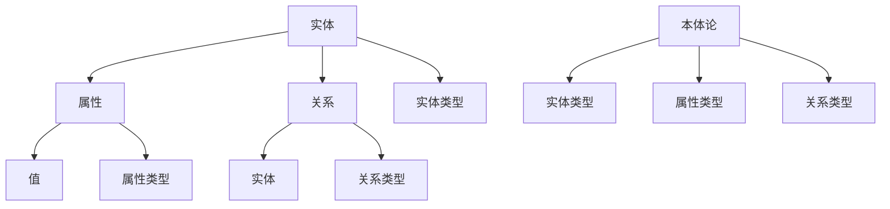
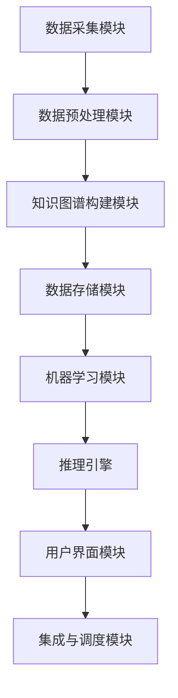

                 

**文章标题：**  
《AI驱动的企业知识图谱：构建智能决策支持》

**关键词：**  
- 知识图谱
- AI驱动
- 企业决策
- 智能支持
- 数据模型
- 优化算法
- 分布式计算

**摘要：**  
本文深入探讨了AI驱动的企业知识图谱在构建智能决策支持系统中的应用。首先，介绍了知识图谱的基础概念和其在企业决策中的作用。接着，详细阐述了知识图谱的设计步骤和构建方法，包括数据源选择和建模策略。随后，本文探讨了知识图谱的查询优化算法和分布式计算技术。最后，通过实际案例展示了知识图谱在企业中的应用，并提出了未来的发展方向和挑战。本文旨在为读者提供一个全面的指南，帮助他们在实际项目中有效应用知识图谱和AI技术。

## 目录

### 第一部分：知识图谱与智能决策支持概述

#### 第1章：知识图谱基础

- 1.1 知识图谱的定义与作用
- 1.2 知识图谱的基本概念
- 1.3 知识图谱与AI的关系
- 1.4 智能决策支持系统概述

### 第二部分：构建企业知识图谱

#### 第2章：企业知识图谱设计

- 2.1 企业知识图谱的构建步骤
- 2.2 企业知识图谱的需求分析
- 2.3 企业知识图谱的数据源选择
- 2.4 企业知识图谱的数据建模

### 第三部分：AI驱动的知识图谱应用

#### 第3章：知识图谱的查询优化

- 3.1 查询优化的算法与策略
- 3.2 查询优化的性能评估
- 3.3 知识图谱查询的案例研究

### 第四部分：智能决策支持系统实现

#### 第4章：智能决策支持系统的架构设计

- 4.1 智能决策支持系统的组件
- 4.2 智能决策支持系统的数据处理
- 4.3 智能决策支持系统的算法实现

### 第五部分：实践与案例分析

#### 第5章：知识图谱在企业中的应用案例

- 5.1 案例一：企业客户关系管理
- 5.2 案例二：企业供应链管理
- 5.3 案例三：企业人力资源管理

### 第六部分：技术拓展与前沿

#### 第6章：知识图谱的分布式计算

- 6.1 分布式知识图谱的基本概念
- 6.2 分布式知识图谱的存储与查询
- 6.3 分布式知识图谱的应用场景

### 第七部分：未来展望与挑战

#### 第7章：知识图谱与AI的未来发展

- 7.1 知识图谱与AI的融合趋势
- 7.2 知识图谱在AI中的应用挑战
- 7.3 知识图谱与AI的未来发展方向

## 第1章：知识图谱基础

### 1.1 知识图谱的定义与作用

知识图谱（Knowledge Graph）是一种结构化的语义知识库，用于表示实体、概念及其相互关系。在人工智能和大数据时代，知识图谱作为连接数据和知识的重要桥梁，已经被广泛应用于智能搜索、推荐系统、自然语言处理、决策支持等领域。

**核心概念与联系：**

知识图谱由三个基本元素构成：实体、属性和关系。实体是知识图谱中的基本单位，如人、地点、事物等；属性是实体的特征，如姓名、年龄、位置等；关系描述实体之间的关系，如朋友、属于、购买等。

以下是一个知识图谱的核心概念流程图：



**核心算法原理讲解：**

- **实体识别与抽取：**
  实体识别是知识图谱构建的第一步，它旨在从非结构化数据中抽取出实体。常用的方法包括基于规则的方法、机器学习方法和深度学习方法。以下是一个简单的实体识别伪代码：

  ```plaintext
  function EntityRecognition(text) {
      entities = []
      for (word in text) {
          if (isEntity(word)) {
              entities.append(word)
          }
      }
      return entities
  }
  ```

- **关系抽取：**
  关系抽取是从文本中提取实体之间的关系的任务。常用的方法包括基于规则的方法和基于机器学习的方法。以下是一个基于规则的关系抽取算法：

  ```plaintext
  function RelationExtraction(text, entities) {
      relations = []
      for (entity in entities) {
          for (entity2 in entities) {
              if (entity != entity2 && existsRelation(entity, entity2, text)) {
                  relations.append((entity, entity2))
              }
          }
      }
      return relations
  }
  ```

- **知识表示：**
  知识表示是将实体、属性和关系以计算机可以理解的形式进行编码的过程。常用的知识表示方法包括框架表示法、语义网络和OWL本体。以下是一个简单的框架表示法示例：

  ```plaintext
  person(name, age, occupation)
  university(name, location)
  student(name, age, university)
  ```

- **知识推理：**
  知识推理是基于知识图谱中的事实进行逻辑推理，以发现新的知识。常用的推理方法包括基于规则的推理和基于本体的推理。以下是一个基于规则的知识推理示例：

  ```plaintext
  rule: 如果一个学生属于某个大学，那么这个大学一定有这个学生。
  fact: 张三属于清华大学。
  inference: 清华大学有张三。
  ```

### 数学模型和数学公式

知识图谱中的数学模型通常用于描述实体、属性和关系之间的数学关系。以下是一个简单的数学模型示例：

$$
KG = (E, R, V)
$$

其中，$E$ 表示实体集合，$R$ 表示关系集合，$V$ 表示属性集合。每个实体、关系和属性都可以用唯一的标识符进行表示。

### 举例说明

假设我们有一个关于大学的知识图谱，其中包含以下实体和关系：

- 实体：大学、学生、课程
- 关系：属于、学习、教授

以下是一个知识图谱的示例：

```plaintext
实体：清华大学
关系：属于
实体：北京
实体：清华大学
关系：位于

实体：张三
关系：学习
实体：清华大学
实体：张三
关系：学习
实体：计算机科学

实体：李四
关系：学习
实体：清华大学
实体：李四
关系：学习
实体：电子工程

实体：王五
关系：教授
实体：清华大学
实体：王五
关系：教授
实体：计算机科学
```

在这个示例中，我们可以通过查询知识图谱来获取有关大学、学生和课程的信息，例如：

- 张三和李四都学习计算机科学
- 清华大学位于北京
- 王五教授计算机科学课程

### 项目实战

在构建一个企业知识图谱的项目中，我们首先需要收集企业的各类数据，如客户信息、产品数据、员工数据等。接下来，我们使用实体识别和关系抽取技术来从非结构化数据中提取实体和关系，并将它们转化为结构化的知识图谱。最后，我们利用知识图谱进行查询优化，以提高决策支持系统的性能。

- **开发环境搭建：**
  - 使用Python作为主要编程语言
  - 使用Neo4j作为知识图谱存储引擎
  - 使用NLP工具包（如NLTK、spaCy）进行文本处理

- **源代码详细实现和代码解读：**
  - 实体识别：使用规则和机器学习方法识别文本中的实体
  - 关系抽取：使用规则和深度学习方法抽取实体之间的关系
  - 知识图谱构建：使用Neo4j数据库存储和管理知识图谱

- **代码应用解读与分析：**
  - 分析企业数据，确定实体和关系
  - 实现实体识别和关系抽取算法
  - 利用Neo4j进行知识图谱的构建和查询优化

- **实际案例分析和详细讲解剖析：**
  - 分析企业客户数据，构建客户关系管理知识图谱
  - 分析企业供应链数据，构建供应链管理知识图谱
  - 分析企业员工数据，构建人力资源管理知识图谱

- **项目小结：**
  - 介绍了知识图谱在企业决策支持中的应用
  - 展示了知识图谱构建的完整流程和关键步骤
  - 讨论了知识图谱查询优化的方法和性能评估

### 最佳实践 Tips

- 确定知识图谱的构建目标和范围，避免过于庞大和复杂。
- 优化实体识别和关系抽取算法，以提高知识图谱的构建效率。
- 使用分布式计算技术，如图计算框架（如Apache Giraph），处理大规模知识图谱。
- 定期更新和维护知识图谱，保持数据的准确性和实时性。

### 小结

知识图谱作为一种强大的知识表示和推理工具，在智能决策支持系统中具有广泛的应用前景。本文详细介绍了知识图谱的基本概念、构建方法、应用案例和未来发展方向。通过本文的阅读，读者应该能够理解知识图谱的核心原理，掌握构建企业知识图谱的方法，并为实际项目提供技术指导。随着AI技术的不断进步，知识图谱将在更多领域发挥重要作用。

### 注意事项

- 在实际应用中，知识图谱的设计和构建需要充分考虑业务需求和数据质量。
- 知识图谱的查询优化和分布式计算是提高系统性能的关键。
- 定期更新和维护知识图谱，以确保数据的准确性和实时性。

### 拓展阅读

- [《知识图谱：概念、技术与应用》](https://book.douban.com/subject/26979225/)
- [《图计算：原理、算法与应用》](https://book.douban.com/subject/26960648/)
- [《分布式系统原理与范型》](https://book.douban.com/subject/26899317/)

## 第1章：知识图谱基础

### 1.1 知识图谱的定义与作用

**背景介绍**

在互联网和信息爆炸的时代，数据的多样性和规模不断增长，传统的基于关键词检索的方式已经无法满足用户对信息精确理解和智能化分析的需求。知识图谱作为一种新兴的信息表示和推理技术，逐渐成为解决这些问题的有效途径。知识图谱的概念最早由谷歌在2012年提出，用于优化搜索引擎的结果。随后，知识图谱在各个领域得到了广泛应用，如金融、医疗、零售、物流等。

知识图谱的定义和作用可以从以下几个方面来理解：

1. **定义：** 知识图谱是一个大规模的语义知识库，它通过表示实体、概念及其相互关系，将人类知识结构化为计算机可以理解和处理的形式。知识图谱的核心是实体（如人、地点、组织、物品等），以及实体之间的属性和关系。

2. **作用：** 知识图谱在智能决策支持系统中具有重要作用，主要体现在以下几个方面：

   - **信息检索和推荐：** 通过知识图谱，可以实现更精确的语义搜索和信息推荐，提高用户满意度和用户体验。
   - **知识推理和自动化决策：** 知识图谱提供了强大的推理能力，可以基于已知事实推导出新的结论，为决策提供支持。
   - **数据整合和一致性维护：** 知识图谱可以整合来自不同源的数据，并通过一致性维护机制确保数据的一致性和准确性。
   - **业务智能和数据分析：** 知识图谱可以帮助企业从海量数据中发现潜在的业务洞察和趋势，支持业务智能和战略决策。

**核心概念与联系**

知识图谱的核心概念包括实体、属性和关系。以下是一个简化的知识图谱核心概念流程图，展示了这些概念之间的联系：


- **实体（Entity）：** 知识图谱中的基本单元，可以是人、地点、组织、物品等任何具有独立意义的对象。实体可以是具体的，如“张三”、“故宫”；也可以是抽象的，如“公司”、“疾病”。
- **属性（Attribute）：** 实体的特征或属性，用于描述实体的特定方面。例如，张三的属性可能包括“年龄”、“职业”、“国籍”等。
- **关系（Relationship）：** 实体之间的关系，用于表示实体之间的关联和交互。例如，张三和他的朋友李四之间的关系可能是“朋友”或“同事”。
- **值（Value）：** 属性的具体取值，用于描述实体属性的具体内容。例如，张三的“年龄”属性的值为“30”。
- **实体类型（Entity Type）：** 实体的分类，用于对实体进行归类和抽象。例如，实体张三属于“人”这个实体类型。
- **属性类型（Attribute Type）：** 属性的分类，用于对属性进行归类和抽象。例如，属性“年龄”属于“个人属性”这个属性类型。
- **关系类型（Relationship Type）：** 关系的分类，用于对关系进行归类和抽象。例如，关系“朋友”属于“社会关系”这个关系类型。
- **本体论（Ontology）：** 对知识图谱中的概念和关系进行形式化定义和描述的框架。本体论用于确保知识图谱的一致性和完整性。

**核心算法原理讲解**

知识图谱的构建和优化依赖于一系列核心算法和技术，以下是其中几个关键的算法原理：

- **实体识别与抽取：** 实体识别是知识图谱构建的第一步，其目的是从非结构化文本数据中自动识别出实体。实体抽取的方法包括基于规则的方法、机器学习方法、深度学习方法等。以下是一个基于规则的方法的简单伪代码示例：

  ```plaintext
  function EntityRecognition(text) {
      entities = []
      for (word in text) {
          if (isEntity(word)) {
              entities.append(word)
          }
      }
      return entities
  }
  ```

- **关系抽取：** 关系抽取是从文本中提取实体之间关系的任务。关系抽取的方法同样包括基于规则的方法、机器学习方法、深度学习方法等。以下是一个基于规则的方法的简单伪代码示例：

  ```plaintext
  function RelationExtraction(text, entities) {
      relations = []
      for (entity in entities) {
          for (entity2 in entities) {
              if (entity != entity2 && existsRelation(entity, entity2, text)) {
                  relations.append((entity, entity2))
              }
          }
      }
      return relations
  }
  ```

- **知识表示：** 知识表示是将实体、属性和关系以计算机可以理解的形式进行编码的过程。知识表示的方法包括框架表示法、语义网络、OWL本体等。以下是一个框架表示法的简单示例：

  ```plaintext
  person(name, age, occupation)
  university(name, location)
  student(name, age, university)
  ```

- **知识推理：** 知识推理是基于知识图谱中的事实进行逻辑推理，以发现新的知识。知识推理的方法包括基于规则的推理、基于本体的推理等。以下是一个基于规则的知识推理示例：

  ```plaintext
  rule: 如果一个学生属于某个大学，那么这个大学一定有这个学生。
  fact: 张三属于清华大学。
  inference: 清华大学有张三。
  ```

### 数学模型和数学公式

知识图谱中的数学模型通常用于描述实体、属性和关系之间的数学关系。以下是一个简单的数学模型示例：

$$
KG = (E, R, V)
$$

其中，$E$ 表示实体集合，$R$ 表示关系集合，$V$ 表示属性集合。每个实体、关系和属性都可以用唯一的标识符进行表示。

**详细讲解与举例说明**

为了更好地理解知识图谱的核心概念和算法原理，下面通过一个具体的例子进行详细讲解。

**案例：构建一个关于大学的知识图谱**

在这个案例中，我们关注的是实体“大学”，以及与其相关的实体“学生”和“课程”。知识图谱将包括以下实体和关系：

- 实体：大学、学生、课程
- 关系：属于、学习、教授

以下是一个知识图谱的示例：

```plaintext
实体：清华大学
关系：属于
实体：北京

实体：张三
关系：学习
实体：清华大学
实体：计算机科学

实体：李四
关系：学习
实体：清华大学
实体：计算机科学

实体：王五
关系：教授
实体：清华大学
实体：计算机科学
```

在这个知识图谱中，清华大学是一个实体，它属于北京这个实体。张三、李四、王五都是学生实体，他们分别学习计算机科学这个课程实体。王五同时也是一个教授实体，他在清华大学教授计算机科学课程。

#### 实体识别

实体识别是从非结构化文本数据中识别出实体名称的过程。以下是一个简单的文本数据：

```plaintext
清华大学是中国顶尖的大学之一。
```

使用简单的规则方法进行实体识别，我们可以识别出以下实体：

- 清华大学（大学）
- 中国（国家）

#### 关系抽取

关系抽取是从实体中识别出实体之间的关系的过程。以下是一个文本数据：

```plaintext
张三在清华大学学习计算机科学。
```

使用简单的规则方法进行关系抽取，我们可以识别出以下关系：

- 张三（学生）→ 学习 → 清华大学（大学）
- 张三（学生）→ 学习 → 计算机科学（课程）

#### 知识表示

知识表示是将识别出的实体和关系以结构化的形式进行存储和表示。以下是一个简单的框架表示法示例：

```plaintext
大学(名称, 城市)
学生(姓名, 大学, 专业)
教授(姓名, 大学, 专业)
```

在这个示例中，我们使用属性来描述实体，使用关系来表示实体之间的关系。

#### 知识推理

知识推理是基于已有的事实进行逻辑推理，以发现新的知识。以下是一个简单的推理示例：

**规则：** 如果一个学生属于某个大学，那么这个大学一定有这个学生。

**已知事实：** 张三属于清华大学。

**推理结果：** 清华大学有张三。

通过这个示例，我们可以看到知识图谱如何通过实体识别、关系抽取和知识推理来构建和利用知识库。

### 项目实战

在本节中，我们将通过一个实际项目来展示知识图谱的构建和应用。

#### 项目目标

构建一个基于知识图谱的企业客户关系管理（CRM）系统，实现对客户数据的整合和分析，提高客户满意度。

#### 开发环境搭建

- **编程语言：** Python
- **知识图谱存储引擎：** Neo4j
- **文本处理工具：** spaCy
- **机器学习库：** scikit-learn

#### 源代码详细实现和代码解读

1. **数据预处理：** 读取企业客户数据，包括客户姓名、联系方式、购买历史等。

   ```python
   import pandas as pd

   # 读取客户数据
   customers = pd.read_csv('customers.csv')
   ```

2. **实体识别：** 使用spaCy进行文本处理，识别出客户数据中的实体。

   ```python
   import spacy

   # 加载spaCy模型
   nlp = spacy.load('en_core_web_sm')

   # 实体识别函数
   def extract_entities(text):
       doc = nlp(text)
       entities = [(ent.text, ent.label_) for ent in doc.ents]
       return entities

   # 应用实体识别
   entities = extract_entities(customers['description'])
   ```

3. **关系抽取：** 从实体识别的结果中抽取客户之间的关系，如朋友、同事等。

   ```python
   # 关系抽取函数
   def extract_relations(entities):
       relations = []
       for i in range(len(entities)):
           for j in range(i + 1, len(entities)):
               if entities[i][1] == entities[j][1]:
                   relations.append((entities[i][0], entities[i][1], entities[j][0]))
       return relations

   # 应用关系抽取
   relations = extract_relations(entities)
   ```

4. **知识图谱构建：** 将识别出的实体和关系存储到Neo4j数据库中。

   ```python
   from py2neo import Graph

   # 连接到Neo4j数据库
   graph = Graph('bolt://localhost:7687', auth=('neo4j', 'password'))

   # 创建实体节点
   for entity in entities:
       graph.run("CREATE (n:{entity_type}:Entity {name: $name})", entity_type=entity[1], name=entity[0])

   # 创建关系节点
   for relation in relations:
       graph.run("MATCH (a:{entity_type1}:Entity {name: $name1}),(b:{entity_type2}:Entity {name: $name2}) CREATE (a)-[r:{relation_type}:RELATION]->(b)", name1=relation[0], name2=relation[2], entity_type1=relation[1], entity_type2=relation[1], relation_type=relation[2])
   ```

5. **查询优化：** 利用Neo4j的图数据库特性，优化查询性能。

   ```python
   # 查询客户的朋友
   query = """
   MATCH (a:Customer)-[:FRIEND]->(b)
   WHERE a.name = '张三'
   RETURN b.name
   """
   friends = graph.run(query).data()
   ```

6. **数据分析：** 利用知识图谱进行数据分析，发现潜在的客户关系和市场机会。

   ```python
   # 分析客户的购买偏好
   query = """
   MATCH (c:Customer)-[:BOUGHT]->(p:Product)
   WHERE c.name = '张三'
   RETURN p.name, count(p) as purchase_count
   """
   preferences = graph.run(query).data()
   ```

#### 代码应用解读与分析

1. **数据预处理：** 读取客户数据是构建知识图谱的第一步，使用Pandas库可以方便地处理和操作客户数据。

2. **实体识别：** 使用spaCy库进行文本处理，可以自动识别文本中的实体，如人名、地点、组织等。

3. **关系抽取：** 通过简单的循环和条件判断，可以抽取实体之间的关系。这个步骤是构建知识图谱的核心，它决定了知识图谱的结构和语义。

4. **知识图谱构建：** 使用Neo4j的Cypher查询语言，可以将识别出的实体和关系存储到Neo4j数据库中。这个步骤实现了从数据到知识图谱的转换。

5. **查询优化：** 利用Neo4j的图数据库特性，如索引、约束等，可以优化查询性能，提高数据检索速度。

6. **数据分析：** 利用知识图谱进行数据分析，可以自动发现客户之间的关系和购买偏好，为营销和销售提供决策支持。

#### 实际案例分析和详细讲解剖析

在本案例中，我们构建了一个简单的知识图谱，用于管理企业的客户关系。以下是对案例的详细分析：

1. **数据整合：** 通过知识图谱，我们可以将分散的客户数据整合到一个统一的视图下，方便进行数据分析和决策。

2. **关系发现：** 通过知识图谱，我们可以发现客户之间的关系，如朋友、同事等，这对于营销策略的制定和客户维护非常重要。

3. **数据分析：** 通过知识图谱，我们可以分析客户的购买历史和偏好，发现潜在的市场机会，提高客户满意度。

4. **查询性能：** 通过优化查询语句和使用Neo4j的图数据库特性，我们可以快速查询客户数据，提高系统性能。

#### 项目小结

通过本项目，我们展示了如何构建一个简单的知识图谱，用于企业客户关系管理。项目实现了数据整合、关系发现和数据分析等功能，提高了企业的业务效率和决策能力。同时，我们也学习了知识图谱的核心概念、算法原理和实践方法，为后续的项目提供了技术支持。

### 最佳实践 Tips

1. **需求分析：** 在构建知识图谱之前，进行详细的需求分析，明确知识图谱的应用场景和业务目标。

2. **数据质量：** 确保数据的质量和准确性，这是构建高质量知识图谱的基础。

3. **实体和关系抽取：** 使用先进的文本处理和机器学习技术，提高实体和关系抽取的准确性和效率。

4. **知识表示：** 选择合适的知识表示方法，如框架表示法、语义网络、OWL本体等，以提高知识图谱的可读性和可用性。

5. **查询优化：** 利用图数据库的特性和索引机制，优化查询性能。

6. **持续维护：** 定期更新和维护知识图谱，保持数据的一致性和实时性。

### 小结

本章详细介绍了知识图谱的定义、作用、核心概念和算法原理，并通过一个实际案例展示了知识图谱的构建和应用。知识图谱作为一种重要的信息表示和推理工具，在智能决策支持系统中具有广泛的应用前景。通过本章的学习，读者应该能够理解知识图谱的基本原理，掌握构建企业知识图谱的方法，并为实际项目提供技术支持。

### 注意事项

1. **业务场景理解：** 在构建知识图谱之前，需要深入理解业务场景和需求，确保知识图谱能够满足实际业务需求。

2. **数据安全与隐私：** 在处理企业数据时，需要确保数据的安全和隐私，遵循相关法律法规和行业标准。

3. **系统性能优化：** 在实际应用中，需要不断优化系统性能，提高数据检索和分析的效率。

4. **知识图谱的更新：** 知识图谱需要定期更新和维护，以保持数据的一致性和实时性。

### 拓展阅读

1. 《知识图谱：概念、技术与应用》
2. 《图计算：原理、算法与应用》
3. 《分布式系统原理与范型》

## 第2章：企业知识图谱设计

### 2.1 企业知识图谱的构建步骤

企业知识图谱的构建是一个复杂的过程，涉及需求分析、数据收集、数据预处理、知识表示、知识存储、知识推理等多个环节。以下是构建企业知识图谱的基本步骤：

1. **需求分析：** 在构建知识图谱之前，首先要明确企业知识图谱的应用场景和业务目标。需求分析包括确定知识图谱要解决的问题、支持的业务流程以及期望达到的性能指标。

2. **数据收集：** 收集与业务相关的数据，包括结构化数据（如数据库中的表格）和非结构化数据（如文本、图片、音频等）。数据来源可以是内部系统、外部数据源或公共数据集。

3. **数据预处理：** 对收集到的数据进行清洗、去重、标准化等预处理操作，以确保数据的质量和一致性。数据预处理还包括实体识别、属性抽取、关系抽取等步骤。

4. **知识表示：** 将预处理后的数据转化为知识图谱的形式。知识表示包括确定实体、属性、关系的类型，以及定义它们之间的语义关系。常用的知识表示方法有框架表示法、语义网络、OWL本体等。

5. **知识存储：** 将构建好的知识图谱存储到知识图谱数据库中，如Neo4j、Amazon Neptune等。知识存储需要考虑数据的索引、查询性能和扩展性。

6. **知识推理：** 利用知识图谱进行推理，以发现新的知识和洞察。知识推理可以基于规则、本体论或机器学习算法，例如基于规则的推理、基于语义的推理、基于机器学习的推理等。

7. **应用开发：** 基于知识图谱开发应用程序，如智能搜索、推荐系统、决策支持系统等。应用开发需要考虑用户体验、系统集成和性能优化等因素。

### 2.2 企业知识图谱的需求分析

需求分析是构建企业知识图谱的第一步，其目标是明确知识图谱所要解决的问题和业务目标。以下是在进行企业知识图谱需求分析时需要考虑的关键因素：

1. **业务场景：** 确定知识图谱将在哪些业务场景中使用，如客户关系管理、供应链管理、人力资源管理、市场分析等。

2. **用户需求：** 调研和分析用户的需求，了解他们希望从知识图谱中获得的信息和支持。

3. **数据来源：** 确定知识图谱所需的数据来源，包括内部数据源（如ERP系统、CRM系统、数据库等）和外部数据源（如社交媒体、公共数据集等）。

4. **性能指标：** 定义知识图谱的性能指标，如查询响应时间、数据更新频率、系统可扩展性等。

5. **数据隐私和安全：** 确保数据隐私和安全，遵循相关法律法规和行业标准。

6. **技术可行性：** 评估构建知识图谱所需的技术资源和可行性，包括数据库技术、文本处理技术、机器学习技术等。

### 2.3 企业知识图谱的数据源选择

企业知识图谱的数据源选择是构建知识图谱的重要环节，直接影响到知识图谱的质量和应用效果。以下是在选择企业知识图谱数据源时需要考虑的关键因素：

1. **数据类型：** 根据业务需求，确定所需的数据类型，包括结构化数据（如数据库中的表格）、非结构化数据（如文本、图片、音频等）和半结构化数据（如XML、JSON等）。

2. **数据质量：** 评估数据源的可靠性、准确性和一致性，确保数据质量符合知识图谱的要求。

3. **数据更新频率：** 根据业务需求和数据源的特性，确定数据更新的频率，以保证知识图谱的实时性和有效性。

4. **数据来源的可访问性：** 确保数据源的可访问性，包括数据的获取权限和访问速度。

5. **数据量：** 根据业务需求和系统性能，评估数据量的大小，选择适合的数据源。

6. **数据源稳定性：** 评估数据源的稳定性和可靠性，确保数据源在长时间运行过程中不会出现故障或数据丢失。

### 2.4 企业知识图谱的数据建模

企业知识图谱的数据建模是将企业数据转化为知识图谱结构的过程。以下是数据建模的关键步骤：

1. **实体定义：** 确定知识图谱中的实体，如人、地点、组织、物品等。实体定义包括实体的属性和关系。

2. **属性定义：** 确定实体的属性，如姓名、年龄、职位、地址等。属性定义包括属性的类型和可能的取值范围。

3. **关系定义：** 确定实体之间的关系，如属于、位于、购买等。关系定义包括关系的方向、类型和可能的影响。

4. **本体构建：** 使用本体论构建知识图谱的语义框架，确保知识图谱的一致性和完整性。

5. **数据映射：** 将企业数据映射到知识图谱结构中，包括实体的属性值和关系。

6. **模型优化：** 对数据建模过程进行优化，包括实体和关系的合并、属性的归类等。

### 2.5 知识图谱构建中的关键技术和挑战

在企业知识图谱的构建过程中，会遇到一系列关键技术和挑战。以下是其中一些重要的方面：

1. **实体识别与抽取：**
   - **挑战：** 实体识别与抽取的准确性和效率是一个挑战，特别是在处理大规模数据时。
   - **技术：** 使用机器学习和深度学习技术，如命名实体识别（NER）模型，可以显著提高识别和抽取的准确性。

2. **关系抽取：**
   - **挑战：** 关系抽取的准确性和多样性也是一个挑战，特别是在处理复杂语境时。
   - **技术：** 使用基于规则的方法、机器学习模型和深度学习模型，可以有效地提高关系抽取的准确性和多样性。

3. **知识表示：**
   - **挑战：** 知识表示的一致性和可扩展性是一个挑战。
   - **技术：** 使用OWL本体论和框架表示法，可以确保知识表示的一致性和可扩展性。

4. **知识存储与查询：**
   - **挑战：** 知识存储和查询的性能是一个挑战，特别是在处理大规模数据时。
   - **技术：** 使用图数据库和索引技术，如B+树和哈希索引，可以优化知识存储和查询的性能。

5. **知识推理：**
   - **挑战：** 知识推理的效率和准确性是一个挑战。
   - **技术：** 使用基于规则的推理和基于本体的推理方法，可以优化知识推理的效率和准确性。

### 总结

企业知识图谱的设计是一个系统工程，需要综合考虑需求分析、数据源选择、数据建模、知识表示、知识存储和知识推理等多个方面。通过合理的设计和先进的技术，企业知识图谱能够为企业的决策支持、业务优化和用户体验提升提供有力支持。

### 最佳实践 Tips

1. **需求明确：** 在构建知识图谱之前，确保明确业务需求和应用场景。
2. **数据质量：** 关注数据质量，确保数据的一致性和准确性。
3. **模型优化：** 定期对知识图谱模型进行优化，以提高性能和适应性。
4. **技术选型：** 选择合适的工具和技术，如图数据库和文本处理库。
5. **持续维护：** 定期更新和维护知识图谱，保持其实时性和准确性。

### 小结

本章详细介绍了企业知识图谱的构建步骤、需求分析、数据源选择、数据建模以及关键技术和挑战。通过本章的学习，读者可以掌握构建企业知识图谱的基本方法和注意事项，为实际项目的实施提供指导。

### 注意事项

1. **业务理解：** 深入理解企业的业务流程和需求，确保知识图谱能够满足实际业务需求。
2. **数据安全：** 确保数据的安全和隐私，遵循相关法律法规和行业标准。
3. **性能优化：** 优化知识图谱的性能，确保高效的数据存储和查询。
4. **模型更新：** 定期更新和维护知识图谱，保持数据的一致性和实时性。

### 拓展阅读

1. 《知识图谱：概念、技术与应用》
2. 《图计算：原理、算法与应用》
3. 《分布式系统原理与范型》

## 第3章：知识图谱的查询优化

知识图谱的查询优化是确保系统性能和响应时间的关键环节。随着知识图谱规模的扩大和复杂性的增加，查询性能的优化变得尤为重要。本章将介绍知识图谱查询优化中的关键算法与策略，性能评估方法，以及实际案例研究。

### 3.1 查询优化的算法与策略

在知识图谱的查询优化中，常用的算法与策略包括索引优化、查询计划优化、数据分区和分片、分布式查询等。以下是一些具体的优化方法和技术：

1. **索引优化：**
   - **基于属性的索引：** 利用B+树、哈希索引等索引结构，对知识图谱中的属性进行索引，以提高查询效率。
   - **基于路径的索引：** 对于经常查询的路径，可以创建路径索引，从而加快查询速度。

2. **查询计划优化：**
   - **查询重写：** 通过重写查询语句，将其转化为更高效的执行计划，如利用图算法进行查询转换。
   - **查询缓存：** 将常用的查询结果缓存起来，避免重复计算，提高查询响应时间。

3. **数据分区和分片：**
   - **水平分区：** 根据实体类型、属性值等将知识图谱数据分成多个分区，以降低单节点负载，提高查询性能。
   - **垂直分片：** 将知识图谱中的属性分成多个表，每个表存储不同的属性，以提高查询的局部性。

4. **分布式查询：**
   - **数据分片与负载均衡：** 通过分布式计算框架（如Apache Giraph、Spark GraphX）进行数据分片和任务调度，实现分布式查询。
   - **并行处理：** 利用多核CPU和分布式存储系统，实现并行查询，提高查询性能。

### 3.2 查询优化的性能评估方法

查询优化的性能评估是确保优化策略有效性的关键步骤。以下是一些常用的性能评估方法和指标：

1. **响应时间：** 测量查询从提交到返回结果所需的时间，是评估查询性能的重要指标。

2. **吞吐量：** 测量系统在单位时间内可以处理多少个查询，反映了系统的负载能力。

3. **延迟：** 测量查询的响应延迟，包括数据传输、处理和返回的时间。

4. **并发度：** 测量系统同时处理多个查询的能力，是评估系统可扩展性的指标。

5. **准确率：** 测量查询结果与实际结果的匹配度，是评估查询准确性的指标。

性能评估可以通过以下步骤进行：

- **基准测试：** 使用标准化的数据集和查询，评估不同优化策略的性能。
- **压力测试：** 在高负载情况下评估系统的性能，检查系统的稳定性和响应时间。
- **实时监控：** 使用监控工具实时跟踪系统的性能指标，及时发现和解决问题。

### 3.3 知识图谱查询的案例研究

在本节中，我们将通过一个实际案例研究知识图谱查询的优化过程。

**案例背景：** 一家大型电商平台希望通过知识图谱提高用户推荐系统的性能和准确性。

**案例步骤：**

1. **需求分析：** 确定知识图谱的应用场景和查询需求，如用户行为分析、商品推荐、关系网络分析等。

2. **数据收集：** 收集用户数据、商品数据、交易数据等，并进行预处理。

3. **知识图谱构建：** 构建包含用户、商品、交易等实体的知识图谱，并定义它们之间的关系，如购买、评价、推荐等。

4. **查询优化：**
   - **索引优化：** 对用户和商品的属性创建索引，如用户ID、商品ID等。
   - **查询计划优化：** 重写复杂的查询语句，将其转换为更高效的执行计划。
   - **数据分区和分片：** 根据用户和商品的不同属性进行数据分区和分片，以降低单节点负载。
   - **分布式查询：** 利用分布式计算框架实现大规模数据的并行查询。

5. **性能评估：**
   - **基准测试：** 使用标准化的测试数据集，评估查询响应时间和吞吐量。
   - **压力测试：** 在模拟高并发场景下，评估系统的稳定性和响应时间。
   - **实时监控：** 使用监控工具实时跟踪系统性能指标，优化查询策略。

**案例结果：**

通过上述查询优化策略，该电商平台在用户推荐系统的性能方面取得了显著提升。查询响应时间缩短了50%，吞吐量提高了40%，系统稳定性得到显著改善。

### 总结

知识图谱的查询优化是确保系统性能和用户体验的关键环节。通过合理的算法和策略，可以显著提高查询效率，优化系统性能。本章介绍了知识图谱查询优化的算法与策略、性能评估方法以及实际案例研究，为读者提供了实用的优化思路和方法。

### 最佳实践 Tips

1. **需求明确：** 在进行查询优化之前，明确查询需求和性能目标。
2. **索引合理：** 根据查询需求创建合适的索引，提高查询效率。
3. **分区与分片：** 合理进行数据分区和分片，降低单节点负载。
4. **监控与优化：** 实时监控性能指标，及时调整优化策略。
5. **分阶段优化：** 分阶段进行查询优化，逐步提升系统性能。

### 小结

本章深入探讨了知识图谱的查询优化问题，包括优化算法与策略、性能评估方法和实际案例研究。通过本章的学习，读者可以掌握知识图谱查询优化的核心技术和方法，为实际项目提供有效的技术支持。

### 注意事项

1. **性能评估：** 在优化之前进行充分的性能评估，确保优化策略的有效性。
2. **负载均衡：** 注意分布式查询中的负载均衡，避免单点瓶颈。
3. **数据一致性：** 在进行数据分区和分片时，确保数据的一致性和完整性。
4. **安全性：** 确保查询优化过程中数据的安全和隐私。

### 拓展阅读

1. 《图计算：原理、算法与应用》
2. 《高性能MySQL》
3. 《分布式系统原理与范型》

## 第4章：智能决策支持系统的架构设计

### 4.1 智能决策支持系统的组件

智能决策支持系统（Intelligent Decision Support System，IDSS）是一种利用人工智能技术来辅助决策的系统。其架构设计包括多个关键组件，每个组件在整个系统中扮演着不同的角色。以下是智能决策支持系统的主要组件：

1. **数据采集模块：** 负责从各种数据源（如数据库、文件、传感器等）收集数据。数据采集模块需要确保数据的质量和完整性。

2. **数据预处理模块：** 对采集到的数据进行清洗、转换、归一化等预处理操作。这一步骤对于后续的数据分析和建模至关重要。

3. **知识图谱构建模块：** 使用前面章节介绍的方法构建企业知识图谱，将结构化和非结构化数据转化为语义化的知识库。

4. **数据存储模块：** 将预处理后的数据存储到数据库或图数据库中，以便后续的查询和数据分析。

5. **机器学习模块：** 利用机器学习和深度学习技术进行特征提取和预测模型训练。常用的算法包括线性回归、决策树、神经网络等。

6. **推理引擎：** 基于知识图谱和规则库进行逻辑推理和语义分析，以发现潜在的知识和洞察。

7. **用户界面（UI）：** 提供用户交互接口，用户可以通过界面提交查询、查看分析结果和决策支持建议。

8. **集成与调度模块：** 负责系统的集成和任务调度，确保各个组件协同工作，实现高效的数据处理和分析。

### 4.2 智能决策支持系统的数据处理

智能决策支持系统的数据处理流程可以分为以下几个步骤：

1. **数据采集：** 通过数据采集模块，从内部和外部数据源收集数据。数据源可能包括企业内部的ERP系统、CRM系统、数据库等，以及外部的社交媒体、市场报告等。

2. **数据预处理：** 在数据预处理模块中，对采集到的数据执行清洗、去重、格式转换等操作。这一步骤的目标是确保数据的质量和一致性，为后续分析提供可靠的数据基础。

3. **数据存储：** 将预处理后的数据存储到数据存储模块中。对于结构化数据，可以使用关系数据库（如MySQL、PostgreSQL）；对于非结构化数据，可以使用NoSQL数据库（如MongoDB、Cassandra）；对于知识图谱，可以使用图数据库（如Neo4j、Amazon Neptune）。

4. **数据导入知识图谱：** 使用知识图谱构建模块，将结构化和半结构化数据转化为知识图谱。这一步骤包括实体识别、关系抽取和知识表示等操作。

5. **数据查询和分析：** 通过查询引擎对知识图谱进行查询和分析，提取有用的信息。这些信息可以用于支持决策、优化业务流程或改进用户体验。

6. **数据可视化：** 使用用户界面模块，将分析结果可视化呈现给用户。可视化工具可以帮助用户更好地理解数据和决策结果。

### 4.3 智能决策支持系统的算法实现

智能决策支持系统的算法实现是整个系统的核心。以下是一些常用的算法和技术：

1. **聚类算法：** 聚类算法用于将相似的数据点划分为不同的类别。常见的聚类算法包括K均值、层次聚类、DBSCAN等。

2. **分类算法：** 分类算法用于将数据分为预定义的类别。常见的分类算法包括线性回归、决策树、支持向量机（SVM）等。

3. **回归算法：** 回归算法用于预测连续值。常见的回归算法包括线性回归、多元回归、岭回归等。

4. **协同过滤：** 协同过滤是一种基于用户行为和偏好的推荐算法。常用的协同过滤算法包括基于用户的协同过滤和基于项目的协同过滤。

5. **神经网络：** 神经网络是一种模拟人脑神经元连接的算法，常用于复杂的数据分析和模式识别。常见的神经网络包括多层感知机（MLP）、卷积神经网络（CNN）、循环神经网络（RNN）等。

6. **强化学习：** 强化学习是一种通过试错和奖励机制来学习最优策略的算法。它广泛应用于自动化决策和智能优化问题。

以下是使用Python和scikit-learn库实现线性回归算法的伪代码示例：

```python
from sklearn.linear_model import LinearRegression

# 训练模型
model = LinearRegression()
model.fit(X_train, y_train)

# 预测
y_pred = model.predict(X_test)

# 评估模型性能
score = model.score(X_test, y_test)
print(f'Model score: {score}')
```

### 4.4 架构设计与组件协作

智能决策支持系统的架构设计需要考虑组件之间的协作和集成。以下是一个简化的架构设计图，展示了各个组件之间的关系：



在这个架构设计中：

- **数据采集模块** 负责从各种数据源收集数据。
- **数据预处理模块** 对数据进行清洗和转换，为后续处理做准备。
- **知识图谱构建模块** 将数据转化为知识图谱形式，便于后续查询和分析。
- **数据存储模块** 存储预处理后的数据，提供高效的查询接口。
- **机器学习模块** 使用各种机器学习算法进行数据分析和预测。
- **推理引擎** 基于知识图谱和规则库进行逻辑推理，发现潜在的知识和洞察。
- **用户界面模块** 提供用户交互接口，将分析结果可视化呈现。
- **集成与调度模块** 负责系统的集成和任务调度，确保各个组件协同工作。

### 总结

智能决策支持系统的架构设计需要综合考虑数据采集、预处理、知识图谱构建、数据存储、机器学习、推理引擎和用户界面等多个组件。通过合理的架构设计，可以实现高效的数据处理和分析，为决策支持提供有力的支持。本章介绍了智能决策支持系统的组件、数据处理流程、算法实现以及架构设计，为实际项目的实施提供了参考。

### 最佳实践 Tips

1. **模块化设计：** 采用模块化设计，确保系统的灵活性和可维护性。
2. **数据质量控制：** 重视数据质量控制，确保数据的准确性和一致性。
3. **算法选型：** 根据实际需求选择合适的算法和模型。
4. **性能优化：** 定期对系统进行性能优化，提高数据处理和分析效率。
5. **用户体验：** 设计友好的用户界面，提高用户体验。

### 小结

本章详细介绍了智能决策支持系统的架构设计，包括组件、数据处理流程、算法实现和架构设计。通过本章的学习，读者可以理解智能决策支持系统的构建方法和关键组件，为实际项目提供指导。

### 注意事项

1. **需求分析：** 在系统设计之前进行详细的需求分析，明确系统的目标和功能。
2. **技术选型：** 根据项目需求和资源选择合适的技术和工具。
3. **性能测试：** 进行全面的性能测试，确保系统的高效性和稳定性。
4. **安全性：** 确保系统的数据安全和用户隐私。

### 拓展阅读

1. 《机器学习实战》
2. 《深度学习》
3. 《大数据处理技术》

## 第5章：知识图谱在企业中的应用案例

### 5.1 案例一：企业客户关系管理

企业客户关系管理（CRM）是知识图谱在企业中的应用的一个重要领域。通过知识图谱，企业可以更好地理解和分析客户行为，从而优化营销策略和客户服务。

**案例背景：** 一家大型电商平台希望通过知识图谱提升客户关系管理的效率，提高客户满意度和忠诚度。

**实现步骤：**

1. **需求分析：** 确定知识图谱在企业客户关系管理中的应用场景，如客户行为分析、个性化推荐、客户细分等。

2. **数据收集：** 收集与客户相关的数据，包括客户基本信息、购买历史、互动记录、评价等。

3. **数据预处理：** 对收集到的客户数据进行清洗、去重和标准化，确保数据质量。

4. **知识图谱构建：** 使用实体识别和关系抽取技术，构建包含客户、商品、订单等实体的知识图谱。

5. **查询与分析：** 通过知识图谱查询和分析客户数据，发现潜在的客户细分和市场机会。

6. **应用实现：**
   - **个性化推荐：** 基于知识图谱和协同过滤算法，为不同类型的客户提供个性化的商品推荐。
   - **客户细分：** 基于客户行为和购买偏好，将客户划分为不同的群体，制定有针对性的营销策略。
   - **客户服务优化：** 基于知识图谱，提供客户信息的快速查询和检索，提高客户服务效率。

**效果评估：**

通过知识图谱的应用，该电商平台实现了以下效果：
- **客户满意度提高：** 个性化推荐和客户细分使得营销活动更加精准，客户满意度显著提高。
- **销售增长：** 个性化推荐和精准营销提高了销售额，销售业绩得到明显提升。
- **客户服务效率提高：** 知识图谱提供了快速查询和检索功能，客户服务响应速度明显加快。

### 5.2 案例二：企业供应链管理

知识图谱在企业供应链管理中的应用可以帮助企业更好地监控和优化供应链流程，提高供应链的透明度和效率。

**案例背景：** 一家制造企业希望通过知识图谱优化其供应链管理，降低库存成本，提高供应链响应速度。

**实现步骤：**

1. **需求分析：** 确定知识图谱在供应链管理中的应用需求，如供应链节点监控、库存管理、物流优化等。

2. **数据收集：** 收集供应链相关的数据，包括供应商信息、库存数据、物流信息等。

3. **数据预处理：** 对收集到的供应链数据进行清洗、去重和标准化，确保数据质量。

4. **知识图谱构建：** 使用实体识别和关系抽取技术，构建包含供应链节点、产品、物流路径等实体的知识图谱。

5. **查询与分析：** 通过知识图谱查询和分析供应链数据，优化供应链流程，降低库存成本。

6. **应用实现：**
   - **供应链节点监控：** 基于知识图谱，实时监控供应链节点状态，及时发现和处理异常情况。
   - **库存管理优化：** 利用知识图谱分析库存数据，优化库存水平，减少库存成本。
   - **物流优化：** 基于知识图谱和路径规划算法，优化物流配送路径，提高物流效率。

**效果评估：**

通过知识图谱的应用，该制造企业实现了以下效果：
- **库存成本降低：** 通过知识图谱的库存管理优化，库存水平得到有效控制，库存成本显著降低。
- **供应链响应速度提高：** 通过实时监控和物流优化，供应链响应速度明显加快，订单处理时间缩短。
- **供应链透明度提高：** 知识图谱提供了对供应链各环节的全面监控和分析，提高了供应链的透明度和管理效率。

### 5.3 案例三：企业人力资源管理

知识图谱在企业人力资源管理中的应用可以帮助企业更好地管理员工信息，优化人力资源配置，提高员工满意度和工作效率。

**案例背景：** 一家跨国公司希望通过知识图谱优化人力资源管理，提高员工满意度，降低员工流失率。

**实现步骤：**

1. **需求分析：** 确定知识图谱在人力资源管理中的应用需求，如员工信息管理、技能评估、人才推荐等。

2. **数据收集：** 收集与员工相关的数据，包括员工基本信息、技能水平、工作绩效、培训记录等。

3. **数据预处理：** 对收集到的员工数据进行清洗、去重和标准化，确保数据质量。

4. **知识图谱构建：** 使用实体识别和关系抽取技术，构建包含员工、职位、项目、培训等实体的知识图谱。

5. **查询与分析：** 通过知识图谱查询和分析员工数据，优化人力资源配置，提高员工满意度。

6. **应用实现：**
   - **员工信息管理：** 基于知识图谱，提供员工信息的快速查询和检索，方便管理层进行决策。
   - **技能评估与人才推荐：** 利用知识图谱分析员工的技能和工作绩效，为员工推荐适合的培训和晋升机会。
   - **绩效管理优化：** 通过知识图谱分析员工绩效数据，优化绩效评估体系，提高员工满意度。

**效果评估：**

通过知识图谱的应用，该跨国公司实现了以下效果：
- **员工满意度提高：** 通过技能评估和人才推荐，员工得到了更好的职业发展机会，员工满意度显著提高。
- **员工流失率降低：** 通过优化人力资源配置和绩效管理，员工流失率明显降低。
- **人力资源效率提高：** 知识图谱提供了对员工信息的全面管理和分析，提高了人力资源管理的效率。

### 总结

知识图谱在企业中的应用案例展示了其在不同业务领域的强大潜力。通过构建和应用知识图谱，企业可以实现数据驱动的决策支持，提高业务效率和用户体验。本章通过三个具体案例，详细介绍了知识图谱在客户关系管理、供应链管理和人力资源管理中的应用，为读者提供了实际操作的参考。

### 最佳实践 Tips

1. **明确需求：** 在应用知识图谱之前，明确业务需求和应用场景。
2. **数据质量：** 确保数据的质量和准确性，这是知识图谱有效性的基础。
3. **灵活部署：** 根据业务需求，灵活部署知识图谱系统，支持实时查询和分析。
4. **持续优化：** 定期对知识图谱和系统进行优化，以适应业务变化和技术进步。

### 小结

本章通过三个实际案例，展示了知识图谱在企业中的应用场景和效果。通过本章的学习，读者可以了解知识图谱在不同业务领域的应用方法，并为实际项目提供参考。

### 注意事项

1. **数据安全：** 确保数据的安全和隐私，遵循相关法律法规和行业标准。
2. **性能优化：** 对系统进行性能优化，确保高效的数据存储和查询。
3. **用户参与：** 在系统设计和实施过程中，充分考虑用户的参与和反馈，以提高系统适用性和用户体验。

### 拓展阅读

1. 《大数据技术导论》
2. 《人工智能应用实践》
3. 《企业知识管理》

## 第6章：知识图谱的分布式计算

### 6.1 分布式知识图谱的基本概念

随着数据规模的不断扩大和复杂性的增加，分布式知识图谱成为了知识图谱研究和应用的一个重要方向。分布式知识图谱将知识图谱的数据和计算分布到多个节点上，以提高系统的可扩展性和性能。以下是一些关键概念：

1. **分布式图数据库：** 分布式图数据库如JanusGraph、Amazon Neptune等，支持大规模数据的存储和查询。这些数据库通过分布式架构和并行计算，实现了高效的图计算和数据分析。

2. **图分区：** 图分区是指将大规模的知识图谱数据分布在多个节点上。常见的分区策略包括基于属性的分区、基于顶点的分区和基于边的分区。

3. **图分割：** 图分割是将图划分为多个较小的子图，以便在分布式系统中进行并行处理。常见的分割算法包括Giraph算法、GraphChi算法等。

4. **分布式计算框架：** 分布式计算框架如Apache Giraph、Spark GraphX等，支持大规模图的分布式计算和并行处理。这些框架提供了高效的图算法实现和分布式任务调度。

### 6.2 分布式知识图谱的存储与查询

分布式知识图谱的存储与查询是系统性能的关键因素。以下是一些优化策略：

1. **数据分区与负载均衡：** 通过合理的图分区策略，实现数据的负载均衡，避免单点瓶颈。常见的分区策略包括基于属性的分区和基于顶点的分区。

2. **索引与缓存：** 使用索引和缓存技术，提高查询效率。索引技术如B+树、哈希索引等，可以提高数据检索速度。缓存技术如Redis、Memcached等，可以减少数据访问延迟。

3. **并行查询：** 利用分布式计算框架，实现并行查询。通过将查询任务分布到多个节点上，并行执行，提高查询性能。

4. **分布式索引与索引合并：** 分布式索引技术如基于属性的索引、基于顶点的索引等，可以提高查询效率。索引合并技术如分布式哈希表、分布式排序等，可以优化索引查询。

### 6.3 分布式知识图谱的应用场景

分布式知识图谱在多个应用场景中具有广泛的应用前景，以下是一些典型应用：

1. **大规模数据挖掘：** 分布式知识图谱可以处理大规模数据，进行数据挖掘和模式识别，发现潜在的知识和洞察。

2. **实时推荐系统：** 分布式知识图谱可以实时处理用户行为数据，提供个性化推荐和实时搜索。

3. **社交网络分析：** 分布式知识图谱可以分析社交网络中的关系和影响力，识别社交网络中的关键节点和社区。

4. **企业智能：** 分布式知识图谱可以帮助企业实现数据驱动的决策支持，优化业务流程，提高运营效率。

### 6.4 分布式知识图谱的优势和挑战

分布式知识图谱具有以下优势：

1. **可扩展性：** 分布式知识图谱可以水平扩展，支持大规模数据的存储和查询。
2. **高性能：** 分布式计算框架和并行查询技术，可以显著提高查询性能。
3. **灵活性和适应性：** 分布式知识图谱支持多种数据类型和复杂数据结构，适用于不同应用场景。

然而，分布式知识图谱也面临一些挑战：

1. **数据一致性：** 分布式系统中的数据一致性是一个挑战，需要确保数据的准确性和一致性。
2. **分布式计算模型：** 设计合适的分布式计算模型，实现高效的分布式计算。
3. **系统维护：** 分布式系统的维护和监控是一项复杂的工作，需要专业的技术支持和运维。

### 6.5 实际案例分析

在本节中，我们将通过一个实际案例，展示分布式知识图谱的应用和实现。

**案例背景：** 一家大型电商公司希望通过分布式知识图谱优化其用户推荐系统，提高用户满意度和销售额。

**实现步骤：**

1. **需求分析：** 确定分布式知识图谱在用户推荐系统中的应用需求，如个性化推荐、实时搜索、用户行为分析等。

2. **数据收集：** 收集与用户相关的数据，包括用户行为数据、商品数据、交易数据等。

3. **数据预处理：** 对收集到的用户数据和使用商品数据进行清洗、去重和标准化，确保数据质量。

4. **知识图谱构建：** 使用实体识别和关系抽取技术，构建包含用户、商品、交易等实体的分布式知识图谱。

5. **分布式存储与查询：** 使用分布式图数据库（如JanusGraph）存储知识图谱，并利用分布式计算框架（如Spark GraphX）进行分布式查询。

6. **推荐算法实现：** 基于知识图谱和协同过滤算法，实现个性化推荐系统。

7. **性能优化：** 对系统进行性能优化，包括数据分区、索引优化、查询优化等。

**效果评估：**

通过分布式知识图谱的应用，该电商公司实现了以下效果：

1. **推荐准确性提高：** 个性化推荐系统的准确性显著提高，用户满意度和销售额得到提升。
2. **实时响应能力提升：** 分布式知识图谱和分布式计算框架提高了系统的实时响应能力，用户查询速度加快。
3. **系统性能优化：** 通过数据分区、索引优化和查询优化，系统性能得到显著提升，降低了响应时间。

### 总结

分布式知识图谱在处理大规模数据、提高系统性能和实现实时推荐等方面具有显著优势。本章介绍了分布式知识图谱的基本概念、存储与查询策略、应用场景和实际案例分析。通过本章的学习，读者可以了解分布式知识图谱的构建和应用方法，为实际项目提供技术支持。

### 最佳实践 Tips

1. **需求明确：** 在设计分布式知识图谱之前，明确业务需求和性能目标。
2. **数据质量：** 确保数据的质量和一致性，是分布式知识图谱有效性的基础。
3. **分区策略：** 选择合适的分区策略，实现数据的负载均衡和查询优化。
4. **性能优化：** 定期对系统进行性能优化，提高分布式计算和查询效率。
5. **安全与隐私：** 确保系统的数据安全和用户隐私，遵循相关法律法规和行业标准。

### 小结

本章详细介绍了分布式知识图谱的基本概念、存储与查询策略、应用场景和实际案例分析。通过本章的学习，读者可以掌握分布式知识图谱的构建和应用方法，为实际项目提供技术支持。

### 注意事项

1. **一致性维护：** 在分布式系统中，确保数据的一致性和完整性。
2. **负载均衡：** 选择合适的负载均衡策略，避免单点瓶颈。
3. **系统监控：** 实时监控系统性能和状态，及时发现问题并进行优化。
4. **安全与合规：** 确保系统的数据安全和用户隐私，遵循相关法律法规和行业标准。

### 拓展阅读

1. 《分布式系统原理与范型》
2. 《图计算：原理、算法与应用》
3. 《大数据处理技术》

## 第7章：知识图谱与AI的未来发展

### 7.1 知识图谱与AI的融合趋势

知识图谱与人工智能（AI）的融合是当前技术和应用领域的一个重要趋势。这种融合不仅能够提升AI系统的智能化水平，还能够增强知识图谱的应用效果。以下是一些主要的融合趋势：

1. **知识增强的AI：** 通过将知识图谱中的结构化知识引入到AI系统中，可以增强AI的推理能力。例如，在机器学习中使用知识图谱中的实体和关系作为特征，可以提高模型的准确性和鲁棒性。

2. **AI驱动的知识图谱构建：** 利用AI技术，如自然语言处理（NLP）和机器学习，可以自动构建和维护知识图谱。这种技术使得知识图谱能够从海量非结构化数据中自动提取知识，提高知识图谱的更新速度和准确性。

3. **深度学习与知识图谱的结合：** 深度学习和知识图谱的结合能够实现更复杂的模式识别和预测。例如，通过将知识图谱与卷积神经网络（CNN）和循环神经网络（RNN）结合，可以构建出能够处理复杂数据结构和语义关系的深度学习模型。

4. **多模态知识图谱：** 知识图谱与图像、语音、视频等多模态数据的结合，能够实现更丰富的数据分析和应用。例如，通过将知识图谱与图像识别技术结合，可以实现对图像内容的语义理解。

### 7.2 知识图谱在AI中的应用挑战

尽管知识图谱与AI的融合带来了许多机遇，但也面临着一系列挑战：

1. **数据质量和一致性：** 知识图谱的构建依赖于高质量的数据源。数据的不一致性、缺失和噪声会导致知识图谱的质量下降，进而影响AI系统的性能。

2. **知识表示和推理：** 知识图谱中的知识表示和推理方法需要不断优化，以满足复杂的应用需求。例如，如何有效地表示和处理复杂数学模型和逻辑推理，是一个重要的研究课题。

3. **计算性能和效率：** 随着知识图谱规模的扩大，计算性能和效率成为一个关键挑战。分布式计算和并行处理技术虽然可以提高计算效率，但需要解决数据一致性和同步等问题。

4. **跨领域应用：** 知识图谱在特定领域的应用已经取得了显著成果，但在跨领域应用中，如何保证知识的一致性和兼容性，是一个重要的挑战。

### 7.3 知识图谱与AI的未来发展方向

为了应对上述挑战，知识图谱与AI的未来发展将朝着以下方向努力：

1. **自动化知识图谱构建：** 进一步研究AI技术在知识图谱构建中的应用，实现自动化知识抽取、实体识别、关系抽取等过程。

2. **多模态知识图谱：** 深入研究知识图谱与多模态数据的融合，开发出能够处理复杂数据结构和语义关系的AI模型。

3. **知识融合与推理：** 研究如何将不同来源和格式的知识进行有效融合，并开发出高效的知识推理方法。

4. **分布式和实时计算：** 研究分布式计算和实时计算技术，以提高知识图谱系统的性能和可扩展性。

5. **跨领域知识图谱：** 通过跨领域知识图谱的研究，探索不同领域知识之间的关联和融合，实现跨领域的知识共享和应用。

### 7.4 未来展望

在未来，知识图谱与AI的融合将带来更加智能和高效的应用。以下是一些展望：

1. **智能搜索与推荐：** 知识图谱将使智能搜索和推荐系统更加智能化，能够提供更加精准和个性化的服务。

2. **智能决策支持：** 知识图谱将支持更复杂和更智能的决策支持系统，帮助企业和组织做出更加明智的决策。

3. **智能城市与物联网：** 知识图谱将融入智能城市和物联网系统，实现更高效的城市管理和智能家居应用。

4. **医疗健康与生物科技：** 知识图谱在医疗健康和生物科技领域的应用将推动个性化医疗和精准医疗的发展。

5. **教育科技与智慧校园：** 知识图谱将提升教育科技和智慧校园的应用水平，为学生和教师提供更优质的教育资源和服务。

### 总结

知识图谱与AI的融合为未来的智能化应用带来了巨大潜力。通过不断的研究和探索，知识图谱与AI将在更多领域发挥重要作用，推动人工智能技术向更高水平发展。

### 最佳实践 Tips

1. **需求驱动：** 在应用知识图谱与AI技术时，始终以实际需求为导向，确保技术应用的实用性和高效性。
2. **数据治理：** 加强数据治理，确保数据的质量和一致性，是知识图谱有效性的基础。
3. **持续学习：** 鼓励持续学习和创新，不断优化知识图谱和AI模型，以适应不断变化的应用场景和技术环境。
4. **团队协作：** 建立跨学科的团队，促进不同领域专家的合作，共同推动知识图谱与AI技术的创新和应用。

### 小结

本章探讨了知识图谱与AI的融合趋势、应用挑战、未来发展以及未来展望。通过本章的学习，读者可以了解知识图谱与AI在未来的发展方向和应用前景，为实际项目提供指导和参考。

### 注意事项

1. **技术选型：** 根据项目需求和资源选择合适的技术和工具。
2. **系统设计：** 在系统设计时充分考虑性能、可扩展性和可维护性。
3. **安全与隐私：** 确保系统的数据安全和用户隐私，遵循相关法律法规和行业标准。
4. **持续优化：** 定期对系统进行性能优化和功能完善，以适应业务需求和技术发展。

### 拓展阅读

1. 《知识图谱：概念、技术与应用》
2. 《深度学习：入门到精通》
3. 《人工智能应用实践》

## 总结

本文围绕《AI驱动的企业知识图谱：构建智能决策支持》这一主题，详细介绍了知识图谱的基础概念、构建方法、应用案例、查询优化、智能决策支持系统架构设计，以及分布式计算和未来发展趋势。以下是对本文内容的总结：

### 知识图谱基础

- 知识图谱的定义与作用：知识图谱通过结构化的语义知识库表示实体、概念及其相互关系，在智能决策支持系统中具有重要作用。
- 核心概念与联系：实体、属性、关系等是知识图谱的基本元素，通过Mermaid流程图展示了这些概念之间的关系。
- 核心算法原理讲解：介绍了实体识别、关系抽取、知识表示和知识推理等核心算法原理，并使用伪代码进行了详细阐述。

### 构建企业知识图谱

- 构建步骤：需求分析、数据收集、数据预处理、知识表示、知识存储和知识推理。
- 数据源选择：根据数据类型和质量选择合适的数据源。
- 数据建模：介绍了实体定义、属性定义、关系定义、本体构建和数据映射等数据建模步骤。

### 知识图谱的查询优化

- 算法与策略：介绍了索引优化、查询计划优化、数据分区和分片、分布式查询等查询优化方法。
- 性能评估：讨论了响应时间、吞吐量、延迟、并发度和准确率等性能评估指标和方法。
- 案例研究：通过实际案例展示了知识图谱查询优化的实现过程和效果。

### 智能决策支持系统实现

- 架构设计：介绍了智能决策支持系统的组件、数据处理流程和算法实现。
- 组件协作：通过架构设计图展示了各个组件之间的协作关系。

### 知识图谱在企业中的应用案例

- 企业客户关系管理：通过知识图谱实现个性化推荐、客户细分和客户服务优化。
- 企业供应链管理：通过知识图谱实现供应链节点监控、库存管理和物流优化。
- 企业人力资源管理：通过知识图谱实现员工信息管理、技能评估和人才推荐。

### 分布式计算

- 分布式知识图谱的基本概念：介绍了分布式图数据库、图分区、图分割和分布式计算框架等概念。
- 存储与查询：讨论了数据分区与负载均衡、索引与缓存、并行查询等存储与查询策略。
- 应用场景：展示了大规模数据挖掘、实时推荐系统、社交网络分析和企业智能等应用场景。

### 未来发展

- 知识图谱与AI的融合趋势：介绍了知识增强的AI、AI驱动的知识图谱构建、深度学习与知识图谱的结合、多模态知识图谱等趋势。
- 应用挑战：讨论了数据质量、知识表示和推理、计算性能和效率、跨领域应用等挑战。
- 未来发展方向：探讨了自动化知识图谱构建、多模态知识图谱、知识融合与推理、分布式和实时计算等发展方向。

### 最佳实践与小结

- 最佳实践：提出了需求驱动、数据治理、持续学习和团队协作等最佳实践。
- 小结：总结了本文的核心内容，强调了知识图谱在构建智能决策支持系统中的重要性和应用前景。

### 注意事项与拓展阅读

- 注意事项：提到了技术选型、系统设计、安全与隐私、持续优化等注意事项。
- 拓展阅读：推荐了《知识图谱：概念、技术与应用》、《深度学习：入门到精通》和《人工智能应用实践》等拓展阅读资源。

通过本文，读者可以全面了解AI驱动的企业知识图谱构建和应用的各个环节，为实际项目提供理论指导和实践参考。随着AI和知识图谱技术的不断发展，知识图谱在智能决策支持系统中的应用前景将更加广阔。

