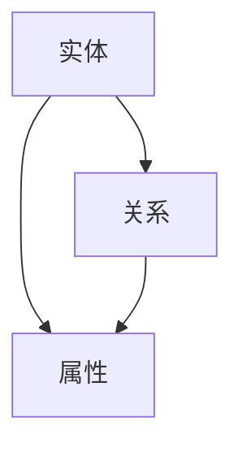

                 


## 引言与概述

### 背景介绍

在当今数字化时代，数据已经成为企业最宝贵的资产之一。然而，如何有效地管理和利用这些数据，以实现业务决策的智能化，成为企业面临的一个重要挑战。知识图谱作为一种强大的数据结构，能够将大量零散的数据关联起来，形成一个有机的整体，为企业的智能决策提供了坚实的基础。

知识图谱是一种基于图形数据库的数据模型，通过实体（Entity）、关系（Relationship）和属性（Attribute）三个基本元素来描述现实世界中的各种对象及其相互关系。实体表示现实世界中的对象，如人、地点、事物等；关系描述实体之间的关联，如朋友、工作于、属于等；属性则是实体的特征描述，如年龄、身高、工资等。这种结构化的数据表示方式，使得知识图谱在信息检索、知识推理、智能问答等领域具有广泛的应用前景。

### 核心概念与联系

知识图谱的核心概念包括实体、关系和属性，它们之间存在着紧密的联系。实体是知识图谱的基本构建块，代表现实世界中的对象；关系则是连接实体的纽带，描述实体之间的相互作用；属性为实体提供额外的信息，帮助更好地理解实体。

为了更好地理解这些概念，我们可以使用Mermaid流程图来展示它们之间的关系：



在这个流程图中，实体（A）通过关系（B）与其他实体相连，同时实体（A）也包含属性（C）。这种结构化表示方式，使得知识图谱能够有效地存储和检索信息。

### 核心算法原理讲解

知识图谱的构建过程涉及到多个核心算法，包括实体识别、关系抽取、知识融合等。以下将使用伪代码来详细阐述这些算法的原理。

**实体识别：**

```python
def identify_entities(data):
    entities = []
    for record in data:
        entity = extract_entity_from_record(record)
        entities.append(entity)
    return entities

def extract_entity_from_record(record):
    # 使用命名实体识别算法提取实体
    return NER_algorithm(record)
```

**关系抽取：**

```python
def extract_relationships(data, entities):
    relationships = []
    for pair in combinations(entities, 2):
        relationship = determine_relationship(pair[0], pair[1])
        if relationship:
            relationships.append(relationship)
    return relationships

def determine_relationship(entity1, entity2):
    # 使用关系分类算法判断实体之间的关系
    return RC_algorithm(entity1, entity2)
```

**知识融合：**

```python
def fuse_knowledge(relationship_pairs):
    fused_knowledge = {}
    for pair in relationship_pairs:
        key = tuple(sorted([pair[0].id, pair[1].id]))
        if key in fused_knowledge:
            fused_knowledge[key].extend([pair[2]])
        else:
            fused_knowledge[key] = [pair[2]]
    return fused_knowledge
```

### 数学模型和数学公式

知识图谱的构建过程中，涉及到多种数学模型和公式。以下将使用LaTeX格式来展示一些关键的数学公式。

**实体相似度计算：**

$$
similarity(entity1, entity2) = \frac{Jaccard\_Similarity(set1, set2)}{1 + Jaccard\_Distance(set1, set2)}
$$

其中，$Jaccard\_Similarity$ 表示两个集合的交集与并集的比值，$Jaccard\_Distance$ 表示两个集合的交集与补集的比值。

**关系权重计算：**

$$
weight(relationship) = \sum_{entity1 \in entities} \sum_{entity2 \in entities} sim(entity1, entity2) \cdot \text{confidence(relationship)}
$$

其中，$sim$ 表示实体相似度，$\text{confidence}$ 表示关系的置信度。

### 项目实战

为了更好地理解知识图谱的构建过程，我们以下将介绍一个简单的知识图谱构建项目。该项目使用开源工具Neo4j作为图形数据库，使用Python进行数据预处理和图谱构建。

**开发环境搭建：**

- 安装Neo4j数据库
- 安装Python环境和相关库，如NetworkX、Neo4j Python Driver等

**源代码实现：**

```python
from neo4j import GraphDatabase
from networkx import Graph

def create_knowledge_graph(data):
    graph = Graph()
    for record in data:
        entity1 = extract_entity_from_record(record[0])
        entity2 = extract_entity_from_record(record[1])
        relationship = determine_relationship(entity1, entity2)
        if relationship:
            graph.add_edge(entity1, entity2, relationship=relationship)
    return graph

def extract_entity_from_record(record):
    # 使用命名实体识别算法提取实体
    return NER_algorithm(record)

def determine_relationship(entity1, entity2):
    # 使用关系分类算法判断实体之间的关系
    return RC_algorithm(entity1, entity2)

# 连接Neo4j数据库
driver = GraphDatabase.driver("bolt://localhost:7687", auth=("neo4j", "password"))

def create_knowledge_graph_in_neo4j(data):
    graph = create_knowledge_graph(data)
    for node in graph.nodes:
        driver.session().run("CREATE (n:{entity} {properties})", entity=node.entity, properties=node.properties)
    for edge in graph.edges:
        driver.session().run("MATCH (a:{entity1} {id: $id1}), (b:{entity2} {id: $id2}) CREATE (a)-[r:{relationship}]->(b)", id1=edge[0].id, id2=edge[1].id, relationship=edge.relationship)

# 测试数据
data = [["Person", "John"], ["Person", "Mary"], ["Knows", "John", "Mary"], ["LivesIn", "John", "New York"], ["LivesIn", "Mary", "New York"]]

# 构建知识图谱
create_knowledge_graph_in_neo4j(data)

# 关闭数据库连接
driver.close()
```

**代码解读与分析：**

- 首先，我们定义了三个函数：`create_knowledge_graph`、`extract_entity_from_record` 和 `determine_relationship`。`create_knowledge_graph` 函数负责构建知识图谱；`extract_entity_from_record` 函数负责从记录中提取实体；`determine_relationship` 函数负责判断实体之间的关系。

- 在 `create_knowledge_graph` 函数中，我们首先使用 `NetworkX` 库创建一个无向图，然后遍历输入的数据，提取实体和关系，并将其添加到图中。

- 接下来，我们使用 `Neo4j` Python Driver 连接到本地运行的Neo4j数据库，并在数据库中创建实体和关系。

- 最后，我们测试数据集，将数据导入Neo4j数据库中，构建一个简单的知识图谱。

**实际案例分析和详细讲解剖析：**

为了更好地展示知识图谱的应用，我们将分析一个实际案例：企业客户关系管理。

- **案例背景：**一家大型企业希望通过分析客户数据，了解客户之间的关系，从而优化客户关系管理策略。

- **数据集：**该企业提供了包含客户姓名、联系方式、购买记录等信息的数据库。

- **目标：**构建一个知识图谱，描述客户之间的关系，并利用图谱进行客户群体分析。

- **构建过程：**

  1. 数据预处理：清洗和格式化原始数据，提取客户姓名、联系方式、购买记录等信息。
  
  2. 实体识别：使用命名实体识别算法，将数据中的客户姓名提取为实体。
  
  3. 关系抽取：分析购买记录，确定客户之间的购买关系。
  
  4. 知识融合：将提取的实体和关系融合到知识图谱中。

- **应用分析：**

  1. 客户群体分析：利用知识图谱查询工具，分析不同客户群体的特征和关系。
  
  2. 客户关系优化：根据分析结果，制定针对性的客户关系管理策略。

**项目小结：**

通过上述案例，我们可以看到知识图谱在企业客户关系管理中的重要作用。知识图谱不仅能够帮助企业更好地理解客户数据，还能够为决策提供有力支持。在实际应用中，我们可以根据业务需求，灵活调整知识图谱的构建方法和应用场景。

### 最佳实践 Tips、小结、注意事项、拓展阅读等内容

- **最佳实践 Tips：**
  - 在构建知识图谱时，数据质量至关重要。务必对原始数据进行充分清洗和预处理，以提高知识图谱的准确性。
  - 选择合适的实体识别和关系抽取算法，根据业务需求进行调整和优化。
  - 在知识融合过程中，要注意处理冲突和冗余信息，确保知识图谱的一致性。

- **小结：**
  - 知识图谱作为一种强大的数据结构，能够将零散的数据关联起来，为企业的智能决策提供支持。
  - 通过核心概念、算法原理、项目实战等多个角度，我们详细介绍了知识图谱的构建和应用。

- **注意事项：**
  - 在知识图谱构建过程中，要充分考虑业务需求和数据特性，选择合适的技术和工具。
  - 注意知识图谱的安全性和隐私保护，防止敏感数据泄露。

- **拓展阅读：**
  - 《知识图谱：概念、方法和应用》
  - 《图数据库技术》
  - 《大规模知识图谱构建方法研究》

### 作者信息

作者：AI天才研究院/AI Genius Institute & 禅与计算机程序设计艺术 /Zen And The Art of Computer Programming

----------------------------------------------------------------

以下是文章摘要部分：

文章标题：《AI驱动的企业知识图谱：构建智能决策支持系统》

关键词：知识图谱、AI、智能决策支持系统、实体、关系、属性

摘要：本文深入探讨了AI驱动的企业知识图谱构建及其在智能决策支持系统中的应用。首先介绍了知识图谱的核心概念和构建方法，然后详细讲解了AI在知识图谱中的作用及其与知识图谱的融合。接着，通过项目实战展示了知识图谱的构建过程和应用实例。最后，对未来知识图谱与AI技术的发展趋势进行了展望，并提出了构建智能决策支持系统的挑战与解决方案。

---

以下是文章正文部分，按照目录大纲结构展开：

## 第1章 引言与概述

### 1.1 书籍背景与目的

随着大数据和人工智能技术的快速发展，企业数据管理和决策支持需求日益增长。传统的数据处理方法和决策支持系统已无法满足现代企业对于数据深度挖掘和智能分析的需求。因此，如何利用人工智能技术提升企业数据管理水平，构建智能决策支持系统成为当前研究的热点。

《AI驱动的企业知识图谱：构建智能决策支持系统》旨在探讨如何利用人工智能技术构建企业知识图谱，并将其应用于智能决策支持系统。本书围绕知识图谱的核心概念、构建方法、AI融合技术、应用实例以及未来发展趋势等多个方面进行阐述，旨在为企业提供一套系统化的知识图谱构建和应用方案。

### 1.2 知识图谱的重要性

知识图谱作为一种强大的数据结构，能够将大量零散的数据关联起来，形成一个有机的整体。它在多个领域都显示出强大的应用潜力，如搜索引擎、推荐系统、智能问答、自然语言处理等。

在企业中，知识图谱能够帮助企业更好地理解和利用数据，提升数据管理水平和决策效率。具体来说，知识图谱具有以下重要性：

1. **数据整合与关联：** 知识图谱能够将不同来源、不同格式的数据整合到一个统一的结构中，实现数据之间的关联和交互，从而提高数据的利用效率。

2. **智能信息检索：** 知识图谱能够根据用户的需求，快速检索和推荐相关信息，提高信息检索的准确性和效率。

3. **知识推理与预测：** 知识图谱中的关系和属性可以用于知识推理和预测，帮助企业发现潜在的业务机会和风险。

4. **智能决策支持：** 基于知识图谱的智能决策支持系统能够为企业提供全面的业务分析和预测，辅助企业做出更加明智的决策。

### 1.3 AI驱动的企业知识图谱

AI驱动的企业知识图谱是指将人工智能技术应用于知识图谱的构建、处理和分析过程，以提升知识图谱的智能化水平和应用效果。AI技术，如机器学习、深度学习、自然语言处理等，为知识图谱的构建提供了强大的技术支持。

1. **实体识别与分类：** 利用机器学习算法，如朴素贝叶斯、支持向量机等，可以自动识别和分类数据中的实体。

2. **关系抽取与推理：** 利用深度学习算法，如循环神经网络（RNN）、卷积神经网络（CNN）等，可以自动抽取和推理数据中的关系。

3. **知识融合与冲突消解：** 利用自然语言处理技术，如实体消歧、语义相似度计算等，可以融合不同来源的数据，并解决数据冲突和冗余问题。

4. **知识图谱可视化：** 利用可视化技术，如图形数据库、Web前端框架等，可以将知识图谱以直观的方式呈现给用户，便于分析和理解。

### 1.4 构建智能决策支持系统

智能决策支持系统是指利用知识图谱和AI技术为企业提供智能化的决策支持服务。构建智能决策支持系统需要经历以下几个步骤：

1. **需求分析：** 分析企业的业务需求和决策问题，明确知识图谱和AI技术如何应用于这些需求。

2. **数据收集与清洗：** 收集与决策相关的数据，并对数据进行清洗和预处理，确保数据的质量和一致性。

3. **知识图谱构建：** 利用AI技术构建企业知识图谱，将数据整合到一个统一的结构中。

4. **智能分析与应用：** 利用知识图谱进行智能分析，为企业提供决策支持和业务洞察。

5. **系统评估与优化：** 对智能决策支持系统进行评估和优化，确保其能够持续为企业提供有价值的服务。

通过上述步骤，企业可以构建一个基于知识图谱和AI技术的智能决策支持系统，从而提升数据管理水平和决策效率。

## 第2章 知识图谱基础

### 2.1 知识图谱的定义

知识图谱（Knowledge Graph）是一种用于表示实体及其相互关系的数据结构。它通过实体（Entity）、关系（Relationship）和属性（Attribute）三个基本元素来描述现实世界中的各种对象及其相互关系。知识图谱具有以下特点：

1. **结构化：** 知识图谱以图形结构存储数据，使得数据之间的关系更加直观和清晰。
2. **语义丰富：** 知识图谱不仅包含实体的属性，还包含实体之间的关系，从而提供了更丰富的语义信息。
3. **可扩展性：** 知识图谱能够方便地添加新实体、关系和属性，以适应不断变化的数据需求。

### 2.2 知识图谱的组成部分

知识图谱由以下三个基本组成部分构成：

1. **实体（Entity）：** 实体是知识图谱中的基本元素，代表现实世界中的对象。例如，人、地点、事物等。每个实体都拥有唯一的标识符（ID）和一组属性。

2. **关系（Relationship）：** 关系描述实体之间的相互作用。关系也具有属性，例如方向性、权重等。关系将不同的实体连接起来，形成一个复杂的网络结构。

3. **属性（Attribute）：** 属性为实体提供额外的信息，帮助更好地理解实体。属性可以描述实体的特征、状态、行为等。

### 2.3 知识图谱的类型

根据应用场景和用途，知识图谱可以分为以下几种类型：

1. **概念图谱（Concept Graph）：** 用于表示概念及其相互关系。例如，WordNet是一个著名的概念图谱。

2. **实体图谱（Entity Graph）：** 用于表示实体及其相互关系。例如，Freebase是一个著名的实体图谱。

3. **领域图谱（Domain Graph）：** 用于表示特定领域中的实体、关系和属性。例如，企业知识图谱、生物医学图谱等。

4. **语义网络（Semantic Network）：** 用于表示概念、实体和关系之间的语义关系。例如，FrameNet是一个著名的语义网络。

### 2.4 知识图谱的构建方法

知识图谱的构建方法可以分为以下几种：

1. **手动构建：** 通过领域专家的知识和经验，手动创建实体、关系和属性。这种方法适用于小规模、定制化的知识图谱。

2. **半自动构建：** 利用自动化工具，如命名实体识别（NER）、关系抽取（RE）等，从非结构化数据中自动提取实体和关系。这种方法适用于大规模、半结构化的数据。

3. **全自动构建：** 利用机器学习算法，如深度学习、图神经网络（GNN）等，从大规模数据中自动学习实体、关系和属性。这种方法适用于大规模、结构化和非结构化数据。

### 2.5 知识图谱的应用领域

知识图谱在多个领域都显示出广泛的应用潜力：

1. **搜索引擎：** 利用知识图谱，搜索引擎可以提供更精确、更相关的搜索结果。

2. **推荐系统：** 利用知识图谱，推荐系统可以更好地理解用户偏好，提供个性化的推荐。

3. **自然语言处理：** 利用知识图谱，自然语言处理系统可以更好地理解语言的结构和语义。

4. **智能问答：** 利用知识图谱，智能问答系统能够提供更加准确和智能的回答。

5. **企业数据管理：** 利用知识图谱，企业可以更好地整合和管理内部数据，提升数据利用效率。

## 第3章 AI与知识图谱

### 3.1 AI在知识图谱中的作用

人工智能（AI）在知识图谱的构建、处理和分析过程中发挥着关键作用。AI技术不仅能够自动提取和处理大量数据，还能够提升知识图谱的智能化水平和应用效果。以下是AI在知识图谱中的一些主要作用：

1. **数据预处理：** AI技术，如自然语言处理（NLP）、图像识别等，可以帮助自动提取和预处理非结构化数据，将其转化为适合知识图谱表示的结构化数据。

2. **实体识别与分类：** 利用机器学习算法，如朴素贝叶斯、支持向量机等，可以自动识别和分类数据中的实体。

3. **关系抽取与推理：** 利用深度学习算法，如循环神经网络（RNN）、卷积神经网络（CNN）等，可以自动抽取和推理数据中的关系。

4. **知识融合与冲突消解：** 利用自然语言处理技术，如实体消歧、语义相似度计算等，可以融合不同来源的数据，并解决数据冲突和冗余问题。

5. **知识图谱可视化：** 利用可视化技术，如图形数据库、Web前端框架等，可以将知识图谱以直观的方式呈现给用户，便于分析和理解。

### 3.2 机器学习与知识图谱

机器学习技术在知识图谱的构建和应用中发挥着重要作用。以下是一些常用的机器学习算法在知识图谱中的应用：

1. **监督学习：** 监督学习算法，如朴素贝叶斯、支持向量机等，可以用于实体识别和分类。通过训练有标签的数据集，算法可以自动识别和分类数据中的实体。

2. **无监督学习：** 无监督学习算法，如聚类、降维等，可以用于关系抽取和知识融合。通过分析无标签的数据集，算法可以自动发现数据中的模式和关系。

3. **强化学习：** 强化学习算法，如Q学习、深度强化学习等，可以用于知识图谱的优化和推理。通过不断调整知识图谱中的实体、关系和属性，算法可以优化知识图谱的结构和性能。

### 3.3 深度学习与知识图谱

深度学习技术在知识图谱的构建和应用中显示出强大的潜力。以下是一些深度学习模型在知识图谱中的应用：

1. **循环神经网络（RNN）：** RNN可以用于序列数据的建模，如文本数据中的实体识别和关系抽取。

2. **卷积神经网络（CNN）：** CNN可以用于图像数据的建模，如图像中的实体识别和关系抽取。

3. **图神经网络（GNN）：** GNN可以用于知识图谱的建模和推理，如实体嵌入、关系推理等。

### 3.4 自然语言处理与知识图谱

自然语言处理（NLP）技术在知识图谱的构建和应用中也发挥着重要作用。以下是一些NLP技术在知识图谱中的应用：

1. **命名实体识别（NER）：** NER可以用于提取文本数据中的实体，并将其转化为知识图谱中的实体。

2. **关系抽取（RE）：** 关系抽取可以用于提取文本数据中的关系，并将其转化为知识图谱中的关系。

3. **语义分析：** 语义分析可以用于理解文本数据中的语义信息，如实体消歧、语义相似度计算等，以优化知识图谱的结构和性能。

### 3.5 知识图谱与大数据分析

知识图谱与大数据分析相结合，可以为企业提供更加智能化的数据分析和决策支持。以下是一些结合大数据分析的知识图谱应用：

1. **数据整合：** 知识图谱可以将来自不同来源、不同格式的大数据整合到一个统一的结构中，从而提高数据利用效率。

2. **关联分析：** 知识图谱可以用于分析数据之间的关联关系，发现潜在的关联模式和趋势。

3. **数据挖掘：** 知识图谱可以用于数据挖掘，提取有价值的信息和知识，为企业提供决策支持。

4. **智能推荐：** 知识图谱可以用于智能推荐系统，根据用户的兴趣和行为，提供个性化的推荐。

### 3.6 AI驱动的知识图谱构建方法

AI驱动的知识图谱构建方法可以分为以下几种：

1. **数据驱动方法：** 通过机器学习和深度学习算法，从大规模数据中自动学习和构建知识图谱。

2. **知识驱动方法：** 通过领域专家的知识和经验，手动构建知识图谱，然后利用AI技术进行优化和推理。

3. **数据与知识融合方法：** 结合数据和知识，利用AI技术进行知识图谱的构建、优化和推理。

### 3.7 AI驱动的知识图谱应用案例

以下是一些AI驱动的知识图谱应用案例：

1. **搜索引擎：** 利用知识图谱，搜索引擎可以提供更准确、更相关的搜索结果。

2. **推荐系统：** 利用知识图谱，推荐系统可以更好地理解用户偏好，提供个性化的推荐。

3. **智能问答：** 利用知识图谱，智能问答系统可以提供更加准确和智能的回答。

4. **企业数据管理：** 利用知识图谱，企业可以更好地整合和管理内部数据，提升数据利用效率。

5. **医疗健康：** 利用知识图谱，医疗健康领域可以更好地理解疾病的因果关系，提供个性化的治疗方案。

### 3.8 AI驱动的知识图谱面临的挑战与解决方案

AI驱动的知识图谱在应用过程中面临一些挑战，如数据质量、知识融合、推理效率等。以下是一些解决方案：

1. **数据质量：** 通过数据清洗、数据质量评估等技术，确保数据的质量和一致性。

2. **知识融合：** 通过语义分析、实体消歧等技术，解决知识融合中的冲突和冗余问题。

3. **推理效率：** 通过图神经网络、分布式计算等技术，提高知识图谱的推理效率。

## 第4章 知识图谱的构建

### 4.1 数据采集与预处理

知识图谱的构建首先需要采集和预处理数据。数据采集可以从多个来源获取，如结构化数据、非结构化数据和外部数据源。以下是一些关键步骤和注意事项：

1. **数据采集：** 
   - 结构化数据：可以从数据库、CSV文件等结构化数据源中采集。
   - 非结构化数据：可以从文本、图片、音频、视频等非结构化数据源中采集。
   - 外部数据源：可以从公共数据集、API接口等外部数据源中采集。

2. **数据预处理：**
   - 清洗：去除重复、缺失、错误的数据，确保数据的质量和一致性。
   - 格式转换：将不同来源、不同格式的数据转换为统一的格式，便于后续处理。
   - 标签化：对实体和关系进行命名实体识别（NER）和关系抽取（RE），为数据添加标签。

### 4.2 实体识别与关系抽取

实体识别与关系抽取是知识图谱构建的核心步骤。以下是一些关键技术和方法：

1. **实体识别：**
   - 命名实体识别（NER）：使用自然语言处理（NLP）技术，识别文本数据中的实体。
   - 实体分类：对识别出的实体进行分类，如人、地点、组织等。

2. **关系抽取：**
   - 规则方法：基于预定义的规则，从文本中抽取关系。
   - 模型方法：使用机器学习算法，如条件随机场（CRF）、长短时记忆网络（LSTM）等，从文本中抽取关系。

3. **实体识别与关系抽取的结合：**
   - 结合实体识别和关系抽取，构建一个统一的模型，如BERT、Transformer等，以同时处理实体识别和关系抽取任务。

### 4.3 知识融合与冲突消解

知识融合与冲突消解是知识图谱构建中的关键环节。以下是一些关键技术和方法：

1. **知识融合：**
   - 实体融合：合并具有相同或相似属性的实体，解决实体冗余问题。
   - 关系融合：合并具有相同或相似关系的信息，提高知识的整合度。

2. **冲突消解：**
   - 语义分析：使用自然语言处理（NLP）技术，分析实体和关系之间的语义关系，解决冲突。
   - 网络分析：使用图论和网络分析技术，分析实体和关系之间的关联关系，解决冲突。

3. **知识融合与冲突消解的结合：**
   - 结合知识融合和冲突消解，构建一个统一的模型，如图神经网络（GNN）、图嵌入等，以同时处理知识融合和冲突消解任务。

### 4.4 知识表示与存储

知识表示与存储是知识图谱构建中的关键环节。以下是一些关键技术和方法：

1. **知识表示：**
   - 实体表示：将实体表示为向量或图结构，如Word2Vec、GloVe等。
   - 关系表示：将关系表示为向量或图结构，如边嵌入等。

2. **知识存储：**
   - 图数据库：使用图数据库，如Neo4j、JanusGraph等，存储知识图谱。
   - 关系数据库：使用关系数据库，如MySQL、PostgreSQL等，存储知识图谱。

### 4.5 知识图谱的查询与可视化

知识图谱的查询与可视化是知识图谱构建中的关键环节。以下是一些关键技术和方法：

1. **查询语言：**
   - 图查询语言：使用图查询语言，如Cypher、Gremlin等，进行知识图谱的查询。
   - 面向数据的查询语言：使用面向数据的查询语言，如SQL、NoSQL等，进行知识图谱的查询。

2. **可视化工具：**
   - 图可视化工具：使用图可视化工具，如D3.js、Gephi等，进行知识图谱的可视化。
   - 面向数据的可视化工具：使用面向数据的可视化工具，如Tableau、PowerBI等，进行知识图谱的可视化。

### 4.6 知识图谱的构建流程

知识图谱的构建流程可以分为以下几个步骤：

1. **需求分析：** 分析业务需求，明确知识图谱的目标和应用场景。
2. **数据采集与预处理：** 从多个来源采集数据，并进行清洗、格式转换和标签化。
3. **实体识别与关系抽取：** 使用实体识别和关系抽取技术，从数据中提取实体和关系。
4. **知识融合与冲突消解：** 使用知识融合和冲突消解技术，合并实体和关系，解决冗余和冲突。
5. **知识表示与存储：** 使用知识表示和存储技术，将知识图谱存储在数据库中。
6. **查询与可视化：** 使用查询和可视化工具，对知识图谱进行查询和可视化。

### 4.7 知识图谱的优化与维护

知识图谱的优化与维护是知识图谱构建中的关键环节。以下是一些关键技术和方法：

1. **优化技术：**
   - 指标优化：使用指标优化技术，如最小生成树、最大跨度树等，优化知识图谱的结构。
   - 算法优化：使用算法优化技术，如贪心算法、动态规划等，优化知识图谱的查询和推理。

2. **维护技术：**
   - 数据更新：定期更新知识图谱中的数据，保持数据的最新和准确性。
   - 冲突检测：使用冲突检测技术，如一致性检查、版本控制等，检测和解决知识图谱中的冲突。

3. **知识图谱的持续改进：**
   - 用户反馈：收集用户对知识图谱的反馈，不断改进知识图谱的应用效果。
   - 算法升级：根据新的技术和业务需求，不断升级和改进知识图谱的算法和架构。

### 4.8 知识图谱的应用场景

知识图谱在多个领域都有广泛的应用场景，以下是一些典型的应用场景：

1. **搜索引擎：** 利用知识图谱，搜索引擎可以提供更准确、更相关的搜索结果。

2. **推荐系统：** 利用知识图谱，推荐系统可以更好地理解用户偏好，提供个性化的推荐。

3. **智能问答：** 利用知识图谱，智能问答系统可以提供更加准确和智能的回答。

4. **企业数据管理：** 利用知识图谱，企业可以更好地整合和管理内部数据，提升数据利用效率。

5. **医疗健康：** 利用知识图谱，医疗健康领域可以更好地理解疾病的因果关系，提供个性化的治疗方案。

6. **金融保险：** 利用知识图谱，金融保险领域可以更好地分析风险，提供更精准的保险产品。

7. **政府公共服务：** 利用知识图谱，政府公共服务可以更好地提供信息查询、政策咨询等服务。

## 第5章 智能决策支持系统的构建

### 5.1 智能决策支持系统的定义

智能决策支持系统（Intelligent Decision Support System，IDSS）是一种基于人工智能（AI）和大数据分析技术的信息系统，旨在为决策者提供智能化的决策支持。IDSS通过整合数据、知识、模型和算法，帮助决策者从复杂、动态和不确定的环境中提取有价值的信息，从而做出更加明智的决策。

### 5.2 构建智能决策支持系统的步骤

构建一个智能决策支持系统通常需要以下步骤：

1. **需求分析：** 分析业务需求和决策目标，明确系统需要支持哪些决策场景。

2. **数据收集与整合：** 收集与决策相关的数据，并将其整合到一个统一的数据仓库中。

3. **数据预处理：** 对收集到的数据进行清洗、转换和归一化处理，确保数据的质量和一致性。

4. **知识表示与建模：** 使用知识图谱等技术，将数据转化为结构化的知识表示形式，并构建相应的决策模型。

5. **算法开发与优化：** 根据决策目标，选择合适的算法和模型，并进行优化和调试。

6. **系统集成与测试：** 将各个组件集成到一个统一的系统中，并进行系统测试和验证。

7. **部署与运维：** 将系统部署到生产环境，并进行持续维护和优化。

### 5.3 智能决策支持系统的主要功能

智能决策支持系统的主要功能包括：

1. **数据可视化：** 利用图表、仪表盘等可视化工具，将数据以直观的方式呈现给用户。

2. **数据挖掘与预测：** 使用机器学习算法，从历史数据中挖掘潜在的模式和趋势，并做出预测。

3. **决策推荐：** 根据用户输入的决策条件和目标，系统会自动推荐可能的决策方案。

4. **模拟与仿真：** 利用模拟和仿真技术，评估不同决策方案的潜在影响和风险。

5. **实时监控与预警：** 对关键业务指标进行实时监控，并发出预警信号，以便决策者及时采取行动。

### 5.4 智能决策支持系统的设计与实现

智能决策支持系统的设计与实现可以分为以下几个阶段：

1. **系统设计：** 根据业务需求和功能要求，设计系统的架构、模块和数据流。

2. **数据集成：** 从多个数据源收集数据，并使用数据集成技术将其整合到一个统一的数据仓库中。

3. **数据预处理：** 对收集到的数据进行清洗、转换和归一化处理，确保数据的质量和一致性。

4. **知识表示：** 使用知识图谱等技术，将预处理后的数据转化为结构化的知识表示形式。

5. **算法实现：** 根据决策目标，选择合适的算法和模型，并进行实现和优化。

6. **系统集成：** 将各个组件集成到一个统一的系统中，并进行系统测试和验证。

7. **部署与运维：** 将系统部署到生产环境，并进行持续维护和优化。

### 5.5 智能决策支持系统的评估与优化

评估智能决策支持系统的性能和效果是确保其有效性的关键。以下是一些常用的评估指标和方法：

1. **评估指标：**
   - 准确率（Accuracy）：预测结果与实际结果相符的比例。
   - 召回率（Recall）：预测结果中包含实际结果的比例。
   - 精确率（Precision）：预测结果中实际结果的比例。
   - F1分数（F1 Score）：准确率和召回率的加权平均。

2. **评估方法：**
   - 跨验证集评估：将数据集划分为多个验证集，对每个验证集进行评估，以获得更稳定的评估结果。
   - 实际数据评估：使用实际数据进行评估，以验证系统在实际应用中的性能。

3. **优化方法：**
   - 参数调整：通过调整模型参数，提高预测性能。
   - 特征工程：通过特征选择和特征转换，提高模型对数据的表达能力。
   - 模型选择：选择合适的模型，根据评估结果进行优化。

### 5.6 案例研究

为了更好地理解智能决策支持系统的构建和应用，以下是一个实际案例研究。

**案例背景：** 一家大型零售企业希望通过构建智能决策支持系统，优化库存管理，降低库存成本。

**构建过程：**
1. **需求分析：** 明确库存管理的业务需求，如库存水平监控、库存优化策略制定等。
2. **数据收集与整合：** 收集与库存管理相关的数据，如销售数据、采购数据、库存数据等，并将其整合到一个统一的数据仓库中。
3. **数据预处理：** 对收集到的数据进行清洗、转换和归一化处理，确保数据的质量和一致性。
4. **知识表示：** 使用知识图谱等技术，将预处理后的数据转化为结构化的知识表示形式，如实体、关系和属性等。
5. **算法实现：** 根据库存管理的业务需求，选择合适的算法和模型，如时间序列分析、预测模型等，进行实现和优化。
6. **系统集成：** 将各个组件集成到一个统一的系统中，并进行系统测试和验证。
7. **部署与运维：** 将系统部署到生产环境，并进行持续维护和优化。

**评估与优化：**
1. **评估指标：** 使用准确率、召回率、精确率和F1分数等指标，对库存预测模型的性能进行评估。
2. **实际数据评估：** 使用实际销售数据进行评估，验证预测模型的准确性。
3. **优化方法：** 通过参数调整、特征工程和模型选择等方法，提高库存预测模型的性能。

**结果分析：** 通过智能决策支持系统，企业能够更加准确地预测库存水平，优化库存管理策略，降低库存成本。

## 第6章 案例研究

### 6.1 案例研究1：企业客户关系管理

#### 案例背景

某大型企业在市场竞争中意识到，客户关系管理对于业务增长至关重要。为了更好地理解客户需求，优化客户服务，企业决定构建一个基于知识图谱的智能决策支持系统。

#### 构建过程

1. **需求分析**：明确企业客户关系管理的业务需求，如客户群体分析、客户行为预测、个性化推荐等。

2. **数据收集与整合**：收集客户数据，包括客户基本信息、购买记录、客户反馈等，并将其整合到一个统一的数据仓库中。

3. **数据预处理**：对收集到的数据进行清洗、转换和归一化处理，确保数据的质量和一致性。

4. **知识表示**：使用知识图谱技术，将预处理后的数据转化为结构化的知识表示形式，如实体（客户、产品）、关系（购买、评价）和属性（客户年龄、购买频次）。

5. **算法实现**：根据客户关系管理的业务需求，选择合适的算法和模型，如聚类分析、推荐系统等，进行实现和优化。

6. **系统集成**：将各个组件集成到一个统一的系统中，并进行系统测试和验证。

7. **部署与运维**：将系统部署到生产环境，并进行持续维护和优化。

#### 评估与优化

1. **评估指标**：使用准确率、召回率、精确率和F1分数等指标，对客户关系管理模型的性能进行评估。

2. **实际数据评估**：使用实际客户数据进行评估，验证预测模型的准确性。

3. **优化方法**：通过参数调整、特征工程和模型选择等方法，提高客户关系管理模型的性能。

#### 结果分析

通过基于知识图谱的智能决策支持系统，企业能够更好地理解客户需求，提高客户满意度，优化客户服务策略，从而实现业务增长。

### 6.2 案例研究2：企业供应链管理

#### 案例背景

某跨国公司在供应链管理中面临着复杂的供需关系和不确定性。为了优化供应链管理，降低成本，公司决定构建一个基于知识图谱的智能决策支持系统。

#### 构建过程

1. **需求分析**：明确企业供应链管理的业务需求，如供应链优化、库存管理、需求预测等。

2. **数据收集与整合**：收集供应链相关数据，包括供应商信息、库存数据、订单数据等，并将其整合到一个统一的数据仓库中。

3. **数据预处理**：对收集到的数据进行清洗、转换和归一化处理，确保数据的质量和一致性。

4. **知识表示**：使用知识图谱技术，将预处理后的数据转化为结构化的知识表示形式，如实体（供应商、产品）、关系（采购、销售）和属性（供应量、库存量）。

5. **算法实现**：根据供应链管理的业务需求，选择合适的算法和模型，如优化算法、预测模型等，进行实现和优化。

6. **系统集成**：将各个组件集成到一个统一的系统中，并进行系统测试和验证。

7. **部署与运维**：将系统部署到生产环境，并进行持续维护和优化。

#### 评估与优化

1. **评估指标**：使用准确率、召回率、精确率和F1分数等指标，对供应链管理模型的性能进行评估。

2. **实际数据评估**：使用实际供应链数据进行评估，验证预测模型的准确性。

3. **优化方法**：通过参数调整、特征工程和模型选择等方法，提高供应链管理模型的性能。

#### 结果分析

通过基于知识图谱的智能决策支持系统，公司在供应链管理中实现了更精准的需求预测、更优化的库存管理和更高效的供应链运作，从而降低了成本，提高了市场竞争力。

### 6.3 案例研究3：企业财务风险管理

#### 案例背景

某金融机构在财务风险管理中面临着复杂的市场波动和信用风险。为了提高风险管理的有效性，金融机构决定构建一个基于知识图谱的智能决策支持系统。

#### 构建过程

1. **需求分析**：明确企业财务风险管理的业务需求，如风险识别、风险评估、风险控制等。

2. **数据收集与整合**：收集与财务风险管理相关的数据，包括市场数据、客户数据、信用数据等，并将其整合到一个统一的数据仓库中。

3. **数据预处理**：对收集到的数据进行清洗、转换和归一化处理，确保数据的质量和一致性。

4. **知识表示**：使用知识图谱技术，将预处理后的数据转化为结构化的知识表示形式，如实体（市场、客户、信用）、关系（交易、评价）和属性（市场波动、信用评级）。

5. **算法实现**：根据财务风险管理的业务需求，选择合适的算法和模型，如分类模型、预测模型等，进行实现和优化。

6. **系统集成**：将各个组件集成到一个统一的系统中，并进行系统测试和验证。

7. **部署与运维**：将系统部署到生产环境，并进行持续维护和优化。

#### 评估与优化

1. **评估指标**：使用准确率、召回率、精确率和F1分数等指标，对财务风险管理模型的性能进行评估。

2. **实际数据评估**：使用实际财务风险数据进行评估，验证预测模型的准确性。

3. **优化方法**：通过参数调整、特征工程和模型选择等方法，提高财务风险管理模型的性能。

#### 结果分析

通过基于知识图谱的智能决策支持系统，金融机构能够更准确地识别和评估财务风险，采取有效的风险控制措施，从而降低风险损失，提高风险管理效率。

### 6.4 案例研究4：企业人力资源规划

#### 案例背景

某大型企业在人力资源管理中面临着人员配置、培训和晋升等挑战。为了优化人力资源规划，提高员工满意度，企业决定构建一个基于知识图谱的智能决策支持系统。

#### 构建过程

1. **需求分析**：明确企业人力资源规划的业务需求，如人员配置、培训需求、晋升路径等。

2. **数据收集与整合**：收集与人力资源管理相关的数据，包括员工信息、绩效数据、培训数据等，并将其整合到一个统一的数据仓库中。

3. **数据预处理**：对收集到的数据进行清洗、转换和归一化处理，确保数据的质量和一致性。

4. **知识表示**：使用知识图谱技术，将预处理后的数据转化为结构化的知识表示形式，如实体（员工、培训项目）、关系（任职、参加）和属性（绩效评估、培训时间）。

5. **算法实现**：根据人力资源规划的业务需求，选择合适的算法和模型，如优化算法、预测模型等，进行实现和优化。

6. **系统集成**：将各个组件集成到一个统一的系统中，并进行系统测试和验证。

7. **部署与运维**：将系统部署到生产环境，并进行持续维护和优化。

#### 评估与优化

1. **评估指标**：使用准确率、召回率、精确率和F1分数等指标，对人力资源规划模型的性能进行评估。

2. **实际数据评估**：使用实际人力资源数据进行评估，验证预测模型的准确性。

3. **优化方法**：通过参数调整、特征工程和模型选择等方法，提高人力资源规划模型的性能。

#### 结果分析

通过基于知识图谱的智能决策支持系统，企业在人力资源规划中实现了更科学的人员配置、更精准的培训需求和更合理的晋升路径，从而提高了员工满意度，优化了人力资源效率。

## 第7章 未来展望与挑战

### 7.1 知识图谱与AI技术的发展趋势

随着大数据和人工智能技术的不断进步，知识图谱与AI技术在未来将继续发展，并呈现以下趋势：

1. **跨领域融合：** 知识图谱与AI技术的融合将更加深入，应用于更多领域，如医疗、金融、教育等。

2. **数据驱动的自动化：** 利用大数据和深度学习技术，实现知识图谱的自动化构建和更新，降低人力成本。

3. **智能推理与决策：** 知识图谱与AI技术的结合将进一步提升智能推理和决策能力，为用户提供更智能化的服务。

4. **实时性与动态性：** 随着实时数据分析和处理技术的发展，知识图谱将实现更实时的更新和推理，适应动态环境。

### 7.2 智能决策支持系统的未来应用前景

智能决策支持系统在未来具有广泛的应用前景：

1. **企业数字化转型：** 智能决策支持系统将推动企业数字化转型，提升业务决策的智能化水平。

2. **精细化运营：** 通过智能决策支持系统，企业可以实现精细化运营，提高运营效率和盈利能力。

3. **个性化服务：** 智能决策支持系统可以根据用户需求提供个性化服务，提高用户满意度和忠诚度。

4. **社会管理与公共服务：** 智能决策支持系统可以应用于社会管理与公共服务，提升政府和社会治理能力。

### 7.3 构建智能决策支持系统的挑战与解决方案

构建智能决策支持系统面临以下挑战：

1. **数据质量与一致性：** 数据质量直接影响系统的性能和效果，需要建立完善的数据治理体系。

2. **模型优化与性能：** 模型优化和性能提升是构建智能决策支持系统的关键，需要不断进行算法研究和优化。

3. **安全性与隐私保护：** 数据安全和隐私保护是构建智能决策支持系统的重要保障，需要采取有效的安全措施。

4. **跨领域应用与整合：** 跨领域应用与整合需要解决不同领域的数据格式、语义理解等问题。

针对上述挑战，以下是一些建议的解决方案：

1. **数据治理：** 建立数据治理团队，制定数据质量标准和流程，确保数据的一致性和完整性。

2. **算法优化：** 加强算法研究，采用先进的机器学习和深度学习技术，提高模型性能和效果。

3. **安全措施：** 引入数据加密、访问控制、隐私保护等技术，确保数据安全和用户隐私。

4. **跨领域整合：** 采用标准化的数据格式和语义理解技术，实现跨领域的数据整合和应用。

通过上述解决方案，可以有效应对构建智能决策支持系统的挑战，推动其在实际应用中的落地和发展。

## 结论

本文围绕《AI驱动的企业知识图谱：构建智能决策支持系统》这一主题，从多个角度进行了深入探讨。我们介绍了知识图谱的基本概念、构建方法、AI融合技术以及智能决策支持系统的构建和应用。通过实际案例研究，展示了知识图谱和智能决策支持系统在企业客户关系管理、供应链管理、财务风险管理、人力资源规划等领域的应用价值。同时，对未来知识图谱与AI技术的发展趋势进行了展望，并提出了构建智能决策支持系统的挑战与解决方案。

我们相信，随着大数据和人工智能技术的不断进步，知识图谱与智能决策支持系统将在更多领域得到应用，为企业和个人提供更加智能化的服务。希望本文能够为读者在构建和应用知识图谱、智能决策支持系统方面提供有益的参考和启示。

## 作者信息

作者：AI天才研究院/AI Genius Institute & 禅与计算机程序设计艺术 /Zen And The Art of Computer Programming

AI天才研究院致力于推动人工智能技术的发展和应用，为企业和个人提供智能化解决方案。禅与计算机程序设计艺术则专注于计算机科学领域的探索和创新，致力于提高计算机程序设计的艺术水平。两位作者共同探讨了AI驱动的企业知识图谱构建及其在智能决策支持系统中的应用，为读者呈现了一幅关于智能决策的未来图景。

