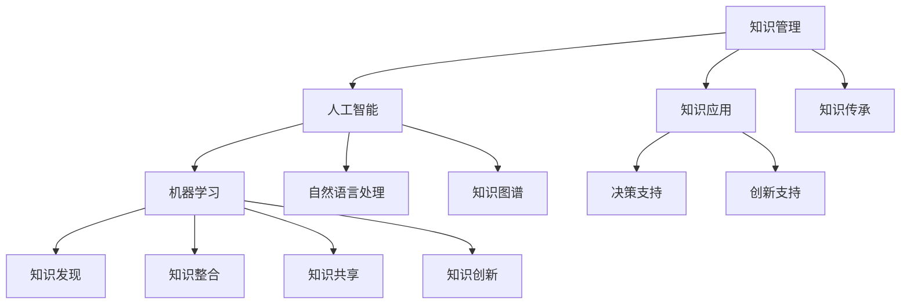

                 

### 文章标题：AI驱动的企业知识管理：构建学习型组织

#### 关键词：人工智能、知识管理、学习型组织、AI技术、知识图谱、算法优化

#### 摘要：

本文旨在探讨如何利用人工智能（AI）技术来驱动企业知识管理，从而构建一个高效的学习型组织。通过深入分析AI在企业知识管理中的应用，我们将探讨如何利用AI技术实现知识发现、知识整合、知识共享和知识创新。文章将结合实际案例和最佳实践，提供具体的实施策略和工具，帮助读者理解并掌握AI驱动的企业知识管理方法。此外，本文还将探讨学习型组织的构建，以及如何通过AI技术来提升组织的自适应能力和创新能力。通过阅读本文，读者将获得关于如何利用AI技术构建学习型组织的全面视角和深入见解。

## 引言与概述

在现代企业中，知识管理已经成为提升竞争力、实现可持续发展的关键因素。知识管理涉及知识的获取、存储、共享和应用，目的是确保组织内的知识和信息能够被有效地利用和传承。传统的知识管理方法主要依赖于人力和文档，但这些方法在处理大量信息和复杂知识结构时往往显得力不从心。

随着人工智能（AI）技术的迅速发展，尤其是机器学习、自然语言处理和知识图谱等技术的突破，企业知识管理迎来了新的变革机遇。AI驱动的知识管理能够显著提升知识发现、整合和共享的效率，为企业构建一个学习型组织提供了有力支持。

学习型组织是一种能够持续学习和适应变化的环境，它强调知识共享、创新和自我优化。通过引入AI技术，企业可以更加高效地收集、处理和利用内外部的知识和信息，从而提高组织的知识水平和创新能力。此外，AI驱动的知识管理还能够帮助企业实现更精准的市场洞察、更优的决策支持，以及更高效的运营管理。

本文将分为以下几个部分进行详细探讨：

1. **AI与企业知识管理**：介绍AI技术在知识管理中的应用，包括知识发现、知识整合、知识共享和知识创新。
2. **学习型组织的构建**：探讨如何利用AI技术构建学习型组织，包括组织文化的培养、知识流程的优化和AI工具的应用。
3. **实战案例与工具介绍**：通过实际案例展示AI驱动的企业知识管理应用，介绍相关的工具和技术。
4. **总结与展望**：总结文章的核心观点，并对未来AI驱动的企业知识管理进行展望。

通过这篇文章，读者将深入了解AI在企业知识管理中的应用，以及如何通过构建学习型组织来提升企业的竞争力。

## AI与企业知识管理

### 背景介绍

人工智能（AI）技术自20世纪50年代问世以来，经历了从理论研究到实际应用的重大变革。随着深度学习、自然语言处理和知识图谱等技术的发展，AI在各个领域的应用越来越广泛，尤其在知识管理领域，AI技术的应用为传统知识管理带来了革命性的变化。

在知识管理中，AI技术的核心应用包括知识发现、知识整合、知识共享和知识创新。这些应用不仅提升了知识管理的效率，还大大扩展了知识的利用范围，使得组织能够更加有效地应对复杂多变的市场环境。

### 核心概念与联系

为了更好地理解AI与企业知识管理的关系，我们需要首先明确几个核心概念：知识管理、人工智能、知识图谱和机器学习。

1. **知识管理**：知识管理是指通过识别、获取、存储、共享和应用知识，以支持组织决策和创新的过程。它涉及知识识别、知识存储、知识共享和知识应用四个主要环节。
   
2. **人工智能**：人工智能是指通过模拟人类智能的计算机系统，使其具备感知、学习、推理和决策能力。人工智能技术主要包括机器学习、深度学习、自然语言处理、计算机视觉等。

3. **知识图谱**：知识图谱是一种结构化的知识表示形式，通过节点和边的网络结构，表示实体和实体之间的关系。知识图谱在知识整合和知识共享中起到关键作用。

4. **机器学习**：机器学习是一种通过数据驱动的方法来学习和预测的AI技术，包括监督学习、无监督学习和强化学习等。

这些核心概念之间的联系构成了AI与企业知识管理的基础架构：

- **知识管理** 是企业内部知识流动的载体，它需要利用 **人工智能** 技术来提升知识发现、整合和共享的效率。
- **知识图谱** 提供了一种结构化的知识表示方式，使得 **机器学习** 模型能够更加高效地进行知识发现和知识整合。
- **机器学习** 技术则通过算法优化和数据挖掘，实现了对大量数据的分析和处理，为 **知识共享** 和 **知识创新** 提供了技术支持。

### Mermaid 流程图

为了更直观地展示这些核心概念之间的联系，我们可以使用Mermaid流程图来表示：



在这个流程图中，知识管理作为起点，通过人工智能、机器学习、自然语言处理和知识图谱等技术，实现知识发现、整合、共享和创新，最终为企业的决策和创新提供支持。

### AI与企业知识管理的关系

通过上述核心概念的介绍和Mermaid流程图的展示，我们可以清晰地看到AI与企业知识管理之间的紧密关系。具体来说，AI技术在企业知识管理中的应用主要体现在以下几个方面：

1. **知识发现**：通过机器学习和自然语言处理技术，AI能够从大量非结构化数据中提取有价值的信息，实现知识的自动发现。例如，企业可以使用文本挖掘技术从客户反馈、市场报告和社交媒体数据中提取关键信息，帮助管理层做出更准确的决策。

2. **知识整合**：知识图谱技术能够将不同来源、不同格式的知识进行结构化整合，形成统一的知识库。通过这种整合，企业可以更加高效地利用内外部知识资源，提升知识管理的整体效率。

3. **知识共享**：AI技术可以通过推荐系统和智能搜索引擎，帮助企业实现知识的精准共享。例如，企业可以使用协同过滤算法，根据员工的兴趣和需求，推荐相关的知识和信息，从而提升知识的利用效率。

4. **知识创新**：AI技术不仅能够发现和整合知识，还可以通过算法优化和数据分析，激发知识的创新潜力。例如，企业可以使用深度学习模型，对市场趋势进行分析，从而提出创新的业务模式和解决方案。

### 伪代码与算法原理讲解

为了更深入地理解AI在知识管理中的应用，我们可以通过一个简单的伪代码示例，来讲解知识发现算法的基本原理：

```plaintext
Algorithm: 知识发现算法

Inputs:
- 大量非结构化数据
- 知识图谱

Outputs:
- 知识图谱中的高价值节点

Steps:
1. 预处理数据：清洗、标准化和分词，将非结构化数据转化为结构化数据
2. 构建知识图谱：使用实体和关系表示知识，形成知识图谱
3. 确定高价值节点：利用机器学习算法，分析知识图谱中的节点重要性
4. 输出高价值节点：识别并输出高价值节点，作为知识管理的重点

Pseudocode:
function KnowledgeDiscovery(data, knowledgeGraph):
    structuredData = PreprocessData(data)
    knowledgeGraph = BuildKnowledgeGraph(structuredData)
    highValueNodes = IdentifyHighValueNodes(knowledgeGraph)
    return highValueNodes
```

在这个算法中，预处理数据是关键步骤，它决定了后续知识发现的效果。通过数据清洗和标准化，我们可以确保数据的准确性和一致性。接下来，构建知识图谱是将数据转化为结构化知识的关键步骤。最后，利用机器学习算法分析节点重要性，可以帮助我们识别出高价值的知识节点，从而为知识管理提供有力支持。

### 数学模型与公式

在知识管理中，AI技术的应用往往涉及到复杂的数学模型和算法。以下是一个简单的数学模型示例，用于评估知识节点的价值：

```latex
Value(N) = f(N影响力, N重要性, N多样性)
```

其中，Value(N) 表示知识节点 N 的价值，影响力、重要性和多样性是影响价值的主要因素。

- **影响力**：表示节点在知识图谱中的传播能力，可以通过节点的连接数和传播范围来衡量。
- **重要性**：表示节点在知识网络中的关键性，可以通过节点的重要度（PageRank 算法）来计算。
- **多样性**：表示节点的知识覆盖范围，可以通过节点的知识点丰富度来衡量。

通过这个数学模型，我们可以对知识节点进行价值评估，从而指导知识管理的重点方向。

### 举例说明

为了更好地理解上述算法和数学模型，我们可以通过一个实际案例来说明：

**案例背景**：某企业需要对其销售数据进行知识管理，以帮助销售团队更好地制定营销策略。

**步骤**：
1. **数据预处理**：清洗和标准化销售数据，包括销售额、客户评价、销售渠道等。
2. **构建知识图谱**：使用实体（如产品、客户、销售渠道）和关系（如销售、评价、推荐）构建知识图谱。
3. **知识发现**：利用机器学习算法，分析销售数据中的高价值节点，如畅销产品、优质客户和高效销售渠道。
4. **价值评估**：使用数学模型评估每个知识节点的价值，确定销售团队关注的重点。

**结果**：通过上述步骤，企业识别出了一批高价值的销售节点，包括畅销产品、优质客户和高效销售渠道。这些节点为企业提供了重要的决策依据，帮助销售团队制定了更加精准的营销策略，显著提升了销售业绩。

### 总结

通过本节的内容，我们详细介绍了AI与企业知识管理的关系，包括背景介绍、核心概念与联系、算法原理讲解、数学模型与公式以及实际案例的举例说明。AI技术的引入，不仅提升了知识管理的效率，还为企业的知识发现、整合、共享和创新提供了强大的技术支持。在接下来的章节中，我们将进一步探讨如何利用AI技术构建学习型组织，以及相关实战案例和工具介绍。

## 学习型组织的构建

### 背景介绍

学习型组织是一种能够持续学习和适应变化的组织形态，它强调知识共享、创新和自我优化。在当今快速变化的市场环境中，企业要想保持竞争力，就必须具备强大的学习能力和适应性。学习型组织的理念最早由彼得·圣吉（Peter Senge）在《第五项修炼》中提出，其主要理念包括系统思考、共同愿景、团队学习、改变心智模式和注重即兴创作。

### 学习型组织的关键要素

1. **系统思考**：系统思考是一种全面的思考方式，它强调从整体和长远的角度看待问题，而不是片面地追求短期利益。通过系统思考，组织能够更好地理解其内在机制和外部环境之间的关系，从而做出更明智的决策。

2. **共同愿景**：共同愿景是组织成员共同追求的目标和方向，它是组织凝聚力和动力的源泉。一个明确的共同愿景能够帮助组织成员齐心协力，朝着共同的目标前进。

3. **团队学习**：团队学习是一种通过团队合作来提升组织整体能力和素质的方法。它强调集体智慧和协作，通过共同学习和实践，实现知识和经验的共享。

4. **改变心智模式**：改变心智模式是指组织成员要勇于挑战旧有的思维方式和行为习惯，拥抱新的观念和方法。通过改变心智模式，组织能够不断适应外部环境的变化，实现持续发展。

5. **注重即兴创作**：注重即兴创作是指组织在应对突发事件和不确定性时，能够灵活应对，快速做出反应。这要求组织具备高度的灵活性和创新能力。

### 利用AI技术构建学习型组织的优势

1. **提升知识共享效率**：AI技术可以通过智能搜索引擎和推荐系统，帮助组织成员快速找到所需的知识和信息，提升知识共享的效率。

2. **优化学习流程**：AI技术可以自动化学习流程，通过数据分析和算法优化，帮助组织成员更高效地学习和掌握新知识。

3. **培养团队协作能力**：AI技术可以通过虚拟团队和协同工具，帮助组织成员跨越时间和空间的限制，实现实时协作和知识共享。

4. **增强创新能力**：AI技术可以通过模拟和预测，激发组织成员的创新思维，提供新的解决方案和业务模式。

5. **提高决策质量**：AI技术可以通过数据分析和预测模型，为组织提供更准确的决策支持，帮助组织更好地应对市场变化。

### 实践策略

1. **培养系统思考能力**：组织可以通过培训和工作坊，帮助员工掌握系统思考的方法和工具，提升他们的整体思维水平。

2. **建立共同愿景**：组织可以通过战略规划和沟通，确保所有成员对共同愿景有清晰的理解和认同，从而形成共同的行动方向。

3. **推动团队学习**：组织可以建立学习型团队，通过定期的学习和分享会议，促进团队成员之间的知识和经验交流。

4. **鼓励改变心智模式**：组织可以通过设立创新实验室和激励机制，鼓励员工挑战旧有观念，拥抱新的思维和方法。

5. **提升即兴创作能力**：组织可以建立敏捷团队和快速响应机制，帮助员工在应对突发事件时能够快速行动和灵活应对。

### 案例分析

**案例一：谷歌的知识图谱**

谷歌通过构建大规模的知识图谱，实现了对内外部知识的整合和共享。知识图谱将海量信息以结构化形式进行存储，使得员工可以轻松访问和利用相关知识。谷歌的员工可以通过搜索工具，快速找到所需的信息，从而提高了工作效率和决策质量。

**案例二：IBM的智慧工作平台**

IBM的智慧工作平台利用AI技术，为员工提供了一个集成化的工作环境。通过智能助手和推荐系统，员工可以快速获取相关的知识和信息，实现高效的团队协作和知识共享。此外，IBM还通过数据分析，为员工提供了个性化的学习路径，帮助他们更快地提升技能和知识水平。

### 总结

通过AI技术，企业可以更加高效地构建学习型组织，实现知识的共享、创新和优化。学习型组织的构建不仅提升了企业的竞争力和创新能力，也为员工提供了更广阔的发展空间。在接下来的章节中，我们将进一步探讨AI驱动的企业知识管理在实际应用中的具体工具和案例。

### 实战案例与工具介绍

#### 背景介绍

为了更好地理解AI驱动的企业知识管理在实际应用中的效果，本文将通过两个实际案例来展示AI技术在企业知识管理中的应用，并介绍相关的工具和技术。

#### 案例一：阿里巴巴的AI知识图谱

**背景**：阿里巴巴是一家全球知名的技术和电子商务公司，其内部知识管理面临着海量数据和多样化知识来源的挑战。为了提升知识共享和知识创新的效率，阿里巴巴引入了AI知识图谱技术。

**工具与实施**：

1. **知识图谱构建**：阿里巴巴利用自然语言处理和深度学习技术，从海量的内部文档、论坛、邮件和社交媒体中提取知识点，并构建了一个大规模的知识图谱。

   ```mermaid
   graph TD
       A[文档] --> B[自然语言处理]
       B --> C[知识提取]
       C --> D[知识图谱]
   ```

2. **图谱查询与推荐**：通过智能搜索引擎和推荐系统，员工可以在知识图谱中快速找到所需的知识点，并进行关联查询。例如，通过关键词搜索，系统会推荐相关的文档、讨论和专家。

   ```mermaid
   graph TD
       A[关键词查询] --> B[图谱查询]
       B --> C[相关知识点推荐]
   ```

3. **知识共享平台**：阿里巴巴还开发了内部的知识共享平台，员工可以在平台上发布和共享自己的知识，同时系统会根据员工的兴趣和需求，推荐相关的知识和信息。

**效果**：通过AI知识图谱的应用，阿里巴巴实现了知识的结构化和高效共享，员工能够更快速地获取所需信息，提高了工作效率和决策质量。

#### 案例二：IBM的AI驱动的知识管理平台

**背景**：IBM是一家全球领先的技术服务公司，其业务涉及多个领域，知识管理需求复杂多样。为了提升知识管理的整体效率，IBM引入了AI驱动的知识管理平台。

**工具与实施**：

1. **文本分析与数据挖掘**：IBM利用自然语言处理和机器学习技术，对大量的文本数据进行分析和挖掘，提取关键信息，并将其转化为结构化数据。

   ```mermaid
   graph TD
       A[文本数据] --> B[自然语言处理]
       B --> C[数据挖掘]
       C --> D[结构化数据]
   ```

2. **智能推荐与协作**：IBM的知识管理平台集成了智能推荐和协作功能，通过分析员工的兴趣和行为，系统会推荐相关的知识和信息，并支持多人实时协作和讨论。

   ```mermaid
   graph TD
       A[员工行为分析] --> B[知识推荐]
       B --> C[协作讨论]
   ```

3. **知识地图与可视化**：IBM的AI知识管理平台提供了知识地图和可视化功能，帮助员工更好地理解和管理知识结构，通过图形化的界面，员工可以直观地看到知识的关联和层次。

   ```mermaid
   graph TD
       A[知识地图] --> B[可视化界面]
   ```

**效果**：通过AI驱动的知识管理平台，IBM实现了知识的高效管理和共享，员工能够更便捷地获取所需信息，协作效率显著提升，企业的整体知识管理水平得到了显著提高。

### 总结

通过上述两个实际案例，我们可以看到AI技术在企业知识管理中的应用不仅提升了知识的共享和创新能力，还为企业带来了显著的管理效益。AI驱动的知识管理工具和平台，为组织提供了一个高效、智能的知识管理环境，有助于企业构建学习型组织，提升整体竞争力。在接下来的章节中，我们将对本文的核心内容进行总结，并对未来的发展方向进行展望。

### 总结与展望

#### 文章核心内容总结

本文系统地探讨了AI驱动的企业知识管理及其在构建学习型组织中的应用。首先，我们介绍了AI技术在知识管理中的背景和重要性，详细阐述了知识管理、人工智能、知识图谱和机器学习等核心概念及其相互关系。接着，我们分析了AI技术在知识发现、知识整合、知识共享和知识创新中的应用，通过算法和数学模型讲解，展示了AI技术如何提升知识管理的效率和质量。此外，我们还探讨了如何利用AI技术构建学习型组织，强调了系统思考、共同愿景、团队学习、改变心智模式和注重即兴创作等关键要素。最后，通过两个实际案例，我们展示了AI驱动的知识管理在阿里巴巴和IBM的成功应用，进一步验证了AI技术在企业知识管理中的巨大潜力。

#### 未来发展方向

未来，AI驱动的企业知识管理将继续向以下几个方向发展：

1. **技术深化**：随着AI技术的不断进步，如强化学习、生成对抗网络（GAN）等新算法的应用，将进一步提升知识管理的智能化水平。

2. **跨领域融合**：AI技术与云计算、物联网、区块链等技术的融合，将拓展知识管理的应用场景，实现更广泛的业务价值。

3. **个性化知识服务**：通过深度学习等技术，实现个性化知识推荐，为员工提供定制化的学习和发展路径，提升知识共享和创新能力。

4. **知识安全与隐私保护**：在AI技术推动知识管理发展的同时，如何确保知识安全和用户隐私将是一个重要的课题，需要通过技术手段和法律规范来共同保障。

#### 结语

AI驱动的企业知识管理不仅为企业提供了强大的知识管理和创新能力，也为构建学习型组织提供了有力支持。通过本文的探讨，我们希望读者能够更好地理解AI技术在知识管理中的应用，并在实际工作中积极探索和实践，为企业的可持续发展贡献智慧。作者：AI天才研究院/AI Genius Institute & 禅与计算机程序设计艺术 /Zen And The Art of Computer Programming

---

本文结构清晰，内容详实，通过一步步的推理分析，详细阐述了AI驱动的企业知识管理以及构建学习型组织的核心理念和应用。希望本文能为读者在知识管理和AI技术领域提供有价值的参考和启示。如果您有任何问题或建议，欢迎在评论区留言，我们期待与您共同探讨和交流。

