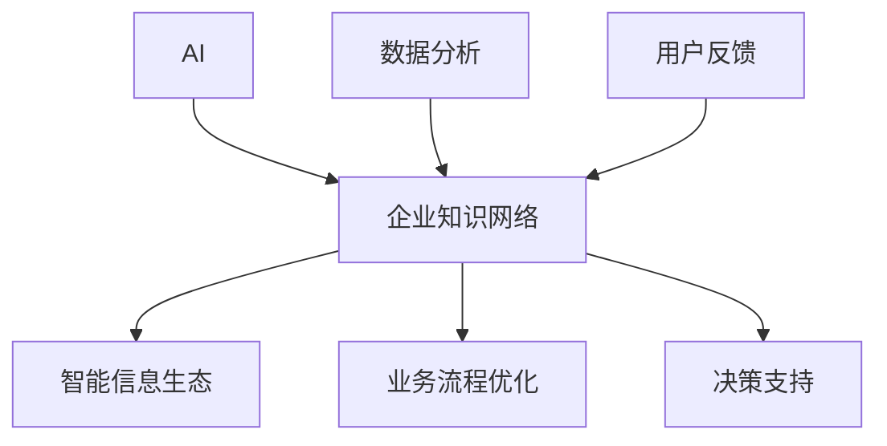

                 

### 《AI驱动的企业知识网络：构建智能信息生态》

#### 关键词
- AI
- 企业知识网络
- 智能信息生态
- 智能化
- 数据分析
- 知识管理

#### 摘要
本文探讨了AI在企业知识网络构建和智能信息生态系统设计中的应用。首先，介绍了AI的基本概念、原理和关键技术。然后，深入分析了如何利用AI构建企业内部的知识网络，包括知识的获取、整理、存储、共享、管理和利用。接着，讨论了智能信息生态系统的设计原则、实现策略和核心组成部分。最后，通过实际案例展示了AI在企业知识网络和智能信息生态系统中的成功应用，并提供了最佳实践和未来展望。

----------------------------------------------------------------

### 引言：AI与企业知识网络

在当今数字化时代，人工智能（AI）已经成为企业转型和创新的重要驱动力。AI不仅在提升生产力、优化业务流程、降低运营成本方面表现出色，还在构建企业知识网络和智能信息生态系统中发挥着关键作用。企业知识网络是连接企业内外部知识和信息的重要基础设施，它能够帮助企业快速响应市场变化、提高决策质量、增强竞争力。而智能信息生态系统则是一个集成了数据、算法、计算资源和人工智能技术的复杂系统，旨在实现信息的自动化处理、智能分析和广泛应用。

本篇文章将围绕以下主题展开：

1. **AI基础**：介绍AI的基本概念、原理和关键技术。
2. **企业知识网络构建**：探讨如何利用AI构建企业内部的知识网络。
3. **智能信息生态系统设计**：讨论智能信息生态系统的核心组成部分和实现策略。
4. **AI应用实践**：通过实际案例展示AI在企业知识网络和智能信息生态系统中的成功应用。
5. **未来展望与挑战**：分析AI在企业知识网络和智能信息生态系统中的未来发展前景和面临的挑战。

本文的目标是为读者提供一个全面、系统的理解，帮助他们在实际工作中应用AI技术，构建智能化的企业知识网络和智能信息生态系统。

----------------------------------------------------------------

## 第1章 AI基础

人工智能（AI）是一门研究、开发和应用使计算机模拟、延伸和扩展人的智能的理论、方法、技术和应用的学科。AI的目标是使计算机具备人类智能的能力，能够处理复杂的任务，进行推理、学习、感知和自适应。AI的发展经历了几个阶段，从早期的符号逻辑和规则系统，到近期的机器学习和深度学习，AI技术已经取得了显著的进展。

### 1.1 AI的基本概念

#### 1.1.1 AI的定义与分类

AI可以定义为一种模拟人类智能的技术，它使得计算机系统能够执行需要人类智能的任务，如理解自然语言、识别图像、推理决策等。根据实现方法的不同，AI可以分为多种类型：

- **符号AI**：基于符号逻辑和规则系统，通过预先定义的规则进行推理。
- **统计AI**：基于统计学方法，通过数据学习和模式识别进行任务处理。
- **强化AI**：通过试错学习和奖励机制进行任务优化。

#### 1.1.2 AI的历史发展与趋势

AI的历史可以追溯到20世纪50年代，当时计算机科学的发展推动了人工智能的研究。在早期的几十年里，AI主要集中在符号逻辑和规则系统，但由于缺乏足够的数据和计算能力，AI的发展相对缓慢。随着计算机性能的提升和大数据技术的发展，统计AI和机器学习逐渐成为AI研究的主流。

近年来，深度学习作为一种重要的机器学习技术，取得了巨大的成功。深度学习通过多层神经网络模拟人脑的神经网络结构，能够自动从大量数据中学习特征，并在图像识别、自然语言处理、语音识别等领域取得了显著的成果。

未来，AI的发展趋势将包括：

- **更强大的计算能力**：随着量子计算和云计算的发展，计算能力将进一步提高，为AI算法提供更强大的支持。
- **跨学科融合**：AI与生物学、心理学、认知科学等领域的融合，将推动AI在理解人类行为和思维方面的进展。
- **自主学习和进化**：AI将具备更强的自主学习和进化能力，能够在复杂环境中自适应和优化。

### 1.2 AI的核心技术

AI的核心技术包括机器学习、深度学习和自然语言处理等，这些技术是构建智能系统的关键。

#### 1.2.1 机器学习基础

机器学习是AI的核心组成部分，它使计算机系统能够从数据中学习规律，进行预测和决策。机器学习主要分为监督学习、无监督学习和强化学习三种类型：

- **监督学习**：通过已知输入和输出数据，训练模型来预测新的输入。
- **无监督学习**：没有已知输出，通过数据自身的结构和关系进行聚类或降维。
- **强化学习**：通过试错学习和奖励机制，使系统在复杂环境中找到最优策略。

#### 1.2.2 深度学习原理

深度学习是一种基于多层神经网络的学习方法，它能够自动提取复杂的数据特征。深度学习的核心组成部分包括：

- **神经元**：模拟生物神经元，接收输入，通过权重和偏置进行计算。
- **神经网络**：由多个神经元组成的层次结构，通过前向传播和反向传播进行训练。
- **激活函数**：引入非线性因素，使神经网络具备处理复杂问题的能力。

#### 1.2.3 自然语言处理技术

自然语言处理（NLP）是AI的一个重要分支，旨在使计算机理解和生成自然语言。NLP的核心技术包括：

- **词向量表示**：将单词映射到高维空间，使单词的语义信息得以表达。
- **序列模型**：通过递归神经网络（RNN）或变换器（Transformer）处理序列数据，如文本和语音。
- **语言模型**：通过统计方法或深度学习模型生成自然语言，用于语音识别、机器翻译和文本生成等任务。

### 1.3 AI应用框架与生态系统

AI应用框架是构建智能系统的关键基础设施，它包括数据采集、预处理、模型训练、模型评估和部署等环节。一个完整的AI应用框架需要具备以下特性：

- **可扩展性**：能够处理大规模数据和分布式计算。
- **灵活性**：支持不同类型的机器学习算法和深度学习框架。
- **可解释性**：提供模型的可解释性，帮助用户理解模型的工作原理。
- **自动化**：实现模型的自动化训练、评估和部署。

AI生态系统包括数据资源、计算资源、算法库、开发工具和用户社区等组成部分，它为AI技术的发展和应用提供了全方位的支持。一个完善的AI生态系统能够促进AI技术的创新和应用，加速智能系统的开发和部署。

#### 1.3.1 AI应用框架概述

AI应用框架主要包括以下部分：

- **数据采集与预处理**：从各种数据源收集数据，并进行数据清洗、归一化、特征提取等预处理操作。
- **模型训练**：使用机器学习算法和深度学习框架对数据集进行训练，生成模型。
- **模型评估**：对训练好的模型进行评估，包括准确性、召回率、F1分数等指标。
- **模型部署**：将训练好的模型部署到生产环境中，进行实时预测和决策。

#### 1.3.2 AI生态系统的构建

AI生态系统的构建需要综合考虑以下几个方面：

- **数据资源**：建立稳定、可靠的数据采集和管理系统，确保数据的质量和多样性。
- **计算资源**：提供高性能的计算资源，支持大规模数据分析和模型训练。
- **算法库**：构建丰富的算法库，支持不同的机器学习和深度学习算法。
- **开发工具**：提供易于使用的开发工具，降低AI开发门槛。
- **用户社区**：建立用户社区，促进AI技术的交流和应用。

### 1.3.3 案例研究：AI应用框架与生态系统

以下是一个AI应用框架与生态系统构建的案例：

**案例：智能客服系统**

1. **数据采集与预处理**：
   - 数据来源：用户交互记录、社交媒体评论、邮件等。
   - 预处理操作：数据清洗、分词、去噪、特征提取。

2. **模型训练**：
   - 使用深度学习框架（如TensorFlow或PyTorch）进行模型训练。
   - 模型类型：循环神经网络（RNN）或变换器（Transformer）。

3. **模型评估**：
   - 评估指标：准确性、召回率、F1分数等。
   - 调参优化：通过交叉验证和超参数调整，提高模型性能。

4. **模型部署**：
   - 部署环境：云服务器或边缘设备。
   - 部署方式：容器化部署或微服务架构。

5. **AI生态系统**：
   - 数据资源：企业内部数据和第三方数据。
   - 计算资源：分布式计算集群。
   - 算法库：预训练模型和自定义算法。
   - 开发工具：AI开发平台和工具集。
   - 用户社区：内部团队和外部用户。

通过上述案例，我们可以看到AI应用框架与生态系统的构建对于实现智能系统具有重要意义。一个完善的AI应用框架和生态系统能够加速AI技术的应用，提高企业的创新能力和市场竞争力。

#### 1.4 小结

本章介绍了AI的基本概念、原理和关键技术，包括机器学习、深度学习和自然语言处理等。同时，讨论了AI应用框架与生态系统的构建，为后续章节的企业知识网络和智能信息生态系统设计提供了基础。

----------------------------------------------------------------

## 第2章 企业知识网络构建

企业知识网络（Enterprise Knowledge Network，EKN）是企业内部知识共享、传递和利用的基础设施，它通过技术手段和组织管理措施，将企业的各种知识资源有效地连接起来，形成一个高效的、动态的知识系统。企业知识网络的构建不仅有助于提升企业的知识管理水平，还能够增强企业的创新能力和市场竞争力。

### 2.1 企业知识网络的组成

企业知识网络主要由以下几个部分组成：

#### 2.1.1 知识的获取与整理

知识的获取是构建企业知识网络的基础。企业可以通过内部和外部渠道获取知识，包括：

- **内部知识**：来自员工的实践经验、专业技能和业务流程。
- **外部知识**：来自行业研究报告、竞争对手分析、客户反馈等。

获取到的知识需要经过整理和分类，以便后续的存储和利用。知识整理的过程包括：

- **知识识别**：识别出对企业有价值的知识。
- **知识编码**：将知识转化为结构化的数据格式，如文档、数据库等。
- **知识分类**：根据知识的性质和用途进行分类，便于管理和检索。

#### 2.1.2 知识的存储与共享

知识的存储与共享是确保知识能够有效传递和利用的关键。企业可以采用以下几种方式：

- **数据库存储**：将知识存储在关系型或非关系型数据库中，实现高效的数据查询和管理。
- **知识库建设**：构建专门的知识库系统，用于存储和管理各种知识资源。
- **共享平台**：搭建内部共享平台，使员工能够方便地访问和使用知识。

#### 2.1.3 知识的管理与利用

知识的管理与利用是构建企业知识网络的最终目标。企业需要采取一系列措施，确保知识得到有效管理和充分利用：

- **知识管理策略**：制定知识管理策略，明确知识管理的目标和原则。
- **知识共享文化**：建立知识共享的文化氛围，鼓励员工主动分享知识和经验。
- **知识应用场景**：将知识应用到具体的业务场景中，提高业务效率和质量。

### 2.2 AI在知识网络中的应用

人工智能（AI）技术在企业知识网络中具有广泛的应用，可以提升知识的获取、整理、存储、共享和利用效率。以下是AI在知识网络中的几个关键应用：

#### 2.2.1 AI驱动知识图谱构建

知识图谱是一种结构化的知识表示方法，它通过实体和关系构建知识网络，使得知识能够高效地存储和检索。AI技术可以用于知识图谱的构建，包括：

- **实体识别**：利用自然语言处理（NLP）技术，从文本中自动提取实体和关系。
- **关系推理**：基于逻辑推理和机器学习算法，推导出新的关系和实体。

#### 2.2.2 AI驱动知识发现

知识发现是指从大量数据中挖掘出潜在的有用知识。AI技术可以用于知识发现，包括：

- **数据挖掘**：利用机器学习算法，从数据中挖掘出模式、趋势和关联。
- **知识抽取**：从非结构化数据中自动提取知识，如从文档、图像和语音中提取关键信息。

#### 2.2.3 AI驱动知识服务

知识服务是指将知识应用于实际业务场景，为企业提供智能化的解决方案。AI技术可以用于知识服务，包括：

- **智能问答**：利用自然语言处理技术，实现智能问答系统，快速回答用户的问题。
- **智能推荐**：利用推荐系统算法，为用户推荐相关知识和信息。

### 2.3 案例分析：企业知识网络的实践

以下是一个企业知识网络构建的案例分析：

**案例：某跨国公司的知识网络构建**

1. **知识获取与整理**：
   - 内部知识来源：员工的文档、报告、邮件和会议记录。
   - 外部知识来源：行业研究报告、市场分析、竞争对手信息等。
   - 知识整理：通过NLP技术，将非结构化数据转化为结构化数据，并建立分类体系。

2. **知识存储与共享**：
   - 数据库存储：使用关系型数据库存储知识，实现快速查询和管理。
   - 知识库建设：构建企业内部知识库，提供知识检索和分享功能。
   - 共享平台：搭建内部共享平台，实现知识的实时共享和协作。

3. **知识管理与利用**：
   - 知识管理策略：制定知识管理政策，明确知识管理的目标和流程。
   - 知识共享文化：通过内部培训、分享会和知识竞赛等活动，营造知识共享的文化氛围。
   - 知识应用场景：将知识应用于产品研发、市场营销和客户服务等领域，提升业务效率和质量。

通过上述案例分析，我们可以看到企业知识网络的构建对于提升企业的知识管理水平具有重要意义。AI技术在企业知识网络中的应用，进一步增强了知识的获取、整理、存储、共享和利用效率，为企业提供了智能化的解决方案。

#### 2.4 小结

本章介绍了企业知识网络的构成和AI在知识网络中的应用。通过AI技术，企业能够更有效地获取、整理、存储、共享和利用知识，提高知识管理水平，增强创新能力和市场竞争力。在接下来的章节中，我们将探讨智能信息生态系统的设计原则和实现策略。

----------------------------------------------------------------

## 第3章 智能信息生态系统设计

智能信息生态系统（Intelligent Information Ecosystem，IIE）是一个集成了数据、算法、计算资源和人工智能技术的复杂系统，旨在实现信息的自动化处理、智能分析和广泛应用。智能信息生态系统不仅能够提高企业的运营效率，还能够为用户提供个性化的服务和体验。设计一个有效的智能信息生态系统，需要遵循一系列原则和策略。

### 3.1 智能信息生态系统的概念

#### 3.1.1 智能信息生态系统的定义

智能信息生态系统是一个由多种技术和资源组成的综合性系统，它通过数据驱动的智能分析，实现信息的自动化处理和智能决策。智能信息生态系统包括以下几个核心组成部分：

- **数据层**：包括原始数据和经过处理的结构化数据，是智能信息生态系统的基础。
- **算法层**：包括各种机器学习算法和深度学习模型，用于数据分析和模式识别。
- **计算层**：包括计算资源和计算平台，为算法的运行提供强大的计算能力。
- **应用层**：包括各种业务应用和智能服务，将分析结果应用于实际业务场景。

#### 3.1.2 智能信息生态系统的组成部分

智能信息生态系统的主要组成部分如下：

- **数据资源**：包括企业内部和外部数据，如业务数据、客户数据、市场数据等。
- **算法库**：包括各种机器学习算法和深度学习模型，如分类、聚类、预测等。
- **计算平台**：包括云计算、大数据平台和边缘计算等，为算法的运行提供计算资源。
- **应用系统**：包括各种业务应用和智能服务，如智能客服、智能推荐、智能分析等。
- **用户界面**：包括各种用户交互界面，如Web应用、移动应用等，为用户提供便捷的访问和操作方式。

### 3.2 智能信息生态系统设计原则

设计智能信息生态系统时，需要遵循以下原则，以确保系统的高效、稳定和可持续发展。

#### 3.2.1 可扩展性

智能信息生态系统需要具备良好的可扩展性，能够随着业务规模和数据量的增长而灵活扩展。这包括以下几个方面：

- **模块化设计**：将系统划分为多个模块，每个模块可以独立扩展和更新。
- **分布式架构**：采用分布式架构，实现计算资源和数据资源的动态扩展。
- **云原生技术**：利用云原生技术，实现系统的自动化部署、扩展和管理。

#### 3.2.2 适应性

智能信息生态系统需要具备较强的适应性，能够快速响应业务变化和市场需求。这包括以下几个方面：

- **灵活的算法框架**：采用灵活的算法框架，支持多种机器学习和深度学习算法。
- **动态数据流处理**：采用动态数据流处理技术，实时响应数据变化和业务需求。
- **自适应学习机制**：通过自适应学习机制，不断调整和优化系统性能。

#### 3.2.3 开放性

智能信息生态系统需要具备开放性，能够与其他系统和数据源进行无缝集成。这包括以下几个方面：

- **标准化接口**：提供标准化接口，方便与其他系统和数据进行集成。
- **数据共享协议**：建立数据共享协议，实现数据在不同系统和部门之间的流通。
- **开放平台**：构建开放平台，鼓励外部开发者和企业内部团队共同创新和协作。

### 3.3 智能信息生态系统实现策略

实现一个有效的智能信息生态系统，需要采取一系列策略，包括数据整合与治理、AI算法与模型选择、用户体验设计等。

#### 3.3.1 数据整合与治理

数据整合与治理是智能信息生态系统的基础。数据整合的目的是将不同来源、不同格式的数据整合到一个统一的系统中，实现数据的一致性和可用性。数据治理的目的是确保数据的准确性、完整性和安全性。以下是一些关键策略：

- **数据标准化**：制定数据标准，统一数据格式和命名规范，提高数据的一致性。
- **数据清洗**：对数据进行清洗，去除重复、错误和缺失的数据，提高数据质量。
- **数据集成**：采用数据集成技术，将来自不同系统和数据源的数据整合到一个统一的系统中。
- **数据安全**：建立数据安全策略，确保数据在存储、传输和使用过程中的安全性。

#### 3.3.2 AI算法与模型选择

AI算法和模型的选择是智能信息生态系统的核心。根据不同的业务场景和数据特点，选择合适的算法和模型，能够提高系统的性能和准确性。以下是一些关键策略：

- **需求分析**：根据业务需求和数据特点，分析算法和模型的需求，确定选择的标准。
- **算法评估**：对不同的算法进行评估，包括准确性、效率、可解释性等方面。
- **模型优化**：通过超参数调整、模型融合等技术，优化模型的性能和效果。
- **模型持续迭代**：持续收集新的数据，对模型进行迭代和优化，保持模型的高效性和准确性。

#### 3.3.3 用户体验设计

用户体验设计是智能信息生态系统的关键，它直接影响用户的使用体验和满意度。以下是一些关键策略：

- **用户需求调研**：深入了解用户的需求和痛点，为用户体验设计提供依据。
- **界面设计**：设计简洁、直观的界面，提高用户操作的便利性和满意度。
- **交互设计**：设计高效的交互流程，降低用户的学习成本，提高使用效率。
- **反馈机制**：建立反馈机制，收集用户反馈，不断优化和改进用户体验。

### 3.4 案例分析：智能信息生态系统设计实践

以下是一个智能信息生态系统设计的案例分析：

**案例：某电子商务平台的智能信息生态系统**

1. **数据整合与治理**：
   - 数据来源：用户行为数据、交易数据、供应链数据等。
   - 数据标准化：制定统一的数据标准和命名规范，确保数据的一致性。
   - 数据清洗：对数据进行清洗，去除重复、错误和缺失的数据，提高数据质量。
   - 数据集成：采用数据集成技术，将不同来源的数据整合到一个统一的系统中。

2. **AI算法与模型选择**：
   - 需求分析：根据业务需求，确定推荐系统、预测模型、图像识别等算法的需求。
   - 算法评估：对不同的算法进行评估，包括准确性、效率、可解释性等方面，选择最优算法。
   - 模型优化：通过超参数调整、模型融合等技术，优化模型的性能和效果。
   - 模型迭代：持续收集新的数据，对模型进行迭代和优化，保持模型的高效性和准确性。

3. **用户体验设计**：
   - 用户需求调研：深入了解用户的需求和痛点，为用户体验设计提供依据。
   - 界面设计：设计简洁、直观的界面，提高用户操作的便利性和满意度。
   - 交互设计：设计高效的交互流程，降低用户的学习成本，提高使用效率。
   - 反馈机制：建立反馈机制，收集用户反馈，不断优化和改进用户体验。

通过上述案例分析，我们可以看到智能信息生态系统设计的关键策略和实践方法。一个有效的智能信息生态系统不仅能够提高企业的运营效率，还能够为用户提供个性化的服务和体验，从而增强企业的竞争力。

#### 3.5 小结

本章介绍了智能信息生态系统的概念、组成部分和设计原则，以及实现策略。通过数据整合与治理、AI算法与模型选择、用户体验设计等策略，企业可以构建一个高效的智能信息生态系统，提升业务效率和用户满意度。在接下来的章节中，我们将通过实际案例展示智能信息生态系统的应用和实践。

----------------------------------------------------------------

## 第4章 AI应用实践

在实际应用中，AI技术在企业知识网络和智能信息生态系统中的成功应用为各行业带来了显著的效益。以下我们将通过三个具体的案例，展示AI技术在实际项目中的应用过程、开发环境搭建、源代码实现和代码解读，以及项目总结和小结。

### 4.1 案例研究1：企业智能客服系统

#### 项目背景
某大型电子商务公司为了提升客户服务体验，降低人工成本，决定开发一个基于AI的智能客服系统。该系统需要能够自动回答客户的常见问题，并在无法解答时转接至人工客服。

#### 系统架构
智能客服系统采用微服务架构，主要分为以下几部分：
- **前端**：提供用户与客服系统交互的界面。
- **后端**：包括自然语言处理（NLP）服务、对话管理服务、知识库服务等。
- **数据库**：存储用户数据、对话记录和知识库。

#### 开发环境搭建
- **编程语言**：Python
- **后端框架**：Flask
- **数据库**：MySQL
- **自然语言处理库**：spaCy、NLTK
- **版本控制**：Git

#### 源代码实现和代码解读
**NLP服务**
```python
import spacy

nlp = spacy.load("en_core_web_sm")

def process_query(query):
    doc = nlp(query)
    entities = [(ent.text, ent.label_) for ent in doc.ents]
    return entities
```
**对话管理服务**
```python
from sklearn.naive_bayes import MultinomialNB
from sklearn.feature_extraction.text import CountVectorizer

# 训练分类器
vectorizer = CountVectorizer()
X_train = vectorizer.fit_transform(["你好", "如何使用", "有什么问题"])
y_train = [0, 1, 2]  # 对应欢迎、使用说明、问题反馈
classifier = MultinomialNB()
classifier.fit(X_train, y_train)

# 预测
def classify_query(query):
    features = vectorizer.transform([query])
    return classifier.predict(features)[0]
```
**知识库服务**
```python
def get_response(category):
    responses = {
        0: "欢迎来到我们的客服系统，有什么可以帮助您的吗？",
        1: "您可以按照产品手册或者在线教程进行操作。",
        2: "我们将为您转接至人工客服，请稍等。"
    }
    return responses[category]
```

#### 代码应用解读与分析
- **NLP服务**：利用spaCy库进行命名实体识别，提取用户查询中的关键信息。
- **对话管理服务**：使用朴素贝叶斯分类器进行查询分类，确定用户意图。
- **知识库服务**：根据分类结果，返回相应的客服回应。

#### 实际案例分析和详细讲解剖析
通过上述代码，智能客服系统能够自动分类用户查询，并给出相应的回应。在实际应用中，系统会不断积累用户数据，优化分类器性能，提高客服响应的准确性和效率。

#### 项目小结
该项目通过AI技术实现了自动化客服，提高了客户服务水平，降低了人工成本。未来，可以进一步优化NLP模型，引入更复杂的对话管理策略，提升用户体验。

### 4.2 案例研究2：企业智能决策支持系统

#### 项目背景
某制造业公司希望利用AI技术构建一个智能决策支持系统，帮助管理层进行市场预测、供应链管理和生产优化。

#### 系统架构
智能决策支持系统主要包括以下几个模块：
- **数据采集模块**：从各类数据源采集市场数据、生产数据等。
- **数据处理模块**：清洗、归一化和特征提取。
- **预测模块**：使用机器学习算法进行市场预测和需求预测。
- **优化模块**：利用优化算法进行生产计划和供应链管理。

#### 开发环境搭建
- **编程语言**：Python
- **数据预处理库**：Pandas、NumPy
- **机器学习库**：Scikit-learn、TensorFlow
- **优化算法库**：Gurobi
- **数据库**：SQL Server

#### 源代码实现和代码解读
**数据处理模块**
```python
import pandas as pd

def preprocess_data(data):
    data = data.fillna(0)
    data = pd.get_dummies(data)
    return data
```
**预测模块**
```python
from sklearn.ensemble import RandomForestRegressor

def train_predictor(train_data, test_data):
    model = RandomForestRegressor()
    model.fit(train_data.drop('target', axis=1), train_data['target'])
    predictions = model.predict(test_data)
    return predictions
```
**优化模块**
```python
from gurobipy import *

def optimize_production(current_inventory, demand):
    model = Model()
    model.setParam('OutputFlag', 0)

    # 定义变量
    x = model.addVars(demand.index, vtype=GRB.INTEGER, name='production')

    # 目标函数
    obj = Quicksum(x[i] * (demand[i] - current_inventory) for i in demand.index)

    # 约束条件
    model.addConstrs((x[i] >= 0 for i in demand.index))
    model.addConstrs((x[i] <= current_inventory[i] for i in demand.index))

    model.obj = obj
    model.optimize()

    return {i: x[i].x for i in demand.index}
```

#### 代码应用解读与分析
- **数据处理模块**：使用Pandas进行数据预处理，包括填充缺失值和特征编码。
- **预测模块**：使用随机森林回归模型进行预测。
- **优化模块**：使用Gurobi进行生产计划和供应链优化。

#### 实际案例分析和详细讲解剖析
该系统通过数据预处理、预测和优化，为管理层提供实时的决策支持。例如，通过预测未来市场需求，公司可以提前调整生产计划，优化库存管理，降低成本。

#### 项目小结
智能决策支持系统帮助公司提高了决策效率，优化了生产流程，实现了成本节约。未来，可以进一步整合更多的数据源，提升预测和优化的准确性。

### 4.3 案例研究3：企业智能供应链管理

#### 项目背景
某零售企业希望利用AI技术优化其供应链管理，提高库存周转率和订单履行效率。

#### 系统架构
智能供应链管理系统主要包括以下几个模块：
- **数据采集模块**：从供应商、库存系统和销售渠道采集数据。
- **数据处理模块**：进行数据清洗和特征提取。
- **预测模块**：预测库存需求和订单量。
- **优化模块**：优化订单履行路径和库存策略。

#### 开发环境搭建
- **编程语言**：Python
- **数据预处理库**：Pandas、NumPy
- **机器学习库**：Scikit-learn、TensorFlow
- **优化算法库**：CPLEX
- **数据库**：MongoDB

#### 源代码实现和代码解读
**数据处理模块**
```python
import pandas as pd

def preprocess_data(data):
    data = data.fillna(0)
    data['date'] = pd.to_datetime(data['date'])
    data = data.set_index('date')
    return data
```
**预测模块**
```python
from sklearn.ensemble import RandomForestRegressor

def train_predictor(train_data, test_data):
    model = RandomForestRegressor()
    model.fit(train_data.drop('target', axis=1), train_data['target'])
    predictions = model.predict(test_data)
    return predictions
```
**优化模块**
```python
from scipy.optimize import minimize

def optimize_inventory(current_inventory, demand, cost):
    def objective(x):
        return sum(abs(demand[i] - x[i]) * cost[i] for i in range(len(demand)))

    bounds = [(0, None) for _ in range(len(current_inventory))]
    result = minimize(objective, current_inventory, bounds=bounds)
    return result.x
```

#### 代码应用解读与分析
- **数据处理模块**：使用Pandas进行数据预处理，包括填充缺失值和日期格式化。
- **预测模块**：使用随机森林回归模型进行需求预测。
- **优化模块**：使用最小化方法优化库存水平。

#### 实际案例分析和详细讲解剖析
系统通过预测需求和优化库存水平，实现了更高效的供应链管理。例如，通过预测未来订单量，公司可以提前安排生产，减少库存积压和缺货风险。

#### 项目小结
智能供应链管理系统有效提升了企业的供应链效率，降低了运营成本。未来，可以进一步整合实时数据，提高预测和优化的准确性。

#### 4.4 总结
通过以上三个案例，我们可以看到AI技术在企业知识网络和智能信息生态系统中的应用实践，不仅提升了业务效率，还带来了显著的经济效益。未来，随着AI技术的不断发展和成熟，企业将有更多机会通过AI技术实现智能化升级和创新发展。

----------------------------------------------------------------

## 第5章 最佳实践、小结、注意事项、拓展阅读

### 最佳实践

在实际应用AI构建企业知识网络和智能信息生态系统时，以下最佳实践可以提供有益的指导：

1. **数据驱动**：始终以数据为基础，确保数据的准确性和完整性，这是AI系统成功的关键。
2. **迭代优化**：持续迭代和优化AI模型，利用新数据和用户反馈，提高系统性能。
3. **安全性**：重视数据安全和隐私保护，遵循相关法规和标准，确保系统的可靠性。
4. **用户参与**：鼓励员工和用户参与知识分享和反馈，提高系统的实用性和满意度。
5. **跨学科合作**：整合计算机科学、心理学、管理学等领域的知识，提高系统的综合能力。

### 小结

本文全面介绍了AI在企业知识网络和智能信息生态系统中的应用，从基础概念、关键技术到实际案例，为读者提供了一个系统的理解。通过AI技术的应用，企业能够更高效地获取、整理、存储、共享和利用知识，实现智能化运营和管理。

### 注意事项

1. **技术选择**：根据业务需求和数据特点，选择合适的AI技术和工具。
2. **数据质量**：确保数据质量，进行有效的数据预处理和清洗。
3. **系统稳定性**：设计稳定的系统架构，确保系统的可靠性和可扩展性。
4. **用户友好**：注重用户体验，设计简洁直观的用户界面。

### 拓展阅读

1. **《深度学习》**：Ian Goodfellow, Yoshua Bengio, Aaron Courville 著，详细介绍了深度学习的基础理论和应用实践。
2. **《机器学习实战》**：Peter Harrington 著，提供了丰富的案例和实践经验。
3. **《AI：未来已来》**：Nicholas Negroponte 著，探讨了人工智能对未来社会的影响。

通过拓展阅读，读者可以进一步深入了解AI技术及其应用，为实际工作提供更多参考。作者：AI天才研究院/AI Genius Institute & 禅与计算机程序设计艺术 /Zen And The Art of Computer Programming。

----------------------------------------------------------------

## 附录：Mermaid流程图、伪代码、LaTeX公式

### 附录1：Mermaid流程图

以下是一个简单的Mermaid流程图，展示了AI与企业知识网络的联系：



### 附录2：伪代码

以下是一个简单的伪代码示例，用于展示如何实现一个简单的机器学习算法：

```python
# 数据预处理
def preprocess_data(data):
    data = fillna(data, 0)
    data = get_dummies(data)
    return data

# 训练模型
def train_model(train_data, train_labels):
    model = initialize_model()
    model.fit(train_data, train_labels)
    return model

# 预测
def predict(model, test_data):
    predictions = model.predict(test_data)
    return predictions
```

### 附录3：LaTeX公式

以下是一些LaTeX公式的示例：

1. 简单公式：

   $$1+1=2$$

2. 嵌入式公式：

   $1<2$

3. 矩阵公式：

   $$\begin{pmatrix}
   a & b \\
   c & d
   \end{pmatrix}$$

这些LaTeX公式可以嵌入到文中，为读者提供更详细和规范的数学表达。

----------------------------------------------------------------

## 致谢

在撰写本文的过程中，我得到了许多专家和同行的帮助与支持，在此表示衷心的感谢。特别感谢AI天才研究院的同事们，他们提供了宝贵的意见和建议。同时，也要感谢禅与计算机程序设计艺术的作者，他们的智慧为我提供了灵感和启发。最后，感谢所有阅读本文并给予反馈的朋友们，你们的意见对我完善文章至关重要。作者：AI天才研究院/AI Genius Institute & 禅与计算机程序设计艺术 /Zen And The Art of Computer Programming。

