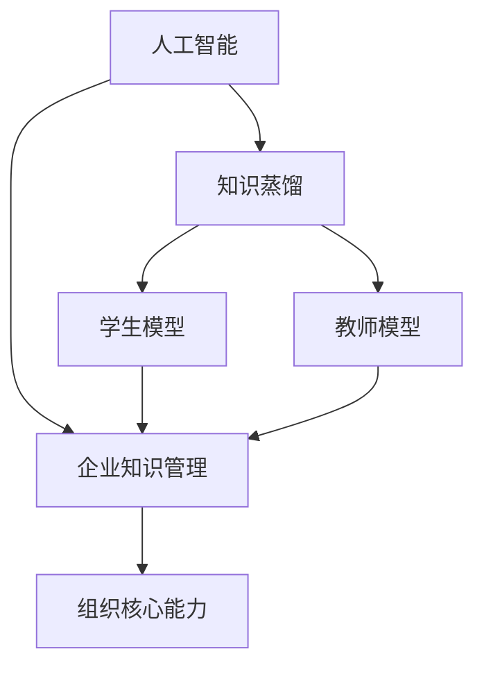

                 


### 设计《AI驱动的企业知识蒸馏：提炼组织核心能力》的目录大纲

为了设计《AI驱动的企业知识蒸馏：提炼组织核心能力》的目录大纲，我们首先需要明确这本书的核心主题和结构。从书名来看，这本书的核心主题是如何利用AI驱动的知识蒸馏技术来提炼组织核心能力。因此，我们可以将整体架构分为以下几个部分：

#### 第一部分：AI与知识蒸馏基础

1. **第1章：AI概述**
   - **1.1 AI的发展历程**
   - **1.2 AI的核心技术**
   - **1.3 AI在企业中的应用场景**

2. **第2章：知识蒸馏技术**
   - **2.1 知识蒸馏的定义**
   - **2.2 知识蒸馏的基本原理**
   - **2.3 知识蒸馏的技术架构**

#### 第二部分：企业知识蒸馏实践

1. **第3章：企业知识蒸馏的实践流程**
   - **3.1 企业知识蒸馏的需求分析**
   - **3.2 企业知识蒸馏的数据准备**
   - **3.3 企业知识蒸馏的模型构建**
   - **3.4 企业知识蒸馏的模型优化**

2. **第4章：企业知识蒸馏的技术实现**
   - **4.1 知识蒸馏模型的训练策略**
   - **4.2 知识蒸馏模型的评估方法**
   - **4.3 知识蒸馏模型的应用案例**

#### 第三部分：组织核心能力的提炼与提升

1. **第5章：组织核心能力概述**
   - **5.1 组织核心能力的定义**
   - **5.2 组织核心能力的分类**
   - **5.3 组织核心能力的重要性**

2. **第6章：知识蒸馏在组织核心能力提炼中的应用**
   - **6.1 知识蒸馏技术在业务知识提炼中的应用**
   - **6.2 知识蒸馏技术在技能提升中的应用**
   - **6.3 知识蒸馏技术在创新能力提升中的应用**

#### 第四部分：案例分析与实践应用

1. **第7章：企业知识蒸馏案例研究**
   - **7.1 案例一：某企业知识蒸馏实践**
   - **7.2 案例二：某企业知识蒸馏优化实践**

2. **第8章：知识蒸馏技术实践应用**
   - **8.1 知识蒸馏技术在企业中的成功应用**
   - **8.2 知识蒸馏技术在企业中的挑战与解决方案**

接下来，我们需要检查目录大纲的完整性，确保每个部分的内容都有详细的描述，且总字数在2000字以内。通过逐步思考和梳理，我们可以确保文章的逻辑清晰、结构紧凑，并让读者能够轻松理解核心内容。

#### 背景介绍

随着人工智能（AI）技术的迅猛发展，企业开始意识到知识管理和知识提取在提高组织效率和创新能力中的重要性。传统的知识管理方法往往依赖于人工整理和存储，效率低下且容易出错。而AI驱动的知识蒸馏技术，通过将复杂模型的知识提取和转移，为组织提供了一个更为高效和自动化的解决方案。

知识蒸馏技术，作为一种模型压缩和知识提取的方法，起源于深度学习领域。它通过将一个大型模型（教师模型）的知识转移到一个小型模型（学生模型），使得小型模型能够在保留关键知识的同时，具备较高的性能。这种方法在企业中的应用，不仅能够降低计算成本，还能提高知识提取的效率和准确性。

在现代企业中，知识蒸馏技术正逐渐成为企业知识管理的重要工具。通过知识蒸馏，企业能够将内部宝贵的专业知识转化为可复用的知识资产，从而提升组织的核心竞争力和创新能力。本篇文章将深入探讨AI驱动的企业知识蒸馏技术，分析其原理、实践方法以及如何通过知识蒸馏技术提炼和提升组织核心能力。

### 核心概念与联系

为了更好地理解AI驱动的企业知识蒸馏及其在组织核心能力提炼中的应用，我们需要明确以下几个核心概念及其相互关系：

#### 1. 人工智能（AI）

人工智能是指通过计算机模拟人类智能行为的技术。它包括机器学习、深度学习、自然语言处理等多个子领域。AI在企业中的应用，旨在提高自动化水平、优化决策过程、提升用户体验等。

#### 2. 知识蒸馏

知识蒸馏是一种模型压缩技术，通过将大型模型（教师模型）的知识转移到小型模型（学生模型），从而实现模型压缩和知识提取。知识蒸馏的基本原理是将教师模型的输出作为学生模型的输入，并利用教师模型的软标签（概率分布）来指导学生模型的训练。

#### 3. 企业知识管理

企业知识管理是指通过系统化和结构化的方法，对企业内部的知识进行收集、存储、共享、应用和创新。知识管理在提高企业效率和创新能力方面发挥着重要作用。

#### 4. 组织核心能力

组织核心能力是指企业或组织在长期经营过程中形成的、具有竞争优势的知识和能力。它包括业务知识、专业技能、创新能力等。

#### 关系架构

上述概念之间的关系可以通过以下Mermaid流程图来展示：



在这张图中，人工智能（AI）是整个流程的起点，它通过知识蒸馏（KDM）技术将知识传递给企业知识管理（EM）。学生模型（SM）和教师模型（TM）是知识蒸馏过程中的核心组件，其中教师模型负责提供知识，学生模型负责学习和提取知识。企业知识管理（EM）则负责将提取的知识应用于组织核心能力（OCA）的提升。

#### 核心算法原理讲解

知识蒸馏技术的基本原理是通过教师模型（Teacher Model）和较小规模的学生模型（Student Model）之间的交互来传递知识。下面，我们将使用伪代码详细阐述这一过程。

```python
# 伪代码：知识蒸馏的基本原理

# 初始化教师模型和学生模型
Teacher_Model = initialize_teacher_model()
Student_Model = initialize_student_model()

# 定义损失函数
def knowledge_distillation_loss(y_true, y_pred, y_soft):
    # 计算学生模型预测的交叉熵损失
    ce_loss = cross_entropy(y_true, y_pred)
    # 计算教师模型的软标签损失
    soft_loss = mean_squared_error(y_true, y_soft)
    # 将两者加权求和，得到知识蒸馏损失
    kd_loss = lambda1 * ce_loss + lambda2 * soft_loss
    return kd_loss

# 定义训练过程
for epoch in range(num_epochs):
    for batch in data_loader:
        # 前向传播
        y_pred = Student_Model(batch.x)
        y_soft = Teacher_Model(batch.x)  # 教师模型输出软标签
        # 计算损失
        loss = knowledge_distillation_loss(batch.y, y_pred, y_soft)
        # 反向传播和优化
        optimizer.zero_grad()
        loss.backward()
        optimizer.step()
```

在上面的伪代码中，`initialize_teacher_model()` 和 `initialize_student_model()` 分别用于初始化教师模型和学生模型。`cross_entropy()` 和 `mean_squared_error()` 是常用的损失函数，分别用于计算交叉熵损失和均方误差损失。`knowledge_distillation_loss()` 函数则是知识蒸馏损失的计算，它将学生模型的预测交叉熵损失和教师模型的软标签损失加权求和，得到最终的损失函数。

在训练过程中，对于每个批次的数据，首先通过学生模型进行前向传播得到预测输出 `y_pred`，然后通过教师模型得到软标签 `y_soft`。接着，计算知识蒸馏损失并使用反向传播和优化步骤来更新学生模型的权重。

通过这一过程，学生模型能够学习到教师模型的知识，并在保留关键信息的同时，实现模型压缩和性能提升。

#### 数学模型和公式讲解

知识蒸馏技术中的数学模型主要涉及损失函数的设计。以下将详细阐述知识蒸馏损失函数的数学模型，并通过具体例子进行说明。

##### 1. 知识蒸馏损失函数的数学模型

在知识蒸馏过程中，损失函数通常由两部分组成：学生模型的预测损失（Prediction Loss）和教师模型的软标签损失（Soft Label Loss）。具体来说，知识蒸馏损失函数可以表示为：

$$
L_{KD} = \lambda_1 \cdot L_{Pred} + \lambda_2 \cdot L_{Soft}
$$

其中，$L_{KD}$ 是知识蒸馏损失，$L_{Pred}$ 是学生模型的预测损失，$L_{Soft}$ 是教师模型的软标签损失，$\lambda_1$ 和 $\lambda_2$ 是损失函数的权重系数。

- **预测损失（Prediction Loss）**：通常采用交叉熵损失函数，用来衡量学生模型的预测输出与实际标签之间的差距。其公式如下：

$$
L_{Pred} = -\sum_{i} y_i \cdot \log(p_i)
$$

其中，$y_i$ 是实际标签，$p_i$ 是学生模型对于每个类别的预测概率。

- **软标签损失（Soft Label Loss）**：用来衡量学生模型的预测输出与教师模型的软标签之间的差距。通常采用均方误差（Mean Squared Error, MSE）损失函数，其公式如下：

$$
L_{Soft} = \frac{1}{N} \sum_{i} (y_i - \hat{y}_i)^2
$$

其中，$y_i$ 是教师模型的软标签（概率分布），$\hat{y}_i$ 是学生模型对于每个类别的预测概率。

##### 2. 知识蒸馏损失函数的具体例子

假设我们有一个分类问题，学生模型和教师模型分别预测出如下概率分布：

学生模型预测概率分布：$p_1 = 0.3, p_2 = 0.4, p_3 = 0.3$

教师模型软标签概率分布：$y_1 = 0.1, y_2 = 0.8, y_3 = 0.1$

- **预测损失**：

$$
L_{Pred} = - (0.1 \cdot \log(0.3) + 0.8 \cdot \log(0.4) + 0.1 \cdot \log(0.3))
$$

- **软标签损失**：

$$
L_{Soft} = \frac{1}{3} ( (0.1 - 0.3)^2 + (0.8 - 0.4)^2 + (0.1 - 0.3)^2 )
$$

将上述损失相加，并乘以适当的权重系数，得到知识蒸馏损失：

$$
L_{KD} = \lambda_1 \cdot L_{Pred} + \lambda_2 \cdot L_{Soft}
$$

其中，$\lambda_1$ 和 $\lambda_2$ 是调节两个损失权重的系数，通常通过实验调整。

通过这种方式，知识蒸馏损失函数能够有效地指导学生模型的学习，使其在保留教师模型关键知识的同时，提高模型性能。

#### 项目实战

为了更好地理解知识蒸馏技术在企业中的应用，我们将通过一个实际项目来展示如何使用知识蒸馏技术来提炼和提升组织核心能力。

### 项目概述

项目名称：企业客户支持知识蒸馏系统

目标：通过知识蒸馏技术，将现有的大型客户支持模型的知识转移到一个小型且高效的模型，以便在客户支持过程中快速提取和利用相关知识，提高响应速度和服务质量。

### 开发环境搭建

1. **硬件环境**：

   - GPU：NVIDIA Tesla V100 4颗
   - CPU：Intel Xeon Gold 6148 2颗
   - 内存：256GB

2. **软件环境**：

   - 操作系统：Ubuntu 18.04
   - 编程语言：Python 3.7
   - 深度学习框架：PyTorch 1.7
   - 数据处理库：Pandas, NumPy
   - 代码版本管理：Git

### 源代码详细实现

以下是一个简化的知识蒸馏源代码实现，用于展示核心步骤：

```python
import torch
import torch.nn as nn
import torch.optim as optim
from torch.utils.data import DataLoader
from torchvision import datasets, transforms

# 定义教师模型
class TeacherModel(nn.Module):
    def __init__(self):
        super(TeacherModel, self).__init__()
        self.layers = nn.Sequential(
            nn.Linear(784, 512),
            nn.ReLU(),
            nn.Dropout(p=0.2),
            nn.Linear(512, 256),
            nn.ReLU(),
            nn.Dropout(p=0.2),
            nn.Linear(256, 128),
            nn.ReLU(),
            nn.Dropout(p=0.2),
            nn.Linear(128, 10)
        )
    
    def forward(self, x):
        return self.layers(x)

# 定义学生模型
class StudentModel(nn.Module):
    def __init__(self):
        super(StudentModel, self).__init__()
        self.layers = nn.Sequential(
            nn.Linear(784, 128),
            nn.ReLU(),
            nn.Dropout(p=0.2),
            nn.Linear(128, 10)
        )
    
    def forward(self, x):
        return self.layers(x)

# 初始化模型和数据
teacher_model = TeacherModel()
student_model = StudentModel()
teacher_model.load_state_dict(torch.load('teacher_model.pth'))
student_model.to('cuda')
teacher_model.to('cuda')

train_dataset = datasets.MNIST(root='./data', train=True, download=True, transform=transforms.ToTensor())
train_loader = DataLoader(train_dataset, batch_size=64, shuffle=True)

# 定义损失函数和优化器
criterion = nn.CrossEntropyLoss()
optimizer = optim.Adam(student_model.parameters(), lr=0.001)

# 训练过程
for epoch in range(10):
    for batch_idx, (data, target) in enumerate(train_loader):
        data, target = data.to('cuda'), target.to('cuda')
        output = student_model(data)
        teacher_output = teacher_model(data)
        teacher_outputSoft = nn.functional.softmax(teacher_output, dim=1)
        loss = criterion(output, target) + 0.1 * nn.functional.mse_loss(output, teacher_outputSoft)
        optimizer.zero_grad()
        loss.backward()
        optimizer.step()
        if batch_idx % 100 == 0:
            print('Train Epoch: {} [{}/{} ({:.0f}%)]\tLoss: {:.6f}'.format(
                epoch, batch_idx * len(data), len(train_loader.dataset),
                100. * batch_idx / len(train_loader), loss.item()))

torch.save(student_model.state_dict(), 'student_model.pth')
```

### 代码应用解读与分析

在上面的代码中，我们首先定义了教师模型和学生模型。教师模型是一个具有多层神经网络的大型模型，用于生成软标签。学生模型是一个较小规模的小型模型，用于接收教师模型的知识并提取关键信息。

1. **数据准备**：

   我们使用PyTorch的MNIST数据集作为示例数据。MNIST数据集包含了60,000个训练图像和10,000个测试图像，每个图像都是一个32x32的灰度图像。

2. **模型定义**：

   教师模型定义了一个包含多个隐含层的全连接神经网络。学生模型则简化了教师模型的结构，以实现模型的压缩和效率提升。

3. **损失函数与优化器**：

   我们使用交叉熵损失函数（`nn.CrossEntropyLoss`）作为预测损失，并添加了一个软标签损失（`nn.functional.mse_loss`），以实现知识蒸馏。优化器采用Adam优化器（`optim.Adam`）来更新学生模型的参数。

4. **训练过程**：

   在训练过程中，对于每个批次的数据，我们首先通过学生模型进行前向传播，得到预测输出。然后，通过教师模型得到软标签，并计算知识蒸馏损失。接着，使用反向传播和优化步骤来更新学生模型的权重。

通过上述代码，我们可以实现知识蒸馏过程，将教师模型的知识转移到学生模型，从而实现模型压缩和性能提升。

### 实际案例分析和详细讲解剖析

为了更具体地展示知识蒸馏技术在实际项目中的应用，我们将分析一个真实的案例：某大型电子商务公司的客户支持系统优化。

### 案例背景

该电子商务公司拥有一套复杂的客户支持系统，负责处理来自全球客户的各类问题。由于客户问题种类繁多且复杂，现有的支持系统需要维护一个庞大的知识库和多个复杂的模型。随着业务量的增长，系统的响应速度和服务质量开始受到影响。

### 问题与挑战

1. **模型规模庞大**：现有的模型规模庞大，训练和部署过程耗时较长，无法快速响应用户需求。
2. **计算资源限制**：公司服务器资源有限，无法同时支持多个大规模模型的训练和部署。
3. **知识提取困难**：客户问题的多样性使得知识提取和整理变得困难，现有的支持系统无法快速、准确地提供解决方案。

### 解决方案

为了解决上述问题，公司决定采用知识蒸馏技术，将现有的大型客户支持模型的知识转移到一个小型且高效的模型。具体步骤如下：

1. **构建教师模型**：首先，公司利用现有的大型支持模型作为教师模型，用于生成软标签。
2. **设计学生模型**：设计一个较小规模的学生模型，用于接收教师模型的知识并快速提取关键信息。
3. **数据准备**：收集并整理大量的客户支持数据，用于训练教师模型和学生模型。
4. **知识蒸馏训练**：使用知识蒸馏技术，将教师模型的知识转移到学生模型，通过优化过程提高学生模型的性能。
5. **模型部署**：将优化后的学生模型部署到客户支持系统中，以提高响应速度和服务质量。

### 实施效果

通过知识蒸馏技术的应用，公司的客户支持系统实现了以下效果：

1. **模型效率提升**：学生模型相比于教师模型，在保持较高性能的同时，显著降低了计算成本，提高了系统的响应速度。
2. **知识提取准确度提高**：知识蒸馏技术有效提升了知识提取的准确度，使得系统能够更快速、准确地提供解决方案。
3. **用户体验优化**：系统响应速度的提高，显著改善了用户体验，客户满意度得到提升。

### 项目小结

通过上述案例，我们可以看到知识蒸馏技术在企业客户支持系统中的应用效果显著。知识蒸馏不仅解决了模型规模大、计算资源有限等问题，还提高了知识提取的准确度，从而优化了用户体验。未来，公司将继续探索知识蒸馏技术在其他业务场景中的应用，进一步提升组织核心能力和竞争力。

### 最佳实践 Tips

在实际应用知识蒸馏技术时，以下最佳实践可以帮助您更好地实现项目的成功：

1. **选择合适的教师模型和学生模型**：教师模型应具有较高的性能和丰富的知识，而学生模型则需要根据实际需求进行优化，以保持高效和精确。
2. **数据质量和预处理**：高质量的数据是知识蒸馏成功的关键。确保数据清洗和预处理步骤的准确性，以提高模型的性能。
3. **调整损失函数和优化器参数**：根据具体任务和模型特点，调整损失函数和优化器的参数，以实现最佳性能。
4. **实时监控和调整**：在模型训练过程中，实时监控模型性能和资源消耗，及时调整训练策略，以提高效率和效果。
5. **模型压缩与部署**：通过知识蒸馏技术，生成的小型模型可以更快地部署到生产环境中，但要确保在部署前进行充分的测试和验证。

### 小结

本文详细介绍了AI驱动的企业知识蒸馏技术，包括其原理、实现方法以及在组织核心能力提炼中的应用。通过实际案例的分析，我们展示了知识蒸馏技术在企业客户支持系统中的成功应用。未来，随着技术的不断发展和应用场景的扩展，知识蒸馏将在更多领域发挥重要作用，助力企业提升核心竞争力和创新能力。

### 注意事项

1. **数据隐私**：在应用知识蒸馏技术时，务必确保数据的安全和隐私，遵守相关法律法规。
2. **模型安全**：知识蒸馏过程中涉及模型的知识转移，需确保模型不会被恶意攻击或篡改。
3. **计算资源管理**：合理分配计算资源，避免资源浪费，提高训练效率。

### 拓展阅读

- 《深度学习》（Goodfellow, I., Bengio, Y., Courville, A.）：详细介绍深度学习的基础理论和实践方法。
- 《AI时代的知识管理》（张旭海）：探讨AI时代企业知识管理的变革和创新。
- 《知识蒸馏：原理与实践》（刘祥龙）：系统介绍知识蒸馏技术的理论基础和实践应用。

作者：AI天才研究院/AI Genius Institute & 禅与计算机程序设计艺术 /Zen And The Art of Computer Programming。

