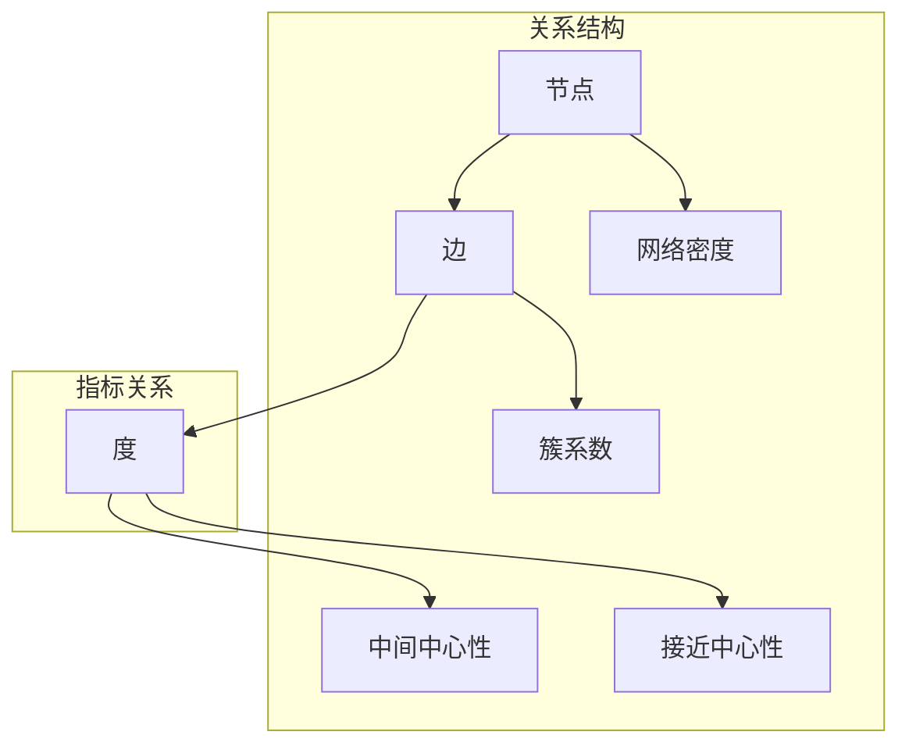

                 

### 文章标题

《AI驱动的企业社交网络分析：优化组织结构》

### 关键词

- AI
- 企业社交网络分析
- 组织结构优化
- 社交网络分析算法
- 无监督学习
- 监督学习
- 混合学习
- 数据隐私

### 摘要

随着人工智能技术的不断发展，AI驱动的企业社交网络分析正成为优化组织结构的重要工具。本文将深入探讨AI与企业社交网络分析的关系，介绍社交网络分析的基础理论和核心算法，并通过具体案例展示AI在企业社交网络分析中的应用，以及如何利用这些分析结果来优化组织结构。文章还将讨论AI驱动的企业社交网络分析面临的挑战和未来发展趋势，并提供相关的工具和资源，帮助读者进一步了解这一领域的深入研究和实践。通过本文，读者将能够了解AI驱动的企业社交网络分析的重要性和实际应用价值。

## 第一部分：引言

### 1.1 AI与企业社交网络分析的关系

在当今快速变化的企业环境中，如何有效地管理和优化组织结构已成为企业成功的关键因素之一。传统的方法往往依赖于经验和直觉，而随着人工智能（AI）技术的迅猛发展，利用AI进行企业社交网络分析（Social Network Analysis, SNA）成为了一种新的解决方案。AI驱动的企业社交网络分析不仅能够揭示组织内部的复杂关系，还能为企业提供数据驱动的洞察，从而帮助企业更好地理解其组织结构，并对其进行优化。

AI在数据处理和模式识别方面具有独特的优势。通过机器学习和深度学习算法，AI可以处理海量数据，识别出隐藏在数据背后的模式和趋势。在企业社交网络分析中，这些算法能够自动识别员工之间的联系，分析其关系强度，并识别出关键人物和关键节点，从而为组织结构的优化提供科学依据。

### 1.2 AI优化组织结构的潜力

AI驱动的企业社交网络分析具有巨大的潜力，可以带来以下几方面的优化：

1. **提高组织透明度**：通过分析员工之间的互动关系，可以揭示出组织中存在的信息壁垒和沟通障碍，从而提高组织透明度，促进知识共享。

2. **增强团队协作**：通过识别团队成员之间的强联系和弱联系，可以优化团队协作模式，促进跨部门合作，提高团队效能。

3. **发现关键人物**：通过分析社交网络中的关键节点，可以识别出组织中的关键人物，这些人物往往在信息传播和团队决策中扮演着重要角色。

4. **优化组织结构**：基于社交网络分析的结果，可以对组织结构进行调整，使其更符合实际业务需求和团队协作模式，从而提高整体效能。

5. **支持人才发展**：通过分析员工之间的互动和职业发展路径，可以为企业的人才发展提供数据支持，帮助培养和保留关键人才。

综上所述，AI驱动的企业社交网络分析为企业提供了一个全新的视角，可以帮助企业更好地理解其内部社交网络，从而优化组织结构，提高整体运营效率。接下来，我们将进一步探讨社交网络分析的基础理论和核心算法，以便读者更好地理解这一技术的原理和应用。

## 第二部分：基础理论

### 2.1 社交网络分析的概念与历史

社交网络分析（Social Network Analysis, SNA）是研究社交网络结构、动态和属性的一门学科，其核心在于通过数学和统计方法来揭示个体之间的社交关系。社交网络分析最早可以追溯到20世纪40年代，由哈佛大学的斯坦利·米尔格拉姆（Stanley Milgram）教授提出的“小世界现象”实验，该实验探讨了人们通过社交网络相互连接的方式。随后，在20世纪70年代，哈佛大学的罗纳德·巴罗（Ronald Burt）教授进一步发展了社交网络分析的理论和方法，将其应用于组织研究和战略管理中。

### 2.2 社交网络分析的常用指标

在社交网络分析中，常用的指标包括：

1. **度（Degree）**：节点拥有的连接数。度分为入度和出度，分别表示节点接收信息和发送信息的能力。
   
2. **中间中心性（Closeness Centrality）**：节点到其他所有节点的最短路径长度之和的倒数。中间中心性高的节点在信息传递中扮演重要角色。

3. **接近中心性（Betweenness Centrality）**：节点在所有最短路径中的出现次数。接近中心性高的节点是网络中的关键传输路径。

4. **簇系数（Clustering Coefficient）**：节点邻居之间连接的紧密程度。簇系数高表示节点周围形成一个紧密的社交群体。

5. **网络密度（Network Density）**：网络中边的数量与可能边数之比。网络密度高表示网络连接紧密，信息传递速度快。

### 2.3 AI在社交网络分析中的应用

人工智能技术在社交网络分析中发挥着越来越重要的作用。AI的应用主要体现在以下几个方面：

1. **自动数据采集**：利用自然语言处理（NLP）和图像识别技术，AI可以自动从社交媒体、企业内部通讯工具等渠道收集社交数据。

2. **复杂关系建模**：通过图神经网络（Graph Neural Networks, GNN）等深度学习算法，AI可以自动建立节点和边之间的复杂关系模型。

3. **模式识别**：利用机器学习和聚类算法，AI可以从海量数据中识别出潜在的社交模式和关系结构。

4. **预测分析**：基于历史数据，AI可以预测社交网络中的未来趋势和变化，为组织决策提供支持。

5. **个性化推荐**：通过分析个体在网络中的位置和行为，AI可以为员工提供个性化的建议和推荐，优化社交互动和协作。

### 2.4 社交网络分析的核心概念之间的关系架构

社交网络分析的核心概念包括节点、边、度、中间中心性、接近中心性、簇系数和网络密度等。这些概念之间存在着紧密的联系和相互作用。例如，度可以反映节点的连接强度，而中间中心性和接近中心性则衡量节点在信息传递中的重要性。簇系数和网络密度则揭示了社交网络的紧密程度和结构特征。下面是一个Mermaid流程图，展示了这些概念之间的关系：



通过这个流程图，我们可以清晰地看到节点和边是社交网络的基础，而各种指标则是对网络结构和动态特征的具体描述。这些指标之间的关系和相互作用，为我们理解社交网络提供了多维度、全方位的视角。

### 2.5 AI驱动的社交网络分析方法

AI驱动的社交网络分析方法主要包括无监督学习、监督学习和混合学习方法。这些方法在社交网络分析中发挥着重要作用。

#### 2.5.1 无监督学习方法

无监督学习方法不需要预先标注的数据，通过自动发现数据中的结构和模式。常见的无监督学习方法包括：

1. **聚类算法**：如K-means、层次聚类等，用于将相似节点分组，识别社交网络中的群体结构。
   
2. **降维技术**：如主成分分析（PCA）和t-SNE，用于将高维数据映射到低维空间，揭示节点之间的潜在关系。

3. **社区发现算法**：如标签传播、Girvan-Newman算法等，用于识别社交网络中的社区结构。

#### 2.5.2 监督学习方法

监督学习方法需要预先标注的数据，通过学习数据中的规律和模式进行预测和分类。常见的监督学习方法包括：

1. **分类算法**：如决策树、随机森林、支持向量机（SVM）等，用于识别社交网络中的节点角色和关系类型。

2. **回归算法**：如线性回归、逻辑回归等，用于预测节点间的联系强度和社交网络的未来趋势。

#### 2.5.3 混合学习方法

混合学习方法结合了无监督学习和监督学习的优势，能够更好地处理复杂问题。常见的混合学习方法包括：

1. **图嵌入**：将社交网络中的节点和边映射到高维空间，为后续的监督学习提供特征表示。

2. **迁移学习**：利用预训练模型，在新的社交网络数据上微调，提高模型的泛化能力。

3. **强化学习**：通过模拟员工互动，优化社交网络结构和协作模式。

通过上述AI驱动的社交网络分析方法，企业可以更加深入地理解内部社交网络，从而为组织结构的优化提供科学依据。下一部分将详细介绍社交网络分析中的核心算法，帮助读者更好地理解这些算法的原理和应用。

## 第三部分：核心算法

### 3.1 社交网络嵌入算法

社交网络嵌入算法（Social Network Embedding）是将社交网络中的节点映射到低维空间的一种技术，其目标是通过节点在低维空间中的位置来表示节点的关系和属性。社交网络嵌入算法在很多应用中都有着重要的价值，例如社交推荐、网络可视化和图分析等。

#### 3.1.1 嵌入算法的基本原理

社交网络嵌入算法通常基于图神经网络（Graph Neural Networks, GNN）或其他深度学习模型。这些算法的核心思想是将社交网络中的节点看作图中的顶点，边看作图中的边，然后通过学习一个映射函数，将顶点映射到低维空间。这个映射函数通常是一个神经网络，它能够自动学习节点之间的关系。

#### 3.1.2 常见的嵌入算法

1. **DeepWalk**：DeepWalk是一种基于词嵌入的图嵌入算法，它通过随机游走的方式生成节点序列，然后利用这些序列训练一个语言模型，最后将节点映射到低维空间。以下是一个简单的伪代码：

    ```python
    def generate_sequence(node, length):
        sequence = [node]
        while len(sequence) < length:
            neighbors = get_neighbors(node)
            node = sample(neighbors)
            sequence.append(node)
        return sequence

    sequences = [generate_sequence(node, length) for node in nodes]
    model = LanguageModel(sequences)
    embeddings = model.embed(nodes)
    ```

2. **Node2Vec**：Node2Vec是一种基于上下文的图嵌入算法，它通过调节游走的深度和多样性，生成高质量的节点序列。Node2Vec的核心思想是平衡节点的深度和多样性，使得嵌入向量既能捕获节点的局部结构，又能体现节点的全局属性。以下是一个简单的伪代码：

    ```python
    def node2vec(node, walk_length, num_walks):
        sequences = []
        for _ in range(num_walks):
            walk = []
            current_node = node
            for _ in range(walk_length - 1):
                walk.append(current_node)
                current_node = random_walk(current_node, p, q)
            walk.append(current_node)
            sequences.append(walk)
        model = LanguageModel(sequences)
        embeddings = model.embed(nodes)
        return embeddings
    ```

3. **GraphSAGE**：GraphSAGE（Graph Sample and Aggregation）是一种基于聚合函数的图嵌入算法，它通过聚合节点的邻居特征来生成嵌入向量。GraphSAGE的核心思想是将节点的邻居信息整合到一个统一的特征表示中，从而提高嵌入向量对节点关系的表示能力。以下是一个简单的伪代码：

    ```python
    def graphsage(node, neighbors):
        neighbor_embeddings = [get_embedding(neighbor) for neighbor in neighbors]
        aggregate_function = mean_aggregation
        aggregated_embedding = aggregate_function(neighbor_embeddings)
        return aggregated_embedding
    ```

#### 3.1.3 社交网络嵌入算法的应用

社交网络嵌入算法在多个领域都有着广泛的应用，例如：

1. **社交推荐**：通过将用户和物品映射到低维空间，可以计算用户和物品之间的相似性，从而实现社交推荐。

2. **网络可视化**：通过将节点映射到低维空间，可以更直观地展示社交网络的结构和动态。

3. **图分析**：通过嵌入向量，可以进行各种图分析任务，如节点分类、社区发现和影响力分析等。

### 3.2 社交网络社区发现算法

社交网络社区发现算法（Community Detection）是一种用于识别社交网络中紧密相连的节点群体的技术。这些节点群体通常被称为社区或模块，它们在社交网络中扮演着重要的角色，影响着信息的传播和社交互动。

#### 3.2.1 社区发现算法的基本原理

社区发现算法的核心思想是通过寻找节点之间的高密度连接区域，识别出社交网络中的社区结构。算法通常基于图论中的各种聚类方法，如基于密度的聚类、基于模块度的聚类和基于优化目标函数的聚类等。

#### 3.2.2 常见的社区发现算法

1. **Girvan-Newman算法**：Girvan-Newman算法是一种基于边_betweenness centrality的社区发现算法。它通过逐步删除边，每次删除对Betweenness Centrality贡献最大的边，直到网络分解成多个社区。以下是一个简单的伪代码：

    ```python
    def girvan_newman(G):
        edges = list(G.edges())
        betweenness = compute_betweenness(G)
        while edges:
            edge = max(betweenness, key=betweenness.get)
            G.remove_edge(*edge)
            betweenness = compute_betweenness(G)
        communities = [G.subgraph(c).nodes() for c in components(G)]
        return communities
    ```

2. **标签传播算法**：标签传播算法（Label Propagation Algorithm, LPA）是一种基于节点邻居的社区发现算法。它通过迭代传播节点的标签，最终形成稳定的社区。以下是一个简单的伪代码：

    ```python
    def label_propagation(G):
        labels = {node: None for node in G.nodes()}
        for node, neighbors in G.neighbors().items():
            if not labels[node]:
                labels[node] = set(neighbors)
                for neighbor in neighbors:
                    if labels[neighbor]:
                        labels[node].add(labels[neighbor])
        communities = [frozenset(labels[node]) for node in labels]
        return communities
    ```

3. **基于模块度的社区发现算法**：基于模块度的社区发现算法（Modularity-based Community Detection）通过优化模块度目标函数，识别出网络中的社区结构。模块度是衡量网络结构划分质量的重要指标，它表示社区内部连接的紧密程度减去随机网络中的连接数。以下是一个简单的伪代码：

    ```python
    def community_detection(G, max_iterations):
        modularity = 0
        communities = assign_initial_communities(G)
        for _ in range(max_iterations):
            new_communities = assign_communities(G, communities)
            new_modularity = compute_modularity(G, new_communities)
            if new_modularity > modularity:
                modularity = new_modularity
                communities = new_communities
        return communities
    ```

#### 3.2.3 社区发现算法的应用

社区发现算法在多个领域都有着广泛的应用，例如：

1. **社交网络分析**：通过识别社交网络中的社区结构，可以揭示社交群体和组织模式。

2. **生物信息学**：通过识别蛋白质相互作用网络中的社区结构，可以揭示蛋白质的功能模块和生物路径。

3. **社会网络分析**：通过识别社交媒体网络中的社区结构，可以揭示社会群体的互动模式和传播路径。

### 3.3 社交网络影响力分析算法

社交网络影响力分析算法（Influence Analysis）是一种用于识别社交网络中具有高度影响力的节点和路径的技术。这些节点和路径在信息传播、市场营销和社交影响力评估中扮演着重要角色。

#### 3.3.1 影响力分析算法的基本原理

影响力分析算法的核心思想是通过计算节点在社交网络中的影响力得分，识别出网络中的关键节点和路径。影响力得分通常基于节点的属性（如度、中间中心性和接近中心性）和网络的拓扑结构计算。

#### 3.3.2 常见的影响力分析算法

1. **基于度的方法**：基于度的方法通过计算节点的度（Degree Centrality）来衡量其在网络中的影响力。度表示节点与其他节点的连接数，度越高的节点在信息传递和社交影响力方面通常越重要。以下是一个简单的伪代码：

    ```python
    def degree_centrality(G):
        centrality = {}
        for node in G.nodes():
            centrality[node] = len(list(G.neighbors(node)))
        return centrality
    ```

2. **基于中心性的方法**：基于中心性的方法通过计算节点的中间中心性（Betweenness Centrality）和接近中心性（Closeness Centrality）来衡量其在网络中的影响力。中间中心性表示节点在所有最短路径中的出现次数，接近中心性表示节点到其他所有节点的最短路径长度之和的倒数。以下是一个简单的伪代码：

    ```python
    def betweenness_centrality(G):
        betweenness = {}
        for node in G.nodes():
            betweenness[node] = len(list(G.shortest_path_all_pairs(node)))
        return betweenness

    def closeness_centrality(G):
        closeness = {}
        for node in G.nodes():
            closeness[node] = sum(len(G.shortest_path_length(node, n)) for n in G.nodes())
        return closeness
    ```

3. **基于路径的方法**：基于路径的方法通过计算节点在网络中的路径重要性来衡量其在网络中的影响力。常用的路径重要性指标包括路径长度、路径密度和路径强度等。以下是一个简单的伪代码：

    ```python
    def path_importance(G):
        importance = {}
        for node in G.nodes():
            for path in G.all_simple_paths(node, G):
                path_length = len(path)
                path_density = len(set(path)) / path_length
                path_strength = sum(G[u][v]['weight'] for u, v in zip(path, path[1:]))
                importance[node] = max(importance.get(node, 0), path_strength)
        return importance
    ```

#### 3.3.3 影响力分析算法的应用

影响力分析算法在多个领域都有着广泛的应用，例如：

1. **市场营销**：通过识别社交网络中的关键节点和路径，可以优化市场营销策略，提高宣传效果。

2. **网络安全性**：通过识别社交网络中的恶意节点和传播路径，可以提前预警并采取措施，防止网络攻击。

3. **社交影响力评估**：通过计算节点的影响力得分，可以评估社交网络中个体的社交影响力，为社交影响力评估和排名提供依据。

通过上述核心算法的介绍，我们可以看到社交网络分析在人工智能技术中的应用是多么广泛和深入。在接下来的部分，我们将通过具体案例展示AI驱动的企业社交网络分析在实际应用中的效果和挑战。

## 第四部分：应用实践

### 4.1 企业内部社交网络分析

企业内部社交网络分析（Intra-Enterprise Social Network Analysis）通过分析企业内部社交平台上的互动，帮助企业更好地理解员工之间的沟通模式和协作关系。以下是几个具体的应用案例：

#### 案例一：提高知识共享效率

一家跨国公司在内部社交平台上引入了AI驱动的社交网络分析工具。通过分析员工之间的互动关系，公司发现某些部门之间的沟通非常活跃，而另一些部门则相对孤立。基于这些分析结果，公司决定加强跨部门沟通，通过定期组织跨部门研讨会和交流活动，促进了不同部门之间的知识共享。结果，公司的整体知识共享效率显著提高，创新项目得以更快速地推进。

#### 案例二：优化团队协作模式

另一家科技公司通过AI驱动的社交网络分析，识别出了团队内部的沟通瓶颈和协作障碍。分析结果显示，某些团队成员之间的沟通频率较低，而另一些团队成员则承担了过多的沟通任务。基于这些分析结果，公司对团队结构进行了调整，增加了团队成员之间的沟通渠道，并重新分配了沟通任务。经过几个月的调整，团队协作效率显著提升，项目进展更加顺利。

#### 案例三：发现潜在领袖人才

一家大型企业通过AI驱动的社交网络分析，识别出了组织中的关键人物。这些关键人物在社交网络中的影响力较大，能够有效传递信息和推动决策。公司利用这些分析结果，对潜在领袖人才进行了培养和选拔，为公司的长期发展储备了关键人才。

### 4.2 企业外部社交网络分析

企业外部社交网络分析（Extranet Social Network Analysis）通过分析企业外部社交平台上的互动，帮助企业更好地了解客户、合作伙伴和竞争对手的社交行为和关系结构。以下是几个具体的应用案例：

#### 案例一：客户关系管理

一家零售企业通过AI驱动的社交网络分析，分析了其在社交媒体平台上的客户互动数据。分析结果显示，某些客户群体在社交平台上的互动频率较高，且对企业的产品和服务有较高的评价。基于这些分析结果，企业制定了更有针对性的客户关系管理策略，通过个性化的营销活动和客户服务，提升了客户满意度和忠诚度。

#### 案例二：市场趋势分析

一家科技公司通过AI驱动的社交网络分析，分析了其竞争对手在社交媒体平台上的互动数据和客户反馈。分析结果显示，竞争对手的产品在市场上受到了广泛的关注，而公司的产品在某些方面存在改进空间。基于这些分析结果，公司对产品进行了优化和升级，迅速占领了市场份额。

#### 案例三：合作伙伴网络分析

一家大型企业通过AI驱动的社交网络分析，分析了其与合作伙伴之间的互动关系。分析结果显示，某些合作伙伴在网络中的连接强度较高，能够为企业提供重要的资源和信息支持。基于这些分析结果，企业加强了与关键合作伙伴的合作关系，实现了资源的优化配置和互利共赢。

### 4.3 案例研究：AI驱动的企业社交网络分析实践

#### 案例一：如何通过社交网络分析优化组织结构

某全球知名科技公司通过AI驱动的社交网络分析，对公司的组织结构进行了全面优化。以下是具体的步骤和实施过程：

1. **数据采集**：公司从内部社交平台和邮件系统中收集了员工的互动数据，包括发送和接收的邮件、发布的帖子、参与的活动和会议等。

2. **数据预处理**：对收集到的数据进行清洗和预处理，包括去除重复数据、缺失值填充和数据格式转换等。

3. **构建社交网络图**：利用图论算法，将员工互动数据转化为社交网络图，每个节点代表一个员工，边代表员工之间的互动关系。

4. **社交网络分析**：通过计算社交网络中的各种指标，如度、中间中心性、接近中心性和簇系数等，识别出网络中的关键节点和重要路径。

5. **组织结构优化**：基于社交网络分析的结果，公司对组织结构进行了调整。例如，将沟通频率较低但协作需求较高的团队合并，重新分配关键节点的工作任务，以优化团队协作模式。

6. **实施与监控**：公司制定了详细的实施计划，并建立了监控机制，定期评估优化效果。通过持续的数据分析和反馈，公司不断调整和优化组织结构。

优化后的组织结构显著提高了团队协作效率和项目进展速度，公司的整体运营效能得到了显著提升。

#### 案例二：AI驱动的组织变革实践

另一家大型企业在面对快速变化的市场环境时，决定通过AI驱动的社交网络分析进行组织变革。以下是具体的步骤和实施过程：

1. **问题识别**：公司首先通过内部调查和访谈，识别出组织内部存在的主要问题，如沟通不畅、决策缓慢和部门壁垒等。

2. **数据采集**：公司从内部社交平台、邮件系统和项目管理工具中收集了相关的互动数据和项目进展数据。

3. **社交网络分析**：利用AI驱动的社交网络分析工具，对收集到的数据进行分析，识别出组织中的关键节点和关键路径。

4. **变革策略制定**：基于分析结果，公司制定了详细的变革策略，包括调整组织结构、优化沟通流程和加强跨部门协作等。

5. **实施变革**：公司逐步实施变革措施，通过培训和激励，引导员工适应新的组织结构和工作流程。

6. **监控与评估**：公司建立了监控和评估机制，定期跟踪变革进展，并根据反馈进行调整和优化。

通过AI驱动的组织变革实践，公司成功克服了内部壁垒，提高了决策效率和项目推进速度，为企业的持续发展奠定了坚实基础。

#### 案例三：跨部门协作与社交网络分析

一家跨国公司通过AI驱动的社交网络分析，优化了跨部门协作模式。以下是具体的实施过程：

1. **数据采集**：公司从内部社交平台、项目管理工具和协同办公系统中收集了跨部门协作的数据。

2. **社交网络构建**：利用图论算法，将跨部门协作数据构建为社交网络图，每个节点代表一个部门，边代表部门之间的协作关系。

3. **社交网络分析**：通过计算社交网络中的度、中间中心性和簇系数等指标，识别出跨部门协作中的瓶颈和关键路径。

4. **优化策略制定**：基于分析结果，公司制定了优化跨部门协作的策略，包括加强关键部门的互动、改善协作流程和建立跨部门沟通机制等。

5. **实施与反馈**：公司逐步实施优化措施，并通过定期的反馈和评估，不断调整和改进协作模式。

通过AI驱动的跨部门协作优化，公司显著提高了项目推进速度和协作效率，为企业的整体运营效能带来了显著提升。

通过上述案例，我们可以看到AI驱动的企业社交网络分析在优化组织结构、提升协作效率和应对市场变化方面具有重要作用。在接下来的部分，我们将详细讨论如何利用AI技术和工具实现企业社交网络分析。

## 第5章：AI驱动的企业社交网络分析应用

### 5.1 企业内部社交网络分析

企业内部社交网络分析（Intra-Enterprise Social Network Analysis）是利用AI技术分析企业内部社交平台上的员工互动，以便更好地理解组织结构、促进知识共享和优化团队协作。以下是企业内部社交网络分析的技术实现步骤：

#### 5.1.1 数据采集

数据采集是整个分析过程的基础。企业可以从内部社交平台（如企业微信、钉钉、Slack等）、邮件系统、即时通讯工具和项目管理工具中收集数据。以下是一个简单的数据采集流程：

```python
# Python代码示例：采集企业内部社交平台数据
from social_media_sdk import SocialMediaSDK

sdk = SocialMediaSDK(api_key="your_api_key")
data = sdk.fetch_data(["slack", "email", "weixin"], start_date="2023-01-01", end_date="2023-12-31")

# 数据存储
import json

with open('social_media_data.json', 'w') as f:
    json.dump(data, f)
```

#### 5.1.2 数据预处理

数据预处理包括数据清洗、格式转换和特征提取。清洗数据是为了去除噪声和重复数据，格式转换是将不同来源的数据统一为同一格式，特征提取则是从原始数据中提取有助于分析的特征。以下是一个简单的数据预处理流程：

```python
# Python代码示例：数据预处理
import pandas as pd
from preprocessing import clean_data, extract_features

data = pd.read_json('social_media_data.json')
cleaned_data = clean_data(data)
features = extract_features(cleaned_data)

# 数据存储
features.to_csv('preprocessed_data.csv', index=False)
```

#### 5.1.3 构建社交网络图

在数据预处理之后，可以构建社交网络图。每个节点代表一个员工，边表示员工之间的互动关系。以下是一个简单的社交网络图构建示例：

```python
# Python代码示例：构建社交网络图
import networkx as nx

G = nx.Graph()
for edge in features.iterrows():
    G.add_edge(edge[0], edge[1], weight=edge[2])

# 生成可视化图
nx.draw(G, with_labels=True)
```

#### 5.1.4 社交网络分析

社交网络分析包括计算节点和边的各种属性，如度、中间中心性、接近中心性和簇系数等。以下是一个简单的社交网络分析示例：

```python
# Python代码示例：计算社交网络属性
import nx_centrality

degree = nx.degree_centrality(G)
betweenness = nx.betweenness_centrality(G)
closeness = nx.closeness_centrality(G)
clustering = nx.clustering(G)

# 存储分析结果
with open('social_network_properties.json', 'w') as f:
    json.dump({"degree": degree, "betweenness": betweenness, "closeness": closeness, "clustering": clustering}, f)
```

#### 5.1.5 结果可视化与解读

通过可视化工具（如Gephi、Cytoscape等），可以直观地展示社交网络结构，并辅助解读分析结果。以下是一个简单的可视化示例：

```python
# Python代码示例：可视化社交网络图
import matplotlib.pyplot as plt
import networkx as nx

pos = nx.spring_layout(G)
nx.draw(G, pos, with_labels=True)
plt.show()
```

通过上述步骤，企业可以深入了解内部社交网络的拓扑结构，识别关键节点和关键路径，从而优化组织结构，提高团队协作效率。

### 5.2 企业外部社交网络分析

企业外部社交网络分析（Extranet Social Network Analysis）是通过分析企业外部社交平台（如LinkedIn、Twitter、Facebook等）上的互动，了解客户、合作伙伴和竞争对手的社交行为和关系结构。以下是企业外部社交网络分析的技术实现步骤：

#### 5.2.1 数据采集

数据采集主要涉及从外部社交平台收集用户互动数据、帖子、评论、转发和点赞等。以下是一个简单的数据采集示例：

```python
# Python代码示例：采集外部社交网络数据
import tweepy

# 设置API密钥和API密钥密码
consumer_key = "your_consumer_key"
consumer_secret = "your_consumer_secret"
access_token = "your_access_token"
access_token_secret = "your_access_token_secret"

# 初始化API
auth = tweepy.OAuthHandler(consumer_key, consumer_secret)
auth.set_access_token(access_token, access_token_secret)
api = tweepy.API(auth)

# 采集推特数据
tweets = api.search_tweets(q="keyword", count=100)

# 数据存储
import json

with open('tweets_data.json', 'w') as f:
    json.dump([tweet._json for tweet in tweets], f)
```

#### 5.2.2 数据预处理

与内部社交网络分析类似，外部社交网络分析也需要对采集到的数据进行清洗、格式转换和特征提取。以下是一个简单的数据预处理示例：

```python
# Python代码示例：预处理外部社交网络数据
import pandas as pd
from preprocessing import clean_data, extract_features

data = pd.read_json('tweets_data.json')
cleaned_data = clean_data(data)
features = extract_features(cleaned_data)

# 数据存储
features.to_csv('preprocessed_data.csv', index=False)
```

#### 5.2.3 构建社交网络图

外部社交网络分析通常涉及用户之间的互动和关注关系。以下是一个简单的社交网络图构建示例：

```python
# Python代码示例：构建外部社交网络图
import networkx as nx

G = nx.Graph()
for edge in features.iterrows():
    G.add_edge(edge[0], edge[1], weight=edge[2])

# 生成可视化图
nx.draw(G, with_labels=True)
```

#### 5.2.4 社交网络分析

外部社交网络分析包括计算节点和边的各种属性，如度、中间中心性、接近中心性和簇系数等。以下是一个简单的社交网络分析示例：

```python
# Python代码示例：计算社交网络属性
import nx_centrality

degree = nx.degree_centrality(G)
betweenness = nx.betweenness_centrality(G)
closeness = nx.closeness_centrality(G)
clustering = nx.clustering(G)

# 存储分析结果
with open('social_network_properties.json', 'w') as f:
    json.dump({"degree": degree, "betweenness": betweenness, "closeness": closeness, "clustering": clustering}, f)
```

#### 5.2.5 结果可视化与解读

通过可视化工具，可以直观地展示外部社交网络的结构，并辅助解读分析结果。以下是一个简单的可视化示例：

```python
# Python代码示例：可视化外部社交网络图
import matplotlib.pyplot as plt
import networkx as nx

pos = nx.spring_layout(G)
nx.draw(G, pos, with_labels=True)
plt.show()
```

通过上述步骤，企业可以深入了解外部社交网络的动态和关系结构，从而制定更有效的市场策略、客户关系管理和竞争对手分析。

### 5.3 案例研究：AI驱动的企业社交网络分析实践

#### 案例一：企业内部社交网络分析

一家大型制造企业希望通过AI驱动的企业社交网络分析优化内部沟通和知识共享。以下是具体的实施步骤：

1. **数据采集**：企业从内部社交平台和邮件系统中采集员工互动数据，包括发送和接收的邮件、发布的帖子、参与的活动和会议等。

2. **数据预处理**：对采集到的数据清洗和格式转换，提取有助于分析的特征，如用户ID、互动类型、互动时间和互动内容。

3. **构建社交网络图**：利用图论算法，将员工互动数据构建为社交网络图，每个节点代表一个员工，边表示员工之间的互动关系。

4. **社交网络分析**：通过计算社交网络中的各种指标，如度、中间中心性、接近中心性和簇系数等，识别出网络中的关键节点和重要路径。

5. **结果可视化与解读**：利用可视化工具，将社交网络结构直观地展示出来，并分析关键节点和路径的特征，识别出沟通不畅和知识共享不足的部门。

6. **优化措施**：基于分析结果，企业制定了一系列优化措施，如加强跨部门沟通、改善会议流程和引入知识共享平台等。

7. **持续监控与反馈**：企业建立了监控和反馈机制，定期评估优化效果，并根据反馈进行调整和改进。

通过AI驱动的企业内部社交网络分析，企业成功提高了内部沟通效率和知识共享水平，团队协作显著改善，项目进展更加顺利。

#### 案例二：企业外部社交网络分析

一家零售企业希望通过AI驱动的企业外部社交网络分析优化市场策略和客户关系管理。以下是具体的实施步骤：

1. **数据采集**：企业从外部社交媒体平台（如Facebook、Twitter、Instagram等）采集客户互动数据，包括帖子、评论、转发和点赞等。

2. **数据预处理**：对采集到的数据进行清洗和格式转换，提取有助于分析的特征，如用户ID、互动类型、互动时间和互动内容。

3. **构建社交网络图**：利用图论算法，将客户互动数据构建为社交网络图，每个节点代表一个用户，边表示用户之间的互动关系。

4. **社交网络分析**：通过计算社交网络中的各种指标，如度、中间中心性、接近中心性和簇系数等，识别出网络中的关键节点和重要路径。

5. **结果可视化与解读**：利用可视化工具，将社交网络结构直观地展示出来，并分析关键节点和路径的特征，识别出对品牌影响最大的用户和用户群体。

6. **市场策略优化**：基于分析结果，企业制定了更精准的市场营销策略，如定向广告投放、个性化推送和重点用户关怀等。

7. **客户关系管理**：企业通过分析客户互动数据，优化客户关系管理流程，提高客户满意度和忠诚度。

通过AI驱动的企业外部社交网络分析，企业成功提升了市场策略的有效性和客户关系管理水平，品牌影响力和市场份额显著提高。

通过上述案例，我们可以看到AI驱动的企业社交网络分析在优化内部沟通和知识共享、外部市场策略和客户关系管理方面的重要作用。在接下来的部分，我们将探讨AI驱动的企业社交网络分析面临的挑战和未来发展趋势。

### 6.1 数据隐私与伦理问题

AI驱动的企业社交网络分析面临着严峻的数据隐私和伦理问题。首先，社交网络分析涉及大量的个人和企业数据，这些数据往往包含敏感信息，如员工的工作关系、职业发展路径和隐私通讯内容。这些数据一旦泄露，可能会对个人隐私和企业声誉造成严重损害。

#### 6.1.1 数据保护法规

随着数据隐私法规的不断完善，如《通用数据保护条例》（GDPR）和《加州消费者隐私法案》（CCPA），企业必须遵守相关的数据保护法规。这些法规要求企业在收集、存储和使用数据时必须获得用户的明确同意，并采取适当的安全措施保护用户数据。

#### 6.1.2 数据匿名化

为了保护个人隐私，社交网络分析过程中通常需要对数据进行匿名化处理。匿名化技术包括数据去标识化、加密和泛化等，通过这些技术，可以确保数据在分析过程中不泄露个人身份信息。

#### 6.1.3 伦理审查

企业在进行社交网络分析时，应进行伦理审查，确保分析方法和应用不会对个人或群体造成不公正的歧视或负面影响。例如，分析结果不应被用于不公平的人力资源决策或市场歧视。

#### 6.1.4 用户知情权

企业应确保用户了解其数据的收集和使用目的，并给予用户访问、更正和删除其数据的权利。透明度是建立用户信任的关键。

### 6.2 技术实现与资源限制

AI驱动的企业社交网络分析在技术实现上面临着资源和计算能力方面的限制。首先，社交网络数据通常规模庞大，处理这些数据需要高性能的计算资源和存储能力。其次，深度学习模型的训练和优化过程通常非常耗时，需要大量的计算资源。

#### 6.2.1 计算资源管理

企业需要优化计算资源的管理，确保在有限的资源下高效地完成数据分析任务。例如，可以通过分布式计算和并行处理技术，提高数据处理速度和效率。

#### 6.2.2 模型优化

为了减少计算资源的需求，企业可以通过模型压缩和优化技术，如模型剪枝、量化和小规模模型训练，降低模型的复杂度，提高计算效率。

#### 6.2.3 资源调度

利用云服务和容器化技术，企业可以根据需求动态调度计算资源，实现资源的灵活管理和优化。

### 6.3 未来发展趋势

尽管AI驱动的企业社交网络分析面临诸多挑战，但其未来发展趋势依然十分乐观。以下是一些可能的发展方向：

#### 6.3.1 深度学习技术的进步

随着深度学习技术的不断进步，特别是图神经网络（GNN）的发展，社交网络分析将能够处理更复杂的网络结构和更丰富的数据类型。

#### 6.3.2 多模态数据分析

结合文本、图像、音频等多种数据类型，AI驱动的社交网络分析将能够提供更加全面和细致的分析结果。

#### 6.3.4 可解释性和透明度

提高模型的可解释性和透明度，使企业能够更好地理解分析结果和模型决策过程，从而增强用户信任。

#### 6.3.5 人工智能伦理和法律框架的完善

随着人工智能伦理和法律框架的不断完善，AI驱动的企业社交网络分析将在合规性和伦理标准方面得到更严格的指导和监督。

通过不断克服技术挑战和加强伦理规范，AI驱动的企业社交网络分析将在未来为企业提供更加精准、高效的决策支持，助力组织优化和业务增长。

## 附录

### 7.1 进一步学习资源

#### 7.1.1 相关书籍推荐

1. 《社交网络分析：方法与实践》（Social Network Analysis: Methods and Cases） - Valdis Krebs
2. 《图算法》（Graph Algorithms） - Giuseppe Di Battista, Peter Eades, Rudolf Fleischer
3. 《深度学习》（Deep Learning） - Ian Goodfellow, Yoshua Bengio, Aaron Courville

#### 7.1.2 在线课程与教程

1. Coursera上的《社交网络分析》（Social Network Analysis）- 斯坦福大学
2. edX上的《图算法》（Graph Algorithms and Applications）- 麻省理工学院
3. Udacity上的《深度学习纳米学位》（Deep Learning Nanodegree）- 各大高校联合开发

#### 7.1.3 学术论文与报告

1. "DeepWalk: Online Learning of Social Representations" - benchmark for node embedding
2. "Node2Vec: Scalable Feature Learning for Networks" - key paper on node embedding
3. "Girvan-Newman Algorithm for Community Detection" - fundamental algorithm for community discovery

### 7.2 社交网络分析工具

1. **Gephi**：开源社交网络分析工具，支持可视化、布局和聚类功能。
2. **Cytoscape**：生物信息学领域的社交网络分析工具，适用于复杂网络的交互式分析。
3. **Netlytic**：基于社交媒体数据的社交网络分析平台，提供文本分析和可视化功能。

### 7.3 AI驱动分析工具

1. **PyTorch Geometric**：用于图神经网络的PyTorch库，支持多种图嵌入算法。
2. **NetworkX**：Python库，用于创建、操作和分析网络图。
3. **Graph Embedding Toolkit (GENT)**：用于社交网络分析的图嵌入工具包。

### 7.4 数据集与案例分析

1. **Stanford Large Network Data Collection**：提供多种社交网络数据集，用于研究和实践。
2. **Twitter API**：用于采集和分析Twitter社交数据的API。
3. **LinkedIn Open Network**：提供LinkedIn社交网络的数据集，用于研究和分析。

通过这些资源和工具，读者可以进一步深入学习和实践AI驱动的企业社交网络分析，为组织结构的优化提供科学依据。

