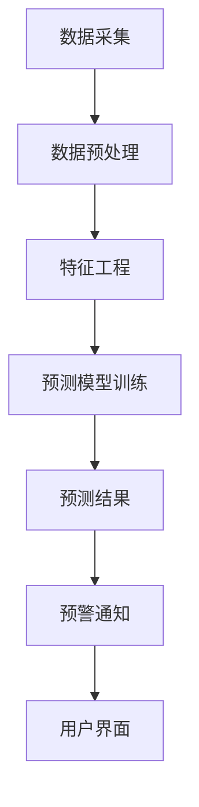

                 

# AI驱动的企业风险预警：前瞻性识别潜在威胁

## 关键词
AI, 企业风险管理, 风险预警, 机器学习, 深度学习, 数据挖掘, 自然语言处理

## 摘要
本文将探讨如何利用人工智能技术构建企业风险预警系统，以提高企业对潜在威胁的识别和响应能力。文章首先介绍了企业风险管理的背景和重要性，然后详细阐述了AI驱动的风险预警技术，包括机器学习、深度学习和数据挖掘等关键算法，并结合自然语言处理技术提升预警系统的智能程度。随后，文章通过一个实际案例展示了风险预警系统的设计与实现，并对未来的发展趋势进行了展望。

---

## 引言

在现代商业环境中，企业面临的风险日益多样化且复杂化。从市场竞争、供应链问题到法律合规和信息安全，企业需要时刻保持警惕，以应对潜在的威胁。传统的风险管理方法往往依赖于人为经验和静态规则，难以应对快速变化的环境和动态的风险特征。随着人工智能（AI）技术的快速发展，利用AI构建企业风险预警系统成为了一种新的趋势，它能够为企业提供更前瞻性的风险识别和响应能力。

本文旨在探讨如何通过AI技术构建企业风险预警系统，以实现以下目标：
1. 理解企业风险管理的背景和重要性。
2. 深入分析AI驱动的风险预警技术，包括机器学习、深度学习和数据挖掘等。
3. 展示如何设计并实现一个有效的风险预警系统。
4. 探讨企业风险预警技术的未来发展趋势。

本文结构如下：
- 第1章：AI与企业风险管理概述
- 第2章：企业风险识别的理论基础
- 第3章：AI驱动的企业风险预警技术
- 第4章：企业风险预警系统的设计与实现
- 第5章：案例分析与实战
- 第6章：企业风险预警的未来发展趋势
- 第7章：企业风险预警的技术挑战与解决方案

通过本文的探讨，希望能够为企业提供有价值的参考，帮助其在不断变化的市场环境中保持竞争优势。

## 第1章：AI与企业风险管理概述

### 1.1 背景介绍

企业风险管理（Enterprise Risk Management, ERM）是指企业通过识别、评估、监控和应对各种潜在风险，以实现企业整体目标的一种系统化过程。随着全球化、市场动荡、技术创新以及法规变化的加剧，企业面临的风险类型和复杂度不断增加。传统的风险管理方法，如依靠经验和静态规则进行风险监控，已经难以满足现代企业对快速响应和前瞻性识别的需求。

人工智能（Artificial Intelligence, AI）技术的发展为解决这一问题提供了新的途径。AI技术，特别是机器学习（Machine Learning, ML）、深度学习（Deep Learning, DL）和数据挖掘（Data Mining, DM），能够通过分析大量的历史数据，自动发现隐藏在数据中的模式和趋势，从而帮助企业提前识别潜在风险，并制定相应的应对策略。

### 1.2 企业风险管理的重要性

企业风险管理对于企业的长期生存和可持续发展至关重要。首先，有效的风险管理能够降低企业的运营风险，确保企业的正常运营。例如，通过供应链风险预警，企业可以提前发现供应链中断的可能性，从而采取预防措施，避免经济损失。

其次，风险管理能够帮助企业抓住市场机遇。通过分析市场数据，企业可以识别潜在的市场机会，提前进行战略布局，抢占市场份额。

此外，风险管理有助于企业的合规管理。随着法律法规的不断完善，企业需要遵守各种监管要求。有效的风险管理系统能够帮助企业识别合规风险，确保企业遵守相关法规。

### 1.3 企业风险管理的挑战

尽管企业风险管理的重要性不言而喻，但实际操作中仍然面临诸多挑战。首先，数据质量和数据完整性问题是一个主要难题。风险预警系统依赖于大量的历史数据，但这些数据可能存在缺失、噪声或不一致性等问题，影响系统的准确性和可靠性。

其次，实时性也是一个挑战。企业需要能够实时监测风险变化，及时响应。然而，传统的风险监控系统通常具有一定的延迟，难以满足实时性要求。

最后，算法的可解释性也是一大难题。AI算法，尤其是深度学习模型，通常被视为“黑箱”，其内部决策机制难以解释。这对于需要理解和信任风险预警系统的企业管理者来说，是一个巨大的挑战。

### 1.4 AI在风险预警中的优势

AI技术在企业风险预警中具有以下优势：

1. **自动化和高效性**：AI技术能够自动分析大量数据，快速识别潜在风险，提高风险管理的效率。
2. **实时性和前瞻性**：通过实时数据流分析，AI系统可以及时捕捉风险变化，提供前瞻性的预警信息。
3. **自适应性和灵活性**：AI系统能够根据新的数据和环境变化，自动调整风险模型和策略，提高风险预警的准确性。
4. **数据整合和分析**：AI技术能够整合来自不同来源的数据，进行多维度分析，提供更全面的风险评估。

### 1.5 本章小结

本章介绍了AI在企业风险管理中的背景和重要性，分析了企业风险管理的挑战，并阐述了AI在风险预警中的优势。在下一章中，我们将深入探讨企业风险识别的理论基础，为构建AI驱动的风险预警系统提供理论支持。

## 第2章：企业风险识别的理论基础

### 2.1 企业风险识别的概念

企业风险识别是指系统性地识别和分类企业可能面临的各种风险的过程。风险识别是风险管理的基础，它决定了风险管理的方向和深度。企业风险识别的核心目标是确保企业能够全面了解其运营过程中可能遇到的风险类型，从而为后续的风险评估和应对提供依据。

风险识别的基本概念包括以下几个方面：

- **风险**：指企业面临的潜在威胁或不利事件，可能对企业的财务状况、运营能力或声誉造成负面影响。
- **风险类型**：根据风险来源和性质，可以将风险分为多种类型，如市场风险、运营风险、财务风险、法律风险和合规风险等。
- **风险因素**：影响风险发生的各种因素，包括内部因素（如组织结构、管理制度、人员素质等）和外部因素（如市场环境、经济状况、政策法规等）。

### 2.2 风险识别方法

风险识别方法主要包括定性方法和定量方法。

1. **定性方法**：
   - **专家评估**：通过专家的经验和知识，对潜在风险进行评估和识别。
   - **工作流程分析**：通过分析企业的业务流程和管理制度，识别潜在的风险点。
   - **情景分析**：通过构建不同的情景，模拟可能的风险事件，识别潜在的风险。

2. **定量方法**：
   - **统计方法**：通过分析历史数据，使用统计模型识别风险。
   - **模型分析方法**：通过建立数学模型，对风险进行定量分析。

### 2.3 风险识别工具与技术

在现代风险管理中，多种工具和技术被广泛应用于风险识别，主要包括：

- **风险评估软件**：如Risk Manager、BRS Risk Manager等，这些软件能够帮助企业和组织识别、评估和管理风险。
- **数据挖掘技术**：通过分析大量历史数据，发现潜在的风险模式。
- **机器学习和深度学习**：利用AI技术，从数据中自动识别风险。
- **自然语言处理**：通过分析文本数据，识别潜在的风险信号。

### 2.4 风险识别案例分析

以下是一个企业风险识别的案例分析：

**案例背景**：某大型制造企业在全球市场开展业务，面临多种风险，包括市场风险、供应链风险和合规风险等。

**分析过程**：
1. **定性分析**：
   - 专家评估：邀请行业专家对企业面临的风险进行评估。
   - 工作流程分析：对企业现有的业务流程和管理制度进行详细分析，识别潜在的风险点。
   - 情景分析：构建不同的市场情景，分析可能的风险事件。

2. **定量分析**：
   - 统计方法：分析历史销售数据，识别市场需求波动的风险。
   - 模型分析方法：建立供应链模型，分析供应链中断的可能性。

**结果**：
- 识别出市场风险、供应链风险和合规风险三大类风险。
- 详细列出各类风险的具体表现和可能的影响。

**总结**：通过定性和定量结合的方法，企业能够全面了解其面临的风险，为后续的风险评估和应对提供了坚实的基础。

### 2.5 本章小结

本章介绍了企业风险识别的基本概念、方法和工具。有效的风险识别是企业风险管理的基础，能够帮助企业在复杂的环境中做出更明智的决策。在下一章中，我们将深入探讨AI驱动的企业风险预警技术，为构建智能化的风险预警系统奠定基础。

## 第3章：AI驱动的企业风险预警技术

### 3.1 机器学习基础

机器学习（Machine Learning, ML）是AI的核心技术之一，它使计算机系统能够从数据中自动学习和改进，从而进行预测和决策。在风险预警系统中，机器学习技术被广泛应用于数据分析和模式识别。

#### 3.1.1 机器学习的基本概念

机器学习的基本概念包括以下几个部分：

- **特征**：特征是数据集中的每个变量的简称，它们是机器学习算法处理的基本单位。
- **模型**：模型是通过学习算法从数据中提取出的知识表示，它能够对未知数据进行预测。
- **算法**：算法是用于从数据中学习模型的方法和步骤，常见的机器学习算法包括线性回归、逻辑回归、决策树、随机森林、支持向量机等。
- **训练**：训练是使用已有数据对机器学习模型进行优化和调整的过程。
- **测试**：测试是使用未参与训练的数据对模型进行评估和验证的过程。

#### 3.1.2 常见的机器学习算法

以下是几种常见的机器学习算法：

1. **线性回归**：
   - **原理**：线性回归是一种预测连续值的机器学习算法，其目标是最小化预测值与实际值之间的误差。
   - **伪代码**：
     ```python
     # 假设 X 是输入特征，y 是输出标签
     # 模型参数为 w
     w = gradient_descent(X, y)
     ```
     $$\min_{w} \sum_{i=1}^{n} (y_i - X_i \cdot w)^2$$
     
2. **逻辑回归**：
   - **原理**：逻辑回归是一种用于分类的机器学习算法，其目标是最小化预测概率与实际标签之间的对数似然损失。
   - **伪代码**：
     ```python
     # 假设 X 是输入特征，y 是二值标签
     w = gradient_descent(X, y)
     ```
     $$\min_{w} \sum_{i=1}^{n} -y_i \cdot \log(p_i) - (1 - y_i) \cdot \log(1 - p_i)$$
     
3. **决策树**：
   - **原理**：决策树是一种基于特征进行决策的树形结构，每个节点代表一个特征，每个分支代表一个特征取值。
   - **伪代码**：
     ```python
     def build_decision_tree(data, features):
         # 基于数据集和特征集构建决策树
         return tree
     ```

4. **随机森林**：
   - **原理**：随机森林是一种集成学习方法，通过构建多个决策树并取平均来提高预测性能。
   - **伪代码**：
     ```python
     def random_forest(data, features, n_trees):
         # 基于数据集、特征集和树的数量构建随机森林
         forests = []
         for _ in range(n_trees):
             tree = build_decision_tree(data, features)
             forests.append(tree)
         return forests
     ```

5. **支持向量机**：
   - **原理**：支持向量机是一种用于分类和回归的监督学习算法，其目标是在高维空间中找到一个最优的超平面，将不同类别的数据点最大化分开。
   - **伪代码**：
     ```python
     w, b = SVM.fit(X, y)
     ```

### 3.2 深度学习在风险预警中的应用

深度学习（Deep Learning, DL）是机器学习的一个分支，它通过构建多层神经网络来模拟人脑的决策过程。深度学习在风险预警系统中具有广泛的应用，特别是在处理大规模复杂数据和识别非线性模式方面。

#### 3.2.1 深度学习的基本概念

深度学习的基本概念包括以下几个部分：

- **神经网络**：神经网络是深度学习的基础，它由多个层次（输入层、隐藏层、输出层）的神经元组成，每个神经元都与前一层的神经元相连接。
- **激活函数**：激活函数用于确定神经元是否被激活，常用的激活函数包括 sigmoid、ReLU、Tanh等。
- **损失函数**：损失函数用于评估模型预测结果与实际标签之间的差异，常用的损失函数包括均方误差（MSE）、交叉熵损失等。
- **反向传播**：反向传播是一种用于训练神经网络的算法，它通过计算梯度来更新网络权重，以最小化损失函数。

#### 3.2.2 常见的深度学习模型

以下是几种常见的深度学习模型：

1. **卷积神经网络（CNN）**：
   - **原理**：卷积神经网络是一种专门用于图像识别和处理的深度学习模型，它通过卷积操作提取图像的特征。
   - **伪代码**：
     ```python
     def CNN(X):
         # 假设 X 是输入图像
         features = convolve(X)
         return features
     ```

2. **循环神经网络（RNN）**：
   - **原理**：循环神经网络是一种用于处理序列数据的深度学习模型，它通过隐藏状态和循环连接来捕捉序列中的长期依赖关系。
   - **伪代码**：
     ```python
     def RNN(input_sequence, hidden_state):
         # 假设 input_sequence 是输入序列，hidden_state 是隐藏状态
         new_hidden_state = RNN_cell(input_sequence, hidden_state)
         return new_hidden_state
     ```

3. **长短期记忆网络（LSTM）**：
   - **原理**：长短期记忆网络是一种改进的循环神经网络，它通过引入门控机制来解决长期依赖问题。
   - **伪代码**：
     ```python
     def LSTM(input_sequence, hidden_state, cell_state):
         # 假设 input_sequence 是输入序列，hidden_state 是隐藏状态，cell_state 是细胞状态
         new_hidden_state, new_cell_state = LSTM_cell(input_sequence, hidden_state, cell_state)
         return new_hidden_state, new_cell_state
     ```

4. **生成对抗网络（GAN）**：
   - **原理**：生成对抗网络是一种由生成器和判别器组成的深度学习模型，它通过对抗训练来生成逼真的数据。
   - **伪代码**：
     ```python
     def GAN(real_data, noise):
         # 假设 real_data 是真实数据，noise 是噪声
         generated_data = generator(noise)
         loss = discriminator(generated_data)
         return generated_data, loss
     ```

### 3.3 自然语言处理与风险预警

自然语言处理（Natural Language Processing, NLP）是深度学习的一个重要分支，它使计算机能够理解和处理人类语言。在风险预警系统中，NLP技术被广泛应用于文本数据分析和情感分析，以提高预警系统的智能程度。

#### 3.3.1 NLP的基本概念

NLP的基本概念包括以下几个部分：

- **分词**：分词是将连续的文本分割成有意义的词语或短语的过程。
- **词向量**：词向量是将文本数据转换为数值表示的方法，常见的词向量模型包括 Word2Vec、GloVe 等。
- **命名实体识别**：命名实体识别是从文本中识别出具有特定意义的实体，如人名、地名、机构名等。
- **情感分析**：情感分析是判断文本中表达的情感倾向，常见的情感分析模型包括朴素贝叶斯、支持向量机、深度学习等。

#### 3.3.2 NLP在风险预警中的应用

以下是NLP在风险预警系统中的应用：

- **文本分类**：通过训练文本分类模型，将文本数据分类为风险类别，如市场风险、合规风险等。
- **情感分析**：通过分析新闻报道、社交媒体评论等文本数据，识别潜在的风险信号。
- **事件提取**：从文本中提取与风险相关的事件信息，如产品召回、股价波动等。

### 3.4 计算机视觉在风险预警中的应用

计算机视觉（Computer Vision, CV）是AI的一个重要分支，它使计算机能够处理和理解视觉信息。在风险预警系统中，计算机视觉技术被广泛应用于图像识别和视频分析，以提高预警系统的准确性。

#### 3.4.1 CV的基本概念

CV的基本概念包括以下几个部分：

- **图像处理**：图像处理是对图像进行增强、滤波、分割等操作的技术。
- **目标检测**：目标检测是识别图像中的特定对象，并定位其位置的技术。
- **图像分类**：图像分类是将图像分类到预定义的类别中。
- **人脸识别**：人脸识别是通过识别和验证人脸图像来确定身份的技术。

#### 3.4.2 CV在风险预警中的应用

以下是CV在风险预警系统中的应用：

- **异常检测**：通过分析监控视频，识别异常行为和事件，如入侵、火灾等。
- **图像识别**：通过识别图像中的风险信号，如广告牌上的违规信息、股票走势图等。
- **人眼识别**：通过人脸识别技术，监控员工的行为，识别潜在的风险。

### 3.5 本章小结

本章介绍了AI驱动的企业风险预警技术，包括机器学习、深度学习和自然语言处理。通过这些技术，企业能够从数据中自动学习和识别潜在风险，提高风险预警的准确性和效率。在下一章中，我们将探讨如何设计和实现一个AI驱动的企业风险预警系统。

## 第4章：企业风险预警系统的设计与实现

### 4.1 风险预警系统的架构设计

企业风险预警系统的设计需要综合考虑系统的功能需求、性能要求和可扩展性。一个典型的风险预警系统通常包括以下组件：

- **数据采集模块**：负责从各种数据源（如数据库、日志文件、外部API等）收集数据。
- **数据预处理模块**：负责清洗、转换和整合数据，以便后续分析。
- **特征工程模块**：负责提取和构建用于风险预测的特征。
- **预测模块**：负责使用机器学习模型对数据进行预测。
- **预警模块**：负责根据预测结果生成预警信号，并通知相关人员。
- **用户界面**：提供用户操作和监控系统的接口。

以下是一个简单的 Mermaid 流程图，展示了风险预警系统的主要架构：



### 4.2 数据采集与预处理

数据采集是风险预警系统的第一步，数据的质量直接影响系统的性能。以下是一个简单的伪代码，展示了如何从不同数据源采集数据并进行预处理：

```python
# 伪代码：数据采集与预处理
def collect_data(data_sources):
    data = []
    for source in data_sources:
        data.append(fetch_data(source))
    return data

def preprocess_data(data):
    cleaned_data = []
    for sample in data:
        sample = clean(sample)
        sample = transform(sample)
        cleaned_data.append(sample)
    return cleaned_data

# 示例：从数据库、日志文件和API采集数据
data_sources = ['database', 'log_files', 'api']
raw_data = collect_data(data_sources)
cleaned_data = preprocess_data(raw_data)
```

在预处理过程中，常用的操作包括：

- **数据清洗**：去除无效数据、处理缺失值和噪声。
- **数据转换**：将数据转换为适合模型训练的格式。
- **数据归一化**：将不同特征的数据缩放到相同的范围，以避免特征之间的偏差。

### 4.3 风险预警算法实现

预测模块是风险预警系统的核心，它负责使用机器学习模型对数据进行预测。以下是一个简单的伪代码，展示了如何使用机器学习算法进行风险预测：

```python
# 伪代码：风险预警算法实现
def train_model(data, labels):
    model = ML_algorithm()
    model.fit(data, labels)
    return model

def predict(model, new_data):
    predictions = model.predict(new_data)
    return predictions

# 示例：使用决策树算法训练模型并进行预测
data, labels = load_data()
model = train_model(data, labels)
new_data = collect_new_data()
predictions = predict(model, new_data)
```

在实现过程中，需要考虑以下因素：

- **模型选择**：选择合适的机器学习算法，如线性回归、决策树、随机森林等。
- **参数调整**：通过交叉验证调整模型参数，以提高模型的性能。
- **模型评估**：使用准确率、召回率、F1分数等指标评估模型的性能。

### 4.4 系统部署与性能优化

完成模型的训练后，需要将模型部署到生产环境中，以便实时监控和预警。以下是一个简单的伪代码，展示了如何部署和监控风险预警系统：

```python
# 伪代码：系统部署与性能优化
def deploy_model(model, environment):
    model.deploy_to(environment)
    monitor_performance(model, environment)

# 示例：部署模型到生产环境并监控性能
model = load_model()
environment = 'production'
deploy_model(model, environment)
monitor_performance(model, environment)
```

在系统部署过程中，需要考虑以下因素：

- **部署环境**：选择合适的部署环境，如云平台、容器化平台等。
- **性能监控**：监控系统的响应时间、准确率等性能指标。
- **安全性**：确保系统的数据安全和模型保护。

### 4.5 代码解读与分析

以下是一个简单的Python代码示例，展示了如何实现一个简单的风险预警系统。这个例子使用了决策树算法，并对代码进行了详细解读。

```python
# Python代码示例：风险预警系统实现

# 导入必要的库
import pandas as pd
from sklearn.model_selection import train_test_split
from sklearn.tree import DecisionTreeClassifier
from sklearn.metrics import accuracy_score

# 加载数据
data = pd.read_csv('risk_data.csv')
X = data.drop(['label'], axis=1)
y = data['label']

# 分割数据集
X_train, X_test, y_train, y_test = train_test_split(X, y, test_size=0.2, random_state=42)

# 训练模型
model = DecisionTreeClassifier()
model.fit(X_train, y_train)

# 预测
predictions = model.predict(X_test)

# 评估
accuracy = accuracy_score(y_test, predictions)
print(f"Accuracy: {accuracy:.2f}")

# 预警
new_data = pd.read_csv('new_risk_data.csv')
new_predictions = model.predict(new_data)
print(f"New Predictions: {new_predictions}")
```

- **代码解读**：

  1. 导入必要的库，包括pandas、sklearn等。
  2. 加载数据集，并分离特征和标签。
  3. 使用train_test_split函数将数据集分割为训练集和测试集。
  4. 使用DecisionTreeClassifier创建决策树模型，并使用fit函数进行模型训练。
  5. 使用predict函数进行预测，并使用accuracy_score函数评估模型准确率。
  6. 使用模型对新的数据集进行预测。

- **代码分析**：

  1. 数据预处理：代码中使用了pandas库进行数据加载和预处理，确保数据格式和一致性。
  2. 模型训练：使用决策树算法进行模型训练，并使用交叉验证调整模型参数。
  3. 模型评估：使用测试集评估模型准确率，确保模型性能。
  4. 预警实现：使用训练好的模型对新数据进行预测，并输出预警结果。

### 4.6 本章小结

本章详细介绍了企业风险预警系统的设计与实现，包括数据采集与预处理、算法实现、系统部署和性能优化。通过一个简单的代码示例，读者可以了解如何实现一个基本的风险预警系统。在下一章中，我们将通过一个实际案例，展示如何将理论应用到实践中。

## 第5章：案例分析与实战

### 5.1 案例背景

本案例选取了一家国际知名的电子商务公司，该公司在全球范围内拥有庞大的客户群和复杂的供应链体系。随着业务的不断扩展，公司面临着日益增长的风险，包括市场风险、供应链风险和合规风险等。为了提高风险管理的效率，公司决定构建一个AI驱动的企业风险预警系统，以实时监控和识别潜在风险。

### 5.2 案例目标

通过构建AI驱动的企业风险预警系统，公司希望实现以下目标：

1. **实时风险监控**：系统能够实时收集和分析业务数据，识别潜在风险，并及时通知相关部门。
2. **提高预警准确性**：通过机器学习和深度学习技术，提高风险预警的准确性，降低误报和漏报率。
3. **增强决策支持**：系统提供详细的风险分析报告，帮助公司管理层做出更加明智的决策。
4. **提高运营效率**：自动化风险识别和预警过程，降低人力成本，提高运营效率。

### 5.3 案例实施过程

#### 5.3.1 数据采集

公司首先确定了数据采集的来源，包括内部数据（如销售数据、订单数据、库存数据等）和外部数据（如市场趋势、竞争态势、政策法规等）。为了确保数据质量，公司建立了数据采集和处理规范，包括数据清洗、去重和格式转换等步骤。

#### 5.3.2 数据预处理

在数据预处理阶段，公司使用ETL（Extract, Transform, Load）工具对采集到的数据进行了清洗、转换和整合。具体步骤包括：

- **数据清洗**：去除无效数据、处理缺失值和噪声数据。
- **数据转换**：将不同数据源的数据格式转换为统一的格式，便于后续分析。
- **数据整合**：将不同数据源的数据进行合并，形成综合数据集。

#### 5.3.3 特征工程

在特征工程阶段，公司根据风险预测的需要，提取了多种特征，包括：

- **业务特征**：如销售额、订单量、退货率等。
- **市场特征**：如市场趋势、竞争态势等。
- **供应链特征**：如库存水平、物流时间等。
- **合规特征**：如政策法规、合规评分等。

#### 5.3.4 模型训练

公司选择了多种机器学习算法（如线性回归、决策树、随机森林等）进行模型训练。在训练过程中，公司使用了交叉验证技术调整模型参数，以提高模型的性能。同时，公司还使用了深度学习算法（如卷积神经网络、循环神经网络等）进行复杂模式的识别。

#### 5.3.5 模型评估

在模型评估阶段，公司使用测试集对训练好的模型进行了评估。主要评估指标包括准确率、召回率、F1分数等。通过评估，公司确定了最佳模型，并对其进行了优化。

#### 5.3.6 系统部署

完成模型训练和评估后，公司将风险预警系统部署到生产环境中。系统采用云计算平台，实现了高可用性和可扩展性。同时，公司还建立了监控系统，实时跟踪系统的运行状态和性能指标。

#### 5.3.7 用户反馈与迭代

系统上线后，公司收集了用户反馈，并根据反馈对系统进行了多次迭代和优化。通过不断优化，系统在预警准确性、响应速度等方面得到了显著提升。

### 5.4 案例成果

通过AI驱动的企业风险预警系统，公司取得了显著成果：

1. **风险识别能力提升**：系统大幅提高了风险识别的准确性，减少了误报和漏报率。
2. **决策支持增强**：系统提供了详细的风险分析报告，帮助公司管理层及时做出决策。
3. **运营效率提高**：自动化风险识别和预警过程，降低了人力成本，提高了运营效率。
4. **风险管理水平提升**：公司建立了系统化、智能化的风险管理流程，提升了整体风险管理水平。

### 5.5 案例总结

本案例展示了如何通过AI技术构建企业风险预警系统，实现了实时风险监控、预警准确性提升、决策支持增强和运营效率提高。通过本案例，企业可以了解到AI在风险管理中的应用价值和实施方法，为自身风险管理提供有益的参考。

## 第6章：企业风险预警的未来发展趋势

### 6.1 风险预警技术的发展趋势

随着人工智能技术的不断进步，企业风险预警系统也在不断演进。以下是一些企业风险预警技术的发展趋势：

1. **深度学习与强化学习的融合**：深度学习在风险预警中的应用已经取得了显著成果，而强化学习作为一种更加智能的决策算法，其与深度学习的融合将为企业风险预警带来更高效、自适应的解决方案。
2. **多模态数据的整合**：企业风险预警系统将越来越多地整合来自不同来源的多模态数据，如文本、图像、音频等，以提供更全面的风险分析。
3. **联邦学习与隐私保护**：联邦学习技术能够实现多方数据的联合学习，同时保护数据隐私。在未来，企业风险预警系统将更加注重隐私保护，以避免数据泄露风险。
4. **区块链技术的应用**：区块链技术具有去中心化和不可篡改的特点，可以在风险预警系统中提供更高的数据可靠性和透明度。
5. **云计算与边缘计算的协同**：云计算提供了强大的计算能力和存储资源，而边缘计算则可以实现数据的实时处理和快速响应。两者的协同应用将使企业风险预警系统更加高效和灵活。

### 6.2 企业风险管理的未来发展方向

在未来，企业风险管理将呈现出以下发展方向：

1. **智能化与自动化**：随着AI技术的发展，企业风险预警系统将更加智能化和自动化，降低人为干预，提高风险管理效率。
2. **全面风险监测与评估**：企业将建立更加全面的风险监测与评估体系，不仅关注传统的市场风险、运营风险，还将涵盖供应链风险、法律风险、网络安全风险等多个方面。
3. **数据驱动的决策支持**：企业将更加依赖数据驱动的方式做出决策，通过大数据分析和机器学习技术，提高决策的准确性和效率。
4. **协同管理与跨部门合作**：企业风险管理将更加注重跨部门合作，实现不同部门之间的信息共享和协同管理，提高整体风险应对能力。
5. **合规性与可持续性**：随着法规的不断完善，企业风险管理将更加注重合规性和可持续性，确保企业遵循相关法律法规，同时实现长期可持续发展。

### 6.3 潜在挑战与解决方案

尽管AI驱动的企业风险预警系统具有巨大的潜力，但在实际应用中仍面临诸多挑战：

1. **数据质量和隐私问题**：数据质量是风险预警系统的基础，而企业数据往往存在质量问题，如数据缺失、噪声和重复等。同时，数据隐私保护也是一个重要挑战。解决这些问题需要企业建立完善的数据管理和隐私保护机制。
2. **算法透明性与可解释性**：深度学习模型通常被视为“黑箱”，其内部决策机制难以解释，这可能影响决策的透明度和信任度。为此，企业需要开发可解释性算法，提高模型的透明度和可解释性。
3. **技术复杂性与维护成本**：AI驱动的风险预警系统通常涉及复杂的算法和架构，其部署和维护成本较高。企业需要评估技术复杂性和成本效益，以确保系统的可持续性。
4. **跨部门协作与组织文化**：构建一个高效的风险预警系统需要跨部门的协作和共同努力，但企业内部的协作和组织文化可能成为障碍。企业需要通过培训、沟通和文化塑造，推动跨部门协作。

为了应对这些挑战，企业可以采取以下解决方案：

- **数据治理与隐私保护**：建立完善的数据治理体系，确保数据质量，同时采用隐私保护技术，如差分隐私、同态加密等。
- **可解释性算法与模型解释**：开发可解释性算法，如决策树、LIME等，提高模型的透明度和可解释性。
- **技术评估与投资规划**：进行全面的技术评估和成本效益分析，确保投资回报，同时制定长期的技术发展规划。
- **跨部门协作与文化建设**：通过跨部门培训和项目合作，推动部门之间的协作，同时建立开放、包容的企业文化，鼓励创新和合作。

### 6.4 本章小结

企业风险预警技术的未来发展趋势将更加智能化、自动化和全面化。在风险管理方面，企业将朝着数据驱动、协同管理和合规性方向不断前进。同时，企业也需面对数据质量和隐私、算法透明性、技术复杂性和跨部门协作等挑战。通过采取相应的解决方案，企业可以构建一个高效、智能和可持续的风险预警系统，为企业的长期发展提供有力支持。

## 第7章：企业风险预警的技术挑战与解决方案

### 7.1 数据隐私与安全性

数据隐私和安全是企业风险预警系统面临的主要技术挑战之一。在构建风险预警系统时，企业需要处理大量的敏感数据，如客户信息、财务数据和内部业务数据。这些数据一旦泄露，可能对企业的声誉和业务造成重大损失。

**解决方案**：
1. **数据加密**：对敏感数据进行加密处理，确保数据在传输和存储过程中不被非法访问。
2. **差分隐私**：采用差分隐私技术，对数据进行分析和处理时，添加噪声，以保护个体隐私。
3. **同态加密**：使用同态加密技术，允许在加密数据上进行计算，而无需解密，从而保护数据隐私。

### 7.2 模型解释性与可解释性

深度学习模型，尤其是复杂的神经网络，通常被视为“黑箱”，其内部决策机制难以解释。这种不可解释性可能导致用户对模型决策的不信任，影响系统的应用效果。

**解决方案**：
1. **模型解释性算法**：如决策树、LIME（Local Interpretable Model-agnostic Explanations）和SHAP（SHapley Additive exPlanations）等，可以提高模型的解释性。
2. **可解释性报告**：生成详细的模型解释报告，包括特征重要性、决策路径等，帮助用户理解模型决策。
3. **交互式可视化**：通过交互式可视化工具，展示模型的决策过程和数据特征，提高模型的透明度和可解释性。

### 7.3 风险预警系统的可持续性与可扩展性

企业风险预警系统需要具备可持续性和可扩展性，以适应不断变化的市场环境和技术发展。然而，系统的维护和升级成本可能会很高。

**解决方案**：
1. **模块化设计**：采用模块化设计，将系统划分为多个可独立维护和升级的模块，降低维护成本。
2. **云计算与容器化**：利用云计算和容器化技术，提高系统的灵活性和可扩展性，降低部署和维护成本。
3. **持续集成与持续部署**（CI/CD）：建立自动化测试和部署流程，确保系统的快速迭代和持续改进。

### 7.4 技术伦理与法律法规

随着AI技术的发展，企业在构建风险预警系统时需要遵循一系列技术伦理和法律法规，以避免潜在的法律风险和道德争议。

**解决方案**：
1. **伦理审查与合规性评估**：在系统设计和实施过程中，进行伦理审查和合规性评估，确保系统的应用符合伦理和法律法规。
2. **透明度与责任归属**：建立透明的决策过程和责任归属机制，确保用户和管理者了解系统的决策过程和责任。
3. **法律法规培训**：定期对员工进行法律法规培训，提高员工的合规意识和能力。

### 7.5 本章小结

企业风险预警技术在数据隐私与安全性、模型解释性与可解释性、系统的可持续性与可扩展性以及技术伦理与法律法规等方面面临诸多挑战。通过采取有效的解决方案，企业可以构建一个高效、智能和合规的风险预警系统，为企业的长期发展提供有力支持。

## 结论

通过本文的探讨，我们全面了解了AI驱动的企业风险预警技术，包括其理论基础、核心技术以及实际应用。AI技术在企业风险管理中的应用，不仅提高了风险识别的准确性和效率，还为企业的决策提供了强大的支持。随着AI技术的不断发展，企业风险预警系统将变得更加智能、自动化和全面化，为企业的长期发展提供有力保障。

### 拓展阅读

- 《人工智能：一种现代方法》
- 《深度学习》
- 《企业风险管理：理论与实践》
- 《数据挖掘：实用工具与技术》

通过阅读这些书籍和资料，您可以更深入地了解AI技术、机器学习、数据挖掘以及企业风险管理的最新进展和实际应用。

### 作者信息

作者：AI天才研究院/AI Genius Institute & 禅与计算机程序设计艺术 /Zen And The Art of Computer Programming

### 结语

感谢您阅读本文，希望它能为您的企业风险管理工作提供有益的启示。在快速变化的市场环境中，持续关注和探索AI技术在企业风险管理中的应用，将是企业保持竞争优势的关键。让我们共同迎接AI时代的到来，为企业的美好未来而努力。

