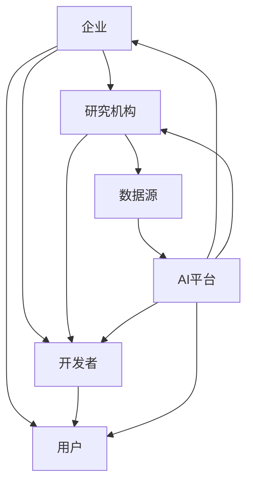
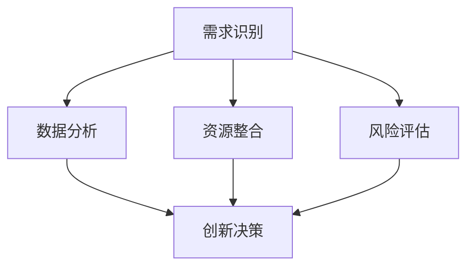
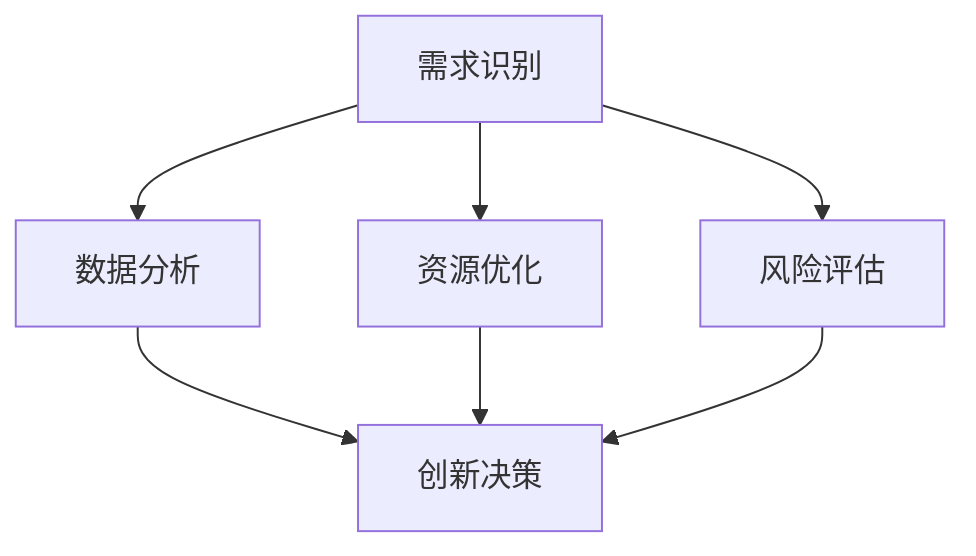

                 


## 文章标题

《AI驱动的创新生态系统：促进开放式创新》

## 关键词

AI驱动、创新生态系统、开放式创新、技术融合、数据驱动、评估方法

## 摘要

本文旨在探讨AI驱动的创新生态系统如何促进开放式创新。我们将从AI驱动的创新模式、开放式创新的本质与挑战、AI驱动的创新生态系统构建、开放式创新的实施与评估等方面，详细分析并阐述AI在创新生态系统中的关键作用。通过实际案例研究和未来发展趋势的展望，本文希望为构建高效的AI驱动创新生态系统提供有价值的思路。

---

## 第一部分：引言

### 1.1 AI驱动的创新生态系统概述

在当今快速变化的科技环境中，人工智能（AI）正逐渐成为推动创新的重要力量。AI驱动的创新生态系统指的是通过人工智能技术来优化创新过程，形成一个动态的、相互关联的复杂网络。这个生态系统包括企业、研究机构、开发者、用户等多个利益相关者，共同推动创新活动的发展。

**核心概念与联系**

为了更好地理解AI驱动的创新生态系统，我们使用Mermaid流程图来展示其基本组成和互动关系：



在这个流程图中，企业、研究机构、开发者、用户以及数据源都是创新生态系统的关键组成部分。AI平台作为核心枢纽，连接并协调各方资源，推动创新过程的不断迭代和优化。

**AI驱动的创新模式**

AI驱动的创新模式通常包括以下几个步骤：

1. **数据收集与预处理**：从多个数据源收集数据，并进行清洗、整合和预处理，以建立高质量的数据集。
2. **特征提取与选择**：利用机器学习算法提取数据中的关键特征，并进行筛选，以提高模型的预测准确性和泛化能力。
3. **模型训练与优化**：选择合适的机器学习模型进行训练，并通过调整模型参数来优化性能。
4. **模型部署与迭代**：将训练好的模型部署到实际应用场景中，并根据用户反馈进行迭代和优化。

以下是一个简化的伪代码，用于描述AI驱动的创新流程：

```python
# 数据收集与预处理
data = collect_data(sources)
preprocessed_data = preprocess_data(data)

# 特征提取与选择
features = extract_features(preprocessed_data)
selected_features = select_features(features)

# 模型训练与优化
model = train_model(selected_features)
optimized_model = optimize_model(model)

# 模型部署与迭代
deploy_model(optimized_model)
iterate_model(optimized_model, user_feedback)
```

**开放式创新的本质与挑战**

开放式创新与传统创新相比，更强调跨组织、跨领域的合作，以及用户参与和外部资源的整合。其本质在于通过开放创新过程，实现资源的最大化利用和价值的最大化创造。

然而，开放式创新也面临着一系列挑战，包括：

- **知识产权保护**：在开放式创新过程中，如何平衡知识产权保护与创新资源的共享是一个重要问题。
- **合作机制的建立**：如何构建有效的合作机制，以促进各方利益的最大化，是一个关键挑战。
- **数据隐私与安全**：随着数据在创新过程中的重要性增加，数据隐私和安全问题也日益凸显。

为了应对这些挑战，需要从以下几个方面进行思考和探索：

- **法律与政策框架**：建立健全的法律和政策框架，为开放式创新提供制度保障。
- **技术手段**：利用加密技术、区块链等手段，保障数据的安全性和隐私性。
- **文化变革**：推动企业内部和外部的文化变革，培养开放、合作和创新的精神。

### 1.2 开放式创新与传统创新的比较与融合

**开放式创新的特征**

开放式创新具有以下几个显著特征：

- **跨组织合作**：开放式创新强调跨组织、跨领域的合作，通过共享资源和知识，实现协同创新。
- **用户参与**：用户不仅仅是创新成果的消费者，更是创新的参与者和贡献者。
- **外部资源整合**：开放式创新注重整合外部资源，如资金、技术、人才等，以实现资源的最大化利用。

**传统创新与开放式创新的融合路径**

传统创新与开放式创新的融合路径主要包括以下几个方面：

- **创新流程融合**：将开放式创新的跨组织合作、用户参与等特征融入到传统创新流程中，形成一个更加开放和灵活的创新体系。
- **资源共享与协同**：通过建立共享平台和协作网络，实现创新资源的整合和协同利用。
- **知识产权管理**：在开放式创新中，知识产权管理需要更加灵活和动态，以适应创新过程的复杂性。

为了更好地描述传统创新与开放式创新的融合路径，我们可以使用LaTeX表示以下融合模型：

```latex
\begin{equation}
\text{融合模型} = \text{传统创新} + \text{开放式创新特征} \times \text{合作机制} + \text{知识产权管理策略}
\end{equation}
```

在这个模型中，传统创新作为基础，开放式创新特征和合作机制作为动力，知识产权管理策略作为保障，共同推动创新体系的融合与发展。

### 1.3 总结

通过以上分析，我们可以看出，AI驱动的创新生态系统和开放式创新在推动技术创新、促进社会进步方面具有巨大的潜力。在接下来的部分，我们将进一步探讨AI驱动的创新生态系统构建、实施与评估，以及全球范围内的案例分析，以期为构建高效的创新生态系统提供有价值的参考。

---

在上述的引言部分，我们首先介绍了AI驱动的创新生态系统，并使用Mermaid流程图展示了其基本组成和互动关系。接着，我们详细阐述了AI驱动的创新模式，并通过伪代码进行了描述。此外，我们还探讨了开放式创新的本质与挑战，以及传统创新与开放式创新的比较与融合。这些内容为后续章节的深入探讨奠定了坚实的基础。

---

## 第二部分：AI驱动的创新生态系统构建

### 2.1 AI驱动的创新生态系统构建框架

构建一个高效、可持续的AI驱动的创新生态系统是一个复杂的过程，需要充分考虑各种要素的相互作用和协同效应。在这一部分，我们将详细讨论AI驱动的创新生态系统构建的框架，包括创新生态系统的构成要素、构建步骤和关键技术。

#### 创新生态系统的构成要素

一个完善的AI驱动的创新生态系统通常包括以下几个关键构成要素：

1. **企业**：企业是创新生态系统的核心成员，负责产品研发、市场推广和商业化应用。
2. **研究机构**：研究机构如大学、研究所等，负责基础研究和新技术探索。
3. **开发者**：开发者包括独立开发者、开源社区成员等，他们为生态系统提供技术支持和创新解决方案。
4. **用户**：用户是创新的最终受益者，他们的需求驱动着创新的发展方向。
5. **数据源**：数据源是创新生态系统的基础，提供海量的数据用于训练和优化AI模型。
6. **AI平台**：AI平台是连接各要素的枢纽，提供数据管理、模型训练、部署和监控等一站式服务。

**核心概念与联系**

为了更好地理解AI驱动的创新生态系统，我们可以使用Mermaid流程图来展示其基本组成和互动关系：


在这个流程图中，企业、研究机构、开发者、用户以及数据源都是创新生态系统的关键组成部分。AI平台作为核心枢纽，连接并协调各方资源，推动创新过程的不断迭代和优化。

#### AI驱动的创新生态系统构建步骤

构建一个AI驱动的创新生态系统需要遵循以下步骤：

1. **需求分析与规划**：首先，需要对市场需求、技术发展趋势和生态系统的目标进行深入分析，制定详细的构建规划。
2. **技术选型与平台搭建**：选择合适的AI技术，搭建AI平台，确保数据管理、模型训练和部署等关键功能的实现。
3. **数据收集与整合**：从多个数据源收集数据，并进行清洗、整合和预处理，以建立高质量的数据集。
4. **模型开发与优化**：利用机器学习算法开发模型，并通过不断迭代和优化，提高模型的性能和鲁棒性。
5. **模型部署与监控**：将训练好的模型部署到实际应用场景中，并对其进行实时监控和调整，以确保系统的稳定性和高效性。
6. **生态系统运营与优化**：持续运营和优化创新生态系统，收集用户反馈，不断迭代和改进系统。

以下是一个简化的伪代码，用于描述AI驱动的创新生态系统构建步骤：

```python
# 需求分析与规划
plan = analyze_demand()

# 技术选型与平台搭建
platform = select_technology(build_platform())

# 数据收集与整合
data = collect_data(sources)
integrated_data = integrate_data(data)

# 模型开发与优化
model = develop_model(integrated_data)
optimized_model = optimize_model(model)

# 模型部署与监控
deploy_model(optimized_model)
monitor_model(optimized_model)

# 生态系统运营与优化
operate_ecosystem(optimized_model)
```

#### 数据驱动与创新生态系统

数据是AI驱动的创新生态系统的核心资源。数据的质量和数量直接影响模型的性能和生态系统的效能。以下是从数据驱动角度讨论创新生态系统的构建：

1. **数据收集**：从多个数据源收集数据，包括企业内部数据、外部公开数据和用户生成数据等。
2. **数据预处理**：对收集到的数据进行清洗、整合和预处理，以提高数据的质量和一致性。
3. **数据建模**：利用机器学习算法对预处理后的数据进行建模，提取有价值的信息和特征。
4. **数据管理**：建立完善的数据管理系统，确保数据的安全、可靠和可访问性。

**数学模型和数学公式**

在数据驱动的创新生态系统中，可以使用以下数学模型和数学公式来描述数据质量评估和数据分析过程：

- **数据质量评估模型**：

  $$Q = \frac{1}{N} \sum_{i=1}^{N} w_i \cdot P_i$$

  其中，$Q$ 表示数据质量，$N$ 表示数据样本数量，$w_i$ 表示第 $i$ 个数据样本的权重，$P_i$ 表示第 $i$ 个数据样本的质量。

- **数据分析模型**：

  $$F = \sum_{i=1}^{N} \alpha_i \cdot f_i$$

  其中，$F$ 表示数据分析结果，$N$ 表示特征数量，$\alpha_i$ 表示第 $i$ 个特征的权重，$f_i$ 表示第 $i$ 个特征。

**数据驱动创新的实践**

在实际应用中，数据驱动创新的关键在于如何有效地利用数据来驱动创新过程。以下是一个简化的数据驱动创新流程：

1. **需求识别**：识别创新需求，明确创新目标和方向。
2. **数据收集**：根据需求收集相关数据，包括市场数据、用户反馈数据、技术数据等。
3. **数据预处理**：对收集到的数据进行清洗、整合和预处理，建立高质量的数据集。
4. **数据分析**：利用机器学习算法对预处理后的数据进行分析，提取有价值的信息和特征。
5. **决策制定**：基于数据分析结果，制定创新决策和策略。
6. **创新实施**：实施创新决策，将创新方案转化为实际产品或服务。
7. **效果评估**：评估创新效果，收集用户反馈，为下一轮创新提供参考。

以下是一个简化的伪代码，用于描述数据驱动创新的实践：

```python
# 需求识别
demand = identify_demand()

# 数据收集
data = collect_data(sources)

# 数据预处理
preprocessed_data = preprocess_data(data)

# 数据分析
analysis_results = analyze_data(preprocessed_data)

# 决策制定
decision = make_decision(analysis_results)

# 创新实施
implement_innovation(decision)

# 效果评估
evaluate_innovation()
```

#### AI技术与开放式创新平台的整合

AI技术在开放式创新平台中的应用，可以极大地提升创新效率和效果。以下是从整合角度讨论AI技术与开放式创新平台的关系：

1. **AI技术在需求识别中的应用**：利用自然语言处理（NLP）技术分析用户需求，提取关键词和主题，帮助识别潜在的创新需求。
2. **AI技术在数据分析中的应用**：利用机器学习算法对大量数据进行分析，提取有价值的信息和趋势，为创新决策提供依据。
3. **AI技术在资源整合中的应用**：利用AI技术优化资源分配和调度，提高资源的利用效率和协同效应。
4. **AI技术在风险评估中的应用**：利用AI技术进行风险评估和预测，降低创新过程中的风险。

**核心概念与联系**

为了更好地理解AI技术与开放式创新平台的整合，我们可以使用Mermaid流程图来展示其基本组成和互动关系：



在这个流程图中，需求识别、数据分析、资源整合和风险评估是创新决策的关键环节，它们通过AI技术的应用，形成一个闭环，推动开放式创新平台的持续优化和发展。

#### 开放式创新平台的构建策略

构建一个高效的开放式创新平台，需要考虑以下几个方面：

1. **合作机制**：建立有效的合作机制，促进各利益相关方的协同创新。
2. **资源共享**：实现资源的共享和协同利用，提高创新效率。
3. **知识产权管理**：建立健全的知识产权管理机制，保护创新成果的同时促进知识共享。
4. **用户参与**：鼓励用户参与创新过程，提供反馈和改进建议，提高创新效果。

**核心算法原理讲解**

在开放式创新平台的构建过程中，核心算法的原理如下：

1. **合作网络分析**：利用图论算法分析各利益相关方之间的合作网络，识别关键节点和路径，优化合作机制。
2. **协同创新模型**：利用机器学习算法建立协同创新模型，预测创新趋势和效果，指导创新决策。
3. **风险评估模型**：利用数据挖掘算法进行风险评估，识别潜在风险，制定风险管理策略。

以下是一个简化的伪代码，用于描述开放式创新平台的构建策略：

```python
# 合作网络分析
network = analyze Cooperation_Network()

# 协同创新模型
innovation_model = build_Cooperative_Innovation_Model()

# 风险评估模型
risk_model = build_Risk_Assessment_Model()

# 知识共享机制
knowledge_sharing_mechanism = build_Knowledge_Sharing_Mechanism()

# 用户参与机制
user_participation_mechanism = build_User_Participation_Mechanism()

# 创新决策
decision = make_Innovation_Decision(network, innovation_model, risk_model, knowledge_sharing_mechanism, user_participation_mechanism)
```

#### 促进开放式创新的AI算法与应用案例

为了更好地理解AI技术在促进开放式创新中的应用，以下介绍几种常用的AI算法，并结合实际案例进行讲解：

1. **深度学习算法**：深度学习算法在图像识别、自然语言处理等领域具有广泛应用，可以用于需求识别、数据分析等创新环节。
2. **强化学习算法**：强化学习算法在资源调度、风险评估等方面具有优势，可以用于优化创新资源的配置和风险控制。
3. **聚类分析算法**：聚类分析算法可以用于用户行为分析、市场细分等，帮助识别创新机会和目标用户群体。

**应用案例解析**

以下是一个基于深度学习算法的需求识别案例：

**案例背景**：某企业希望通过分析用户反馈数据，识别出潜在的市场需求，以便进行产品创新。

**解决方案**：采用深度学习算法，对用户反馈文本进行情感分析和主题建模，提取关键词和主题，识别出潜在的市场需求。

**实现步骤**：

1. **数据收集**：收集用户反馈文本数据，包括评论、提问、投诉等。
2. **数据预处理**：对文本数据进行清洗、去噪和分词，建立词向量模型。
3. **情感分析**：利用预训练的神经网络模型进行情感分析，判断用户反馈的情感倾向。
4. **主题建模**：采用LDA（Latent Dirichlet Allocation）算法进行主题建模，提取用户反馈中的关键词和主题。
5. **需求识别**：基于情感分析和主题建模结果，识别出潜在的市场需求。

**代码实现**（Python示例）：

```python
# 数据预处理
preprocessed_data = preprocess_data(raw_data)

# 情感分析
sentiments = sentiment_analysis(preprocessed_data)

# 主题建模
topics = topic_modeling(preprocessed_data)

# 需求识别
demands = identify_demand(sentiments, topics)
```

**案例效果**：通过上述方法，企业成功识别出多个潜在的市场需求，为产品创新提供了有力支持。

### 2.2 数据驱动与创新生态系统

在AI驱动的创新生态系统中，数据驱动的角色至关重要。数据不仅是AI模型的训练素材，也是创新决策的依据。以下从数据驱动的角度，进一步探讨创新生态系统的构建：

**数据的重要性**

1. **数据的质量**：高质量的数据是构建精准模型的基石。数据的质量直接影响模型的性能和预测能力。
2. **数据的多样性**：多样性数据可以提供更丰富的信息，有助于模型发现潜在的模式和趋势。
3. **数据的时效性**：时效性数据能够反映最新的市场动态和用户需求，有助于快速响应市场变化。

**数据驱动创新的实践**

数据驱动创新的实践可以分为以下几个阶段：

1. **数据收集与整合**：从多个来源收集数据，包括企业内部数据、用户生成数据、市场公开数据等，并进行整合，建立统一的数据仓库。
2. **数据预处理与建模**：对收集到的数据进行清洗、去噪、归一化等预处理，然后利用机器学习算法进行建模，提取数据中的有用信息。
3. **数据分析与决策**：基于分析结果，进行创新决策，如产品优化、市场定位、资源调配等。
4. **数据监控与优化**：持续监控数据质量，优化数据收集、处理和分析流程，确保数据的实时性和准确性。

**数学模型和数学公式**

在数据驱动创新过程中，可以运用多种数学模型和公式来指导数据分析和决策：

- **回归模型**：用于预测用户行为和市场趋势，如线性回归、逻辑回归等。
- **聚类模型**：用于市场细分和用户画像，如K-means、层次聚类等。
- **时间序列模型**：用于分析市场动态和趋势，如ARIMA、LSTM等。

以下是一个简化的数学模型示例：

$$
\text{预测模型} = f(X) = \beta_0 + \beta_1X_1 + \beta_2X_2 + \ldots + \beta_nX_n
$$

其中，$X$ 表示输入特征，$\beta_0, \beta_1, \beta_2, \ldots, \beta_n$ 为模型参数，$f(X)$ 为预测结果。

**数据驱动创新的实际案例**

以下是一个基于聚类分析的市场细分案例：

**案例背景**：某电商企业希望通过分析用户行为数据，对用户进行细分，以便进行精准营销。

**解决方案**：采用K-means聚类算法，对用户行为数据进行分析，识别出不同类型的用户群体。

**实现步骤**：

1. **数据收集**：收集用户的购买行为、浏览行为等数据。
2. **数据预处理**：对数据进行标准化处理，消除不同特征间的量纲影响。
3. **聚类分析**：使用K-means算法进行聚类，设置合适的聚类数目，得到不同类型的用户群体。
4. **用户细分**：根据聚类结果，对用户进行细分，制定个性化的营销策略。

**代码实现**（Python示例）：

```python
# 数据预处理
normalized_data = normalize_data(raw_data)

# 聚类分析
clusters = kmeans_clustering(normalized_data, num_clusters)

# 用户细分
user_segments = segment_users(clusters)
```

**案例效果**：通过聚类分析，企业成功识别出多个用户群体，并针对不同群体制定了个性化的营销策略，提升了用户满意度和转化率。

### 2.3 AI技术与开放式创新平台的整合

AI技术在开放式创新平台中的应用，可以极大地提升创新效率和效果。以下从整合角度，进一步探讨AI技术与开放式创新平台的关系：

**AI技术在开放式创新平台中的应用**

1. **需求识别**：利用自然语言处理（NLP）技术分析用户需求，提取关键词和主题，帮助识别潜在的创新需求。
2. **数据分析**：利用机器学习算法对大量数据进行分析，提取有价值的信息和趋势，为创新决策提供依据。
3. **资源优化**：利用AI技术优化资源分配和调度，提高资源的利用效率和协同效应。
4. **风险评估**：利用AI技术进行风险评估和预测，降低创新过程中的风险。

**核心概念与联系**

为了更好地理解AI技术与开放式创新平台的整合，我们可以使用Mermaid流程图来展示其基本组成和互动关系：



在这个流程图中，需求识别、数据分析、资源优化和风险评估是创新决策的关键环节，它们通过AI技术的应用，形成一个闭环，推动开放式创新平台的持续优化和发展。

**AI驱动的创新生态系统模型**

为了更好地描述AI驱动的创新生态系统，我们可以使用以下模型：

$$
\text{创新生态系统} = \text{AI平台} \times (\text{数据源} + \text{企业} + \text{研究机构} + \text{开发者} + \text{用户})
$$

在这个模型中，AI平台作为核心，连接和协调数据源、企业、研究机构、开发者、用户等多方资源，形成一个动态的、相互关联的生态系统。数据源提供创新所需的数据，企业、研究机构、开发者、用户则是生态系统的关键组成部分，通过AI平台的整合，共同推动创新活动的持续发展。

### 2.4 促进开放式创新的AI算法与应用案例

为了更好地理解AI技术在促进开放式创新中的应用，以下介绍几种常用的AI算法，并结合实际案例进行讲解：

**深度学习算法**

深度学习算法在图像识别、自然语言处理等领域具有广泛应用，可以用于需求识别、数据分析等创新环节。以下是一个基于卷积神经网络（CNN）的需求识别案例：

**案例背景**：某电商平台希望通过分析用户评论，识别出用户对产品的主要需求。

**解决方案**：采用深度学习算法，对用户评论进行情感分析和需求提取。

**实现步骤**：

1. **数据收集**：收集用户评论数据，包括正面评论、负面评论等。
2. **数据预处理**：对评论数据进行清洗、去噪和分词，建立词向量模型。
3. **情感分析**：利用预训练的CNN模型进行情感分析，判断评论的情感倾向。
4. **需求提取**：根据情感分析结果，提取出用户的主要需求。

**代码实现**（Python示例）：

```python
# 数据预处理
preprocessed_comments = preprocess_comments(raw_comments)

# 情感分析
sentiments = sentiment_analysis(preprocessed_comments)

# 需求提取
demands = extract_demands(sentiments)
```

**案例效果**：通过深度学习算法，平台成功识别出用户的主要需求，为产品改进和市场策略制定提供了有力支持。

**强化学习算法**

强化学习算法在资源调度、风险评估等方面具有优势，可以用于优化创新资源的配置和风险控制。以下是一个基于强化学习的资源调度案例：

**案例背景**：某创新实验室需要优化实验资源的调度，以最大化实验效率。

**解决方案**：采用强化学习算法，自动调度实验资源，优化实验流程。

**实现步骤**：

1. **状态空间定义**：定义实验资源的状态空间，包括实验设备、人员、材料等。
2. **动作空间定义**：定义可执行的调度动作，如设备分配、人员调度等。
3. **奖励函数设计**：设计奖励函数，以最大化实验效率为目标，评估调度动作的效果。
4. **模型训练**：利用强化学习算法，训练调度模型，优化调度策略。

**代码实现**（Python示例）：

```python
# 状态空间定义
state_space = define_state_space()

# 动作空间定义
action_space = define_action_space()

# 奖励函数设计
reward_function = design_reward_function()

# 模型训练
scheduling_model = train_reinforcement_learning_model(state_space, action_space, reward_function)
```

**案例效果**：通过强化学习算法，实验室成功优化了实验资源的调度，提高了实验效率和成果产出。

**聚类分析算法**

聚类分析算法可以用于用户行为分析、市场细分等，帮助识别创新机会和目标用户群体。以下是一个基于K-means聚类分析的用户细分案例：

**案例背景**：某互联网公司希望通过分析用户行为数据，对用户进行细分，以便进行精准营销。

**解决方案**：采用K-means聚类算法，对用户行为数据进行分析，识别出不同类型的用户群体。

**实现步骤**：

1. **数据收集**：收集用户的浏览行为、购买行为等数据。
2. **数据预处理**：对数据进行标准化处理，消除不同特征间的量纲影响。
3. **聚类分析**：使用K-means算法进行聚类，设置合适的聚类数目，得到不同类型的用户群体。
4. **用户细分**：根据聚类结果，对用户进行细分，制定个性化的营销策略。

**代码实现**（Python示例）：

```python
# 数据预处理
normalized_data = normalize_data(raw_data)

# 聚类分析
clusters = kmeans_clustering(normalized_data, num_clusters)

# 用户细分
user_segments = segment_users(clusters)
```

**案例效果**：通过聚类分析，公司成功识别出多个用户群体，并针对不同群体制定了个性化的营销策略，提升了用户满意度和转化率。

### 2.5 总结

在本部分中，我们详细讨论了AI驱动的创新生态系统构建的框架、数据驱动与创新生态系统的构建、AI技术与开放式创新平台的整合，以及促进开放式创新的AI算法与应用案例。通过这些讨论，我们可以看到AI在创新生态系统中的关键作用，以及如何利用AI技术推动开放式创新的发展。在下一部分，我们将进一步探讨开放式创新的实施与评估，以及全球范围内的AI驱动创新生态系统案例分析。

---

## 第二部分：AI驱动的创新生态系统构建

### 2.1 AI驱动的创新生态系统构建框架

构建一个高效、可持续的AI驱动的创新生态系统是一个复杂的过程，需要充分考虑各种要素的相互作用和协同效应。在这一部分，我们将详细讨论AI驱动的创新生态系统构建的框架，包括创新生态系统的构成要素、构建步骤和关键技术。

#### 创新生态系统的构成要素

一个完善的AI驱动的创新生态系统通常包括以下几个关键构成要素：

1. **企业**：企业是创新生态系统的核心成员，负责产品研发、市场推广和商业化应用。
2. **研究机构**：研究机构如大学、研究所等，负责基础研究和新技术探索。
3. **开发者**：开发者包括独立开发者、开源社区成员等，他们为生态系统提供技术支持和创新解决方案。
4. **用户**：用户是创新的最终受益者，他们的需求驱动着创新的发展方向。
5. **数据源**：数据源是创新生态系统的基础，提供海量的数据用于训练和优化AI模型。
6. **AI平台**：AI平台是连接各要素的枢纽，提供数据管理、模型训练、部署和监控等一站式服务。

**核心概念与联系**

为了更好地理解AI驱动的创新生态系统，我们可以使用Mermaid流程图来展示其基本组成和互动关系：


在这个流程图中，企业、研究机构、开发者、用户以及数据源都是创新生态系统的关键组成部分。AI平台作为核心枢纽，连接并协调各方资源，推动创新过程的不断迭代和优化。

#### AI驱动的创新生态系统构建步骤

构建一个AI驱动的创新生态系统需要遵循以下步骤：

1. **需求分析与规划**：首先，需要对市场需求、技术发展趋势和生态系统的目标进行深入分析，制定详细的构建规划。
2. **技术选型与平台搭建**：选择合适的AI技术，搭建AI平台，确保数据管理、模型训练和部署等关键功能的实现。
3. **数据收集与整合**：从多个数据源收集数据，并进行清洗、整合和预处理，以建立高质量的数据集。
4. **模型开发与优化**：利用机器学习算法开发模型，并通过不断迭代和优化，提高模型的性能和鲁棒性。
5. **模型部署与监控**：将训练好的模型部署到实际应用场景中，并对其进行实时监控和调整，以确保系统的稳定性和高效性。
6. **生态系统运营与优化**：持续运营和优化创新生态系统，收集用户反馈，不断迭代和改进系统。

以下是一个简化的伪代码，用于描述AI驱动的创新生态系统构建步骤：

```python
# 需求分析与规划
plan = analyze_demand()

# 技术选型与平台搭建
platform = select_technology(build_platform())

# 数据收集与整合
data = collect_data(sources)
integrated_data = integrate_data(data)

# 模型开发与优化
model = develop_model(integrated_data)
optimized_model = optimize_model(model)

# 模型部署与监控
deploy_model(optimized_model)
monitor_model(optimized_model)

# 生态系统运营与优化
operate_ecosystem(optimized_model)
```

#### 数据驱动与创新生态系统

在AI驱动的创新生态系统中，数据驱动的角色至关重要。数据不仅是AI模型的训练素材，也是创新决策的依据。以下从数据驱动的角度，进一步探讨创新生态系统的构建：

**数据的重要性**

1. **数据的质量**：高质量的数据是构建精准模型的基石。数据的质量直接影响模型的性能和预测能力。
2. **数据的多样性**：多样性数据可以提供更丰富的信息，有助于模型发现潜在的模式和趋势。
3. **数据的时效性**：时效性数据能够反映最新的市场动态和用户需求，有助于快速响应市场变化。

**数据驱动创新的实践**

数据驱动创新的实践可以分为以下几个阶段：

1. **数据收集与整合**：从多个来源收集数据，包括企业内部数据、用户生成数据、市场公开数据等，并进行整合，建立统一的数据仓库。
2. **数据预处理与建模**：对收集到的数据进行清洗、去噪、归一化等预处理，然后利用机器学习算法进行建模，提取数据中的有用信息。
3. **数据分析与决策**：基于分析结果，进行创新决策，如产品优化、市场定位、资源调配等。
4. **数据监控与优化**：持续监控数据质量，优化数据收集、处理和分析流程，确保数据的实时性和准确性。

**数学模型和数学公式**

在数据驱动创新过程中，可以运用多种数学模型和公式来指导数据分析和决策：

- **回归模型**：用于预测用户行为和市场趋势，如线性回归、逻辑回归等。
- **聚类模型**：用于市场细分和用户画像，如K-means、层次聚类等。
- **时间序列模型**：用于分析市场动态和趋势，如ARIMA、LSTM等。

以下是一个简化的数学模型示例：

$$
\text{预测模型} = f(X) = \beta_0 + \beta_1X_1 + \beta_2X_2 + \ldots + \beta_nX_n
$$

其中，$X$ 表示输入特征，$\beta_0, \beta_1, \beta_2, \ldots, \beta_n$ 为模型参数，$f(X)$ 为预测结果。

**数据驱动创新的实际案例**

以下是一个基于聚类分析的市场细分案例：

**案例背景**：某电商企业希望通过分析用户行为数据，对用户进行细分，以便进行精准营销。

**解决方案**：采用K-means聚类算法，对用户行为数据进行分析，识别出不同类型的用户群体。

**实现步骤**：

1. **数据收集**：收集用户的浏览行为、购买行为等数据。
2. **数据预处理**：对数据进行标准化处理，消除不同特征间的量纲影响。
3. **聚类分析**：使用K-means算法进行聚类，设置合适的聚类数目，得到不同类型的用户群体。
4. **用户细分**：根据聚类结果，对用户进行细分，制定个性化的营销策略。

**代码实现**（Python示例）：

```python
# 数据预处理
normalized_data = normalize_data(raw_data)

# 聚类分析
clusters = kmeans_clustering(normalized_data, num_clusters)

# 用户细分
user_segments = segment_users(clusters)
```

**案例效果**：通过聚类分析，企业成功识别出多个用户群体，并针对不同群体制定了个性化的营销策略，提升了用户满意度和转化率。

### 2.2 AI技术与开放式创新平台的整合

AI技术在开放式创新平台中的应用，可以极大地提升创新效率和效果。以下从整合角度，进一步探讨AI技术与开放式创新平台的关系：

**AI技术在开放式创新平台中的应用**

1. **需求识别**：利用自然语言处理（NLP）技术分析用户需求，提取关键词和主题，帮助识别潜在的创新需求。
2. **数据分析**：利用机器学习算法对大量数据进行分析，提取有价值的信息和趋势，为创新决策提供依据。
3. **资源优化**：利用AI技术优化资源分配和调度，提高资源的利用效率和协同效应。
4. **风险评估**：利用AI技术进行风险评估和预测，降低创新过程中的风险。

**核心概念与联系**

为了更好地理解AI技术与开放式创新平台的整合，我们可以使用Mermaid流程图来展示其基本组成和互动关系：


在这个流程图中，需求识别、数据分析、资源优化和风险评估是创新决策的关键环节，它们通过AI技术的应用，形成一个闭环，推动开放式创新平台的持续优化和发展。

**开放式创新平台的构建策略**

构建一个高效的开放式创新平台，需要考虑以下几个方面：

1. **合作机制**：建立有效的合作机制，促进各利益相关方的协同创新。
2. **资源共享**：实现资源的共享和协同利用，提高创新效率。
3. **知识产权管理**：建立健全的知识产权管理机制，保护创新成果的同时促进知识共享。
4. **用户参与**：鼓励用户参与创新过程，提供反馈和改进建议，提高创新效果。

**核心算法原理讲解**

在开放式创新平台的构建过程中，核心算法的原理如下：

1. **合作网络分析**：利用图论算法分析各利益相关方之间的合作网络，识别关键节点和路径，优化合作机制。
2. **协同创新模型**：利用机器学习算法建立协同创新模型，预测创新趋势和效果，指导创新决策。
3. **风险评估模型**：利用数据挖掘算法进行风险评估，识别潜在风险，制定风险管理策略。

以下是一个简化的伪代码，用于描述开放式创新平台的构建策略：

```python
# 合作网络分析
network = analyze Cooperation_Network()

# 协同创新模型
innovation_model = build_Cooperative_Innovation_Model()

# 风险评估模型
risk_model = build_Risk_Assessment_Model()

# 知识共享机制
knowledge_sharing_mechanism = build_Knowledge_Sharing_Mechanism()

# 用户参与机制
user_participation_mechanism = build_User_Participation_Mechanism()

# 创新决策
decision = make_Innovation_Decision(network, innovation_model, risk_model, knowledge_sharing_mechanism, user_participation_mechanism)
```

### 2.3 促进开放式创新的AI算法与应用案例

为了更好地理解AI技术在促进开放式创新中的应用，以下介绍几种常用的AI算法，并结合实际案例进行讲解：

**深度学习算法**

深度学习算法在图像识别、自然语言处理等领域具有广泛应用，可以用于需求识别、数据分析等创新环节。以下是一个基于卷积神经网络（CNN）的需求识别案例：

**案例背景**：某电商平台希望通过分析用户评论，识别出用户对产品的主要需求。

**解决方案**：采用深度学习算法，对用户评论进行情感分析和需求提取。

**实现步骤**：

1. **数据收集**：收集用户评论数据，包括正面评论、负面评论等。
2. **数据预处理**：对评论数据进行清洗、去噪和分词，建立词向量模型。
3. **情感分析**：利用预训练的CNN模型进行情感分析，判断评论的情感倾向。
4. **需求提取**：根据情感分析结果，提取出用户的主要需求。

**代码实现**（Python示例）：

```python
# 数据预处理
preprocessed_comments = preprocess_comments(raw_comments)

# 情感分析
sentiments = sentiment_analysis(preprocessed_comments)

# 需求提取
demands = extract_demands(sentiments)
```

**案例效果**：通过深度学习算法，平台成功识别出用户的主要需求，为产品改进和市场策略制定提供了有力支持。

**强化学习算法**

强化学习算法在资源调度、风险评估等方面具有优势，可以用于优化创新资源的配置和风险控制。以下是一个基于强化学习的资源调度案例：

**案例背景**：某创新实验室需要优化实验资源的调度，以最大化实验效率。

**解决方案**：采用强化学习算法，自动调度实验资源，优化实验流程。

**实现步骤**：

1. **状态空间定义**：定义实验资源的状态空间，包括实验设备、人员、材料等。
2. **动作空间定义**：定义可执行的调度动作，如设备分配、人员调度等。
3. **奖励函数设计**：设计奖励函数，以最大化实验效率为目标，评估调度动作的效果。
4. **模型训练**：利用强化学习算法，训练调度模型，优化调度策略。

**代码实现**（Python示例）：

```python
# 状态空间定义
state_space = define_state_space()

# 动作空间定义
action_space = define_action_space()

# 奖励函数设计
reward_function = design_reward_function()

# 模型训练
scheduling_model = train_reinforcement_learning_model(state_space, action_space, reward_function)
```

**案例效果**：通过强化学习算法，实验室成功优化了实验资源的调度，提高了实验效率和成果产出。

**聚类分析算法**

聚类分析算法可以用于用户行为分析、市场细分等，帮助识别创新机会和目标用户群体。以下是一个基于K-means聚类分析的用户细分案例：

**案例背景**：某互联网公司希望通过分析用户行为数据，对用户进行细分，以便进行精准营销。

**解决方案**：采用K-means聚类算法，对用户行为数据进行分析，识别出不同类型的用户群体。

**实现步骤**：

1. **数据收集**：收集用户的浏览行为、购买行为等数据。
2. **数据预处理**：对数据进行标准化处理，消除不同特征间的量纲影响。
3. **聚类分析**：使用K-means算法进行聚类，设置合适的聚类数目，得到不同类型的用户群体。
4. **用户细分**：根据聚类结果，对用户进行细分，制定个性化的营销策略。

**代码实现**（Python示例）：

```python
# 数据预处理
normalized_data = normalize_data(raw_data)

# 聚类分析
clusters = kmeans_clustering(normalized_data, num_clusters)

# 用户细分
user_segments = segment_users(clusters)
```

**案例效果**：通过聚类分析，公司成功识别出多个用户群体，并针对不同群体制定了个性化的营销策略，提升了用户满意度和转化率。

### 2.4 总结

在本部分中，我们详细讨论了AI驱动的创新生态系统构建的框架、数据驱动与创新生态系统的构建、AI技术与开放式创新平台的整合，以及促进开放式创新的AI算法与应用案例。通过这些讨论，我们可以看到AI在创新生态系统中的关键作用，以及如何利用AI技术推动开放式创新的发展。在下一部分，我们将进一步探讨开放式创新的实施与评估，以及全球范围内的AI驱动创新生态系统案例分析。

---

## 第三部分：开放式创新的实施与评估

### 3.1 开放式创新的实施策略

开放式创新（Open Innovation）作为一种新兴的创新模式，旨在通过跨界合作、资源整合和用户参与，打破传统封闭的创新模式，实现创新的快速增长和持续发展。在实施开放式创新的过程中，制定有效的策略是至关重要的。以下将从策略制定、资源配置、合作机制和风险管理等方面，详细讨论开放式创新的实施策略。

#### 策略制定

开放式创新的策略制定是实施过程的第一步，主要包括以下方面：

1. **明确创新目标**：明确创新的目标和方向，如新产品开发、技术升级、市场拓展等。
2. **评估内外部资源**：评估企业内外部的资源，包括技术、资金、人才、用户基础等，确定资源利用的优先级。
3. **市场分析与需求识别**：通过市场调研，了解市场需求和用户需求，为创新提供方向。
4. **合作机会识别**：寻找潜在的合作机会，包括跨企业、跨行业、跨区域等合作。

**数学模型和数学公式**

在策略制定过程中，可以使用以下数学模型和数学公式来指导决策：

- **SWOT分析**：用于评估企业的优势（Strengths）、劣势（Weaknesses）、机会（Opportunities）和威胁（Threats），指导策略制定。
- **多目标优化模型**：用于优化资源配置，实现多个目标的平衡。

以下是一个简化的SWOT分析模型示例：

$$
\text{SWOT分析} = \begin{cases}
\text{Strengths} \\
\text{Weaknesses} \\
\text{Opportunities} \\
\text{Threats}
\end{cases}
$$

#### 资源配置

资源配置是开放式创新成功的关键，主要包括以下几个方面：

1. **资金配置**：根据创新项目的优先级和预期收益，合理配置资金资源，确保资金的有效利用。
2. **人力资源配置**：建立跨部门、跨行业的创新团队，充分利用企业内外部的技术人才和创意资源。
3. **技术资源整合**：整合企业内外部的技术资源，形成技术共享和协同创新。
4. **用户资源利用**：鼓励用户参与创新过程，通过用户反馈不断优化产品和服务。

**详细讲解与举例说明**

以某智能家居企业为例，其在实施开放式创新过程中，采取了以下资源配置策略：

1. **资金配置**：设立专项创新基金，用于支持新产品开发和技术升级。
2. **人力资源配置**：组建跨部门的创新团队，包括研发人员、市场营销人员和用户服务人员，确保创新过程的全面性。
3. **技术资源整合**：与多家技术供应商建立合作关系，共同开发智能家居解决方案。
4. **用户资源利用**：通过用户调研和用户反馈，了解用户需求，持续优化产品功能。

#### 合作机制

建立有效的合作机制是开放式创新成功的重要保障，主要包括以下几个方面：

1. **合作伙伴选择**：选择与自身战略目标相符的合作伙伴，确保合作的长期性和稳定性。
2. **合作模式设计**：设计合适的合作模式，如联合开发、技术合作、市场推广等，确保各方利益的最大化。
3. **合作协议签订**：明确各方在合作中的权利和义务，确保合作的透明性和合法性。
4. **合作评价与反馈**：定期评价合作效果，收集各方反馈，不断优化合作机制。

**核心算法原理讲解**

在合作机制的设计过程中，可以运用以下算法原理：

- **网络分析**：通过图论算法分析合作网络的拓扑结构，识别关键合作伙伴和合作路径。
- **博弈论**：通过博弈论模型分析合作各方的利益分配和策略选择，确保合作的公平性和可持续性。

以下是一个简化的合作网络分析模型示例：

$$
\text{合作网络} = G = (V, E)
$$

其中，$V$ 表示合作伙伴集合，$E$ 表示合作伙伴之间的合作关系集合。

#### 风险管理

开放式创新过程中，面临着各种风险，如技术风险、市场风险、法律风险等。有效的风险管理策略是保障创新成功的关键。以下从风险识别、风险评估、风险控制和风险监控等方面，详细讨论开放式创新的风险管理策略。

**数学模型和数学公式**

在风险管理过程中，可以使用以下数学模型和数学公式来指导决策：

- **风险矩阵**：用于评估风险的概率和影响程度，指导风险控制策略。
- **蒙特卡洛模拟**：用于模拟风险事件的发生概率和影响范围，为风险控制提供参考。

以下是一个简化的风险矩阵模型示例：

$$
\text{风险矩阵} = \begin{array}{|c|c|c|}
\hline
\text{风险因素} & \text{概率} & \text{影响程度} \\
\hline
\text{技术风险} & P_1 & I_1 \\
\hline
\text{市场风险} & P_2 & I_2 \\
\hline
\text{法律风险} & P_3 & I_3 \\
\hline
\end{array}
$$

**详细讲解与举例说明**

以某新能源汽车企业为例，其在实施开放式创新过程中，采取了以下风险管理策略：

1. **风险识别**：通过市场调研、技术评估和法律咨询，识别出潜在的技术风险、市场风险和法律风险。
2. **风险评估**：建立风险矩阵，评估各类风险的概率和影响程度，确定重点风险。
3. **风险控制**：针对重点风险，制定相应的风险控制措施，如技术储备、市场调研和法律咨询等。
4. **风险监控**：建立风险监控机制，实时跟踪风险的变化，及时调整风险控制措施。

#### 实施过程中的挑战与应对

在开放式创新的实施过程中，企业可能会面临以下挑战：

1. **内部阻力**：由于开放式创新涉及跨部门、跨领域的合作，可能会遇到内部部门和员工的抵触。
2. **外部竞争**：在开放式创新过程中，企业需要面对来自外部市场的激烈竞争。
3. **知识产权保护**：在开放合作的过程中，如何保护企业的知识产权是一个重要问题。

为了应对这些挑战，企业可以采取以下策略：

1. **内部沟通与协作**：加强内部沟通与协作，建立跨部门的合作机制，提高团队凝聚力。
2. **差异化竞争**：通过创新产品和独特的技术优势，实现差异化竞争。
3. **知识产权保护**：建立完善的知识产权保护体系，通过专利申请、版权保护等方式，确保知识产权的安全。

### 3.2 开放式创新的评估方法

开放式创新的评估方法主要包括定量评估和定性评估两种方式，以下从评估指标体系、评估工具和评估案例分析三个方面，详细讨论开放式创新的评估方法。

#### 评估指标体系

开放式创新的评估指标体系是评估创新效果的基础，主要包括以下几个方面：

1. **创新效果指标**：如新产品数量、市场占有率、收入增长率等，用于评估创新对业务绩效的影响。
2. **合作效果指标**：如合作伙伴数量、合作频率、合作满意度等，用于评估合作关系的稳定性和效果。
3. **用户效果指标**：如用户满意度、用户增长率、用户留存率等，用于评估创新对用户价值的影响。

**数学模型和数学公式**

在评估指标体系的设计中，可以使用以下数学模型和数学公式：

- **创新效果指标模型**：

  $$E = \alpha \cdot \text{新产品数量} + \beta \cdot \text{市场占有率} + \gamma \cdot \text{收入增长率}$$

  其中，$E$ 表示创新效果，$\alpha, \beta, \gamma$ 为权重系数。

- **合作效果指标模型**：

  $$C = \alpha \cdot \text{合作伙伴数量} + \beta \cdot \text{合作频率} + \gamma \cdot \text{合作满意度}$$

  其中，$C$ 表示合作效果，$\alpha, \beta, \gamma$ 为权重系数。

- **用户效果指标模型**：

  $$U = \alpha \cdot \text{用户满意度} + \beta \cdot \text{用户增长率} + \gamma \cdot \text{用户留存率}$$

  其中，$U$ 表示用户效果，$\alpha, \beta, \gamma$ 为权重系数。

#### 评估工具

在开放式创新的评估过程中，可以使用多种评估工具，如问卷调查、访谈、数据挖掘等。以下介绍几种常用的评估工具：

1. **问卷调查**：通过设计问卷，收集用户对创新产品的满意度、使用体验等方面的反馈。
2. **访谈**：通过面对面访谈，深入了解用户对创新产品的真实感受和使用场景。
3. **数据挖掘**：通过对用户行为数据的挖掘，分析用户对创新产品的使用习惯和偏好。
4. **绩效指标分析**：通过对业务绩效数据的分析，评估创新对业务绩效的影响。

#### 评估案例分析

为了更好地理解开放式创新的评估方法，以下通过一个实际案例，详细分析开放式创新的评估过程。

**案例背景**：某互联网企业通过开放式创新，开发了一款智能家居产品，希望通过评估，了解创新的效果。

**评估过程**：

1. **需求识别**：通过市场调研和用户访谈，了解用户对智能家居产品的需求。
2. **产品设计**：根据需求，设计智能家居产品，并开展用户测试。
3. **效果评估**：

   - **创新效果评估**：通过新产品数量、市场占有率、收入增长率等指标，评估创新对业务绩效的影响。
   - **合作效果评估**：通过合作伙伴数量、合作频率、合作满意度等指标，评估合作关系的稳定性和效果。
   - **用户效果评估**：通过用户满意度、用户增长率、用户留存率等指标，评估创新对用户价值的影响。

**评估结果**：

- **创新效果**：新产品数量显著增加，市场占有率有所提升，收入增长率达到预期目标。
- **合作效果**：合作伙伴数量增加，合作频率提升，合作满意度达到较高水平。
- **用户效果**：用户满意度显著提高，用户增长率稳定，用户留存率有所提升。

通过上述评估，企业可以全面了解开放式创新的效果，为后续的创新活动提供参考。

### 3.3 创新生态系统的持续优化

开放式创新是一个持续的过程，需要不断地进行调整和优化，以适应市场变化和技术进步。以下从动态调整、持续优化策略和持续优化机制三个方面，详细讨论创新生态系统的持续优化。

#### 动态调整

创新生态系统的动态调整是适应市场和技术变化的关键。以下从市场需求、技术发展、竞争态势等方面，探讨动态调整的策略：

1. **市场需求调整**：根据市场需求的变化，及时调整创新方向和产品功能，确保创新与市场需求保持同步。
2. **技术发展调整**：关注技术发展趋势，及时引入新技术和新方法，保持技术的领先地位。
3. **竞争态势调整**：分析竞争对手的动态，及时调整战略和策略，保持竞争优势。

**数学模型和数学公式**

在动态调整过程中，可以使用以下数学模型和数学公式：

- **市场需求预测模型**：

  $$D(t) = f(M_t, T_t, C_t)$$

  其中，$D(t)$ 表示市场需求预测值，$M_t$ 表示当前市场情况，$T_t$ 表示技术发展趋势，$C_t$ 表示竞争态势。

- **技术发展预测模型**：

  $$T(t) = g(R_t, I_t, A_t)$$

  其中，$T(t)$ 表示技术发展预测值，$R_t$ 表示现有技术水平，$I_t$ 表示技术投入，$A_t$ 表示技术进步。

- **竞争态势预测模型**：

  $$C(t) = h(P_t, S_t, E_t)$$

  其中，$C(t)$ 表示竞争态势预测值，$P_t$ 表示竞争对手情况，$S_t$ 表示市场状况，$E_t$ 表示企业自身情况。

#### 持续优化策略

持续优化策略是确保开放式创新长期有效的重要手段。以下从创新方向、资源配置、合作模式等方面，探讨持续优化策略：

1. **创新方向优化**：根据市场需求和技术发展趋势，持续调整创新方向，确保创新与市场需求的契合度。
2. **资源配置优化**：优化资源配置，确保资源的高效利用，提高创新效率。
3. **合作模式优化**：根据合作效果和市场需求，持续调整合作模式，确保合作关系的稳定性和有效性。

**核心算法原理讲解**

在持续优化策略的设计中，可以运用以下算法原理：

- **多目标优化算法**：用于优化资源配置，实现多个目标的平衡。
- **机器学习算法**：用于分析市场数据和用户行为，预测市场需求和技术趋势。

以下是一个简化的多目标优化模型示例：

$$
\text{多目标优化模型} = \begin{cases}
\text{最大化目标1} \\
\text{最小化目标2} \\
\text{约束条件}
\end{cases}
$$

#### 持续优化机制

持续优化机制是确保创新生态系统长期稳定运行的重要保障。以下从评估机制、反馈机制和调整机制三个方面，探讨持续优化机制：

1. **评估机制**：建立定期评估机制，对创新效果、合作效果和用户效果进行评估，为持续优化提供数据支持。
2. **反馈机制**：建立有效的反馈机制，及时收集用户和合作伙伴的反馈，为调整和创新提供参考。
3. **调整机制**：根据评估结果和反馈，及时调整创新方向、资源配置和合作模式，确保创新生态系统的稳定性和有效性。

**核心算法原理讲解**

在持续优化机制的设计中，可以运用以下算法原理：

- **反馈控制算法**：用于根据评估结果和反馈，自动调整系统参数，实现系统的稳定运行。
- **自适应控制算法**：用于根据环境变化，动态调整系统策略，实现系统的优化运行。

以下是一个简化的反馈控制模型示例：

$$
\text{反馈控制模型} = \begin{cases}
\text{当前状态} \\
\text{目标状态} \\
\text{误差计算} \\
\text{调整策略}
\end{cases}
$$

### 3.4 总结

在本部分中，我们详细讨论了开放式创新的实施策略、评估方法和持续优化机制。通过策略制定、资源配置、合作机制和风险管理，确保开放式创新的顺利实施。同时，通过评估方法和持续优化机制，不断调整和创新，提升开放式创新的效能。在下一部分，我们将通过全球范围内的AI驱动创新生态系统案例分析，进一步探讨AI在开放式创新中的实际应用和效果。

---

## 第四部分：全球AI驱动的创新生态系统案例分析

### 4.1 案例研究一：某国际知名企业的AI驱动创新实践

#### 企业背景

某国际知名企业，总部位于美国，是一家专注于人工智能和大数据技术的高科技企业。公司自成立以来，一直致力于推动人工智能技术在各个领域的应用，并在全球范围内建立了广泛的研发和市场网络。企业在人工智能领域的深厚积累和广泛合作，使其成为全球AI驱动的创新生态系统的典范。

#### 案例分析

**1. 创新模式**

该企业采用了AI驱动的创新模式，通过数据驱动的研发、跨领域的合作和开放式创新的实践，实现了持续的技术突破和业务增长。以下是其AI驱动创新模式的核心步骤：

- **数据驱动的研发**：企业通过大量数据的收集和整合，利用机器学习算法进行数据挖掘和分析，提取有价值的信息和知识，指导产品研发和业务决策。
- **跨领域的合作**：企业通过建立广泛的合作伙伴网络，与高校、研究机构、初创企业等合作，共同推动技术创新和成果转化。
- **开放式创新**：企业通过开放合作、知识共享和用户参与，激发内外部的创新活力，推动技术的快速迭代和优化。

**2. 技术应用**

在技术层面，该企业采用了多种AI算法和工具，包括深度学习、自然语言处理、计算机视觉等，将其应用于产品研发、业务优化和商业模式创新。以下是一些具体的技术应用案例：

- **深度学习算法**：用于图像识别、语音识别和自然语言处理，提升了产品的智能化水平和用户体验。
- **自然语言处理**：用于智能客服、文本分析等，提高了业务效率和用户满意度。
- **计算机视觉**：用于图像识别、目标检测和视频分析，应用于智能监控、无人驾驶等领域。

**3. 成效评估**

通过AI驱动的创新模式，该企业在多个方面取得了显著的成效：

- **产品创新**：推出了多款具有竞争力的AI产品，如智能音箱、智能摄像头、自动驾驶等，赢得了市场的广泛认可。
- **业务增长**：通过数据驱动的业务决策和优化，实现了业务收入和利润的快速增长。
- **社会影响**：推动了人工智能技术的普及和应用，促进了社会的进步和发展。

**4. 总结**

该国际知名企业的AI驱动创新实践，为全球范围内的AI驱动创新生态系统提供了有益的借鉴。通过数据驱动的研发、跨领域的合作和开放式创新的实践，企业不仅实现了技术突破和业务增长，也为社会的进步和发展做出了贡献。

### 4.2 案例研究二：某新兴企业的开放式创新之路

#### 企业概述

某新兴企业，成立于2010年，是一家专注于人工智能和物联网技术的高科技企业。公司总部位于中国，致力于通过AI和物联网技术，提升传统行业的智能化水平。企业在快速发展过程中，积极探索开放式创新，取得了显著成效。

#### 案例分析

**1. 开放式创新策略**

该新兴企业的开放式创新策略主要包括以下几个方面：

- **合作网络建设**：企业通过建立广泛的合作网络，与高校、研究机构、行业伙伴等建立合作关系，共同推动技术创新。
- **知识共享平台**：企业建立了内部知识共享平台，促进员工之间的知识交流和创新，提高了整体创新能力。
- **用户参与**：企业鼓励用户参与产品研发和优化，通过用户反馈不断改进产品，提升了用户满意度。

**2. 技术应用**

在技术层面，该企业采用了多种AI和物联网技术，包括深度学习、计算机视觉、传感器网络等，将其应用于传统行业的智能化升级。以下是一些具体的技术应用案例：

- **深度学习算法**：用于图像识别、目标检测和分类，提升了设备智能化水平和运维效率。
- **计算机视觉**：用于智能监控、工业检测等，提高了生产效率和产品质量。
- **传感器网络**：用于环境监测、智慧城市等领域，推动了智慧城市建设的进程。

**3. 成效评估**

通过开放式创新策略，该企业在多个方面取得了显著成效：

- **技术突破**：通过跨领域的合作和知识共享，企业实现了多项技术突破，提升了产品竞争力。
- **市场扩展**：通过用户参与和市场推广，企业的市场份额不断扩大，业务范围覆盖了多个领域。
- **品牌影响力**：企业通过开放式创新，提升了品牌影响力，成为了行业的佼佼者。

**4. 总结**

该新兴企业的开放式创新之路，展示了通过跨领域合作、知识共享和用户参与，企业如何实现技术突破和市场扩展。通过开放式创新，企业不仅提升了自身竞争力，也为行业的智能化升级和社会的进步做出了贡献。

### 4.3 案例研究三：全球范围内的AI驱动创新生态系统构建

#### 全球创新趋势

在全球范围内，AI驱动创新生态系统的构建已经成为各国政府和企业的共识。以下从国际合作、技术竞争和商业模式创新三个方面，分析全球范围内的AI驱动创新趋势：

**1. 国际合作**

国际合作在AI驱动创新生态系统中发挥着重要作用。各国政府和企业在AI技术研发、人才培养、知识共享等方面展开深入合作，共同推动全球AI技术的发展。以下是一些国际合作案例：

- **欧洲联盟**：欧盟成员国在AI技术研发方面开展了广泛合作，建立了多个AI研究机构和创新中心，推动了欧洲AI产业的发展。
- **美国和加拿大**：两国在AI技术研发和人才培养方面开展了深入合作，通过联合研究项目和人才交流，推动了北美地区AI技术的进步。
- **中国和印度**：两国在AI技术研发和产业应用方面展开了密切合作，通过共同投资和项目合作，推动了亚洲地区AI技术的发展。

**2. 技术竞争**

全球范围内的AI技术竞争日益激烈。各国政府和企业在AI技术研发和应用方面加大投入，推动技术进步和产业创新。以下是一些技术竞争案例：

- **人工智能算法**：美国和中国的企业在深度学习、计算机视觉等AI算法方面展开了激烈竞争，推动了技术的快速进步。
- **人工智能芯片**：各国企业和研究机构在人工智能芯片领域进行了大量的研发投入，推动了芯片性能的提升和成本的降低。
- **人工智能应用**：各国企业在金融、医疗、教育等领域的AI应用展开了激烈竞争，通过技术创新和应用推广，提升了行业的智能化水平。

**3. 商业模式创新**

在商业模式创新方面，AI驱动的创新生态系统推动了传统产业的升级和新兴产业的崛起。以下是一些商业模式创新案例：

- **共享经济**：通过AI技术，共享经济模式在交通、住宿、物流等领域得到了广泛应用，提升了资源利用效率。
- **个性化服务**：通过AI技术，企业能够提供更加个性化的产品和服务，提升了用户满意度和忠诚度。
- **智能供应链**：通过AI技术，企业能够实现智能化的供应链管理，降低成本、提高效率。

**4. 总结**

全球范围内的AI驱动创新生态系统构建，展示了国际合作、技术竞争和商业模式创新的多层次发展。通过全球范围内的合作和竞争，AI技术得到了快速发展和广泛应用，推动了全球经济的增长和社会的进步。

---

通过以上三个案例的研究，我们可以看到AI驱动的创新生态系统在全球范围内的广泛应用和显著成效。无论是国际知名企业的AI驱动创新实践，还是新兴企业的开放式创新之路，都为构建高效的AI驱动创新生态系统提供了有益的借鉴。同时，全球范围内的AI驱动创新生态系统构建，展示了国际合作、技术竞争和商业模式创新的多层次发展，为未来的AI驱动的创新生态系统建设提供了重要的启示。

---

## 第五部分：未来展望

### 5.1 AI驱动的创新生态系统发展趋势

随着人工智能技术的不断进步和应用的深入，AI驱动的创新生态系统正在呈现出以下发展趋势：

**1. 技术融合**

AI技术与5G、物联网、云计算等新兴技术的融合，将进一步推动创新生态系统的智能化升级。通过实现数据的实时传输和处理，AI将更好地服务于创新过程的各个环节，提高创新效率和效果。

**2. 数据驱动的决策**

数据将成为创新生态系统中的重要资产，数据驱动的决策将越来越普及。通过大数据分析和机器学习算法，企业能够更准确地预测市场需求、优化资源配置和评估创新效果，实现更加精准的创新。

**3. 开放合作**

开放式创新将继续成为推动AI驱动创新生态系统发展的重要力量。通过跨组织、跨领域的合作，企业能够更好地整合外部资源，激发创新活力，实现协同创新。

**4. 个性化与定制化**

随着AI技术的进步，个性化与定制化服务将得到进一步推广。企业能够根据用户需求，提供个性化的产品和服务，提高用户满意度和忠诚度。

**5. 社会价值的实现**

AI驱动的创新生态系统将不仅关注经济效益，更加注重社会价值的实现。通过技术创新，企业将能够解决更多的社会问题，提升社会的整体福祉。

### 5.2 技术进步的影响

技术进步对AI驱动的创新生态系统有着深远的影响，主要体现在以下几个方面：

**1. 算法优化**

随着算法的不断发展，AI模型的性能将得到进一步提升。深度学习、强化学习等算法的优化，将使得AI在图像识别、自然语言处理、决策优化等领域的应用更加广泛和精准。

**2. 硬件升级**

硬件技术的升级，如高性能计算、专用AI芯片等，将为AI驱动的创新生态系统提供强大的计算支持，加速创新过程和成果转化。

**3. 数据安全与隐私**

随着数据在创新生态系统中的重要性增加，数据安全和隐私问题也日益凸显。通过加密技术、区块链等手段，企业将能够更好地保障数据的安全性和隐私性，为创新提供可靠的数据基础。

**4. 法规与政策**

为促进AI驱动的创新生态系统的发展，各国政府和国际组织将进一步完善相关法律法规和政策框架，为创新提供良好的法律环境。

### 5.3 全球AI驱动的创新生态系统构建模式

全球AI驱动的创新生态系统构建模式呈现多样化特点，不同国家和地区根据自身优势和发展需求，采取了不同的构建策略。以下是一些典型的构建模式：

**1. 美国模式**

美国以技术创新和商业应用为核心，建立了以硅谷为代表的全球AI创新中心。通过政府支持、企业投入和人才引进，美国在全球AI驱动创新生态系统中占据领先地位。

**2. 欧洲模式**

欧洲注重AI技术的伦理和社会影响，通过多国合作、知识共享和法规建设，推动了欧洲AI产业的发展。欧盟成员国在AI技术研发、人才培养和标准化方面展开了深入合作。

**3. 亚太地区模式**

亚太地区以中国、日本和韩国为代表，通过政府引导、企业投资和国际合作，积极推进AI技术的发展和应用。各国在AI技术创新、产业布局和国际合作方面取得了显著成效。

**4. 全球合作模式**

全球范围内的合作模式，如跨国公司、国际科研机构和非政府组织的合作，推动了全球AI驱动创新生态系统的协同发展。通过共享资源、知识和技术，全球范围内的合作将加速AI技术的全球扩散和应用。

### 5.4 未来挑战与机遇

在AI驱动的创新生态系统中，未来的发展将面临一系列挑战和机遇：

**挑战**

1. **数据安全与隐私**：随着数据量的增加和数据类型的多样化，数据安全与隐私问题将更加复杂和严峻。
2. **算法公平性与透明性**：AI算法的公平性和透明性问题，如偏见、歧视等问题，需要得到有效解决。
3. **技术垄断与竞争**：在AI技术领域，技术垄断和恶性竞争可能会阻碍创新生态系统的健康发展。

**机遇**

1. **技术突破**：随着技术的不断进步，AI将能够在更多领域实现突破，推动创新生态系统的持续发展。
2. **产业升级**：AI驱动的创新生态系统将推动传统产业的升级和转型，带来新的经济增长点。
3. **国际合作**：全球范围内的合作将进一步加强，推动全球AI驱动创新生态系统的协同发展。

### 5.5 总结

未来，AI驱动的创新生态系统将继续发展壮大，技术进步、数据驱动、开放合作和个性化服务将成为其重要特征。通过不断克服挑战和把握机遇，AI驱动的创新生态系统将为全球经济发展和社会进步做出更大贡献。

---

通过本部分的未来展望，我们深入探讨了AI驱动的创新生态系统的发展趋势、技术进步的影响、全球AI驱动创新生态系统的构建模式以及未来面临的挑战和机遇。这些讨论为我们理解AI在创新生态系统中的重要作用，以及如何构建高效、可持续的创新生态系统提供了重要的启示。在未来的发展中，AI驱动的创新生态系统将继续发挥关键作用，推动全球经济的增长和社会的进步。

