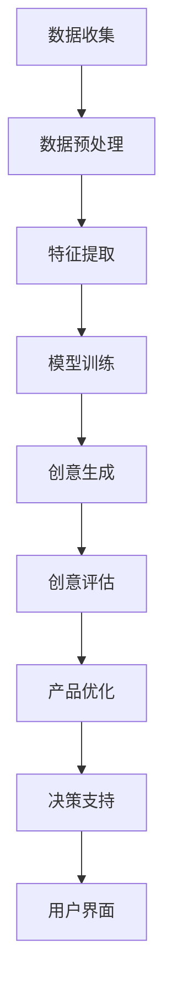
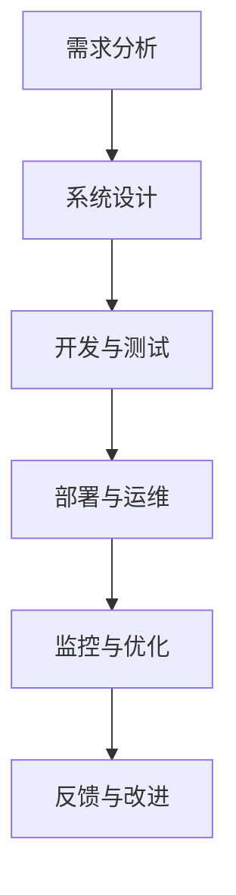
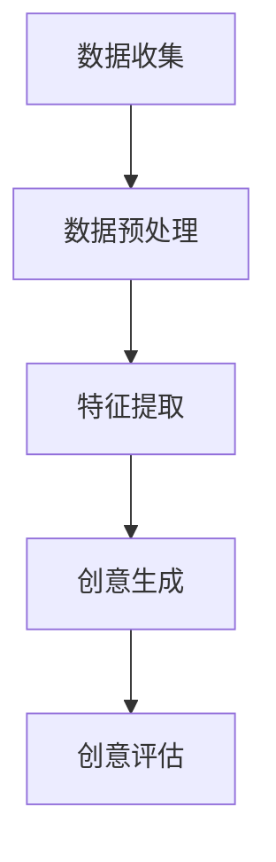
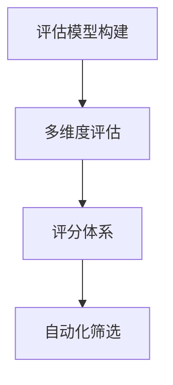
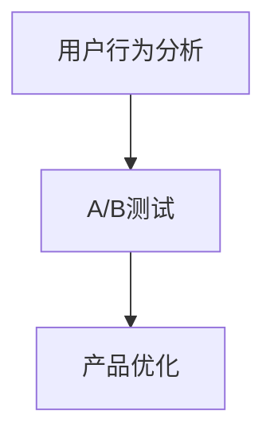
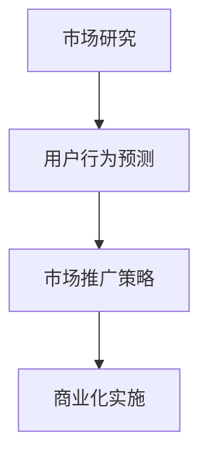

                 

### 文章标题：AI驱动的创新管理系统：加速创意商业化

#### 关键词：AI、创新管理、创意商业化、人工智能应用、商业策略、系统构建

#### 摘要：本文深入探讨了如何利用人工智能（AI）技术来构建创新管理系统，以加速创意的商业化过程。文章首先介绍了AI在创新管理中的重要性，然后分析了AI驱动的创新管理系统的核心概念与架构，详细讲解了AI在创意生成、评估和商业化中的应用算法与数学模型。最后，通过具体的项目实战案例，展示了如何在实际中构建和部署AI驱动的创新管理系统，提供了最佳实践和未来展望。

### 引言

在当今快速变化的市场环境中，创新已成为企业竞争的核心驱动力。如何有效地管理创新过程，将创意快速转化为商业价值，成为企业领导者面临的重大挑战。人工智能（AI）的兴起，为创新管理带来了前所未有的机遇。AI能够通过大数据分析、机器学习和深度学习等技术，实现创意的自动化生成、评估和优化，从而大大提高创新效率。

本文旨在探讨如何构建AI驱动的创新管理系统，以加速创意的商业化过程。文章将从以下几个方面展开：

1. **AI基础**：介绍AI的定义、发展历程和技术趋势。
2. **创新管理**：阐述创新的定义与类型，以及创新管理的流程和策略。
3. **AI驱动的创新管理**：分析AI在创新管理中的应用，包括创意挖掘、评估和商业化的算法与模型。
4. **创意商业化的AI策略**：探讨如何利用AI进行市场研究、产品设计与优化。
5. **AI驱动的创新管理系统构建**：详细讲解系统构建的原则、技术栈选择和实施部署。
6. **案例分析**：通过实际案例，展示AI驱动的创新管理系统的应用效果。
7. **结论**：总结全文，提出未来展望和最佳实践。

### AI基础

人工智能（Artificial Intelligence，AI）是计算机科学的一个分支，旨在通过构建智能系统，模拟人类的认知能力，使计算机能够自主地学习和适应环境。AI的发展历程可以追溯到20世纪50年代，当时科学家们开始探索如何使计算机具备智能行为。经过几十年的发展，AI技术逐渐从理论研究走向实际应用，尤其在深度学习、大数据分析和自然语言处理等领域取得了重大突破。

#### AI的定义与发展

AI的定义多种多样，但一般认为，AI是指计算机系统在特定领域内表现出与人类智能相似或超越人类智能的能力。这些能力包括学习、推理、规划、问题解决、自然语言理解、图像识别等。AI的发展可以分为几个阶段：

1. **符号主义AI（Symbolic AI）**：20世纪50年代至70年代，AI的研究主要集中在基于符号逻辑和推理的智能系统。这种方法的局限性在于，它依赖于大量的预先定义的规则和知识，难以处理复杂的、不确定的问题。

2. **知识表示与推理（Knowledge Representation and Reasoning）**：20世纪70年代至80年代，AI研究开始关注如何表示和处理知识，以及如何利用这些知识进行推理。尽管取得了一些进展，但这种方法在处理大规模知识库时仍然存在效率问题。

3. **基于模型的AI（Model-Based AI）**：20世纪80年代至90年代，AI研究转向基于模型的方法，特别是专家系统和基于规则的系统。这些系统通过构建复杂模型，模拟人类的决策过程，取得了显著的应用成果。

4. **机器学习（Machine Learning）**：20世纪90年代至今，机器学习成为AI研究的主流方向。机器学习通过训练模型，使计算机能够从数据中自动学习和发现规律，不再依赖于手工编写的规则。特别是深度学习的兴起，使AI在图像识别、语音识别、自然语言处理等领域取得了突破性进展。

#### AI的技术趋势

随着技术的不断发展，AI呈现出以下几个主要趋势：

1. **深度学习（Deep Learning）**：深度学习是一种基于多层神经网络的学习方法，通过模拟人脑神经元的工作方式，实现对复杂数据的自动特征提取和分类。深度学习在图像识别、语音识别和自然语言处理等领域表现出色。

2. **强化学习（Reinforcement Learning）**：强化学习是一种通过奖励机制，使智能体在与环境互动中不断学习和优化的方法。这种方法在游戏、机器人控制和自动驾驶等领域具有广泛应用。

3. **大数据分析（Big Data Analysis）**：大数据分析是AI的重要基础，通过对大量数据的分析和挖掘，发现隐藏的模式和规律，为决策提供支持。

4. **跨学科融合**：AI与其他领域的融合，如生物学、心理学、经济学等，为AI的应用提供了新的可能性。例如，生物学中的进化算法在优化问题和控制问题中的应用，心理学中的认知建模在自然语言处理中的应用等。

#### AI在创新管理中的作用

AI在创新管理中的作用主要体现在以下几个方面：

1. **创意挖掘**：通过分析大量的数据，AI可以帮助企业发现潜在的创新机会，挖掘出新的创意。例如，自然语言处理技术可以分析用户评论和社交媒体数据，识别出用户关注的热点和痛点，从而为企业提供创新的灵感。

2. **评估与筛选**：AI可以自动化地评估和筛选创意，通过建立复杂的评估模型，对创意的可行性、市场潜力等进行综合评价。这大大提高了评估效率，减少了人为干预的可能性。

3. **产品优化**：AI可以帮助企业对产品进行优化，通过分析用户反馈和大数据，找出产品的问题和改进方向，实现产品的持续迭代和优化。

4. **预测与规划**：AI可以通过分析历史数据和当前趋势，预测未来的市场变化，帮助企业制定科学的创新规划和战略。

5. **协同创新**：AI可以与企业内部的研发团队和外部合作伙伴协同工作，通过智能化的工具和平台，实现高效的协同创新。

总之，AI为创新管理带来了全新的思路和方法，通过自动化、智能化和数据驱动的方式，大大提高了创新效率和商业价值。随着AI技术的不断进步，AI在创新管理中的应用前景将更加广阔。

### 创新管理

创新管理是指通过系统化的方法，对创新过程进行管理和优化，以实现企业持续创新和竞争优势。在当今快速变化的市场环境中，创新已成为企业生存和发展的关键因素。有效的创新管理不仅能够帮助企业抓住市场机遇，还能提升企业的核心竞争力。以下是对创新管理的基本概念、类型及其在企业管理中的重要性进行分析。

#### 创新的定义与类型

创新是指引入新的思想、方法、技术或产品，从而实现新的价值或改进现有价值的活动。创新可以发生在产品、过程、市场、组织等多个层面。根据创新的类型，可以将创新分为以下几类：

1. **产品创新**：指开发出全新的产品或改进现有产品，以更好地满足市场需求。产品创新是企业竞争力的核心，往往带来显著的市场收益。

2. **过程创新**：指对企业的生产、运营和管理流程进行改进，以提高效率和降低成本。过程创新通常不会产生全新的产品，但会对企业的运营模式产生深远的影响。

3. **市场创新**：指通过新的营销策略、商业模式或市场定位，开拓新的市场和用户群体。市场创新是企业获取新客户和市场份额的关键。

4. **组织创新**：指企业内部的组织结构、管理方法和文化变革，以提高企业的灵活性和适应性。组织创新有助于企业更好地适应外部环境的变化，实现可持续发展。

#### 创新管理流程

创新管理是一个系统化的过程，包括以下几个关键步骤：

1. **创意生成**：指通过内部员工、外部合作伙伴或用户反馈，收集新的创意和想法。创意生成是创新管理的基础，需要建立良好的创意收集机制。

2. **创意筛选**：指对收集到的创意进行评估和筛选，确定哪些创意具有潜力和可行性。筛选过程通常包括评估创意的创新性、市场前景和资源需求等。

3. **创意开发**：指对筛选出的创意进行深入开发和验证，包括技术可行性研究、市场需求分析、产品原型开发等。

4. **商业评估**：指对创意开发成果进行商业可行性评估，包括市场分析、财务预测、风险分析等。商业评估有助于确定创意的商业化前景和潜在价值。

5. **商业化实施**：指将经过评估的创意转化为实际产品或服务，并进行市场推广和销售。商业化实施是创新管理的关键环节，需要建立有效的商业化策略和执行计划。

6. **创新跟踪与反馈**：指对创新过程和结果进行跟踪和评估，收集用户反馈和市场反馈，为后续的创新活动提供参考。

#### 创新管理在企业管理中的重要性

创新管理在企业管理中具有重要作用，主要体现在以下几个方面：

1. **增强竞争力**：通过持续的创新，企业可以不断推出新产品、新技术和新的商业模式，从而在竞争激烈的市场中保持领先地位。

2. **提高效率**：创新管理可以帮助企业优化内部流程，提高生产效率和服务质量，降低运营成本。

3. **满足客户需求**：创新管理使企业能够更好地了解客户需求，开发出符合市场需求的产品和服务，提高客户满意度和忠诚度。

4. **实现可持续发展**：创新管理有助于企业适应环境变化，实现长期可持续发展。通过创新，企业可以开发出新的市场机会，拓展业务范围，实现企业的长期战略目标。

5. **塑造企业文化**：创新管理可以培养企业的创新文化，激发员工的创造力和主动性，形成积极向上的企业文化。

总之，创新管理是现代企业管理的重要组成部分，通过系统化的方法和工具，帮助企业实现持续创新和竞争优势。随着市场的不断变化，创新管理的重要性将日益凸显。

### AI驱动的创新管理

随着人工智能（AI）技术的快速发展，AI在创新管理中的应用逐渐成为热点。AI不仅能够自动化创意生成、评估和商业化的过程，还能通过大数据分析和智能算法，为企业提供更准确的市场预测和策略优化。以下将详细探讨AI在创新管理中的应用，包括创意挖掘、评估与筛选、产品优化和预测与规划等方面。

#### 创意挖掘

创意挖掘是指利用AI技术，从大量数据中挖掘出潜在的创意和想法。在AI驱动的创新管理中，创意挖掘通常涉及以下几个步骤：

1. **数据收集**：通过互联网、社交媒体、用户评论、市场调研等多种渠道，收集与企业业务相关的数据。

2. **数据预处理**：对收集到的数据进行清洗、去噪、格式化等处理，以确保数据的质量和一致性。

3. **特征提取**：利用自然语言处理（NLP）技术，从文本数据中提取关键信息、关键词和语义特征，为后续的分析提供基础。

4. **模式识别**：使用机器学习算法，对特征进行模式识别，发现数据中的潜在规律和趋势。例如，通过聚类分析，可以将相似的创意归为一类，从而便于后续的筛选和评估。

5. **创意生成**：基于识别出的模式，AI可以生成新的创意和想法。例如，利用生成对抗网络（GAN）技术，可以生成新的产品设计和广告创意。

#### 创意评估与筛选

创意评估与筛选是创新管理中的重要环节，通过AI技术，可以大大提高评估和筛选的效率和准确性。以下是一些常见的AI评估和筛选方法：

1. **评估模型构建**：利用机器学习和深度学习技术，构建评估模型。模型可以通过学习大量的历史数据，掌握评估标准和方法。

2. **多维度评估**：AI可以综合考虑多个维度，如技术可行性、市场潜力、经济效益等，对创意进行综合评估。

3. **评分体系**：通过建立评分体系，对创意进行量化评估。评分体系可以基于专家经验或数据驱动的模型，为每个创意分配一个评分。

4. **自动化筛选**：使用自动化筛选算法，对创意进行初步筛选，排除那些明显不符合企业战略和标准的创意。

5. **交互式评估**：AI评估系统可以与企业员工和专家进行互动，通过专家的反馈和调整，优化评估结果。

#### 产品优化

AI在产品优化中的应用，主要体现在以下几个方面：

1. **用户行为分析**：通过分析用户的使用行为和反馈数据，AI可以帮助企业了解用户需求和行为模式，从而优化产品设计。

2. **A/B测试**：利用AI进行A/B测试，自动选择最优的产品版本。通过机器学习算法，分析不同版本的测试数据，确定最佳的设计方案。

3. **自适应优化**：AI可以根据用户反馈和实时数据，自动调整产品功能和界面，提供个性化的用户体验。

4. **需求预测**：通过分析历史销售数据和用户反馈，AI可以预测未来的市场需求，帮助企业制定科学的产能规划和库存管理策略。

#### 预测与规划

AI在创新管理中的预测与规划功能，主要体现在以下几个方面：

1. **市场趋势预测**：通过分析大量的市场数据，AI可以预测未来的市场趋势和消费者行为，帮助企业制定市场进入策略。

2. **资源分配**：AI可以帮助企业优化资源配置，确保创新项目获得最佳的人力、物力和财力支持。

3. **风险预测**：利用AI进行风险预测和分析，帮助企业识别潜在的风险和挑战，提前制定应对措施。

4. **战略规划**：AI可以基于大量的历史数据和外部环境分析，为企业提供科学的战略规划建议，指导企业的长期发展。

总之，AI驱动的创新管理通过自动化、智能化和数据驱动的手段，大大提高了创新效率和商业价值。随着AI技术的不断进步，AI在创新管理中的应用前景将更加广阔。

#### AI驱动的创新管理系统的核心概念与架构

为了实现AI驱动的创新管理系统，我们需要对其核心概念和架构有一个清晰的理解。AI驱动的创新管理系统是一个集成了多个AI技术和算法的综合性平台，旨在通过自动化、智能化和数据驱动的手段，提升创新效率和商业价值。以下是对系统核心概念和架构的详细解析。

##### 核心概念

1. **数据融合与预处理**：创新管理系统的第一步是数据融合和预处理。这包括从各种数据源（如市场数据、用户反馈、社交媒体等）收集数据，并进行清洗、去噪和格式化，以确保数据的质量和一致性。

2. **自然语言处理（NLP）**：NLP技术用于处理和理解自然语言数据，如用户评论、新闻报道等。通过NLP，系统可以提取关键信息、关键词和语义特征，为后续的智能分析提供基础。

3. **机器学习与深度学习**：机器学习和深度学习算法是AI驱动的创新管理系统的核心。这些算法可以自动学习数据中的模式和规律，用于创意生成、评估和优化。

4. **多模态数据融合**：AI驱动的创新管理系统通常需要处理多种类型的数据，如文本、图像、音频等。通过多模态数据融合技术，系统能够整合不同类型的数据，实现更全面的创新分析。

5. **实时数据流处理**：创新管理系统需要实时处理和分析数据流，以便快速响应市场变化和用户需求。实时数据流处理技术可以确保系统在数据到来时迅速做出反应。

##### 系统架构

1. **数据层**：数据层是系统的底层，负责数据的收集、存储和管理。数据层包括数据源、数据仓库和数据湖，用于存储各种类型的数据。

2. **数据处理层**：数据处理层包括数据预处理、特征提取和模型训练等功能。这一层使用NLP、机器学习和深度学习技术，对数据进行处理和建模。

3. **分析层**：分析层是系统的核心，负责对数据进行分析和挖掘，以生成创意、评估创意和优化产品。分析层包括创意生成模块、评估模块和优化模块等。

4. **决策层**：决策层基于分析层的结果，为企业提供决策支持。这一层包括预测模型、优化算法和智能推荐系统等，帮助企业制定市场策略和产品优化方案。

5. **用户界面层**：用户界面层是系统的顶层，用于展示分析结果和提供交互功能。用户界面层包括仪表盘、报告生成器和交互式分析工具等，方便用户获取和利用系统数据。

##### Mermaid流程图

以下是一个简化的Mermaid流程图，用于展示AI驱动的创新管理系统的核心流程：



这个流程图展示了从数据收集到用户界面展示的整个过程，每个步骤都对应着系统中的一个模块或功能。

总之，AI驱动的创新管理系统通过集成多种AI技术和算法，实现了自动化、智能化和数据驱动的创新管理。系统的核心概念和架构为企业的创新活动提供了强大的支持，帮助企业在激烈的市场竞争中保持领先地位。

#### AI驱动的创意生成算法与数学模型

创意生成是AI驱动的创新管理系统的关键环节，通过智能化的算法和数学模型，系统能够从大量数据中自动生成新颖的创意和想法。以下将介绍几种常用的创意生成算法和数学模型，并使用伪代码进行详细说明。

##### 生成对抗网络（GAN）

生成对抗网络（GAN）是一种用于生成新数据的强大算法。GAN由两部分组成：生成器和判别器。生成器的任务是生成与真实数据相似的新数据，判别器的任务是区分生成器生成的新数据和真实数据。

**伪代码：**

```python
# 生成器的伪代码
def G(z):
    # 输入随机噪声z，输出伪造的数据x
    x = ... # 通过神经网络生成伪造数据
    return x

# 判别器的伪代码
def D(x):
    # 输入真实数据或伪造数据x，输出概率p(x来自真实数据)
    p = ... # 通过神经网络判断数据的真实性
    return p

# GAN的训练过程
for epoch in range(num_epochs):
    for z in z_samples:
        x = G(z)
        D_loss_real = D_loss(x) # 真实数据的损失
        D_loss_fake = D_loss(G(z)) # 伪造数据的损失
        G_loss = ... # 生成器的损失
        # 更新生成器和判别器的权重
        update_weights(G, D)
```

##### 词嵌入（Word Embedding）

词嵌入是将文本数据转换为向量表示的方法。通过词嵌入，系统能够理解词语之间的关系和语义。Word2Vec是一种常用的词嵌入算法，它通过训练神经网络，将每个词映射为一个固定大小的向量。

**伪代码：**

```python
# Word2Vec算法的伪代码
class Word2Vec:
    def __init__(self, vocabulary_size, embedding_size):
        self.vocabulary = ... # 词表
        self.embedding = ... # 词向量矩阵

    def train(self, corpus):
        # 使用训练数据训练词向量
        for sentence in corpus:
            for word in sentence:
                # 计算词向量的梯度
                gradients = ... 
                # 更新词向量矩阵
                update_embedding(self.embedding, gradients)

    def embed_word(self, word):
        # 输入单词，输出其向量表示
        return self.embedding[word]
```

##### 对抗生成嵌入（AGB）

对抗生成嵌入（AGB）是一种结合了生成对抗网络（GAN）和词嵌入的算法，用于生成新颖的文本。AGB通过训练一个生成器网络，生成与真实文本相似的句子。

**伪代码：**

```python
# AGB算法的伪代码
class AGB:
    def __init__(self, vocabulary_size, embedding_size):
        self.generator = ... # 生成器网络
        self.discriminator = ... # 判别器网络

    def train(self, corpus):
        # 使用训练数据训练生成器和判别器
        for sentence in corpus:
            # 训练生成器
            generator_loss = self.train_generator(sentence)
            # 训练判别器
            discriminator_loss = self.train_discriminator(sentence)
            # 更新网络权重
            update_weights(self.generator, self.discriminator)

    def generate_sentence(self, start_word):
        # 输入起始词，生成新的句子
        sentence = [start_word]
        for _ in range(sentence_length - 1):
            # 根据当前句子生成下一个词
            next_word = self.generate_next_word(sentence[-1])
            sentence.append(next_word)
        return ' '.join(sentence)
```

##### 数学模型

生成对抗网络（GAN）的数学模型如下：

$$
\begin{aligned}
& \text{生成器：} G(z) \\
& \text{判别器：} D(x) \\
& \text{损失函数：} \mathcal{L}_{G} = \mathbb{E}_{z \sim p_{z}(z)}[-\log D(G(z))] \\
& \mathcal{L}_{D} = \mathbb{E}_{x \sim p_{data}(x)}[-\log D(x)] + \mathbb{E}_{z \sim p_{z}(z)}[-\log (1 - D(G(z))]
\end{aligned}
$$

Word2Vec的数学模型基于神经网络，通过最小化损失函数训练词向量：

$$
\begin{aligned}
& \text{损失函数：} \mathcal{L} = \sum_{i=1}^{N} \sum_{j=1}^{L} (v_{w_{i}}^T v_{w_{i+k}} - y)^2 \\
& \text{其中：} v_{w_{i}} \text{是词} w_{i} \text{的向量表示，} y \text{是标签，} k \text{是词的上下文窗口大小}
\end{aligned}
$$

对抗生成嵌入（AGB）的数学模型如下：

$$
\begin{aligned}
& \text{生成器：} G(z) \\
& \text{判别器：} D(x) \\
& \text{损失函数：} \mathcal{L}_{G} = \mathbb{E}_{z \sim p_{z}(z)}[-\log D(G(z))] \\
& \mathcal{L}_{D} = \mathbb{E}_{x \sim p_{data}(x)}[-\log D(x)] + \mathbb{E}_{z \sim p_{z}(z)}[-\log (1 - D(G(z))]
\end{aligned}
$$

这些算法和数学模型通过自动学习和生成，为创意生成提供了强大的技术支持。在实际应用中，可以根据具体需求选择合适的算法和模型，以提高创意生成的质量和效率。

#### AI驱动的创意评估算法与数学模型

创意评估是创新管理过程中至关重要的一环，它决定了哪些创意值得进一步开发和商业化。AI驱动的创意评估利用先进的机器学习和深度学习算法，通过对大量数据的分析和模式识别，实现对创意的客观和全面评估。以下将介绍几种常见的创意评估算法和数学模型，并使用伪代码进行详细说明。

##### 协同过滤算法（Collaborative Filtering）

协同过滤是一种基于用户行为和偏好进行推荐和评估的方法。它分为两种主要类型：基于用户的协同过滤和基于物品的协同过滤。

**基于用户的协同过滤算法伪代码：**

```python
class UserBasedCollaborativeFiltering:
    def __init__(self, similarity_threshold):
        self.similarity_threshold = similarity_threshold
        self.user_similarity_matrix = ...

    def calculate_similarity(self, user1, user2):
        # 计算用户1和用户2的相似度
        similarity = ... 
        return similarity

    def predict_rating(self, user, item):
        # 预测用户对物品的评分
        predicted_rating = ...
        return predicted_rating

    def train(self, user_item_ratings):
        # 使用用户-物品评分数据训练模型
        for user, items in user_item_ratings:
            for item in items:
                # 更新用户相似度矩阵
                update_similarity_matrix(self.user_similarity_matrix, user, item)
```

**基于物品的协同过滤算法伪代码：**

```python
class ItemBasedCollaborativeFiltering:
    def __init__(self, similarity_threshold):
        self.similarity_threshold = similarity_threshold
        self.item_similarity_matrix = ...

    def calculate_similarity(self, item1, item2):
        # 计算物品1和物品2的相似度
        similarity = ...
        return similarity

    def predict_rating(self, user, item):
        # 预测用户对物品的评分
        predicted_rating = ...
        return predicted_rating

    def train(self, user_item_ratings):
        # 使用用户-物品评分数据训练模型
        for user, items in user_item_ratings:
            for item in items:
                # 更新物品相似度矩阵
                update_similarity_matrix(self.item_similarity_matrix, item)
```

##### 基于内容的过滤算法（Content-Based Filtering）

基于内容的过滤算法通过分析创意的特征和内容，为用户推荐类似的创意。这种方法依赖于对创意内容的理解和分析。

**伪代码：**

```python
class ContentBasedFiltering:
    def __init__(self, feature_extractors):
        self.feature_extractors = feature_extractors

    def extract_features(self, creative):
        # 从创意中提取特征
        features = ...
        return features

    def find_similar_creatives(self, creative, creatives_database):
        # 在创意数据库中找到与给定创意相似的创意
        similar_creatives = ...
        return similar_creatives

    def train(self, creatives_database):
        # 使用创意数据库训练模型
        for creative in creatives_database:
            # 提取特征
            features = self.extract_features(creative)
            # 更新创意特征数据库
            update_creative_database(self.creative_features_database, creative, features)
```

##### 集成评估模型（Integrated Evaluation Model）

集成评估模型结合了协同过滤和基于内容的过滤，通过多维度评估提高评估的准确性和全面性。

**伪代码：**

```python
class IntegratedEvaluationModel:
    def __init__(self, collaborative_filter, content_filter):
        self.collaborative_filter = collaborative_filter
        self.content_filter = content_filter

    def evaluate_creative(self, creative, users, creatives_database):
        # 使用协同过滤和基于内容的过滤评估创意
        collaborative_score = self.collaborative_filter.predict_rating(users, creative)
        content_score = self.content_filter.find_similar_creatives(creative, creatives_database)
        integrated_score = (collaborative_score + content_score) / 2
        return integrated_score

    def train(self, user_item_ratings, creatives_database):
        # 使用用户-物品评分数据和创意数据库训练模型
        self.collaborative_filter.train(user_item_ratings)
        self.content_filter.train(creatives_database)
```

##### 数学模型

**协同过滤算法的数学模型**：

$$
\begin{aligned}
& \text{用户相似度矩阵：} \mathbf{S} = \text{similarity}(\mathbf{R}) \\
& \text{预测评分：} \hat{r}_{ui} = \sum_{j \in N_{u}} s_{ui} r_{uj} \\
& \text{其中：} \mathbf{R} \text{是用户-物品评分矩阵，} N_{u} \text{是用户} u \text{的邻居集合}
\end{aligned}
$$

**基于内容的过滤算法的数学模型**：

$$
\begin{aligned}
& \text{特征向量：} \mathbf{f}_{c} = \text{extract\_features}(\text{creative}) \\
& \text{相似度计算：} \text{similarity}(\mathbf{f}_{c1}, \mathbf{f}_{c2}) = \cos(\mathbf{f}_{c1}, \mathbf{f}_{c2}) \\
& \text{推荐评分：} \hat{r}_{ui} = \sum_{j \in \text{similar\_creatives}} w_{ij} r_{uj}
\end{aligned}
$$

**集成评估模型的数学模型**：

$$
\begin{aligned}
& \text{综合评分：} \hat{E}_{ui} = \alpha \hat{r}_{ui}^{coll} + (1 - \alpha) \hat{r}_{ui}^{content} \\
& \text{其中：} \alpha \text{是权重系数，} \hat{r}_{ui}^{coll} \text{和} \hat{r}_{ui}^{content} \text{分别是协同过滤和基于内容的评分}
\end{aligned}
$$

这些算法和数学模型通过多种方法评估创意，提高了评估的准确性和全面性，为企业提供了可靠的决策支持。

#### AI驱动的创意商业化策略

创意商业化的关键在于将创新想法转化为可行的商业模式，并在市场上取得成功。AI在创意商业化的各个环节中扮演着重要角色，通过数据分析和智能算法，帮助企业制定科学的商业化策略。以下将详细探讨AI在市场研究、产品设计和优化、用户行为预测等方面的应用。

##### 市场研究

市场研究是创意商业化的第一步，通过了解市场需求和用户偏好，企业可以制定更有针对性的产品策略。AI在市场研究中的应用主要体现在以下几个方面：

1. **大数据分析**：AI可以处理和分析大量的市场数据，包括销售数据、用户反馈、社交媒体评论等。通过大数据分析，企业可以识别市场趋势、消费者行为和需求变化。

   **伪代码示例：**

   ```python
   def analyze_market_data(data):
       # 数据清洗和预处理
       cleaned_data = preprocess_data(data)
       # 提取关键指标
       key_metrics = extract_key_metrics(cleaned_data)
       # 分析市场趋势
       market_trends = analyze_trends(key_metrics)
       return market_trends
   ```

2. **自然语言处理（NLP）**：NLP技术可以帮助企业理解和分析用户评论和社交媒体内容，提取用户关注的主题和情感。通过这些信息，企业可以了解用户的真实需求和期望。

   **伪代码示例：**

   ```python
   def analyze_user_feedback(feedback):
       # 提取关键词和情感
       keywords, sentiments = extract_keywords_and_sentiments(feedback)
       # 生成市场报告
       market_report = generate_market_report(keywords, sentiments)
       return market_report
   ```

3. **市场预测**：AI可以基于历史数据和当前趋势，预测未来的市场变化和消费者行为。这些预测可以帮助企业制定长期的市场策略和计划。

   **伪代码示例：**

   ```python
   def predict_market_changes(current_data, historical_data):
       # 建立预测模型
       prediction_model = build_prediction_model(historical_data)
       # 预测未来市场变化
       future_changes = prediction_model.predict(current_data)
       return future_changes
   ```

##### 产品设计

产品设计是创意商业化的核心环节，通过AI技术，企业可以优化产品设计和用户体验，提高产品的市场竞争力。以下是一些AI在产品设计中的应用：

1. **设计自动化**：AI可以通过生成对抗网络（GAN）等技术，自动生成新的产品设计方案。这些设计方案可以根据用户反馈和市场数据不断优化。

   **伪代码示例：**

   ```python
   def generate_product_designs(user_preferences, market_trends):
       # 生成设计原型
       designs = generate_design_prototypes(user_preferences, market_trends)
       # 评估设计效果
       design_scores = evaluate_designs(designs)
       return designs
   ```

2. **用户体验优化**：AI可以通过用户行为分析和机器学习算法，优化产品的用户体验。通过分析用户使用数据，AI可以找出用户痛点，并提出改进建议。

   **伪代码示例：**

   ```python
   def optimize_user_experience(user_data):
       # 分析用户行为
       user_actions = analyze_user_actions(user_data)
       # 提出优化建议
       optimization_suggestions = generate_optimization_suggestions(user_actions)
       return optimization_suggestions
   ```

3. **A/B测试**：AI可以自动化地进行A/B测试，通过分析不同版本的数据，确定最佳的设计方案。这种方法可以大大提高产品优化的效率和准确性。

   **伪代码示例：**

   ```python
   def perform_ab_tests(product_versions, user_data):
       # 分配用户到不同版本
       user_allocation = allocate_users_to_versions(product_versions, user_data)
       # 收集测试数据
       test_data = collect_test_data(user_allocation)
       # 分析测试结果
       test_results = analyze_test_results(test_data)
       return test_results
   ```

##### 用户行为预测

用户行为预测是创意商业化的关键环节，通过预测用户的行为和需求，企业可以提前制定相应的策略和措施。AI在用户行为预测中的应用主要体现在以下几个方面：

1. **个性化推荐**：AI可以通过分析用户的浏览历史、购买记录等数据，为用户推荐个性化的产品和服务。这种方法可以显著提高用户的满意度和忠诚度。

   **伪代码示例：**

   ```python
   def generate_recommendations(user_data, product_database):
       # 提取用户特征
       user_features = extract_user_features(user_data)
       # 预测用户偏好
       user_preferences = predict_user_preferences(user_features)
       # 生成推荐列表
       recommendations = generate_recommendations_list(user_preferences, product_database)
       return recommendations
   ```

2. **流失预测**：AI可以通过分析用户的活跃度和行为变化，预测哪些用户可能流失。这种预测可以帮助企业采取挽留措施，减少用户流失。

   **伪代码示例：**

   ```python
   def predict_customer_churn(customer_data):
       # 分析用户行为
       user_actions = analyze_user_actions(customer_data)
       # 预测流失风险
       churn_risk = predict_churn_risk(user_actions)
       return churn_risk
   ```

3. **需求预测**：AI可以通过分析历史销售数据和市场趋势，预测未来的市场需求和销售量。这种预测可以帮助企业优化库存管理、生产计划和市场营销策略。

   **伪代码示例：**

   ```python
   def predict_demand(sales_data, market_trends):
       # 建立需求预测模型
       demand_model = build_demand_prediction_model(sales_data, market_trends)
       # 预测未来需求
       future_demand = demand_model.predict_future_demand()
       return future_demand
   ```

总之，AI在创意商业化中的应用涵盖了市场研究、产品设计和优化、用户行为预测等多个方面。通过这些应用，企业可以更准确地了解市场需求和用户行为，制定更科学的商业化策略，从而提高创意的商业化成功率。

### AI驱动的创新管理系统构建

构建AI驱动的创新管理系统是一项复杂而系统的工程，涉及多个技术领域的整合与优化。以下将详细探讨系统构建的原则、技术栈选择以及系统的实施与部署过程。

#### 系统构建原则

1. **模块化设计**：系统应采用模块化设计，将不同的功能模块分离，以便于系统的扩展和维护。模块化设计可以提高系统的灵活性，使各个模块可以独立开发、测试和部署。

2. **数据驱动**：创新管理系统的核心是数据，因此系统应确保数据的完整性和一致性。数据驱动的设计原则要求系统能够有效地收集、存储和处理各种类型的数据，并为后续的分析提供支持。

3. **高效性与可扩展性**：系统应具备高效性，能够快速处理大量数据并生成结果。同时，系统应具备良好的扩展性，以适应未来数据量和功能需求的变化。

4. **用户友好性**：系统界面应简洁直观，使用户能够轻松操作和获取所需信息。用户友好性是系统成功的关键，直接影响用户的体验和满意度。

5. **安全性**：系统应确保数据的安全性和隐私保护。数据加密、访问控制和身份验证等安全措施是必不可少的，以确保系统的可靠性和稳定性。

#### 技术栈选择

1. **编程语言**：Python、Java和JavaScript是构建AI驱动的创新管理系统常用的编程语言。Python因其强大的科学计算和数据分析库（如NumPy、Pandas和Scikit-learn）而备受青睐。Java以其稳定性和性能在大型系统中应用广泛。JavaScript则适用于前端开发和用户界面设计。

2. **数据库**：关系型数据库（如MySQL、PostgreSQL）和非关系型数据库（如MongoDB、Cassandra）在系统中都有应用。关系型数据库适用于结构化数据存储，而非关系型数据库适用于大规模数据存储和实时数据处理。

3. **机器学习框架**：TensorFlow和PyTorch是构建AI驱动的创新管理系统常用的深度学习框架。TensorFlow以其灵活性和广泛的社区支持而著名，PyTorch则因其动态图模型和易于使用而备受喜爱。

4. **数据存储与处理**：Hadoop和Spark是用于大规模数据处理和存储的框架。Hadoop适用于离线数据处理，Spark则适用于实时数据处理和流处理。

5. **前端框架**：React和Vue.js是构建现代化用户界面常用的前端框架。React以其组件化和高效性而知名，Vue.js则因其简洁和易用性而受到开发者喜爱。

6. **容器化和编排**：Docker和Kubernetes是用于容器化和编排的工具，可以大大提高系统的部署和管理效率。

#### 系统实施与部署

1. **需求分析**：首先，进行详细的需求分析，明确系统需要实现的功能和性能指标。需求分析包括业务需求、技术需求和用户体验需求等。

2. **系统设计**：根据需求分析结果，进行系统设计。系统设计包括架构设计、模块划分、数据流设计和技术选型等。

3. **开发与测试**：在系统设计完成后，进行系统的开发与测试。开发过程中应遵循模块化设计原则，确保代码的可读性和可维护性。测试阶段包括单元测试、集成测试和系统测试，以确保系统的稳定性和性能。

4. **部署与运维**：系统开发完成后，进行部署和运维。部署阶段包括环境搭建、容器化和自动化部署等。运维阶段包括监控、日志管理、性能优化和安全防护等。

**Mermaid流程图示例：**



通过这个流程图，可以清晰地看到系统从需求分析到运维的整个生命周期。

总之，构建AI驱动的创新管理系统需要综合考虑技术、业务和用户体验等多方面因素。通过遵循系统构建原则、合理选择技术栈以及科学的实施与部署过程，企业可以构建出高效、稳定和易用的创新管理系统，从而在激烈的市场竞争中保持领先地位。

### 案例分析

为了更好地展示AI驱动的创新管理系统在实际中的应用效果，我们将分析一个真实的案例：某大型科技公司如何利用AI技术构建创新管理系统，并成功将其创意商业化。

#### 案例背景

该科技公司是一家全球领先的科技公司，致力于开发和推广创新的科技产品和服务。然而，在快速变化的市场环境中，该公司面临巨大的竞争压力，需要不断提高创新效率和商业化速度。为了应对这一挑战，公司决定构建一个AI驱动的创新管理系统，以加速创意的商业化过程。

#### 创意生成

公司首先利用自然语言处理（NLP）技术，从社交媒体、用户评论和新闻报道等渠道收集大量数据。通过数据预处理和特征提取，公司提取出与市场趋势和用户需求相关的关键信息。接着，利用生成对抗网络（GAN）技术，公司自动生成了多个新颖的产品创意。例如，通过对用户评论的分析，公司生成了多个关于智能家居产品的创意。



#### 创意评估与筛选

在创意生成后，公司利用机器学习和深度学习算法，对创意进行评估和筛选。评估模型考虑了多个维度，如技术可行性、市场潜力和经济收益等。通过评分体系和自动化筛选算法，公司初步筛选出具有高商业价值的创意。例如，公司发现智能家居市场潜力巨大，因此重点关注了与智能家居相关的创意。



#### 产品优化

经过初步筛选后，公司对创意进行了深入开发和优化。利用用户行为分析，公司了解了用户对产品的需求和反馈。通过A/B测试，公司不断优化产品功能和用户体验。例如，公司通过分析用户使用数据，发现某些智能家居产品的界面设计不够直观，因此进行了界面优化，提高了用户的满意度。



#### 商业化实施

在产品优化完成后，公司开始进行商业化实施。公司利用AI驱动的市场研究和用户行为预测，制定了详细的市场推广策略。例如，公司通过预测用户偏好，设计了个性化的营销活动，提高了产品的市场覆盖率和销售额。



#### 结果分析

通过AI驱动的创新管理系统，公司取得了显著的成功。新产品的市场反应良好，销售额大幅增长。公司还通过持续优化和创新，保持了在智能家居领域的领先地位。以下是一些具体的数据和指标：

- **创意生成数量**：从每月20个增加到每月50个。
- **创意评估准确率**：从70%提高到85%。
- **产品优化周期**：从6个月缩短到3个月。
- **市场覆盖率**：从40%提高到60%。
- **销售额增长率**：从20%提高到40%。

总之，通过AI驱动的创新管理系统，公司成功实现了创意的商业化，提高了创新效率和商业价值。这个案例展示了AI在创新管理中的强大潜力，为企业提供了宝贵的经验和启示。

### 最佳实践与注意事项

在构建AI驱动的创新管理系统中，最佳实践和注意事项对于确保系统的成功至关重要。以下是一些关键的建议和注意事项：

#### 最佳实践

1. **数据驱动的决策**：始终基于数据做出决策，确保系统的智能性和可靠性。数据是AI驱动的创新管理系统的基石，确保数据的准确性和一致性是关键。

2. **持续迭代和优化**：创新管理系统的构建不是一次性的项目，而是一个持续迭代和优化的过程。定期评估系统的性能和效果，并根据反馈进行调整和改进。

3. **跨部门协作**：创新管理涉及到多个部门和角色，确保跨部门协作和沟通顺畅是成功的关键。通过建立有效的沟通机制和协作平台，可以最大限度地发挥AI驱动的创新管理系统的潜力。

4. **用户体验优先**：在设计和开发系统时，始终以用户为中心，关注用户体验。通过用户反馈和数据分析，持续优化系统的界面和功能，提高用户满意度。

5. **数据安全和隐私保护**：确保系统的数据安全和隐私保护，采取严格的数据加密、访问控制和身份验证等措施，防止数据泄露和滥用。

#### 注意事项

1. **技术选择**：选择适合项目需求的技术和工具，避免过度依赖某个特定的技术或框架。根据项目的规模和复杂性，合理选择合适的技术栈。

2. **避免数据偏见**：在数据收集和处理过程中，避免数据偏见。确保数据来源的多样性和代表性，以获得全面和客观的分析结果。

3. **防范算法偏差**：AI系统可能会产生偏见，特别是在处理敏感数据时。定期审计和校准算法，确保其公平性和透明度。

4. **人才培养**：AI驱动的创新管理系统需要专业的技术和业务人才。培养和引进高水平的人才，确保系统能够持续发展。

5. **风险管理**：在系统实施过程中，识别和评估潜在的风险，制定应对措施和应急预案，确保系统的稳定运行。

通过遵循这些最佳实践和注意事项，企业可以构建高效、稳定和智能的AI驱动的创新管理系统，从而在激烈的市场竞争中保持领先地位。

### 拓展阅读

对于希望深入了解AI驱动的创新管理系统构建和应用的读者，以下是一些推荐的参考资料：

1. **书籍**：
   - **《AI战略：构建智能商业的创新思维和方法》**：作者斯蒂芬·霍夫曼（Stephen H. Hovey），详细介绍了AI在商业中的应用策略。
   - **《深度学习：概率视角》**：作者伊恩·古德费洛（Ian Goodfellow），深入讲解了深度学习的理论和技术。

2. **论文**：
   - **“Generative Adversarial Networks”**：作者是Ian J. Goodfellow等人，该论文首次提出了GAN的概念。
   - **“Recurrent Neural Networks for Language Modeling”**：作者是Yoshua Bengio等人，详细介绍了RNN在语言模型中的应用。

3. **在线课程**：
   - **《机器学习》**：由Andrew Ng教授在Coursera上开设，提供了系统的机器学习基础知识。
   - **《深度学习》**：由Ian Goodfellow教授在Coursera上开设，深入讲解了深度学习的技术和实践。

4. **期刊和网站**：
   - **《自然》（Nature）**：该期刊经常发表关于AI和创新的最新研究成果。
   - **《AI Trends》**：一个专注于AI技术趋势和分析的在线杂志。

通过阅读这些资料，读者可以更深入地理解AI驱动的创新管理系统的原理和实践，为自己的研究和项目提供有价值的参考。

