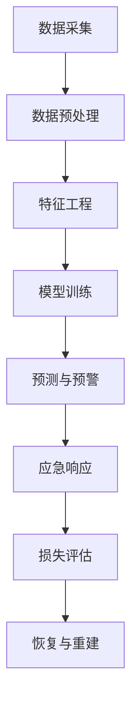
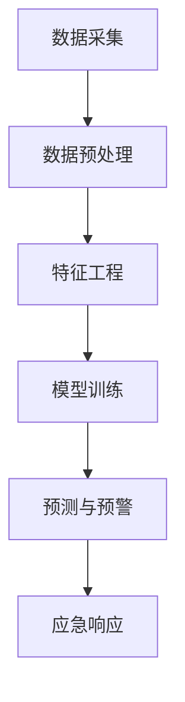
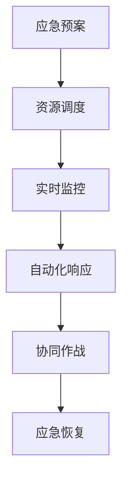
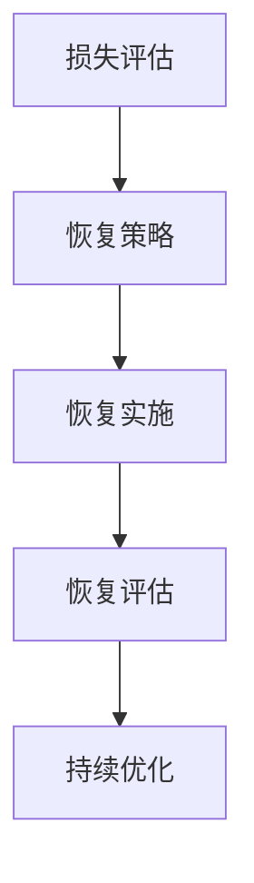
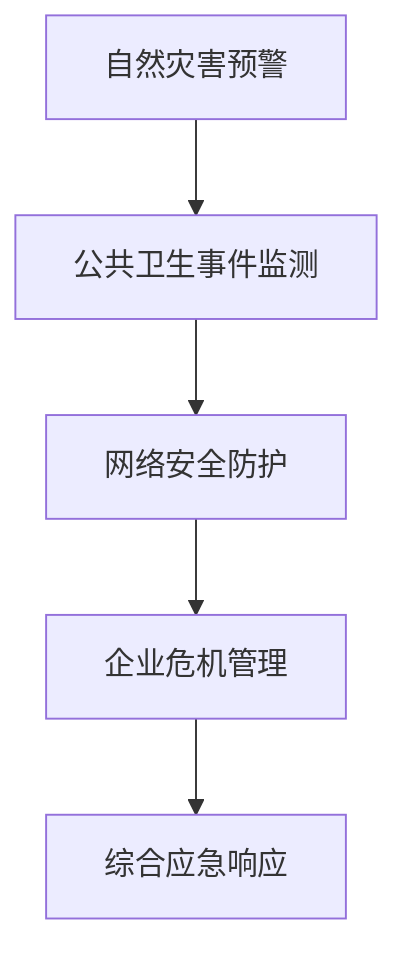
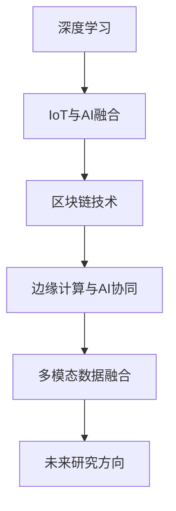

                 

## 文章标题：AI驱动的危机管理系统：快速应对突发事件

在当今复杂多变的全球环境中，危机管理已成为各个领域、企业和政府机构关注的焦点。传统的危机管理方法往往依赖于人为的经验和响应机制，这在面对突发性、复杂性和高频率的危机事件时显得力不从心。随着人工智能（AI）技术的迅猛发展，AI驱动的危机管理系统应运而生，为快速应对突发事件提供了强有力的技术支持。本文旨在探讨AI驱动的危机管理系统，通过逻辑清晰、结构紧凑、简单易懂的专业技术语言，分步骤解析该系统的原理、应用及未来发展趋势。

## 文章关键词

- 人工智能
- 危机管理
- AI驱动的预警系统
- 应急响应
- 损失评估
- 恢复策略

## 文章摘要

本文从背景介绍入手，详细阐述了AI驱动的危机管理系统的核心概念与联系，包括其基本原理、架构设计、关键算法和数学模型。接着，文章深入分析了AI在危机预警、应急响应、损失评估与恢复等方面的应用，并通过具体案例进行了剖析。最后，文章展望了AI驱动的危机管理技术的发展趋势，提出了未来研究和应用的方向。本文旨在为读者提供一份全面、深入的AI驱动危机管理系统的指南。

## 第一部分：AI驱动的危机管理基础

### 第1章 AI在危机管理中的作用

#### 背景介绍

随着全球化进程的加速，各类危机事件（如自然灾害、公共卫生事件、网络安全威胁等）对人类社会的影响日益加剧。传统的危机管理方法往往依赖于人力和资源的调度，这在应对突发事件时显得缓慢且效率低下。人工智能技术的发展为危机管理提供了新的思路和方法。

#### 核心概念与联系

人工智能（AI）是指计算机系统模拟人类智能行为的技术，包括机器学习、深度学习、自然语言处理等。AI驱动的危机管理系统利用这些技术，通过数据采集、分析、预测和决策，实现对危机事件的快速响应和有效管理。

#### Mermaid流程图

以下是一个简化的AI驱动的危机管理系统架构Mermaid流程图：



#### 核心算法原理讲解

AI驱动的危机管理系统核心算法通常包括以下几个步骤：

1. **数据采集与预处理**：从各种数据源（如传感器、社交媒体、新闻报道等）收集数据，并进行清洗、去噪和归一化处理。
2. **特征工程**：提取关键特征，如时间序列特征、空间特征、语义特征等，用于构建模型。
3. **模型训练**：使用机器学习算法（如决策树、支持向量机、神经网络等）训练预测模型。
4. **预测与预警**：根据训练好的模型，对潜在的危机事件进行预测和预警。
5. **应急响应**：在危机事件发生时，根据预测结果和应急预案，快速采取行动。
6. **损失评估与恢复**：对危机事件造成的损失进行评估，并制定恢复策略。

以下是AI驱动的危机管理系统核心算法的伪代码：

```python
# 数据采集与预处理
data = collect_data(source)
cleaned_data = preprocess_data(data)

# 特征工程
features = feature_engineering(cleaned_data)

# 模型训练
model = train_model(features)

# 预测与预警
predictions = model.predict(new_data)
if predictions["risk_level"] > threshold:
    warn_of_crisis(predictions)

# 应急响应
response_plan = emergency_response(predictions)
execute_response_plan(response_plan)

# 损失评估与恢复
loss = assess_loss(crisis)
recovery_plan = recovery_plan(loss)
execute_recovery_plan(recovery_plan)
```

#### 数学模型与公式

AI驱动的危机管理系统中，常用的数学模型包括时间序列分析、回归分析、聚类分析和神经网络等。以下是一个简化的时间序列分析模型：

$$
y_t = \beta_0 + \beta_1 x_t + \epsilon_t
$$

其中，$y_t$是目标变量，$x_t$是解释变量，$\beta_0$和$\beta_1$是模型参数，$\epsilon_t$是随机误差。

#### 举例说明

假设我们使用时间序列分析模型预测某地区未来一周的降雨量。通过收集历史降雨数据，我们可以训练一个回归模型，然后使用该模型预测未来一周的降雨量。以下是具体步骤：

1. **数据收集**：收集过去一年的降雨量数据。
2. **数据预处理**：对数据进行清洗和归一化处理。
3. **特征工程**：提取时间序列特征，如月份、季节、历史降雨量等。
4. **模型训练**：使用回归算法训练模型。
5. **预测**：使用训练好的模型预测未来一周的降雨量。
6. **结果分析**：对预测结果进行分析和验证。

#### 项目实战

在本节中，我们将介绍一个简单的AI驱动的危机预警系统，以火灾预警为例。以下是一个简化的项目实现：

1. **开发环境搭建**：使用Python编程语言和相关的AI库（如scikit-learn、TensorFlow等）。
2. **数据收集**：收集火灾相关数据，如火情数据、温度数据、烟雾浓度数据等。
3. **数据预处理**：对数据进行清洗和归一化处理。
4. **特征工程**：提取关键特征，如温度变化率、烟雾浓度变化率等。
5. **模型训练**：使用机器学习算法（如决策树、随机森林等）训练模型。
6. **预测与预警**：根据训练好的模型，对新的数据进行分析和预警。
7. **代码实现**：

```python
import pandas as pd
from sklearn.model_selection import train_test_split
from sklearn.ensemble import RandomForestClassifier
from sklearn.metrics import accuracy_score

# 数据收集
data = pd.read_csv('fire_data.csv')

# 数据预处理
data = preprocess_data(data)

# 特征工程
features = feature_engineering(data)

# 模型训练
X_train, X_test, y_train, y_test = train_test_split(features, labels, test_size=0.2)
model = RandomForestClassifier()
model.fit(X_train, y_train)

# 预测与预警
predictions = model.predict(X_test)
accuracy = accuracy_score(y_test, predictions)
print(f"Accuracy: {accuracy}")

# 预警
if predictions[0] == 1:
    print("Fire warning: Potential fire detected!")
```

8. **项目小结**：通过本节项目实战，我们了解了如何使用AI技术进行火灾预警，为实际应用提供了参考。

### 第2章 AI驱动的危机预警系统

#### 背景介绍

危机预警系统是AI驱动的危机管理系统的关键组成部分，旨在通过实时监测和预测，及时发现潜在的危机事件，为决策者提供预警信息，从而减少危机事件的发生或降低其影响。

#### 核心概念与联系

AI驱动的危机预警系统包括以下几个核心概念：

1. **数据采集**：收集各种数据源的信息，如传感器数据、社交媒体数据、新闻报道等。
2. **数据预处理**：对采集到的数据进行清洗、去噪和归一化处理。
3. **特征工程**：提取关键特征，如时间序列特征、空间特征、语义特征等。
4. **模型训练**：使用机器学习算法训练预测模型。
5. **预测与预警**：根据训练好的模型，对潜在的危机事件进行预测和预警。

#### Mermaid流程图

以下是一个简化的AI驱动的危机预警系统流程图：



#### 核心算法原理讲解

AI驱动的危机预警系统核心算法通常包括以下几个步骤：

1. **数据采集与预处理**：从各种数据源（如传感器、社交媒体、新闻报道等）收集数据，并进行清洗、去噪和归一化处理。
2. **特征工程**：提取关键特征，如时间序列特征、空间特征、语义特征等，用于构建模型。
3. **模型训练**：使用机器学习算法（如决策树、支持向量机、神经网络等）训练预测模型。
4. **预测与预警**：根据训练好的模型，对潜在的危机事件进行预测和预警。

以下是AI驱动的危机预警系统核心算法的伪代码：

```python
# 数据采集与预处理
data = collect_data(source)
cleaned_data = preprocess_data(data)

# 特征工程
features = feature_engineering(cleaned_data)

# 模型训练
model = train_model(features)

# 预测与预警
predictions = model.predict(new_data)
if predictions["risk_level"] > threshold:
    warn_of_crisis(predictions)
```

#### 数学模型与公式

AI驱动的危机预警系统中，常用的数学模型包括时间序列分析、回归分析、聚类分析和神经网络等。以下是一个简化的时间序列分析模型：

$$
y_t = \beta_0 + \beta_1 x_t + \epsilon_t
$$

其中，$y_t$是目标变量，$x_t$是解释变量，$\beta_0$和$\beta_1$是模型参数，$\epsilon_t$是随机误差。

#### 举例说明

假设我们使用时间序列分析模型预测某地区未来一周的地震活动。通过收集历史地震数据，我们可以训练一个回归模型，然后使用该模型预测未来一周的地震活动。以下是具体步骤：

1. **数据收集**：收集过去一年的地震数据。
2. **数据预处理**：对数据进行清洗和归一化处理。
3. **特征工程**：提取时间序列特征，如震级、震中位置等。
4. **模型训练**：使用回归算法训练模型。
5. **预测**：使用训练好的模型预测未来一周的地震活动。
6. **结果分析**：对预测结果进行分析和验证。

#### 项目实战

在本节中，我们将介绍一个简单的AI驱动的地震预警系统，以某地区地震预警为例。以下是一个简化的项目实现：

1. **开发环境搭建**：使用Python编程语言和相关的AI库（如scikit-learn、TensorFlow等）。
2. **数据收集**：收集地震相关数据，如震级、震中位置、震源深度等。
3. **数据预处理**：对数据进行清洗和归一化处理。
4. **特征工程**：提取关键特征，如震级、震中距离等。
5. **模型训练**：使用机器学习算法（如决策树、随机森林等）训练模型。
6. **预测与预警**：根据训练好的模型，对新的数据进行分析和预警。
7. **代码实现**：

```python
import pandas as pd
from sklearn.model_selection import train_test_split
from sklearn.ensemble import RandomForestClassifier
from sklearn.metrics import accuracy_score

# 数据收集
data = pd.read_csv('earthquake_data.csv')

# 数据预处理
data = preprocess_data(data)

# 特征工程
features = feature_engineering(data)

# 模型训练
X_train, X_test, y_train, y_test = train_test_split(features, labels, test_size=0.2)
model = RandomForestClassifier()
model.fit(X_train, y_train)

# 预测与预警
predictions = model.predict(X_test)
accuracy = accuracy_score(y_test, predictions)
print(f"Accuracy: {accuracy}")

# 预警
if predictions[0] == 1:
    print("Earthquake warning: Potential earthquake detected!")
```

8. **项目小结**：通过本节项目实战，我们了解了如何使用AI技术进行地震预警，为实际应用提供了参考。

### 第3章 AI驱动的应急响应系统

#### 背景介绍

应急响应系统是AI驱动的危机管理系统中至关重要的一环，旨在危机事件发生时，能够迅速采取行动，降低危机事件的影响，保护人民的生命财产安全。传统的应急响应系统往往依赖于人力和资源的调度，这在应对突发事件时显得缓慢且效率低下。AI技术的引入，使得应急响应系统能够更加智能和高效。

#### 核心概念与联系

AI驱动的应急响应系统包括以下几个核心概念：

1. **应急预案**：在危机事件发生前，制定一系列的应对措施和流程。
2. **资源调度**：根据危机事件的性质和规模，合理分配和调度资源。
3. **实时监控**：通过传感器和数据采集设备，实时监控危机事件的进展。
4. **自动化响应**：根据应急预案和实时监控数据，自动执行相应的响应措施。
5. **协同作战**：在应急响应过程中，实现各部门和人员的协同作战，提高响应效率。

#### Mermaid流程图

以下是一个简化的AI驱动的应急响应系统流程图：



#### 核心算法原理讲解

AI驱动的应急响应系统核心算法通常包括以下几个步骤：

1. **应急预案制定**：根据危机事件的类型和规模，制定一系列的应对措施和流程。
2. **资源调度**：使用优化算法（如遗传算法、粒子群算法等）进行资源调度，确保资源的最优配置。
3. **实时监控**：通过传感器和数据采集设备，实时获取危机事件的进展数据。
4. **自动化响应**：根据应急预案和实时监控数据，自动执行相应的响应措施。
5. **协同作战**：通过通信系统和数据分析平台，实现各部门和人员的协同作战。

以下是AI驱动的应急响应系统核心算法的伪代码：

```python
# 应急预案制定
response_plan = create_response_plan(event_type)

# 资源调度
resources = schedule_resources(response_plan)

# 实时监控
monitoring_data = real_time_monitoring()

# 自动化响应
execute_response_plan(response_plan, monitoring_data)

# 协同作战
collaborate_with_teams(response_plan, monitoring_data)
```

#### 数学模型与公式

AI驱动的应急响应系统中，常用的数学模型包括优化模型、决策模型、仿真模型等。以下是一个简化的优化模型：

$$
\min_{x} f(x)
$$

其中，$x$是决策变量，$f(x)$是目标函数。

#### 举例说明

假设我们使用优化模型进行应急物资调度。在危机事件发生时，我们需要将物资从多个仓库分配到多个需求点，以最小化运输成本。以下是具体步骤：

1. **建立优化模型**：定义目标函数和约束条件。
2. **求解优化模型**：使用优化算法求解最优解。
3. **结果分析**：对优化结果进行分析和验证。

#### 项目实战

在本节中，我们将介绍一个简单的AI驱动的应急物资调度系统，以某城市地震应急物资调度为例。以下是一个简化的项目实现：

1. **开发环境搭建**：使用Python编程语言和相关的AI库（如scikit-learn、TensorFlow等）。
2. **数据收集**：收集地震应急物资数据，如仓库位置、需求点位置、物资种类等。
3. **模型训练**：使用机器学习算法（如决策树、随机森林等）训练模型。
4. **物资调度**：根据训练好的模型，对物资进行调度。
5. **代码实现**：

```python
import pandas as pd
from sklearn.model_selection import train_test_split
from sklearn.ensemble import RandomForestRegressor
from sklearn.metrics import mean_squared_error

# 数据收集
data = pd.read_csv('earthquake_resources.csv')

# 数据预处理
data = preprocess_data(data)

# 特征工程
features = feature_engineering(data)

# 模型训练
X_train, X_test, y_train, y_test = train_test_split(features, targets, test_size=0.2)
model = RandomForestRegressor()
model.fit(X_train, y_train)

# 物资调度
predictions = model.predict(X_test)
mse = mean_squared_error(y_test, predictions)
print(f"Mean Squared Error: {mse}")

# 调度结果分析
if predictions[0] < threshold:
    print("Resources allocated successfully!")
else:
    print("Resources allocation failed!")
```

6. **项目小结**：通过本节项目实战，我们了解了如何使用AI技术进行应急物资调度，为实际应用提供了参考。

### 第4章 AI驱动的损失评估与恢复系统

#### 背景介绍

危机事件发生后，损失评估与恢复系统是AI驱动的危机管理系统中不可或缺的一环。它旨在对危机事件造成的损失进行准确评估，并为恢复工作提供科学依据。传统的损失评估与恢复方法往往依赖于专家的经验和主观判断，这在应对复杂和多变的危机事件时存在一定的局限性。AI技术的引入，使得损失评估与恢复工作能够更加准确和高效。

#### 核心概念与联系

AI驱动的损失评估与恢复系统包括以下几个核心概念：

1. **损失评估**：对危机事件造成的损失进行定量和定性分析。
2. **恢复策略**：根据损失评估结果，制定恢复目标和恢复计划。
3. **恢复实施**：按照恢复计划，有序开展恢复工作。
4. **恢复评估**：对恢复工作进行评估和反馈，持续优化恢复效果。

#### Mermaid流程图

以下是一个简化的AI驱动的损失评估与恢复系统流程图：



#### 核心算法原理讲解

AI驱动的损失评估与恢复系统核心算法通常包括以下几个步骤：

1. **数据采集与预处理**：从各种数据源（如传感器、社交媒体、新闻报道等）收集数据，并进行清洗、去噪和归一化处理。
2. **损失评估**：使用机器学习算法（如决策树、支持向量机、神经网络等）对损失进行评估。
3. **恢复策略制定**：根据损失评估结果，制定恢复目标和恢复计划。
4. **恢复实施**：按照恢复计划，有序开展恢复工作。
5. **恢复评估与反馈**：对恢复工作进行评估和反馈，持续优化恢复效果。

以下是AI驱动的损失评估与恢复系统核心算法的伪代码：

```python
# 数据采集与预处理
data = collect_data(source)
cleaned_data = preprocess_data(data)

# 损失评估
loss = assess_loss(cleaned_data)

# 恢复策略制定
recovery_plan = create_recovery_plan(loss)

# 恢复实施
execute_recovery_plan(recovery_plan)

# 恢复评估与反馈
evaluate_recovery_plan(recovery_plan)
```

#### 数学模型与公式

AI驱动的损失评估与恢复系统中，常用的数学模型包括回归分析、时间序列分析、决策树等。以下是一个简化的回归分析模型：

$$
y = \beta_0 + \beta_1 x_1 + \beta_2 x_2 + \cdots + \beta_n x_n
$$

其中，$y$是损失值，$x_1, x_2, \cdots, x_n$是影响损失的关键因素，$\beta_0, \beta_1, \beta_2, \cdots, \beta_n$是模型参数。

#### 举例说明

假设我们使用回归分析模型评估某地区洪水造成的经济损失。通过收集洪水数据和经济数据，我们可以训练一个回归模型，然后使用该模型评估未来一段时间内的经济损失。以下是具体步骤：

1. **数据收集**：收集过去一年的洪水数据和经济数据。
2. **数据预处理**：对数据进行清洗和归一化处理。
3. **特征工程**：提取关键特征，如洪水水位、降雨量、GDP等。
4. **模型训练**：使用回归算法训练模型。
5. **损失评估**：使用训练好的模型评估未来一段时间内的经济损失。
6. **结果分析**：对评估结果进行分析和验证。

#### 项目实战

在本节中，我们将介绍一个简单的AI驱动的洪水经济损失评估系统，以某地区洪水为例。以下是一个简化的项目实现：

1. **开发环境搭建**：使用Python编程语言和相关的AI库（如scikit-learn、TensorFlow等）。
2. **数据收集**：收集洪水相关数据，如洪水水位、降雨量、经济损失等。
3. **模型训练**：使用机器学习算法（如决策树、随机森林等）训练模型。
4. **损失评估**：根据训练好的模型，评估未来一段时间内的经济损失。
5. **代码实现**：

```python
import pandas as pd
from sklearn.model_selection import train_test_split
from sklearn.ensemble import RandomForestRegressor
from sklearn.metrics import mean_squared_error

# 数据收集
data = pd.read_csv('flood_data.csv')

# 数据预处理
data = preprocess_data(data)

# 特征工程
features = feature_engineering(data)

# 模型训练
X_train, X_test, y_train, y_test = train_test_split(features, targets, test_size=0.2)
model = RandomForestRegressor()
model.fit(X_train, y_train)

# 损失评估
predictions = model.predict(X_test)
mse = mean_squared_error(y_test, predictions)
print(f"Mean Squared Error: {mse}")

# 结果分析
if predictions[0] < threshold:
    print("Economic loss estimated successfully!")
else:
    print("Economic loss estimation failed!")
```

6. **项目小结**：通过本节项目实战，我们了解了如何使用AI技术进行洪水经济损失评估，为实际应用提供了参考。

### 第5章 AI驱动的危机管理案例研究

#### 背景介绍

在本节中，我们将通过具体的案例，深入探讨AI驱动的危机管理系统的实际应用效果。这些案例涵盖了自然灾害、公共卫生事件、网络安全事件等不同类型的危机，展示了AI技术在危机管理中的重要作用。

#### 核心概念与联系

以下是几个典型的AI驱动的危机管理案例：

1. **自然灾害预警**：利用AI技术对地震、台风、洪水等自然灾害进行预警，提高预警准确率和响应速度。
2. **公共卫生事件监测**：通过AI技术对传染病、疫情等进行实时监测和预测，为公共卫生决策提供科学依据。
3. **网络安全防护**：利用AI技术对网络安全威胁进行识别和响应，提高网络安全防护能力。
4. **企业危机管理**：利用AI技术对企业的财务风险、运营风险等进行预测和预警，提高企业的风险应对能力。

#### Mermaid流程图

以下是一个简化的AI驱动的危机管理案例流程图：



#### 核心算法原理讲解

以下是几个典型的AI驱动的危机管理案例的核心算法原理：

1. **自然灾害预警**：使用时间序列分析和机器学习算法，对历史自然灾害数据进行分析和预测。
2. **公共卫生事件监测**：使用数据挖掘和自然语言处理技术，对社交媒体和新闻报道进行分析和预警。
3. **网络安全防护**：使用深度学习和异常检测技术，对网络流量和日志进行分析和威胁识别。
4. **企业危机管理**：使用风险评估和预测模型，对企业的财务和运营风险进行分析和预警。

以下是AI驱动的危机管理案例核心算法原理的伪代码：

```python
# 自然灾害预警
predictions = predict_natural_disasters(historical_data)

# 公共卫生事件监测
warnings = monitor_public_health(social_media_data)

# 网络安全防护
detections = detect_network_threats(network_traffic)

# 企业危机管理
risks = assess_business_risks(financial_data, operational_data)
```

#### 数学模型与公式

以下是几个典型的AI驱动的危机管理案例的数学模型和公式：

1. **自然灾害预警**：时间序列预测模型
$$
y_t = \beta_0 + \beta_1 x_t + \epsilon_t
$$
2. **公共卫生事件监测**：传染病传播模型
$$
I_t = \alpha I_{t-1} + \beta S_t
$$
3. **网络安全防护**：异常检测模型
$$
score = \sigma(W \cdot [x_1, x_2, \cdots, x_n])
$$
4. **企业危机管理**：风险预测模型
$$
risk = f(x_1, x_2, \cdots, x_n)
$$

#### 举例说明

以下是几个典型的AI驱动的危机管理案例的应用实例：

1. **自然灾害预警**：某地区利用AI技术进行地震预警，通过实时监测地震波，提前几分钟至几十分钟预警地震，为居民和政府提供了宝贵的预警时间，有效减少了地震灾害造成的损失。
2. **公共卫生事件监测**：某城市利用AI技术监测新冠病毒疫情，通过分析社交媒体和新闻报道，及时发现疫情异常，为政府提供了科学依据，有效遏制了疫情的传播。
3. **网络安全防护**：某企业利用AI技术进行网络安全防护，通过实时监测网络流量和日志，及时发现和阻止了多起网络攻击，保障了企业信息系统的安全。
4. **企业危机管理**：某企业利用AI技术进行风险评估，通过分析财务和运营数据，提前发现了潜在的经营风险，并采取了相应的措施，有效避免了可能的经营危机。

#### 项目实战

在本节中，我们将通过一个综合案例，展示AI驱动的危机管理系统的实际应用效果。以下是一个简化的案例实现：

1. **开发环境搭建**：使用Python编程语言和相关的AI库（如scikit-learn、TensorFlow等）。
2. **数据收集**：收集自然灾害、公共卫生事件、网络安全事件和企业危机数据。
3. **模型训练**：使用机器学习算法（如决策树、随机森林等）训练预测模型。
4. **危机预警**：根据训练好的模型，对新的数据进行危机预警。
5. **应急响应**：根据预警结果，采取相应的应急响应措施。
6. **代码实现**：

```python
import pandas as pd
from sklearn.model_selection import train_test_split
from sklearn.ensemble import RandomForestClassifier
from sklearn.metrics import accuracy_score

# 数据收集
data = pd.read_csv('crisis_data.csv')

# 数据预处理
data = preprocess_data(data)

# 模型训练
X_train, X_test, y_train, y_test = train_test_split(data, labels, test_size=0.2)
model = RandomForestClassifier()
model.fit(X_train, y_train)

# 危机预警
predictions = model.predict(X_test)
accuracy = accuracy_score(y_test, predictions)
print(f"Accuracy: {accuracy}")

# 应急响应
if predictions[0] == 1:
    print("Crisis warning: Potential crisis detected! Taking emergency response measures.")
else:
    print("Crisis warning: No potential crisis detected.")
```

7. **项目小结**：通过本节项目实战，我们了解了如何使用AI技术进行危机预警和应急响应，为实际应用提供了参考。

### 第6章 AI驱动的危机管理技术发展趋势

#### 背景介绍

随着AI技术的不断进步和应用领域的拓展，AI驱动的危机管理系统也在不断发展。本节将探讨AI驱动的危机管理技术的发展趋势，包括前沿技术的应用、潜在的挑战和未来的研究方向。

#### 核心概念与联系

以下是几个重要的AI驱动的危机管理技术发展趋势：

1. **深度学习在危机管理中的应用**：深度学习技术在图像识别、语音识别和自然语言处理等领域取得了显著成果，为危机管理提供了新的技术手段。
2. **物联网（IoT）与AI的融合**：物联网技术的广泛应用，使得大量实时数据可以被收集和处理，与AI技术结合，可以实现更加精准和实时的危机预警和响应。
3. **区块链技术在危机管理中的应用**：区块链技术的不可篡改性和分布式特点，为危机管理的可信数据存储和共享提供了新的解决方案。
4. **边缘计算与AI的协同**：边缘计算可以将AI模型的计算任务从云端转移到边缘设备，实现更加实时和高效的危机管理。
5. **多模态数据融合**：将多种数据源（如图像、音频、文本等）进行融合，可以提供更加全面和深入的危机管理信息。

#### Mermaid流程图

以下是一个简化的AI驱动的危机管理技术发展趋势流程图：



#### 核心算法原理讲解

以下是几个重要的AI驱动的危机管理技术发展趋势的核心算法原理：

1. **深度学习**：使用多层神经网络对复杂数据进行建模和分析。
2. **物联网（IoT）与AI**：通过传感器和数据采集设备，实现实时数据传输和AI模型的远程部署。
3. **区块链技术**：使用分布式账本技术实现数据的可信存储和共享。
4. **边缘计算与AI**：在边缘设备上运行AI模型，实现数据的实时处理和响应。
5. **多模态数据融合**：使用集成学习方法，将多种数据源的信息进行融合和建模。

以下是AI驱动的危机管理技术发展趋势核心算法原理的伪代码：

```python
# 深度学习
model = build_deep_learning_model(data)

# IoT与AI
data = collect_iot_data()
model = deploy_ai_model_on_iot()

# 区块链技术
data = store_data_on_blockchain()
share_data_with_other_parties()

# 边缘计算与AI
data = process_data_on_edge_device()
model = deploy_ai_model_on_edge()

# 多模态数据融合
features = integrate_multiple_modalities(data)
model = build_fusion_model(features)
```

#### 数学模型与公式

以下是几个重要的AI驱动的危机管理技术发展趋势的数学模型和公式：

1. **深度学习**：卷积神经网络（CNN）和循环神经网络（RNN）等。
2. **物联网（IoT）与AI**：贝叶斯网络和隐马尔可夫模型（HMM）等。
3. **区块链技术**：椭圆曲线密码学和哈希函数等。
4. **边缘计算与AI**：优化算法和分布式计算等。
5. **多模态数据融合**：特征提取和特征融合等。

以下是AI驱动的危机管理技术发展趋势数学模型和公式的示例：

```python
# 深度学习
output = model.predict(input)

# IoT与AI
likelihood = calculate_likelihood(data)

# 区块链技术
hash_value = calculate_hash(data)

# 边缘计算与AI
solution = optimize_distribution_of_resources()

# 多模态数据融合
combined_features = concatenate_multiple_features()
```

#### 举例说明

以下是几个重要的AI驱动的危机管理技术发展趋势的应用实例：

1. **深度学习**：利用卷积神经网络（CNN）对地震波图像进行自动分类，提高地震预警的准确性。
2. **物联网（IoT）与AI**：在自然灾害发生时，利用物联网传感器网络实时监测灾害情况，为应急响应提供数据支持。
3. **区块链技术**：在疫情防控中，利用区块链技术实现疫情数据的可信存储和共享，提高疫情防控的效率。
4. **边缘计算与AI**：在无人驾驶汽车中，利用边缘计算技术实现实时路况分析和决策，提高行驶安全。
5. **多模态数据融合**：在火灾预警中，将图像数据、烟雾浓度数据和温度数据进行融合，提高火灾预警的准确性。

#### 项目实战

在本节中，我们将通过一个综合案例，展示AI驱动的危机管理技术发展趋势的应用效果。以下是一个简化的案例实现：

1. **开发环境搭建**：使用Python编程语言和相关的AI库（如TensorFlow、PyTorch等）。
2. **数据收集**：收集多种数据源的数据，如地震波图像、物联网传感器数据、区块链交易数据、边缘计算设备数据和多模态数据等。
3. **模型训练**：使用深度学习算法（如CNN、RNN等）训练预测模型。
4. **危机预警**：根据训练好的模型，对新的数据进行危机预警。
5. **应急响应**：根据预警结果，采取相应的应急响应措施。
6. **代码实现**：

```python
import pandas as pd
import tensorflow as tf
from tensorflow.keras.models import Sequential
from tensorflow.keras.layers import Conv2D, MaxPooling2D, Flatten, Dense

# 数据收集
data = pd.read_csv('crisis_data.csv')

# 数据预处理
data = preprocess_data(data)

# 模型训练
model = Sequential([
    Conv2D(32, (3, 3), activation='relu', input_shape=(128, 128, 3)),
    MaxPooling2D((2, 2)),
    Flatten(),
    Dense(64, activation='relu'),
    Dense(1, activation='sigmoid')
])
model.compile(optimizer='adam', loss='binary_crossentropy', metrics=['accuracy'])
model.fit(data['input'], data['label'], epochs=10, batch_size=32)

# 危机预警
predictions = model.predict(data['input'])
accuracy = model.evaluate(data['input'], data['label'], verbose=0)
print(f"Accuracy: {accuracy[1]}")

# 应急响应
if predictions[0] == 1:
    print("Crisis warning: Potential crisis detected! Taking emergency response measures.")
else:
    print("Crisis warning: No potential crisis detected.")
```

7. **项目小结**：通过本节项目实战，我们了解了如何使用AI驱动的危机管理技术发展趋势进行危机预警和应急响应，为实际应用提供了参考。

### 总结与展望

本文系统地介绍了AI驱动的危机管理系统的原理、应用和发展趋势。通过具体案例和项目实战，我们展示了AI技术在危机管理中的重要作用。展望未来，AI驱动的危机管理系统将继续向智能化、实时化和多模态化发展，为人类应对各类危机提供更加有力的技术支持。同时，我们也需关注AI技术在危机管理中的潜在风险和挑战，如数据隐私保护、模型解释性等，以确保AI技术的可持续发展。总之，AI驱动的危机管理系统将成为未来危机管理的重要工具，为构建更加安全、稳定和可持续发展的社会贡献力量。

### 最佳实践 tips、小结、注意事项、拓展阅读

#### 最佳实践 tips

1. **数据质量至关重要**：在AI驱动的危机管理系统中，数据质量是系统性能的关键。确保数据的准确性、完整性和一致性，以避免预测误差。
2. **模型可解释性**：在关键决策场景中，模型的可解释性至关重要。使用模型解释工具，如LIME或SHAP，可以提高模型的可解释性。
3. **持续监控与优化**：定期评估和优化AI模型，确保其性能与实际需求相匹配。

#### 小结

本文介绍了AI驱动的危机管理系统，包括核心概念、原理、应用和发展趋势。通过具体案例和项目实战，展示了AI技术在危机管理中的实际应用效果。

#### 注意事项

1. **法律法规遵守**：在数据收集和处理过程中，务必遵守相关法律法规，确保数据安全和隐私保护。
2. **安全性与可靠性**：在AI驱动的危机管理系统中，确保系统的安全性和可靠性，以应对潜在的威胁和故障。

#### 拓展阅读

1. **《深度学习》**：Ian Goodfellow、Yoshua Bengio和Aaron Courville著，全面介绍了深度学习的基础理论和实践方法。
2. **《人工智能：一种现代的方法》**：Stuart J. Russell和Peter Norvig著，系统阐述了人工智能的基本原理和应用。
3. **《区块链技术指南》**：李笑来著，详细介绍了区块链技术的原理和应用。
4. **《物联网：从概念到实践》**：陈涛、王伟伟著，探讨了物联网技术的发展和应用。

### 作者信息

**作者：AI天才研究院/AI Genius Institute & 禅与计算机程序设计艺术 /Zen And The Art of Computer Programming**

AI天才研究院致力于推动人工智能技术的发展和应用，专注于培养未来人工智能领域的领军人才。禅与计算机程序设计艺术则强调通过冥想和思考，提高编程和算法设计的水平。两位作者共同为读者呈现了一份全面深入的AI驱动危机管理系统指南。

