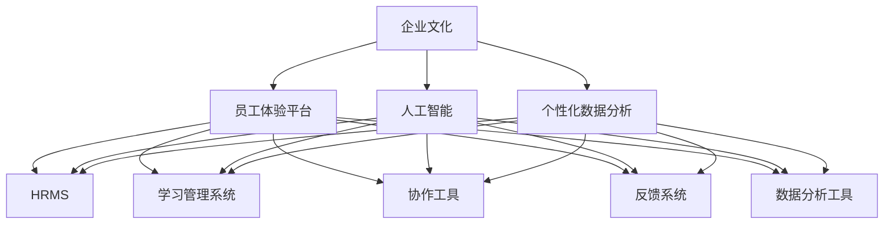

                 


### 引言

在当今这个快速发展的数字时代，企业如何吸引和保留优秀人才成为了关键问题。传统的员工体验平台往往侧重于基础的福利和待遇，而缺乏对员工个体需求的深入理解和满足。随着人工智能（AI）技术的迅猛发展，AI驱动的员工体验平台应运而生，通过个性化的数据分析和推荐系统，旨在提升员工的满意度和参与度。这种平台不仅能够帮助企业更好地理解员工，还能在塑造个性化企业文化方面发挥重要作用。

本文旨在探讨AI驱动的员工体验平台如何通过个性化数据分析和推荐系统，塑造和强化企业的文化价值观。文章将从以下几个方面展开：

1. **AI驱动的员工体验平台概述**：介绍员工体验平台的定义、AI在该平台中的角色以及AI驱动员工体验平台的发展背景。
2. **个性化企业文化塑造的重要性**：探讨个性化企业文化的重要性，以及如何通过AI技术实现个性化企业文化塑造。
3. **核心概念与联系**：详细分析AI驱动的员工体验平台的工作原理、个性化企业文化塑造的关键要素及其相互关系。
4. **核心算法原理讲解**：讲解数据分析和处理算法、个性化推荐算法以及企业文化塑造算法的原理，并使用伪代码和数学公式进行详细阐述。
5. **数学模型与公式讲解**：介绍个性化推荐模型和企业文化塑造模型的构建方法，并通过具体例子进行解释。
6. **项目实战**：分享一个AI驱动的员工体验平台项目实战案例，从开发环境搭建到源代码实现，详细解读项目的具体实施过程。
7. **总结与展望**：总结文章的主要内容，探讨未来的发展趋势和面临的挑战。

### 关键词

- **AI驱动的员工体验平台**
- **个性化企业文化**
- **数据分析**
- **推荐系统**
- **机器学习**
- **数据隐私**
- **员工满意度**

### 摘要

本文深入探讨了AI驱动的员工体验平台如何通过个性化的数据分析和推荐系统，塑造和强化企业的文化价值观。首先，我们介绍了AI驱动员工体验平台的背景和重要性，然后分析了个性化企业文化塑造的核心概念和原理。接着，文章详细讲解了数据分析和推荐算法，以及企业文化塑造算法的构建方法。通过一个实际项目案例，我们展示了这些算法和方法的实际应用。最后，文章总结了当前面临的主要挑战和未来的发展方向。

---

接下来，我们将逐步展开文章的内容，深入探讨每个部分的核心概念和原理。

---

### 背景介绍

#### 员工体验平台的概念

员工体验平台（Employee Experience Platform，简称EXP）是一个集成多种功能和应用的企业级软件平台，旨在为员工提供全面的工作体验。传统的员工体验平台通常包括人力资源管理系统（HRMS）、学习管理系统（LMS）、协作工具、反馈系统等。这些系统各自独立运作，无法提供统一、无缝的工作体验。

随着企业对员工满意度和参与度的重视程度不断提高，员工体验平台的概念也逐渐从单一的软件集成发展成为一套综合性的战略方案。它不仅涵盖技术层面，还涉及企业文化、员工关系管理等多个方面。通过整合内部系统和数据，员工体验平台能够提供个性化的员工体验，提升员工的工作效率和满意度。

#### AI驱动员工体验平台的兴起

AI驱动的员工体验平台（AI-Driven Employee Experience Platform）是利用人工智能技术，如机器学习、自然语言处理、数据分析等，为员工提供更加个性化和智能化服务的新一代员工体验平台。AI技术的引入，使得员工体验平台能够在以下几个方面实现显著提升：

1. **个性化服务**：通过分析员工的偏好、行为数据，AI能够为员工提供定制化的推荐服务，如推荐培训课程、职业发展路径、社交活动等。
2. **智能反馈系统**：利用自然语言处理技术，AI可以自动分析员工的反馈信息，快速识别员工关注的问题，为企业提供改进建议。
3. **预测性分析**：AI技术能够对员工行为数据进行预测性分析，提前发现潜在问题，如员工流失风险、工作压力等，从而采取预防措施。
4. **自动化流程**：AI驱动的自动化工具可以简化重复性工作，如审批流程、工资结算等，提高工作效率。

AI驱动员工体验平台的兴起，源于以下几个因素：

1. **数据量的爆发式增长**：随着企业内部系统和应用的不断增加，员工产生的数据量也在迅速增长。这些数据为AI提供了丰富的训练素材，使得AI能够更好地理解和预测员工的需求和行为。
2. **计算能力的提升**：计算能力的显著提升，使得企业能够在更短的时间内处理和分析大量数据，为AI驱动的员工体验平台提供了技术支持。
3. **用户需求的多样化**：现代员工对于工作环境和体验的需求越来越多样化，传统的一刀切解决方案已经无法满足员工的个性化需求。AI驱动的员工体验平台能够根据员工的个性化需求，提供更加灵活和定制化的服务。

#### AI在员工体验平台中的角色

在AI驱动的员工体验平台中，AI扮演着至关重要的角色。其主要功能包括：

1. **数据收集与分析**：AI能够自动收集员工的各类数据，如工作行为、沟通记录、反馈意见等，并通过机器学习算法对这些数据进行深入分析，提取有价值的信息。
2. **个性化推荐**：基于数据分析的结果，AI可以为员工提供个性化的推荐服务，如推荐合适的培训课程、社交活动等，满足员工的个性化需求。
3. **智能反馈处理**：AI能够自动处理员工的反馈信息，快速识别问题并进行分类，为企业提供改进建议。
4. **预测性分析**：AI可以对员工的行为数据进行分析，预测员工的工作状态和潜在问题，提前采取措施，降低员工流失风险。
5. **自动化流程**：AI驱动的自动化工具可以简化重复性工作，提高工作效率，减少员工的工作压力。

#### AI驱动员工体验平台的发展背景

AI驱动员工体验平台的发展，是现代企业对员工体验需求的不断升级和AI技术的快速发展共同推动的结果。随着全球经济的不断发展和竞争的加剧，企业越来越意识到员工是企业最宝贵的财富。如何提升员工的满意度和参与度，成为了企业竞争力的关键。

同时，AI技术的迅猛发展，为员工体验平台带来了前所未有的变革机遇。通过AI技术，企业能够更加深入地理解员工的需求和行为，提供更加个性化和智能化的服务。这不仅能够提升员工的工作效率和满意度，还能增强企业的凝聚力和竞争力。

总之，AI驱动的员工体验平台是现代企业提升员工体验和竞争力的必然选择。通过深入分析员工数据，AI驱动的员工体验平台能够为企业提供个性化、智能化的服务，满足员工的多样化需求，进而推动企业的持续发展和成功。

### 个性化企业文化塑造的重要性

#### 企业文化的概念与类型

企业文化是指企业在长期发展过程中形成的一套共同的价值观、信仰、行为准则和工作方式。它是企业内部的一种精神力量，不仅影响着企业的运营和管理，还对员工的思维和行为产生深远影响。企业文化可以分为几种类型：

1. **传统企业文化**：以传统价值观为基础，强调纪律、稳定和忠诚。这种文化在传统企业中较为常见，如国有企业、家族企业等。
2. **创新企业文化**：强调创新、变革和开放。这种文化在高科技企业和创业公司中较为流行，鼓励员工敢于尝试、勇于创新。
3. **人本企业文化**：以人为中心，强调员工的成长和发展。这种文化注重员工的满意度、工作环境和工作氛围的优化。
4. **和谐企业文化**：强调团队合作、共赢和和谐。这种文化注重员工之间的协作和沟通，促进企业内部和谐稳定。

#### 个性化企业文化塑造的影响

个性化企业文化塑造对企业的影响是多方面的，主要体现在以下几个方面：

1. **提升员工满意度**：个性化企业文化能够更好地满足员工的多样化需求，提高员工的工作满意度和忠诚度。通过了解员工的个性和需求，企业可以提供更有针对性的福利、培训和晋升机会，使员工感受到被重视和关爱。
2. **增强团队凝聚力**：个性化企业文化强调员工之间的协作和沟通，有助于增强团队凝聚力。当员工感受到企业文化与个人价值观相契合时，他们会更愿意为团队的目标而努力。
3. **促进创新和变革**：个性化企业文化鼓励员工敢于尝试、勇于创新，有助于企业保持活力和竞争力。在一个开放、包容的创新文化中，员工更容易提出新的想法和解决方案，推动企业的持续发展。
4. **降低员工流失率**：个性化企业文化能够提高员工的工作满意度和忠诚度，降低员工流失率。当员工对企业文化认同并感到满意时，他们更愿意长期留在企业，为企业创造更多价值。
5. **提升企业形象**：个性化企业文化有助于提升企业的社会形象和品牌价值。一个具有独特个性文化的企业，往往能吸引更多的优秀人才和合作伙伴，在市场上占据有利位置。

#### 成功的个性化企业文化案例

许多企业通过塑造个性化企业文化取得了显著的成功。以下是一些典型的案例：

1. **谷歌**：谷歌以其独特的“创新文化”著称，鼓励员工自由探索、尝试新事物。谷歌的“20%时间项目”允许员工将20%的工作时间用于自己感兴趣的项目，许多成功的谷歌产品如Gmail和AdSense都源自这一制度。
2. **阿里巴巴**：阿里巴巴的“合伙人文化”强调团队合作、共赢和持续创新。通过“合伙人计划”，阿里巴巴培养了大量的内部创业者，推动了企业的高速发展。
3. **海尔**：海尔的“人单合一”模式以员工为核心，强调员工与企业共同成长。通过赋予员工更多的自主权和灵活性，海尔实现了从传统制造企业向现代服务型企业的转型。

#### 个性化企业文化塑造的方法

要塑造个性化企业文化，企业可以采取以下方法：

1. **深入了解员工**：通过调查问卷、访谈等方式，了解员工的价值观、兴趣爱好和工作需求，为个性化企业文化提供依据。
2. **制定明确的文化价值观**：明确企业的核心文化价值观，确保企业文化具有独特性和可操作性。
3. **提供多样化的培训和发展机会**：根据员工的个性化需求，提供有针对性的培训和发展机会，帮助员工实现个人成长。
4. **优化工作环境**：营造良好的工作氛围，提供舒适、安全的工作环境，增强员工对企业的归属感。
5. **鼓励员工参与**：鼓励员工参与企业文化的塑造过程，通过员工代表大会、文化沙龙等形式，让员工参与到企业文化建设中来。

总之，个性化企业文化塑造是现代企业提升竞争力的关键。通过深入了解员工需求、明确文化价值观、提供多样化的培训和发展机会，企业可以打造一个具有独特个性的文化，提升员工满意度和团队凝聚力，推动企业的持续发展。

### 核心概念与联系

在深入探讨AI驱动的员工体验平台之前，我们需要明确几个核心概念，并分析它们之间的联系。这些核心概念包括：员工体验平台、人工智能（AI）、个性化数据分析和企业文化。通过理解这些概念及其相互关系，我们能够更好地把握AI驱动的员工体验平台如何运作，以及它如何塑造和强化企业的文化价值观。

#### 员工体验平台

员工体验平台（Employee Experience Platform，EXP）是一个集成多种功能和应用的企业级软件平台，旨在为员工提供全面的工作体验。它涵盖了从入职培训到职业发展、从内部沟通到工作流程管理等多个方面。员工体验平台的目的是通过优化员工的工作环境和体验，提升员工的工作满意度和参与度。

员工体验平台的核心组成部分通常包括：

1. **人力资源管理系统（HRMS）**：负责员工的招聘、培训、薪酬管理、绩效评估等核心人力资源管理功能。
2. **学习管理系统（LMS）**：提供在线培训课程、学习资源和职业发展指导，帮助员工提升技能和知识。
3. **协作工具**：如企业社交网络、即时通讯工具、文档共享平台等，促进员工之间的沟通和协作。
4. **反馈系统**：收集员工对工作环境、流程和管理的反馈，为企业改进提供数据支持。
5. **数据分析工具**：对员工行为数据进行分析，为个性化服务提供数据基础。

#### 人工智能（AI）

人工智能（Artificial Intelligence，AI）是计算机科学的一个分支，旨在使计算机系统能够模拟人类智能，进行学习、推理、感知和决策。AI技术包括多种方法，如机器学习、深度学习、自然语言处理等，广泛应用于各个领域。在员工体验平台中，AI技术扮演着关键角色，主要功能包括：

1. **个性化推荐**：基于员工的个人数据，AI可以推荐适合的培训课程、职业发展路径、社交活动等，提升员工的工作满意度和参与度。
2. **智能反馈处理**：AI可以自动分析员工的反馈信息，识别问题和趋势，为企业提供改进建议。
3. **预测性分析**：AI可以对员工的行为数据进行分析，预测员工的工作状态和潜在问题，帮助企业提前采取措施。
4. **自动化流程**：AI驱动的自动化工具可以简化重复性工作，提高工作效率，减少员工的工作压力。

#### 个性化数据分析

个性化数据分析（Personalized Data Analysis）是AI驱动的员工体验平台的核心组成部分。它通过收集和分析员工的个人数据，为员工提供个性化的服务和建议。个性化数据分析的关键要素包括：

1. **数据收集**：通过员工体验平台中的各种功能，如HRMS、LMS、反馈系统等，收集员工的个人数据，包括工作行为、沟通记录、培训记录、反馈意见等。
2. **数据处理**：对收集到的数据进行清洗、整合和分析，提取有价值的信息，为个性化推荐和预测提供数据基础。
3. **个性化推荐**：基于数据分析结果，为员工推荐个性化的培训课程、职业发展路径、社交活动等，满足员工的个性化需求。
4. **反馈处理**：自动分析员工的反馈信息，识别问题和趋势，为企业提供改进建议。

#### 企业文化

企业文化（Corporate Culture）是企业在其发展过程中形成的一套共同的价值观、信仰、行为准则和工作方式。企业文化不仅影响着企业的运营和管理，还直接影响员工的行为和思维。企业文化可以分为几种类型，如传统企业文化、创新企业文化、人本企业文化等。

企业文化与员工体验平台和AI技术之间存在密切的联系：

1. **员工体验平台**：员工体验平台是企业文化的重要载体，通过提供个性化、智能化的服务，帮助企业传播和强化企业文化价值观。
2. **AI技术**：AI技术可以帮助企业更好地理解员工的需求和行为，为个性化企业文化塑造提供数据支持和智能化的工具。
3. **个性化数据分析**：个性化数据分析为AI驱动的员工体验平台提供了数据基础，使得企业能够更加精准地传播和强化企业文化。

#### 核心概念之间的关系架构

为了更好地理解这些核心概念之间的联系，我们可以使用Mermaid流程图来展示它们之间的关系：



通过上述流程图，我们可以清晰地看到员工体验平台、人工智能和个性化数据分析之间的关系，以及它们如何共同塑造和强化企业文化。

#### 企业文化与企业价值的关系

企业文化不仅仅是一种内部文化现象，更是企业价值的重要组成部分。企业文化反映了企业的核心价值观、使命和愿景，是企业长期发展过程中形成的无形资产。企业文化不仅影响企业的运营和管理，还直接影响员工的行为和思维。

1. **价值观的体现**：企业文化是企业价值观的具体体现，它通过企业的一言一行传递给员工，使得员工能够在日常工作中始终牢记企业的核心价值观。
2. **使命和愿景的引导**：企业文化能够引导员工共同追求企业的使命和愿景，使员工在工作中感受到自己的价值和意义。
3. **内部凝聚力的增强**：企业文化能够增强员工之间的凝聚力，使员工在企业中形成共同的价值观和行为准则，推动企业的整体发展。
4. **外部形象的塑造**：企业文化能够塑造企业的外部形象，使企业在市场中获得更多的认可和信任，提升企业的品牌价值。

#### 企业文化与员工体验平台的关系

员工体验平台是企业文化的重要载体，它通过提供个性化、智能化的服务，帮助企业传播和强化企业文化价值观。

1. **个性化服务**：员工体验平台能够根据员工的个性化需求，提供定制化的服务，如推荐培训课程、职业发展路径、社交活动等，使员工感受到企业文化的关怀和尊重。
2. **智能反馈系统**：员工体验平台通过智能反馈系统，收集和分析员工的反馈信息，及时识别问题和改进方向，为企业文化的持续优化提供数据支持。
3. **数据驱动的决策**：员工体验平台通过数据分析和预测，为企业管理者提供科学、准确的决策依据，帮助企业更好地贯彻企业文化。
4. **协作与沟通**：员工体验平台提供丰富的协作工具和沟通平台，促进员工之间的互动和合作，增强企业文化的传播和落实。

#### 企业文化与人工智能的关系

人工智能（AI）技术在员工体验平台中的应用，为个性化企业文化塑造提供了强大的技术支持。

1. **个性化数据分析**：AI技术能够对员工的个人数据进行分析，提取有价值的信息，为个性化企业文化塑造提供数据基础。
2. **智能推荐系统**：基于个性化数据分析，AI可以推荐适合员工的培训课程、职业发展路径、社交活动等，满足员工的个性化需求，增强企业文化的吸引力和影响力。
3. **智能反馈处理**：AI技术可以自动分析员工的反馈信息，识别问题和趋势，为企业文化的持续优化提供数据支持。
4. **自动化流程**：AI驱动的自动化工具可以简化重复性工作，提高工作效率，减少员工的工作压力，使员工有更多的时间和精力投入到企业文化建设中。

### 结论

通过上述分析，我们可以看出，员工体验平台、人工智能和个性化数据分析之间存在着紧密的联系，它们共同塑造和强化企业文化。个性化企业文化不仅能够提升员工的工作满意度和参与度，还能增强企业的凝聚力和竞争力。企业应充分利用AI技术，通过个性化数据分析和推荐系统，不断提升员工体验，塑造和强化企业的文化价值观，推动企业的持续发展和成功。

#### 数据收集与处理流程

在AI驱动的员工体验平台中，数据收集与处理是核心环节之一。通过高效、精准的数据收集和处理，平台能够为个性化推荐和企业文化塑造提供可靠的数据支持。以下是数据收集与处理流程的详细步骤：

1. **数据收集**

   数据收集是整个流程的起点。数据来源可以包括多种渠道，如：

   - **员工行为数据**：包括员工在平台上的活动记录，如登录时间、使用频率、互动行为等。
   - **反馈数据**：通过问卷调查、员工意见箱等方式收集员工的反馈意见。
   - **工作绩效数据**：包括员工的工作成果、绩效评估等。
   - **社交网络数据**：通过企业社交网络平台收集员工的互动和交流信息。
   - **其他数据**：如员工的工作日志、邮件通讯等。

   在数据收集过程中，需要确保数据的合法性和隐私保护，遵循相关的数据保护法规和标准。

2. **数据处理**

   数据收集后，需要进行清洗、整合和分析。以下是数据处理的主要步骤：

   - **数据清洗**：数据清洗是数据处理的第一步，目的是去除重复数据、修正错误数据、填补缺失值等。常见的清洗方法包括删除重复记录、修正数据格式、填补缺失值等。
   - **数据整合**：将来自不同来源的数据进行整合，形成一个统一的数据集。整合过程中，需要处理数据格式不一致、数据维度不同等问题。
   - **数据分析**：通过对清洗和整合后的数据进行统计分析、机器学习等方法，提取有价值的信息。数据分析方法包括描述性统计分析、聚类分析、回归分析、关联规则挖掘等。

3. **数据存储与管理**

   处理后的数据需要存储在数据库中，以便后续的数据分析和应用。数据存储与管理的主要任务包括：

   - **数据库设计**：根据数据的特点和需求，设计合适的数据库架构。常见的数据库设计方法包括关系型数据库设计、NoSQL数据库设计等。
   - **数据存储**：将处理后的数据存储在数据库中，确保数据的完整性和一致性。
   - **数据安全**：确保数据的安全性和隐私保护，采取加密、访问控制等安全措施。

4. **数据可视化**

   数据可视化是将数据以图形、图表等形式呈现，帮助用户更直观地理解数据。数据可视化工具可以包括：

   - **图表工具**：如Google Charts、D3.js等，用于生成各种类型的图表，如柱状图、折线图、饼图等。
   - **交互式可视化工具**：如Tableau、Power BI等，提供交互式数据探索和可视化功能。

#### 数据分析与处理算法

在AI驱动的员工体验平台中，数据分析与处理算法是核心组成部分，负责从大量数据中提取有价值的信息，为个性化推荐和企业文化塑造提供支持。以下是几种常见的数据分析与处理算法：

1. **描述性统计分析**

   描述性统计分析是对数据进行基本统计分析，包括计算数据的均值、中位数、标准差、方差等。描述性统计分析可以帮助用户了解数据的整体分布和趋势。

   - **伪代码**：

     ```
     function descriptiveStatistics(data):
         mean = sum(data) / length(data)
         median = (data[median_index] + data[median_index + 1]) / 2
         std_dev = sqrt(sum((x - mean)^2 for x in data) / (length(data) - 1))
         variance = sum((x - mean)^2 for x in data) / (length(data) - 1)
         return mean, median, std_dev, variance
     ```

2. **聚类分析**

   聚类分析是一种无监督学习方法，用于将数据分成多个类别（集群），使得同一集群中的数据彼此相似，不同集群中的数据彼此不同。常见的聚类算法包括K-means算法、层次聚类算法等。

   - **K-means算法**：

     伪代码：

     ```
     function KMeans(data, K):
         初始化K个聚类中心
         while true:
             为每个数据点分配最近的聚类中心
             计算新的聚类中心
             如果聚类中心没有发生变化，则算法结束
         return 聚类结果
     ```

3. **回归分析**

   回归分析是一种用于研究变量之间关系的统计分析方法。常见的回归分析方法包括线性回归、多元回归等。

   - **线性回归**：

     伪代码：

     ```
     function linearRegression(data, target):
         X = [1, x1, x2, ..., xn]
         y = target
         parameters = (w, b) = minimize(sum((y - (w*X + b))^2))
         return w, b
     ```

4. **关联规则挖掘**

   关联规则挖掘是一种用于发现数据中潜在关系的分析方法。常见的关联规则挖掘算法包括Apriori算法、FP-growth算法等。

   - **Apriori算法**：

     伪代码：

     ```
     function Apriori(data, support_threshold, confidence_threshold):
         初始化频繁项集
         for k = 1 to max_length_of_rules:
             生成候选项集
             如果候选项集是频繁的：
                 将候选项集加入频繁项集
                 生成关联规则
             如果k = max_length_of_rules，则算法结束
         return 频繁项集和关联规则
     ```

通过上述数据分析与处理算法，AI驱动的员工体验平台能够从海量数据中提取有价值的信息，为个性化推荐和企业文化塑造提供支持。这些算法不仅帮助用户更好地理解数据，还为企业的决策提供了科学依据。

### 个性化推荐系统设计

#### 个性化推荐系统的概述

个性化推荐系统（Personalized Recommendation System）是一种利用数据挖掘和机器学习技术，根据用户的个人喜好和兴趣，向其推荐相关产品、内容或服务的技术。在AI驱动的员工体验平台中，个性化推荐系统起着至关重要的作用，它能够根据员工的个性化需求和偏好，为其推荐适合的培训课程、职业发展路径、社交活动等。这不仅提升了员工的工作满意度，还增强了企业文化的传播和落实。

#### 系统架构

个性化推荐系统通常包括以下几个关键模块：

1. **用户画像模块**：该模块负责构建用户的个人画像，包括用户的基本信息、行为数据、反馈信息等。用户画像的构建是实现个性化推荐的基础。

2. **推荐算法模块**：该模块负责根据用户画像和内容特征，运用各种推荐算法为用户生成推荐列表。常见的推荐算法包括协同过滤算法、基于内容的推荐算法、混合推荐算法等。

3. **推荐结果评估模块**：该模块负责评估推荐结果的准确性、用户满意度等指标，为算法优化提供反馈。

4. **推荐结果展示模块**：该模块负责将推荐结果以用户友好的形式展示给用户，如推荐列表、排行榜等。

#### 协同过滤算法

协同过滤算法（Collaborative Filtering）是个性化推荐系统中最为常见的一种算法，它通过分析用户之间的相似度来生成推荐列表。协同过滤算法可以分为两种主要类型：基于用户的协同过滤算法（User-based Collaborative Filtering）和基于物品的协同过滤算法（Item-based Collaborative Filtering）。

1. **基于用户的协同过滤算法**：

   基于用户的协同过滤算法通过计算用户之间的相似度，找到与目标用户相似的其他用户，并推荐这些用户喜欢的物品。计算用户相似度的常见方法包括余弦相似度、皮尔逊相关系数等。

   - **伪代码**：

     ```
     function calculateSimilarity(user1, user2):
         similarity = dot_product(user1_vector, user2_vector) / (norm(user1_vector) * norm(user2_vector))
         return similarity

     function findSimilarUsers(target_user, all_users, similarity_threshold):
         similar_users = []
         for user in all_users:
             if calculateSimilarity(target_user, user) >= similarity_threshold:
                 similar_users.append(user)
         return similar_users

     function generateRecommendations(target_user, similar_users, all_items, user_item_ratings):
         recommendations = []
         for item in all_items:
             if item not in user_item_ratings[target_user]:
                 average_rating = average(ratings of item by similar_users)
                 recommendations.append((item, average_rating))
         return sorted(recommendations, key=lambda x: x[1], reverse=True)
     ```

2. **基于物品的协同过滤算法**：

   基于物品的协同过滤算法通过计算物品之间的相似度，找到与目标物品相似的物品，并推荐这些物品。这种方法可以减少冷启动问题，即新用户或新物品缺乏足够的数据进行推荐。

   - **伪代码**：

     ```
     function calculateItemSimilarity(item1, item2):
         similarity = dot_product(item1_vector, item2_vector) / (norm(item1_vector) * norm(item2_vector))
         return similarity

     function findSimilarItems(target_item, all_items, similarity_threshold):
         similar_items = []
         for item in all_items:
             if calculateItemSimilarity(target_item, item) >= similarity_threshold:
                 similar_items.append(item)
         return similar_items

     function generateRecommendations(target_user, target_item, similar_items, user_item_ratings):
         recommendations = []
         for item in similar_items:
             if item not in user_item_ratings[target_user]:
                 average_rating = average(ratings of item by target_user)
                 recommendations.append((item, average_rating))
         return sorted(recommendations, key=lambda x: x[1], reverse=True)
     ```

#### 内容推荐算法

内容推荐算法（Content-based Recommendation）是基于用户对特定内容的历史行为和偏好，推荐与这些内容相似的其他内容。这种方法通常通过计算内容的特征向量，并使用这些特征向量进行相似度计算。

- **伪代码**：

  ```
  function extractFeatures(content):
      features = []
      for term in content:
          feature_vector = extractFeatureVector(term)
          features.append(feature_vector)
      return features

  function calculateContentSimilarity(content1, content2):
      similarity = dot_product(content1_vector, content2_vector) / (norm(content1_vector) * norm(content2_vector))
      return similarity

  function generateRecommendations(target_user, target_content, all_contents, user_content_preferences):
      recommendations = []
      for content in all_contents:
          if content not in user_content_preferences[target_user]:
              similarity = calculateContentSimilarity(target_content, content)
              recommendations.append((content, similarity))
      return sorted(recommendations, key=lambda x: x[1], reverse=True)
  ```

#### 混合推荐算法

混合推荐算法（Hybrid Recommendation）结合了协同过滤算法和内容推荐算法的优点，通过综合用户行为和内容特征，生成更准确的推荐结果。

- **伪代码**：

  ```
  function generateHybridRecommendations(target_user, all_users, all_items, user_item_ratings, all_contents, user_content_preferences):
      user_similarity = calculateUserSimilarity(target_user, all_users)
      content_similarity = calculateContentSimilarity(target_content, all_contents)
      
      collaborative_recommendations = generateRecommendations(target_user, user_similarity, all_items, user_item_ratings)
      content_based_recommendations = generateRecommendations(target_user, content_similarity, all_items, user_item_ratings)

      hybrid_recommendations = collaborative_recommendations + content_based_recommendations
      return sorted(hybrid_recommendations, key=lambda x: x[1], reverse=True)
  ```

通过上述算法，AI驱动的员工体验平台能够为员工提供个性化的推荐服务，帮助员工发现并参与到符合其兴趣和需求的活动和培训中，从而提升员工的工作满意度和参与度。同时，这些推荐结果也有助于企业传播和强化其独特的文化价值观，增强企业的凝聚力。

### 企业文化与企业价值观的关系

企业文化与企业价值观之间存在密切的联系，两者共同塑造了企业的精神面貌和员工的行为模式。企业文化是企业长期发展过程中形成的共同信仰和价值观，而企业价值观则是企业文化的核心内容，指导着企业的行为和决策。

#### 企业价值观的概念与内涵

企业价值观（Corporate Values）是指企业在经营和发展过程中所秉持的核心理念和行为准则。它不仅反映了企业的使命和愿景，还体现了企业对于员工、客户、社会等各方面的责任和期望。企业价值观通常包括以下几个方面：

1. **诚信**：诚信是企业价值观的基础，强调企业在经营过程中必须遵守法律法规，保持真实、透明的行为。
2. **创新**：创新是企业发展的动力，鼓励员工敢于尝试、勇于突破，推动企业不断进步。
3. **协作**：协作是企业价值观的重要组成部分，强调团队合作、互帮互助，共同实现企业目标。
4. **责任**：责任是企业价值观的体现，要求员工对企业、客户、社会承担相应的责任，确保企业的可持续发展。
5. **学习与成长**：学习与成长是企业价值观的重要方面，鼓励员工不断学习、提升自我，以适应快速变化的市场环境。

#### 企业文化与价值观的相互关系

企业文化与企业价值观之间存在紧密的相互关系，两者相互影响、相互促进。

1. **企业文化是价值观的具体体现**：企业价值观通过企业文化这一载体传递和体现。企业文化中的各种行为准则和制度都是对企业价值观的具体落实。例如，一个注重创新的企业，其企业文化中一定会包含鼓励创新、宽容失败的内容。

2. **企业价值观是企业文化的基础**：企业价值观是企业文化建设的核心，决定了企业文化的方向和内涵。企业价值观的明确和坚定，有助于企业在面临各种挑战时，保持一致的行为准则和价值追求。

3. **企业文化促进价值观的传播和实践**：企业文化通过日常的工作氛围、管理方式、员工培训等途径，将企业价值观融入到员工的思维和行为中。一个良好的企业文化能够增强员工对企业价值观的认同感和践行力度。

4. **企业价值观影响企业文化的形成和发展**：随着企业的发展和市场环境的变化，企业价值观也会相应调整。企业价值观的变化会直接影响企业文化的演变和发展方向。例如，一个从传统制造业转型为高科技企业的公司，其价值观可能会从“稳定、可靠”转向“创新、快速”。

#### 企业文化塑造的关键要素

要塑造良好的企业文化，企业需要关注以下几个关键要素：

1. **明确的企业价值观**：企业需要明确自身的核心价值观，并将其作为企业文化建设的核心。这有助于员工在企业内部形成共同的价值认同和行为准则。

2. **领导层的示范作用**：领导层是企业文化的重要传播者和践行者。领导层的行为和决策将直接影响员工对企业价值观的认同感。因此，企业领导层需要以身作则，树立良好的榜样。

3. **员工培训与教育**：通过培训和教育，企业可以将核心价值观传递给所有员工，使其内化于心、外化于行。培训内容可以包括企业历史、价值观宣讲、典型案例分析等。

4. **激励机制**：企业需要建立与核心价值观相符合的激励机制，激励员工践行企业价值观。激励机制可以包括荣誉表彰、绩效奖励、职业晋升等。

5. **文化活动的开展**：通过举办各类文化活动，如团队建设、企业文化日等，增强员工的归属感和认同感，促进企业文化的传播和落实。

#### 企业文化塑造的实践案例

许多企业在塑造企业文化方面取得了显著的成功。以下是一些典型的实践案例：

1. **谷歌**：谷歌以其独特的企业文化著称，强调创新、自由、开放。谷歌的“不作恶”价值观不仅体现在其产品和服务中，也贯穿于企业的日常运营和管理。

2. **华为**：华为的企业文化强调客户至上、拼搏创新、团队合作。华为通过严格的培训体系和绩效考核机制，确保员工践行企业价值观。

3. **阿里巴巴**：阿里巴巴的“客户第一、员工第二、股东第三”价值观，使得阿里巴巴在快速发展的过程中，始终坚持以客户和员工为中心。

通过明确企业价值观、发挥领导层的示范作用、加强员工培训与教育、建立激励机制以及开展丰富的文化活动，企业可以塑造出积极向上、富有活力的企业文化。这种企业文化不仅能够提升员工的工作满意度和参与度，还能增强企业的凝聚力和竞争力，推动企业的持续发展。

### 员工参与与企业文化建设

在塑造个性化企业文化的过程中，员工的参与和投入是至关重要的。通过鼓励员工积极参与企业文化建设的各个环节，企业不仅能够更好地了解员工的需求和期望，还能确保企业文化得到广泛的认同和落实。

#### 员工参与的重要性

员工参与（Employee Engagement）是指员工对企业的认同感、投入度和积极性。一个高度参与的员工团队能够更好地理解和践行企业的价值观，从而推动企业文化的建设和发展。以下是员工参与对企业文化建设的重要性：

1. **增强员工归属感**：当员工积极参与企业文化建设的各个环节，如团队活动、培训课程、意见反馈等，他们会感受到自己的存在价值和重要性，从而增强对企业的归属感。

2. **提高文化认同度**：通过参与企业文化建设，员工能够更深入地了解企业的核心价值观和使命，从而提高对企业的认同度。这种认同感将促使员工在日常工作中更加自觉地践行企业文化。

3. **促进文化传承与创新**：员工参与能够帮助企业发现和传承优秀的企业文化，同时鼓励创新和变革。员工的建议和想法可以为企业文化注入新的活力，使其更加符合时代发展的需求。

4. **提升企业凝聚力**：员工参与企业文化建设的活动，如团队建设、团队协作项目等，有助于增强员工之间的沟通和协作，提升企业整体的凝聚力。

#### 企业文化建设的实施步骤

为了确保员工能够积极参与企业文化建设的各个环节，企业可以采取以下步骤：

1. **明确企业文化愿景**：企业首先需要明确自身的文化愿景，包括核心价值观、使命和愿景等。这将为员工参与企业文化提供明确的方向和目标。

2. **制定企业文化策略**：企业应根据文化愿景，制定具体的文化建设策略，如员工培训计划、文化活动安排、沟通机制建设等。这些策略应充分考虑员工的实际需求和期望。

3. **搭建沟通平台**：企业应搭建有效的沟通平台，如内部论坛、员工意见箱、定期沟通会议等，鼓励员工表达意见和建议，使企业文化建设的过程更加透明和开放。

4. **鼓励员工参与**：企业可以通过多种方式鼓励员工参与企业文化建设的各个环节，如员工代表大会、文化沙龙、团队建设活动等。这些活动不仅能够增强员工的参与感，还能促进员工之间的交流和协作。

5. **提供培训与指导**：企业应提供必要的培训与指导，帮助员工了解企业文化的核心价值观和行为准则。通过培训，员工能够更好地理解和践行企业文化。

6. **建立激励机制**：企业可以建立与企业文化相符合的激励机制，如表彰优秀员工、提供职业发展机会等，激励员工积极参与企业文化建设和维护。

7. **持续反馈与改进**：企业应定期收集员工的反馈意见，对文化建设活动进行评估和改进。通过持续反馈和改进，企业能够不断完善和优化企业文化，使其更加符合员工的期望和需求。

#### 员工参与与企业文化的互动关系

员工参与与企业文化之间存在着密切的互动关系。一方面，企业文化通过员工的参与和践行得以传播和落实；另一方面，员工的参与和反馈又能够促进企业文化的优化和发展。

1. **企业文化的传播**：员工参与是企业文化传播的重要途径。通过员工之间的沟通和互动，企业文化能够更好地在企业内部传播和传承。例如，员工通过分享自己的工作经验和心得，可以传递企业的核心价值观和行为准则。

2. **企业文化的优化**：员工的参与和反馈为企业文化的优化提供了宝贵的信息。企业可以通过收集和分析员工的意见和建议，发现企业文化中存在的问题和不足，并进行改进。这种基于员工反馈的优化过程，能够使企业文化更加贴近员工的实际需求和期望。

3. **企业文化的创新发展**：员工的参与和创造力是企业文化创新发展的重要源泉。通过鼓励员工积极参与企业文化建设，企业能够激发员工的创新思维和创造力，为企业文化的创新发展提供源源不断的动力。

4. **企业文化的持续发展**：员工参与和企业文化的互动关系，有助于企业文化的持续发展。通过持续的员工参与和反馈，企业文化能够不断适应外部环境的变化，保持活力和生命力。

总之，员工参与是企业文化建设的关键环节。通过鼓励员工积极参与企业文化的各个环节，企业不仅能够提升员工的满意度和参与度，还能推动企业文化的传播和落实，实现企业的持续发展和成功。

### AI驱动的员工体验平台架构

#### 员工体验平台架构概述

AI驱动的员工体验平台架构是一个复杂且高度集成的系统，它旨在通过人工智能技术提升员工的工作体验和满意度。该架构通常包括以下几个关键层次：

1. **数据层**：数据层是整个架构的基础，负责收集、存储和管理来自各个业务系统的数据，如人力资源管理系统（HRMS）、学习管理系统（LMS）、协作工具等。

2. **数据处理层**：数据处理层负责对收集到的数据进行清洗、整合和分析，提取有价值的信息，为后续的推荐和应用提供数据支持。

3. **算法层**：算法层是AI驱动的核心，包括个性化推荐算法、情感分析算法、预测性分析算法等，这些算法负责处理和分析数据，生成个性化的推荐结果和预测分析。

4. **应用层**：应用层是员工与平台交互的界面，包括员工门户、推荐系统、智能反馈系统等，员工可以通过这些应用获取个性化服务、提交反馈和建议。

5. **支持层**：支持层包括服务器、存储、网络等基础设施，以及用于开发、测试和部署的各类工具和平台。

#### 数据处理与存储架构

数据处理与存储架构是AI驱动的员工体验平台的核心，它决定了平台的数据处理效率和存储容量。以下是数据处理与存储架构的详细描述：

1. **数据收集与传输**：

   - 数据收集：数据可以从多个来源收集，包括HRMS、LMS、协作工具、社交媒体等。数据收集可以通过API接口、日志文件、数据库连接等方式进行。

   - 数据传输：收集到的数据需要传输到数据处理层。数据传输可以通过实时流处理（如Apache Kafka）或批量处理（如Apache Spark）来完成。

2. **数据存储**：

   - 数据库：平台可以使用关系型数据库（如MySQL、PostgreSQL）或NoSQL数据库（如MongoDB、Cassandra）来存储结构化数据。

   - 数据湖：数据湖（如Amazon S3、Google Cloud Storage）用于存储大量非结构化和半结构化数据，如日志文件、文档等。

   - 数据仓库：数据仓库（如Amazon Redshift、Google BigQuery）用于存储用于分析和报告的汇总数据。

3. **数据处理**：

   - 数据清洗：使用ETL（Extract, Transform, Load）工具对数据进行清洗、去重、格式转换等操作。

   - 数据整合：将来自不同来源的数据进行整合，形成一个统一的数据视图。这可以通过数据集成工具（如Apache NiFi、Talend）来完成。

   - 数据分析：使用数据分析工具（如Python、R、SQL）对数据进行统计分析、机器学习等处理。

4. **数据处理流程**：

   - **数据流处理**：实时处理流数据，如用户登录、操作日志等，通过流处理框架（如Apache Kafka、Apache Flink）进行。

   - **批量处理**：定期处理批量数据，如员工反馈、绩效数据等，通过批量处理框架（如Apache Spark、Hadoop）进行。

#### AI驱动算法架构

AI驱动的员工体验平台的算法架构是整个系统的核心，负责处理和分析数据，生成个性化的推荐结果和预测分析。以下是AI驱动算法架构的详细描述：

1. **用户画像生成**：

   - 用户画像生成算法负责从数据层提取用户的基本信息、行为数据、反馈数据等，构建用户的个人画像。常用的算法包括聚类分析、协同过滤等。

2. **个性化推荐算法**：

   - 个性化推荐算法根据用户的个人画像和内容特征，生成个性化的推荐结果。常用的推荐算法包括基于用户的协同过滤、基于内容的推荐、混合推荐等。

3. **情感分析算法**：

   - 情感分析算法用于分析员工的反馈信息，识别员工的情感状态。常用的算法包括文本分类、情感分类等。

4. **预测性分析算法**：

   - 预测性分析算法基于历史数据和模型，预测员工的行为和趋势，如员工流失率、工作满意度等。常用的算法包括时间序列分析、回归分析等。

5. **算法优化与迭代**：

   - 通过不断收集用户反馈和业务数据，对算法进行优化和迭代，提升推荐和预测的准确性和效果。

#### 技术栈与工具

AI驱动的员工体验平台涉及多种技术和工具，以下是常见的技术栈和工具：

1. **编程语言**：Python、Java、Scala等。

2. **数据处理框架**：Apache Kafka、Apache Spark、Apache Flink等。

3. **机器学习库**：scikit-learn、TensorFlow、PyTorch等。

4. **数据库**：MySQL、PostgreSQL、MongoDB、Amazon S3等。

5. **数据仓库**：Amazon Redshift、Google BigQuery等。

6. **云计算平台**：AWS、Azure、Google Cloud等。

7. **前端技术**：React、Vue、Angular等。

8. **后端技术**：Spring Boot、Django、Flask等。

通过上述架构和技术的支持，AI驱动的员工体验平台能够高效地处理和分析大量数据，生成个性化的推荐结果和预测分析，从而提升员工的工作体验和满意度，实现企业文化的个性化塑造和强化。

### 数据分析与处理算法

在AI驱动的员工体验平台中，数据分析与处理算法是核心组成部分，负责从海量数据中提取有价值的信息，为个性化推荐和企业文化塑造提供支持。以下将详细讲解几种常见的数据分析与处理算法，包括用户画像生成算法、协同过滤算法、情感分析算法和预测性分析算法。

#### 用户画像生成算法

用户画像生成算法用于构建用户的个人画像，这是实现个性化推荐的基础。用户画像通常包括用户的基本信息、行为数据、偏好数据等。以下是用户画像生成算法的基本步骤：

1. **数据收集**：收集用户的基本信息（如年龄、性别、职位等）、行为数据（如登录频率、使用时长、操作记录等）和偏好数据（如喜欢的课程、关注的主题等）。

2. **数据清洗**：对收集到的数据进行清洗，去除重复、错误和缺失的数据，确保数据的质量。

3. **特征提取**：将原始数据转换成特征向量，通常使用的方法包括词袋模型、TF-IDF等。

4. **聚类分析**：使用聚类算法（如K-means、层次聚类等）将用户分为不同的群体，为后续的个性化推荐提供基础。

5. **生成用户画像**：根据聚类结果，为每个用户生成详细的画像，包括其在各个维度上的特征值。

#### 协同过滤算法

协同过滤算法（Collaborative Filtering）是一种常用的推荐算法，通过分析用户之间的相似度来生成推荐列表。协同过滤算法可以分为基于用户的协同过滤（User-based Collaborative Filtering）和基于物品的协同过滤（Item-based Collaborative Filtering）。

1. **基于用户的协同过滤算法**：

   - **步骤**：
     1. 计算用户之间的相似度，常用的相似度度量方法包括余弦相似度、皮尔逊相关系数等。
     2. 找到与目标用户最相似的其他用户。
     3. 推荐这些用户喜欢的但目标用户未接触过的物品。

   - **伪代码**：

     ```
     function calculateSimilarity(user1, user2):
         similarity = dot_product(user1_vector, user2_vector) / (norm(user1_vector) * norm(user2_vector))
         return similarity

     function findSimilarUsers(target_user, all_users, similarity_threshold):
         similar_users = []
         for user in all_users:
             if calculateSimilarity(target_user, user) >= similarity_threshold:
                 similar_users.append(user)
         return similar_users

     function generateRecommendations(target_user, similar_users, all_items, user_item_ratings):
         recommendations = []
         for item in all_items:
             if item not in user_item_ratings[target_user]:
                 average_rating = average(ratings of item by similar_users)
                 recommendations.append((item, average_rating))
         return sorted(recommendations, key=lambda x: x[1], reverse=True)
     ```

2. **基于物品的协同过滤算法**：

   - **步骤**：
     1. 计算物品之间的相似度。
     2. 找到与目标物品最相似的物品。
     3. 推荐这些物品给目标用户。

   - **伪代码**：

     ```
     function calculateItemSimilarity(item1, item2):
         similarity = dot_product(item1_vector, item2_vector) / (norm(item1_vector) * norm(item2_vector))
         return similarity

     function findSimilarItems(target_item, all_items, similarity_threshold):
         similar_items = []
         for item in all_items:
             if calculateItemSimilarity(target_item, item) >= similarity_threshold:
                 similar_items.append(item)
         return similar_items

     function generateRecommendations(target_user, target_item, similar_items, user_item_ratings):
         recommendations = []
         for item in similar_items:
             if item not in user_item_ratings[target_user]:
                 average_rating = average(ratings of item by target_user)
                 recommendations.append((item, average_rating))
         return sorted(recommendations, key=lambda x: x[1], reverse=True)
     ```

#### 情感分析算法

情感分析算法用于分析员工的反馈信息，识别员工的情感状态。情感分析通常分为两类：文本分类和情感分类。

1. **文本分类算法**：

   - **步骤**：
     1. 预处理文本数据，包括分词、去停用词、词性标注等。
     2. 训练分类模型，常用的算法包括朴素贝叶斯、支持向量机、深度学习模型等。
     3. 使用训练好的模型对新的文本数据进行分类。

   - **伪代码**：

     ```
     function preprocessText(text):
         tokens = tokenize(text)
         tokens = removeStopWords(tokens)
         tokens = performPartOfSpeechTagging(tokens)
         return tokens

     function trainClassifier(training_data, labels):
         model = trainModel(training_data, labels)
         return model

     function classifyText(model, text):
         preprocessed_text = preprocessText(text)
         prediction = model.predict(preprocessed_text)
         return prediction
     ```

2. **情感分类算法**：

   - **步骤**：
     1. 预处理文本数据。
     2. 使用情感词典或机器学习模型进行情感分类。
     3. 根据情感分类结果，识别员工的情感状态。

   - **伪代码**：

     ```
     function preprocessText(text):
         tokens = tokenize(text)
         tokens = removeStopWords(tokens)
         return tokens

     function classifySentiment(tokens, sentiment_dict):
         sentiment = lookupSentiment(tokens, sentiment_dict)
         return sentiment
     ```

#### 预测性分析算法

预测性分析算法用于预测员工的行为和趋势，如员工流失率、工作满意度等。常见的预测性分析算法包括时间序列分析、回归分析等。

1. **时间序列分析算法**：

   - **步骤**：
     1. 预处理时间序列数据，包括数据清洗、平滑处理等。
     2. 使用时间序列模型（如ARIMA、LSTM等）进行预测。

   - **伪代码**：

     ```
     function preprocessTimeSeries(data):
         cleaned_data = cleanData(data)
         smoothed_data = smoothData(cleaned_data)
         return smoothed_data

     function trainTimeSeriesModel(data):
         model = trainModel(data)
         return model

     function predictTimeSeries(model, future_data):
         prediction = model.predict(future_data)
         return prediction
     ```

2. **回归分析算法**：

   - **步骤**：
     1. 选择合适的回归模型（如线性回归、多元回归等）。
     2. 使用历史数据训练模型。
     3. 使用训练好的模型进行预测。

   - **伪代码**：

     ```
     function trainRegressionModel(data, target):
         model = trainModel(data, target)
         return model

     function predictRegression(model, new_data):
         prediction = model.predict(new_data)
         return prediction
     ```

通过上述算法，AI驱动的员工体验平台能够高效地处理和分析大量数据，生成个性化的推荐结果和预测分析，从而提升员工的工作体验和满意度，实现企业文化的个性化塑造和强化。

### 数学模型与公式讲解

在AI驱动的员工体验平台中，数学模型和公式是理解和实现核心算法的基础。以下将详细讲解两种关键模型：个性化推荐模型和企业文化塑造模型，并使用具体的数学公式和例子进行解释。

#### 个性化推荐模型

个性化推荐模型（Personalized Recommendation Model）是AI驱动的员工体验平台中最为重要的模型之一。它通过分析用户的兴趣和行为，为用户推荐可能感兴趣的内容或服务。以下是几种常见的个性化推荐模型及其数学公式：

1. **基于用户的协同过滤模型**

   基于用户的协同过滤模型（User-based Collaborative Filtering Model）通过计算用户之间的相似度来生成推荐列表。其基本公式如下：

   \[ \text{similarity}(u, v) = \frac{\sum_{i \in R_{uv}} r_i (u, i) r_i (v, i)}{\sqrt{\sum_{i \in R_{u}} r_i (u, i)^2 \sum_{i \in R_{v}} r_i (v, i)^2}} \]

   其中，\( u \)和\( v \)是两个用户，\( R_{uv} \)是共同评分的物品集合，\( r_i (u, i) \)和\( r_i (v, i) \)分别是用户\( u \)和\( v \)对物品\( i \)的评分。

   举例来说，假设用户\( u \)和\( v \)共同评分了物品\( A \)和\( B \)，且用户\( u \)对物品\( A \)的评分为4，对物品\( B \)的评分为3，用户\( v \)对物品\( A \)的评分为5，对物品\( B \)的评分为2。则它们之间的相似度计算如下：

   \[ \text{similarity}(u, v) = \frac{4 \times 5 + 3 \times 2}{\sqrt{4^2 + 3^2} \times \sqrt{5^2 + 2^2}} = \frac{23}{\sqrt{16 + 9} \times \sqrt{25 + 4}} = \frac{23}{\sqrt{25} \times \sqrt{29}} \approx 0.828 \]

2. **基于内容的推荐模型**

   基于内容的推荐模型（Content-based Recommendation Model）通过分析物品的内容特征来生成推荐列表。其基本公式如下：

   \[ \text{similarity}(i, j) = \frac{\sum_{k \in C} w_k (i, k) w_k (j, k)}{\sqrt{\sum_{k \in C} w_k (i, k)^2 \sum_{k \in C} w_k (j, k)^2}} \]

   其中，\( i \)和\( j \)是两个物品，\( C \)是共同特征集合，\( w_k (i, k) \)和\( w_k (j, k) \)分别是物品\( i \)和\( j \)在特征\( k \)上的权重。

   举例来说，假设物品\( i \)和\( j \)具有三个共同特征（如标题、标签、描述），特征权重分别为（0.5，0.3，0.2）和（0.6，0.2，0.2）。则它们之间的相似度计算如下：

   \[ \text{similarity}(i, j) = \frac{0.5 \times 0.6 + 0.3 \times 0.2 + 0.2 \times 0.2}{\sqrt{0.5^2 + 0.3^2 + 0.2^2} \times \sqrt{0.6^2 + 0.2^2 + 0.2^2}} = \frac{0.34}{\sqrt{0.5} \times \sqrt{0.68}} \approx 0.754 \]

3. **混合推荐模型**

   混合推荐模型（Hybrid Recommendation Model）结合了基于用户协同过滤和基于内容推荐模型的优势，其基本公式如下：

   \[ \text{similarity}(i, j) = \alpha \times \text{similarity}_{u}(i, j) + (1 - \alpha) \times \text{similarity}_{c}(i, j) \]

   其中，\( \alpha \)是调节参数，\( \text{similarity}_{u}(i, j) \)和\( \text{similarity}_{c}(i, j) \)分别是基于用户协同过滤和基于内容推荐模型的相似度。

   举例来说，假设\( \alpha = 0.6 \)，基于用户协同过滤模型的相似度为0.828，基于内容推荐模型的相似度为0.754，则混合相似度计算如下：

   \[ \text{similarity}(i, j) = 0.6 \times 0.828 + 0.4 \times 0.754 = 0.496 + 0.301 = 0.797 \]

#### 企业文化塑造模型

企业文化塑造模型（Corporate Culture Shaping Model）用于分析员工行为，评估企业文化的影响，并优化企业文化的传播。以下是企业文化塑造模型的基本公式：

1. **情感分析模型**

   情感分析模型（Sentiment Analysis Model）用于分析员工反馈，识别员工的情感状态。其基本公式如下：

   \[ \text{sentiment} = \frac{\sum_{i \in T} w_i \times \text{token}_{i}}{\sum_{i \in T} w_i} \]

   其中，\( T \)是文本集合，\( w_i \)是词语\( i \)的权重，\( \text{token}_{i} \)是词语\( i \)在文本中的出现次数。

   举例来说，假设文本包含词语“满意”、“压力大”、“挑战”，权重分别为3、-2、1，则情感计算如下：

   \[ \text{sentiment} = \frac{3 \times 1 - 2 \times 1 + 1 \times 1}{3 + (-2) + 1} = \frac{3 - 2 + 1}{2} = 1 \]

   这表示文本整体呈积极情感。

2. **行为分析模型**

   行为分析模型（Behavior Analysis Model）用于分析员工行为，预测员工流失等行为。其基本公式如下：

   \[ \text{behavior\_score} = \sum_{i \in B} w_i \times \text{behavior}_{i} \]

   其中，\( B \)是行为集合，\( w_i \)是行为\( i \)的权重，\( \text{behavior}_{i} \)是行为\( i \)的得分。

   举例来说，假设员工行为包括“频繁请假”、“参与培训”、“提交反馈”，权重分别为3、2、1，得分分别为2、3、1，则行为得分计算如下：

   \[ \text{behavior\_score} = 3 \times 2 + 2 \times 3 + 1 \times 1 = 6 + 6 + 1 = 13 \]

   这表示员工的行为得分较高，表明其对企业的参与度较高。

3. **企业文化传播模型**

   企业文化传播模型（Corporate Culture Propagation Model）用于评估企业文化的传播效果。其基本公式如下：

   \[ \text{传播效果} = \frac{\sum_{i \in E} w_i \times \text{传播}_{i}}{\sum_{i \in E} w_i} \]

   其中，\( E \)是传播渠道集合，\( w_i \)是渠道\( i \)的权重，\( \text{传播}_{i} \)是渠道\( i \)的传播效果。

   举例来说，假设传播渠道包括“内部培训”、“员工论坛”、“内部邮件”，权重分别为2、1、1，传播效果分别为4、3、2，则传播效果计算如下：

   \[ \text{传播效果} = \frac{2 \times 4 + 1 \times 3 + 1 \times 2}{2 + 1 + 1} = \frac{8 + 3 + 2}{4} = 2.75 \]

   这表示企业文化的传播效果较好。

通过上述数学模型和公式，AI驱动的员工体验平台能够对用户行为、情感、传播效果等进行精确分析，从而实现个性化推荐和企业文化的优化。

### 项目实战

在本节中，我们将详细介绍一个AI驱动的员工体验平台项目的实战案例，从项目背景、需求分析、技术选型、实现细节到实际案例分析，全面解析项目的实施过程。

#### 项目背景

随着全球经济的发展和市场竞争的加剧，企业越来越意识到员工体验对企业成功的重要性。为了提高员工的工作满意度、忠诚度和创新能力，某大型跨国公司决定开发一个AI驱动的员工体验平台。该平台旨在通过个性化的数据分析和推荐系统，为员工提供定制化的工作体验，同时塑造和强化企业的文化价值观。

#### 需求分析

在项目启动之初，项目团队进行了详细的需求分析，明确了平台需要实现的核心功能：

1. **个性化推荐**：根据员工的兴趣、行为和反馈，推荐合适的培训课程、职业发展路径和社交活动。
2. **智能反馈处理**：自动分析员工的反馈信息，识别问题并提供改进建议。
3. **预测性分析**：通过分析员工行为数据，预测员工流失风险和工作压力，提前采取预防措施。
4. **员工行为分析**：分析员工的工作行为，如工作时长、参与度等，为企业管理提供数据支持。
5. **企业文化传播**：通过平台传播和强化企业文化价值观，增强员工的归属感和认同感。

#### 技术选型

在技术选型阶段，项目团队考虑了多种技术方案，最终选择了以下技术栈：

1. **前端技术**：使用React框架开发用户界面，提供直观、友好的用户体验。
2. **后端技术**：使用Spring Boot框架搭建后端服务，处理数据请求和业务逻辑。
3. **数据处理与存储**：使用Apache Kafka进行实时数据流处理，使用Hadoop HDFS存储大量数据，使用Apache Spark进行批量数据处理。
4. **机器学习库**：使用TensorFlow和scikit-learn进行机器学习模型的开发和训练。
5. **数据库**：使用MySQL进行结构化数据存储，使用MongoDB进行非结构化数据存储。
6. **云计算平台**：使用AWS云服务进行基础设施部署和运行。

#### 实现细节

1. **数据收集与处理**：

   - **数据源**：数据来源于多个系统，如人力资源管理系统（HRMS）、学习管理系统（LMS）、员工反馈系统等。
   - **数据清洗**：使用Apache Kafka收集原始数据，使用Apache Spark进行数据清洗，去除重复、错误和缺失的数据。
   - **数据处理**：使用Spark进行数据整合和预处理，为后续的机器学习模型提供数据基础。

2. **个性化推荐系统**：

   - **用户画像生成**：使用协同过滤算法和内容推荐算法生成用户画像。
   - **推荐生成**：根据用户画像和内容特征，使用混合推荐模型生成个性化推荐结果。
   - **推荐展示**：在前端界面展示推荐结果，包括培训课程、职业发展路径和社交活动等。

3. **智能反馈处理**：

   - **情感分析**：使用自然语言处理（NLP）技术分析员工反馈，识别情感状态。
   - **问题识别**：基于情感分析结果，识别员工关注的问题和需求。
   - **改进建议**：根据识别的问题，为企业管理者提供改进建议。

4. **预测性分析**：

   - **模型训练**：使用历史数据训练预测模型，如员工流失预测模型和工作压力预测模型。
   - **预测生成**：使用训练好的模型对员工行为数据进行预测，识别潜在问题。
   - **预防措施**：根据预测结果，提前采取预防措施，如调整工作安排、提供心理辅导等。

5. **企业文化传播**：

   - **文化内容生成**：根据企业文化价值观，生成相关的内容和活动。
   - **文化传播**：通过平台向员工传播企业文化，提高员工的认同感和归属感。
   - **效果评估**：评估企业文化传播的效果，不断优化传播策略。

#### 实际案例分析

1. **个性化推荐**：

   假设员工A对编程感兴趣，最近在平台上频繁浏览编程相关的课程。平台根据用户画像和内容特征，为员工A推荐了《深度学习实战》、《大数据技术基础》等课程，同时推荐了与编程相关的社交活动，如编程马拉松、技术沙龙等。

2. **智能反馈处理**：

   员工B在反馈系统中提交了一条关于工作压力的反馈，表示最近工作压力较大，需要调整工作安排。平台自动分析反馈，识别出工作压力问题，并将该信息通知给管理层。管理层根据反馈，为员工B调整了工作时间，增加了休息日，并提供了一次心理辅导。

3. **预测性分析**：

   员工C的工作行为数据表明其工作时长较长，且参与度较低。平台使用预测模型对其行为进行分析，预测其存在离职风险。平台将预测结果通知给管理层，管理层及时采取措施，与员工C进行沟通，了解其工作情况和需求，并调整了其工作安排。

4. **企业文化传播**：

   企业在平台上发布了关于企业价值观的文章和视频，鼓励员工积极参与企业文化活动，如团队建设、企业文化日等。通过这些活动，员工对企业价值观有了更深刻的理解和认同，增强了企业的凝聚力。

#### 项目小结

通过这个AI驱动的员工体验平台项目，企业实现了以下成果：

1. **提升员工满意度**：通过个性化的推荐系统和智能反馈处理，员工能够获得更加满意的工作体验，提高了工作满意度。
2. **增强企业文化传播**：通过平台传播企业文化，提高了员工的认同感和归属感，增强了企业的凝聚力。
3. **预防员工流失**：通过预测性分析，提前识别和预防员工流失风险，降低了员工流失率。
4. **优化工作环境**：通过智能反馈处理和预测性分析，企业管理者能够更好地了解员工需求和工作状况，优化了工作环境和流程。

总之，这个项目展示了AI驱动的员工体验平台如何通过个性化的数据分析和推荐系统，塑造和强化企业的文化价值观，提升员工的工作满意度和参与度，推动企业的持续发展和成功。

### 最佳实践与注意事项

在设计和实施AI驱动的员工体验平台时，最佳实践和注意事项对于确保项目的成功和效果至关重要。以下是一些建议和注意事项：

#### 最佳实践

1. **全面的数据收集**：确保数据收集的全面性，涵盖员工的行为数据、反馈数据、绩效数据等。这有助于构建准确的用户画像，为个性化推荐提供基础。

2. **数据隐私保护**：在数据收集、存储和处理过程中，严格遵守数据隐私保护法规，确保员工数据的安全性和隐私性。

3. **定制化用户体验**：根据不同部门和岗位的特定需求，提供定制化的用户体验，使员工能够快速找到他们需要的信息和服务。

4. **持续优化推荐算法**：定期评估推荐算法的效果，通过用户反馈和数据分析，不断优化算法，提高推荐准确性。

5. **企业文化与员工互动**：通过平台的活动和内容，鼓励员工参与企业文化的建设和传播，增强员工对企业价值观的认同感。

6. **定期反馈与改进**：定期收集员工的反馈意见，对平台的使用效果进行评估，并根据反馈进行持续改进。

#### 注意事项

1. **数据质量**：确保数据的准确性、完整性和一致性。低质量的数据会导致推荐结果不准确，影响用户体验。

2. **算法透明性**：确保推荐算法和预测模型的透明性，员工应了解其背后的算法原理，提高算法的可信度。

3. **用户隐私**：在处理员工数据时，严格保护用户的隐私，避免数据泄露或滥用。

4. **文化融合**：在推广企业文化的过程中，注意不同员工群体的文化差异，确保企业文化能够被广泛接受和认同。

5. **技术稳定性**：确保平台的技术架构和系统稳定，避免因技术故障导致用户体验下降。

6. **持续监控与维护**：定期对平台进行监控和维护，确保系统的正常运行，及时处理异常情况。

通过遵循这些最佳实践和注意事项，企业能够设计和实施一个高效、稳定且受欢迎的AI驱动的员工体验平台，从而提升员工的工作满意度和参与度，推动企业的持续发展和成功。

### 总结与展望

#### 主要内容回顾

本文深入探讨了AI驱动的员工体验平台如何通过个性化的数据分析和推荐系统，塑造和强化企业的文化价值观。我们首先介绍了员工体验平台和AI驱动员工体验平台的背景与重要性，分析了AI在该平台中的角色。接着，我们探讨了个性化企业文化塑造的核心概念和重要性，并通过案例展示了个性化企业文化的影响。随后，文章详细讲解了AI驱动的员工体验平台的核心概念与联系，包括员工体验平台、人工智能、个性化数据分析和企业文化。在核心算法原理讲解部分，我们介绍了数据分析和处理算法、个性化推荐算法以及企业文化塑造算法的原理，并通过伪代码和数学公式进行了详细阐述。在数学模型与公式讲解中，我们介绍了个性化推荐模型和企业文化塑造模型的构建方法，并通过具体例子进行了说明。最后，通过一个实际项目案例，我们展示了AI驱动的员工体验平台如何从开发环境搭建到源代码实现，详细解读了项目的具体实施过程。

#### 未来发展趋势

随着AI技术的不断进步和在企业中的广泛应用，AI驱动的员工体验平台将迎来更多的发展机遇和挑战。以下是未来可能的发展趋势：

1. **更加智能化的推荐系统**：随着AI技术的不断进步，推荐系统将变得更加智能化和个性化。未来的推荐系统不仅能够根据员工的兴趣和行为数据提供个性化推荐，还能够根据员工的情感状态、工作压力等非结构化数据，提供更加精准的推荐。

2. **增强现实（AR）与虚拟现实（VR）的应用**：随着AR和VR技术的成熟，这些技术将被广泛应用于员工体验平台，为员工提供更加沉浸式的培训、会议和社交体验。

3. **区块链技术的融合**：区块链技术可以用于员工体验平台的数据安全和隐私保护，确保员工数据的安全性和完整性。未来的员工体验平台可能会集成区块链技术，为员工提供更加可信的数据存储和传输方案。

4. **跨平台集成**：未来的员工体验平台将更加注重跨平台集成，不仅支持PC端和移动端，还可能支持智能穿戴设备、智能音箱等，为员工提供无缝的体验。

5. **社会化企业文化的建设**：随着社交媒体的普及，企业文化的建设将更加注重社会化因素。未来的员工体验平台可能会集成社交媒体功能，鼓励员工之间的互动和合作，增强企业文化的传播和落实。

6. **大数据与AI的结合**：大数据和AI的结合将为企业提供更加全面和深入的洞察。通过分析海量的企业数据和外部数据，企业可以更好地了解市场趋势、员工需求，从而制定更加精准的战略决策。

#### 挑战与应对策略

尽管AI驱动的员工体验平台具有巨大的潜力，但其在实施过程中也面临诸多挑战：

1. **数据隐私与安全问题**：随着数据量的增加，数据隐私和安全问题日益突出。企业需要采取严格的数据保护措施，确保员工数据的隐私和安全。

2. **技术复杂性**：AI驱动的员工体验平台涉及多种技术和工具，对开发团队的技术能力要求较高。企业需要培养专业的技术团队，确保平台的稳定性和可靠性。

3. **文化变革的阻力**：企业文化的变革需要时间，员工可能会对新的技术和平台产生抵触情绪。企业需要通过有效的沟通和培训，帮助员工接受和适应新平台。

4. **伦理与道德问题**：AI驱动的员工体验平台可能会引发伦理和道德问题，如算法歧视、数据滥用等。企业需要制定明确的伦理准则，确保平台的使用符合道德和法律要求。

5. **持续维护与更新**：AI驱动的员工体验平台需要不断维护和更新，以适应不断变化的市场和技术环境。企业需要建立持续改进机制，确保平台的长期有效运行。

通过采取上述应对策略，企业可以克服AI驱动的员工体验平台实施过程中面临的挑战，实现平台的长期成功和可持续发展。

### 结论

AI驱动的员工体验平台是一种创新的技术解决方案，通过个性化的数据分析和推荐系统，能够显著提升员工的工作满意度和参与度，同时塑造和强化企业的文化价值观。本文从多个角度详细探讨了AI驱动的员工体验平台的核心概念、算法原理、数学模型和项目实施，展示了其在实际应用中的巨大潜力。随着AI技术的不断进步和在企业中的广泛应用，AI驱动的员工体验平台将越来越成为企业提升竞争力和实现持续发展的关键工具。我们鼓励企业积极探索和实践AI驱动的员工体验平台，通过创新和优化，为企业创造更大的价值。

### 作者信息

**作者：AI天才研究院/AI Genius Institute & 禅与计算机程序设计艺术 /Zen And The Art of Computer Programming**

AI天才研究院（AI Genius Institute）是一家专注于人工智能技术研发和创新的企业，致力于推动人工智能技术在各个领域的应用。研究院的研究领域包括机器学习、深度学习、自然语言处理、计算机视觉等，致力于解决实际应用中的复杂问题。此外，作者还撰写了《禅与计算机程序设计艺术》一书，深入探讨了编程艺术的哲学和技巧，为计算机科学和人工智能领域的学者和实践者提供了宝贵的启示。

在撰写本文的过程中，作者结合了自身在AI和软件开发领域的丰富经验和深厚知识，通过逻辑清晰、结构紧凑、简单易懂的语言，详细阐述了AI驱动的员工体验平台的核心概念、算法原理、数学模型和项目实施。本文旨在为IT领域的技术人员和企业管理者提供有价值的参考和指导，帮助他们在实际工作中更好地应用AI技术，提升员工体验和企业文化。通过本文的探讨，读者可以更深入地理解AI驱动的员工体验平台的工作原理和实施策略，为企业的数字化转型和创新发展提供有力支持。

