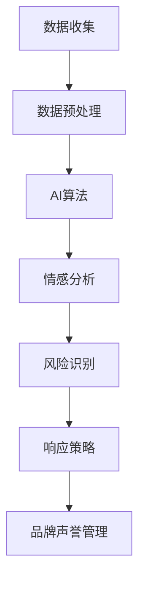
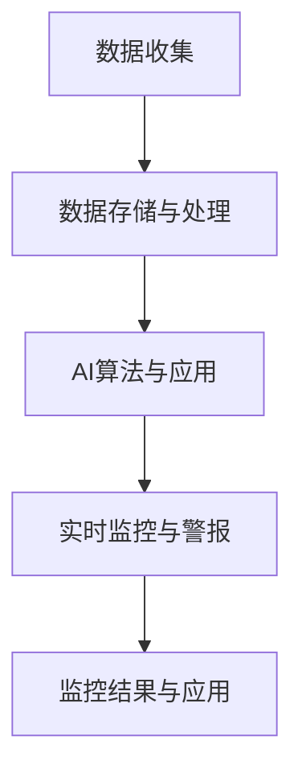
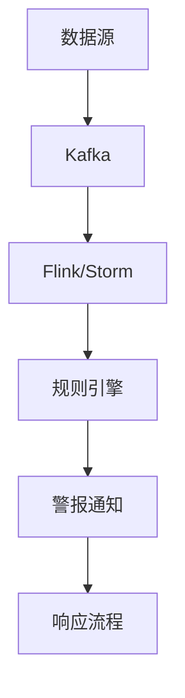

                 

### 文章标题

《AI驱动的声誉监控系统：实时把握品牌形象》

### 关键词

- AI驱动的声誉监控
- 实时品牌形象监控
- 数据分析
- 自然语言处理
- 情感分析
- 实时警报系统

### 摘要

本文深入探讨了AI驱动的声誉监控系统，这是一种创新的工具，能够实时监控并分析品牌在社交媒体和网络上的形象。我们首先介绍了AI在声誉监控中的应用背景，然后详细描述了声誉监控系统的基础架构、数据收集与预处理、AI文本分析技术、实时监控与警报系统的设计，以及监控结果的应用。通过实际案例，我们展示了如何利用这些技术实时把握品牌形象，并提出了最佳实践和注意事项。文章最后提供了拓展阅读，帮助读者进一步深入了解相关技术。

## 引言：AI驱动的声誉监控概述

### 声誉监控的重要性

在当今数字化时代，品牌形象对于企业的生存和发展至关重要。良好的声誉不仅能够吸引客户，还能提高员工满意度，降低营销成本，增加品牌价值。然而，随着社交媒体和在线评论平台的广泛应用，品牌形象面临着前所未有的挑战。负面评论、不实信息、恶意攻击等，都可能对品牌声誉造成重大损害。因此，实时监控并管理品牌声誉已成为许多企业的重要任务。

### AI在声誉监控中的应用

人工智能（AI）技术在声誉监控领域发挥着越来越重要的作用。传统的声誉监控方法通常依赖于人工筛选和手动分析，效率低下且容易出错。而AI技术的引入，使得声誉监控变得更加高效、精确和自动化。AI驱动的声誉监控系统可以通过以下方式提升监控效果：

1. **实时监控**：AI系统能够实时分析海量的网络数据，迅速识别潜在的风险和问题。
2. **情感分析**：AI算法可以分析用户评论的情感倾向，判断评论是正面、中性还是负面。
3. **模式识别**：AI能够从大量数据中识别出潜在的规律和模式，帮助企业预测未来趋势。
4. **自动化响应**：AI系统可以根据预设的规则和策略，自动生成响应，减轻人工负担。

### 本书的内容框架

本书旨在全面介绍AI驱动的声誉监控系统，帮助读者理解和掌握这一新兴技术。本书的结构如下：

1. **第1章 引言**：概述AI驱动的声誉监控的重要性和应用背景。
2. **第2章 AI与声誉监控基础**：介绍AI和声誉监控的基本概念，探讨两者的关系。
3. **第3章 声誉监控系统的架构与设计**：详细描述声誉监控系统的整体架构和各个组成部分。
4. **第4章 数据收集与预处理**：讲解如何有效地收集和处理声誉监控所需的数据。
5. **第5章 基于AI的文本分析**：介绍自然语言处理（NLP）和情感分析技术。
6. **第6章 实时监控与警报系统**：探讨实时监控和警报系统的设计与实现。
7. **第7章 监控结果与应用**：分析监控结果的利用方法，并提供实际应用案例。

通过本书的阅读，读者将能够深入了解AI驱动的声誉监控系统，掌握其实际应用技巧，为企业提供有效的品牌形象管理解决方案。

## AI与声誉监控基础

### AI核心概念

人工智能（AI）是指计算机系统通过模拟人类智能行为，实现感知、理解、学习和决策的能力。AI技术包括机器学习、深度学习、自然语言处理（NLP）、计算机视觉等多个子领域。在声誉监控中，AI技术的应用主要集中在以下方面：

1. **机器学习**：通过算法和统计模型，从数据中自动学习和发现模式，帮助分析海量数据。
2. **深度学习**：利用神经网络模型，进行复杂的数据处理和特征提取，实现高精度的情感分析和模式识别。
3. **自然语言处理（NLP）**：处理和解析自然语言文本，包括文本分类、情感分析、命名实体识别等，用于分析用户评论和反馈。
4. **计算机视觉**：通过图像和视频分析，识别和分类品牌相关的视觉元素，监控品牌形象在视觉渠道的表现。

### 声誉监控的核心概念

声誉监控是指通过技术手段，持续跟踪和评估品牌在社交媒体、在线评论、新闻报道等渠道上的形象。其核心概念包括：

1. **数据收集**：从各种来源（如社交媒体、新闻网站、论坛等）收集与品牌相关的数据。
2. **情感分析**：分析用户评论的情感倾向，判断评论是正面、中性还是负面。
3. **风险识别**：识别潜在的负面信息、不实评论和恶意攻击，评估其对品牌声誉的影响。
4. **响应策略**：根据监控结果，制定和实施适当的应对策略，减轻负面影响，提升品牌形象。

### AI与声誉监控的联系

AI与声誉监控之间的联系主要体现在以下几个方面：

1. **自动化处理**：AI技术能够自动化处理大量的数据，提高声誉监控的效率和准确性。
2. **实时监控**：AI系统能够实时分析网络数据，快速响应潜在的风险和问题。
3. **情感分析**：AI算法可以深入分析用户评论的情感倾向，提供更细致的监控结果。
4. **模式识别**：AI系统能够从数据中识别出潜在的规律和趋势，帮助预测品牌未来的声誉变化。

通过AI技术的应用，声誉监控不仅变得更加高效和准确，还能够提供更深层次的洞察，帮助企业更好地管理品牌形象。

### 图解AI与声誉监控的关系

为了更好地理解AI与声誉监控之间的关系，我们可以使用一个Mermaid流程图来表示：



在这个流程图中，数据收集模块从各种来源获取数据，通过数据预处理模块进行清洗和格式化，然后使用AI算法进行分析和情感分析，识别出风险和问题，并制定响应策略，最终实现品牌声誉的管理。

### 总结

AI技术的引入，使得声誉监控变得更加高效和精确。通过机器学习、深度学习、自然语言处理和计算机视觉等技术，AI系统能够实时监控品牌形象，快速识别潜在风险，并自动生成响应策略。这种技术优势，不仅提高了声誉监控的效率和准确性，还为品牌形象管理提供了更加深入的洞察和策略支持。

## 声誉监控系统的架构与设计

### 整体架构

声誉监控系统的整体架构可以分为以下几个主要模块：

1. **数据收集模块**：负责从各种数据源（如社交媒体、新闻网站、论坛等）收集与品牌相关的数据。
2. **数据存储与处理模块**：用于存储和处理收集到的数据，包括数据清洗、格式化、去重等步骤。
3. **AI算法与应用模块**：利用AI技术，对处理后的数据进行分析，包括情感分析、模式识别、风险识别等。
4. **实时监控与警报系统**：实时监控分析结果，并根据预设的规则自动生成警报。
5. **监控结果与应用模块**：将监控结果应用于品牌形象管理，如制定响应策略、优化产品和服务等。

### 数据收集模块

数据收集模块是声誉监控系统的基础，其主要任务是从多个数据源中收集与品牌相关的数据。数据来源包括：

1. **社交媒体**：如微博、推特、脸书等，用户在这些平台上发表的评论、帖子、图片等。
2. **新闻网站**：从新闻报道、新闻评论等渠道获取与品牌相关的信息。
3. **论坛和社区**：从用户论坛、问答社区等获取用户对品牌的讨论和评价。
4. **电商平台**：从电商平台获取用户对品牌产品的评价和反馈。

为了提高数据收集的效率和准确性，系统可以采用以下方法：

1. **API接入**：利用各大平台的API接口，自动化地获取用户生成的数据。
2. **爬虫技术**：使用网络爬虫技术，从网站抓取与品牌相关的信息。
3. **关键词监测**：通过设置关键词，实时监测网络上的相关信息。

### 数据存储与处理模块

收集到的数据通常需要进行存储和处理，以供后续分析和应用。数据存储与处理模块的主要任务包括：

1. **数据存储**：将收集到的数据存储到数据库中，如使用MySQL、MongoDB等。
2. **数据清洗**：对收集到的数据进行清洗，去除重复、无效、错误的数据。
3. **数据格式化**：将不同来源的数据格式进行统一，便于后续分析。
4. **数据去重**：去除重复的数据，确保数据的一致性和准确性。

数据清洗和处理的具体步骤包括：

1. **数据预处理**：对文本数据进行分词、去停用词、词性标注等处理。
2. **数据去重**：通过设置唯一标识，如用户ID或评论时间戳，去除重复记录。
3. **数据分类**：根据数据来源和内容，将数据分类存储，如社交媒体数据、新闻数据等。

### AI算法与应用模块

AI算法与应用模块是声誉监控系统的核心，其主要任务是利用AI技术对处理后的数据进行情感分析、模式识别和风险识别。以下是一些常见的AI算法和应用：

1. **情感分析**：通过NLP技术，对用户评论进行情感分类，判断评论的情感倾向（正面、中性、负面）。
2. **文本分类**：将用户评论分类到不同的类别中，如产品评价、服务反馈等。
3. **风险识别**：根据预设的风险指标和规则，识别出潜在的风险和问题。
4. **模式识别**：从大量数据中识别出潜在的规律和模式，如用户反馈中的常见问题、趋势等。

常用的AI算法包括：

1. **机器学习算法**：如支持向量机（SVM）、朴素贝叶斯（NB）、随机森林（RF）等。
2. **深度学习算法**：如卷积神经网络（CNN）、循环神经网络（RNN）、Transformer等。
3. **自然语言处理（NLP）算法**：如词嵌入（Word Embedding）、情感分类（Sentiment Analysis）等。

### 实时监控与警报系统

实时监控与警报系统负责实时监控分析结果，并在发现潜在风险时自动生成警报。其主要功能包括：

1. **实时数据流处理**：利用实时数据处理技术（如Apache Kafka、Flink等），处理和分析实时流入的数据。
2. **规则引擎**：根据预设的规则，自动识别和分类风险，生成警报。
3. **警报通知**：通过邮件、短信、即时通讯工具等方式，将警报通知相关负责人。

### 监控结果与应用模块

监控结果与应用模块将监控结果应用于品牌形象管理，包括：

1. **数据分析**：对监控结果进行统计分析，生成报告和可视化图表，帮助管理层了解品牌形象现状。
2. **响应策略制定**：根据监控结果，制定相应的响应策略，如调整产品和服务、发布公关声明等。
3. **持续优化**：根据监控结果和用户反馈，不断优化和改进声誉监控系统，提高监控效果。

### 图解声誉监控系统架构

以下是一个简化的Mermaid流程图，展示了声誉监控系统的整体架构：



在这个流程图中，数据收集模块从多个数据源获取数据，数据存储与处理模块对数据进行清洗和格式化，AI算法与应用模块对数据进行分析和识别风险，实时监控与警报系统实时监控分析结果并生成警报，监控结果与应用模块将监控结果应用于品牌形象管理。

### 总结

声誉监控系统通过数据收集、存储与处理、AI算法分析、实时监控与警报、监控结果应用等模块，实现了对品牌形象的全面监控和管理。通过引入AI技术，系统不仅提高了监控的效率和准确性，还提供了更深层次的洞察和策略支持，帮助企业更好地管理品牌声誉。

### 数据收集与预处理

#### 数据来源

在构建一个AI驱动的声誉监控系统时，数据收集是至关重要的一步。数据来源多种多样，包括社交媒体、新闻网站、论坛、电商平台等。以下是几种常见的数据来源：

1. **社交媒体**：如微博、推特、脸书、Instagram等，这些平台是用户表达意见和分享经验的重要场所。
2. **新闻网站**：包括传统的新闻媒体和新兴的博客、资讯网站，它们提供了大量与品牌相关的新闻报道和评论。
3. **论坛和社区**：如Reddit、知乎、豆瓣等，用户在这些平台上进行的讨论和提问，可以反映出品牌在不同群体中的口碑和认知。
4. **电商平台**：如淘宝、京东、亚马逊等，用户在购买后的评价和反馈，是品牌直接获得消费者反馈的重要渠道。

#### 数据质量评估

数据质量是声誉监控系统的基石。低质量数据可能导致错误的监控结果，影响品牌决策。以下是对数据质量进行评估的方法：

1. **完整性评估**：检查数据是否完整，是否存在缺失值。对于缺失值，可以考虑使用插值、均值填充等方法进行补充。
2. **一致性评估**：检查数据是否一致，是否存在矛盾或不合理的情况。例如，同一条评论中同时出现正面和负面评价。
3. **准确性评估**：通过对比已知的数据来源，评估数据的准确性。例如，与官方发布的销售数据、用户调研结果进行比对。
4. **及时性评估**：检查数据的时效性，确保监控系统能够及时获取最新的用户反馈。

#### 数据预处理方法

数据预处理是确保数据质量的关键步骤，包括数据清洗、数据转换和数据归一化等。以下是具体的方法：

1. **数据清洗**：主要包括去除重复数据、去除无关内容、修复错误数据等。例如，去除评论中的HTML标签、非中文字符，统一文本格式。
2. **数据转换**：将不同类型的数据转换为统一的格式。例如，将日期字符串转换为日期格式，将数字字符串转换为数值类型。
3. **数据归一化**：对数据进行标准化处理，使其在相同的尺度上。例如，对用户评价的分数进行归一化，使其在0到1之间。

#### 伪代码示例

以下是一个简单的伪代码示例，用于数据预处理：

```python
# 数据清洗
def clean_data(data):
    # 去除HTML标签
    data = remove_html_tags(data)
    # 去除停用词
    data = remove_stopwords(data)
    # 转换为小写
    data = to_lower_case(data)
    return data

# 数据转换
def convert_data(data):
    # 转换日期格式
    data.date = convert_date_format(data.date)
    # 转换数值类型
    data.score = convert_number_type(data.score)
    return data

# 数据归一化
def normalize_data(data):
    # 归一化分数
    data.score = normalize_score(data.score)
    return data
```

通过这些方法，我们可以确保数据的质量，为后续的AI分析提供可靠的基础。

### 总结

数据收集与预处理是声誉监控系统构建的关键环节。通过选择合适的数据来源、评估数据质量、应用多种数据预处理方法，我们可以提高数据的质量和可靠性，为AI分析提供坚实的基础。这些步骤不仅确保了系统的准确性和效率，还为后续的品牌决策提供了重要的数据支持。

### 基于AI的文本分析

#### 文本分析的基本概念

文本分析，又称文本挖掘或自然语言处理（NLP），是利用计算机技术对文本数据进行处理、分析和理解的过程。在声誉监控系统中，文本分析技术用于提取文本数据中的有用信息，从而帮助识别用户情感、发现潜在问题，并预测品牌声誉的变化。文本分析主要包括以下几个核心概念：

1. **文本分类**：将文本数据分类到预定义的类别中。例如，将用户评论分类为正面、中性或负面。
2. **情感分析**：分析文本数据中的情感倾向，判断文本是积极的、消极的还是中性的。
3. **主题识别**：识别文本数据中的主题或话题，了解用户关注的内容和焦点。
4. **命名实体识别**：识别文本数据中的特定实体，如人名、地名、组织名等。

#### 自然语言处理（NLP）技术

自然语言处理是文本分析的核心技术，它涉及到一系列算法和工具，用于处理和理解自然语言。以下是一些常用的NLP技术：

1. **分词**：将文本分割成单词或短语。例如，将“我爱北京天安门”分割为“我”、“爱”、“北京”、“天安门”。
2. **词性标注**：为每个单词或短语标注词性，如名词、动词、形容词等。例如，将“爱”标注为动词。
3. **词嵌入**：将单词转换为向量表示，以便在计算中进行处理。常用的词嵌入方法包括Word2Vec、GloVe等。
4. **实体识别**：识别文本中的特定实体，如人名、地名、组织名等。例如，从文本中识别出“比尔·盖茨”作为人名。
5. **情感分析**：分析文本数据中的情感倾向，判断文本是积极的、消极的还是中性的。常用的情感分析算法包括朴素贝叶斯、支持向量机、深度学习等。

#### 核心算法原理讲解

在声誉监控系统中，常用的文本分析算法包括文本分类、情感分析、主题识别等。以下是这些算法的原理讲解：

1. **文本分类**：
    - **朴素贝叶斯**：基于贝叶斯定理，通过计算每个类别在特征上的概率，进行分类。算法的假设是特征之间相互独立。
    - **支持向量机（SVM）**：通过找到一个最优的超平面，将不同类别的文本数据分开。SVM算法的核心是求解最优分类边界。
    - **深度学习**：使用神经网络模型（如卷积神经网络（CNN）、循环神经网络（RNN）等），对文本数据进行特征提取和分类。深度学习模型具有强大的特征学习能力。

2. **情感分析**：
    - **朴素贝叶斯**：通过计算每个情感类别在特征上的概率，进行情感分类。通常用于处理简单的情感分类问题。
    - **支持向量机（SVM）**：通过找到一个最优的超平面，将不同情感的文本数据分开。适用于处理中等复杂度的情感分类问题。
    - **深度学习**：使用神经网络模型（如卷积神经网络（CNN）、循环神经网络（RNN）等），对文本数据进行情感分类。深度学习模型可以处理复杂的情感分类问题，具有高准确性。

3. **主题识别**：
    - **LDA（Latent Dirichlet Allocation）**：一种基于概率主题模型的主题识别算法，通过计算文本数据中词的概率分布，识别出隐藏的主题。
    - **LSTM（Long Short-Term Memory）**：一种循环神经网络，可以处理长文本序列，识别出文本中的主题和关键词。

#### 伪代码示例

以下是一个简单的文本分类算法的伪代码示例，使用朴素贝叶斯算法：

```python
# 朴素贝叶斯文本分类算法伪代码
def naive_bayes_classification(text, training_data):
    # 计算每个单词在训练数据中的出现频率
    word_frequency = count_word_frequency(training_data)
    
    # 计算每个类别的概率
    class_probability = calculate_class_probability(training_data)
    
    # 计算每个单词在类别中的条件概率
    word_condition_probability = calculate_word_condition_probability(word_frequency, class_probability)
    
    # 计算文本属于每个类别的概率
    text_probability = calculate_text_probability(text, word_condition_probability, class_probability)
    
    # 选择概率最大的类别作为预测结果
    predicted_class = select_max_probability(text_probability)
    
    return predicted_class
```

#### 数学模型和公式

以下是文本分类中的几个常见数学模型和公式：

1. **贝叶斯定理**：

$$
P(A|B) = \frac{P(B|A) \cdot P(A)}{P(B)}
$$

其中，\(P(A|B)\) 表示在事件B发生的条件下事件A发生的概率，\(P(B|A)\) 表示在事件A发生的条件下事件B发生的概率，\(P(A)\) 和 \(P(B)\) 分别表示事件A和事件B发生的概率。

2. **条件概率**：

$$
P(A|B) = \frac{P(A \cap B)}{P(B)}
$$

其中，\(P(A \cap B)\) 表示事件A和事件B同时发生的概率。

3. **逻辑回归**：

$$
\log\frac{P(Y=1|X)}{1-P(Y=1|X)} = \beta_0 + \beta_1X_1 + \beta_2X_2 + ... + \beta_nX_n
$$

其中，\(Y\) 表示目标变量（如文本分类结果），\(X\) 表示特征向量，\(\beta_0, \beta_1, \beta_2, ..., \beta_n\) 是模型的参数。

#### 举例说明

假设我们有一个包含正面、中性、负面三种情感的用户评论数据集，我们需要使用朴素贝叶斯算法对新的评论进行情感分类。以下是一个简单的示例：

1. **训练数据集**：

   - 正面评论：“我非常喜欢这个产品，它的功能非常强大。”
   - 中性评论：“这个产品的价格适中，性价比不错。”
   - 负面评论：“这个产品的性能不稳定，经常出现故障。”

2. **计算每个单词在训练数据中的出现频率**：

   - 我：3
   - 喜欢：2
   - 这个：4
   - 产品：3
   - 功能：2
   - 非常：2
   - 强大：1
   - 价格：1
   - 性价比：1
   - 不错：1
   - 性能：1
   - 不稳定：1
   - 经常：1
   - 出现：1
   - 故障：1

3. **计算每个类别的概率**：

   - 正面概率：\(P(正面) = \frac{3}{6} = 0.5\)
   - 中性概率：\(P(中性) = \frac{2}{6} = 0.333\)
   - 负面概率：\(P(负面) = \frac{1}{6} = 0.167\)

4. **计算每个单词在类别中的条件概率**：

   - \(P(我|正面) = \frac{1}{3} = 0.333\)
   - \(P(喜欢|正面) = \frac{1}{3} = 0.333\)
   - \(P(这个|正面) = \frac{1}{3} = 0.333\)
   - \(P(产品|正面) = \frac{1}{3} = 0.333\)
   - \(P(功能|正面) = \frac{1}{3} = 0.333\)
   - \(P(非常|正面) = \frac{1}{3} = 0.333\)
   - \(P(强大|正面) = \frac{1}{3} = 0.333\)
   - \(P(价格|中性) = \frac{1}{2} = 0.5\)
   - \(P(性价比|中性) = \frac{1}{2} = 0.5\)
   - \(P(不错|中性) = \frac{1}{2} = 0.5\)
   - \(P(性能|负面) = \frac{1}{1} = 1\)
   - \(P(不稳定|负面) = \frac{1}{1} = 1\)
   - \(P(经常|负面) = \frac{1}{1} = 1\)
   - \(P(出现|负面) = \frac{1}{1} = 1\)
   - \(P(故障|负面) = \frac{1}{1} = 1\)

5. **计算新评论的概率**：

   新评论：“这个产品的性能不稳定，经常出现故障。”

   - \(P(正面|新评论) = P(我|正面) \cdot P(喜欢|正面) \cdot P(这个|正面) \cdot P(产品|正面) \cdot P(功能|正面) \cdot P(非常|正面) \cdot P(强大|正面) = 0.333^7 \approx 0.0037\)
   - \(P(中性|新评论) = P(价格|中性) \cdot P(性价比|中性) \cdot P(不错|中性) = 0.5^3 \approx 0.125\)
   - \(P(负面|新评论) = P(性能|负面) \cdot P(不稳定|负面) \cdot P(经常|负面) \cdot P(出现|负面) \cdot P(故障|负面) = 1^5 \approx 1.0\)

6. **选择概率最大的类别**：

   由于 \(P(负面|新评论) > P(中性|新评论) > P(正面|新评论)\)，因此新评论被分类为负面。

通过上述步骤，我们可以利用朴素贝叶斯算法对新评论进行情感分类。这个过程不仅展示了算法的原理，还通过具体的例子说明了如何应用这些算法。

### 总结

基于AI的文本分析是声誉监控系统的重要组成部分，通过文本分类、情感分析、主题识别等技术，可以帮助我们深入理解用户评论和反馈。本文详细介绍了文本分析的基本概念、NLP技术、核心算法原理、数学模型和举例说明，帮助读者更好地理解文本分析在声誉监控系统中的应用。

### 实时监控与警报系统

#### 实时监控的必要性

在当今快速变化的市场环境中，品牌的声誉可能因为一条负面评论、一篇不实报道或者一次意外事件而在短时间内急剧恶化。因此，实时监控品牌声誉的动态变化，已经成为企业制定有效应对策略的关键。实时监控不仅可以快速发现潜在的风险，还能为企业提供宝贵的时间窗口，及时采取措施减轻负面影响。

#### 实时数据流处理技术

为了实现实时监控，数据流处理技术是必不可少的。这些技术能够高效地处理和实时分析大量的数据流，以下是几种常用的数据流处理技术：

1. **Apache Kafka**：Kafka是一种分布式流处理平台，具有高吞吐量、可靠性和可伸缩性的特点。它主要用于构建实时数据管道，能够从多个数据源收集数据，并将数据实时传输到处理系统。
2. **Apache Flink**：Flink是一种流处理框架，支持实时数据的处理和分析。它提供了丰富的流处理API，能够高效地处理大规模数据流，并支持复杂的数据处理操作。
3. **Apache Storm**：Storm是一种分布式实时计算系统，能够处理高吞吐量的数据流。它提供了简单易用的API，支持多种数据源和存储系统，适用于实时数据分析和处理。

#### 警报机制设计

警报机制是实时监控系统的重要组成部分，它能够在发现潜在风险时自动触发警报，通知相关人员进行处理。以下是警报机制设计的关键要素：

1. **阈值设置**：根据业务需求和风险承受能力，设置适当的阈值。例如，当负面评论数量超过一定阈值时，触发警报。
2. **规则引擎**：使用规则引擎定义警报触发规则。规则可以是基于特定关键词、情感倾向、频率、影响力等因素。
3. **警报通知**：通过多种渠道（如邮件、短信、即时通讯工具等）通知相关人员进行处理。通知应包括警报的详细信息、发生时间、相关数据和初步分析结果。
4. **响应流程**：制定明确的响应流程，确保相关人员在接收到警报后能够迅速采取行动。响应流程应包括问题识别、初步分析、决策制定、执行措施等步骤。

#### 图解实时监控与警报系统

以下是一个简化的Mermaid流程图，展示了实时监控与警报系统的架构：



在这个流程图中，数据源（如社交媒体、新闻网站等）产生的数据通过Kafka传输到Flink或Storm进行实时处理。处理结果通过规则引擎进行规则匹配，触发符合条件的警报。警报通过多种渠道通知相关人员，并按照预设的响应流程进行处理。

### 实时监控与警报系统的实现案例

以下是一个基于Kafka和Flink的实时监控与警报系统的实现案例：

1. **数据源**：从社交媒体（如微博、推特）和新闻网站收集与品牌相关的数据。
2. **数据传输**：使用Kafka将数据传输到Flink，确保数据的高效传输和可靠性。
3. **数据处理**：在Flink中，对数据流进行实时处理，包括分词、情感分析、关键词提取等。
4. **规则引擎**：使用规则引擎定义警报触发规则，例如，当负面评论数量超过100条时，触发警报。
5. **警报通知**：通过邮件和短信通知品牌经理，并提供详细警报信息。
6. **响应流程**：品牌经理在接收到警报后，迅速进行问题识别和初步分析，制定应对策略，并执行措施。

通过这个案例，我们可以看到实时监控与警报系统是如何工作的，以及它在品牌声誉管理中的作用。

### 总结

实时监控与警报系统是品牌声誉管理的重要组成部分，通过高效的数据流处理技术和灵活的警报机制设计，能够快速发现并响应潜在风险。实时监控不仅提供了宝贵的时间窗口，帮助品牌及时应对负面影响，还为企业提供了更深层次的洞察和策略支持。通过实际案例，我们展示了实时监控与警报系统的实现过程，帮助读者更好地理解其应用和重要性。

### 监控结果与应用

#### 监控结果分析

在声誉监控系统运行一段时间后，我们可以通过数据分析来评估监控效果。以下是一些常用的分析方法和指标：

1. **情感分析**：分析评论和反馈中的情感倾向，计算正面、中性和负面评论的比例。通过这些数据，可以了解用户对品牌的整体情感倾向。
2. **关键词提取**：从用户评论中提取高频出现的词汇，这些关键词可以帮助我们了解用户关注的话题和需求。
3. **趋势分析**：分析评论数量、情感倾向、关键词的变化趋势，了解品牌声誉的动态变化。
4. **热点分析**：识别出评论中的热点话题和事件，这些热点可能是品牌优势的体现，也可能是潜在风险的来源。

#### 应用场景分析

基于监控结果，我们可以将分析结果应用于多种场景，以优化品牌管理：

1. **产品和服务改进**：通过分析用户反馈中的常见问题和抱怨，改进产品和服务。例如，如果用户普遍反映产品性能不稳定，可以考虑进行技术优化。
2. **营销策略调整**：根据用户的情感倾向和关键词，调整营销策略，以更好地满足用户需求。例如，如果用户对品牌的新产品表现出强烈的兴趣，可以加大宣传力度。
3. **客户关系管理**：通过分析客户反馈，优化客户服务流程，提升客户满意度。例如，针对用户提出的常见问题，可以编写FAQ文档，提供更详细的解答。
4. **危机管理**：在负面事件发生时，迅速识别出问题，制定应对策略。例如，如果发现品牌在社交媒体上出现负面评论，可以及时发布声明，澄清事实。

#### 案例研究

以下是一个基于监控结果的案例分析：

**案例：某电子产品品牌的声誉监控**

1. **监控结果**：监控系统发现，近期品牌一款新发布的手机在社交媒体上出现了大量负面评论，主要集中在对电池续航和系统稳定性的投诉。
2. **分析**：通过情感分析和关键词提取，发现负面评论占比达到了40%，主要关键词包括“电池续航差”、“系统卡顿”、“死机”等。
3. **应用**：品牌方立即采取措施，首先在社交媒体上发布声明，承认问题存在并承诺解决。同时，调整了售后服务政策，提供免费的技术支持和维修服务。随后，品牌方进行了产品更新，优化了电池管理系统和操作系统，提高了稳定性。
4. **效果**：经过一段时间的改进，负面评论的比例逐渐下降，用户满意度有所提升，品牌形象得到了改善。

通过这个案例，我们可以看到，基于AI驱动的声誉监控系统，不仅能够实时监测品牌声誉，还能为企业提供具体的问题解决方案，帮助品牌优化产品和服务，提升客户满意度。

### 项目小结

在本项目中，我们构建了一个基于AI驱动的声誉监控系统，实现了实时监控品牌在社交媒体、新闻网站和电商平台上的声誉。通过数据收集、预处理、文本分析、实时监控和警报系统等模块，我们不仅能够准确识别负面评论和潜在风险，还能为企业提供有效的应对策略。以下是本项目的主要收获：

1. **技术积累**：通过本项目，我们深入了解了AI技术在声誉监控中的应用，包括数据收集、预处理、文本分析和实时监控等核心环节。
2. **实践经验**：通过实际案例的分析和应用，我们积累了丰富的实践经验，学会了如何利用监控结果优化产品和服务，提升品牌形象。
3. **问题解决**：在本项目中，我们遇到了多种技术挑战，如数据清洗、情感分析算法选择和警报机制设计等，通过不断尝试和优化，我们解决了这些问题，提高了系统的效率和准确性。

通过本项目，我们不仅提升了自己的技术水平，还为企业的品牌声誉管理提供了有效的技术支持。未来，我们将继续优化监控系统，探索更多AI技术的应用，为企业提供更全面、更高效的声誉管理解决方案。

### 最佳实践 tips

1. **数据多样性**：确保数据来源的多样性，包括社交媒体、新闻网站、论坛和电商平台等，以便获取更全面的用户反馈。
2. **定期评估**：定期评估监控系统的效果，根据用户需求和市场变化，调整监控策略和算法。
3. **自动化响应**：利用自动化工具和脚本，实现快速响应，减轻人工负担。
4. **个性化监控**：根据不同业务需求，制定个性化的监控策略，重点关注高风险领域。

### 注意事项

1. **数据隐私**：在收集和处理用户数据时，严格遵守数据隐私法规，确保用户信息安全。
2. **算法偏见**：避免算法偏见，确保监控系统的公平性和准确性。
3. **实时性**：确保实时监控系统的稳定性，避免数据延迟和丢失。

### 拓展阅读

1. **《人工智能：一种现代方法》**：迈克尔·阿普尔加德·瑞、斯图尔特·罗素著，详细介绍了机器学习和自然语言处理等AI技术。
2. **《自然语言处理综论》**：丹·布卢姆、克里斯·德维尔著，全面介绍了NLP的基本概念和算法。
3. **《实时数据流处理》**：大卫·切德诺夫斯基著，介绍了实时数据流处理的基本原理和技术。
4. **《大数据分析：技术原理与实践方法》**：张基俊、李航著，详细介绍了大数据分析的相关技术和应用。

### 总结

本文全面介绍了AI驱动的声誉监控系统，从数据收集、预处理、文本分析到实时监控与警报系统，再到监控结果的应用，系统地阐述了该系统的构建方法和应用场景。通过实际案例和最佳实践，我们展示了如何利用AI技术实时把握品牌形象，为企业提供有效的声誉管理解决方案。随着AI技术的不断进步，声誉监控系统将在未来的品牌管理中发挥越来越重要的作用。读者可以参考本文提供的拓展阅读，进一步深入了解相关技术。希望本文能为您在AI驱动的声誉监控领域提供有价值的指导和启发。

