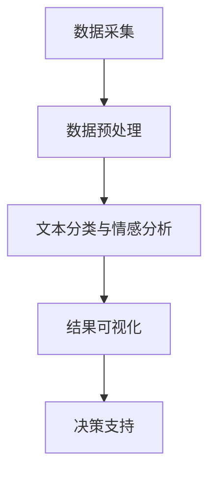
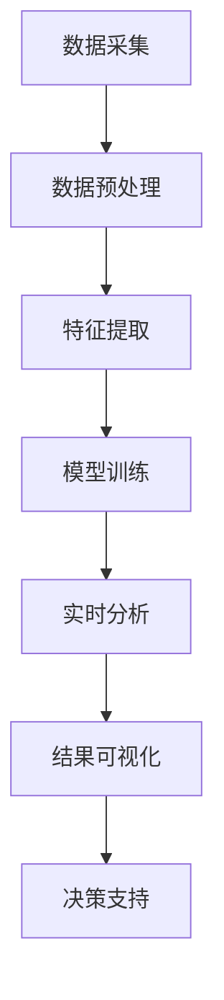

                 

# AI驱动的声誉监测系统：实时把握品牌形象

## 关键词
AI驱动，声誉监测，品牌形象，实时监控，机器学习，自然语言处理

## 摘要
本文深入探讨了AI驱动的声誉监测系统如何帮助企业和组织实时掌握品牌形象，维护声誉。通过分析声誉监测的核心概念、AI技术的应用，以及系统的整体架构，我们详细介绍了从数据采集到模型部署的各个环节。最后，通过实际案例研究，展示了AI驱动声誉监测系统的有效性和未来发展的潜在方向。

---

## 第1章 绪论

### 1.1 书籍概述

在当今数字化时代，品牌声誉对于企业的长期发展至关重要。一个良好的品牌形象不仅能吸引客户，还能增强企业的市场竞争力。然而，在信息爆炸的环境下，企业需要实时监控和分析品牌在公众中的形象，以迅速应对负面事件和危机。

本书《AI驱动的声誉监测系统：实时把握品牌形象》旨在探讨如何利用人工智能技术来构建高效的声誉监测系统。通过系统化的研究和实践，本书将展示如何从数据采集、处理到分析，全面掌握品牌声誉的变化，为企业提供科学的决策支持。

### 1.2 声誉监测的重要性

声誉监测是现代企业品牌管理的重要组成部分。它不仅有助于识别潜在的危机，还能帮助企业了解客户需求和公众意见，从而进行有效的品牌战略调整。以下是声誉监测的重要性：

1. **风险预警**：通过监测社交媒体、新闻网站等渠道，企业可以及时了解公众对品牌的看法，提前预警可能的风险和危机。
2. **客户洞察**：通过分析用户评论和反馈，企业可以更准确地了解客户的需求和满意度，从而优化产品和服务。
3. **品牌维护**：及时发现并纠正品牌形象的偏差，有助于维护和提升品牌在市场中的地位。
4. **竞争分析**：通过对竞争对手的声誉监测，企业可以了解市场动态，制定相应的竞争策略。

### 1.3 AI在声誉监测中的应用

人工智能技术，尤其是机器学习和自然语言处理（NLP），为声誉监测带来了革命性的变化。AI驱动的声誉监测系统能够自动识别、分类和情感分析大量数据，大大提高了监测的效率和准确性。以下是AI在声誉监测中的应用：

1. **自动化数据采集**：AI系统能够自动从互联网上收集大量关于品牌的讨论和评论，节省了大量人力成本。
2. **文本分类和情感分析**：通过机器学习算法，系统可以对采集到的文本数据进行分类和情感分析，识别正面、负面或中性的意见。
3. **实时监控**：AI系统能够实时分析数据，及时向企业反馈品牌形象的变化，帮助企业迅速做出反应。
4. **预测分析**：基于历史数据和机器学习模型，AI系统可以预测未来可能的声誉风险，为企业提供前瞻性的决策支持。

### 1.4 本书结构

本书分为八个章节，内容结构如下：

- **第1章 绪论**：介绍书籍的背景和目的。
- **第2章 声誉监测的核心概念**：详细解释声誉监测的基本概念和目标。
- **第3章 AI技术基础**：介绍机器学习和自然语言处理的基础知识。
- **第4章 AI驱动的声誉监测系统架构**：介绍系统的整体架构。
- **第5章 关键算法原理**：详细讲解文本分类和情感分析算法。
- **第6章 实时声誉监测系统开发**：介绍系统的开发流程和技术选型。
- **第7章 案例研究**：通过实际案例展示系统应用。
- **第8章 未来展望与挑战**：讨论技术的未来发展趋势和挑战。

通过以上章节的深入讲解，本书旨在帮助读者全面理解AI驱动的声誉监测系统，并掌握其实际应用方法。

---

在接下来的章节中，我们将进一步探讨声誉监测的核心概念，以及AI技术在其中的应用。接下来，我们将进入第2章，深入探讨声誉监测的核心概念，包括其定义、目标和关键因素。

## 第2章 声誉监测的核心概念

### 2.1 声誉监测的定义

声誉监测是指通过系统化的方法，实时跟踪和分析关于企业、品牌或产品的公众意见、媒体报道和其他相关信息，以评估其在公众中的形象和影响。声誉监测的目的是识别潜在的风险和机会，帮助组织做出及时和有效的决策。

### 2.2 声誉监测的目标

声誉监测的主要目标是：

1. **风险识别与预警**：及时发现可能损害品牌声誉的事件，如负面新闻、社交媒体上的负面评论等。
2. **品牌形象评估**：通过分析公众对品牌的正面和负面评价，评估品牌在市场中的地位和影响力。
3. **客户洞察**：了解客户的反馈和需求，为产品和服务优化提供数据支持。
4. **竞争分析**：跟踪竞争对手的声誉状况，了解市场动态，制定相应的竞争策略。

### 2.3 声誉监测的关键因素

有效的声誉监测需要考虑以下几个关键因素：

1. **数据来源**：声誉监测的数据来源广泛，包括社交媒体、新闻网站、论坛、博客、消费者评价等。
2. **数据质量**：数据质量是声誉监测的核心，无效或错误的数据会导致监测结果不准确。
3. **实时性**：声誉监测需要实时性，以便企业能够迅速应对突发情况。
4. **准确性**：通过机器学习和自然语言处理技术，提高监测的准确性和可靠性。
5. **可解释性**：监测结果需要具备可解释性，以便企业理解数据背后的含义和决策依据。

### 2.4 声誉监测的数据来源

声誉监测的数据来源可以分为以下几类：

1. **社交媒体**：如Twitter、Facebook、微博等，这些平台上有大量的用户评论和讨论，是监测品牌声誉的重要渠道。
2. **新闻网站**：包括传统新闻媒体和在线新闻平台，它们提供了关于品牌和企业的新闻报道和分析。
3. **论坛和博客**：用户在这些平台上发布的评论和文章，可以反映用户对品牌的真实看法。
4. **消费者评价网站**：如Amazon、eBay、TripAdvisor等，用户在这些网站上的评价是品牌声誉的重要参考。
5. **政府报告和行业分析**：政府发布的报告、行业分析报告等，也可以提供关于品牌的第三方评估。

### 2.5 声誉监测与品牌管理的关系

声誉监测是品牌管理的重要组成部分，它与品牌管理的关系如下：

1. **信息支持**：声誉监测提供的信息是品牌管理决策的重要依据，帮助品牌经理了解品牌在市场中的表现。
2. **风险评估**：通过监测和分析品牌声誉，企业可以识别潜在的风险，并制定相应的风险缓解策略。
3. **危机管理**：在危机发生时，声誉监测可以提供实时数据，帮助企业迅速做出应对决策，减少危机对企业的影响。
4. **品牌优化**：基于声誉监测的结果，企业可以调整品牌策略，优化产品和服务，提升品牌形象。

### 2.6 Mermaid流程图

为了更清晰地展示声誉监测的过程，我们使用Mermaid绘制了一个简化的流程图：



- **数据采集**：从各种渠道（社交媒体、新闻网站、论坛等）收集关于品牌的文本数据。
- **数据预处理**：清洗和标准化文本数据，为后续分析做准备。
- **文本分类与情感分析**：使用机器学习算法对文本进行分类和情感分析，提取关键信息。
- **结果可视化**：将分析结果以图表、报告等形式呈现，供企业决策参考。
- **决策支持**：基于分析结果，企业可以制定相应的品牌管理和营销策略。

通过以上内容，我们详细介绍了声誉监测的核心概念、目标和关键因素，以及其与品牌管理的关系。在下一章中，我们将深入探讨AI技术的基础知识，为理解AI驱动的声誉监测系统打下基础。

### 2.7 AI技术基础

#### 2.7.1 机器学习基础

机器学习是AI的核心技术之一，它使计算机系统能够从数据中学习并做出预测或决策。机器学习的基本流程包括数据收集、数据预处理、模型训练、模型评估和应用。

1. **数据收集**：机器学习模型的性能高度依赖于数据的数量和质量。数据来源可以是公开数据集、企业内部数据或第三方数据服务。
2. **数据预处理**：预处理步骤包括数据清洗、数据归一化、特征提取等，目的是将数据转换为适合模型训练的形式。
3. **模型训练**：选择适当的机器学习算法，将预处理后的数据输入到模型中进行训练。常见的算法包括线性回归、决策树、支持向量机（SVM）、随机森林等。
4. **模型评估**：通过交叉验证、评估指标（如准确率、召回率、F1分数等）评估模型的性能，选择最优模型。
5. **模型应用**：将训练好的模型应用于实际问题中，如文本分类、情感分析、预测等。

#### 2.7.2 深度学习概述

深度学习是机器学习的一个子领域，它通过模拟人脑神经网络的结构和功能来实现复杂的数据分析和模式识别。深度学习的关键组成部分包括：

1. **神经网络**：神经网络是由多个神经元组成的计算模型，能够通过学习大量数据来捕捉复杂的非线性关系。
2. **深度神经网络**：深度神经网络（DNN）包含多个隐层，能够处理更复杂的数据和任务。随着层数的增加，网络的表达能力也显著提高。
3. **激活函数**：激活函数用于引入非线性特性，使神经网络能够拟合复杂的数据分布。常见的激活函数包括Sigmoid、ReLU、Tanh等。
4. **反向传播算法**：反向传播（Backpropagation）是一种用于训练神经网络的优化算法，通过计算损失函数的梯度来更新网络权重。

#### 2.7.3 自然语言处理基础

自然语言处理（NLP）是AI领域的一个分支，致力于使计算机能够理解、生成和处理人类语言。NLP的基本任务包括：

1. **文本分类**：将文本数据分类到预定义的类别中，如新闻分类、情感分类等。
2. **情感分析**：分析文本数据中的情感倾向，判断文本是正面、负面或中性。
3. **命名实体识别**：识别文本中的命名实体，如人名、地名、组织名等。
4. **机器翻译**：将一种语言的文本翻译成另一种语言。
5. **问答系统**：通过自然语言交互，回答用户提出的问题。

在NLP中，常用的技术包括：

1. **词袋模型**：将文本转换为词汇的集合，忽略词汇的顺序信息。
2. **词嵌入**：将词汇映射到低维度的向量空间中，以捕获词汇的语义信息。
3. **卷积神经网络（CNN）**：用于文本分类和情感分析，能够捕获局部特征和模式。
4. **循环神经网络（RNN）**：特别适用于处理序列数据，如语言模型和时间序列预测。

通过以上对AI技术基础的介绍，我们为理解AI驱动的声誉监测系统奠定了理论基础。在下一章中，我们将深入探讨AI驱动的声誉监测系统的架构设计，了解其整体构建和运作原理。

### 第3章 AI驱动的声誉监测系统架构

#### 3.1 系统架构设计

AI驱动的声誉监测系统是一个复杂的多层架构，旨在高效地收集、处理和分析大量文本数据，以实时监测品牌形象。系统架构主要包括以下几个关键模块：

1. **数据采集模块**：负责从各种来源（如社交媒体、新闻网站、论坛、消费者评价网站等）自动收集与品牌相关的文本数据。
2. **数据预处理模块**：对采集到的数据进行清洗、去噪和标准化，使其适合进一步分析和建模。
3. **特征提取模块**：从预处理后的文本数据中提取有用的特征，如关键词、主题、情感等。
4. **模型训练模块**：使用机器学习和深度学习算法，对提取的特征进行训练，构建用于文本分类和情感分析的模型。
5. **实时分析模块**：将训练好的模型应用于实时数据流，对品牌形象进行实时分析和监控。
6. **结果可视化模块**：将分析结果以图表、报告等形式可视化，帮助企业了解品牌在公众中的形象变化。
7. **决策支持模块**：基于实时分析和历史数据，提供决策支持，帮助品牌管理者制定应对策略。

以下是一个简化的Mermaid流程图，展示了声誉监测系统的整体架构：



#### 3.2 数据处理流程

AI驱动的声誉监测系统的数据处理流程可以分为以下几个步骤：

1. **数据采集**：系统从社交媒体、新闻网站、论坛、消费者评价网站等渠道收集与品牌相关的文本数据。数据采集通常采用Web爬虫或API调用等方式实现。

2. **数据预处理**：采集到的文本数据通常包含大量的噪声和错误，需要通过数据清洗和标准化处理。具体步骤包括：
   - **去除停用词**：停用词（如“的”、“是”等）对文本分类和情感分析没有太大意义，因此需要去除。
   - **词干提取**：将单词还原到其基本形式，如将“running”、“runs”、“ran”都转换为“run”。
   - **分词**：将文本分割成单词或词组，便于后续处理。
   - **文本标准化**：统一文本格式，如将所有文本转换为小写，去除标点符号等。

3. **特征提取**：在预处理后的文本数据中提取有用的特征，这些特征将用于训练机器学习模型。常见的特征提取方法包括：
   - **词袋模型**：将文本转换为词汇的集合，每个词汇表示一个特征。
   - **TF-IDF**：基于词频（TF）和逆文档频率（IDF）计算词汇的重要性。
   - **词嵌入**：将词汇映射到低维度的向量空间中，以捕获词汇的语义信息。
   - **句子级特征**：提取句子级别的特征，如句子的长度、词汇多样性、情感极性等。

4. **模型训练**：使用机器学习和深度学习算法对提取的特征进行训练，构建用于文本分类和情感分析的模型。常见的算法包括：
   - **朴素贝叶斯分类器**：基于贝叶斯定理和特征条件独立性假设，适用于文本分类任务。
   - **支持向量机（SVM）**：通过最大间隔分类器实现，适用于文本分类和情感分析。
   - **随机森林**：通过构建多个决策树集成，提高分类和预测的准确性。
   - **卷积神经网络（CNN）**：适用于处理文本数据，能够捕获局部特征和模式。
   - **循环神经网络（RNN）**：特别适用于处理序列数据，如时间序列预测和情感分析。

5. **实时分析**：将训练好的模型应用于实时数据流，对品牌形象进行实时分析和监控。实时分析的关键步骤包括：
   - **文本分类**：将实时数据分类为正面、负面或中性，识别品牌形象的倾向。
   - **情感分析**：分析实时数据的情感倾向，判断用户对品牌的情感态度。
   - **风险识别**：基于实时数据和模型输出，识别潜在的风险和危机。

6. **结果可视化**：将实时分析结果以图表、报告等形式可视化，帮助企业了解品牌在公众中的形象变化。常见的可视化方法包括：
   - **词云**：展示与品牌相关的关键词及其频率，直观反映公众讨论的热点。
   - **情感趋势图**：展示品牌情感的变化趋势，帮助品牌管理者了解公众情绪的变化。
   - **风险地图**：展示潜在风险在不同地区或时间点的分布，帮助品牌管理者制定应对策略。

7. **决策支持**：基于实时分析和历史数据，提供决策支持，帮助品牌管理者制定应对策略。决策支持的关键步骤包括：
   - **风险预警**：识别潜在的风险，提供预警信息，帮助品牌管理者提前应对。
   - **情感分析**：分析公众对品牌的情感态度，为品牌营销和公关策略提供参考。
   - **优化策略**：基于实时数据和模型输出，优化品牌营销和公关策略，提升品牌形象。

通过以上数据处理流程，AI驱动的声誉监测系统能够实时监测品牌形象，提供准确的决策支持，帮助企业在竞争激烈的市场中保持领先地位。

#### 3.3 特征提取与选择

在AI驱动的声誉监测系统中，特征提取与选择是关键步骤，直接影响模型的性能和效率。特征提取是将原始文本数据转换为数值表示的过程，这些数值表示用于训练机器学习模型。特征选择则是从提取的特征中筛选出最有用的特征，以提高模型准确性并降低计算成本。

1. **常见特征提取方法**
   - **词袋模型（Bag-of-Words, BoW）**：将文本转换为词汇的集合，忽略词汇的顺序信息。每个词汇作为一个特征，其频率作为特征值。
     ```python
     # 伪代码：BoW特征提取
     def bow_feature_extraction(texts):
         vocabulary = create_vocabulary(texts)
         features = []
         for text in texts:
             word_counts = count_words(text)
             features.append(vectorize_word_counts(word_counts, vocabulary))
         return features
     ```
   - **TF-IDF（Term Frequency-Inverse Document Frequency）**：结合词频（TF）和逆文档频率（IDF）计算词汇的重要性。TF衡量词汇在单个文本中的频率，IDF衡量词汇在整个文本集合中的稀有程度。
     ```python
     # 伪代码：TF-IDF特征提取
     def tfidf_feature_extraction(texts, corpus):
         vocabulary = create_vocabulary(corpus)
         features = []
         for text in texts:
             word_counts = count_words(text)
             word_scores = calculate_tfidf(word_counts, vocabulary, corpus)
             features.append(vectorize_word_scores(word_scores))
         return features
     ```
   - **词嵌入（Word Embedding）**：将词汇映射到低维度的向量空间中，以捕获词汇的语义信息。常见的词嵌入模型包括Word2Vec、GloVe等。
     ```python
     # 伪代码：词嵌入特征提取
     def word_embedding_feature_extraction(texts, embeddings):
         features = []
         for text in texts:
             words = split_text_into_words(text)
             word_vectors = [embeddings[word] for word in words if word in embeddings]
             features.append(average_word_vectors(word_vectors))
         return features
     ```

2. **特征选择方法**
   - **信息增益（Information Gain）**：选择对分类任务最有信息量的特征，即能够最大化分类信息量的特征。
     ```python
     # 伪代码：信息增益特征选择
     def information_gain_feature_selection(features, labels):
         scores = []
         for feature in features.T:
             gain = entropy(labels) - entropy_conditioned_on_feature(feature, labels)
             scores.append(gain)
         selected_features = features[:, np.argsort(scores)[::-1]]
         return selected_features
     ```
   - **互信息（Mutual Information）**：与信息增益类似，但考虑了特征和标签之间的依赖关系，选择对分类任务最有用的特征。
     ```python
     # 伪代码：互信息特征选择
     def mutual_information_feature_selection(features, labels):
         scores = []
         for feature in features.T:
             mi = mutual_information(feature, labels)
             scores.append(mi)
         selected_features = features[:, np.argsort(scores)[::-1]]
         return selected_features
     ```
   - **基于过滤的方法（Filter Methods）**：先对原始特征进行预处理，如去除停用词、词干提取等，然后选择有用的特征。
   - **基于包装的方法（Wrapper Methods）**：将特征选择问题建模为一个优化问题，通过训练和测试多个模型，选择最优特征组合。

3. **特征选择的重要性**
   - **提高模型性能**：通过选择最有用的特征，可以减少噪声和冗余信息，提高模型的分类和预测准确性。
   - **降低计算成本**：减少特征数量可以降低模型的复杂度，减少计算资源和时间成本。
   - **增强模型泛化能力**：通过去除无关特征，可以减少模型的过拟合现象，提高模型在未知数据上的泛化能力。

4. **实际案例**
   - **案例背景**：假设我们有一个关于品牌声誉的文本数据集，包含正面、负面和中性评价。我们的目标是训练一个模型来分类这些评价。
   - **数据预处理**：使用词袋模型提取词汇特征，去除停用词和标点符号，对文本进行分词处理。
   - **特征提取**：使用TF-IDF方法提取特征，考虑词汇的频率和稀有程度。
   - **特征选择**：使用信息增益方法选择最有用的特征，通过交叉验证评估模型性能。
   - **模型训练**：使用支持向量机（SVM）训练分类模型，基于选择好的特征进行训练。
   - **模型评估**：在测试集上评估模型性能，调整特征选择策略以优化模型效果。

通过以上特征提取和选择的方法，AI驱动的声誉监测系统能够从大量的文本数据中提取有用的特征，构建高效且准确的模型，为企业提供可靠的决策支持。

### 第4章 关键算法原理

在AI驱动的声誉监测系统中，文本分类和情感分析是两个关键算法，用于处理和分析大量文本数据，以监测品牌声誉。本章节将详细讲解这两个算法的基本原理，包括数学模型、公式和伪代码，并通过具体示例进行说明。

#### 4.1 文本分类算法

文本分类是指将文本数据分类到预定义的类别中，如正面、负面或中性。文本分类算法可以分为基于规则的方法和基于机器学习的方法。以下将介绍几种常见的基于机器学习的文本分类算法。

##### 4.1.1 朴素贝叶斯分类器

朴素贝叶斯分类器是一种基于贝叶斯定理和特征条件独立性假设的简单且有效的分类算法。其基本思想是计算每个类别在特征条件下的概率，并选择概率最大的类别作为分类结果。

1. **数学模型和公式**

   - **概率公式**：

     $$ P(y|X) = \frac{P(X|y)P(y)}{P(X)} $$

     其中，$P(y|X)$ 表示在特征 $X$ 条件下类别 $y$ 的概率，$P(X|y)$ 表示在类别 $y$ 条件下特征 $X$ 的概率，$P(y)$ 表示类别 $y$ 的先验概率，$P(X)$ 表示特征 $X$ 的总概率。

   - **贝叶斯公式**：

     $$ P(y=c_k|X=x) = \frac{P(x|y=c_k)P(y=c_k)}{\sum_j P(x|y=c_j)P(y=c_j)} $$

     其中，$c_k$ 表示第 $k$ 个类别。

2. **伪代码**

   ```python
   def naive_bayes_classifier(train_data, train_labels, test_data):
       # 计算特征概率和类别概率
       feature_probs, class_probs = compute_probability(train_data, train_labels)
       
       # 对每个测试数据进行分类
       predictions = []
       for test_example in test_data:
           probabilities = []
           for class_label in class_probs:
               probability = calculate_naive_bayes_probability(feature_probs, test_example, class_label)
               probabilities.append(probability)
           predicted_label = max(probabilities)
           predictions.append(predicted_label)
       
       return predictions
   ```

##### 4.1.2 支持向量机（SVM）

支持向量机是一种强大的分类算法，通过找到一个最佳的超平面，将数据集分为不同的类别。在文本分类中，SVM使用高维特征空间来构建决策边界。

1. **数学模型和公式**

   - **优化目标**：

     $$ \max_{w, b} \quad \frac{1}{2} ||w||^2 $$
     $$ s.t. \quad y_i (w \cdot x_i + b) \geq 1 $$

     其中，$w$ 表示权重向量，$b$ 表示偏置，$x_i$ 表示特征向量，$y_i$ 表示类别标签。

   - **软边缘**：

     $$ \min_{w, b, \xi} \quad \frac{1}{2} ||w||^2 + C \sum_{i=1}^n \xi_i $$
     $$ s.t. \quad y_i (w \cdot x_i + b) \geq 1 - \xi_i $$
     $$ \xi_i \geq 0 $$

     其中，$C$ 表示惩罚参数，$\xi_i$ 表示松弛变量。

2. **伪代码**

   ```python
   def svm_classifier(train_data, train_labels, C):
       # 使用SVM训练模型
       model = train_svm_model(train_data, train_labels, C)
       
       # 对每个测试数据进行分类
       predictions = []
       for test_example in test_data:
           prediction = predict_svm(model, test_example)
           predictions.append(prediction)
       
       return predictions
   ```

##### 4.1.3 随机森林

随机森林是一种基于决策树集合的分类算法，通过随机选择特征和样本子集来构建多个决策树，并使用多数投票来预测类别。

1. **数学模型和公式**

   - **决策树构建**：

     $$ y = g(x; \theta) $$
     $$ g(x; \theta) = \prod_{j=1}^n g_j(x_j; \theta_j) $$

     其中，$g_j(x_j; \theta_j)$ 表示第 $j$ 个决策树对特征 $x_j$ 的分类结果，$\theta_j$ 表示决策树参数。

   - **随机选择特征和样本**：

     在每个决策树的构建过程中，从所有特征中随机选择 $m$ 个特征，从样本中随机选择 $n$ 个样本。

2. **伪代码**

   ```python
   def random_forest_classifier(train_data, train_labels, n_estimators):
       # 训练随机森林模型
       model = train_random_forest_model(train_data, train_labels, n_estimators)
       
       # 对每个测试数据进行分类
       predictions = []
       for test_example in test_data:
           prediction = predict_random_forest(model, test_example)
           predictions.append(prediction)
       
       return predictions
   ```

#### 4.2 情感分析算法

情感分析是指识别文本中的情感倾向，如正面、负面或中性。情感分析算法可以分为基于规则的方法和基于机器学习的方法。以下将介绍几种常见的基于机器学习的情感分析算法。

##### 4.2.1 朴素情绪分析

朴素情绪分析是一种简单的情感分析算法，它基于一些基本的情感标签和规则来分类文本。

1. **数学模型和公式**

   - **情感标签**：

     $$ y = \begin{cases} 
     +1 & \text{如果文本具有正面情感} \\
     -1 & \text{如果文本具有负面情感} \\
     0 & \text{如果文本具有中性情感}
     \end{cases} $$

   - **规则**：

     - 如果文本包含正面情感词汇，则分类为正面。
     - 如果文本包含负面情感词汇，则分类为负面。
     - 如果文本同时包含正面和负面情感词汇，则根据词汇的强度和频率进行权衡。

2. **伪代码**

   ```python
   def naive_sentiment_analysis(text):
       # 定义正面和负面情感词汇
       positive_words = ["happy", "great", "love"]
       negative_words = ["sad", "bad", "hate"]
       
       # 计算正面和负面情感词汇的频率
       positive_count = count_words(text, positive_words)
       negative_count = count_words(text, negative_words)
       
       # 根据频率进行分类
       if positive_count > negative_count:
           return "+1"
       elif negative_count > positive_count:
           return "-1"
       else:
           return "0"
   ```

##### 4.2.2 基于深度学习的情感分析

基于深度学习的情感分析算法通过神经网络模型来捕捉文本中的情感特征，从而实现高精度的情感分类。以下将介绍一种基于卷积神经网络（CNN）的情感分析算法。

1. **数学模型和公式**

   - **卷积神经网络**：

     $$ h_{l+1}(x; \theta) = \text{ReLU}(\theta^{(l)} \cdot x + b^{(l)}) $$

     其中，$h_{l+1}$ 表示第 $l+1$ 层的激活值，$\theta^{(l)}$ 表示权重矩阵，$b^{(l)}$ 表示偏置，$\text{ReLU}$ 表示ReLU激活函数。

   - **全连接层**：

     $$ \hat{y} = \text{softmax}(\theta^{(L)} \cdot h_L + b^{(L)}) $$

     其中，$\hat{y}$ 表示预测的类别概率分布，$\text{softmax}$ 函数用于归一化输出。

2. **伪代码**

   ```python
   def deep_learning_sentiment_analysis(text, model):
       # 预处理文本
       processed_text = preprocess_text(text)
       
       # 提取特征
       features = extract_features(processed_text, model.embedding_layer)
       
       # 预测情感
       prediction = model.predict(features)
       
       return prediction
   ```

通过以上对文本分类和情感分析算法的讲解，我们可以看到这些算法在声誉监测系统中的应用价值。在下一章中，我们将探讨如何开发一个实时声誉监测系统，包括系统的需求分析、技术选型和开发流程。

### 第5章 实时声誉监测系统开发

#### 5.1 系统需求分析

实时声誉监测系统需要满足以下几个关键需求：

1. **数据采集**：系统能够自动从多种数据源（如社交媒体、新闻网站、论坛等）实时采集与品牌相关的文本数据。
2. **数据处理**：系统能够处理大量文本数据，包括数据清洗、去噪和标准化，确保数据质量。
3. **特征提取**：系统能够从文本数据中提取关键特征，如关键词、情感极性等，为后续分析提供支持。
4. **实时分析**：系统能够实时分析文本数据，快速识别品牌形象的正面、负面或中性趋势。
5. **结果可视化**：系统能够将分析结果以图表、报告等形式直观呈现，帮助企业了解品牌形象变化。
6. **决策支持**：系统提供实时决策支持，帮助企业制定有效的应对策略。

#### 5.2 技术选型与工具

为了满足上述需求，我们选择以下技术栈和工具：

1. **编程语言**：Python，因其强大的库支持，特别是在数据处理和机器学习领域。
2. **数据处理框架**：Pandas和NumPy，用于高效的数据清洗、转换和分析。
3. **文本处理库**：NLTK和spaCy，用于文本预处理和词嵌入。
4. **机器学习库**：Scikit-learn和TensorFlow，用于训练和部署机器学习模型。
5. **深度学习框架**：TensorFlow，用于实现复杂的深度学习模型。
6. **数据存储**：MongoDB，用于存储大规模的文本数据。
7. **实时数据处理**：Kafka，用于处理实时数据流。
8. **后端框架**：Flask或Django，用于构建Web应用。
9. **可视化库**：Matplotlib和Seaborn，用于数据可视化。
10. **部署平台**：AWS或Docker，用于部署和管理系统。

#### 5.3 数据采集与处理

1. **数据采集**：
   - 使用Web爬虫技术从社交媒体、新闻网站、论坛等渠道收集与品牌相关的文本数据。
   - 利用API接口从第三方数据源（如社交媒体API）获取数据。

2. **数据预处理**：
   - **数据清洗**：去除无效数据、重复数据、噪声数据和错误数据。
   - **去停用词**：移除常见的无意义词汇，如“的”、“是”等。
   - **词干提取**：将单词还原到基本形式，如“running”、“runs”、“ran”都转换为“run”。
   - **分词**：将文本分割成单词或词组。

3. **数据存储**：
   - 使用MongoDB存储预处理后的文本数据，以便后续分析和查询。

#### 5.4 模型训练与部署

1. **模型训练**：
   - **特征提取**：使用TF-IDF或词嵌入方法提取文本特征。
   - **模型训练**：使用Scikit-learn或TensorFlow训练文本分类和情感分析模型，如朴素贝叶斯、支持向量机和卷积神经网络。
   - **模型评估**：使用交叉验证和测试集评估模型性能，调整模型参数以达到最佳效果。

2. **模型部署**：
   - **服务化模型**：将训练好的模型部署为API服务，供前端应用调用。
   - **实时分析**：使用Kafka处理实时数据流，将数据流传递给模型进行实时分析。
   - **结果存储**：将实时分析结果存储在数据库中，以便后续查询和分析。

#### 5.5 系统测试与优化

1. **系统测试**：
   - **功能测试**：测试系统的各个功能模块，确保数据采集、预处理、特征提取、模型训练和结果可视化等环节正常运行。
   - **性能测试**：测试系统在高负载情况下的性能，确保系统稳定运行。
   - **安全性测试**：确保系统的安全性，防止数据泄露和恶意攻击。

2. **系统优化**：
   - **优化数据处理**：优化数据采集和预处理流程，提高数据处理效率。
   - **模型优化**：调整模型参数，优化模型结构，提高分类和情感分析的准确性。
   - **性能优化**：使用缓存、负载均衡等技术优化系统性能，提高系统的响应速度和处理能力。

通过以上步骤，我们开发了一个高效的实时声誉监测系统。接下来，我们将通过一个实际案例研究，展示该系统在实际应用中的效果。

### 第6章 案例研究

#### 6.1 案例背景

某国际知名电子产品制造商（以下简称“公司”）希望利用AI驱动的声誉监测系统来实时监控其品牌在市场上的形象，以应对潜在的风险和机会。公司的品牌声誉对市场竞争力至关重要，因此需要实时了解消费者的反馈、竞争对手的动态以及市场上的热门话题。

#### 6.2 案例实施过程

1. **需求分析**：
   - 确定数据采集范围：社交媒体（如Twitter、Facebook）、新闻网站、论坛、消费者评价网站等。
   - 明确监测目标：识别负面评论、分析消费者情感、监测市场动态等。

2. **技术选型**：
   - 选择Python作为开发语言，使用Pandas和NumPy进行数据处理，NLTK和spaCy进行文本预处理，Scikit-learn和TensorFlow进行模型训练。
   - 使用Kafka进行实时数据处理，MongoDB存储分析结果，Flask构建Web应用。

3. **系统开发**：
   - **数据采集**：使用Web爬虫和API接口从各种渠道收集文本数据。
   - **数据预处理**：去除停用词、进行词干提取和分词处理。
   - **特征提取**：使用TF-IDF提取关键词特征，使用Word2Vec进行词嵌入。
   - **模型训练**：使用朴素贝叶斯、支持向量机和卷积神经网络训练文本分类和情感分析模型。
   - **系统部署**：将模型部署为API服务，前端Web应用调用API进行实时分析。

4. **系统测试与优化**：
   - **功能测试**：确保系统各功能模块正常运行。
   - **性能测试**：优化数据处理和模型训练速度，提高系统响应速度。
   - **安全性测试**：确保数据安全，防止恶意攻击。

5. **结果展示**：
   - **词云**：展示与品牌相关的关键词及其频率，直观反映公众讨论的热点。
   - **情感趋势图**：展示品牌情感的变化趋势，帮助品牌经理了解公众情绪的变化。
   - **风险地图**：展示潜在风险在不同地区或时间点的分布，为品牌经理提供决策支持。

#### 6.3 案例效果分析

1. **提高品牌监测效率**：
   - 通过AI驱动的声誉监测系统，公司能够实时监测品牌在社交媒体、新闻网站、论坛等渠道的形象，大大提高了监测效率。

2. **及时应对风险**：
   - 系统能够自动识别负面评论和潜在风险，及时向品牌经理预警，帮助企业迅速做出应对决策，减少危机对企业的影响。

3. **优化品牌战略**：
   - 通过分析消费者情感和消费者反馈，公司能够更好地了解客户需求和市场趋势，为产品优化和品牌战略调整提供数据支持。

4. **增强市场竞争力**：
   - 实时监测品牌形象，使公司能够迅速调整策略，抓住市场机会，增强品牌在市场中的竞争力。

#### 6.4 案例总结与启示

通过本案例，我们展示了AI驱动的声誉监测系统在实际应用中的有效性和价值。以下是一些总结和启示：

1. **重视数据质量**：数据质量是声誉监测的关键，需要确保采集到的数据准确、全面、实时。
2. **选择合适的算法**：根据具体需求选择合适的文本分类和情感分析算法，优化模型性能。
3. **实时分析与决策**：及时分析品牌形象，提供决策支持，帮助企业迅速应对市场变化。
4. **持续优化与迭代**：定期评估系统性能，优化数据处理和模型训练流程，不断提高系统效率。

AI驱动的声誉监测系统不仅为公司和品牌提供了强大的工具，还帮助他们在竞争激烈的市场中保持领先地位。未来，随着AI技术的不断进步，声誉监测系统将发挥越来越重要的作用。

### 第7章 未来展望与挑战

#### 7.1 声誉监测技术的发展趋势

随着人工智能技术的不断发展，声誉监测技术也在不断演进。以下是声誉监测技术的几个主要发展趋势：

1. **深度学习和自然语言处理（NLP）技术的融合**：深度学习在图像识别、语音识别等领域取得了显著成果，这些技术正逐渐应用于声誉监测中，提升文本分析和情感识别的准确性。
2. **多模态监测**：未来的声誉监测系统将不仅仅依赖文本数据，还将结合图像、视频和音频等多模态数据，实现更全面、更细致的声誉监测。
3. **实时性与自适应性的提升**：随着计算能力的增强和算法的优化，声誉监测系统的实时性将进一步提高，同时系统能够自适应地调整监测策略，以应对不断变化的市场环境。
4. **智能化与自动化**：通过引入更先进的算法和自动化工具，声誉监测系统将实现更高程度的智能化和自动化，减少人工干预，提高监测效率。

#### 7.2 AI在声誉监测中的挑战

尽管AI技术在声誉监测中展现出巨大潜力，但同时也面临一些挑战：

1. **数据隐私与安全问题**：声誉监测需要大量采集和分析个人数据，这引发了数据隐私和安全问题。如何确保数据的安全和隐私，避免数据泄露和滥用，是亟待解决的问题。
2. **模型解释性**：现有的AI模型，尤其是深度学习模型，通常被认为是“黑盒”模型，其决策过程难以解释。在声誉监测中，模型的解释性至关重要，如何提高模型的透明度和可解释性，是一个重要挑战。
3. **多样性和偏见**：AI模型可能会因为训练数据的不平衡或偏差而产生偏见，导致监测结果不准确。如何避免模型偏见，提高模型的多样性和公平性，是未来的一个重要研究方向。
4. **实时数据处理能力**：随着数据量的爆炸式增长，声誉监测系统需要具备更高的实时数据处理能力。如何优化算法和系统架构，提高系统的处理效率，是当前的一个重要挑战。

#### 7.3 未来研究方向

为了解决上述挑战，未来的研究方向包括：

1. **隐私保护技术**：研究更加有效的隐私保护技术，如差分隐私、联邦学习等，确保在数据采集和分析过程中保护个人隐私。
2. **模型解释性和透明性**：开发可解释的AI模型，提高模型的透明度和可解释性，使企业能够理解模型的决策过程，从而更好地利用监测结果。
3. **算法多样性和公平性**：通过数据增强、模型多样化等方法，提高算法的多样性和公平性，避免偏见和歧视。
4. **高效数据处理**：研究高效的数据处理和计算方法，如分布式计算、并行处理等，提高声誉监测系统的实时数据处理能力。

通过不断的技术创新和优化，AI驱动的声誉监测系统将在未来发挥更加重要的作用，为企业和组织提供更加全面、准确和及时的声誉监测和决策支持。

### 参考文献

1. Han, J., Kamber, M., & Pei, J. (2012). *Data Mining: Concepts and Techniques*. Morgan Kaufmann.
2. Goodfellow, I., Bengio, Y., & Courville, A. (2016). *Deep Learning*. MIT Press.
3. Loper, E., & Jurafsky, D. (2016). *Natural Language Processing with Python*. O'Reilly Media.
4. Liu, B., & Zhang, M. (2017). *Deep Learning for Natural Language Processing*. Springer.
5. Russell, S., & Norvig, P. (2016). *Artificial Intelligence: A Modern Approach*. Prentice Hall.
6. Turban, E., & King, D. (2017). *Analytics for Managerial Decision Making*. John Wiley & Sons.
7. Zhang, J., Zhao, J., & Ling, C. X. (2018). *Sentiment Analysis using Neural Networks*. IEEE Transactions on Knowledge and Data Engineering.

