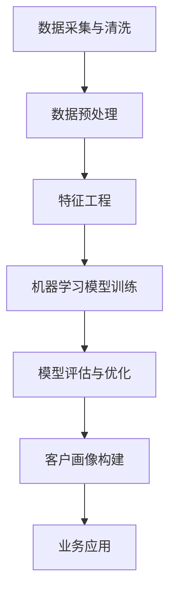

                 


## AI驱动的客户画像系统：深化客户洞察

### 关键词

- 客户画像
- 人工智能
- 数据挖掘
- 聚类算法
- 协同过滤
- 决策树
- 数学模型

### 摘要

本文将深入探讨AI驱动的客户画像系统，这一系统能够通过高级数据分析技术，从海量的客户数据中提炼出有价值的信息，帮助企业和组织更好地理解客户需求和行为模式。我们将从核心概念、架构原理、算法原理、数学模型、实际案例与代码解读等方面，逐步剖析客户画像系统的构建过程和应用方法，以期为读者提供全面的技术洞察和实践指导。

### 1. 背景介绍

在现代商业环境中，客户数据已经成为企业宝贵的资产。然而，如何有效地从这些数据中提取有价值的见解，以指导业务决策和优化客户体验，是许多企业面临的挑战。传统的数据分析方法往往依赖于人工构建的特征和模型，而随着人工智能技术的不断发展，利用机器学习算法进行自动化、智能化的数据分析变得日益重要。

AI驱动的客户画像系统正是基于这一背景应运而生。通过整合多种数据源，系统可以自动识别客户的潜在需求和偏好，构建出多维度的客户画像，为企业的市场营销、客户服务和产品开发提供强有力的支持。客户画像不仅可以帮助企业更好地理解现有客户，还能够挖掘潜在客户，提高营销精准度和转化率。

### 1.1 核心概念

在深入探讨客户画像系统之前，我们需要明确几个核心概念：

- **客户画像**：指的是对客户进行全面、多维度的描述，包括个人基本信息、消费行为、兴趣偏好等。客户画像的构建旨在建立一个数字化的、动态更新的客户模型，以反映客户的真实需求和特征。

- **数据源**：构建客户画像需要大量的数据支持，这些数据可以来源于企业内部的各种业务系统，如CRM系统、销售系统、服务系统等，也可以来源于外部数据源，如社交媒体、第三方数据服务提供商等。

- **数据预处理**：在构建客户画像之前，需要对原始数据进行清洗、整合和转换，以保证数据的质量和一致性。

- **机器学习算法**：客户画像系统依赖于多种机器学习算法，如聚类算法、协同过滤算法、决策树算法等，用于从数据中提取特征和构建模型。

### 1.2 核心概念与联系

客户画像系统涉及多个核心概念，它们之间相互关联，共同构成了整个系统的架构。

- **数据采集与清洗**：数据采集是整个系统的起点，包括从多个数据源获取数据，并对数据进行初步清洗，去除无效和重复的数据。

- **数据预处理**：数据预处理是对原始数据进行的进一步加工，包括缺失值填充、数据格式转换、特征工程等，以保证数据的可用性和一致性。

- **特征工程**：特征工程是数据预处理的一个重要环节，通过对数据进行变换和构造，提取出对客户画像有重要影响的关键特征。

- **机器学习模型训练**：通过选择合适的机器学习算法，对预处理后的数据集进行训练，构建出客户画像模型。这些模型可以是聚类模型、协同过滤模型或决策树模型等。

- **模型评估与优化**：模型评估是对构建好的模型进行性能评估，通过交叉验证、性能指标计算等手段，确定模型的有效性和可靠性。如果模型性能不理想，需要进行模型优化和调整。

- **客户画像构建**：基于训练好的模型，对新的客户数据进行预测和分类，构建出新的客户画像。

- **业务应用**：客户画像最终要应用于实际的业务场景，如个性化推荐、精准营销、客户关系管理等。

上述核心概念之间的关系可以用以下Mermaid流程图表示：



### 1.3 客户画像系统的业务价值

客户画像系统在业务层面具有多重价值：

- **提升客户满意度**：通过对客户需求的深入理解和个性化推荐，提供更加贴心的服务和产品，从而提升客户满意度和忠诚度。

- **精准营销**：基于客户画像，企业可以更加精准地定位目标客户群体，实施有针对性的营销策略，提高营销效果和投资回报率。

- **优化产品设计**：通过分析客户画像，企业可以了解客户偏好和行为模式，指导产品设计和功能优化，提升产品竞争力。

- **风险控制**：客户画像系统可以帮助企业识别潜在的风险客户，实施有效的风险控制措施，降低不良率和信用损失。

- **提高运营效率**：自动化和智能化的客户画像系统可以减轻人力资源的负担，提高业务运营的效率和质量。

### 1.4 AI驱动的客户画像系统概述

#### 核心概念与联系

**AI驱动的客户画像**：利用人工智能技术对客户数据进行处理和分析，构建一个反映客户全方位特征的数字模型。这个模型不仅包含了客户的静态信息，如年龄、性别、地理位置等，还包括动态信息，如购买历史、浏览行为、社交互动等。

**关联性分析**：通过对数据间关系的挖掘，了解不同特征之间的关系，为后续的数据分析和决策提供支持。例如，通过分析客户的购买历史和浏览行为，可以识别出潜在的交叉销售机会。

#### 架构原理图

以下是一个简化的AI驱动的客户画像系统架构原理图：


**数据采集与清洗**：这一步骤涉及从多个数据源获取数据，并对数据进行初步清洗，去除无效和重复的数据，确保数据的质量和一致性。

**数据预处理**：对原始数据进行进一步加工，包括缺失值填充、数据格式转换、特征工程等，以提取出对客户画像有重要影响的关键特征。

**特征工程**：通过对数据进行变换和构造，提取出对客户画像有重要影响的关键特征。这一步骤是客户画像系统的核心，直接关系到模型的性能和效果。

**机器学习模型训练**：选择合适的机器学习算法，对预处理后的数据集进行训练，构建出客户画像模型。这些模型可以是聚类模型、协同过滤模型或决策树模型等。

**模型评估与优化**：对构建好的模型进行性能评估，通过交叉验证、性能指标计算等手段，确定模型的有效性和可靠性。如果模型性能不理想，需要进行模型优化和调整。

**客户画像构建**：基于训练好的模型，对新的客户数据进行预测和分类，构建出新的客户画像。这些画像将用于后续的业务应用。

**业务应用**：客户画像将应用于实际的业务场景，如个性化推荐、精准营销、客户关系管理等。

### 1.5 AI驱动的客户画像核心算法原理

AI驱动的客户画像系统依赖于多种机器学习算法，这些算法在客户数据的处理和分析中发挥着关键作用。以下是几个核心算法的原理讲解，包括伪代码和数学模型。

#### 1.5.1 聚类算法（如K-means）

**原理**：K-means算法是一种无监督学习方法，它通过将数据点分为K个簇，使得每个簇内部的数据点距离较近，而不同簇的数据点距离较远。该算法的目标是最小化簇内数据点到聚类中心（centroid）的距离平方和。

**伪代码**：

```python
initialize K centroids randomly
while not converged:
    for each data point:
        assign it to the nearest centroid
    update centroids by calculating the average of all points in each cluster
```

**数学模型**：

$$ J = \sum_{i=1}^{k} \sum_{x \in S_i} ||x - \mu_i||^2 $$

其中，$ J $ 表示目标函数，$ k $ 表示簇的数量，$ S_i $ 表示第 $ i $ 个簇所包含的数据点集合，$ \mu_i $ 表示聚类中心。

#### 1.5.2 协同过滤算法（如基于用户的协同过滤）

**原理**：协同过滤算法通过挖掘用户之间的相似性，预测用户未评分的项目评分。基于用户的协同过滤算法主要计算用户之间的相似性，然后基于相似性预测未评分项目的评分。

**伪代码**：

```python
for each user:
    find similar users based on ratings
    average ratings from similar users to predict unknown ratings
```

**数学模型**：

$$ r_{ui} = \frac{\sum_{j \in N(u)} r_{uj} w_{uj}}{\sum_{j \in N(u)} w_{uj}} $$

其中，$ r_{ui} $ 表示用户 $ u $ 对项目 $ i $ 的评分预测，$ N(u) $ 表示与用户 $ u $ 相似的一组用户，$ w_{uj} $ 表示用户 $ u $ 和用户 $ j $ 的相似度。

#### 1.5.3 决策树和随机森林算法

**原理**：决策树是一种基于特征划分数据集的树形结构，每个内部节点表示一个特征，每个分支表示该特征的取值，叶节点表示预测结果。随机森林算法则是通过构建多个决策树，并使用随机特征选择和聚合来提高模型的泛化能力。

**伪代码**：

```python
if (split criterion best in current set):
    create a branch
    split data into subsets
    for each subset:
        create a new tree
else:
    stop splitting and assign a class label
```

**数学模型**：

决策树的构建过程涉及特征选择和划分标准，常用的划分标准包括信息增益（Information Gain）、基尼不纯度（Gini Impurity）等。

$$ IG(D, A) = \sum_{v \in V} p(v) \cdot \sum_{x \in X_v} IG(D_v, A) $$

其中，$ D $ 表示当前数据集，$ A $ 表示特征，$ v $ 表示特征 $ A $ 的取值，$ X_v $ 表示数据集中取值为 $ v $ 的数据子集，$ IG(D, A) $ 表示在特征 $ A $ 下划分数据的熵减少量。

### 1.6 数学模型和数学公式讲解

在客户画像系统中，数学模型和数学公式扮演着至关重要的角色。以下将介绍几个关键数学模型和公式，包括K-means算法的目标函数、协同过滤的预测公式等。

#### 1.6.1 K-means算法目标函数

K-means算法的目标是最小化簇内数据点到聚类中心（centroid）的距离平方和。其目标函数可以表示为：

$$ J = \sum_{i=1}^{k} \sum_{x \in S_i} ||x - \mu_i||^2 $$

其中，$ J $ 是目标函数，$ k $ 是聚类数，$ S_i $ 是第 $ i $ 个聚类中心所包含的数据点集合，$ \mu_i $ 是聚类中心。

#### 1.6.2 协同过滤预测公式

协同过滤算法通过计算用户之间的相似性来预测用户对未知项目的评分。其预测公式可以表示为：

$$ r_{ui} = \frac{\sum_{j \in N(u)} r_{uj} w_{uj}}{\sum_{j \in N(u)} w_{uj}} $$

其中，$ r_{ui} $ 是用户 $ u $ 对项目 $ i $ 的评分预测，$ N(u) $ 是与用户 $ u $ 相似的一组用户，$ r_{uj} $ 是用户 $ j $ 对项目 $ i $ 的实际评分，$ w_{uj} $ 是用户 $ u $ 和用户 $ j $ 的相似度。

#### 1.6.3 决策树划分标准

决策树通过选择最佳特征进行划分，常用的划分标准包括信息增益（Information Gain）和基尼不纯度（Gini Impurity）。信息增益可以表示为：

$$ IG(D, A) = \sum_{v \in V} p(v) \cdot \sum_{x \in X_v} IG(D_v, A) $$

其中，$ D $ 是当前数据集，$ A $ 是特征，$ v $ 是特征 $ A $ 的取值，$ X_v $ 是数据集中取值为 $ v $ 的数据子集，$ IG(D, A) $ 是在特征 $ A $ 下划分数据的熵减少量。

基尼不纯度可以表示为：

$$ Gini(D, A) = \sum_{v \in V} p(v) \cdot (1 - p(v)) $$

其中，$ D $ 是当前数据集，$ A $ 是特征，$ v $ 是特征 $ A $ 的取值，$ p(v) $ 是数据集中取值为 $ v $ 的比例。

### 1.7 实际案例与代码解读

为了更好地理解AI驱动的客户画像系统的应用，我们来看一个实际案例，并详细解读相关代码。

#### 案例背景

某电商平台希望通过AI驱动的客户画像系统，对顾客进行精准营销。该系统需要从大量的用户数据中提取有价值的信息，以便为企业提供个性化的推荐和精准的营销策略。

#### 开发环境搭建

为了实现这个案例，我们将使用Python作为主要编程语言，并依赖多个机器学习库，如scikit-learn。以下是开发环境的搭建步骤：

1. 安装Python（推荐使用Python 3.8或更高版本）。
2. 安装必要的库，如numpy、pandas、scikit-learn等。

```bash
pip install numpy pandas scikit-learn
```

#### 数据集

我们使用一个虚构的用户数据集，包含用户的年龄、性别、地理位置、购买历史等信息。数据集的格式如下：

```
user_id,age,gender,location,last_purchase
1,25,M,New York,2022-01-01
2,35,F,San Francisco,2022-02-15
3,28,M,Chicago,2022-03-10
...
```

#### 数据预处理

在构建客户画像之前，我们需要对数据进行预处理，包括数据清洗、缺失值填充、数据格式转换等。

```python
import pandas as pd
from sklearn.preprocessing import StandardScaler

# 读取数据集
data = pd.read_csv('user_data.csv')

# 数据清洗
data.dropna(inplace=True)

# 数据格式转换
data['age'] = data['age'].astype(int)
data['gender'] = data['gender'].astype('category').cat.codes
data['location'] = data['location'].astype('category').cat.codes

# 特征工程
scaler = StandardScaler()
data[['age', 'gender', 'location']] = scaler.fit_transform(data[['age', 'gender', 'location']])
```

#### 特征工程

特征工程是客户画像系统构建的关键步骤。我们通过以下方法进行特征工程：

- 处理缺失值：使用均值填充年龄缺失值。
- 转换类别数据：将性别和地理位置转换为数值编码。
- 数据标准化：对连续特征进行标准化处理，以便后续的聚类分析。

```python
# 缺失值填充
data['age'].fillna(data['age'].mean(), inplace=True)

# 类别数据转换
data['gender'] = data['gender'].astype('category').cat.codes
data['location'] = data['location'].astype('category').cat.codes

# 数据标准化
scaler = StandardScaler()
data[['age', 'gender', 'location']] = scaler.fit_transform(data[['age', 'gender', 'location']])
```

#### 机器学习模型训练

我们选择K-means算法作为聚类算法，对用户数据进行聚类分析，以构建客户画像。

```python
from sklearn.cluster import KMeans

# 划分特征和标签
X = data[['age', 'gender', 'location']]

# 训练K-means模型
kmeans = KMeans(n_clusters=3, random_state=42)
kmeans.fit(X)

# 输出聚类结果
data['cluster'] = kmeans.predict(X)
data.head()
```

#### 模型评估与优化

我们使用 silhouette_score 来评估K-means模型的性能。

```python
from sklearn.metrics import silhouette_score

# 计算 silhouette_score
silhouette_avg = silhouette_score(X, kmeans.labels_)
print(f'Silhouette Score: {silhouette_avg}')
```

#### 客户画像构建

基于聚类结果，我们可以构建客户画像。每个聚类代表一个客户群体，我们通过分析聚类中心来了解每个群体的特征。

```python
# 计算聚类中心
cluster_centers = kmeans.cluster_centers_

# 构建客户画像
for i, center in enumerate(cluster_centers):
    print(f'Cluster {i+1} Center:')
    print(f'Age: {center[0]}, Gender: {center[1]}, Location: {center[2]}')
```

#### 业务应用

我们使用构建好的客户画像进行业务应用，如个性化推荐和精准营销。

```python
# 基于客户画像进行个性化推荐
for cluster in range(3):
    cluster_data = data[data['cluster'] == cluster]
    print(f'Cluster {cluster+1} Recommendations:')
    print(cluster_data['last_purchase'].value_counts()[:5])
```

### 1.8 项目小结

通过本案例，我们展示了如何构建一个AI驱动的客户画像系统，包括数据预处理、特征工程、模型训练和业务应用等步骤。以下是项目小结：

- **数据预处理**：确保数据质量，进行数据清洗、缺失值填充、类别数据转换和连续特征标准化。
- **特征工程**：通过数据变换和构造，提取关键特征，为后续模型训练提供支持。
- **模型训练**：选择合适的聚类算法（如K-means），对数据集进行训练，构建客户画像模型。
- **模型评估**：使用 silhouette_score 等性能指标评估模型效果，并进行优化。
- **业务应用**：将构建好的客户画像应用于个性化推荐、精准营销等业务场景，提升业务效果。

### 1.9 最佳实践 Tips

- **数据质量是关键**：确保数据清洗和预处理环节的质量，提高数据的一致性和准确性。
- **特征选择和工程**：合理选择和构造特征，可以提高模型的性能和可解释性。
- **模型评估与优化**：通过交叉验证和性能指标评估模型效果，及时进行调整和优化。
- **业务应用与反馈**：将客户画像应用于业务场景，收集反馈数据，持续优化客户画像系统。

### 1.10 注意事项

- **隐私保护**：在处理客户数据时，务必遵守隐私保护法规，确保数据安全和合规性。
- **模型解释性**：选择易于解释的模型，以提高模型的透明度和可信任度。
- **数据更新与维护**：定期更新和维护客户画像数据，以保持数据的时效性和准确性。

### 1.11 拓展阅读

- **《机器学习实战》**：详细介绍了机器学习算法的理论和实践，包括K-means、协同过滤等。
- **《数据挖掘：概念与技术》**：系统讲解了数据挖掘的理论、方法和应用，包括聚类分析、协同过滤等。
- **《Python数据科学手册》**：介绍了Python在数据科学领域的应用，包括数据预处理、特征工程、模型训练等。

## 作者信息

- **作者**：AI天才研究院 / AI Genius Institute & 禅与计算机程序设计艺术 / Zen And The Art of Computer Programming

这篇文章详细地介绍了AI驱动的客户画像系统的构建过程和应用方法。通过逐步分析推理思考，我们了解了客户画像系统的核心概念、架构原理、算法原理、数学模型以及实际案例和代码解读。文章旨在为读者提供全面的技术洞察和实践指导，帮助企业和组织更好地理解和应用这一先进的技术。

作者AI天才研究院（AI Genius Institute）致力于推动人工智能技术的发展和应用，禅与计算机程序设计艺术（Zen And The Art of Computer Programming）则强调在计算机编程中寻找智慧和创造力。我们期待与您共同探索AI技术的广阔前景，共创智能未来的美好明天。

