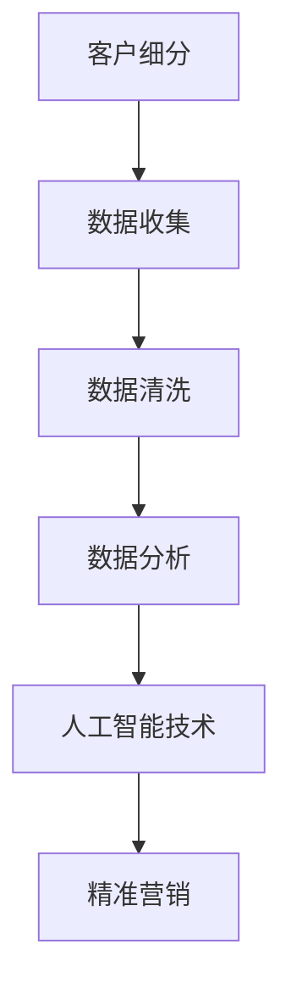

                 

### 文章标题：AI驱动的客户细分策略：精准营销与服务

#### 关键词：AI、客户细分、精准营销、深度学习、数据分析、机器学习

#### 摘要：
本文旨在探讨如何利用人工智能（AI）技术实现高效的客户细分策略，从而提升精准营销与服务的效果。通过分析AI在客户细分中的应用原理和算法，本文将结合实际案例，展示如何通过AI驱动的客户细分策略，为企业实现个性化营销和优质服务。

### 引言

#### 背景介绍
在当今信息爆炸的时代，消费者行为越来越多样化，如何准确把握消费者需求、提高营销效率成为企业关注的焦点。传统的营销手段往往难以满足这一需求，而人工智能（AI）技术的崛起为精准营销带来了新的契机。AI驱动的客户细分策略，通过收集、分析和利用大量用户数据，能够实现个性化推荐、精准定位和高效营销。

#### 核心概念与联系
为了更好地理解AI驱动的客户细分策略，我们需要了解以下几个核心概念：

- **客户细分**：根据消费者的不同特征和行为，将市场划分为不同的群体。
- **人工智能**：一种模拟人类智能的计算机技术，包括机器学习、深度学习、自然语言处理等。
- **精准营销**：基于大数据和人工智能技术，针对不同消费者群体制定个性化的营销策略。

这些概念之间的关系可以用以下Mermaid流程图表示：



#### AI在客户细分与精准营销中的应用前景
随着AI技术的不断进步，其在客户细分和精准营销中的应用前景十分广阔。通过AI技术，企业可以更加精准地了解消费者需求，实现个性化营销，提高客户满意度和忠诚度。此外，AI技术还能够帮助企业降低营销成本，提高营销效果。

### 理论基础

#### 客户细分的基本方法
客户细分是精准营销的基础，根据不同的细分标准，可以分为以下几种方法：

- **地理细分**：根据消费者的地理位置进行细分。
- **人口细分**：根据消费者的年龄、性别、收入等人口统计特征进行细分。
- **心理细分**：根据消费者的个性、价值观、生活方式等心理特征进行细分。
- **行为细分**：根据消费者的购买行为、消费习惯等行为特征进行细分。

#### AI技术在客户细分中的应用
AI技术，特别是机器学习和深度学习，在客户细分中发挥着重要作用。以下介绍几种常见的AI技术在客户细分中的应用：

- **机器学习算法**：通过训练数据集，建立预测模型，对新的数据进行分类。常见的算法包括决策树、随机森林、支持向量机等。
- **深度学习模型**：基于神经网络的结构，能够处理大量复杂数据。常见的模型包括卷积神经网络（CNN）、循环神经网络（RNN）、长短期记忆网络（LSTM）等。
- **聚类分析**：将数据集分为若干个簇，每个簇内的数据具有相似性。常用的聚类算法包括K-means、层次聚类等。

#### 客户细分策略的设计与优化
客户细分策略的设计与优化是提高精准营销效果的关键。以下是一些设计优化策略：

- **数据驱动**：基于大量用户数据进行细分，避免主观臆断。
- **动态调整**：根据市场环境和消费者行为的变化，动态调整细分策略。
- **多维度结合**：结合地理、人口、心理、行为等多个维度的数据进行细分，提高细分精度。
- **交叉验证**：使用交叉验证方法，评估细分策略的有效性。

### 核心算法原理讲解

#### 机器学习算法
机器学习算法是AI技术的重要组成部分，其核心原理是通过训练数据集，建立预测模型。以下是一个简单的机器学习算法伪代码示例：

```python
# 伪代码：机器学习算法
def machine_learning_algorithm(train_data, train_labels):
    # 初始化模型参数
    model = initialize_model()

    # 训练模型
    for data, label in train_data:
        model.train(data, label)

    # 预测
    predictions = []
    for data in test_data:
        prediction = model.predict(data)
        predictions.append(prediction)

    # 评估模型
    accuracy = evaluate_model(predictions, test_labels)
    return model, accuracy
```

#### 深度学习模型
深度学习模型基于神经网络的结构，能够处理大量复杂数据。以下是一个简单的深度学习模型伪代码示例：

```python
# 伪代码：深度学习模型
class DeepLearningModel:
    def __init__(self):
        # 初始化神经网络结构
        self.layers = [DenseLayer(), ConvolutionalLayer(), ...]

    def forward(self, x):
        # 前向传播
        for layer in self.layers:
            x = layer.forward(x)
        return x

    def backward(self, x, y):
        # 反向传播
        for layer in reversed(self.layers):
            x = layer.backward(x, y)
        return x

    def train(self, x, y):
        # 训练模型
        x = self.forward(x)
        x = self.backward(x, y)
```

#### 数学模型和公式
在客户细分和精准营销中，常用的数学模型包括线性回归、逻辑回归、支持向量机等。以下是一个简单的线性回归模型公式：

$$
y = \beta_0 + \beta_1x_1 + \beta_2x_2 + ... + \beta_nx_n
$$

其中，$y$ 是预测值，$x_1, x_2, ..., x_n$ 是输入特征，$\beta_0, \beta_1, \beta_2, ..., \beta_n$ 是模型参数。

### 项目实战

#### 开发环境搭建
在进行AI驱动的客户细分策略项目时，首先需要搭建一个合适的开发环境。以下是一个简单的开发环境搭建步骤：

1. 安装Python和相关的库，如NumPy、Pandas、Scikit-learn等。
2. 安装深度学习框架，如TensorFlow或PyTorch。
3. 准备数据集，并进行数据预处理。

#### 源代码详细实现和代码解读
以下是一个简单的机器学习算法实现示例，用于客户细分：

```python
import numpy as np
from sklearn.model_selection import train_test_split
from sklearn.linear_model import LinearRegression

# 数据集
X = np.array([[1, 2], [2, 3], [3, 4], [4, 5]])
y = np.array([2, 3, 4, 5])

# 划分训练集和测试集
X_train, X_test, y_train, y_test = train_test_split(X, y, test_size=0.2, random_state=42)

# 创建线性回归模型
model = LinearRegression()

# 训练模型
model.fit(X_train, y_train)

# 预测
predictions = model.predict(X_test)

# 评估模型
accuracy = np.mean((predictions - y_test) ** 2)
print(f"Model accuracy: {accuracy}")
```

#### 代码应用解读与分析
在上面的示例中，我们使用线性回归模型进行客户细分。首先，我们导入所需的库和模块，然后准备数据集并进行划分。接下来，我们创建一个线性回归模型，使用训练数据进行训练，最后使用测试数据进行预测并评估模型。

#### 实际案例分析和详细讲解剖析
以下是一个实际的客户细分案例：

- **案例背景**：某电商平台的客户细分需求，根据用户的购买行为和浏览记录进行细分。
- **数据集**：包含用户的ID、购买金额、浏览次数、商品类别等。
- **算法**：使用K-means聚类算法进行客户细分。

**案例分析**：

1. 数据预处理：对数据集进行清洗和转换，将数值型数据标准化。
2. 聚类分析：使用K-means算法进行聚类，确定最佳聚类个数。
3. 结果分析：根据聚类结果，对每个客户群体进行特征分析，制定相应的营销策略。

#### 项目小结
通过本案例，我们展示了如何使用AI技术实现客户细分，并制定相应的营销策略。实际项目中，需要根据具体情况调整算法参数和策略，以实现最佳效果。

### 最佳实践 Tips、小结、注意事项、拓展阅读等内容

#### 最佳实践 Tips
- 在进行客户细分时，要确保数据质量和数据来源的多样性。
- 考虑到实际应用场景，选择合适的算法和模型。
- 定期对客户细分策略进行评估和调整，以适应市场变化。

#### 小结
本文介绍了AI驱动的客户细分策略，包括理论基础、核心算法原理、项目实战等内容。通过AI技术，企业可以实现精准营销和优质服务，提高市场竞争力。

#### 注意事项
- 在使用AI技术进行客户细分时，要保护用户隐私，遵守相关法律法规。
- 考虑到模型的可解释性，避免过度依赖复杂的深度学习模型。

#### 拓展阅读
- 《机器学习实战》
- 《深度学习》
- 《数据挖掘：概念与技术》

### 结束语

本文以AI驱动的客户细分策略为核心，详细探讨了其在精准营销与服务中的应用。通过理论基础、核心算法讲解、项目实战等环节，我们展示了如何利用AI技术实现高效的客户细分策略。希望本文能为读者在AI应用领域提供有益的参考和启示。

#### 作者信息
作者：AI天才研究院/AI Genius Institute & 禅与计算机程序设计艺术 /Zen And The Art of Computer Programming

