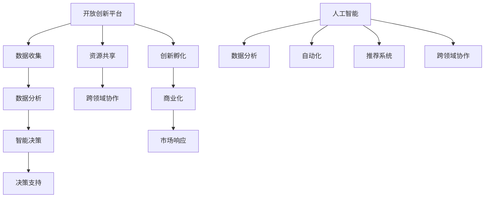

                 


# AI驱动的开放创新平台：促进企业内外协作创新

## 关键词
- AI驱动的开放创新平台
- 企业内外协作创新
- 人工智能技术
- 数据分析
- 开源技术
- 创新生态系统

## 摘要
本文探讨了AI驱动的开放创新平台如何促进企业内外部的协作创新。首先，我们介绍了开放创新平台的概念和AI在其中扮演的角色。接着，我们详细分析了AI技术的核心原理和应用，特别是在机器学习和深度学习方面的应用。随后，我们探讨了企业内部和外部的协作创新模式，并展示了AI如何提升这些协作效率。文章通过实际案例研究，展示了如何构建AI驱动的开放创新平台，并提供了实践指南。最后，我们对未来的发展趋势进行了展望，指出了AI驱动的开放创新平台在促进企业可持续发展中的作用。

## 引言
在当今快速变化的市场环境中，企业面临着前所未有的挑战和机遇。为了保持竞争力，企业需要不断地创新和适应新的技术趋势。开放创新平台作为一种促进创新的重要手段，正逐渐成为企业战略的重要组成部分。而人工智能（AI）作为当前最具变革性的技术之一，其与开放创新平台的结合，为企业的创新活动提供了新的动力和可能性。

本文旨在探讨AI驱动的开放创新平台如何促进企业内外部的协作创新。具体来说，我们将从以下几个方面展开讨论：

1. **开放创新平台概述**：介绍开放创新平台的基本概念、发展历程和核心功能。
2. **AI技术基础**：讲解AI的核心技术，包括机器学习、深度学习等，以及这些技术在开放创新平台中的应用。
3. **企业内外协作创新模式**：分析企业内部协作创新和企业外部协作创新的模式，以及AI如何提升这些协作效率。
4. **实际案例研究**：通过具体案例，展示如何构建AI驱动的开放创新平台，以及平台在实际操作中的效果。
5. **实践指南**：为读者提供构建开放创新平台的步骤、方法和工具。
6. **未来展望**：讨论AI驱动的开放创新平台的发展趋势和未来挑战。

通过本文的讨论，我们希望读者能够深入了解AI驱动的开放创新平台，并理解其对企业创新活动的深远影响。

## 开放创新平台概述

### 基本概念

开放创新平台（Open Innovation Platform，简称OIP）是一种旨在促进创新和协作的技术基础设施。它通过整合内部和外部资源、技术和人才，为企业提供一个开放、协作和创新的环境。开放创新平台的基本概念可以概括为以下几点：

1. **资源共享**：平台提供了一种资源共享的机制，使得企业内部不同部门之间，以及与外部合作伙伴之间能够高效地共享数据、技术和知识。
2. **跨领域协作**：开放创新平台鼓励不同领域、不同专业背景的专家和团队之间的跨领域协作，从而促进创新思维和解决方案的多样化。
3. **数据驱动**：开放创新平台依赖于海量数据的收集和分析，通过数据驱动的方式，为企业提供有价值的洞察和决策支持。
4. **灵活性和适应性**：开放创新平台具有高度的灵活性和适应性，能够根据企业的需求和市场变化，快速调整和创新。

### 发展历程

开放创新平台的概念最早由亨利· Chesbrough在2003年提出，他将其定义为“企业通过外部供应商、用户、研究机构和其他合作伙伴，共同开发新产品、服务或业务模式的创新模式”。此后，开放创新平台逐渐成为学术界和工业界关注的热点。随着信息技术的快速发展，尤其是云计算、大数据和人工智能等新兴技术的应用，开放创新平台得到了进一步的完善和提升。

在过去的几十年中，开放创新平台经历了多个发展阶段：

1. **初步阶段**（1990s-2000s）：这一阶段主要聚焦于内部创新，企业通过建立内部研发中心和实验室，推动技术创新和产品开发。
2. **协作阶段**（2000s-2010s）：随着互联网和社交媒体的兴起，企业开始注重与外部合作伙伴的协作，通过开放创新平台，共享资源和知识。
3. **智能化阶段**（2010s-至今）：随着人工智能和大数据技术的发展，开放创新平台逐渐向智能化和自动化方向发展，通过数据分析和AI算法，为企业提供更加精准和高效的创新支持。

### 核心功能

开放创新平台的核心功能主要包括以下几个方面：

1. **数据收集与分析**：平台通过集成多种数据源，包括企业内部数据、外部市场数据、用户反馈数据等，对海量数据进行收集和分析，为企业提供数据驱动的洞察和决策支持。
2. **资源共享与协作**：平台提供了一套完善的资源共享和协作机制，使得企业内部不同部门之间，以及与外部合作伙伴之间能够高效地共享资源、协同工作。
3. **创新孵化与加速**：平台为创新项目提供了孵化和支持环境，通过项目管理和资金支持，加速创新项目的落地和商业化。
4. **知识管理**：平台通过知识库和智能问答系统，帮助企业积累和管理知识资产，提高创新效率。
5. **用户体验优化**：平台通过用户行为分析和AI推荐系统，优化用户体验，提高用户满意度和忠诚度。

### AI在开放创新平台中的作用

AI作为当前最具变革性的技术之一，在开放创新平台中发挥着至关重要的作用。具体来说，AI在开放创新平台中的作用主要体现在以下几个方面：

1. **数据驱动的决策**：通过机器学习和深度学习算法，AI能够对海量数据进行分析和挖掘，为企业提供数据驱动的决策支持。例如，AI可以分析市场趋势、用户需求，帮助企业制定更加精准的市场策略和产品规划。
2. **智能推荐系统**：基于用户行为和偏好数据，AI可以构建智能推荐系统，为用户推荐个性化的产品和服务，提高用户体验和满意度。
3. **自动化与效率提升**：AI能够自动化处理大量的重复性工作，例如数据清洗、数据分析等，从而提高工作效率，释放人力资源，专注于更具创造性的工作。
4. **跨领域协作**：通过自然语言处理和知识图谱等技术，AI能够促进不同领域专家之间的跨领域协作，打破信息孤岛，提高协作效率。
5. **创新加速**：AI能够通过对创新项目的实时监控和反馈，提供个性化支持，加速创新项目的迭代和商业化。

### 核心概念与联系

为了更好地理解开放创新平台及其与AI的关系，我们可以使用Mermaid流程图来展示其核心概念和联系。以下是一个简化的流程图示例：



在这个流程图中，我们可以看到，开放创新平台的核心功能（如数据收集、资源共享、创新孵化等）与AI技术（如数据分析、自动化、推荐系统等）紧密相连，共同构成了一个完整的创新生态系统。AI技术在平台中发挥着关键作用，不仅提升了平台的效率，也为企业的创新活动提供了强有力的支持。

## AI技术基础

### 机器学习基础

机器学习（Machine Learning，ML）是人工智能（Artificial Intelligence，AI）的核心组成部分，它使计算机系统能够通过数据和经验自动改进性能。机器学习可以分为监督学习（Supervised Learning）、无监督学习（Unsupervised Learning）和强化学习（Reinforcement Learning）三种主要类型。

#### 监督学习

监督学习是一种通过输入和输出数据训练模型的方法。输入数据通常带有标签，输出数据是我们希望模型预测的值。监督学习的流程包括以下几个步骤：

1. **数据预处理**：包括数据清洗、归一化和特征提取等，确保数据质量。
2. **选择模型**：根据问题的性质，选择合适的模型，如线性回归、决策树、支持向量机（SVM）等。
3. **训练模型**：使用输入和输出数据对模型进行训练，调整模型的参数。
4. **评估模型**：通过交叉验证等方法，评估模型的泛化能力。

以下是一个简单的监督学习算法——线性回归的伪代码：

```python
def linear_regression(X, y):
    # X: 输入特征，y: 输出标签
    # 求解 w = (X^T * X)^(-1) * X^T * y
    w = np.linalg.inv(X.T.dot(X)).dot(X.T).dot(y)
    return w

# 假设 X 是一个 m x n 的矩阵，y 是一个 m 维的向量
w = linear_regression(X, y)
```

#### 无监督学习

无监督学习是在没有标签的输入数据上训练模型的方法。它的目标通常是发现数据中的模式和结构。常见的无监督学习方法包括聚类（Clustering）和降维（Dimensionality Reduction）。

1. **聚类**：例如K均值聚类（K-Means Clustering），它通过迭代的方式，将数据点划分为K个簇，使得每个簇内的数据点之间的距离最小。
2. **降维**：例如主成分分析（Principal Component Analysis，PCA），它通过线性变换，将高维数据投影到低维空间，保留数据的主要信息。

以下是一个简单的K均值聚类的伪代码：

```python
def k_means_clustering(data, k):
    # data: 数据点，k: 簇的数量
    # 初始化中心点
    centroids = initialize_centroids(data, k)
    while True:
        # 计算每个数据点到中心点的距离
        distances = calculate_distances(data, centroids)
        # 根据距离将数据点分配到最近的簇
        clusters = assign_clusters(data, distances)
        # 更新中心点
        new_centroids = update_centroids(clusters, k)
        # 检查是否收敛
        if np.linalg.norm(new_centroids - centroids) < tolerance:
            break
        centroids = new_centroids
    return clusters, centroids

# 假设 data 是一个 n x d 的矩阵，k 是一个整数
clusters, centroids = k_means_clustering(data, k)
```

#### 强化学习

强化学习是通过与环境的交互，学习最优策略的方法。强化学习的主要组成部分包括：

1. **状态（State）**：系统当前所处的环境状态。
2. **动作（Action）**：系统可以执行的操作。
3. **奖励（Reward）**：系统执行某个动作后获得的奖励。
4. **策略（Policy）**：系统在某个状态下采取的动作。

强化学习算法通常使用值函数（Value Function）或策略梯度（Policy Gradient）等方法来学习最优策略。以下是一个简单的Q学习的伪代码：

```python
def q_learning(states, actions, rewards, Q, alpha, gamma):
    # states: 状态，actions: 动作，rewards: 奖励，Q: Q值表，alpha: 学习率，gamma: 折扣因子
    for state in states:
        best_action = np.argmax(Q[state])
        Q[state][best_action] += alpha * (rewards[state][best_action] + gamma * np.max(Q[next_state]) - Q[state][best_action])
    return Q

# 假设 states 是一个列表，actions 是一个列表，rewards 是一个字典，Q 是一个二维数组
Q = q_learning(states, actions, rewards, Q, alpha, gamma)
```

### 深度学习原理

深度学习（Deep Learning，DL）是机器学习的一个分支，它通过构建深度神经网络（Deep Neural Network，DNN）来模拟人脑的学习过程。深度学习的关键组成部分包括：

1. **神经网络（Neural Network）**：神经网络是一种由大量简单计算单元（神经元）组成的计算模型，通过层次化的结构来学习数据的特征。
2. **激活函数（Activation Function）**：激活函数用于引入非线性，使神经网络能够学习复杂的函数。
3. **优化算法（Optimization Algorithm）**：优化算法用于调整网络的参数，以最小化损失函数。

#### 神经网络

神经网络的基本结构包括输入层、隐藏层和输出层。每个层由多个神经元组成，神经元之间通过权重连接。以下是一个简单的神经网络结构的伪代码：

```python
class NeuralNetwork:
    def __init__(self, input_size, hidden_size, output_size):
        # 初始化权重和偏置
        self.weights = {
            'input_hidden': initialize_weights(input_size, hidden_size),
            'hidden_output': initialize_weights(hidden_size, output_size)
        }
        self.biases = {
            'input_hidden': initialize_biases(hidden_size),
            'hidden_output': initialize_biases(output_size)
        }

    def forward(self, X):
        # 前向传播
        self.hidden_layer = activate(sum(self.weights['input_hidden'] * X + self.biases['input_hidden']))
        self.output_layer = activate(sum(self.weights['hidden_output'] * self.hidden_layer + self.biases['hidden_output']))
        return self.output_layer

# 假设 input_size、hidden_size 和 output_size 是整数
nn = NeuralNetwork(input_size, hidden_size, output_size)
output = nn.forward(X)
```

#### 激活函数

常见的激活函数包括sigmoid、ReLU和Tanh。以下是一个ReLU激活函数的伪代码：

```python
def activate(x):
    return max(0, x)
```

#### 优化算法

常见的优化算法包括随机梯度下降（Stochastic Gradient Descent，SGD）、Adam和RMSprop。以下是一个SGD优化算法的伪代码：

```python
def sgd(parameters, gradients, learning_rate, epochs):
    for epoch in range(epochs):
        for x, y in dataset:
            # 计算梯度
            gradients = compute_gradients(parameters, x, y)
            # 更新参数
            parameters = update_parameters(parameters, gradients, learning_rate)
        print(f"Epoch {epoch+1}, Loss: {compute_loss(parameters, dataset)}")
    return parameters

# 假设 parameters 是一个字典，gradients 是一个字典，learning_rate 是一个浮点数，epochs 是一个整数
parameters = sgd(parameters, gradients, learning_rate, epochs)
```

### AI在开放创新平台中的应用

AI技术在开放创新平台中有着广泛的应用，包括但不限于以下几个方面：

1. **数据分析与预测**：通过机器学习和深度学习算法，AI可以对海量数据进行分析和预测，为企业的决策提供支持。例如，可以使用回归模型预测市场趋势，使用聚类算法分析用户行为。
2. **智能推荐系统**：AI可以构建智能推荐系统，根据用户的历史行为和偏好，为用户推荐个性化的产品和服务。这在电子商务、社交媒体和在线教育等领域有着广泛的应用。
3. **自动化与优化**：AI可以通过自动化技术，优化企业的运营流程，提高效率。例如，使用机器学习算法优化库存管理，使用深度学习算法优化生产流程。
4. **跨领域协作**：AI可以通过自然语言处理和知识图谱等技术，促进不同领域专家之间的跨领域协作，打破信息孤岛，提高协作效率。

### 核心算法原理讲解

为了深入理解AI在开放创新平台中的应用，我们可以详细讲解几个核心算法的原理，包括决策树、神经网络和强化学习。以下是一个决策树的详细讲解：

#### 决策树（Decision Tree）

决策树是一种常见的监督学习算法，它通过一系列的规则，将数据集划分成多个子集，直到满足某个终止条件。决策树的构建过程包括以下几个步骤：

1. **选择最优分割点**：对于每个特征，计算其在当前节点上的信息增益或基尼不纯度，选择最优的分割点。
2. **构建树结构**：根据最优分割点，将数据集划分为多个子集，并递归地重复上述步骤，直到满足终止条件（如最大深度、最小叶子节点数量等）。
3. **剪枝**：为了防止过拟合，可以对决策树进行剪枝，减少树的复杂度。

以下是一个简单的决策树构建过程的伪代码：

```python
def build_decision_tree(data, target_attribute):
    # 如果所有数据都属于同一类别，则返回该类别
    if all_values_equal(data, target_attribute):
        return majority_class(data)
    # 如果没有可用特征，则返回多数类
    if no_features_left(data):
        return majority_class(data)
    # 选择最优特征
    best_feature = select_best_feature(data)
    # 构建树结构
    tree = {}
    for value in unique_values(data[best_feature]):
        subtree = build_decision_tree(split_data(data, best_feature, value), target_attribute)
        tree[value] = subtree
    return tree

# 假设 data 是一个数据集，target_attribute 是一个目标特征
tree = build_decision_tree(data, target_attribute)
```

#### 神经网络（Neural Network）

神经网络是一种模拟人脑的计算模型，通过层次化的结构学习数据的特征。神经网络的训练过程主要包括以下几个步骤：

1. **前向传播**：计算输入数据经过网络后的输出。
2. **计算损失**：使用损失函数（如均方误差、交叉熵等）计算预测值和真实值之间的差距。
3. **反向传播**：通过梯度下降等优化算法，更新网络的权重和偏置。
4. **迭代训练**：重复上述步骤，直到满足终止条件（如达到特定精度或迭代次数）。

以下是一个简单的神经网络前向传播和反向传播的伪代码：

```python
def forward propagate(network, X):
    # 计算前向传播的输出
    for layer in network.layers:
        layer.output = activation(sum(layer.weight * prev_layer.output + layer.bias))
    return network.layers[-1].output

def backward propagate(network, X, y, learning_rate):
    # 计算损失
    loss = compute_loss(network.layers[-1].output, y)
    # 反向传播梯度
    d_loss = compute_gradient(loss, network.layers[-1].output, y)
    for layer in reversed(network.layers):
        d_output = d_loss if layer == network.layers[-1] else d_output * layer.weight
        d_weight = prev_layer.output.T.dot(d_output)
        d_bias = d_output.sum(axis=0)
        # 更新权重和偏置
        layer.weight -= learning_rate * d_weight
        layer.bias -= learning_rate * d_bias

# 假设 network 是一个神经网络，X 是输入数据，y 是真实标签，learning_rate 是学习率
output = forward propagate(network, X)
backward propagate(network, X, y, learning_rate)
```

#### 强化学习（Reinforcement Learning）

强化学习是一种通过与环境的交互来学习最优策略的方法。强化学习的过程主要包括以下几个步骤：

1. **初始化**：设置状态、动作、奖励和策略。
2. **环境交互**：根据当前状态选择动作，并执行动作。
3. **奖励反馈**：根据执行动作后的结果，获得奖励。
4. **策略更新**：根据奖励反馈，更新策略。
5. **迭代**：重复上述步骤，直到满足终止条件。

以下是一个简单的Q学习的伪代码：

```python
def q_learning(states, actions, rewards, Q, alpha, gamma):
    for state in states:
        best_action = np.argmax(Q[state])
        Q[state][best_action] += alpha * (rewards[state][best_action] + gamma * np.max(Q[next_state]) - Q[state][best_action])
    return Q

# 假设 states 是一个列表，actions 是一个列表，rewards 是一个字典，Q 是一个二维数组
Q = q_learning(states, actions, rewards, Q, alpha, gamma)
```

通过以上对机器学习、深度学习和强化学习核心算法的详细讲解，我们可以看到这些算法在开放创新平台中的应用潜力。AI技术的深入理解和应用，将为企业的创新活动提供强大的支持。

## 企业内外协作创新模式

### 企业内部协作创新

企业内部协作创新是指企业内部不同部门、团队或个人之间的合作，共同推动创新项目的发展。在当今快速变化的市场环境中，企业内部协作创新对于保持竞争优势和推动持续发展至关重要。以下是企业内部协作创新的一些关键模式：

#### 团队合作

团队合作是企业内部协作创新的核心模式之一。通过建立跨部门、跨团队的协作机制，企业可以将不同领域、不同技能的人才聚集在一起，共同解决复杂问题。团队合作的优势在于能够充分利用每个人的专业知识和经验，形成互补效应，提高创新效率。

以下是一个团队合作流程的示例：

1. **项目立项**：确定创新项目的目标和范围，组建跨部门、跨团队的团队。
2. **需求分析**：收集和分析市场需求、用户反馈等，明确项目的需求和目标。
3. **资源整合**：整合团队内外部的资源，包括人员、技术、资金等。
4. **分工协作**：明确团队成员的职责和任务，确保每个成员都能发挥自己的专长。
5. **定期沟通**：建立定期的沟通机制，确保团队成员之间的信息同步和协作。
6. **风险评估与应对**：识别项目中的风险，并制定应对策略。
7. **成果验收**：完成创新项目后，对项目成果进行评估和验收。

#### 内部竞赛

内部竞赛是企业激励员工创新、提高内部协作效率的有效手段。通过设立创新竞赛，企业可以激发员工的创造力和竞争意识，促进不同团队之间的交流与合作。内部竞赛通常包括以下几个阶段：

1. **竞赛主题发布**：企业发布创新竞赛的主题和规则，明确竞赛的目标和要求。
2. **团队报名与准备**：员工可以根据自己的兴趣和专业领域，组建团队并准备竞赛方案。
3. **竞赛评审**：设立评审委员会，对参赛团队的方案进行评审，选出优胜者。
4. **成果展示**：对优胜者的创新项目进行展示，分享经验和成果。
5. **奖励与激励**：对获奖团队和成员进行奖励和表彰，激励更多的员工参与创新。

#### 内部孵化器

内部孵化器是企业内部推动创新项目落地的重要平台。通过内部孵化器，企业可以为创新项目提供必要的资源和支持，包括资金、技术、市场渠道等，帮助项目从概念阶段到商业化阶段的发展。内部孵化器的运作模式通常包括以下几个方面：

1. **项目筛选**：对提交的创新项目进行初步筛选，确定符合企业战略和发展方向的孵化项目。
2. **资源匹配**：为孵化项目匹配相应的资源，包括人员、技术、资金等。
3. **过程管理**：对孵化项目进行全过程管理，包括项目进度跟踪、风险评估、调整等。
4. **成果验收**：对孵化项目的成果进行验收，评估项目的技术可行性、市场前景等。
5. **商业化支持**：对有潜力的孵化项目提供商业化支持，包括市场推广、融资等。

### 企业外部协作创新

企业外部协作创新是指企业与外部合作伙伴（如供应商、客户、研究机构等）之间的合作，共同推动创新项目的发展。与内部协作创新相比，外部协作创新具有更广阔的资源和技术支持，有助于企业突破自身局限，实现跨界创新。以下是企业外部协作创新的一些关键模式：

#### 跨界合作

跨界合作是企业与外部合作伙伴之间的合作，通过整合不同领域的资源和能力，实现创新项目的突破。跨界合作通常包括以下几个方面：

1. **资源整合**：企业通过与其他企业、研究机构、高校等建立合作关系，整合各自的资源和技术，共同推动创新项目的发展。
2. **合作研发**：企业与外部合作伙伴共同投入研发资源，开展联合研发项目，共同开发新产品、新技术。
3. **共享平台**：企业通过建立共享平台，为外部合作伙伴提供技术、数据、人才等资源共享，促进合作创新。
4. **共同市场推广**：企业与外部合作伙伴共同推广创新项目，共享市场资源和渠道，提高项目的市场竞争力。

#### 开源社区

开源社区是企业与外部开发者共同推动技术创新的重要平台。通过开源社区，企业可以吸引全球开发者参与项目的开发，共同改进和优化技术，实现快速迭代和创新。开源社区的主要模式包括：

1. **代码贡献**：开发者可以自由贡献代码，共同完善项目。
2. **代码审查**：通过代码审查机制，确保代码质量和安全性。
3. **社区活动**：组织线下或线上活动，促进开发者之间的交流与合作。
4. **技术交流**：通过技术论坛、博客、文档等形式，分享技术知识和经验。

### AI提升协作效率

人工智能技术在提升企业内外协作效率方面具有显著优势，通过以下方式实现：

1. **数据驱动决策**：AI技术通过对企业内部和外部的海量数据进行分析和挖掘，提供数据驱动的决策支持，帮助企业更好地理解和应对市场变化。
2. **智能推荐系统**：AI技术可以构建智能推荐系统，根据用户行为和偏好，为用户提供个性化的产品和服务，提高用户体验和满意度。
3. **自动化与效率提升**：AI技术可以通过自动化技术，优化企业的运营流程，提高工作效率，释放人力资源，专注于更具创造性的工作。
4. **跨领域协作**：AI技术可以通过自然语言处理和知识图谱等技术，促进不同领域专家之间的跨领域协作，打破信息孤岛，提高协作效率。
5. **创新加速**：AI技术通过对创新项目的实时监控和反馈，提供个性化支持，加速创新项目的迭代和商业化。

### 案例研究

以下是一个企业内外协作创新的实际案例研究：

#### 案例背景

某知名科技公司（以下简称公司）在开发新型智能硬件产品时，面临着技术瓶颈和资源限制。为了突破这些限制，公司决定与外部合作伙伴（包括供应商、研究机构和其他科技公司）建立合作关系，共同推动创新项目的发展。

#### 案例过程

1. **需求分析与资源整合**：公司首先对市场需求和用户需求进行了深入分析，明确了产品的功能和性能要求。接着，公司开始整合内外部资源，包括技术、人才和资金，为创新项目提供充足的支持。
2. **跨界合作**：公司与其他合作伙伴建立了紧密的合作关系，共同开展研发工作。通过跨界合作，公司成功整合了不同领域的资源和能力，实现了技术突破。
3. **共享平台**：公司搭建了一个共享平台，为合作伙伴提供技术、数据、人才等资源共享。通过共享平台，合作伙伴可以实时获取项目进展、技术文档和实验数据，提高了协作效率。
4. **智能推荐系统**：公司利用AI技术，构建了智能推荐系统，根据用户行为和偏好，为用户提供个性化的产品和服务。智能推荐系统不仅提高了用户体验和满意度，还为公司的市场推广提供了有力支持。
5. **创新加速**：AI技术通过对创新项目的实时监控和反馈，提供了个性化支持，加速了项目的迭代和商业化。例如，公司利用机器学习算法，优化了生产流程，提高了生产效率，缩短了产品上市时间。

#### 案例效果

通过企业内外协作创新，公司取得了显著的效果：

1. **技术突破**：通过与外部合作伙伴的跨界合作，公司成功突破了技术瓶颈，实现了产品的技术创新和性能提升。
2. **市场竞争力**：智能推荐系统的应用，提高了用户体验和满意度，增强了公司的市场竞争力。
3. **效率提升**：共享平台和AI技术的应用，提高了协作效率，降低了研发成本，提高了生产效率。
4. **商业化加速**：创新项目的快速迭代和商业化，为公司带来了丰厚的经济回报。

### 结论

企业内部协作创新和企业外部协作创新是企业实现可持续发展的关键。通过AI技术的应用，企业可以进一步提升协作效率，实现创新加速。在实际操作中，企业应根据自身需求和资源状况，选择合适的协作模式，并充分利用AI技术，推动创新活动的深入开展。

## 实际案例研究

为了更好地理解AI驱动的开放创新平台如何促进企业内外协作创新，我们将通过两个实际案例来展示平台的构建过程和实际效果。

### 案例一：某科技巨头公司的AI开放创新平台

#### 案例背景

某全球领先的科技公司（以下简称公司）在数字化转型的过程中，意识到传统研发模式的局限性，决定构建一个AI驱动的开放创新平台，以加速技术创新和产品迭代。

#### 平台构建过程

1. **需求分析与规划**：公司首先对现有的研发流程、资源和技术进行了全面分析，明确了平台的需求和功能定位。公司希望平台能够实现以下几个目标：
   - 提高内部协作效率，缩短产品研发周期。
   - 利用外部资源和技术，推动跨界合作和创新。
   - 通过数据分析和AI算法，优化产品设计和市场推广策略。
   
2. **技术选型与架构设计**：公司选择了基于云计算的微服务架构，利用大数据和AI技术，构建了一个高度可扩展和灵活的开放创新平台。平台的核心技术包括：
   - 数据存储和处理：采用Hadoop和Spark等大数据技术，实现对海量数据的存储和处理。
   - 机器学习和深度学习：采用TensorFlow和PyTorch等框架，构建AI模型和算法。
   - 自然语言处理：利用NLTK和SpaCy等库，实现文本分析和语义理解。

3. **平台实施与运营**：公司通过以下几个步骤，实施和运营了AI开放创新平台：
   - **数据集成与清洗**：整合企业内部和外部的数据源，对数据进行清洗和预处理。
   - **模型训练与部署**：使用训练数据，训练各种AI模型，并将模型部署到平台中，供研发人员使用。
   - **用户培训与支持**：为研发团队提供AI技术和平台的培训，确保团队成员能够熟练使用平台。

#### 平台实际效果

通过AI驱动的开放创新平台，公司取得了显著的效果：

1. **研发效率提升**：平台实现了研发流程的自动化和智能化，大幅缩短了产品研发周期，从过去的几个月缩短到几周。

2. **跨界合作增强**：平台吸引了外部合作伙伴的参与，推动了多个跨界合作项目的落地，实现了技术创新和市场拓展。

3. **数据驱动的决策**：平台通过数据分析和AI算法，提供了丰富的数据洞察，帮助公司优化产品设计和市场推广策略。

4. **用户体验优化**：平台利用AI技术，构建了智能推荐系统，为用户提供个性化的产品和服务，提高了用户体验和满意度。

### 案例二：某中小企业AI开放创新平台

#### 案例背景

某中小企业（以下简称公司）在市场竞争日益激烈的背景下，意识到创新是企业生存和发展的关键。为了提高创新能力，公司决定构建一个AI驱动的开放创新平台。

#### 平台构建过程

1. **需求分析与规划**：公司对自身的研发能力、市场环境和用户需求进行了深入分析，明确了平台的需求和功能定位。公司希望平台能够实现以下几个目标：
   - 提高内部协作效率，整合资源，推动创新项目发展。
   - 通过外部合作，获取新技术和新思路，提升创新能力。
   - 利用AI技术，优化产品设计和市场营销。

2. **技术选型与架构设计**：公司选择了基于云计算的轻量级架构，利用开源技术和AI库，构建了一个简单易用、成本较低的开放创新平台。平台的核心技术包括：
   - 数据存储和处理：采用MongoDB和Redis等数据库，存储和管理数据。
   - 机器学习和深度学习：采用Scikit-learn和Keras等库，构建AI模型和算法。
   - 自然语言处理：采用NLTK和TextBlob等库，实现文本分析和语义理解。

3. **平台实施与运营**：公司通过以下几个步骤，实施和运营了AI开放创新平台：
   - **数据集成与清洗**：整合企业内部和外部的数据源，对数据进行清洗和预处理。
   - **模型训练与部署**：使用训练数据，训练AI模型，并将模型部署到平台中，供研发人员使用。
   - **用户培训与支持**：为研发团队提供AI技术和平台的培训，确保团队成员能够熟练使用平台。

#### 平台实际效果

通过AI驱动的开放创新平台，公司取得了显著的效果：

1. **内部协作效率提升**：平台实现了研发流程的自动化和智能化，提高了内部协作效率，缩短了产品研发周期。

2. **跨界合作增强**：平台吸引了外部合作伙伴的参与，推动了多个跨界合作项目的落地，实现了技术创新和市场拓展。

3. **数据驱动的决策**：平台通过数据分析和AI算法，提供了丰富的数据洞察，帮助公司优化产品设计和市场营销策略。

4. **用户体验优化**：平台利用AI技术，构建了智能推荐系统，为用户提供个性化的产品和服务，提高了用户体验和满意度。

### 案例分析总结

通过对以上两个案例的分析，我们可以得出以下结论：

1. **AI驱动的开放创新平台能够显著提升企业的协作效率和创新能力**。无论是大型科技巨头，还是中小企业，通过构建AI驱动的开放创新平台，都能够实现研发效率的提升、跨界合作的增强和用户体验的优化。

2. **平台的成功构建依赖于合适的技术选型和架构设计**。不同的企业应根据自身需求和资源状况，选择合适的技术和架构，确保平台的可扩展性和灵活性。

3. **数据驱动的决策是平台的核心价值**。通过海量数据的收集和分析，平台能够提供有价值的洞察和决策支持，帮助企业更好地应对市场变化和用户需求。

4. **用户体验优化是平台的重要目标**。通过AI技术，平台能够为用户提供个性化的产品和服务，提高用户体验和满意度，从而增强企业的竞争力。

## 构建AI驱动的开放创新平台的实践指南

### 第一步：需求分析与规划

构建AI驱动的开放创新平台的第一步是进行需求分析和规划。这一步至关重要，因为它将决定平台的功能、架构和技术选型。以下是具体步骤：

1. **内部需求调研**：深入了解企业内部各部门的需求，包括研发、市场、销售、运营等。通过访谈、问卷调查和数据分析等方式，收集各部门对平台的需求和期望。

2. **外部需求分析**：分析企业外部市场的需求和趋势，了解竞争对手的创新模式和市场策略。通过市场调研、用户反馈和行业报告等方式，获取有价值的信息。

3. **资源评估**：评估企业现有的资源，包括技术、人才、资金等。确定平台建设所需的资源，并制定资源获取和分配策略。

4. **目标设定**：根据内部和外部需求，设定平台的建设目标和预期效果。例如，提高研发效率、促进跨界合作、实现数据驱动的决策等。

5. **规划文档**：编写详细的规划文档，明确平台的功能、架构、技术选型、实施步骤和时间表等。规划文档应包括平台的技术栈、系统架构、数据流程、安全性要求等。

### 第二步：技术选型与架构设计

技术选型和架构设计是构建AI驱动的开放创新平台的关键环节。以下是一些建议：

1. **技术栈选择**：根据平台的功能需求和预期效果，选择合适的技术栈。常用的技术包括：
   - **前端技术**：HTML、CSS、JavaScript等，用于构建用户界面。
   - **后端技术**：Node.js、Django、Spring Boot等，用于处理业务逻辑和数据存储。
   - **数据库技术**：MySQL、PostgreSQL、MongoDB等，用于存储和管理数据。
   - **AI和大数据技术**：TensorFlow、PyTorch、Scikit-learn、Hadoop、Spark等，用于数据处理和AI算法实现。

2. **系统架构设计**：设计平台的系统架构，确保系统的可扩展性、可靠性和安全性。以下是一个典型的系统架构：
   - **前端架构**：采用单页应用（SPA）或前后端分离架构，实现动态、交互式的用户界面。
   - **后端架构**：采用微服务架构，将业务功能模块化，提高系统的灵活性和可维护性。
   - **数据处理架构**：采用大数据处理框架，如Hadoop和Spark，实现海量数据的存储和处理。
   - **AI算法架构**：采用分布式计算框架，如TensorFlow和PyTorch，实现高效的AI算法训练和推理。

3. **数据流程设计**：设计数据从收集、存储、处理到应用的完整流程。确保数据的安全、完整和一致性。

4. **安全性设计**：考虑平台的安全性，包括数据安全、用户认证、权限管理等。采用安全加密、防火墙、反病毒等技术，确保平台的安全性。

### 第三步：平台实施与运营

平台实施与运营是构建AI驱动的开放创新平台的核心环节。以下是一些建议：

1. **实施计划**：制定详细的实施计划，明确每个阶段的工作内容和时间表。确保实施过程的顺利进行。

2. **数据集成与清洗**：整合企业内部和外部的数据源，对数据进行清洗和预处理。确保数据的质量和一致性。

3. **模型训练与部署**：使用训练数据，训练AI模型，并将模型部署到平台中。确保模型的高效运行和准确预测。

4. **用户培训与支持**：为研发团队和用户提供AI技术和平台的培训，确保他们能够熟练使用平台。提供技术支持和故障排除服务。

5. **持续迭代与优化**：根据用户反馈和市场变化，持续迭代和优化平台。不断改进平台的功能和性能，提高用户体验。

6. **运营管理**：建立平台的运营管理体系，包括用户管理、数据管理、日志记录、监控报警等。确保平台的稳定运行和高效管理。

### 第四步：效果评估与优化

平台效果评估与优化是构建AI驱动的开放创新平台的重要环节。以下是一些建议：

1. **效果评估**：根据平台的建设目标和预期效果，建立效果评估体系。通过用户满意度、研发效率、市场竞争力等指标，评估平台的效果。

2. **数据驱动优化**：利用平台收集的数据，分析平台的使用情况和性能指标。根据数据反馈，优化平台的功能、性能和用户体验。

3. **用户反馈收集**：定期收集用户反馈，了解用户的需求和建议。根据用户反馈，改进平台的功能和界面。

4. **技术更新与升级**：根据技术的发展趋势和市场需求，及时更新和升级平台的技术。确保平台能够适应新的技术环境和业务需求。

5. **持续改进**：建立持续改进机制，不断优化平台的功能、性能和用户体验。通过持续改进，提高平台的竞争力和用户满意度。

通过以上四个步骤，企业可以系统地构建AI驱动的开放创新平台，实现内部协作效率和外部创新能力的提升。同时，平台的建设和运营也需要持续关注效果评估和优化，确保平台能够持续为企业创造价值。

### 挑战与未来趋势

### 挑战

尽管AI驱动的开放创新平台为企业带来了巨大的机遇，但在实际应用中仍面临一系列挑战。

1. **数据隐私和安全**：随着数据量的增加，数据隐私和安全成为主要挑战。企业需要确保用户数据的安全，防止数据泄露和滥用。
2. **技术复杂性**：AI技术的复杂性和专业性使得平台的构建和维护变得困难。企业需要投入大量资源和时间进行技术学习和培训。
3. **人才短缺**：AI和开放创新领域对人才的需求巨大，但具备相关技能的人才供应有限。企业需要通过多种方式吸引和培养人才。
4. **法律和监管**：随着AI技术的广泛应用，相关的法律和监管也在逐步完善。企业需要遵守相关法律法规，确保平台的合法合规运行。
5. **技术依赖**：企业过度依赖AI技术可能导致技术锁定，一旦技术发生变化，企业可能面临巨大风险。

### 未来趋势

展望未来，AI驱动的开放创新平台将在以下几个方面取得重大进展：

1. **智能化与自动化**：随着AI技术的不断发展，平台将更加智能化和自动化，提高效率，降低人力成本。
2. **跨领域融合**：不同领域的AI技术将不断融合，推动创新项目的多样化发展。
3. **开源生态**：开源技术将在平台建设中扮演更加重要的角色，促进技术的共享和创新。
4. **边缘计算**：边缘计算技术的发展将使AI驱动的开放创新平台更加灵活和高效，满足实时数据处理的需求。
5. **社会责任**：企业将更加关注AI技术的伦理和社会责任，确保技术的可持续发展。

### 未来展望

AI驱动的开放创新平台将在未来成为企业创新和竞争力的重要驱动力。通过充分利用AI技术，企业将能够更快速地响应市场变化，实现创新加速和业务增长。同时，平台也将推动跨领域协作和资源共享，促进社会的整体进步。面对挑战，企业应积极应对，通过持续学习和创新，确保在AI驱动的开放创新浪潮中立于不败之地。

## 结语

在本文中，我们探讨了AI驱动的开放创新平台如何促进企业内外协作创新。首先，我们介绍了开放创新平台的基本概念、发展历程和核心功能，并分析了AI技术，包括机器学习、深度学习和强化学习，在这些平台中的应用。随后，我们讨论了企业内部和外部协作创新的模式，并展示了AI如何提升这些协作效率。通过实际案例研究，我们展示了如何构建AI驱动的开放创新平台，并提供了实践指南。

AI驱动的开放创新平台不仅能够提升企业的内部协作效率和创新能力，还能够促进企业与外部合作伙伴的跨界合作。这种平台为企业提供了一个高效、智能和创新的环境，使其能够更快速地适应市场变化，实现持续创新和业务增长。

在未来，AI驱动的开放创新平台将继续发挥重要作用。随着AI技术的不断进步，平台将变得更加智能化、自动化和灵活，为企业提供更加精准和高效的支持。同时，跨领域融合、开源生态和边缘计算等技术趋势也将为平台的发展带来新的机遇。

我们鼓励读者在实践过程中不断探索和尝试，充分利用AI驱动的开放创新平台，推动企业的创新和可持续发展。通过不断学习和创新，我们将共同迎接AI驱动的开放创新时代的到来。

## 作者信息

作者：AI天才研究院/AI Genius Institute & 禅与计算机程序设计艺术 /Zen And The Art of Computer Programming

作者简介：
- AI天才研究院（AI Genius Institute）是一家专注于人工智能研究、应用和教育的国际知名机构。我们致力于推动人工智能技术的创新和应用，助力企业和社会的智能化转型。
- 禅与计算机程序设计艺术（Zen And The Art of Computer Programming）是一本经典计算机科学著作，作者为著名计算机科学家Donald E. Knuth。本书深入探讨了计算机编程的哲学和艺术，对计算机科学的发展产生了深远影响。

