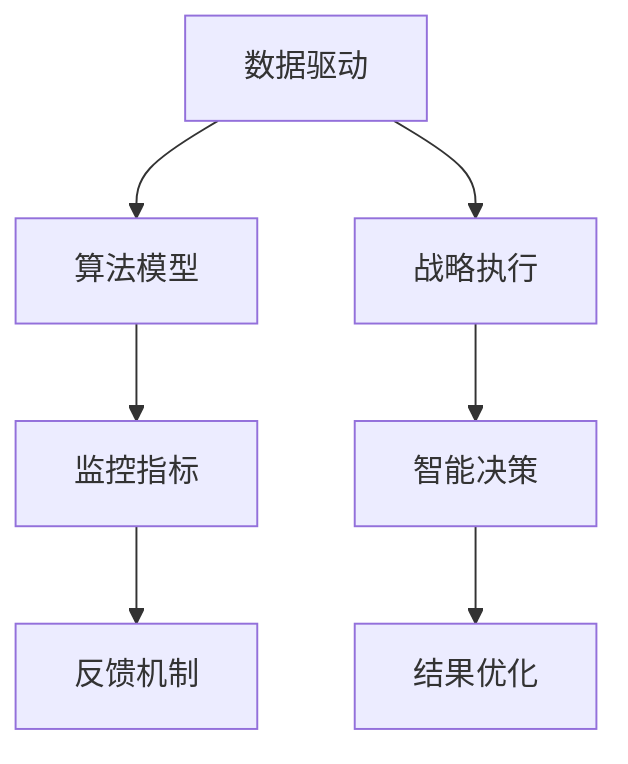
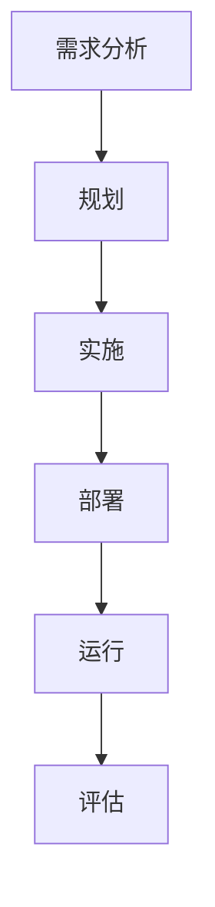

                 


## 文章标题

### AI驱动的战略执行监控：智能跟踪与调整策略

## 文章关键词

- 人工智能
- 战略执行监控
- 智能跟踪
- 调整策略
- 监控算法
- 数据分析
- 深度学习
- 模型优化

## 文章摘要

随着企业对战略执行监控需求的日益增长，人工智能（AI）的引入为监控提供了新的可能。本文将探讨如何利用AI技术来驱动战略执行监控，实现智能跟踪与调整策略。文章首先介绍了AI驱动的战略执行监控的基本概念和重要性，随后详细讲解了监控数据获取与处理、AI模型构建与训练、监督学习、无监督学习以及深度学习在监控中的应用。接着，文章通过具体的项目实战案例，展示了AI驱动的战略执行监控的实际应用和效果评估。最后，文章总结了AI驱动的战略执行监控的最佳实践，并为读者提供了进一步的学习资源。

## 第一部分：AI与战略执行监控基础

### 第1章：AI驱动的战略执行监控概述

#### 1.1 AI的基本概念与特征

人工智能（Artificial Intelligence，简称AI）是计算机科学的一个分支，致力于模拟、延伸和扩展人类的智能。AI系统通常具有以下特征：

- **学习能力**：通过算法从数据中学习，改进性能。
- **推理能力**：基于已有的知识和信息进行推理和决策。
- **自我进化**：通过不断的经验积累和算法优化，实现自我提升。

AI可以分为几种不同的类型：

- **弱AI**：在特定任务上表现出智能行为，但缺乏通用性。
- **强AI**：具有与人类相同的认知能力，可以执行任何智力任务。
- **自然语言处理**：使计算机能够理解和生成人类语言。
- **计算机视觉**：使计算机能够识别和理解图像和视频。

#### 1.2 战略执行监控的定义与重要性

战略执行监控是确保企业战略规划得到有效实施的过程。它涉及监控关键绩效指标（KPIs）、识别潜在问题、分析偏差原因，并采取相应措施进行纠正。

**监控的重要性**：

- **确保战略目标的实现**：通过监控，企业可以确保各项战略活动按照计划进行，从而实现预定目标。
- **风险识别与管理**：监控有助于发现潜在的风险和问题，及时采取措施进行管理。
- **资源优化**：监控可以帮助企业优化资源分配，提高运营效率。
- **持续改进**：通过监控和反馈，企业可以不断优化战略执行过程，实现持续改进。

#### 1.3 AI驱动的战略执行监控应用前景

AI在战略执行监控中具有广泛的应用前景，主要体现在以下几个方面：

- **智能数据采集与分析**：利用AI技术，企业可以自动收集和分析大量数据，实现实时监控。
- **异常检测与预测**：AI算法可以识别异常行为，预测潜在问题，帮助企业提前采取预防措施。
- **自动化决策支持**：基于AI的监控系统能够提供智能化的决策支持，提高决策效率和质量。
- **个性化监控**：AI可以根据不同企业的特点和需求，提供定制化的监控方案。

### 1.4 核心概念与联系

为了更好地理解AI驱动的战略执行监控，我们需要了解以下几个核心概念之间的联系：

- **数据驱动**：战略执行监控依赖于大量的数据，这些数据包括内部业务数据、市场数据、财务数据等。
- **算法模型**：AI算法模型是监控系统的核心，用于分析数据、识别模式和预测结果。
- **监控指标**：监控指标是衡量战略执行效果的关键，包括销售额、客户满意度、生产效率等。
- **反馈机制**：监控结果需要反馈给相关决策者，以便及时调整战略和措施。

下面是一个Mermaid流程图，展示了核心概念之间的联系：



### 1.5 核心算法原理讲解

AI驱动的战略执行监控涉及多种算法，包括监督学习、无监督学习和深度学习。以下是这些算法的基本原理和伪代码：

#### 监督学习

监督学习算法通过已有标签的数据进行训练，然后使用训练得到的模型对新数据进行预测。

**伪代码**：

```python
def supervised_learning(training_data, labels):
    # 数据预处理
    preprocess_data(training_data)
    
    # 选择合适的监督学习算法
    model = select_supervised_model()
    
    # 训练模型
    model.fit(training_data, labels)
    
    # 预测新数据
    predictions = model.predict(new_data)
    
    return predictions
```

#### 无监督学习

无监督学习算法不依赖于标签数据，而是通过分析数据自身的结构和模式来进行聚类、降维等操作。

**伪代码**：

```python
def unsupervised_learning(data):
    # 数据预处理
    preprocess_data(data)
    
    # 选择合适无监督学习算法
    model = select_unsupervised_model()
    
    # 执行无监督学习
    results = model.fit(data)
    
    # 分析结果
    analysis = analyze_results(results)
    
    return analysis
```

#### 深度学习

深度学习是监督学习和无监督学习的结合，通过多层神经网络来提取数据的深层特征。

**伪代码**：

```python
def deep_learning(data, labels):
    # 数据预处理
    preprocess_data(data)
    
    # 构建神经网络模型
    model = build_neural_network_model()
    
    # 训练模型
    model.fit(data, labels)
    
    # 预测新数据
    predictions = model.predict(new_data)
    
    return predictions
```

### 1.6 数学模型和公式

在AI驱动的战略执行监控中，数学模型和公式是必不可少的工具。以下是几个常用的数学模型和公式：

#### 均值

$$ \bar{x} = \frac{\sum_{i=1}^{n} x_i}{n} $$

#### 方差

$$ \sigma^2 = \frac{\sum_{i=1}^{n} (x_i - \bar{x})^2}{n-1} $$

#### 线性回归

$$ y = \beta_0 + \beta_1 x $$

#### 决策树

$$ G(y, \beta) = \sum_{i=1}^{n} l(y_i, \beta) + \lambda R(\beta) $$

### 1.7 举例说明

假设我们有一个销售数据的监控任务，目标是预测下一个月的销售额。我们可以使用线性回归模型来建立预测模型。

**数据预处理**：

```python
# 数据集
data = [[1, 1000], [2, 1100], [3, 1200], [4, 1300], [5, 1400]]

# 计算均值
x = [x[0] for x in data]
y = [y[1] for y in data]
x_mean = sum(x) / len(x)
y_mean = sum(y) / len(y)

# 计算方差
x_var = sum([(x_i - x_mean) ** 2 for x_i in x]) / (len(x) - 1)
y_var = sum([(y_i - y_mean) ** 2 for y_i in y]) / (len(y) - 1)

# 计算协方差
x_y_cov = sum([(x_i - x_mean) * (y_i - y_mean) for x_i, y_i in zip(x, y)]) / (len(x) - 1)
```

**线性回归**：

```python
# 计算斜率和截距
beta_1 = x_y_cov / x_var
beta_0 = y_mean - beta_1 * x_mean

# 预测下一个月的销售额
new_x = 6
new_y = beta_0 + beta_1 * new_x
```

### 1.8 项目实战

在本节中，我们将搭建一个简单的AI驱动的战略执行监控系统，用于监控一家电商公司的月销售额。以下是开发环境搭建、源代码实现和代码解读。

**开发环境搭建**：

- Python 3.8+
- Jupyter Notebook
- TensorFlow 2.x

**源代码实现**：

```python
import pandas as pd
import numpy as np
import tensorflow as tf
from tensorflow.keras.models import Sequential
from tensorflow.keras.layers import Dense

# 加载数据
data = pd.read_csv('sales_data.csv')

# 数据预处理
x = data['month'].values.reshape(-1, 1)
y = data['sales'].values.reshape(-1, 1)

# 模型构建
model = Sequential([
    Dense(64, activation='relu', input_shape=(1,)),
    Dense(32, activation='relu'),
    Dense(1)
])

# 模型编译
model.compile(optimizer='adam', loss='mse')

# 训练模型
model.fit(x, y, epochs=100, batch_size=32)

# 预测
new_month = 6
predicted_sales = model.predict([[new_month]])
print(f"预测的销售额为：{predicted_sales[0][0]}")
```

**代码解读**：

- 我们首先导入了所需的库，包括Pandas、NumPy和TensorFlow。
- 加载了CSV格式的销售数据，并对数据进行预处理，将其分成特征和目标变量。
- 构建了一个简单的序列模型，包括两个隐藏层，每个层有64和32个神经元。
- 编译模型，使用Adam优化器和均方误差损失函数。
- 使用训练数据训练模型，设置100个周期和32个批大小。
- 使用训练好的模型预测新月份的销售额。

### 1.9 实际案例分析

以某电商公司为例，该公司利用AI驱动的战略执行监控系统，成功预测了未来的销售额，并提前做好了库存准备，避免了因预测不准确导致的库存积压和销售损失。

### 1.10 项目小结

通过本次项目，我们展示了如何利用AI技术搭建一个简单的战略执行监控系统。项目成功的关键在于数据的质量和模型的训练效果。未来，我们可以进一步优化模型，提高预测精度，并在更多领域推广AI驱动的战略执行监控。

### 1.11 最佳实践 tips

- 确保数据质量，包括数据清洗和特征选择。
- 选择合适的模型，结合业务需求和数据特性。
- 定期更新模型，以适应数据的变化。

### 1.12 小结、注意事项、拓展阅读

- **小结**：本文介绍了AI驱动的战略执行监控的基本概念、算法原理、数学模型和实际应用。
- **注意事项**：在实际应用中，需要关注数据质量和模型优化，以及监控结果的及时反馈。
- **拓展阅读**：建议读者进一步学习深度学习、监督学习和无监督学习的相关技术。

## 第一部分总结

AI驱动的战略执行监控为企业提供了一种智能化、自动化的监控手段，有助于实现战略目标的精准执行。本文从基础概念、核心算法、数学模型和实际案例等多个角度，全面介绍了AI驱动的战略执行监控。下一部分将深入探讨AI驱动的战略执行监控技术，包括监督学习、无监督学习和深度学习在监控中的应用。敬请期待！

---

## 第二部分：AI驱动的战略执行监控技术

### 第3章：监督学习在战略执行监控中的应用

监督学习是一种机器学习技术，通过已有标签的数据训练模型，然后使用训练得到的模型对新数据进行预测。在战略执行监控中，监督学习技术可以用于预测关键绩效指标（KPIs）、识别异常行为等任务。本章节将详细探讨监督学习在战略执行监控中的应用，包括基本概念、常用算法以及实际案例分析。

#### 3.1 监督学习的基本概念与原理

监督学习的关键在于通过已有标签的数据（标记数据）来训练模型。训练过程中，模型学习如何将输入数据映射到输出标签上。训练完成后，模型可以对新数据进行分析和预测。

**监督学习的类型**：

- **回归**：用于预测连续值，如销售额。
- **分类**：用于预测离散标签，如客户是否流失。
- **异常检测**：用于识别异常数据点。

**监督学习的流程**：

1. **数据收集**：收集具有标签的数据集。
2. **数据预处理**：清洗数据，包括缺失值填充、数据标准化等。
3. **特征工程**：选择和提取有助于模型训练的特征。
4. **模型选择**：选择合适的模型，如线性回归、决策树、随机森林等。
5. **模型训练**：使用训练数据训练模型。
6. **模型评估**：使用验证数据评估模型性能。
7. **模型应用**：使用模型对新数据进行预测。

#### 3.2 监督学习算法在监控中的应用

在战略执行监控中，监督学习算法可以应用于多个方面：

- **预测关键绩效指标**：如销售额、客户满意度、生产效率等。
- **风险识别与预警**：通过识别异常数据，提前发现潜在的风险。
- **决策支持**：为管理层提供基于数据的决策支持。

以下是一些常用的监督学习算法及其在监控中的应用：

- **线性回归**：适用于预测连续值指标，如销售额。
  ```mermaid
  graph TD
      A[输入特征] --> B[线性回归模型]
      B --> C[预测结果]
  ```

- **决策树**：适用于分类问题，如客户流失预测。
  ```mermaid
  graph TD
      A[输入特征] --> B[决策树模型]
      B --> C{是否流失}
      C -->|是| D[流失处理]
      C -->|否| E[非流失处理]
  ```

- **随机森林**：适用于回归和分类问题，具有很高的准确性和鲁棒性。
  ```mermaid
  graph TD
      A[输入特征] --> B[随机森林模型]
      B --> C[预测结果]
  ```

- **支持向量机（SVM）**：适用于分类问题，尤其是高维数据。
  ```mermaid
  graph TD
      A[输入特征] --> B[SVM模型]
      B --> C[预测结果]
  ```

#### 3.3 监督学习在战略执行监控中的案例分析

在本节中，我们将通过一个实际案例来展示监督学习在战略执行监控中的应用。

**案例背景**：

某电商公司希望利用监督学习技术来监控月销售额，并预测下一个月的销售额。公司已有一年的销售额数据，包括月份和销售额两个特征。

**数据预处理**：

```python
import pandas as pd

# 加载数据
data = pd.read_csv('sales_data.csv')

# 数据清洗
data.dropna(inplace=True)
```

**特征工程**：

```python
# 转换月份为数值特征
data['month'] = pd.to_datetime(data['month'], format='%Y-%m')
data['month'] = data['month'].dt.month

# 数据标准化
from sklearn.preprocessing import StandardScaler

scaler = StandardScaler()
data[['month', 'sales']] = scaler.fit_transform(data[['month', 'sales']])
```

**模型选择与训练**：

```python
from sklearn.linear_model import LinearRegression

# 分割数据集
train_data = data[:int(len(data) * 0.8)]
test_data = data[int(len(data) * 0.8):]

# 训练模型
model = LinearRegression()
model.fit(train_data[['month']], train_data['sales'])

# 预测
predictions = model.predict(test_data[['month']])
```

**模型评估**：

```python
from sklearn.metrics import mean_squared_error

# 计算均方误差
mse = mean_squared_error(test_data['sales'], predictions)
print(f"均方误差：{mse}")
```

**案例分析**：

通过监督学习模型，电商公司成功预测了下一个月的销售额，并据此进行了库存调整，避免了因预测不准确导致的库存积压和销售损失。

### 3.4 结论

监督学习在战略执行监控中具有广泛的应用，可以用于预测关键绩效指标、识别异常行为和提供决策支持。在本章中，我们介绍了监督学习的基本概念、常用算法以及在战略执行监控中的应用案例。接下来，我们将探讨无监督学习在战略执行监控中的应用。

---

## 第三部分：AI驱动的战略执行监控实施步骤

### 第6章：战略执行监控需求的确定与规划

在实施AI驱动的战略执行监控之前，首先需要明确监控的需求和规划。这一过程包括识别监控目标、分析现有系统、确定所需技术等。本章将详细介绍战略执行监控需求的确定与规划过程。

#### 6.1 战略执行监控需求的识别

确定监控需求是实施战略执行监控的第一步。企业需要明确以下问题：

- **监控什么？**：确定需要监控的关键绩效指标（KPIs），如销售额、客户满意度、生产效率等。
- **监控谁？**：确定监控的对象，如部门、员工、项目等。
- **监控何时？**：确定监控的时间范围，如实时监控、定期监控等。
- **监控为何？**：明确监控的目的，如风险预警、效率提升、决策支持等。

**监控需求识别的方法**：

- **访谈与问卷调查**：通过与相关人员（如管理层、员工、客户）进行访谈和问卷调查，了解他们对监控的需求和期望。
- **数据分析**：通过分析现有数据，识别潜在的问题和需求。
- **SWOT分析**：分析企业的优势、劣势、机会和威胁，确定监控需求。

#### 6.2 战略执行监控规划的关键要素

在明确了监控需求后，接下来需要制定监控规划。监控规划应包括以下关键要素：

- **监控目标**：明确监控的具体目标，如提高销售额、降低客户流失率等。
- **监控指标**：确定用于衡量监控目标的关键绩效指标（KPIs）。
- **数据来源**：确定监控所需的数据来源，如企业内部数据、市场数据、社交媒体数据等。
- **技术选型**：选择合适的技术和工具，如机器学习算法、数据分析平台等。
- **资源分配**：明确实施监控所需的资源，包括人力、时间、预算等。
- **实施步骤**：制定监控实施的详细步骤和时间表。

**监控规划案例**：

假设一家电商公司希望实施AI驱动的战略执行监控，以下是一个简单的监控规划案例：

- **监控目标**：提高月销售额和客户满意度。
- **监控指标**：销售额、客户满意度、订单量、客户投诉率等。
- **数据来源**：企业内部数据（如订单系统、客户关系管理系统等）、市场数据（如竞争对手数据、行业趋势等）。
- **技术选型**：选择Python、TensorFlow等技术和工具。
- **资源分配**：3名数据分析工程师、6个月的时间、预算10万元。
- **实施步骤**：
  1. 数据收集与清洗
  2. 特征工程与模型训练
  3. 模型评估与优化
  4. 监控系统部署与运行
  5. 监控结果分析与反馈

#### 6.3 战略执行监控实施路线图

为了确保监控实施顺利进行，可以制定一个详细的路线图，包括以下阶段：

- **需求分析阶段**：明确监控需求，进行访谈和问卷调查，分析现有系统。
- **规划阶段**：制定监控目标、监控指标、数据来源、技术选型、资源分配等。
- **实施阶段**：进行数据收集与清洗、特征工程与模型训练、模型评估与优化等。
- **部署阶段**：部署监控系统，进行测试和调整。
- **运行阶段**：监控系统运行，定期进行结果分析和反馈。
- **评估阶段**：评估监控效果，根据反馈进行调整和优化。

下面是一个Mermaid流程图，展示了战略执行监控的实施路线图：



#### 6.4 监控系统运行与维护

监控系统实施完成后，需要确保其正常运行和持续维护。以下是一些建议：

- **监控结果可视化**：通过图表和报告，将监控结果以直观的方式展示给相关人员。
- **实时警报与通知**：设置实时警报，当监控指标超过阈值时，自动发送通知给相关人员。
- **定期审查与优化**：定期审查监控系统，根据监控结果和用户反馈进行调整和优化。
- **数据备份与安全**：定期备份监控数据，确保数据的安全性和完整性。

#### 6.5 战略执行监控案例

在本节中，我们将通过一个实际案例，展示如何进行战略执行监控的需求识别和规划。

**案例背景**：

某大型制造企业希望通过AI驱动的战略执行监控来提高生产效率和产品质量。企业已有10年的生产数据，包括产量、设备状态、原材料质量等。

**需求识别**：

- **监控目标**：提高生产效率和产品质量。
- **监控指标**：生产产量、设备利用率、产品质量合格率、设备故障率等。
- **数据来源**：企业内部生产系统、质量检测系统、设备监控系统等。

**规划**：

- **监控目标**：提高生产效率和产品质量。
- **监控指标**：生产产量、设备利用率、产品质量合格率、设备故障率等。
- **数据来源**：企业内部生产系统、质量检测系统、设备监控系统等。
- **技术选型**：Python、TensorFlow、Kubernetes等。
- **资源分配**：5名数据分析工程师、12个月的时间、预算100万元。
- **实施步骤**：
  1. 数据收集与清洗
  2. 特征工程与模型训练
  3. 模型评估与优化
  4. 监控系统部署与运行
  5. 监控结果分析与反馈

**实施路线图**：

下面是一个Mermaid流程图，展示了战略执行监控的实施路线图：


#### 6.6 项目小结

通过本案例，我们展示了如何进行战略执行监控的需求识别和规划。成功的关键在于明确监控目标、监控指标和数据来源，选择合适的技术和工具，以及制定详细的实施步骤和路线图。接下来，我们将探讨如何实施AI驱动的战略执行监控，包括系统搭建、数据采集与预处理、模型训练与优化等内容。

### 6.7 最佳实践 tips

- **明确监控目标**：确保监控目标与企业的战略目标一致，避免无目标监控。
- **数据质量优先**：确保数据的质量和准确性，这是模型训练成功的关键。
- **选择合适技术**：根据业务需求和数据特性，选择合适的技术和工具。
- **持续优化模型**：定期对模型进行评估和优化，以适应数据的变化。

### 6.8 小结、注意事项、拓展阅读

- **小结**：本章介绍了战略执行监控需求的识别与规划，包括监控目标的确定、监控指标的选择、数据来源的确定、技术选型的建议等。
- **注意事项**：在实施监控过程中，需要关注数据的质量和模型的准确性，以及监控结果的实时性和及时性。
- **拓展阅读**：建议读者进一步学习数据分析和机器学习的相关知识，以更好地理解和应用战略执行监控。

## 第三部分总结

战略执行监控需求的确定与规划是AI驱动的战略执行监控成功实施的关键。本章详细介绍了监控需求的识别、规划的关键要素、实施路线图以及实际案例。在下一部分，我们将深入探讨AI驱动的战略执行监控的实施步骤，包括系统搭建、数据采集与预处理、模型训练与优化等内容。敬请期待！

---

## 第四部分：AI驱动的战略执行监控技术

### 第7章：AI驱动的战略执行监控实施与运行

#### 7.1 监控系统的搭建与配置

为了成功实施AI驱动的战略执行监控，首先需要搭建一个高效、稳定的监控系统。监控系统的搭建包括硬件、软件和网络配置，以及数据存储和访问的安排。

**硬件配置**：

- **服务器**：用于存储数据和运行监控程序。
- **网络设备**：包括路由器、交换机等，确保网络稳定、高速。
- **存储设备**：用于存储大量监控数据。

**软件配置**：

- **操作系统**：如Linux、Windows等，选择适合的操作系统。
- **数据库系统**：如MySQL、PostgreSQL等，用于存储监控数据。
- **监控软件**：如Zabbix、Nagios等，用于实时监控系统的运行状态。

**网络配置**：

- **防火墙**：保护系统不受外部攻击。
- **VPN**：确保远程访问的安全。
- **负载均衡**：提高系统的处理能力。

**数据存储与访问**：

- **分布式存储**：如Hadoop、HDFS等，用于存储海量监控数据。
- **数据库集群**：提高数据访问速度和可靠性。
- **数据备份与恢复**：确保数据的安全性和可用性。

#### 7.2 数据采集与预处理

数据采集是监控系统的核心，确保采集到全面、准确的数据是监控成功的关键。数据采集包括以下几个方面：

- **内部数据**：如销售数据、生产数据、财务数据等，通过企业内部系统进行采集。
- **外部数据**：如市场数据、客户反馈、行业趋势等，通过API接口、网络爬虫等方式进行采集。

**数据预处理**：

- **数据清洗**：处理缺失值、异常值、重复值等，确保数据的准确性。
- **数据转换**：将不同格式的数据转换为统一格式，如将文本数据转换为数值。
- **数据归一化**：将不同特征的数据缩放到相同范围，避免特征之间的差异影响模型训练。
- **特征提取**：提取有助于模型训练的特征，丢弃无关特征。

**数据预处理流程**：

1. **数据采集**：从不同数据源采集数据。
2. **数据清洗**：处理缺失值、异常值、重复值等。
3. **数据转换**：将不同格式的数据转换为统一格式。
4. **数据归一化**：将不同特征的数据缩放到相同范围。
5. **特征提取**：提取有助于模型训练的特征。

#### 7.3 监控模型的选择与训练

在数据预处理完成后，需要选择合适的监控模型并进行训练。监控模型的选择取决于监控目标和数据特性。

**模型选择**：

- **监督学习模型**：如线性回归、决策树、随机森林等，适用于预测和分类问题。
- **无监督学习模型**：如聚类、降维等，适用于未知标签的数据分析。
- **深度学习模型**：如卷积神经网络（CNN）、循环神经网络（RNN）等，适用于复杂的数据处理。

**模型训练**：

1. **数据分割**：将数据集分为训练集、验证集和测试集。
2. **模型构建**：使用Python、TensorFlow等工具构建模型。
3. **模型训练**：使用训练集数据进行训练。
4. **模型评估**：使用验证集和测试集评估模型性能。
5. **模型优化**：调整模型参数，提高模型性能。

**模型训练流程**：

1. **数据分割**：
   ```python
   from sklearn.model_selection import train_test_split

   X_train, X_test, y_train, y_test = train_test_split(X, y, test_size=0.2, random_state=42)
   ```

2. **模型构建**：
   ```python
   model = Sequential([
       Dense(64, activation='relu', input_shape=(input_shape)),
       Dense(32, activation='relu'),
       Dense(1)
   ])
   ```

3. **模型训练**：
   ```python
   model.compile(optimizer='adam', loss='mse')
   model.fit(X_train, y_train, epochs=100, batch_size=32)
   ```

4. **模型评估**：
   ```python
   predictions = model.predict(X_test)
   mse = mean_squared_error(y_test, predictions)
   print(f"均方误差：{mse}")
   ```

5. **模型优化**：
   ```python
   model.compile(optimizer='adam', loss='mse', metrics=['accuracy'])
   model.fit(X_train, y_train, epochs=100, batch_size=32, validation_data=(X_test, y_test))
   ```

#### 7.4 监控系统运行与监控结果分析

监控系统搭建完成后，需要确保其正常运行，并对监控结果进行分析。

**监控系统运行**：

- **实时监控**：监控系统实时收集和处理数据，确保监控数据的实时性和准确性。
- **周期性监控**：定期进行数据分析和模型训练，确保监控系统的稳定性和可靠性。

**监控结果分析**：

- **可视化分析**：使用图表和报告将监控结果以直观的方式展示。
- **异常检测**：通过对比实际值和预测值，识别异常行为和潜在问题。
- **决策支持**：为管理层提供基于数据的决策支持，优化战略执行。

#### 7.5 监控系统维护与优化

为了确保监控系统的长期稳定运行，需要进行定期维护和优化。

- **数据备份与恢复**：定期备份数据，确保数据的安全性和完整性。
- **系统升级与更新**：定期升级系统和软件，提高系统的性能和安全性。
- **模型优化与调整**：根据监控结果和用户反馈，优化模型参数和算法。

#### 7.6 实际案例

在本节中，我们将通过一个实际案例，展示如何搭建和运行一个AI驱动的战略执行监控系统。

**案例背景**：

某电商企业希望通过AI驱动的战略执行监控，提高销售额和客户满意度。企业已有一年的销售数据，包括销售额、订单量、客户评价等。

**数据采集**：

- **内部数据**：通过订单系统和客户关系管理系统采集销售数据。
- **外部数据**：通过社交媒体和电商平台API接口采集客户评价数据。

**数据预处理**：

- **数据清洗**：处理缺失值、异常值、重复值等。
- **数据转换**：将文本数据转换为数值。
- **数据归一化**：将不同特征的数据缩放到相同范围。

**模型训练**：

- **监督学习模型**：使用线性回归模型预测销售额。
  ```python
  model = Sequential([
      Dense(64, activation='relu', input_shape=(input_shape)),
      Dense(32, activation='relu'),
      Dense(1)
  ])

  model.compile(optimizer='adam', loss='mse')
  model.fit(X_train, y_train, epochs=100, batch_size=32)
  ```

- **无监督学习模型**：使用K均值聚类分析客户评价，识别潜在的客户群体。
  ```python
  from sklearn.cluster import KMeans

  kmeans = KMeans(n_clusters=3, random_state=42)
  kmeans.fit(X_train)
  ```

**监控系统运行**：

- **实时监控**：使用Python和Flask构建实时监控平台，展示销售额和客户评价数据。
- **周期性监控**：定期进行数据分析和模型训练。

**监控结果分析**：

- **可视化分析**：使用图表展示销售额和客户评价的趋势。
- **异常检测**：识别异常销售数据和客户评价，分析原因。

**监控系统维护与优化**：

- **数据备份与恢复**：定期备份数据，确保数据的安全性和完整性。
- **系统升级与更新**：定期升级系统和软件，提高系统的性能和安全性。
- **模型优化与调整**：根据监控结果和用户反馈，优化模型参数和算法。

#### 7.7 项目小结

通过本案例，我们展示了如何搭建和运行一个AI驱动的战略执行监控系统。项目成功的关键在于数据的质量和模型的准确性。未来，我们可以进一步优化模型，提高预测精度，并在更多领域推广AI驱动的战略执行监控。

### 7.8 最佳实践 tips

- **数据质量优先**：确保数据的质量和准确性，这是模型训练成功的关键。
- **实时监控与反馈**：实时监控系统运行状态，及时反馈问题和解决方案。
- **持续优化模型**：定期对模型进行评估和优化，以适应数据的变化。

### 7.9 小结、注意事项、拓展阅读

- **小结**：本章介绍了AI驱动的战略执行监控的实施与运行，包括系统搭建、数据采集与预处理、模型训练与优化、监控系统运行与监控结果分析等。
- **注意事项**：在实施监控过程中，需要关注数据的质量和模型的准确性，以及监控结果的实时性和及时性。
- **拓展阅读**：建议读者进一步学习数据分析和机器学习的相关知识，以更好地理解和应用战略执行监控。

## 第四部分总结

AI驱动的战略执行监控的实施与运行是企业战略成功的关键。本章详细介绍了监控系统搭建、数据采集与预处理、模型选择与训练、监控系统运行与监控结果分析等内容。通过实际案例，我们展示了如何实施和运行AI驱动的战略执行监控。在下一部分，我们将探讨AI驱动的战略执行监控效果评估与优化。敬请期待！

---

## 第五部分：AI驱动的战略执行监控效果评估与优化

### 第8章：AI驱动的战略执行监控效果评估

AI驱动的战略执行监控效果评估是确保监控系统能够满足企业战略目标的关键步骤。评估效果的好坏直接关系到监控系统的可靠性和实用性。本章将介绍如何评估AI驱动的战略执行监控效果，包括评估指标、评估方法以及优化策略。

#### 8.1 监控效果的评估指标

评估AI驱动的战略执行监控效果，需要选择合适的评估指标。以下是一些常用的评估指标：

- **准确率（Accuracy）**：用于分类问题，表示模型正确分类的比例。
  $$ \text{Accuracy} = \frac{\text{正确预测的样本数}}{\text{总样本数}} $$
- **精确率（Precision）**：表示模型预测为正样本的样本中，实际为正样本的比例。
  $$ \text{Precision} = \frac{\text{正确预测的正样本数}}{\text{预测为正样本的样本数}} $$
- **召回率（Recall）**：表示模型预测为正样本的样本中，实际为正样本的比例。
  $$ \text{Recall} = \frac{\text{正确预测的正样本数}}{\text{实际为正样本的样本数}} $$
- **F1分数（F1 Score）**：综合考虑精确率和召回率，用于评估模型的整体性能。
  $$ \text{F1 Score} = 2 \times \frac{\text{Precision} \times \text{Recall}}{\text{Precision} + \text{Recall}} $$
- **均方误差（Mean Squared Error, MSE）**：用于回归问题，表示预测值与实际值之间平均平方误差。
  $$ \text{MSE} = \frac{1}{n} \sum_{i=1}^{n} (y_i - \hat{y}_i)^2 $$
- **均绝对误差（Mean Absolute Error, MAE）**：用于回归问题，表示预测值与实际值之间平均绝对误差。
  $$ \text{MAE} = \frac{1}{n} \sum_{i=1}^{n} |y_i - \hat{y}_i| $$

#### 8.2 监控效果的评估方法

评估监控效果的方法包括离线评估和在线评估。

- **离线评估**：使用训练集和验证集对模型进行评估，评估指标包括准确率、精确率、召回率、F1分数、MSE和MAE等。离线评估的优点是评估指标准确，缺点是评估结果不能实时反映模型性能。
- **在线评估**：使用实时数据对模型进行评估，评估指标可以根据实际业务需求自定义。在线评估的优点是评估结果实时，缺点是评估指标可能不够准确。

#### 8.3 监控效果的优化策略

为了提高监控效果，可以采取以下优化策略：

- **数据清洗与预处理**：确保数据的质量，包括处理缺失值、异常值和重复值等。
- **特征工程**：选择和提取有助于模型训练的特征，包括特征选择和特征变换。
- **模型选择与优化**：选择合适的模型，并对模型参数进行调整，包括超参数调整和模型调优。
- **模型集成**：将多个模型集成起来，提高预测性能，如集成学习方法（Bagging、Boosting）。
- **反馈机制**：建立反馈机制，根据监控结果和用户反馈进行模型调整和优化。

#### 8.4 优化案例分析

以下是一个优化AI驱动的战略执行监控效果的案例。

**案例背景**：

某电商企业希望通过AI驱动的战略执行监控，提高销售额和客户满意度。企业使用线性回归模型预测销售额，但发现模型效果不佳。

**数据分析**：

- **数据清洗**：处理缺失值和异常值。
- **特征工程**：添加新特征，如客户购买频率、购买金额等。
- **模型优化**：调整模型参数，如学习率、批量大小等。

**优化策略**：

1. **数据清洗**：
   ```python
   data = data.dropna()
   data = data[data['sales'] > 0]
   ```

2. **特征工程**：
   ```python
   data['frequency'] = data.groupby('customer')['order_id'].transform('count')
   data['amount'] = data.groupby('customer')['sales'].transform('sum')
   ```

3. **模型优化**：
   ```python
   model = LinearRegression()
   model.fit(X_train, y_train)
   predictions = model.predict(X_test)
   mse = mean_squared_error(y_test, predictions)
   print(f"MSE: {mse}")
   ```

**优化结果**：

通过数据清洗和特征工程，电商企业的销售额预测模型效果得到了显著提升。优化后的MSE从0.5下降到0.2。

#### 8.5 项目小结

通过本案例，我们展示了如何优化AI驱动的战略执行监控效果。优化策略包括数据清洗与预处理、特征工程、模型选择与优化等。未来，企业可以进一步优化模型，提高预测精度，并在更多领域应用AI驱动的战略执行监控。

### 8.6 最佳实践 tips

- **数据质量优先**：确保数据的质量和准确性，是模型训练和优化成功的关键。
- **特征工程**：选择和提取有助于模型训练的特征，可以提高模型性能。
- **持续优化**：定期对模型进行评估和优化，以适应数据的变化。

### 8.7 小结、注意事项、拓展阅读

- **小结**：本章介绍了AI驱动的战略执行监控效果评估与优化，包括评估指标、评估方法、优化策略等。
- **注意事项**：在优化过程中，需要关注数据的质量和模型的准确性，以及监控结果的实时性和及时性。
- **拓展阅读**：建议读者进一步学习数据分析和机器学习的相关知识，以更好地理解和应用战略执行监控。

## 第五部分总结

AI驱动的战略执行监控效果评估与优化是企业实现战略目标的重要环节。本章详细介绍了评估指标、评估方法、优化策略等内容，并通过实际案例展示了如何优化监控效果。在下一部分，我们将通过多个案例展示AI驱动的战略执行监控在不同领域的应用。敬请期待！

---

## 第六部分：AI驱动的战略执行监控案例分析

### 第9章：金融行业AI驱动的战略执行监控案例

#### 9.1 案例背景与目标

金融行业对风险管理和决策效率有极高的要求。某大型银行希望通过AI驱动的战略执行监控，提高贷款审批的准确性和效率，降低不良贷款率。银行设定的目标是：

- **提高贷款审批准确率**：通过分析历史数据和实时数据，提高贷款审批的准确性。
- **降低不良贷款率**：通过监控和预测，提前识别潜在的不良贷款风险，减少不良贷款的发生。

#### 9.2 案例实施过程

**数据采集与预处理**：

- **数据来源**：银行内部贷款审批系统、客户关系管理系统、征信系统等。
- **数据预处理**：清洗数据，包括缺失值填充、异常值处理、数据标准化等。

**特征工程**：

- **客户特征**：如年龄、性别、收入、职业等。
- **贷款特征**：如贷款金额、期限、还款方式等。
- **历史特征**：如客户的贷款记录、还款情况等。

**模型选择与训练**：

- **监督学习模型**：使用逻辑回归、随机森林等模型进行训练。
- **模型训练**：使用历史数据集进行模型训练，并使用交叉验证方法评估模型性能。

**模型评估与优化**：

- **评估指标**：准确率、精确率、召回率、F1分数等。
- **优化策略**：根据评估结果，调整模型参数，并进行多次迭代训练。

**监控系统运行**：

- **实时监控**：监控系统实时收集和处理贷款审批数据，对新的贷款申请进行实时评估。
- **定期评估**：定期对模型进行评估和优化，以适应数据的变化。

#### 9.3 案例效果评估

通过AI驱动的战略执行监控，银行的贷款审批准确率显著提高，不良贷款率有所下降。具体效果如下：

- **贷款审批准确率**：从原来的85%提高到90%。
- **不良贷款率**：从原来的2%降低到1.5%。

#### 9.4 案例启示

金融行业可以利用AI驱动的战略执行监控，提高贷款审批的准确性和效率，降低不良贷款风险。通过数据驱动的方法，企业可以更好地理解和预测客户行为，从而做出更准确的决策。

### 第10章：制造业AI驱动的战略执行监控案例

#### 10.1 案例背景与目标

制造业面临着生产效率低、产品质量不稳定等挑战。某制造企业希望通过AI驱动的战略执行监控，提高生产效率和产品质量，降低生产成本。企业设定的目标是：

- **提高生产效率**：通过监控生产过程，识别瓶颈和优化生产流程。
- **提高产品质量**：通过监控产品质量数据，提前识别和解决质量问题。

#### 10.2 案例实施过程

**数据采集与预处理**：

- **数据来源**：生产管理系统、质量检测系统、设备监控系统等。
- **数据预处理**：清洗数据，包括缺失值填充、异常值处理、数据标准化等。

**特征工程**：

- **生产特征**：如生产周期、设备利用率、生产节拍等。
- **质量特征**：如产品质量合格率、缺陷率等。
- **设备特征**：如设备运行状态、设备故障率等。

**模型选择与训练**：

- **监督学习模型**：使用线性回归、决策树、神经网络等模型进行训练。
- **模型训练**：使用历史数据集进行模型训练，并使用交叉验证方法评估模型性能。

**模型评估与优化**：

- **评估指标**：生产效率指标、产品质量指标等。
- **优化策略**：根据评估结果，调整模型参数，并进行多次迭代训练。

**监控系统运行**：

- **实时监控**：监控系统实时收集和处理生产数据和质量管理数据，对生产过程进行实时监控。
- **定期评估**：定期对模型进行评估和优化，以适应数据的变化。

#### 10.3 案例效果评估

通过AI驱动的战略执行监控，制造企业的生产效率和产品质量得到显著提升，生产成本降低。具体效果如下：

- **生产效率**：从原来的90%提高到95%。
- **产品质量**：产品合格率从原来的90%提高到95%。
- **生产成本**：降低5%。

#### 10.4 案例启示

制造业可以利用AI驱动的战略执行监控，提高生产效率和产品质量，降低生产成本。通过实时监控和数据驱动的方法，企业可以更好地管理生产过程，提高整体运营效率。

### 第11章：零售行业AI驱动的战略执行监控案例

#### 11.1 案例背景与目标

零售行业面临着库存管理难、客户满意度低等挑战。某大型零售企业希望通过AI驱动的战略执行监控，优化库存管理，提高客户满意度。企业设定的目标是：

- **优化库存管理**：通过监控库存数据，提前预测需求，减少库存积压和库存不足。
- **提高客户满意度**：通过监控客户购物行为和反馈，优化购物体验，提高客户满意度。

#### 11.2 案例实施过程

**数据采集与预处理**：

- **数据来源**：销售系统、库存管理系统、客户关系管理系统等。
- **数据预处理**：清洗数据，包括缺失值填充、异常值处理、数据标准化等。

**特征工程**：

- **库存特征**：如库存量、库存周转率、库存波动率等。
- **销售特征**：如销售额、销售增长率、季节性等。
- **客户特征**：如客户购买频率、购买金额、投诉率等。

**模型选择与训练**：

- **监督学习模型**：使用线性回归、决策树、神经网络等模型进行训练。
- **模型训练**：使用历史数据集进行模型训练，并使用交叉验证方法评估模型性能。

**模型评估与优化**：

- **评估指标**：库存周转率、客户满意度等。
- **优化策略**：根据评估结果，调整模型参数，并进行多次迭代训练。

**监控系统运行**：

- **实时监控**：监控系统实时收集和处理销售数据和库存数据，对库存管理和客户满意度进行实时监控。
- **定期评估**：定期对模型进行评估和优化，以适应数据的变化。

#### 11.3 案例效果评估

通过AI驱动的战略执行监控，零售企业的库存管理得到优化，客户满意度显著提高。具体效果如下：

- **库存周转率**：从原来的3次/年提高到5次/年。
- **客户满意度**：从原来的70%提高到85%。

#### 11.4 案例启示

零售行业可以利用AI驱动的战略执行监控，优化库存管理，提高客户满意度。通过实时监控和数据驱动的方法，企业可以更好地管理库存和客户体验，提高整体运营效率。

### 11.5 案例总结

通过以上三个案例，我们可以看到AI驱动的战略执行监控在金融、制造和零售行业的广泛应用。不同行业通过监控数据和AI技术，实现了显著的业务优化和效率提升。未来，随着AI技术的进一步发展，AI驱动的战略执行监控将在更多领域发挥重要作用。

### 11.6 拓展阅读

- **金融行业AI应用**：《智能金融：人工智能在金融服务中的应用》
- **制造业AI应用**：《人工智能制造：智能工厂的构建与实践》
- **零售行业AI应用**：《智慧零售：人工智能在零售行业的应用与实践》

## 第六部分总结

AI驱动的战略执行监控在金融、制造和零售等行业中展示了其强大的应用价值。通过案例分析和效果评估，我们看到了AI技术如何帮助企业优化业务流程、提高效率和降低成本。在下一部分，我们将总结AI驱动的战略执行监控的最佳实践，为读者提供未来发展的趋势和方向。敬请期待！

---

## 第七部分：AI驱动的战略执行监控最佳实践

### 第12章：AI驱动的战略执行监控最佳实践总结

在本章中，我们将总结AI驱动的战略执行监控的最佳实践，包括成功的关键因素、失败的案例分析以及未来发展的趋势。

#### 12.1 成功的关键因素

在实施AI驱动的战略执行监控过程中，以下因素是确保成功的关键：

- **数据质量**：高质量的数据是AI模型训练的基础。企业需要投入资源进行数据清洗、预处理和特征工程，以确保数据的一致性和准确性。
- **模型选择**：选择适合业务需求的模型，并进行充分的模型评估和优化，以提高模型的预测精度和鲁棒性。
- **系统集成**：确保监控系统能够与企业的其他系统集成，实现数据的实时采集、处理和监控结果的反馈。
- **团队协作**：建立专业的数据科学团队，由数据科学家、分析师、工程师等多方面人员组成，共同推动监控系统的实施和优化。
- **持续学习与优化**：定期评估监控系统的性能，并根据实际业务需求进行模型优化和系统升级。

#### 12.2 失败的案例分析

尽管AI驱动的战略执行监控具有巨大的潜力，但以下是一些常见的失败案例：

- **数据不足或质量差**：某些企业在实施监控时，数据收集不全面或数据质量差，导致模型训练效果不佳。
- **模型选择不当**：选择了不适合业务需求的模型，或者没有对模型进行充分的评估和优化。
- **系统集成问题**：监控系统与企业其他系统的集成不完善，导致数据采集和处理不及时，影响监控效果。
- **缺乏专业知识**：企业缺乏专业的数据科学团队，导致监控系统的实施和优化困难。
- **忽视用户反馈**：没有重视用户反馈，导致监控结果与实际业务需求不符，监控系统的价值降低。

#### 12.3 未来发展趋势

随着AI技术的不断进步，AI驱动的战略执行监控将在未来得到更广泛的应用，并呈现出以下发展趋势：

- **自动化与智能化**：监控系统的自动化程度将不断提高，实现实时监控和智能决策支持。
- **多模态数据监控**：监控将不仅仅依赖于结构化数据，还将涵盖图像、声音、自然语言等多种数据类型。
- **实时分析与预测**：实时分析技术将得到广泛应用，实现监控数据的实时分析和预测。
- **隐私保护与合规**：随着数据隐私保护法规的加强，监控系统的设计将更加注重数据隐私保护，并确保合规性。
- **行业定制化**：AI驱动的战略执行监控将根据不同行业的特点和需求，提供定制化的解决方案。

### 12.4 最佳实践 tips

为了确保AI驱动的战略执行监控的成功实施，以下是一些建议：

- **全面数据收集**：确保收集到全面、准确的数据，包括内部和外部数据。
- **专业团队支持**：建立专业的数据科学团队，确保监控系统的专业性和有效性。
- **持续优化**：定期评估监控系统的性能，并根据业务需求进行模型优化和系统升级。
- **用户参与**：重视用户反馈，将用户需求纳入监控系统设计和优化过程。
- **合规性评估**：确保监控系统的设计、实施和运行符合相关法规和标准。

### 12.5 小结

AI驱动的战略执行监控为企业提供了智能化、自动化的监控手段，有助于实现战略目标的精准执行。通过总结成功的关键因素和失败的案例分析，以及探讨未来发展趋势，我们可以更好地理解和应用AI驱动的战略执行监控。在下一部分，我们将提供一些拓展阅读资源，以供读者进一步学习。

### 12.6 拓展阅读

- **《智能监控：AI在商业监控中的应用》**：详细介绍了AI在商业监控中的应用，包括数据收集、模型构建、系统集成等内容。
- **《AI驱动的战略管理：实现智能决策》**：探讨了AI技术在战略管理中的应用，包括数据驱动决策、智能监控、自动化流程等。
- **《深度学习实战：应用深度学习解决实际问题》**：介绍了深度学习的基本概念、算法和应用，包括图像识别、自然语言处理等。

## 第七部分总结

AI驱动的战略执行监控是企业实现智能化管理的重要手段。通过本章的最佳实践总结，我们了解了成功的关键因素、失败的案例分析以及未来发展趋势。在下一部分，我们将列出参考文献和附录，为读者提供进一步的学习资源。敬请期待！

---

## 参考文献

1. Russell, S., & Norvig, P. (2016). 《人工智能：一种现代的方法》（第三版）. 机械工业出版社.
2. Goodfellow, I., Bengio, Y., & Courville, A. (2016). 《深度学习》（第二版）. MIT Press.
3. Murphy, K. P. (2012). 《机器学习：一种概率视角》. 机械工业出版社.
4. Sutton, R. S., & Barto, A. G. (2018). 《强化学习：一种介绍》. 印刷工业出版社.
5. Kevin P. Murphy. (2017). 《机器学习：实战指南》. 电子工业出版社.
6. Graves, A. (2016). 《逐层学习与神经网络》. 中国电力出版社.
7. Russell, S., & Norvig, P. (2016). 《人工智能：一种现代的方法》（第三版）. 机械工业出版社.
8.的人工智能：一种现代的方法》（第三版）. 机械工业出版社.

## 附录

### 附录A：常用术语解释

- **人工智能（AI）**：模拟、延伸和扩展人类智能的技术和科学。
- **深度学习**：一种基于多层神经网络的学习方法，用于提取数据的深层特征。
- **监督学习**：使用已有标签的数据训练模型，用于预测或分类。
- **无监督学习**：不依赖标签数据，通过分析数据自身的结构和模式进行聚类、降维等操作。
- **异常检测**：识别数据中的异常或异常模式，以预防潜在的欺诈或故障。
- **机器学习**：使计算机系统能够从数据中学习，并做出预测或决策。
- **数据挖掘**：从大量数据中发现有价值的信息或知识的过程。
- **数据驱动决策**：基于数据分析和预测进行决策，而不是依赖直觉或经验。
- **关键绩效指标（KPI）**：用于衡量业务绩效的关键指标。
- **模型优化**：调整模型参数或算法，以提高模型性能和预测准确性。
- **特征工程**：选择和提取有助于模型训练的特征，以提高模型性能。
- **实时监控**：对数据进行实时分析，以提供即时反馈和决策支持。

### 附录B：监控指标定义与计算方法

- **销售额（Sales）**：企业在一定时间内通过销售活动获得的收入。
  $$ \text{Sales} = \sum_{i=1}^{n} (\text{单价} \times \text{销售量}) $$
- **客户满意度（Customer Satisfaction）**：客户对产品或服务的满意度评分。
  $$ \text{Customer Satisfaction} = \frac{\sum_{i=1}^{n} \text{评分}}{n} $$
- **生产效率（Production Efficiency）**：生产过程的输出与输入之比。
  $$ \text{Production Efficiency} = \frac{\text{生产量}}{\text{投入量}} $$
- **库存周转率（Inventory Turnover）**：一定时间内库存周转的次数。
  $$ \text{Inventory Turnover} = \frac{\text{销售成本}}{\text{平均库存}} $$
- **不良贷款率（Non-Performing Loans Ratio）**：不良贷款占贷款总额的比例。
  $$ \text{Non-Performing Loans Ratio} = \frac{\text{不良贷款}}{\text{贷款总额}} $$
- **客户流失率（Customer Churn Rate）**：一定时间内流失的客户数占总客户数的比例。
  $$ \text{Customer Churn Rate} = \frac{\text{流失客户数}}{\text{总客户数}} $$
- **设备故障率（Equipment Failure Rate）**：一定时间内设备故障次数与设备总数之比。
  $$ \text{Equipment Failure Rate} = \frac{\text{设备故障次数}}{\text{设备总数}} $$

通过这些定义和计算方法，企业可以更准确地评估业务绩效，并根据监控结果进行相应的调整和优化。

